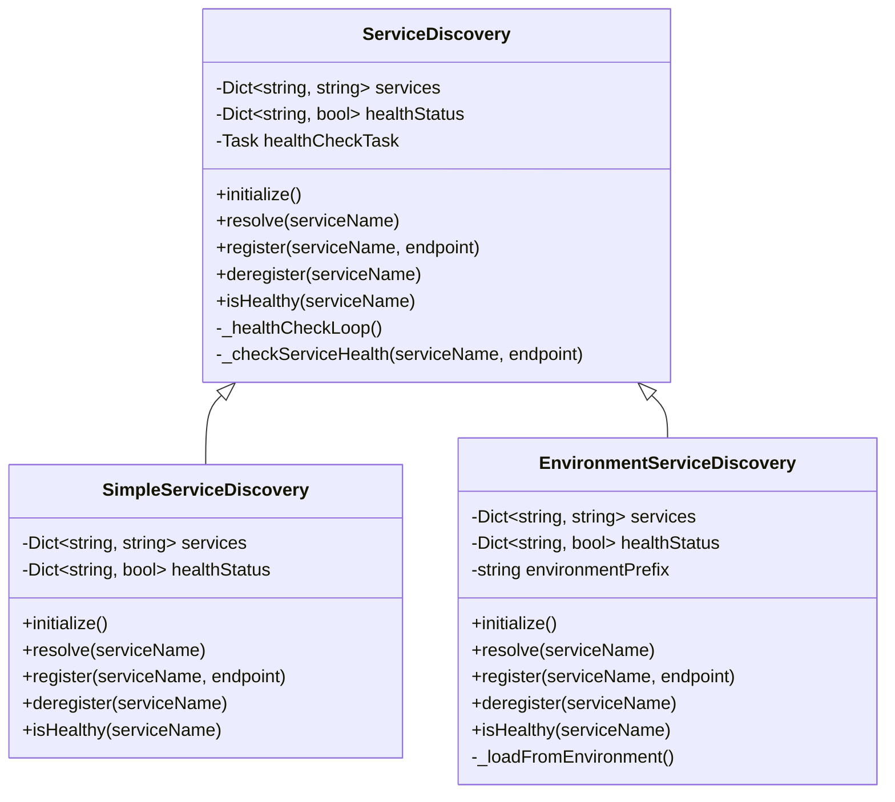
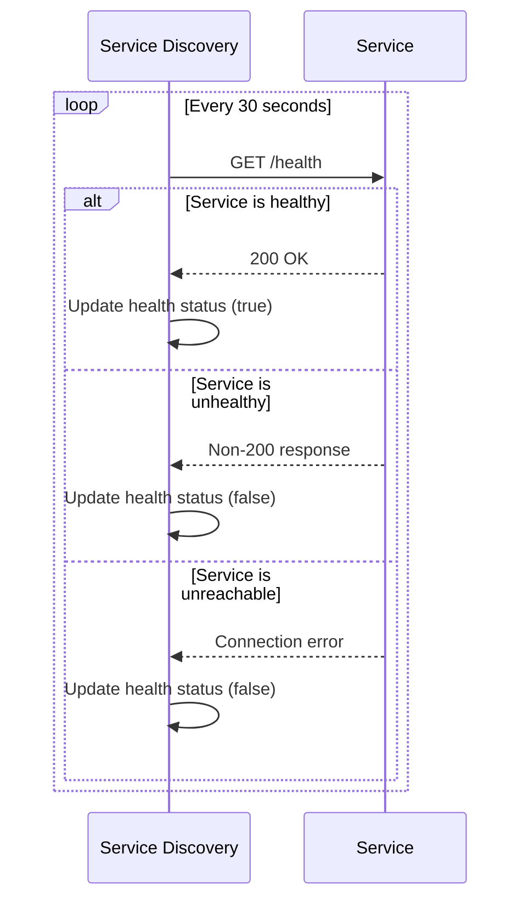

# Service Discovery

## Overview

This document provides a comprehensive guide to the Service Discovery system implemented in Phase 4 of the Cortex Core. Service Discovery enables dynamic location of distributed services, allowing the system to operate without hardcoded service endpoints and facilitating independent deployment and scaling of services.

In alignment with our core design principles, this implementation provides a simple yet robust solution that avoids unnecessary complexity while supporting the essential functions needed for a distributed architecture. The Service Discovery system enables services to register their presence and clients to discover available services at runtime.

## Core Responsibilities

The Service Discovery system has several key responsibilities:

1. **Service Registration**: Allow services to register their endpoints when they come online
2. **Service Resolution**: Provide clients with the correct endpoint for a requested service
3. **Health Checking**: Monitor service health and availability
4. **Environment Integration**: Support different configurations across environments
5. **Fallback Mechanisms**: Provide graceful degradation when services are unavailable

## Architecture

The Service Discovery architecture consists of several key components:



## Interface Definition

### Service Discovery Interface

```python
from typing import Dict, Optional
import asyncio

class ServiceDiscovery:
    """Interface for service discovery."""

    async def initialize(self) -> None:
        """Initialize the service discovery system."""
        pass

    async def resolve(self, service_name: str) -> Optional[str]:
        """
        Resolve a service name to an endpoint.

        Args:
            service_name: Name of the service

        Returns:
            Service endpoint URL or None if not found
        """
        pass

    async def register(self, service_name: str, endpoint: str) -> None:
        """
        Register a service endpoint.

        Args:
            service_name: Name of the service
            endpoint: Service endpoint URL
        """
        pass

    async def deregister(self, service_name: str) -> None:
        """
        Deregister a service.

        Args:
            service_name: Name of the service
        """
        pass

    async def is_healthy(self, service_name: str) -> bool:
        """
        Check if a service is healthy.

        Args:
            service_name: Name of the service

        Returns:
            True if the service is healthy, False otherwise
        """
        pass

    async def get_all(self) -> Dict[str, str]:
        """
        Get all registered services.

        Returns:
            Dictionary of service names to endpoints
        """
        pass

    async def shutdown(self) -> None:
        """Shutdown the service discovery system."""
        pass
```

## Implementation Options

Phase 4 provides two primary implementations of the Service Discovery interface:

1. **SimpleServiceDiscovery**: A basic in-memory implementation for development and testing
2. **EnvironmentServiceDiscovery**: An implementation that loads service endpoints from environment variables

Both implementations follow the same interface and can be used interchangeably, allowing for flexibility in different deployment scenarios.

### Simple Service Discovery

The SimpleServiceDiscovery class provides a straightforward in-memory implementation of service discovery:

```python
import asyncio
import logging
import httpx
from typing import Dict, Optional, Set

logger = logging.getLogger(__name__)

class SimpleServiceDiscovery:
    """
    Simple in-memory service discovery implementation.

    This implementation stores service endpoints in memory and provides
    basic health checking functionality.
    """

    def __init__(self):
        """Initialize the service discovery instance."""
        self.services: Dict[str, str] = {}
        self.health_status: Dict[str, bool] = {}
        self.health_check_task: Optional[asyncio.Task] = None
        self._shutdown_event = asyncio.Event()

    async def initialize(self) -> None:
        """Initialize the service discovery system."""
        # Start background health checking
        self.health_check_task = asyncio.create_task(self._health_check_loop())
        logger.info("Service discovery initialized")

    async def resolve(self, service_name: str) -> Optional[str]:
        """
        Resolve a service name to an endpoint.

        Args:
            service_name: Name of the service

        Returns:
            Service endpoint URL or None if not found
        """
        endpoint = self.services.get(service_name)
        if not endpoint:
            logger.warning(f"Service '{service_name}' not found in service discovery")
            return None

        logger.debug(f"Resolved service '{service_name}' to '{endpoint}'")
        return endpoint

    async def register(self, service_name: str, endpoint: str) -> None:
        """
        Register a service endpoint.

        Args:
            service_name: Name of the service
            endpoint: Service endpoint URL
        """
        self.services[service_name] = endpoint
        self.health_status[service_name] = None  # Unknown health status initially
        logger.info(f"Registered service '{service_name}' at '{endpoint}'")

        # Trigger an immediate health check
        asyncio.create_task(self._check_service_health(service_name, endpoint))

    async def deregister(self, service_name: str) -> None:
        """
        Deregister a service.

        Args:
            service_name: Name of the service
        """
        if service_name in self.services:
            del self.services[service_name]

        if service_name in self.health_status:
            del self.health_status[service_name]

        logger.info(f"Deregistered service '{service_name}'")

    async def is_healthy(self, service_name: str) -> bool:
        """
        Check if a service is healthy.

        Args:
            service_name: Name of the service

        Returns:
            True if the service is healthy, False otherwise
        """
        if service_name not in self.health_status:
            return False

        return self.health_status[service_name] == True

    async def get_all(self) -> Dict[str, str]:
        """
        Get all registered services.

        Returns:
            Dictionary of service names to endpoints
        """
        return self.services.copy()

    async def shutdown(self) -> None:
        """Shutdown the service discovery system."""
        # Signal shutdown to the health check loop
        self._shutdown_event.set()

        # Cancel the health check task if it exists
        if self.health_check_task and not self.health_check_task.done():
            self.health_check_task.cancel()
            try:
                await self.health_check_task
            except asyncio.CancelledError:
                pass

        logger.info("Service discovery shut down")

    async def _health_check_loop(self) -> None:
        """Background task for health checking all services."""
        try:
            while not self._shutdown_event.is_set():
                # Check all registered services
                for service_name, endpoint in list(self.services.items()):
                    await self._check_service_health(service_name, endpoint)

                # Wait before next check (30 seconds)
                try:
                    await asyncio.wait_for(self._shutdown_event.wait(), 30)
                except asyncio.TimeoutError:
                    # Timeout is expected, continue with next iteration
                    pass
        except asyncio.CancelledError:
            logger.info("Health check loop cancelled")
            raise
        except Exception as e:
            logger.error(f"Error in health check loop: {e}", exc_info=True)

    async def _check_service_health(self, service_name: str, endpoint: str) -> None:
        """
        Check the health of a specific service.

        Args:
            service_name: Name of the service
            endpoint: Service endpoint URL
        """
        try:
            # Check if the service has a health endpoint
            async with httpx.AsyncClient() as client:
                response = await client.get(
                    f"{endpoint}/health",
                    timeout=5.0
                )

                # Update health status
                healthy = response.status_code == 200
                previous_status = self.health_status.get(service_name)
                self.health_status[service_name] = healthy

                # Log if status changed
                if previous_status is not None and previous_status != healthy:
                    if healthy:
                        logger.info(f"Service '{service_name}' is now healthy")
                    else:
                        logger.warning(f"Service '{service_name}' is now unhealthy")

                # Log initial status
                if previous_status is None:
                    if healthy:
                        logger.info(f"Service '{service_name}' is healthy")
                    else:
                        logger.warning(f"Service '{service_name}' is unhealthy")

        except Exception as e:
            # Any error means the service is unhealthy
            previous_status = self.health_status.get(service_name)
            self.health_status[service_name] = False

            # Log if status changed
            if previous_status is not True:
                logger.warning(f"Service '{service_name}' is unhealthy: {str(e)}")
```

### Environment Service Discovery

The EnvironmentServiceDiscovery class loads service endpoints from environment variables:

```python
import os
import asyncio
import logging
import httpx
from typing import Dict, Optional, Set

logger = logging.getLogger(__name__)

class EnvironmentServiceDiscovery:
    """
    Service discovery implementation that loads service endpoints from environment variables.

    This implementation reads service endpoints from environment variables with a
    specific prefix and provides basic health checking functionality.
    """

    def __init__(self, env_prefix: str = "SERVICE_"):
        """
        Initialize the service discovery instance.

        Args:
            env_prefix: Prefix for environment variables containing service endpoints
        """
        self.services: Dict[str, str] = {}
        self.health_status: Dict[str, bool] = {}
        self.health_check_task: Optional[asyncio.Task] = None
        self._shutdown_event = asyncio.Event()
        self.env_prefix = env_prefix

    async def initialize(self) -> None:
        """Initialize the service discovery system from environment variables."""
        # Load service endpoints from environment variables
        self._load_from_environment()

        # Start background health checking
        self.health_check_task = asyncio.create_task(self._health_check_loop())
        logger.info("Environment service discovery initialized")

    def _load_from_environment(self) -> None:
        """Load service endpoints from environment variables."""
        # Clear existing services
        self.services.clear()
        self.health_status.clear()

        # Find all environment variables with the specified prefix
        for key, value in os.environ.items():
            if key.startswith(self.env_prefix) and value:
                # Extract service name from environment variable
                service_name = key[len(self.env_prefix):].lower()

                # Register service
                self.services[service_name] = value
                self.health_status[service_name] = None  # Unknown health status initially
                logger.info(f"Loaded service '{service_name}' from environment: '{value}'")

    async def resolve(self, service_name: str) -> Optional[str]:
        """
        Resolve a service name to an endpoint.

        Args:
            service_name: Name of the service

        Returns:
            Service endpoint URL or None if not found
        """
        # Normalize service name
        service_name = service_name.lower()

        endpoint = self.services.get(service_name)
        if not endpoint:
            # Check if it's available in environment but not loaded yet
            env_var = f"{self.env_prefix}{service_name.upper()}"
            endpoint = os.environ.get(env_var)

            # Register if found
            if endpoint:
                await self.register(service_name, endpoint)
            else:
                logger.warning(f"Service '{service_name}' not found in service discovery")
                return None

        logger.debug(f"Resolved service '{service_name}' to '{endpoint}'")
        return endpoint

    async def register(self, service_name: str, endpoint: str) -> None:
        """
        Register a service endpoint.

        Args:
            service_name: Name of the service
            endpoint: Service endpoint URL
        """
        # Normalize service name
        service_name = service_name.lower()

        self.services[service_name] = endpoint
        self.health_status[service_name] = None  # Unknown health status initially
        logger.info(f"Registered service '{service_name}' at '{endpoint}'")

        # Trigger an immediate health check
        asyncio.create_task(self._check_service_health(service_name, endpoint))

    async def deregister(self, service_name: str) -> None:
        """
        Deregister a service.

        Args:
            service_name: Name of the service
        """
        # Normalize service name
        service_name = service_name.lower()

        if service_name in self.services:
            del self.services[service_name]

        if service_name in self.health_status:
            del self.health_status[service_name]

        logger.info(f"Deregistered service '{service_name}'")

    async def is_healthy(self, service_name: str) -> bool:
        """
        Check if a service is healthy.

        Args:
            service_name: Name of the service

        Returns:
            True if the service is healthy, False otherwise
        """
        # Normalize service name
        service_name = service_name.lower()

        if service_name not in self.health_status:
            return False

        return self.health_status[service_name] == True

    async def get_all(self) -> Dict[str, str]:
        """
        Get all registered services.

        Returns:
            Dictionary of service names to endpoints
        """
        return self.services.copy()

    async def shutdown(self) -> None:
        """Shutdown the service discovery system."""
        # Signal shutdown to the health check loop
        self._shutdown_event.set()

        # Cancel the health check task if it exists
        if self.health_check_task and not self.health_check_task.done():
            self.health_check_task.cancel()
            try:
                await self.health_check_task
            except asyncio.CancelledError:
                pass

        logger.info("Service discovery shut down")

    async def _health_check_loop(self) -> None:
        """Background task for health checking all services."""
        try:
            while not self._shutdown_event.is_set():
                # Check all registered services
                for service_name, endpoint in list(self.services.items()):
                    await self._check_service_health(service_name, endpoint)

                # Wait before next check (30 seconds)
                try:
                    await asyncio.wait_for(self._shutdown_event.wait(), 30)
                except asyncio.TimeoutError:
                    # Timeout is expected, continue with next iteration
                    pass
        except asyncio.CancelledError:
            logger.info("Health check loop cancelled")
            raise
        except Exception as e:
            logger.error(f"Error in health check loop: {e}", exc_info=True)

    async def _check_service_health(self, service_name: str, endpoint: str) -> None:
        """
        Check the health of a specific service.

        Args:
            service_name: Name of the service
            endpoint: Service endpoint URL
        """
        try:
            # Check if the service has a health endpoint
            async with httpx.AsyncClient() as client:
                response = await client.get(
                    f"{endpoint}/health",
                    timeout=5.0
                )

                # Update health status
                healthy = response.status_code == 200
                previous_status = self.health_status.get(service_name)
                self.health_status[service_name] = healthy

                # Log if status changed
                if previous_status is not None and previous_status != healthy:
                    if healthy:
                        logger.info(f"Service '{service_name}' is now healthy")
                    else:
                        logger.warning(f"Service '{service_name}' is now unhealthy")

        except Exception as e:
            # Any error means the service is unhealthy
            previous_status = self.health_status.get(service_name)
            self.health_status[service_name] = False

            # Log if status changed
            if previous_status is True:
                logger.warning(f"Service '{service_name}' is unhealthy: {str(e)}")
```

## Health Checking

Both service discovery implementations include health checking capabilities to monitor the availability of registered services.

### Health Check Implementation

The health check mechanism consists of several key components:

1. **Health Check Endpoint**: Each service exposes a `/health` endpoint that returns a 200 OK response when healthy
2. **Background Health Checking**: The service discovery system periodically checks the health of all registered services
3. **Health Status Tracking**: The health status of each service is stored and updated based on health check results
4. **Status Change Notification**: Status changes (healthy to unhealthy or vice versa) are logged

### Health Check Flow



### Custom Health Check Logic

For services with custom health check logic, you can extend the service discovery implementation:

```python
class CustomHealthCheckServiceDiscovery(SimpleServiceDiscovery):
    """Service discovery with custom health check logic."""

    async def _check_service_health(self, service_name: str, endpoint: str) -> None:
        """
        Check the health of a specific service with custom logic.

        Args:
            service_name: Name of the service
            endpoint: Service endpoint URL
        """
        # Different health check paths for different services
        health_paths = {
            "memory": "/system/health",
            "cognition": "/status",
            # Default for other services is "/health"
        }

        try:
            # Get the appropriate health check path
            health_path = health_paths.get(service_name, "/health")

            # Perform the health check
            async with httpx.AsyncClient() as client:
                response = await client.get(
                    f"{endpoint}{health_path}",
                    timeout=5.0
                )

                # Update health status
                healthy = response.status_code == 200
                self.health_status[service_name] = healthy

        except Exception as e:
            # Any error means the service is unhealthy
            self.health_status[service_name] = False
            logger.warning(f"Service '{service_name}' is unhealthy: {str(e)}")
```

## Usage Patterns

### Basic Usage in Core Application

```python
import asyncio
from service_discovery import SimpleServiceDiscovery

async def main():
    # Create service discovery
    service_discovery = SimpleServiceDiscovery()

    # Initialize
    await service_discovery.initialize()

    try:
        # Register services
        await service_discovery.register("memory", "http://memory-service:9000")
        await service_discovery.register("cognition", "http://cognition-service:9100")

        # Resolve a service
        memory_endpoint = await service_discovery.resolve("memory")
        if memory_endpoint:
            print(f"Memory service at: {memory_endpoint}")
        else:
            print("Memory service not found")

        # Check health
        is_healthy = await service_discovery.is_healthy("memory")
        print(f"Memory service is {'healthy' if is_healthy else 'unhealthy'}")

        # Get all services
        services = await service_discovery.get_all()
        print(f"All services: {services}")

    finally:
        # Shutdown
        await service_discovery.shutdown()

if __name__ == "__main__":
    asyncio.run(main())
```

### Integration with FastAPI Application

```python
from fastapi import FastAPI, Depends
from service_discovery import EnvironmentServiceDiscovery

app = FastAPI()

# Create service discovery
service_discovery = EnvironmentServiceDiscovery()

@app.on_event("startup")
async def startup():
    """Initialize service discovery on application startup."""
    await service_discovery.initialize()

@app.on_event("shutdown")
async def shutdown():
    """Shutdown service discovery on application shutdown."""
    await service_discovery.shutdown()

# Dependency to get service discovery
async def get_service_discovery():
    """Dependency to get the service discovery instance."""
    return service_discovery

@app.get("/services")
async def list_services(discovery=Depends(get_service_discovery)):
    """List all registered services."""
    services = await discovery.get_all()
    return {"services": services}
```

### Integration with MCP Client

```python
from network_mcp_client import NetworkMcpClient
from service_discovery import SimpleServiceDiscovery

async def create_mcp_client():
    """Create an MCP client with service discovery."""
    # Create service discovery
    service_discovery = SimpleServiceDiscovery()
    await service_discovery.initialize()

    # Register services (or load from environment)
    await service_discovery.register("memory", "http://memory-service:9000")
    await service_discovery.register("cognition", "http://cognition-service:9100")

    # Create MCP client with service discovery
    client = NetworkMcpClient(service_discovery)

    return client, service_discovery
```

### Environment-Based Configuration

When using EnvironmentServiceDiscovery, service endpoints are loaded from environment variables:

```bash
# Service endpoints in environment variables
export SERVICE_MEMORY=http://memory-service:9000
export SERVICE_COGNITION=http://cognition-service:9100
```

```python
from service_discovery import EnvironmentServiceDiscovery

# Create service discovery with default prefix
service_discovery = EnvironmentServiceDiscovery()

# Or with custom prefix
service_discovery = EnvironmentServiceDiscovery(env_prefix="CORTEX_SERVICE_")
```

## Advanced Features

### Multi-Instance Load Balancing

For services with multiple instances, you can implement a load balancing strategy:

```python
class LoadBalancedServiceDiscovery(SimpleServiceDiscovery):
    """Service discovery with load balancing across multiple instances."""

    def __init__(self):
        super().__init__()
        self.service_instances: Dict[str, List[str]] = {}
        self.next_instance: Dict[str, int] = {}

    async def register_instance(self, service_name: str, endpoint: str) -> None:
        """
        Register an instance of a service.

        Args:
            service_name: Name of the service
            endpoint: Service endpoint URL
        """
        if service_name not in self.service_instances:
            self.service_instances[service_name] = []
            self.next_instance[service_name] = 0

        if endpoint not in self.service_instances[service_name]:
            self.service_instances[service_name].append(endpoint)
            logger.info(f"Registered instance of '{service_name}' at '{endpoint}'")

            # Trigger health check for the new instance
            asyncio.create_task(self._check_service_health(service_name, endpoint))

    async def resolve(self, service_name: str) -> Optional[str]:
        """
        Resolve a service name to an endpoint using round-robin load balancing.

        Args:
            service_name: Name of the service

        Returns:
            Service endpoint URL or None if not found
        """
        instances = self.service_instances.get(service_name, [])
        if not instances:
            logger.warning(f"Service '{service_name}' has no registered instances")
            return None

        # Find the next healthy instance using round-robin
        healthy_instances = []
        for endpoint in instances:
            is_healthy = await self._check_instance_health(service_name, endpoint)
            if is_healthy:
                healthy_instances.append(endpoint)

        if not healthy_instances:
            logger.warning(f"No healthy instances of service '{service_name}' available")
            return None

        # Get the next instance index
        idx = self.next_instance[service_name] % len(healthy_instances)
        self.next_instance[service_name] = (idx + 1) % len(healthy_instances)

        endpoint = healthy_instances[idx]
        logger.debug(f"Resolved service '{service_name}' to instance '{endpoint}'")
        return endpoint
```

### Service Registration Enforcement

To ensure all required services are registered:

```python
class RequiredServicesDiscovery(SimpleServiceDiscovery):
    """Service discovery that enforces required services."""

    def __init__(self, required_services: List[str]):
        super().__init__()
        self.required_services = required_services

    async def initialize(self) -> None:
        """Initialize and verify required services."""
        await super().initialize()

        # Check if all required services are registered
        missing_services = []
        for service_name in self.required_services:
            if service_name not in self.services:
                missing_services.append(service_name)

        if missing_services:
            logger.error(f"Missing required services: {', '.join(missing_services)}")
            raise RuntimeError(f"Missing required services: {', '.join(missing_services)}")

        logger.info("All required services are registered")
```

### Health Check Customization

Customize health check behavior:

```python
class CustomHealthCheckServiceDiscovery(SimpleServiceDiscovery):
    """Service discovery with customizable health check behavior."""

    def __init__(self, health_check_interval: int = 30):
        super().__init__()
        self.health_check_interval = health_check_interval

    async def _health_check_loop(self) -> None:
        """Background task for health checking with custom interval."""
        while True:
            # Check all registered services
            for service_name, endpoint in list(self.services.items()):
                await self._check_service_health(service_name, endpoint)

            # Wait with custom interval
            await asyncio.sleep(self.health_check_interval)
```

## Error Handling

### Service Resolution Failures

When a service can't be resolved, the `resolve` method returns `None`. Your application should handle this gracefully:

```python
async def call_service(service_name: str, tool_name: str, arguments: dict):
    """Call a service with proper error handling."""
    # Resolve service
    endpoint = await service_discovery.resolve(service_name)
    if not endpoint:
        logger.error(f"Service '{service_name}' not found")
        raise ServiceNotFoundError(f"Service '{service_name}' not found")

    # Make the call...
```

### Health Check Failures

Health check failures update the service's health status but don't remove the service from registration. This allows for temporary failures without service disruption:

```python
# Check health before calling
is_healthy = await service_discovery.is_healthy(service_name)
if not is_healthy:
    logger.warning(f"Service '{service_name}' is unhealthy")
    # Use fallback or return error
```

### Graceful Degradation

Implement graceful degradation when services are unhealthy:

```python
async def get_context(user_id: str):
    """Get context with graceful degradation."""
    # Resolve cognition service
    endpoint = await service_discovery.resolve("cognition")
    if not endpoint:
        logger.warning("Cognition service not available, using fallback")
        return {"context": [], "fallback": True}

    # Check health
    is_healthy = await service_discovery.is_healthy("cognition")
    if not is_healthy:
        logger.warning("Cognition service unhealthy, using fallback")
        return {"context": [], "fallback": True}

    # Call the healthy service...
```

## Testing

### Unit Testing

```python
import pytest
import asyncio
from unittest.mock import AsyncMock, patch
from service_discovery import SimpleServiceDiscovery

@pytest.fixture
async def discovery():
    """Create a service discovery instance for testing."""
    discovery = SimpleServiceDiscovery()
    # Patch the health check to avoid actual HTTP requests
    with patch.object(discovery, '_check_service_health', AsyncMock()):
        await discovery.initialize()
        yield discovery
        await discovery.shutdown()

@pytest.mark.asyncio
async def test_register_and_resolve(discovery):
    """Test registering and resolving a service."""
    # Register a service
    await discovery.register("test-service", "http://test-service:8000")

    # Resolve the service
    endpoint = await discovery.resolve("test-service")

    # Check the result
    assert endpoint == "http://test-service:8000"

@pytest.mark.asyncio
async def test_deregister(discovery):
    """Test deregistering a service."""
    # Register a service
    await discovery.register("test-service", "http://test-service:8000")

    # Deregister the service
    await discovery.deregister("test-service")

    # Try to resolve the service
    endpoint = await discovery.resolve("test-service")

    # Check that the service was not found
    assert endpoint is None

@pytest.mark.asyncio
async def test_is_healthy(discovery):
    """Test checking service health."""
    # Register a service
    await discovery.register("test-service", "http://test-service:8000")

    # Set health status manually (since health check is mocked)
    discovery.health_status["test-service"] = True

    # Check health
    is_healthy = await discovery.is_healthy("test-service")

    # Check the result
    assert is_healthy is True
```

### Integration Testing

For integration testing, start actual services in containers and test service discovery against them:

```python
import pytest
import asyncio
import httpx
from service_discovery import SimpleServiceDiscovery

@pytest.fixture(scope="module")
async def running_services():
    """Start test services in containers."""
    # Start test services using Docker Compose or similar
    import subprocess
    subprocess.run(["docker-compose", "-f", "test-services.yml", "up", "-d"])

    # Wait for services to start
    await asyncio.sleep(5)

    yield

    # Stop services
    subprocess.run(["docker-compose", "-f", "test-services.yml", "down"])

@pytest.mark.asyncio
async def test_service_discovery_integration(running_services):
    """Test service discovery against actual services."""
    # Create service discovery
    discovery = SimpleServiceDiscovery()
    await discovery.initialize()

    try:
        # Register test services
        await discovery.register("test-memory", "http://localhost:9001")
        await discovery.register("test-cognition", "http://localhost:9101")

        # Wait for health checks to complete
        await asyncio.sleep(2)

        # Check health
        memory_healthy = await discovery.is_healthy("test-memory")
        cognition_healthy = await discovery.is_healthy("test-cognition")

        # Verify health
        assert memory_healthy is True
        assert cognition_healthy is True

        # Resolve services
        memory_endpoint = await discovery.resolve("test-memory")
        cognition_endpoint = await discovery.resolve("test-cognition")

        # Verify endpoints
        assert memory_endpoint == "http://localhost:9001"
        assert cognition_endpoint == "http://localhost:9101"

    finally:
        await discovery.shutdown()
```

## Security Considerations

### Endpoint Validation

Validate service endpoints before registration:

```python
import re

async def register_service(discovery, service_name: str, endpoint: str):
    """Register a service with endpoint validation."""
    # Validate endpoint format
    if not re.match(r'^https?://[\w.-]+(:\d+)?(/[\w.-]*)*$', endpoint):
        raise ValueError(f"Invalid endpoint format: {endpoint}")

    # Validate protocol (require HTTPS in production)
    if os.getenv("ENVIRONMENT") == "production" and not endpoint.startswith("https://"):
        raise ValueError(f"HTTPS required in production: {endpoint}")

    # Register the service
    await discovery.register(service_name, endpoint)
```

### Access Control

In production environments, restrict access to service discovery:

```python
from fastapi import FastAPI, Depends, HTTPException, Security
from fastapi.security import APIKeyHeader

app = FastAPI()

# API key header
API_KEY = os.getenv("SERVICE_DISCOVERY_API_KEY", "dev-key")
api_key_header = APIKeyHeader(name="X-API-Key")

# Dependency to check API key
async def verify_api_key(api_key: str = Security(api_key_header)):
    """Verify the API key."""
    if api_key != API_KEY:
        raise HTTPException(
            status_code=403,
            detail="Invalid API key"
        )
    return api_key

# Protected endpoint
@app.post("/services/{service_name}")
async def register_service(
    service_name: str,
    endpoint: str,
    discovery=Depends(get_service_discovery),
    api_key: str = Depends(verify_api_key)
):
    """Register a service (protected by API key)."""
    await discovery.register(service_name, endpoint)
    return {"status": "registered"}
```

### Network Isolation

Use network policies to control service-to-service communication:

```yaml
# Example Kubernetes network policy
apiVersion: networking.k8s.io/v1
kind: NetworkPolicy
metadata:
  name: service-discovery-policy
spec:
  podSelector:
    matchLabels:
      app: service-discovery
  ingress:
    - from:
        - podSelector:
            matchLabels:
              role: authorized-service
      ports:
        - protocol: TCP
          port: 80
```

## Configuration Options

### Environment Variable Configuration

Configure the service discovery system using environment variables:

```bash
# Service discovery configuration
export SERVICE_DISCOVERY_HEALTH_CHECK_INTERVAL=60  # Health check interval in seconds
export SERVICE_DISCOVERY_HEALTH_CHECK_TIMEOUT=10   # Health check timeout in seconds
export SERVICE_DISCOVERY_ENV_PREFIX=CORTEX_SERVICE_  # Environment variable prefix
```

```python
import os

# Get configuration from environment
health_check_interval = int(os.getenv("SERVICE_DISCOVERY_HEALTH_CHECK_INTERVAL", "30"))
health_check_timeout = float(os.getenv("SERVICE_DISCOVERY_HEALTH_CHECK_TIMEOUT", "5.0"))
env_prefix = os.getenv("SERVICE_DISCOVERY_ENV_PREFIX", "SERVICE_")

# Create service discovery with configuration
discovery = EnvironmentServiceDiscovery(env_prefix=env_prefix)
```

### Configuration File

Load configuration from a file:

```python
import yaml
import os

def load_config(config_path: str = None):
    """Load service discovery configuration from file."""
    # Default config path
    config_path = config_path or os.getenv("SERVICE_DISCOVERY_CONFIG", "config/service_discovery.yaml")

    # Load configuration
    with open(config_path, "r") as f:
        config = yaml.safe_load(f)

    return config

# Create service discovery with configuration
config = load_config()
discovery = SimpleServiceDiscovery()

# Configure from loaded config
for service_name, endpoint in config.get("services", {}).items():
    await discovery.register(service_name, endpoint)
```

Example configuration file:

```yaml
# service_discovery.yaml
services:
  memory: http://memory-service:9000
  cognition: http://cognition-service:9100

health_check:
  interval: 30
  timeout: 5.0
```

## Deployment Patterns

### Docker Compose

Deploy with Docker Compose:

```yaml
# docker-compose.yml
version: "3"

services:
  memory-service:
    image: cortex/memory-service:latest
    ports:
      - "9000:9000"
    environment:
      - PORT=9000
    healthcheck:
      test: ["CMD", "curl", "-f", "http://localhost:9000/health"]
      interval: 30s
      timeout: 10s
      retries: 3
      start_period: 5s

  cognition-service:
    image: cortex/cognition-service:latest
    ports:
      - "9100:9100"
    environment:
      - PORT=9100
      - MEMORY_SERVICE_URL=http://memory-service:9000
    healthcheck:
      test: ["CMD", "curl", "-f", "http://localhost:9100/health"]
      interval: 30s
      timeout: 10s
      retries: 3
      start_period: 5s
    depends_on:
      - memory-service

  cortex-core:
    image: cortex/core:latest
    ports:
      - "8000:8000"
    environment:
      - PORT=8000
      - SERVICE_MEMORY=http://memory-service:9000
      - SERVICE_COGNITION=http://cognition-service:9100
    depends_on:
      - memory-service
      - cognition-service
```

### Kubernetes

Deploy with Kubernetes:

```yaml
# kubernetes/memory-service.yaml
apiVersion: apps/v1
kind: Deployment
metadata:
  name: memory-service
spec:
  replicas: 2
  selector:
    matchLabels:
      app: memory-service
  template:
    metadata:
      labels:
        app: memory-service
    spec:
      containers:
        - name: memory-service
          image: cortex/memory-service:latest
          ports:
            - containerPort: 9000
          env:
            - name: PORT
              value: "9000"
          readinessProbe:
            httpGet:
              path: /health
              port: 9000
            initialDelaySeconds: 5
            periodSeconds: 10
          livenessProbe:
            httpGet:
              path: /health
              port: 9000
            initialDelaySeconds: 15
            periodSeconds: 30
---
apiVersion: v1
kind: Service
metadata:
  name: memory-service
spec:
  selector:
    app: memory-service
  ports:
    - port: 9000
      targetPort: 9000
  type: ClusterIP
```

## Best Practices

### Service Naming Conventions

Use consistent naming conventions:

- Lowercase, hyphen-separated service names (e.g., `memory-service`)
- Short, descriptive names that indicate the service's purpose
- Consistent naming across environment variables, code, and documentation

Example:

```python
# Good: Consistent naming
await service_discovery.register("memory", "http://memory-service:9000")
await service_discovery.register("cognition", "http://cognition-service:9100")

# Bad: Inconsistent naming
await service_discovery.register("MemoryService", "http://memory-service:9000")
await service_discovery.register("cognition_service", "http://cognition-service:9100")
```

### Environment-Specific Configuration

Load different configurations based on the environment:

```python
import os

# Get environment
environment = os.getenv("ENVIRONMENT", "development")

# Create appropriate service discovery
if environment == "development":
    # Simple in-memory for development
    discovery = SimpleServiceDiscovery()

    # Register local services
    await discovery.register("memory", "http://localhost:9000")
    await discovery.register("cognition", "http://localhost:9100")

elif environment == "testing":
    # Load from test configuration
    discovery = EnvironmentServiceDiscovery(env_prefix="TEST_SERVICE_")

elif environment == "production":
    # Load from production environment variables
    discovery = EnvironmentServiceDiscovery(env_prefix="PROD_SERVICE_")
```

### Health Check Retry Logic

Implement retry logic in health checks to avoid false negatives:

```python
class RetryHealthCheckServiceDiscovery(SimpleServiceDiscovery):
    """Service discovery with retry logic for health checks."""

    async def _check_service_health(self, service_name: str, endpoint: str) -> None:
        """Check service health with retry logic."""
        # Try up to 3 times
        for attempt in range(3):
            try:
                # Check service health
                async with httpx.AsyncClient() as client:
                    response = await client.get(
                        f"{endpoint}/health",
                        timeout=5.0
                    )

                    # Update health status on success
                    healthy = response.status_code == 200
                    self.health_status[service_name] = healthy
                    return

            except Exception as e:
                # Log attempt failure
                logger.debug(f"Health check attempt {attempt + 1} failed for '{service_name}': {e}")

                # If this is the last attempt, mark as unhealthy
                if attempt == 2:
                    self.health_status[service_name] = False
                    logger.warning(f"Service '{service_name}' is unhealthy after 3 attempts: {e}")
                else:
                    # Wait before retry
                    await asyncio.sleep(1)
```

### Graceful Startup

Implement graceful startup to wait for required services:

```python
async def wait_for_services(discovery, required_services: List[str], timeout: int = 60):
    """Wait for required services to become available and healthy."""
    logger.info(f"Waiting for services: {', '.join(required_services)}")

    start_time = time.time()
    while time.time() - start_time < timeout:
        # Check if all services are available and healthy
        all_available = True
        for service_name in required_services:
            endpoint = await discovery.resolve(service_name)
            if not endpoint:
                all_available = False
                break

            healthy = await discovery.is_healthy(service_name)
            if not healthy:
                all_available = False
                break

        if all_available:
            logger.info("All required services are available and healthy")
            return True

        # Wait before checking again
        await asyncio.sleep(1)

    # Timeout reached
    missing = []
    unhealthy = []
    for service_name in required_services:
        endpoint = await discovery.resolve(service_name)
        if not endpoint:
            missing.append(service_name)
        else:
            healthy = await discovery.is_healthy(service_name)
            if not healthy:
                unhealthy.append(service_name)

    if missing:
        logger.error(f"Missing services: {', '.join(missing)}")
    if unhealthy:
        logger.error(f"Unhealthy services: {', '.join(unhealthy)}")

    return False
```

## Common Pitfalls and Solutions

### 1. Hardcoded Service Endpoints

**Pitfall**: Using hardcoded service endpoints in the code.

**Solution**: Always use service discovery to resolve endpoints:

```python
# Bad: Hardcoded endpoint
response = await httpx.get("http://memory-service:9000/endpoint")

# Good: Resolve endpoint dynamically
endpoint = await service_discovery.resolve("memory")
if endpoint:
    response = await httpx.get(f"{endpoint}/endpoint")
else:
    # Handle missing service gracefully
```

### 2. Missing Health Checks

**Pitfall**: Not checking service health before making requests.

**Solution**: Check health status before calling services:

```python
# Resolve service
endpoint = await service_discovery.resolve("memory")
if not endpoint:
    logger.error("Memory service not found")
    return {"error": "Service unavailable"}

# Check health
is_healthy = await service_discovery.is_healthy("memory")
if not is_healthy:
    logger.warning("Memory service is unhealthy")
    # Use fallback or return error
```

### 3. No Fallback Mechanism

**Pitfall**: Not having a fallback when services are unavailable.

**Solution**: Implement fallback strategies:

```python
async def get_user_data(user_id: str):
    """Get user data with fallback."""
    try:
        # Try memory service first
        memory_endpoint = await service_discovery.resolve("memory")
        if memory_endpoint and await service_discovery.is_healthy("memory"):
            # Call memory service
            # ...
            return data
    except Exception as e:
        logger.error(f"Error calling memory service: {e}")

    # Fallback to local cache
    return get_cached_user_data(user_id)
```

### 4. Improper Error Handling

**Pitfall**: Not handling service discovery errors properly.

**Solution**: Implement comprehensive error handling:

```python
try:
    # Resolve service
    endpoint = await service_discovery.resolve("memory")
    if not endpoint:
        # Handle missing service
        return {"error": "Service not found"}

    # Make the request
    async with httpx.AsyncClient() as client:
        response = await client.get(f"{endpoint}/data")

        # Handle error response
        if response.status_code != 200:
            logger.error(f"Service error: {response.status_code}")
            return {"error": "Service error", "status": response.status_code}

        # Process successful response
        return response.json()

except Exception as e:
    # Handle any other errors
    logger.error(f"Error calling service: {e}")
    return {"error": "Service communication error"}
```

### 5. Not Shutting Down Properly

**Pitfall**: Not shutting down service discovery properly, leaving background tasks running.

**Solution**: Always shut down service discovery in application shutdown handlers:

```python
# In FastAPI application
@app.on_event("shutdown")
async def shutdown():
    """Shutdown handlers for application shutdown."""
    # Shutdown service discovery
    if hasattr(app, "service_discovery"):
        await app.service_discovery.shutdown()
```

### 6. Race Conditions During Startup

**Pitfall**: Services starting before dependencies are ready.

**Solution**: Use startup dependencies and wait for required services:

```python
@app.on_event("startup")
async def startup():
    """Startup handler for application."""
    # Initialize service discovery
    app.service_discovery = EnvironmentServiceDiscovery()
    await app.service_discovery.initialize()

    # Wait for required services
    required_services = ["memory", "cognition"]
    services_ready = await wait_for_services(app.service_discovery, required_services)

    if not services_ready:
        # Log error but continue (services might become available later)
        logger.error("Not all required services are ready")
```

## Example: Complete Service Integration

```python
import asyncio
import logging
from fastapi import FastAPI, Depends, HTTPException
from service_discovery import EnvironmentServiceDiscovery
from network_mcp_client import NetworkMcpClient, ServiceCallError, CircuitOpenError

# Configure logging
logging.basicConfig(
    level=logging.INFO,
    format="%(asctime)s - %(name)s - %(levelname)s - %(message)s"
)
logger = logging.getLogger(__name__)

# Create FastAPI application
app = FastAPI()

# Create service discovery
service_discovery = EnvironmentServiceDiscovery()

# Background tasks
background_tasks = set()

@app.on_event("startup")
async def startup():
    """Startup handler for application."""
    # Initialize service discovery
    await service_discovery.initialize()

    # Register service discovery in app state
    app.state.service_discovery = service_discovery

    # Create MCP client
    app.state.mcp_client = NetworkMcpClient(service_discovery)

    # Start background health check task
    task = asyncio.create_task(health_check_loop())
    background_tasks.add(task)
    task.add_done_callback(background_tasks.discard)

@app.on_event("shutdown")
async def shutdown():
    """Shutdown handler for application."""
    # Cancel background tasks
    for task in background_tasks:
        task.cancel()

    # Shutdown service discovery
    await app.state.service_discovery.shutdown()

    # Close MCP client
    await app.state.mcp_client.close()

async def health_check_loop():
    """Background task to periodically check and log service health."""
    while True:
        try:
            # Get all services
            services = await service_discovery.get_all()

            # Log health status
            for service_name in services:
                is_healthy = await service_discovery.is_healthy(service_name)
                status = "healthy" if is_healthy else "unhealthy"
                logger.info(f"Service '{service_name}' is {status}")

            # Wait before next check
            await asyncio.sleep(60)

        except asyncio.CancelledError:
            logger.info("Health check loop cancelled")
            break

        except Exception as e:
            logger.error(f"Error in health check loop: {e}")
            await asyncio.sleep(10)  # Wait before retry

# Dependency to get MCP client
async def get_mcp_client():
    """Get the MCP client from app state."""
    return app.state.mcp_client

@app.get("/services")
async def list_services():
    """List all registered services and their health status."""
    services = await service_discovery.get_all()

    # Get health status for each service
    result = {}
    for service_name, endpoint in services.items():
        is_healthy = await service_discovery.is_healthy(service_name)
        result[service_name] = {
            "endpoint": endpoint,
            "healthy": is_healthy
        }

    return {"services": result}

@app.post("/input")
async def process_input(
    data: dict,
    mcp_client: NetworkMcpClient = Depends(get_mcp_client)
):
    """Process input using the Memory Service."""
    try:
        # Call memory service to store input
        result = await mcp_client.call_tool(
            service_name="memory",
            tool_name="store_input",
            arguments={
                "user_id": data.get("user_id", "anonymous"),
                "input_data": data
            }
        )

        return {"status": "success", "result": result}

    except CircuitOpenError:
        # Memory service circuit is open (service is failing)
        logger.error("Memory service circuit is open")
        raise HTTPException(
            status_code=503,
            detail="Memory service is currently unavailable"
        )

    except ServiceCallError as e:
        # Other service error
        logger.error(f"Error calling memory service: {e}")
        raise HTTPException(
            status_code=500,
            detail=f"Service error: {str(e)}"
        )

@app.get("/context/{user_id}")
async def get_context(
    user_id: str,
    mcp_client: NetworkMcpClient = Depends(get_mcp_client)
):
    """Get context using the Cognition Service."""
    try:
        # Check if cognition service is available
        cognition_endpoint = await service_discovery.resolve("cognition")
        if not cognition_endpoint:
            logger.warning("Cognition service not found")
            return {"context": [], "status": "fallback"}

        # Check if cognition service is healthy
        is_healthy = await service_discovery.is_healthy("cognition")
        if not is_healthy:
            logger.warning("Cognition service is unhealthy")
            return {"context": [], "status": "fallback"}

        # Call cognition service to get context
        result = await mcp_client.call_tool(
            service_name="cognition",
            tool_name="get_context",
            arguments={"user_id": user_id}
        )

        return {"status": "success", "context": result.get("context", [])}

    except CircuitOpenError:
        # Cognition service circuit is open (service is failing)
        logger.warning("Cognition service circuit is open, using fallback")
        return {"context": [], "status": "fallback"}

    except ServiceCallError as e:
        # Other service error
        logger.error(f"Error calling cognition service: {e}")
        return {"context": [], "status": "error", "message": str(e)}
```

## Conclusion

The Service Discovery system is a critical component of the distributed architecture in Phase 4 of the Cortex Core. It enables dynamic location of services without hardcoded endpoints, facilitating independent deployment and scaling of services.

By implementing a simple yet robust service discovery mechanism, the system maintains the core design principle of ruthless simplicity while providing the essential functions needed for a distributed architecture. The flexibility of the implementation allows for different deployment scenarios, from development to production, without compromising functionality.

Key takeaways:

1. **Simple Interface**: Clear and consistent interface for service registration and resolution
2. **Health Checking**: Built-in health monitoring to detect service availability
3. **Environment Integration**: Support for environment-based configuration
4. **Graceful Degradation**: Strategies for handling service unavailability
5. **Minimal Dependencies**: No external systems required for basic functionality

The service discovery implementation provides a solid foundation for the distributed architecture in Phase 4, enabling the transition from in-process to network-based services while maintaining system reliability and simplicity.
