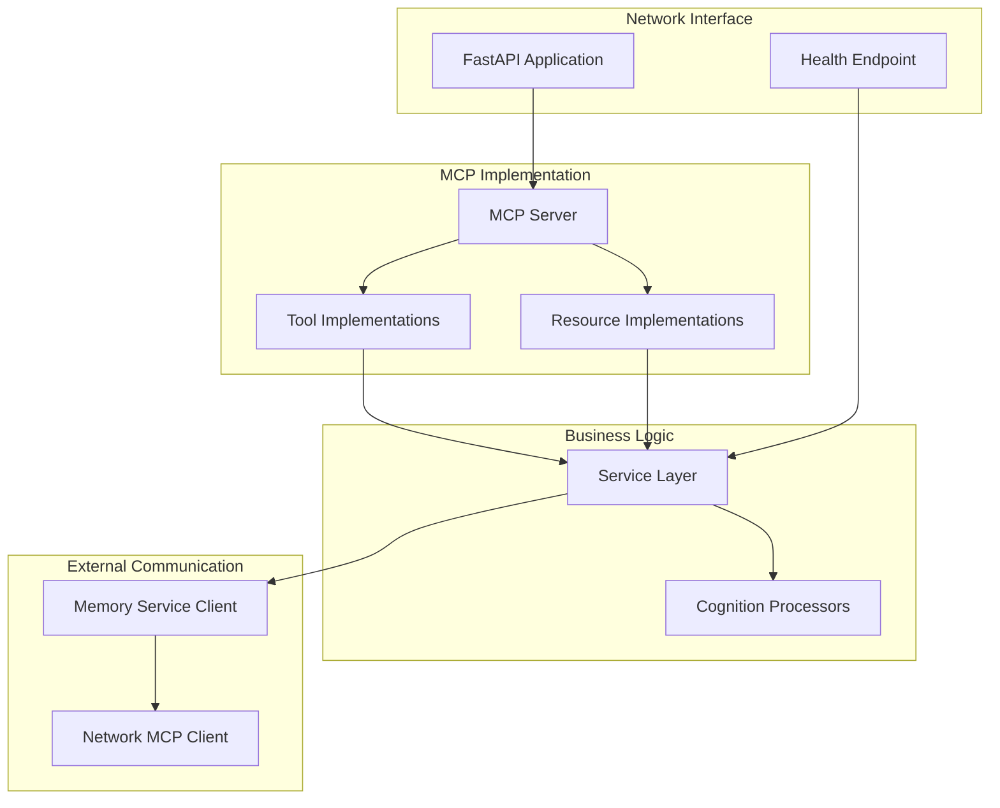
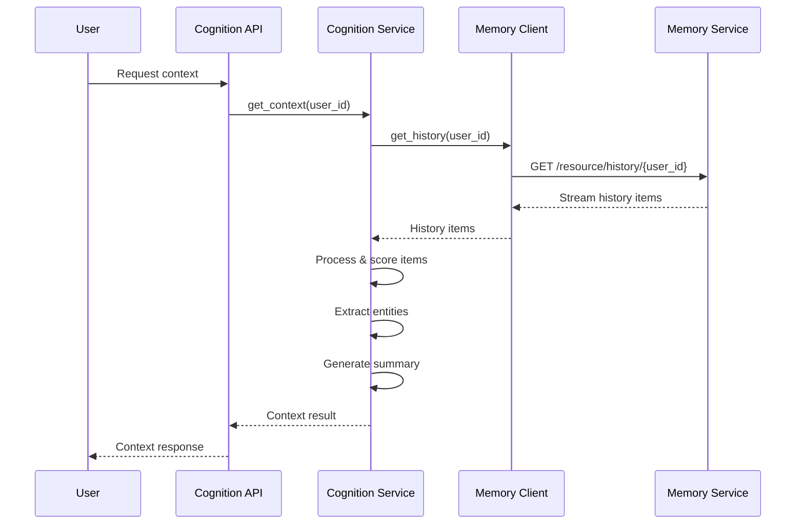
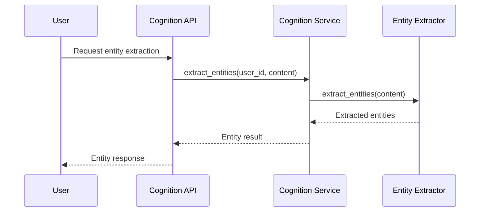

# Standalone Cognition Service

## Overview

The Standalone Cognition Service is a key component of Phase 4, responsible for generating contextually relevant information based on user history and input. This document provides comprehensive implementation guidance for transforming the in-process Cognition Service from Phase 3 into a fully independent, network-accessible service.

The Cognition Service acts as the system's intelligence layer, analyzing user data and generating relevant context for responses. As a standalone service, it runs in its own process, communicates over the network using HTTP and SSE, and integrates with the Memory Service to access user history. This implementation maintains the same MCP interface established in Phase 3 while enabling independent scaling and deployment.

### Core Responsibilities

1. **Context Generation**: Analyze user data to generate relevant context
2. **Relevance Scoring**: Rank items by relevance to current queries or conversations
3. **Data Summarization**: Provide concise summaries of conversation history
4. **Entity Recognition**: Identify important entities in user interactions
5. **MCP Protocol Implementation**: Expose tools and resources via HTTP and SSE
6. **Health Monitoring**: Provide health status information

### Transition from In-Process to Standalone

The Cognition Service transitions from an in-process component to a standalone service:

| Aspect            | Phase 3 (In-Process)           | Phase 4 (Standalone)          |
| ----------------- | ------------------------------ | ----------------------------- |
| **Process**       | Part of main application       | Independent process           |
| **Communication** | Direct function calls          | HTTP and SSE over network     |
| **Memory Access** | Direct repository access       | Via Memory Service MCP client |
| **Configuration** | Part of main application       | Independent configuration     |
| **Deployment**    | Deployed with main application | Independently deployable      |
| **Scaling**       | Scales with main application   | Independently scalable        |

## Architecture

The Standalone Cognition Service follows a layered architecture that separates concerns and maintains clean interfaces:



### Key Components

#### 1. FastAPI Application

The top-level component that:

- Creates and configures the FastAPI application
- Sets up middleware (CORS, logging, etc.)
- Registers MCP endpoints
- Configures health check endpoint
- Handles application lifecycle (startup/shutdown)

#### 2. MCP Server

The MCP protocol implementation that:

- Registers tool and resource handlers
- Routes HTTP requests to appropriate tool handlers
- Streams resource data via SSE connections
- Handles error responses and serialization

#### 3. Tool Implementations

The business logic for MCP tools:

- `get_context`: Generate context based on user history
- `analyze_conversation`: Analyze conversation data
- `summarize_history`: Generate summaries of conversation history
- `extract_entities`: Extract named entities from text
- Additional tools as needed

#### 4. Resource Implementations

The data access for MCP resources:

- `context/{user_id}`: Streams context for a user
- `entities/{user_id}`: Streams entity data for a user
- Additional resources as needed

#### 5. Service Layer

The business logic layer that:

- Coordinates operations between components
- Implements core cognition algorithms
- Manages access to the Memory Service
- Handles error recovery and fallbacks

#### 6. Cognition Processors

Specialized components that:

- Implement context generation algorithms
- Score relevance of history items
- Extract entities from text
- Generate summaries
- Analyze sentiment and intent

#### 7. Memory Service Client

Client for the Memory Service that:

- Retrieves user history from the Memory Service
- Handles communication errors and retries
- Implements connection pooling and failure recovery

#### 8. Health Check Endpoint

The monitoring endpoint that:

- Verifies Memory Service connectivity
- Checks processor status
- Reports service health metrics

## Folder Structure

```
cognition-service/
├── app/
│   ├── __init__.py
│   ├── main.py                  # Application entry point
│   ├── config.py                # Configuration settings
│   ├── mcp/
│   │   ├── __init__.py
│   │   ├── server.py            # MCP server implementation
│   │   ├── tools.py             # Tool implementations
│   │   └── resources.py         # Resource implementations
│   ├── api/
│   │   ├── __init__.py
│   │   └── health.py            # Health check endpoint
│   ├── services/
│   │   ├── __init__.py
│   │   ├── cognition_service.py # Service layer implementation
│   │   └── exceptions.py        # Service exceptions
│   ├── processors/
│   │   ├── __init__.py
│   │   ├── context_processor.py # Context generation logic
│   │   ├── relevance_scorer.py  # Relevance scoring logic
│   │   ├── entity_extractor.py  # Entity extraction logic
│   │   └── summarizer.py        # Summarization logic
│   ├── clients/
│   │   ├── __init__.py
│   │   ├── memory_client.py     # Memory Service client
│   │   └── exceptions.py        # Client exceptions
│   └── utils/
│       ├── __init__.py
│       ├── auth.py              # Auth utilities
│       └── logging.py           # Logging configuration
├── tests/
│   ├── __init__.py
│   ├── conftest.py              # Test fixtures
│   ├── unit/
│   │   ├── __init__.py
│   │   ├── test_tools.py        # Unit tests for tools
│   │   ├── test_resources.py    # Unit tests for resources
│   │   └── test_processors.py   # Unit tests for processors
│   └── integration/
│       ├── __init__.py
│       ├── test_api.py          # Integration tests for API
│       └── test_memory_client.py # Integration tests for memory client
├── Dockerfile                   # Container definition
├── requirements.txt             # Dependencies
├── .env.example                 # Example environment variables
└── README.md                    # Service documentation
```

## Detailed Implementation

### 1. Configuration (config.py)

```python
import os
from pydantic import BaseSettings, validator

class Settings(BaseSettings):
    """
    Configuration settings for the Cognition Service.
    Loads from environment variables with fallbacks.
    """
    # Service settings
    SERVICE_NAME: str = "Cognition Service"
    HOST: str = "0.0.0.0"
    PORT: int = int(os.getenv("PORT", "9100"))
    DEBUG: bool = os.getenv("DEBUG", "False").lower() == "true"
    LOG_LEVEL: str = os.getenv("LOG_LEVEL", "INFO")

    # Memory Service settings
    MEMORY_SERVICE_URL: str = os.getenv("MEMORY_SERVICE_URL", "http://localhost:9000")
    MEMORY_REQUEST_TIMEOUT: int = int(os.getenv("MEMORY_REQUEST_TIMEOUT", "10"))
    MAX_RETRIES: int = int(os.getenv("MAX_RETRIES", "3"))
    RETRY_BACKOFF: float = float(os.getenv("RETRY_BACKOFF", "1.5"))

    # Context generation settings
    DEFAULT_CONTEXT_LIMIT: int = int(os.getenv("DEFAULT_CONTEXT_LIMIT", "10"))
    MIN_RELEVANCE_SCORE: float = float(os.getenv("MIN_RELEVANCE_SCORE", "0.2"))
    RECENT_WEIGHT: float = float(os.getenv("RECENT_WEIGHT", "1.2"))
    SIMILARITY_WEIGHT: float = float(os.getenv("SIMILARITY_WEIGHT", "0.8"))

    # API settings
    CORS_ORIGINS: list = os.getenv("CORS_ORIGINS", "*").split(",")
    MAX_REQUEST_SIZE: int = int(os.getenv("MAX_REQUEST_SIZE", "1048576"))  # 1MB

    # Security settings
    AUTH_ENABLED: bool = os.getenv("AUTH_ENABLED", "True").lower() == "true"
    JWT_SECRET_KEY: str = os.getenv("JWT_SECRET_KEY", "development-secret-key")

    @validator("MEMORY_SERVICE_URL")
    def validate_memory_url(cls, v):
        """Validate Memory Service URL."""
        if not v.startswith(("http://", "https://")):
            raise ValueError("MEMORY_SERVICE_URL must start with http:// or https://")
        return v

    class Config:
        env_file = ".env"
        env_file_encoding = "utf-8"

# Create settings instance
settings = Settings()
```

### 2. Memory Service Client (clients/memory_client.py)

```python
import logging
import httpx
import asyncio
import json
from typing import Dict, Any, List, Optional, AsyncGenerator
from app.config import settings
from app.clients.exceptions import (
    MemoryServiceError, MemoryServiceUnavailableError,
    MemoryItemNotFoundError, MemoryRequestError
)

# Create logger
logger = logging.getLogger(__name__)

class MemoryServiceClient:
    """
    Client for interacting with the Memory Service.

    Uses HTTP for tool calls and SSE for resource streaming.
    Includes retry logic for transient failures.
    """
    def __init__(self):
        """Initialize the Memory Service client."""
        self.base_url = settings.MEMORY_SERVICE_URL
        self.timeout = settings.MEMORY_REQUEST_TIMEOUT
        self.max_retries = settings.MAX_RETRIES
        self.retry_backoff = settings.RETRY_BACKOFF
        self.client = httpx.AsyncClient(
            base_url=self.base_url,
            timeout=self.timeout
        )

    async def get_history(self, user_id: str, limit: Optional[int] = None) -> List[Dict[str, Any]]:
        """
        Get history items for a user from the Memory Service.

        Args:
            user_id: The user ID
            limit: Maximum number of items to retrieve

        Returns:
            List of history items

        Raises:
            MemoryServiceUnavailableError: If Memory Service is unavailable
            MemoryRequestError: If request fails for other reasons
        """
        # Build resource path
        path = f"history/{user_id}"
        if limit:
            path = f"history/{user_id}/limit/{limit}"

        try:
            # Collect items from SSE stream
            items = []
            async for item in self.stream_resource(path):
                items.append(item)

            return items
        except Exception as e:
            logger.error(f"Failed to get history: {str(e)}")
            raise

    async def store_input(self, user_id: str, input_data: Dict[str, Any]) -> Dict[str, Any]:
        """
        Store input data in the Memory Service.

        Args:
            user_id: The user ID
            input_data: The input data to store

        Returns:
            Status information

        Raises:
            MemoryServiceUnavailableError: If Memory Service is unavailable
            MemoryRequestError: If request fails for other reasons
        """
        try:
            # Call store_input tool
            return await self.call_tool(
                "store_input",
                {
                    "user_id": user_id,
                    "input_data": input_data
                }
            )
        except Exception as e:
            logger.error(f"Failed to store input: {str(e)}")
            raise

    async def get_item(self, item_id: str, user_id: str) -> Dict[str, Any]:
        """
        Get a specific item from the Memory Service.

        Args:
            item_id: The item ID
            user_id: The user ID

        Returns:
            The item data

        Raises:
            MemoryItemNotFoundError: If item not found
            MemoryServiceUnavailableError: If Memory Service is unavailable
            MemoryRequestError: If request fails for other reasons
        """
        try:
            # Call get_item tool
            return await self.call_tool(
                "get_item",
                {
                    "user_id": user_id,
                    "item_id": item_id
                }
            )
        except MemoryRequestError as e:
            if "not found" in str(e).lower():
                raise MemoryItemNotFoundError(f"Item {item_id} not found")
            raise
        except Exception as e:
            logger.error(f"Failed to get item: {str(e)}")
            raise

    async def call_tool(self, tool_name: str, arguments: Dict[str, Any]) -> Dict[str, Any]:
        """
        Call a tool on the Memory Service with retry logic.

        Args:
            tool_name: The tool name
            arguments: The tool arguments

        Returns:
            The tool result

        Raises:
            MemoryServiceUnavailableError: If Memory Service is unavailable
            MemoryRequestError: If request fails for other reasons
        """
        retries = 0

        while True:
            try:
                # Make request
                response = await self.client.post(
                    f"/tool/{tool_name}",
                    json={"arguments": arguments}
                )

                # Check for error status
                if response.status_code >= 400:
                    # Parse error from response if possible
                    try:
                        error_data = response.json().get("error", {})
                        error_message = error_data.get("message", f"HTTP {response.status_code}")
                        raise MemoryRequestError(error_message)
                    except (json.JSONDecodeError, AttributeError):
                        # Fallback if error can't be parsed
                        raise MemoryRequestError(f"HTTP {response.status_code}")

                # Parse and return response data
                data = response.json()
                return data.get("result", {})

            except (httpx.ConnectError, httpx.TimeoutError) as e:
                retries += 1

                # Check if max retries reached
                if retries >= self.max_retries:
                    logger.error(f"Memory Service unavailable after {retries} retries")
                    raise MemoryServiceUnavailableError("Memory Service unavailable")

                # Exponential backoff
                wait_time = self.retry_backoff ** retries
                logger.warning(f"Retrying Memory Service call after {wait_time:.2f}s (attempt {retries}/{self.max_retries})")
                await asyncio.sleep(wait_time)

            except Exception as e:
                if retries >= self.max_retries:
                    raise MemoryRequestError(f"Failed to call Memory Service: {str(e)}")

                retries += 1
                # Exponential backoff
                wait_time = self.retry_backoff ** retries
                logger.warning(f"Retrying Memory Service call after {wait_time:.2f}s (attempt {retries}/{self.max_retries})")
                await asyncio.sleep(wait_time)

    async def stream_resource(self, resource_path: str) -> AsyncGenerator[Dict[str, Any], None]:
        """
        Stream a resource from the Memory Service.

        Args:
            resource_path: The resource path

        Yields:
            Resource data items

        Raises:
            MemoryServiceUnavailableError: If Memory Service is unavailable
            MemoryRequestError: If request fails for other reasons
        """
        retries = 0

        while True:
            try:
                # Create streaming request
                async with self.client.stream(
                    "GET",
                    f"/resource/{resource_path}",
                    timeout=None  # No timeout for SSE
                ) as response:
                    # Check for error status
                    if response.status_code >= 400:
                        # Parse error from response if possible
                        try:
                            error_data = await response.json()
                            error_message = error_data.get("error", {}).get("message", f"HTTP {response.status_code}")
                            raise MemoryRequestError(error_message)
                        except (json.JSONDecodeError, AttributeError):
                            # Fallback if error can't be parsed
                            raise MemoryRequestError(f"HTTP {response.status_code}")

                    # Process SSE stream
                    buffer = b""

                    async for chunk in response.aiter_bytes():
                        buffer += chunk

                        # Process complete events
                        if b"\n\n" in buffer:
                            parts = buffer.split(b"\n\n")
                            for i in range(len(parts) - 1):
                                if parts[i].startswith(b"data: "):
                                    try:
                                        # Parse event data
                                        event_data = json.loads(parts[i][6:])
                                        yield event_data
                                    except json.JSONDecodeError as e:
                                        logger.error(f"Failed to parse SSE event: {str(e)}")

                            # Keep remaining data
                            buffer = parts[-1]

                # If we get here, the stream ended normally
                break

            except (httpx.ConnectError, httpx.TimeoutError) as e:
                retries += 1

                # Check if max retries reached
                if retries >= self.max_retries:
                    logger.error(f"Memory Service unavailable after {retries} retries")
                    raise MemoryServiceUnavailableError("Memory Service unavailable")

                # Exponential backoff
                wait_time = self.retry_backoff ** retries
                logger.warning(f"Retrying Memory Service stream after {wait_time:.2f}s (attempt {retries}/{self.max_retries})")
                await asyncio.sleep(wait_time)

            except Exception as e:
                if retries >= self.max_retries:
                    raise MemoryRequestError(f"Failed to stream from Memory Service: {str(e)}")

                retries += 1
                # Exponential backoff
                wait_time = self.retry_backoff ** retries
                logger.warning(f"Retrying Memory Service stream after {wait_time:.2f}s (attempt {retries}/{self.max_retries})")
                await asyncio.sleep(wait_time)

    async def close(self):
        """Close the HTTP client."""
        await self.client.aclose()
```

### 3. Client Exceptions (clients/exceptions.py)

```python
class MemoryServiceError(Exception):
    """Base exception for Memory Service errors."""
    pass

class MemoryServiceUnavailableError(MemoryServiceError):
    """Raised when Memory Service is unavailable."""
    pass

class MemoryRequestError(MemoryServiceError):
    """Raised when a Memory Service request fails."""
    pass

class MemoryItemNotFoundError(MemoryServiceError):
    """Raised when a requested item is not found."""
    pass
```

### 4. Relevance Scorer (processors/relevance_scorer.py)

```python
import logging
from typing import Dict, Any, List, Optional
import math
import time
from datetime import datetime, timezone
from app.config import settings

# Create logger
logger = logging.getLogger(__name__)

class RelevanceScorer:
    """
    Scores the relevance of memory items to the current context.

    Uses multiple factors to calculate relevance:
    - Recency: More recent items are more relevant
    - Content similarity: Items with similar content are more relevant
    - Conversation context: Items from same conversation are more relevant
    """
    def __init__(self):
        """Initialize the relevance scorer."""
        self.recent_weight = settings.RECENT_WEIGHT
        self.similarity_weight = settings.SIMILARITY_WEIGHT
        self.min_score = settings.MIN_RELEVANCE_SCORE

    def score_items(self, items: List[Dict[str, Any]], query: Optional[str] = None,
                    conversation_id: Optional[str] = None) -> List[Dict[str, Any]]:
        """
        Score a list of memory items for relevance.

        Args:
            items: List of memory items to score
            query: Optional query text for content similarity
            conversation_id: Optional conversation ID for context

        Returns:
            List of items with relevance scores added, sorted by relevance
        """
        if not items:
            return []

        # Score each item
        scored_items = []
        max_recency_score = 0

        for item in items:
            # Initialize with base score
            score = 0.0

            # Calculate recency score
            recency_score = self._calculate_recency_score(item)
            max_recency_score = max(max_recency_score, recency_score)

            # Calculate similarity score if query provided
            similarity_score = 0.0
            if query:
                similarity_score = self._calculate_similarity_score(item, query)

            # Calculate conversation context score
            context_score = 0.0
            if conversation_id and item.get("conversation_id") == conversation_id:
                context_score = 1.0

            # Store component scores for debugging/explanation
            item["_recency_score"] = recency_score
            item["_similarity_score"] = similarity_score
            item["_context_score"] = context_score

            # Add to list for normalization
            scored_items.append(item)

        # Normalize recency scores
        if max_recency_score > 0:
            for item in scored_items:
                item["_recency_score"] = item["_recency_score"] / max_recency_score

        # Calculate final scores
        for item in scored_items:
            # Weighted sum of component scores
            item["relevance_score"] = (
                self.recent_weight * item["_recency_score"] +
                self.similarity_weight * item["_similarity_score"] +
                1.0 * item["_context_score"]  # Context weight fixed at 1.0
            ) / (self.recent_weight + self.similarity_weight + 1.0)

            # Remove component scores from returned items
            del item["_recency_score"]
            del item["_similarity_score"]
            del item["_context_score"]

        # Filter by minimum score
        scored_items = [item for item in scored_items if item["relevance_score"] >= self.min_score]

        # Sort by relevance (highest first)
        scored_items.sort(key=lambda x: x["relevance_score"], reverse=True)

        return scored_items

    def _calculate_recency_score(self, item: Dict[str, Any]) -> float:
        """
        Calculate recency score based on item timestamp.

        Args:
            item: The memory item

        Returns:
            Recency score (0.0-1.0)
        """
        try:
            # Extract timestamp
            timestamp_str = item.get("timestamp")
            if not timestamp_str:
                return 0.0

            # Parse timestamp
            timestamp = datetime.fromisoformat(timestamp_str.replace("Z", "+00:00"))

            # Calculate age in hours
            now = datetime.now(timezone.utc)
            age_hours = (now - timestamp).total_seconds() / 3600

            # Exponential decay function: score = exp(-age_hours / half_life)
            # Half-life of 24 hours means score is 0.5 after 24 hours
            half_life = 24.0
            score = math.exp(-age_hours / half_life)

            return score
        except Exception as e:
            logger.warning(f"Error calculating recency score: {str(e)}")
            return 0.0

    def _calculate_similarity_score(self, item: Dict[str, Any], query: str) -> float:
        """
        Calculate content similarity score.

        Args:
            item: The memory item
            query: The query text

        Returns:
            Similarity score (0.0-1.0)
        """
        try:
            # Extract content
            content = item.get("content", "")
            if not content or not query:
                return 0.0

            # Normalize text
            content = content.lower()
            query = query.lower()

            # Simple word overlap for MVP (can be replaced with embedding similarity)
            content_words = set(content.split())
            query_words = set(query.split())

            if not content_words or not query_words:
                return 0.0

            # Jaccard similarity: intersection / union
            intersection = content_words.intersection(query_words)
            union = content_words.union(query_words)

            if not union:
                return 0.0

            return len(intersection) / len(union)
        except Exception as e:
            logger.warning(f"Error calculating similarity score: {str(e)}")
            return 0.0
```

### 5. Entity Extractor (processors/entity_extractor.py)

```python
import logging
import re
from typing import Dict, Any, List, Set

# Create logger
logger = logging.getLogger(__name__)

class EntityExtractor:
    """
    Extracts and categorizes entities from text.

    Uses simple pattern matching for MVP. Can be replaced with
    more sophisticated NLP approaches in the future.
    """
    def __init__(self):
        """Initialize the entity extractor."""
        # Regex patterns for entity types
        self.patterns = {
            "email": r'\b[A-Za-z0-9._%+-]+@[A-Za-z0-9.-]+\.[A-Z|a-z]{2,}\b',
            "url": r'https?://(?:[-\w.]|(?:%[\da-fA-F]{2}))+(?:/\S*)?',
            "date": r'\b\d{4}-\d{2}-\d{2}\b',
            "time": r'\b\d{1,2}:\d{2}(?::\d{2})?\s*(?:AM|PM|am|pm)?\b',
            "phone": r'\b\+?(?:\d{1,3}[- ]?)?\(?\d{3}\)?[- ]?\d{3}[- ]?\d{4}\b',
            "money": r'\$\d+(?:\.\d{2})?|\d+\s*(?:dollars|USD)',
            "percentage": r'\d+(?:\.\d+)?%',
            "person": r'(?:[A-Z][a-z]+\s+){1,2}[A-Z][a-z]+'
        }

        # Compile all patterns
        self.compiled_patterns = {
            entity_type: re.compile(pattern)
            for entity_type, pattern in self.patterns.items()
        }

    def extract_entities(self, text: str) -> List[Dict[str, Any]]:
        """
        Extract entities from text.

        Args:
            text: The text to analyze

        Returns:
            List of extracted entities with type and value
        """
        if not text:
            return []

        entities = []

        # Find entities of each type
        for entity_type, pattern in self.compiled_patterns.items():
            matches = pattern.findall(text)

            # Add unique matches
            for match in set(matches):
                entities.append({
                    "type": entity_type,
                    "value": match,
                    "position": text.find(match)
                })

        # Sort by position in text
        entities.sort(key=lambda x: x["position"])

        # Remove position field
        for entity in entities:
            del entity["position"]

        return entities

    def extract_entities_from_items(self, items: List[Dict[str, Any]]) -> Dict[str, List[Dict[str, Any]]]:
        """
        Extract entities from a list of memory items.

        Args:
            items: List of memory items

        Returns:
            Dictionary of entity types to lists of entity values
        """
        # All extracted entities
        all_entities = []

        # Process each item
        for item in items:
            content = item.get("content", "")
            if content:
                # Extract entities from content
                entities = self.extract_entities(content)
                all_entities.extend(entities)

        # Group by entity type
        entity_groups = {}

        for entity in all_entities:
            entity_type = entity["type"]
            if entity_type not in entity_groups:
                entity_groups[entity_type] = []

            entity_groups[entity_type].append(entity)

        # Remove duplicates
        for entity_type, entities in entity_groups.items():
            # Create set of unique values
            unique_values = set()
            unique_entities = []

            for entity in entities:
                if entity["value"] not in unique_values:
                    unique_values.add(entity["value"])
                    unique_entities.append(entity)

            entity_groups[entity_type] = unique_entities

        return entity_groups
```

### 6. Summarizer (processors/summarizer.py)

```python
import logging
from typing import Dict, Any, List, Optional
from datetime import datetime, timezone
from collections import Counter

# Create logger
logger = logging.getLogger(__name__)

class Summarizer:
    """
    Generates summaries of conversation history.

    Includes:
    - Basic statistics (message count, time span)
    - Topic extraction
    - Key points extraction
    """
    def __init__(self):
        """Initialize the summarizer."""
        # Stop words for topic extraction
        self.stop_words = set([
            "a", "an", "the", "and", "but", "or", "for", "nor", "on", "at", "to", "from",
            "by", "with", "in", "out", "of", "is", "are", "was", "were", "be", "been",
            "being", "have", "has", "had", "do", "does", "did", "i", "you", "he", "she",
            "it", "we", "they", "me", "him", "her", "us", "them", "this", "that", "these",
            "those"
        ])

    def summarize_history(self, items: List[Dict[str, Any]],
                          conversation_id: Optional[str] = None) -> Dict[str, Any]:
        """
        Generate a summary of conversation history.

        Args:
            items: List of memory items
            conversation_id: Optional conversation ID to filter

        Returns:
            Summary of the conversation
        """
        # Filter by conversation if specified
        if conversation_id:
            items = [item for item in items if item.get("conversation_id") == conversation_id]

        if not items:
            return {
                "message_count": 0,
                "time_span": "0 seconds",
                "topics": [],
                "key_points": []
            }

        # Basic statistics
        message_count = len(items)
        time_span = self._calculate_time_span(items)

        # Extract topics
        topics = self._extract_topics(items)

        # Extract key points
        key_points = self._extract_key_points(items)

        # Create summary
        summary = {
            "message_count": message_count,
            "time_span": time_span,
            "topics": topics,
            "key_points": key_points
        }

        return summary

    def _calculate_time_span(self, items: List[Dict[str, Any]]) -> str:
        """
        Calculate the time span of the conversation.

        Args:
            items: List of memory items

        Returns:
            Human-readable time span
        """
        try:
            # Extract timestamps
            timestamps = []
            for item in items:
                timestamp_str = item.get("timestamp")
                if timestamp_str:
                    try:
                        timestamp = datetime.fromisoformat(timestamp_str.replace("Z", "+00:00"))
                        timestamps.append(timestamp)
                    except (ValueError, TypeError):
                        pass

            if not timestamps or len(timestamps) < 2:
                return "unknown"

            # Sort timestamps
            timestamps.sort()

            # Calculate difference between first and last
            start_time = timestamps[0]
            end_time = timestamps[-1]

            delta = end_time - start_time
            seconds = delta.total_seconds()

            # Format as human-readable
            if seconds < 60:
                return f"{int(seconds)} seconds"
            elif seconds < 3600:
                minutes = seconds / 60
                return f"{int(minutes)} minutes"
            elif seconds < 86400:
                hours = seconds / 3600
                return f"{int(hours)} hours"
            else:
                days = seconds / 86400
                return f"{int(days)} days"
        except Exception as e:
            logger.warning(f"Error calculating time span: {str(e)}")
            return "unknown"

    def _extract_topics(self, items: List[Dict[str, Any]]) -> List[str]:
        """
        Extract main topics from conversation.

        Args:
            items: List of memory items

        Returns:
            List of topic words
        """
        try:
            # Combine all content
            all_content = " ".join([item.get("content", "") for item in items])

            # Tokenize and filter
            words = all_content.lower().split()
            filtered_words = [word for word in words
                              if word not in self.stop_words
                              and len(word) > 3]

            # Count word frequencies
            word_counts = Counter(filtered_words)

            # Get top 5 words as topics
            topics = [word for word, count in word_counts.most_common(5)]

            return topics
        except Exception as e:
            logger.warning(f"Error extracting topics: {str(e)}")
            return []

    def _extract_key_points(self, items: List[Dict[str, Any]]) -> List[str]:
        """
        Extract key points from conversation.

        For MVP, uses first and last items as key points.
        Can be enhanced with NLP techniques in the future.

        Args:
            items: List of memory items

        Returns:
            List of key points
        """
        try:
            # Sort by timestamp
            sorted_items = sorted(
                [item for item in items if item.get("timestamp")],
                key=lambda x: x.get("timestamp", "")
            )

            if not sorted_items:
                return []

            key_points = []

            # Add first message
            if sorted_items[0].get("content"):
                key_points.append(sorted_items[0]["content"])

            # Add last message if different from first
            if len(sorted_items) > 1 and sorted_items[-1].get("content"):
                if sorted_items[-1]["content"] != sorted_items[0]["content"]:
                    key_points.append(sorted_items[-1]["content"])

            return key_points
        except Exception as e:
            logger.warning(f"Error extracting key points: {str(e)}")
            return []
```

### 7. Context Processor (processors/context_processor.py)

```python
import logging
from typing import Dict, Any, List, Optional
from app.processors.relevance_scorer import RelevanceScorer
from app.processors.entity_extractor import EntityExtractor
from app.processors.summarizer import Summarizer
from app.config import settings

# Create logger
logger = logging.getLogger(__name__)

class ContextProcessor:
    """
    Processes user history to generate context.

    Combines multiple processors:
    - Relevance scoring
    - Entity extraction
    - Summarization
    """
    def __init__(self):
        """Initialize the context processor."""
        self.relevance_scorer = RelevanceScorer()
        self.entity_extractor = EntityExtractor()
        self.summarizer = Summarizer()
        self.default_limit = settings.DEFAULT_CONTEXT_LIMIT

    def generate_context(self, items: List[Dict[str, Any]], query: Optional[str] = None,
                         conversation_id: Optional[str] = None,
                         limit: Optional[int] = None) -> Dict[str, Any]:
        """
        Generate context from memory items.

        Args:
            items: List of memory items
            query: Optional query text for relevance
            conversation_id: Optional conversation ID
            limit: Maximum relevant items to include

        Returns:
            Generated context with relevant items, entities, etc.
        """
        if not items:
            return {
                "relevant_items": [],
                "entities": {},
                "summary": {
                    "message_count": 0,
                    "time_span": "0 seconds",
                    "topics": [],
                    "key_points": []
                }
            }

        # Set limit
        if not limit:
            limit = self.default_limit

        # Score items for relevance
        relevant_items = self.relevance_scorer.score_items(
            items, query, conversation_id
        )

        # Limit number of relevant items
        if limit and len(relevant_items) > limit:
            relevant_items = relevant_items[:limit]

        # Extract entities
        entities = self.entity_extractor.extract_entities_from_items(items)

        # Generate summary
        summary = self.summarizer.summarize_history(items, conversation_id)

        # Create context object
        context = {
            "relevant_items": relevant_items,
            "entities": entities,
            "summary": summary
        }

        return context
```

### 8. Cognition Service (services/cognition_service.py)

```python
import logging
from typing import Dict, Any, List, Optional, AsyncGenerator
from app.clients.memory_client import MemoryServiceClient
from app.clients.exceptions import MemoryServiceError
from app.processors.context_processor import ContextProcessor
from app.processors.entity_extractor import EntityExtractor
from app.processors.summarizer import Summarizer
from app.services.exceptions import ContextGenerationError

# Create logger
logger = logging.getLogger(__name__)

class CognitionService:
    """
    Service layer for cognition operations.

    Coordinates access to Memory Service and processors.
    """
    def __init__(self, memory_client: Optional[MemoryServiceClient] = None):
        """
        Initialize the service.

        Args:
            memory_client: Optional Memory Service client
        """
        self.memory_client = memory_client or MemoryServiceClient()
        self.context_processor = ContextProcessor()
        self.entity_extractor = EntityExtractor()
        self.summarizer = Summarizer()

    async def get_context(self, user_id: str, query: Optional[str] = None,
                          conversation_id: Optional[str] = None,
                          limit: Optional[int] = None) -> Dict[str, Any]:
        """
        Get context for a user.

        Args:
            user_id: The user ID
            query: Optional query for relevance calculation
            conversation_id: Optional conversation ID for filtering
            limit: Maximum relevant items to include

        Returns:
            Generated context information

        Raises:
            ContextGenerationError: If context generation fails
        """
        try:
            # Get user history from Memory Service
            items = await self.memory_client.get_history(user_id)

            # Generate context
            context = self.context_processor.generate_context(
                items, query, conversation_id, limit
            )

            # Add metadata
            context["user_id"] = user_id
            if query:
                context["query"] = query
            if conversation_id:
                context["conversation_id"] = conversation_id

            return context
        except MemoryServiceError as e:
            logger.error(f"Memory service error: {str(e)}")
            raise ContextGenerationError(f"Failed to get history from Memory Service: {str(e)}")
        except Exception as e:
            logger.error(f"Error generating context: {str(e)}")
            raise ContextGenerationError(f"Error generating context: {str(e)}")

    async def analyze_conversation(self, user_id: str, conversation_id: str) -> Dict[str, Any]:
        """
        Analyze a conversation.

        Args:
            user_id: The user ID
            conversation_id: The conversation ID

        Returns:
            Conversation analysis

        Raises:
            ContextGenerationError: If analysis fails
        """
        try:
            # Get user history from Memory Service
            items = await self.memory_client.get_history(user_id)

            # Filter by conversation
            conversation_items = [
                item for item in items
                if item.get("conversation_id") == conversation_id
            ]

            if not conversation_items:
                return {
                    "user_id": user_id,
                    "conversation_id": conversation_id,
                    "message_count": 0,
                    "entities": {},
                    "summary": {
                        "message_count": 0,
                        "time_span": "0 seconds",
                        "topics": [],
                        "key_points": []
                    }
                }

            # Extract entities
            entities = self.entity_extractor.extract_entities_from_items(conversation_items)

            # Generate summary
            summary = self.summarizer.summarize_history(conversation_items)

            # Create analysis
            analysis = {
                "user_id": user_id,
                "conversation_id": conversation_id,
                "message_count": len(conversation_items),
                "entities": entities,
                "summary": summary
            }

            return analysis
        except MemoryServiceError as e:
            logger.error(f"Memory service error: {str(e)}")
            raise ContextGenerationError(f"Failed to get history from Memory Service: {str(e)}")
        except Exception as e:
            logger.error(f"Error analyzing conversation: {str(e)}")
            raise ContextGenerationError(f"Error analyzing conversation: {str(e)}")

    async def extract_entities(self, user_id: str, content: str) -> Dict[str, Any]:
        """
        Extract entities from content.

        Args:
            user_id: The user ID
            content: The content to analyze

        Returns:
            Extracted entities

        Raises:
            ContextGenerationError: If extraction fails
        """
        try:
            # Extract entities
            entities = self.entity_extractor.extract_entities(content)

            # Group by type
            entity_groups = {}
            for entity in entities:
                entity_type = entity["type"]
                if entity_type not in entity_groups:
                    entity_groups[entity_type] = []

                entity_groups[entity_type].append(entity)

            # Create result
            result = {
                "user_id": user_id,
                "content": content,
                "entities": entity_groups
            }

            return result
        except Exception as e:
            logger.error(f"Error extracting entities: {str(e)}")
            raise ContextGenerationError(f"Error extracting entities: {str(e)}")

    async def summarize_history(self, user_id: str,
                               conversation_id: Optional[str] = None) -> Dict[str, Any]:
        """
        Summarize user history.

        Args:
            user_id: The user ID
            conversation_id: Optional conversation ID for filtering

        Returns:
            History summary

        Raises:
            ContextGenerationError: If summarization fails
        """
        try:
            # Get user history from Memory Service
            items = await self.memory_client.get_history(user_id)

            # Generate summary
            summary = self.summarizer.summarize_history(items, conversation_id)

            # Create result
            result = {
                "user_id": user_id,
                "summary": summary
            }

            if conversation_id:
                result["conversation_id"] = conversation_id

            return result
        except MemoryServiceError as e:
            logger.error(f"Memory service error: {str(e)}")
            raise ContextGenerationError(f"Failed to get history from Memory Service: {str(e)}")
        except Exception as e:
            logger.error(f"Error summarizing history: {str(e)}")
            raise ContextGenerationError(f"Error summarizing history: {str(e)}")

    async def stream_context(self, user_id: str, query: Optional[str] = None,
                            conversation_id: Optional[str] = None,
                            limit: Optional[int] = None) -> AsyncGenerator[Dict[str, Any], None]:
        """
        Stream context for a user.

        Args:
            user_id: The user ID
            query: Optional query for relevance calculation
            conversation_id: Optional conversation ID for filtering
            limit: Maximum relevant items to include

        Yields:
            Context components as they're generated

        Raises:
            ContextGenerationError: If context generation fails
        """
        try:
            # Get user history from Memory Service
            items = await self.memory_client.get_history(user_id)

            # Generate context
            context = self.context_processor.generate_context(
                items, query, conversation_id, limit
            )

            # Yield metadata
            yield {
                "type": "metadata",
                "user_id": user_id,
                "query": query,
                "conversation_id": conversation_id
            }

            # Yield summary
            yield {
                "type": "summary",
                "data": context["summary"]
            }

            # Yield entities
            yield {
                "type": "entities",
                "data": context["entities"]
            }

            # Yield relevant items one by one
            for item in context["relevant_items"]:
                yield {
                    "type": "item",
                    "data": item
                }
        except MemoryServiceError as e:
            logger.error(f"Memory service error: {str(e)}")
            raise ContextGenerationError(f"Failed to get history from Memory Service: {str(e)}")
        except Exception as e:
            logger.error(f"Error streaming context: {str(e)}")
            raise ContextGenerationError(f"Error streaming context: {str(e)}")

    async def close(self):
        """Close the service and resources."""
        await self.memory_client.close()
```

### 9. Service Exceptions (services/exceptions.py)

```python
class CognitionServiceError(Exception):
    """Base exception for Cognition Service errors."""
    pass

class ContextGenerationError(CognitionServiceError):
    """Raised when context generation fails."""
    pass

class AnalysisError(CognitionServiceError):
    """Raised when analysis fails."""
    pass
```

### 10. MCP Server (mcp/server.py)

```python
import logging
from fastapi import FastAPI, Request, HTTPException
from fastapi.responses import JSONResponse, StreamingResponse
import json
import asyncio
from typing import Dict, Any, Callable, Awaitable, AsyncGenerator

# Create logger
logger = logging.getLogger(__name__)

# Tool registry
tools = {}

# Resource registry
resources = {}

def register_tool(name: str):
    """
    Decorator for registering a tool function.

    Args:
        name: The tool name
    """
    def decorator(func: Callable[..., Awaitable[Dict[str, Any]]]):
        tools[name] = func
        return func
    return decorator

def register_resource(path_prefix: str):
    """
    Decorator for registering a resource generator function.

    Args:
        path_prefix: The resource path prefix
    """
    def decorator(func: Callable[..., AsyncGenerator[Dict[str, Any], None]]):
        resources[path_prefix] = func
        return func
    return decorator

def setup_mcp_routes(app: FastAPI):
    """
    Set up MCP routes in the FastAPI application.

    Args:
        app: The FastAPI application
    """
    @app.post("/tool/{tool_name}")
    async def call_tool(tool_name: str, request: Request):
        """
        Handle tool calls via HTTP POST.

        Args:
            tool_name: The name of the tool to call
            request: The HTTP request

        Returns:
            JSON response with the tool result or error
        """
        # Check if tool exists
        if tool_name not in tools:
            logger.warning(f"Tool not found: {tool_name}")
            return JSONResponse(
                status_code=404,
                content={
                    "error": {
                        "code": "tool_not_found",
                        "message": f"Tool '{tool_name}' not found"
                    }
                }
            )

        # Parse request body
        try:
            body = await request.json()
            arguments = body.get("arguments", {})
        except Exception as e:
            logger.error(f"Invalid request body: {str(e)}")
            return JSONResponse(
                status_code=400,
                content={
                    "error": {
                        "code": "invalid_request",
                        "message": "Invalid request body"
                    }
                }
            )

        # Call the tool function
        try:
            # Get function
            tool_func = tools[tool_name]

            # Call function with arguments
            result = await tool_func(**arguments)

            # Return result
            return {"result": result}
        except Exception as e:
            logger.error(f"Error calling tool {tool_name}: {str(e)}")
            return JSONResponse(
                status_code=500,
                content={
                    "error": {
                        "code": "tool_execution_error",
                        "message": str(e)
                    }
                }
            )

    @app.get("/resource/{resource_path:path}")
    async def get_resource(resource_path: str):
        """
        Handle resource requests via SSE.

        Args:
            resource_path: The resource path

        Returns:
            SSE stream of resource data
        """
        # Find matching resource handler
        resource_handler = None
        prefix_match = None

        for path_prefix, handler in resources.items():
            if resource_path.startswith(path_prefix) and (
                prefix_match is None or len(path_prefix) > len(prefix_match)
            ):
                prefix_match = path_prefix
                resource_handler = handler

        if not resource_handler:
            logger.warning(f"Resource not found: {resource_path}")
            return JSONResponse(
                status_code=404,
                content={
                    "error": {
                        "code": "resource_not_found",
                        "message": f"Resource '{resource_path}' not found"
                    }
                }
            )

        # Create event generator
        async def event_generator():
            try:
                # Call resource handler
                async for data in resource_handler(resource_path):
                    # Format as SSE event
                    yield f"data: {json.dumps(data)}\n\n"

                    # Small delay to prevent CPU hogging
                    await asyncio.sleep(0.01)
            except Exception as e:
                logger.error(f"Error streaming resource {resource_path}: {str(e)}")
                # End stream on error

        # Return SSE response
        return StreamingResponse(
            event_generator(),
            media_type="text/event-stream"
        )
```

### 11. Tool Implementations (mcp/tools.py)

```python
import logging
from typing import Dict, Any, Optional
from app.services.cognition_service import CognitionService
from app.services.exceptions import ContextGenerationError
from app.mcp.server import register_tool

# Create logger
logger = logging.getLogger(__name__)

# Create service instance
cognition_service = CognitionService()

@register_tool("get_context")
async def get_context(user_id: str, query: Optional[str] = None,
                      conversation_id: Optional[str] = None,
                      limit: Optional[int] = None) -> Dict[str, Any]:
    """
    Generate context for a user.

    Args:
        user_id: The user ID
        query: Optional query for relevance calculation
        conversation_id: Optional conversation ID
        limit: Maximum relevant items to include

    Returns:
        Generated context

    Raises:
        Exception: If context generation fails
    """
    logger.debug(f"Generating context for user {user_id}")

    try:
        # Get context from service
        context = await cognition_service.get_context(
            user_id, query, conversation_id, limit
        )

        return context
    except Exception as e:
        logger.error(f"Error generating context: {str(e)}")
        raise

@register_tool("analyze_conversation")
async def analyze_conversation(user_id: str, conversation_id: str) -> Dict[str, Any]:
    """
    Analyze a conversation.

    Args:
        user_id: The user ID
        conversation_id: The conversation ID

    Returns:
        Conversation analysis

    Raises:
        Exception: If analysis fails
    """
    logger.debug(f"Analyzing conversation {conversation_id} for user {user_id}")

    try:
        # Get analysis from service
        analysis = await cognition_service.analyze_conversation(
            user_id, conversation_id
        )

        return analysis
    except Exception as e:
        logger.error(f"Error analyzing conversation: {str(e)}")
        raise

@register_tool("extract_entities")
async def extract_entities(user_id: str, content: str) -> Dict[str, Any]:
    """
    Extract entities from content.

    Args:
        user_id: The user ID
        content: The content to analyze

    Returns:
        Extracted entities

    Raises:
        Exception: If extraction fails
    """
    logger.debug(f"Extracting entities for user {user_id}")

    try:
        # Extract entities
        result = await cognition_service.extract_entities(user_id, content)

        return result
    except Exception as e:
        logger.error(f"Error extracting entities: {str(e)}")
        raise

@register_tool("summarize_history")
async def summarize_history(user_id: str,
                           conversation_id: Optional[str] = None) -> Dict[str, Any]:
    """
    Summarize user history.

    Args:
        user_id: The user ID
        conversation_id: Optional conversation ID

    Returns:
        History summary

    Raises:
        Exception: If summarization fails
    """
    logger.debug(f"Summarizing history for user {user_id}")

    try:
        # Get summary from service
        summary = await cognition_service.summarize_history(
            user_id, conversation_id
        )

        return summary
    except Exception as e:
        logger.error(f"Error summarizing history: {str(e)}")
        raise
```

### 12. Resource Implementations (mcp/resources.py)

```python
import logging
from typing import Dict, Any, Optional, AsyncGenerator
from app.services.cognition_service import CognitionService
from app.services.exceptions import ContextGenerationError
from app.mcp.server import register_resource

# Create logger
logger = logging.getLogger(__name__)

# Create service instance
cognition_service = CognitionService()

@register_resource("context/")
async def get_context_resource(resource_path: str) -> AsyncGenerator[Dict[str, Any], None]:
    """
    Stream context for a user.

    Handles paths:
    - context/{user_id}
    - context/{user_id}/query/{query}
    - context/{user_id}/conversation/{conversation_id}

    Args:
        resource_path: The resource path

    Yields:
        Context components
    """
    logger.debug(f"Streaming context for path: {resource_path}")

    # Parse path parameters
    parts = resource_path.split("/")
    if len(parts) < 2:
        raise ValueError("Invalid resource path")

    # Extract user_id (required)
    user_id = parts[1]

    # Extract query (optional)
    query = None
    if len(parts) >= 4 and parts[2] == "query":
        query = parts[3]

    # Extract conversation_id (optional)
    conversation_id = None
    if len(parts) >= 4 and parts[2] == "conversation":
        conversation_id = parts[3]

    try:
        # Stream context
        async for item in cognition_service.stream_context(
            user_id, query, conversation_id
        ):
            yield item
    except Exception as e:
        logger.error(f"Error streaming context: {str(e)}")
        yield {
            "type": "error",
            "message": str(e)
        }

@register_resource("entities/")
async def get_entities_resource(resource_path: str) -> AsyncGenerator[Dict[str, Any], None]:
    """
    Stream entities for a user.

    Handles paths:
    - entities/{user_id}
    - entities/{user_id}/conversation/{conversation_id}

    Args:
        resource_path: The resource path

    Yields:
        Entity data
    """
    logger.debug(f"Streaming entities for path: {resource_path}")

    # Parse path parameters
    parts = resource_path.split("/")
    if len(parts) < 2:
        raise ValueError("Invalid resource path")

    # Extract user_id (required)
    user_id = parts[1]

    # Extract conversation_id (optional)
    conversation_id = None
    if len(parts) >= 4 and parts[2] == "conversation":
        conversation_id = parts[3]

    try:
        # Get user history first
        context = await cognition_service.get_context(
            user_id, None, conversation_id
        )

        # Yield entities by type
        for entity_type, entities in context.get("entities", {}).items():
            yield {
                "type": "entity_group",
                "entity_type": entity_type,
                "entities": entities
            }
    except Exception as e:
        logger.error(f"Error streaming entities: {str(e)}")
        yield {
            "type": "error",
            "message": str(e)
        }
```

### 13. Health Check Endpoint (api/health.py)

```python
import logging
from fastapi import APIRouter
import httpx
from app.config import settings
from app.clients.memory_client import MemoryServiceClient

# Create logger
logger = logging.getLogger(__name__)

# Create router
router = APIRouter()

@router.get("/health")
async def health_check():
    """
    Health check endpoint.
    Verifies Memory Service connectivity and service status.

    Returns:
        Health status information
    """
    # Check Memory Service connection
    memory_status = await _check_memory_service()

    # Overall status based on dependencies
    overall_status = "healthy" if memory_status["status"] == "healthy" else "unhealthy"

    # Return health information
    return {
        "status": overall_status,
        "components": {
            "memory_service": memory_status
        },
        "version": "1.0.0"
    }

async def _check_memory_service():
    """
    Check Memory Service health.

    Returns:
        Memory Service status
    """
    client = httpx.AsyncClient()

    try:
        # Get Memory Service health
        response = await client.get(
            f"{settings.MEMORY_SERVICE_URL}/health",
            timeout=5.0
        )

        # Check response
        if response.status_code == 200:
            data = response.json()
            status = data.get("status", "unknown")

            return {
                "status": status,
                "url": settings.MEMORY_SERVICE_URL,
                "response_time": response.elapsed.total_seconds()
            }
        else:
            return {
                "status": "unhealthy",
                "url": settings.MEMORY_SERVICE_URL,
                "error": f"HTTP {response.status_code}",
                "response_time": response.elapsed.total_seconds()
            }
    except Exception as e:
        logger.error(f"Error checking Memory Service health: {str(e)}")
        return {
            "status": "unhealthy",
            "url": settings.MEMORY_SERVICE_URL,
            "error": str(e)
        }
    finally:
        await client.aclose()
```

### 14. Main Application (main.py)

```python
import logging
import asyncio
from fastapi import FastAPI, Request
from fastapi.middleware.cors import CORSMiddleware
from contextlib import asynccontextmanager
from app.config import settings
from app.mcp.server import setup_mcp_routes
from app.api.health import router as health_router
from app.services.cognition_service import CognitionService

# Configure logging
logging.basicConfig(
    level=getattr(logging, settings.LOG_LEVEL),
    format="%(asctime)s - %(name)s - %(levelname)s - %(message)s"
)

# Create logger
logger = logging.getLogger(__name__)

# Create cognition service
cognition_service = CognitionService()

# Setup lifespan events
@asynccontextmanager
async def lifespan(app: FastAPI):
    # Startup
    logger.info("Starting Cognition Service")

    yield

    # Shutdown
    logger.info("Shutting down Cognition Service")
    await cognition_service.close()

# Create FastAPI app
app = FastAPI(
    title="Cognition Service",
    description="Standalone Cognition Service for Cortex Core",
    version="1.0.0",
    lifespan=lifespan
)

# Add CORS middleware
app.add_middleware(
    CORSMiddleware,
    allow_origins=settings.CORS_ORIGINS,
    allow_credentials=True,
    allow_methods=["*"],
    allow_headers=["*"]
)

# Add request logging middleware
@app.middleware("http")
async def log_requests(request: Request, call_next):
    """Log all requests with path and method."""
    logger.debug(f"Request: {request.method} {request.url.path}")
    response = await call_next(request)
    return response

# Include routers
app.include_router(health_router)

# Set up MCP routes
setup_mcp_routes(app)

# Add root endpoint
@app.get("/")
async def root():
    """Root endpoint returning service information."""
    return {
        "service": "Cognition Service",
        "version": "1.0.0",
        "status": "running"
    }

# Run with uvicorn if executed directly
if __name__ == "__main__":
    import uvicorn
    uvicorn.run(
        "app.main:app",
        host=settings.HOST,
        port=settings.PORT,
        reload=settings.DEBUG
    )
```

### 15. Containerization (Dockerfile)

```dockerfile
# Use Python 3.10 slim image
FROM python:3.10-slim

# Set working directory
WORKDIR /app

# Set environment variables
ENV PYTHONDONTWRITEBYTECODE=1 \
    PYTHONUNBUFFERED=1 \
    PYTHONPATH=/app

# Copy requirements
COPY requirements.txt .

# Install dependencies
RUN pip install --no-cache-dir -r requirements.txt

# Copy application code
COPY . .

# Expose port
EXPOSE 9100

# Health check
HEALTHCHECK --interval=30s --timeout=10s --start-period=5s --retries=3 \
    CMD curl -f http://localhost:9100/health || exit 1

# Run the application
CMD ["uvicorn", "app.main:app", "--host", "0.0.0.0", "--port", "9100"]
```

### 16. Dependencies (requirements.txt)

```
# Web framework
fastapi>=0.96.0
uvicorn>=0.22.0
pydantic>=2.0.0

# HTTP
httpx>=0.24.0
requests>=2.28.0

# Utilities
python-dotenv>=1.0.0
python-multipart>=0.0.6
python-jose>=3.3.0

# Testing
pytest>=7.3.1
pytest-asyncio>=0.21.0
```

## Testing Approach

### 1. Unit Tests

#### Processor Tests (tests/unit/test_processors.py)

```python
import pytest
from app.processors.relevance_scorer import RelevanceScorer
from app.processors.entity_extractor import EntityExtractor
from app.processors.summarizer import Summarizer
from app.processors.context_processor import ContextProcessor

# Test data
TEST_USER_ID = "test-user-123"
TEST_ITEMS = [
    {
        "id": "item1",
        "user_id": TEST_USER_ID,
        "content": "This is a test message with an email test@example.com",
        "timestamp": "2025-03-20T10:00:00Z",
        "conversation_id": "conv1"
    },
    {
        "id": "item2",
        "user_id": TEST_USER_ID,
        "content": "Another test message about something else",
        "timestamp": "2025-03-20T10:10:00Z",
        "conversation_id": "conv1"
    },
    {
        "id": "item3",
        "user_id": TEST_USER_ID,
        "content": "This is from a different conversation",
        "timestamp": "2025-03-20T10:20:00Z",
        "conversation_id": "conv2"
    }
]

def test_relevance_scorer():
    """Test relevance scoring."""
    # Create scorer
    scorer = RelevanceScorer()

    # Score items with query
    scored_items = scorer.score_items(TEST_ITEMS, query="test message")

    # Verify scoring
    assert len(scored_items) > 0
    assert "relevance_score" in scored_items[0]
    assert scored_items[0]["relevance_score"] > 0

    # Verify sorting (highest scores first)
    for i in range(len(scored_items) - 1):
        assert scored_items[i]["relevance_score"] >= scored_items[i+1]["relevance_score"]

    # Score with conversation filter
    conv_items = scorer.score_items(TEST_ITEMS, conversation_id="conv1")

    # Verify conversation filtering effect
    conv_ids = [item["id"] for item in conv_items if item["relevance_score"] > 0.5]
    assert "item1" in conv_ids or "item2" in conv_ids

def test_entity_extractor():
    """Test entity extraction."""
    # Create extractor
    extractor = EntityExtractor()

    # Extract from text
    entities = extractor.extract_entities(
        "Email me at test@example.com or call 555-123-4567 on 2025-03-20"
    )

    # Verify extraction
    assert len(entities) >= 3

    # Check entity types
    entity_types = [entity["type"] for entity in entities]
    assert "email" in entity_types
    assert "phone" in entity_types
    assert "date" in entity_types

    # Extract from items
    item_entities = extractor.extract_entities_from_items(TEST_ITEMS)

    # Verify group structure
    assert isinstance(item_entities, dict)
    assert "email" in item_entities

def test_summarizer():
    """Test summarization."""
    # Create summarizer
    summarizer = Summarizer()

    # Generate summary
    summary = summarizer.summarize_history(TEST_ITEMS)

    # Verify summary structure
    assert "message_count" in summary
    assert summary["message_count"] == 3
    assert "time_span" in summary
    assert "topics" in summary
    assert "key_points" in summary

    # Test with conversation filter
    conv_summary = summarizer.summarize_history(TEST_ITEMS, "conv1")
    assert conv_summary["message_count"] == 2

def test_context_processor():
    """Test context generation."""
    # Create processor
    processor = ContextProcessor()

    # Generate context
    context = processor.generate_context(TEST_ITEMS, query="test")

    # Verify context structure
    assert "relevant_items" in context
    assert "entities" in context
    assert "summary" in context

    # Check relevant items
    assert len(context["relevant_items"]) > 0
    assert "relevance_score" in context["relevant_items"][0]

    # Check entities
    assert isinstance(context["entities"], dict)

    # Check summary
    assert context["summary"]["message_count"] == 3

    # Test with limit
    limited_context = processor.generate_context(TEST_ITEMS, limit=1)
    assert len(limited_context["relevant_items"]) <= 1
```

#### Tool Tests (tests/unit/test_tools.py)

```python
import pytest
from unittest.mock import AsyncMock, patch
from app.mcp.tools import get_context, analyze_conversation, extract_entities, summarize_history

# Test data
TEST_USER_ID = "test-user-123"
TEST_CONVERSATION_ID = "test-conv-456"
TEST_CONTENT = "Test content with email test@example.com"

@pytest.mark.asyncio
async def test_get_context():
    """Test get_context tool."""
    # Mock service
    context_result = {
        "relevant_items": [{"id": "item1"}],
        "entities": {"email": [{"type": "email"}]},
        "summary": {"message_count": 1}
    }

    with patch("app.mcp.tools.cognition_service.get_context", new_callable=AsyncMock) as mock_get_context:
        # Setup mock
        mock_get_context.return_value = context_result

        # Call tool
        result = await get_context(user_id=TEST_USER_ID)

        # Verify service call
        mock_get_context.assert_called_once_with(TEST_USER_ID, None, None, None)

        # Verify result
        assert result == context_result

        # Test with all parameters
        await get_context(
            user_id=TEST_USER_ID,
            query="test",
            conversation_id=TEST_CONVERSATION_ID,
            limit=5
        )

        # Verify all parameters passed
        mock_get_context.assert_called_with(
            TEST_USER_ID, "test", TEST_CONVERSATION_ID, 5
        )

@pytest.mark.asyncio
async def test_analyze_conversation():
    """Test analyze_conversation tool."""
    # Mock service
    analysis_result = {
        "user_id": TEST_USER_ID,
        "conversation_id": TEST_CONVERSATION_ID,
        "message_count": 2,
        "entities": {},
        "summary": {}
    }

    with patch("app.mcp.tools.cognition_service.analyze_conversation", new_callable=AsyncMock) as mock_analyze:
        # Setup mock
        mock_analyze.return_value = analysis_result

        # Call tool
        result = await analyze_conversation(
            user_id=TEST_USER_ID,
            conversation_id=TEST_CONVERSATION_ID
        )

        # Verify service call
        mock_analyze.assert_called_once_with(TEST_USER_ID, TEST_CONVERSATION_ID)

        # Verify result
        assert result == analysis_result

@pytest.mark.asyncio
async def test_extract_entities():
    """Test extract_entities tool."""
    # Mock service
    entities_result = {
        "user_id": TEST_USER_ID,
        "content": TEST_CONTENT,
        "entities": {
            "email": [{"type": "email", "value": "test@example.com"}]
        }
    }

    with patch("app.mcp.tools.cognition_service.extract_entities", new_callable=AsyncMock) as mock_extract:
        # Setup mock
        mock_extract.return_value = entities_result

        # Call tool
        result = await extract_entities(
            user_id=TEST_USER_ID,
            content=TEST_CONTENT
        )

        # Verify service call
        mock_extract.assert_called_once_with(TEST_USER_ID, TEST_CONTENT)

        # Verify result
        assert result == entities_result

@pytest.mark.asyncio
async def test_summarize_history():
    """Test summarize_history tool."""
    # Mock service
    summary_result = {
        "user_id": TEST_USER_ID,
        "summary": {
            "message_count": 10,
            "time_span": "1 hour",
            "topics": ["test"],
            "key_points": []
        }
    }

    with patch("app.mcp.tools.cognition_service.summarize_history", new_callable=AsyncMock) as mock_summarize:
        # Setup mock
        mock_summarize.return_value = summary_result

        # Call tool
        result = await summarize_history(user_id=TEST_USER_ID)

        # Verify service call
        mock_summarize.assert_called_once_with(TEST_USER_ID, None)

        # Verify result
        assert result == summary_result

        # Test with conversation_id
        await summarize_history(
            user_id=TEST_USER_ID,
            conversation_id=TEST_CONVERSATION_ID
        )

        # Verify parameter passed
        mock_summarize.assert_called_with(TEST_USER_ID, TEST_CONVERSATION_ID)
```

### 2. Integration Tests

#### Memory Client Tests (tests/integration/test_memory_client.py)

```python
import pytest
import os
import asyncio
import httpx
from unittest.mock import patch, MagicMock
from app.clients.memory_client import MemoryServiceClient
from app.clients.exceptions import (
    MemoryServiceUnavailableError,
    MemoryRequestError,
    MemoryItemNotFoundError
)

# Test constants
TEST_USER_ID = "test-user-123"
TEST_ITEM_ID = "test-item-456"
TEST_INPUT_DATA = {
    "content": "Test content",
    "content_type": "text"
}

class MockResponse:
    """Mock HTTP response for testing."""
    def __init__(self, status_code, json_data, elapsed=None):
        self.status_code = status_code
        self._json_data = json_data
        self.elapsed = elapsed or httpx.TimerElapsed()

    def json(self):
        return self._json_data

    def raise_for_status(self):
        if self.status_code >= 400:
            raise httpx.HTTPStatusError(
                "Error", request=httpx.Request("GET", "http://test"), response=self
            )

@pytest.mark.asyncio
async def test_store_input():
    """Test storing input via Memory Service client."""
    # Mock response
    mock_response = MockResponse(
        200,
        {"result": {"status": "stored", "user_id": TEST_USER_ID, "item_id": TEST_ITEM_ID}}
    )

    # Patch httpx client
    with patch("httpx.AsyncClient.post", return_value=mock_response):
        # Create client
        client = MemoryServiceClient()

        # Call store_input
        result = await client.store_input(TEST_USER_ID, TEST_INPUT_DATA)

        # Verify result
        assert result["status"] == "stored"
        assert result["user_id"] == TEST_USER_ID
        assert result["item_id"] == TEST_ITEM_ID

        # Clean up
        await client.close()

@pytest.mark.asyncio
async def test_get_item():
    """Test getting item via Memory Service client."""
    # Mock response
    mock_response = MockResponse(
        200,
        {"result": {"id": TEST_ITEM_ID, "content": "Test content"}}
    )

    # Patch httpx client
    with patch("httpx.AsyncClient.post", return_value=mock_response):
        # Create client
        client = MemoryServiceClient()

        # Call get_item
        result = await client.get_item(TEST_ITEM_ID, TEST_USER_ID)

        # Verify result
        assert result["id"] == TEST_ITEM_ID
        assert result["content"] == "Test content"

        # Clean up
        await client.close()

@pytest.mark.asyncio
async def test_get_item_not_found():
    """Test getting non-existent item."""
    # Mock response for not found
    mock_response = MockResponse(
        404,
        {"error": {"message": "Item not found"}}
    )

    # Patch httpx client
    with patch("httpx.AsyncClient.post", return_value=mock_response):
        # Create client
        client = MemoryServiceClient()

        # Call get_item and expect exception
        with pytest.raises(MemoryRequestError) as excinfo:
            await client.get_item("nonexistent", TEST_USER_ID)

        # Verify error contains "not found"
        assert "not found" in str(excinfo.value).lower()

        # Clean up
        await client.close()

@pytest.mark.asyncio
async def test_service_unavailable():
    """Test handling service unavailability."""
    # Patch httpx to raise connection error
    with patch("httpx.AsyncClient.post", side_effect=httpx.ConnectError("Connection refused")):
        # Create client with short timeout and fewer retries
        client = MemoryServiceClient()
        client.max_retries = 1

        # Call and expect exception
        with pytest.raises(MemoryServiceUnavailableError):
            await client.store_input(TEST_USER_ID, TEST_INPUT_DATA)

        # Clean up
        await client.close()

@pytest.mark.asyncio
async def test_stream_resource():
    """Test streaming resources from Memory Service."""
    # Define stream content
    events = [
        b'data: {"id":"item1","content":"Content 1"}\n\n',
        b'data: {"id":"item2","content":"Content 2"}\n\n'
    ]

    # Create mock for streaming client
    mock_client = MagicMock()
    mock_response = MagicMock()
    mock_response.status_code = 200

    # Setup async context managers
    mock_client.stream.return_value.__aenter__.return_value = mock_response

    # Setup async iterator for stream content
    async def mock_aiter_bytes():
        for event in events:
            yield event

    mock_response.aiter_bytes = mock_aiter_bytes

    # Patch client creation
    with patch("httpx.AsyncClient", return_value=mock_client):
        # Create client
        client = MemoryServiceClient()

        # Test streaming
        items = []
        async for item in client.stream_resource(f"history/{TEST_USER_ID}"):
            items.append(item)

        # Verify received items
        assert len(items) == 2
        assert items[0]["id"] == "item1"
        assert items[1]["id"] == "item2"

        # Clean up
        await client.close()
```

#### API Tests (tests/integration/test_api.py)

```python
import pytest
from fastapi.testclient import TestClient
import json
from unittest.mock import patch, AsyncMock
from app.main import app
from app.services.cognition_service import CognitionService

# Create test client
client = TestClient(app)

# Test data
TEST_USER_ID = "test-user-123"
TEST_CONVERSATION_ID = "test-conv-456"
TEST_CONTEXT = {
    "relevant_items": [
        {"id": "item1", "content": "Content 1", "relevance_score": 0.9}
    ],
    "entities": {
        "email": [{"type": "email", "value": "test@example.com"}]
    },
    "summary": {
        "message_count": 2,
        "time_span": "10 minutes",
        "topics": ["test"],
        "key_points": ["Content 1"]
    }
}

def test_health_endpoint():
    """Test health check endpoint."""
    # Mock memory service check
    with patch("app.api.health._check_memory_service", new=AsyncMock(
        return_value={"status": "healthy", "url": "http://localhost:9000"}
    )):
        response = client.get("/health")
        assert response.status_code == 200
        data = response.json()
        assert data["status"] == "healthy"
        assert "components" in data
        assert "memory_service" in data["components"]

def test_root_endpoint():
    """Test root endpoint."""
    response = client.get("/")
    assert response.status_code == 200
    data = response.json()
    assert data["service"] == "Cognition Service"
    assert data["status"] == "running"

def test_get_context_tool():
    """Test get_context tool endpoint."""
    # Mock service method
    with patch.object(
        CognitionService, "get_context", new=AsyncMock(return_value=TEST_CONTEXT)
    ):
        # Call tool
        response = client.post(
            "/tool/get_context",
            json={
                "arguments": {
                    "user_id": TEST_USER_ID,
                    "query": "test query"
                }
            }
        )

        # Verify response
        assert response.status_code == 200
        data = response.json()
        assert "result" in data
        assert "relevant_items" in data["result"]
        assert "entities" in data["result"]
        assert "summary" in data["result"]

def test_invalid_tool():
    """Test calling non-existent tool."""
    response = client.post(
        "/tool/nonexistent_tool",
        json={"arguments": {}}
    )

    assert response.status_code == 404
    data = response.json()
    assert "error" in data
    assert data["error"]["code"] == "tool_not_found"

def test_context_resource():
    """Test context resource endpoint."""
    # Create async generator for stream_context
    async def mock_stream_context(*args, **kwargs):
        yield {"type": "metadata", "user_id": TEST_USER_ID}
        yield {"type": "summary", "data": TEST_CONTEXT["summary"]}
        yield {"type": "entities", "data": TEST_CONTEXT["entities"]}
        for item in TEST_CONTEXT["relevant_items"]:
            yield {"type": "item", "data": item}

    # Mock service method
    with patch.object(
        CognitionService, "stream_context", new=AsyncMock(return_value=mock_stream_context())
    ):
        # Test streaming endpoint
        with client.stream("GET", f"/resource/context/{TEST_USER_ID}") as response:
            assert response.status_code == 200
            assert response.headers["content-type"] == "text/event-stream"

            # Read events
            for line in response.iter_lines():
                if line:
                    assert line.startswith(b"data: ")
                    event_data = json.loads(line[6:])
                    assert "type" in event_data

                    # Check different event types
                    if event_data["type"] == "metadata":
                        assert event_data["user_id"] == TEST_USER_ID
                    elif event_data["type"] == "summary":
                        assert "message_count" in event_data["data"]
                    elif event_data["type"] == "entities":
                        assert "email" in event_data["data"]
                    elif event_data["type"] == "item":
                        assert "relevance_score" in event_data["data"]

def test_invalid_resource():
    """Test requesting non-existent resource."""
    response = client.get("/resource/nonexistent_resource")

    assert response.status_code == 404
    data = response.json()
    assert "error" in data
    assert data["error"]["code"] == "resource_not_found"
```

### 3. End-to-End Tests

#### Docker Compose for Testing

Create a `docker-compose.test.yml` file:

```yaml
version: "3.8"

services:
  memory-service:
    image: memory-service:latest
    ports:
      - "9000:9000"
    environment:
      - DATABASE_URL=sqlite:///./test.db
      - LOG_LEVEL=DEBUG
    healthcheck:
      test: ["CMD", "curl", "-f", "http://localhost:9000/health"]
      interval: 10s
      timeout: 5s
      retries: 3
      start_period: 5s

  cognition-service:
    build: .
    ports:
      - "9100:9100"
    environment:
      - MEMORY_SERVICE_URL=http://memory-service:9000
      - LOG_LEVEL=DEBUG
    depends_on:
      memory-service:
        condition: service_healthy
    healthcheck:
      test: ["CMD", "curl", "-f", "http://localhost:9100/health"]
      interval: 10s
      timeout: 5s
      retries: 3
      start_period: 5s

  test-runner:
    build:
      context: .
      dockerfile: Dockerfile.test
    depends_on:
      cognition-service:
        condition: service_healthy
    environment:
      - COGNITION_SERVICE_URL=http://cognition-service:9100
      - MEMORY_SERVICE_URL=http://memory-service:9000
```

Create a `Dockerfile.test` file:

```dockerfile
FROM python:3.10-slim

WORKDIR /app

COPY requirements.txt .
COPY test-requirements.txt .

RUN pip install --no-cache-dir -r requirements.txt -r test-requirements.txt

COPY . .

CMD ["pytest", "tests/e2e", "-v"]
```

#### E2E Test Script

Create a file `tests/e2e/test_service.py`:

```python
import pytest
import os
import httpx
import json
import asyncio
import uuid

# Get service URLs from environment
COGNITION_SERVICE_URL = os.getenv("COGNITION_SERVICE_URL", "http://localhost:9100")
MEMORY_SERVICE_URL = os.getenv("MEMORY_SERVICE_URL", "http://localhost:9000")

# Test data
TEST_USER_ID = f"test-user-{uuid.uuid4()}"
TEST_CONVERSATION_ID = f"test-conv-{uuid.uuid4()}"
TEST_CONTENT = "This is a test message with email test@example.com"

@pytest.mark.asyncio
async def test_service_health():
    """Test service health endpoint."""
    async with httpx.AsyncClient() as client:
        response = await client.get(f"{COGNITION_SERVICE_URL}/health")
        assert response.status_code == 200
        data = response.json()
        assert "status" in data
        assert "components" in data
        assert "memory_service" in data["components"]

@pytest.mark.asyncio
async def test_end_to_end_flow():
    """Test full end-to-end flow with Memory and Cognition Services."""
    async with httpx.AsyncClient() as client:
        # 1. Store test data in Memory Service
        response = await client.post(
            f"{MEMORY_SERVICE_URL}/tool/store_input",
            json={
                "arguments": {
                    "user_id": TEST_USER_ID,
                    "input_data": {
                        "content": TEST_CONTENT,
                        "content_type": "text",
                        "conversation_id": TEST_CONVERSATION_ID,
                        "timestamp": "2025-03-20T12:34:56Z"
                    }
                }
            }
        )
        assert response.status_code == 200
        data = response.json()
        assert data["result"]["status"] == "stored"

        # 2. Call get_context in Cognition Service
        response = await client.post(
            f"{COGNITION_SERVICE_URL}/tool/get_context",
            json={
                "arguments": {
                    "user_id": TEST_USER_ID
                }
            }
        )
        assert response.status_code == 200
        data = response.json()
        assert "result" in data
        assert "relevant_items" in data["result"]
        assert "entities" in data["result"]
        assert "summary" in data["result"]

        # Verify entities were extracted
        assert "email" in data["result"]["entities"]

        # 3. Extract entities from specific content
        response = await client.post(
            f"{COGNITION_SERVICE_URL}/tool/extract_entities",
            json={
                "arguments": {
                    "user_id": TEST_USER_ID,
                    "content": "Contact me at support@example.com or call 555-123-4567"
                }
            }
        )
        assert response.status_code == 200
        data = response.json()
        assert "result" in data
        assert "entities" in data["result"]

        # Verify email and phone extracted
        entities = data["result"]["entities"]
        entity_types = set()
        for entity_type, entities_list in entities.items():
            entity_types.add(entity_type)

        assert "email" in entity_types
        assert "phone" in entity_types

        # 4. Test context streaming
        async with client.stream(
            "GET", f"{COGNITION_SERVICE_URL}/resource/context/{TEST_USER_ID}"
        ) as response:
            assert response.status_code == 200
            assert response.headers["content-type"] == "text/event-stream"

            # Check for at least one event
            buffer = b""
            event_received = False

            async for chunk in response.aiter_bytes():
                buffer += chunk

                # Process complete events
                if b"\n\n" in buffer:
                    parts = buffer.split(b"\n\n")
                    for i in range(len(parts) - 1):
                        if parts[i].startswith(b"data: "):
                            event_data = json.loads(parts[i][6:])
                            assert "type" in event_data
                            event_received = True

                    # Keep remaining data
                    buffer = parts[-1]

                # Stop after receiving at least one event
                if event_received:
                    break

            # Verify received at least one event
            assert event_received
```

## Deployment

### Environment Variables

The Cognition Service uses the following environment variables for configuration:

| Variable                 | Description                              | Default Value            |
| ------------------------ | ---------------------------------------- | ------------------------ |
| `PORT`                   | Service port                             | `9100`                   |
| `HOST`                   | Service host                             | `0.0.0.0`                |
| `DEBUG`                  | Enable debug mode                        | `False`                  |
| `LOG_LEVEL`              | Logging level                            | `INFO`                   |
| `MEMORY_SERVICE_URL`     | Memory Service URL                       | `http://localhost:9000`  |
| `MEMORY_REQUEST_TIMEOUT` | Memory Service request timeout (seconds) | `10`                     |
| `MAX_RETRIES`            | Maximum retry attempts                   | `3`                      |
| `RETRY_BACKOFF`          | Exponential backoff factor               | `1.5`                    |
| `DEFAULT_CONTEXT_LIMIT`  | Default limit for context items          | `10`                     |
| `MIN_RELEVANCE_SCORE`    | Minimum relevance score to include       | `0.2`                    |
| `RECENT_WEIGHT`          | Weight for recency in scoring            | `1.2`                    |
| `SIMILARITY_WEIGHT`      | Weight for similarity in scoring         | `0.8`                    |
| `CORS_ORIGINS`           | Allowed CORS origins (comma-sep)         | `*`                      |
| `MAX_REQUEST_SIZE`       | Maximum request size in bytes            | `1048576` (1MB)          |
| `AUTH_ENABLED`           | Enable authentication                    | `True`                   |
| `JWT_SECRET_KEY`         | JWT secret key                           | `development-secret-key` |

### Running the Service

#### Development Mode

```bash
# Set environment variables
export MEMORY_SERVICE_URL=http://localhost:9000
export DEBUG=True
export LOG_LEVEL=DEBUG

# Run the service
uvicorn app.main:app --reload --host 0.0.0.0 --port 9100
```

#### Production Mode

```bash
# Set environment variables
export MEMORY_SERVICE_URL=http://production-memory-service-url
export DEBUG=False
export LOG_LEVEL=INFO

# Run the service
uvicorn app.main:app --host 0.0.0.0 --port 9100
```

#### Docker Container

```bash
# Build the container
docker build -t cognition-service .

# Run the container
docker run -d \
  -p 9100:9100 \
  -e MEMORY_SERVICE_URL=http://memory-service:9000 \
  --name cognition-service \
  cognition-service
```

#### Docker Compose

Create a `docker-compose.yml` file:

```yaml
version: "3.8"

services:
  memory-service:
    image: memory-service:latest
    ports:
      - "9000:9000"
    environment:
      - DATABASE_URL=sqlite:///./data/db.sqlite
      - LOG_LEVEL=INFO
    volumes:
      - ./data:/app/data
    restart: unless-stopped

  cognition-service:
    build: .
    ports:
      - "9100:9100"
    environment:
      - MEMORY_SERVICE_URL=http://memory-service:9000
      - LOG_LEVEL=INFO
    depends_on:
      - memory-service
    restart: unless-stopped
```

Then run:

```bash
docker-compose up -d
```

## Performance Considerations

### Memory Service Communication

The Cognition Service is heavily dependent on the Memory Service for data retrieval. Several optimizations are implemented to ensure efficient communication:

- **Connection Pooling**: Uses a single HTTPX client with connection pooling
- **Retry Logic**: Implements exponential backoff for transient failures
- **Circuit Breaking**: Prevents repeated calls to failing services
- **Timeout Configuration**: Sets appropriate timeouts for different operations
- **Streaming**: Uses streaming for large result sets to avoid memory issues

### Processor Optimizations

The processors that analyze and score data implement several optimizations:

- **Lazy Loading**: Only performs expensive operations when needed
- **Batch Processing**: Processes items in batches where appropriate
- **Result Limiting**: Applies limits early in processing
- **Stream Processing**: Uses generators for memory-efficient processing of large datasets
- **Simple Algorithms**: Uses efficient, simple algorithms appropriate for Phase 4 scale

### Resource Management

To prevent memory leaks and excessive resource usage:

- **HTTP Client Lifecycle**: Properly manages the lifecycle of HTTP clients
- **Async Generator Cleanup**: Ensures proper cleanup of async generators
- **Exception Handling**: Catches and handles exceptions to prevent resource leaks
- **Proper Shutdown**: Implements clean shutdown procedures

## Common Pitfalls and Solutions

### Memory Service Communication

**Pitfall**: Failing to handle Memory Service unavailability or errors.

**Solution**:

- Implement proper error handling for all Memory Service calls
- Use retry with exponential backoff for transient failures
- Implement circuit breaking for persistent failures
- Log detailed error information for debugging

Example error handling approach:

```python
try:
    context = await cognition_service.get_context(user_id)
    return context
except MemoryServiceUnavailableError:
    logger.error("Memory Service unavailable")
    return {"error": "Memory Service unavailable, please try again later"}
except MemoryRequestError as e:
    logger.error(f"Memory Service request error: {str(e)}")
    return {"error": f"Error communicating with Memory Service: {str(e)}"}
except Exception as e:
    logger.error(f"Unexpected error: {str(e)}")
    return {"error": "An unexpected error occurred"}
```

### Relevance Scoring

**Pitfall**: Poor relevance scoring leading to irrelevant or missing context.

**Solution**:

- Use multiple factors in relevance scoring (recency, similarity, etc.)
- Allow configuration of scoring weights via environment variables
- Implement fallbacks when scoring yields no results
- Log scoring details for tuning and debugging

### Resource Streaming

**Pitfall**: Memory issues when processing large result sets.

**Solution**:

- Use streaming responses for large result sets
- Process data in chunks
- Implement pagination where appropriate
- Add delays between chunks to prevent CPU hogging

### Error Handling

**Pitfall**: Unhandled exceptions causing service instability.

**Solution**:

- Implement proper try/except blocks at appropriate levels
- Log detailed error information for debugging
- Return structured error responses to clients
- Implement graceful degradation for partial failures

## Security Considerations

### Memory Service Authentication

The Cognition Service communicates with the Memory Service, which may require authentication:

```python
# Example of adding authentication to Memory Service client
async def call_tool(self, tool_name: str, arguments: Dict[str, Any]) -> Dict[str, Any]:
    # Get auth token (implementation depends on auth system)
    token = await self._get_auth_token()

    # Add auth header
    headers = {"Authorization": f"Bearer {token}"}

    # Make authenticated request
    response = await self.client.post(
        f"/tool/{tool_name}",
        json={"arguments": arguments},
        headers=headers
    )

    # Process response
    # ...
```

### Input Validation

Input validation occurs at multiple levels:

- API validation using FastAPI's request models
- Service level validation before processing
- Processor validation for domain-specific rules

### Error Information Exposure

Care is taken to prevent leaking sensitive information in error responses:

- Detailed error logs are kept internal
- Generic error messages are returned to clients
- Stack traces are suppressed in production mode

## Integration with Memory Service

The Cognition Service integrates with the Memory Service via the `MemoryServiceClient`, which handles:

1. **User History Retrieval**: Fetches user history for analysis
2. **Item Retrieval**: Gets specific items by ID
3. **Error Handling**: Manages errors and retries for reliable communication

The integration supports these key workflows:

### Context Generation Workflow



### Entity Extraction Workflow



## Conclusion

The Standalone Cognition Service provides intelligent context generation and analysis capabilities for the Cortex Core system. By transitioning from an in-process component to a standalone service, the Cognition Service gains independence in terms of scaling, deployment, and resource management.

Key elements of this implementation include:

1. **Clean Architecture**: Layered design with separation of concerns
2. **Memory Service Integration**: Robust client for communicating with the Memory Service
3. **MCP Protocol**: Standardized communication using HTTP and SSE
4. **Intelligent Processing**: Context generation, entity extraction, and summarization
5. **Resource Management**: Proper connection and memory management
6. **Error Handling**: Robust error handling and recovery
7. **Testing**: Comprehensive unit, integration, and end-to-end tests
8. **Containerization**: Docker support for easy deployment
9. **Configurability**: Extensive environment variable configuration

With this implementation, the Cognition Service can be deployed and scaled independently, forming a key component of the distributed Cortex Core system in Phase 4, providing the intelligence layer that drives user interactions.
