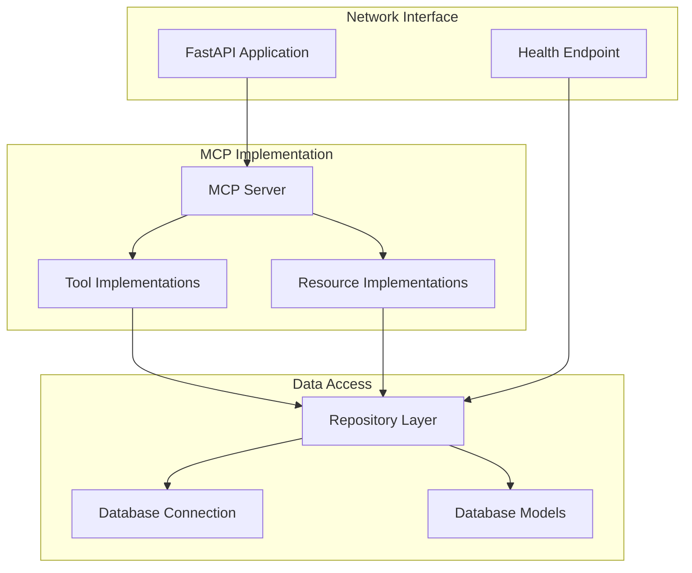

# Standalone Memory Service

## Overview

The Standalone Memory Service is a critical component of Phase 4, responsible for persisting and retrieving user data in the distributed Cortex Core system. This document provides comprehensive implementation guidance for transforming the in-process Memory Service from Phase 3 into a fully independent, network-accessible service.

The Memory Service serves as the system's persistence layer, storing input data, conversation history, and other user-specific information. As a standalone service, it runs in its own process, communicates over the network using HTTP and SSE, and manages its own database connection. This implementation maintains the same MCP interface established in Phase 3 while enabling independent scaling and deployment.

### Core Responsibilities

1. **Data Storage**: Persist user inputs, conversation data, and metadata
2. **Data Retrieval**: Provide access to stored data, with filtering and pagination
3. **User Data Partitioning**: Maintain strict isolation of data between users
4. **MCP Protocol Implementation**: Expose tools and resources via HTTP and SSE
5. **Health Monitoring**: Provide health status information

### Transition from In-Process to Standalone

The Memory Service transitions from an in-process component to a standalone service:

| Aspect            | Phase 3 (In-Process)           | Phase 4 (Standalone)      |
| ----------------- | ------------------------------ | ------------------------- |
| **Process**       | Part of main application       | Independent process       |
| **Communication** | Direct function calls          | HTTP and SSE over network |
| **Database**      | Shared connection              | Dedicated connection      |
| **Configuration** | Part of main application       | Independent configuration |
| **Deployment**    | Deployed with main application | Independently deployable  |
| **Scaling**       | Scales with main application   | Independently scalable    |

## Architecture

The Standalone Memory Service follows a layered architecture that separates concerns and maintains clean interfaces:



### Key Components

#### 1. FastAPI Application

The top-level component that:

- Creates and configures the FastAPI application
- Sets up middleware (CORS, logging, etc.)
- Registers MCP endpoints
- Configures health check endpoint
- Handles application lifecycle (startup/shutdown)

#### 2. MCP Server

The MCP protocol implementation that:

- Registers tool and resource handlers
- Routes HTTP requests to appropriate tool handlers
- Streams resource data via SSE connections
- Handles error responses and serialization

#### 3. Tool Implementations

The business logic for MCP tools:

- `store_input`: Stores user input data
- `update_status`: Updates item status
- `delete_item`: Removes an item
- Additional tools as needed

#### 4. Resource Implementations

The data access for MCP resources:

- `history/{user_id}`: Streams history for a user
- `history/{user_id}/limit/{limit}`: Streams limited history
- `item/{item_id}`: Provides access to a specific item
- Additional resources as needed

#### 5. Repository Layer

The data access abstraction that:

- Encapsulates database operations
- Implements data filtering and querying
- Maintains data partitioning by user
- Handles database connection management

#### 6. Database Models

The data structure definitions:

- SQLAlchemy models defining the schema
- Validation logic
- Relationship definitions

#### 7. Health Check Endpoint

The monitoring endpoint that:

- Verifies database connectivity
- Reports service status
- Provides basic metrics

## Folder Structure

```
memory-service/
├── app/
│   ├── __init__.py
│   ├── main.py                  # Application entry point
│   ├── config.py                # Configuration settings
│   ├── mcp/
│   │   ├── __init__.py
│   │   ├── server.py            # MCP server implementation
│   │   ├── tools.py             # Tool implementations
│   │   └── resources.py         # Resource implementations
│   ├── api/
│   │   ├── __init__.py
│   │   └── health.py            # Health check endpoint
│   ├── repository/
│   │   ├── __init__.py
│   │   ├── memory_repository.py # Repository implementation
│   │   └── exceptions.py        # Repository exceptions
│   ├── models/
│   │   ├── __init__.py
│   │   ├── database.py          # Database connection
│   │   └── memory_item.py       # SQLAlchemy models
│   └── utils/
│       ├── __init__.py
│       ├── auth.py              # Auth utilities
│       └── logging.py           # Logging configuration
├── tests/
│   ├── __init__.py
│   ├── conftest.py              # Test fixtures
│   ├── unit/
│   │   ├── __init__.py
│   │   ├── test_tools.py        # Unit tests for tools
│   │   └── test_resources.py    # Unit tests for resources
│   └── integration/
│       ├── __init__.py
│       ├── test_api.py          # Integration tests for API
│       └── test_repository.py   # Integration tests for repository
├── Dockerfile                   # Container definition
├── requirements.txt             # Dependencies
├── .env.example                 # Example environment variables
└── README.md                    # Service documentation
```

## Detailed Implementation

### 1. Configuration (config.py)

```python
import os
from pydantic import BaseSettings

class Settings(BaseSettings):
    """
    Configuration settings for the Memory Service.
    Loads from environment variables with fallbacks.
    """
    # Service settings
    SERVICE_NAME: str = "Memory Service"
    HOST: str = "0.0.0.0"
    PORT: int = int(os.getenv("PORT", "9000"))
    DEBUG: bool = os.getenv("DEBUG", "False").lower() == "true"
    LOG_LEVEL: str = os.getenv("LOG_LEVEL", "INFO")

    # Database settings
    DATABASE_URL: str = os.getenv(
        "DATABASE_URL",
        "sqlite:///./memory_service.db"
    )
    DB_POOL_SIZE: int = int(os.getenv("DB_POOL_SIZE", "5"))
    DB_MAX_OVERFLOW: int = int(os.getenv("DB_MAX_OVERFLOW", "10"))
    DB_POOL_TIMEOUT: int = int(os.getenv("DB_POOL_TIMEOUT", "30"))

    # API settings
    CORS_ORIGINS: list = os.getenv("CORS_ORIGINS", "*").split(",")
    MAX_REQUEST_SIZE: int = int(os.getenv("MAX_REQUEST_SIZE", "1048576"))  # 1MB

    # Security settings
    AUTH_ENABLED: bool = os.getenv("AUTH_ENABLED", "True").lower() == "true"
    JWT_SECRET_KEY: str = os.getenv("JWT_SECRET_KEY", "development-secret-key")

    class Config:
        env_file = ".env"
        env_file_encoding = "utf-8"

# Create settings instance
settings = Settings()
```

### 2. Database Connection and Models (models/database.py)

```python
import logging
from sqlalchemy import create_engine
from sqlalchemy.ext.declarative import declarative_base
from sqlalchemy.orm import sessionmaker
from sqlalchemy.pool import QueuePool
from app.config import settings

# Create logger
logger = logging.getLogger(__name__)

# Create SQLAlchemy base
Base = declarative_base()

# Create engine with connection pooling
engine = create_engine(
    settings.DATABASE_URL,
    poolclass=QueuePool,
    pool_size=settings.DB_POOL_SIZE,
    max_overflow=settings.DB_MAX_OVERFLOW,
    pool_timeout=settings.DB_POOL_TIMEOUT,
    pool_pre_ping=True  # Verify connections before using
)

# Create session factory
SessionLocal = sessionmaker(
    autocommit=False,
    autoflush=False,
    bind=engine
)

async def init_database():
    """
    Initialize database connection and create tables.
    Called during application startup.
    """
    try:
        # Create tables
        Base.metadata.create_all(bind=engine)
        logger.info("Database tables created successfully")
    except Exception as e:
        logger.error(f"Error initializing database: {str(e)}")
        raise

async def get_db():
    """
    Get database session with automatic closing.
    Used as a dependency in FastAPI.
    """
    db = SessionLocal()
    try:
        yield db
    finally:
        db.close()

async def close_database():
    """
    Close database connections.
    Called during application shutdown.
    """
    try:
        # Dispose engine (closes all connections in pool)
        engine.dispose()
        logger.info("Database connections closed")
    except Exception as e:
        logger.error(f"Error closing database connections: {str(e)}")
```

### 3. Memory Item Model (models/memory_item.py)

```python
import uuid
from sqlalchemy import Column, String, JSON, Text, Index, ForeignKey
from sqlalchemy.dialects.sqlite import JSON as SQLiteJSON
from sqlalchemy.sql import func
from datetime import datetime
from app.models.database import Base

class MemoryItem(Base):
    """
    SQLAlchemy model for memory items.
    Stores user input data and related information.
    """
    __tablename__ = "memory_items"

    id = Column(String(36), primary_key=True, default=lambda: str(uuid.uuid4()))
    user_id = Column(String(36), nullable=False, index=True)
    content = Column(Text, nullable=False)
    content_type = Column(String(50), nullable=False)
    conversation_id = Column(String(36), nullable=True, index=True)
    timestamp = Column(String(50), nullable=False)
    metadata = Column(SQLiteJSON, nullable=True)

    # Indexes for efficient queries
    __table_args__ = (
        Index("idx_memory_items_user_id_timestamp", user_id, timestamp),
        Index("idx_memory_items_conversation_id", conversation_id),
    )

    @classmethod
    def from_dict(cls, data, user_id):
        """
        Create a memory item from dictionary data.

        Args:
            data: The input data dictionary
            user_id: The user ID

        Returns:
            A new MemoryItem instance
        """
        # Ensure required fields
        if "content" not in data:
            raise ValueError("Content is required")

        # Set timestamp if not provided
        if "timestamp" not in data:
            data["timestamp"] = datetime.now().isoformat()

        # Extract fields
        content = data.get("content")
        content_type = data.get("content_type", "text")
        conversation_id = data.get("conversation_id")
        timestamp = data.get("timestamp")

        # Extract metadata (everything else)
        metadata = {k: v for k, v in data.items() if k not in [
            "content", "content_type", "conversation_id", "timestamp"
        ]}

        # Create instance
        return cls(
            user_id=user_id,
            content=content,
            content_type=content_type,
            conversation_id=conversation_id,
            timestamp=timestamp,
            metadata=metadata
        )

    def to_dict(self):
        """
        Convert the memory item to a dictionary.

        Returns:
            Dictionary representation of the item
        """
        # Start with base fields
        result = {
            "id": self.id,
            "user_id": self.user_id,
            "content": self.content,
            "content_type": self.content_type,
            "timestamp": self.timestamp
        }

        # Add optional fields if present
        if self.conversation_id:
            result["conversation_id"] = self.conversation_id

        # Add metadata fields
        if self.metadata:
            result.update(self.metadata)

        return result
```

### 4. Memory Repository (repository/memory_repository.py)

```python
import logging
from typing import List, Dict, Any, Optional, AsyncGenerator
from sqlalchemy import desc, asc
from sqlalchemy.orm import Session
from app.models.memory_item import MemoryItem
from datetime import datetime

# Create logger
logger = logging.getLogger(__name__)

class MemoryRepository:
    """
    Repository for memory operations.
    Handles storage and retrieval of memory items.
    """
    def __init__(self, db: Session):
        """
        Initialize the repository.

        Args:
            db: Database session
        """
        self.db = db

    def store_item(self, user_id: str, data: Dict[str, Any]) -> Dict[str, Any]:
        """
        Store a new memory item.

        Args:
            user_id: The user ID
            data: The item data

        Returns:
            The stored item as a dictionary
        """
        try:
            # Create memory item
            item = MemoryItem.from_dict(data, user_id)

            # Add to database
            self.db.add(item)
            self.db.commit()
            self.db.refresh(item)

            # Return as dictionary
            return item.to_dict()
        except Exception as e:
            self.db.rollback()
            logger.error(f"Error storing memory item: {str(e)}")
            raise

    def get_item(self, item_id: str, user_id: str) -> Optional[Dict[str, Any]]:
        """
        Get a memory item by ID.
        Includes user_id check for security.

        Args:
            item_id: The item ID
            user_id: The user ID

        Returns:
            The item as a dictionary or None if not found
        """
        try:
            # Query item with user check
            item = self.db.query(MemoryItem).filter(
                MemoryItem.id == item_id,
                MemoryItem.user_id == user_id
            ).first()

            # Return as dictionary if found
            return item.to_dict() if item else None
        except Exception as e:
            logger.error(f"Error getting memory item: {str(e)}")
            raise

    def update_item(self, item_id: str, user_id: str, data: Dict[str, Any]) -> Optional[Dict[str, Any]]:
        """
        Update a memory item.

        Args:
            item_id: The item ID
            user_id: The user ID
            data: The updated data

        Returns:
            The updated item as a dictionary or None if not found
        """
        try:
            # Get item with user check
            item = self.db.query(MemoryItem).filter(
                MemoryItem.id == item_id,
                MemoryItem.user_id == user_id
            ).first()

            if not item:
                return None

            # Update fields
            if "content" in data:
                item.content = data["content"]
            if "content_type" in data:
                item.content_type = data["content_type"]
            if "conversation_id" in data:
                item.conversation_id = data["conversation_id"]

            # Update metadata (everything else)
            new_metadata = {}
            if item.metadata:
                new_metadata.update(item.metadata)

            for k, v in data.items():
                if k not in ["content", "content_type", "conversation_id", "user_id", "id", "timestamp"]:
                    new_metadata[k] = v

            item.metadata = new_metadata

            # Save changes
            self.db.commit()
            self.db.refresh(item)

            # Return as dictionary
            return item.to_dict()
        except Exception as e:
            self.db.rollback()
            logger.error(f"Error updating memory item: {str(e)}")
            raise

    def delete_item(self, item_id: str, user_id: str) -> bool:
        """
        Delete a memory item.

        Args:
            item_id: The item ID
            user_id: The user ID

        Returns:
            True if deleted, False if not found
        """
        try:
            # Get item with user check
            item = self.db.query(MemoryItem).filter(
                MemoryItem.id == item_id,
                MemoryItem.user_id == user_id
            ).first()

            if not item:
                return False

            # Delete item
            self.db.delete(item)
            self.db.commit()

            return True
        except Exception as e:
            self.db.rollback()
            logger.error(f"Error deleting memory item: {str(e)}")
            raise

    def get_history(self, user_id: str, limit: Optional[int] = None,
                    conversation_id: Optional[str] = None) -> List[Dict[str, Any]]:
        """
        Get history for a user.

        Args:
            user_id: The user ID
            limit: Optional maximum items to return
            conversation_id: Optional conversation filter

        Returns:
            List of memory items as dictionaries
        """
        try:
            # Start query with user_id filter
            query = self.db.query(MemoryItem).filter(MemoryItem.user_id == user_id)

            # Add conversation filter if provided
            if conversation_id:
                query = query.filter(MemoryItem.conversation_id == conversation_id)

            # Order by timestamp (newest first)
            query = query.order_by(desc(MemoryItem.timestamp))

            # Apply limit if provided
            if limit:
                query = query.limit(limit)

            # Execute query
            items = query.all()

            # Convert to dictionaries
            return [item.to_dict() for item in items]
        except Exception as e:
            logger.error(f"Error getting history: {str(e)}")
            raise

    def iter_history(self, user_id: str, limit: Optional[int] = None,
                     conversation_id: Optional[str] = None) -> AsyncGenerator[Dict[str, Any], None]:
        """
        Iterate through history for a user.
        Uses generator pattern for streaming large results.

        Args:
            user_id: The user ID
            limit: Optional maximum items to return
            conversation_id: Optional conversation filter

        Yields:
            Memory items as dictionaries
        """
        try:
            # Start query with user_id filter
            query = self.db.query(MemoryItem).filter(MemoryItem.user_id == user_id)

            # Add conversation filter if provided
            if conversation_id:
                query = query.filter(MemoryItem.conversation_id == conversation_id)

            # Order by timestamp (newest first)
            query = query.order_by(desc(MemoryItem.timestamp))

            # Apply limit if provided
            if limit:
                query = query.limit(limit)

            # Execute query and yield results
            for item in query.yield_per(100):  # Process in batches of 100
                yield item.to_dict()
        except Exception as e:
            logger.error(f"Error iterating history: {str(e)}")
            raise
```

### 5. MCP Server Implementation (mcp/server.py)

```python
import logging
from fastapi import FastAPI, Request, HTTPException
from fastapi.responses import JSONResponse, StreamingResponse
import json
import asyncio
from typing import Dict, Any, Callable, Awaitable, AsyncGenerator

# Create logger
logger = logging.getLogger(__name__)

# Tool registry
tools = {}

# Resource registry
resources = {}

def register_tool(name: str):
    """
    Decorator for registering a tool function.

    Args:
        name: The tool name
    """
    def decorator(func: Callable[..., Awaitable[Dict[str, Any]]]):
        tools[name] = func
        return func
    return decorator

def register_resource(path_prefix: str):
    """
    Decorator for registering a resource generator function.

    Args:
        path_prefix: The resource path prefix
    """
    def decorator(func: Callable[..., AsyncGenerator[Dict[str, Any], None]]):
        resources[path_prefix] = func
        return func
    return decorator

def setup_mcp_routes(app: FastAPI):
    """
    Set up MCP routes in the FastAPI application.

    Args:
        app: The FastAPI application
    """
    @app.post("/tool/{tool_name}")
    async def call_tool(tool_name: str, request: Request):
        """
        Handle tool calls via HTTP POST.

        Args:
            tool_name: The name of the tool to call
            request: The HTTP request

        Returns:
            JSON response with the tool result or error
        """
        # Check if tool exists
        if tool_name not in tools:
            logger.warning(f"Tool not found: {tool_name}")
            return JSONResponse(
                status_code=404,
                content={
                    "error": {
                        "code": "tool_not_found",
                        "message": f"Tool '{tool_name}' not found"
                    }
                }
            )

        # Parse request body
        try:
            body = await request.json()
            arguments = body.get("arguments", {})
        except Exception as e:
            logger.error(f"Invalid request body: {str(e)}")
            return JSONResponse(
                status_code=400,
                content={
                    "error": {
                        "code": "invalid_request",
                        "message": "Invalid request body"
                    }
                }
            )

        # Call the tool function
        try:
            # Get function
            tool_func = tools[tool_name]

            # Call function with arguments
            result = await tool_func(**arguments)

            # Return result
            return {"result": result}
        except Exception as e:
            logger.error(f"Error calling tool {tool_name}: {str(e)}")
            return JSONResponse(
                status_code=500,
                content={
                    "error": {
                        "code": "tool_execution_error",
                        "message": str(e)
                    }
                }
            )

    @app.get("/resource/{resource_path:path}")
    async def get_resource(resource_path: str):
        """
        Handle resource requests via SSE.

        Args:
            resource_path: The resource path

        Returns:
            SSE stream of resource data
        """
        # Find matching resource handler
        resource_handler = None
        prefix_match = None

        for path_prefix, handler in resources.items():
            if resource_path.startswith(path_prefix) and (
                prefix_match is None or len(path_prefix) > len(prefix_match)
            ):
                prefix_match = path_prefix
                resource_handler = handler

        if not resource_handler:
            logger.warning(f"Resource not found: {resource_path}")
            return JSONResponse(
                status_code=404,
                content={
                    "error": {
                        "code": "resource_not_found",
                        "message": f"Resource '{resource_path}' not found"
                    }
                }
            )

        # Create event generator
        async def event_generator():
            try:
                # Call resource handler
                async for data in resource_handler(resource_path):
                    # Format as SSE event
                    yield f"data: {json.dumps(data)}\n\n"

                    # Small delay to prevent CPU hogging
                    await asyncio.sleep(0.01)
            except Exception as e:
                logger.error(f"Error streaming resource {resource_path}: {str(e)}")
                # End stream on error

        # Return SSE response
        return StreamingResponse(
            event_generator(),
            media_type="text/event-stream"
        )
```

### 6. Tool Implementations (mcp/tools.py)

```python
import logging
from typing import Dict, Any, Optional
from app.repository.memory_repository import MemoryRepository
from app.models.database import SessionLocal
from app.mcp.server import register_tool

# Create logger
logger = logging.getLogger(__name__)

@register_tool("store_input")
async def store_input(user_id: str, input_data: Dict[str, Any]) -> Dict[str, Any]:
    """
    Store user input data.

    Args:
        user_id: The user ID
        input_data: The input data to store

    Returns:
        Status information with the stored item ID
    """
    logger.debug(f"Storing input for user {user_id}")

    # Create database session
    db = SessionLocal()
    try:
        # Create repository
        repository = MemoryRepository(db)

        # Store item
        result = repository.store_item(user_id, input_data)

        # Return result
        return {
            "status": "stored",
            "user_id": user_id,
            "item_id": result["id"]
        }
    except Exception as e:
        logger.error(f"Error storing input: {str(e)}")
        raise
    finally:
        db.close()

@register_tool("get_item")
async def get_item(user_id: str, item_id: str) -> Dict[str, Any]:
    """
    Get a specific memory item.

    Args:
        user_id: The user ID
        item_id: The item ID

    Returns:
        The memory item data
    """
    logger.debug(f"Getting item {item_id} for user {user_id}")

    # Create database session
    db = SessionLocal()
    try:
        # Create repository
        repository = MemoryRepository(db)

        # Get item
        item = repository.get_item(item_id, user_id)

        # Check if item exists
        if not item:
            raise ValueError(f"Item {item_id} not found for user {user_id}")

        # Return item
        return item
    except Exception as e:
        logger.error(f"Error getting item: {str(e)}")
        raise
    finally:
        db.close()

@register_tool("update_item")
async def update_item(user_id: str, item_id: str, data: Dict[str, Any]) -> Dict[str, Any]:
    """
    Update a memory item.

    Args:
        user_id: The user ID
        item_id: The item ID
        data: The updated data

    Returns:
        The updated item
    """
    logger.debug(f"Updating item {item_id} for user {user_id}")

    # Create database session
    db = SessionLocal()
    try:
        # Create repository
        repository = MemoryRepository(db)

        # Update item
        item = repository.update_item(item_id, user_id, data)

        # Check if item exists
        if not item:
            raise ValueError(f"Item {item_id} not found for user {user_id}")

        # Return item
        return item
    except Exception as e:
        logger.error(f"Error updating item: {str(e)}")
        raise
    finally:
        db.close()

@register_tool("delete_item")
async def delete_item(user_id: str, item_id: str) -> Dict[str, Any]:
    """
    Delete a memory item.

    Args:
        user_id: The user ID
        item_id: The item ID

    Returns:
        Status information
    """
    logger.debug(f"Deleting item {item_id} for user {user_id}")

    # Create database session
    db = SessionLocal()
    try:
        # Create repository
        repository = MemoryRepository(db)

        # Delete item
        success = repository.delete_item(item_id, user_id)

        # Check if item existed
        if not success:
            raise ValueError(f"Item {item_id} not found for user {user_id}")

        # Return status
        return {
            "status": "deleted",
            "user_id": user_id,
            "item_id": item_id
        }
    except Exception as e:
        logger.error(f"Error deleting item: {str(e)}")
        raise
    finally:
        db.close()
```

### 7. Resource Implementations (mcp/resources.py)

```python
import logging
import asyncio
from typing import Dict, Any, Optional, AsyncGenerator
from app.repository.memory_repository import MemoryRepository
from app.models.database import SessionLocal
from app.mcp.server import register_resource

# Create logger
logger = logging.getLogger(__name__)

@register_resource("history/")
async def get_history_resource(resource_path: str) -> AsyncGenerator[Dict[str, Any], None]:
    """
    Stream history for a user.

    Handles paths:
    - history/{user_id}
    - history/{user_id}/limit/{limit}
    - history/{user_id}/conversation/{conversation_id}

    Args:
        resource_path: The resource path

    Yields:
        History items
    """
    logger.debug(f"Streaming history for path: {resource_path}")

    # Parse path parameters
    parts = resource_path.split("/")
    if len(parts) < 2:
        raise ValueError("Invalid resource path")

    # Extract user_id (required)
    user_id = parts[1]

    # Extract limit (optional)
    limit = None
    if len(parts) >= 4 and parts[2] == "limit":
        try:
            limit = int(parts[3])
        except ValueError:
            logger.warning(f"Invalid limit parameter: {parts[3]}")

    # Extract conversation_id (optional)
    conversation_id = None
    if len(parts) >= 4 and parts[2] == "conversation":
        conversation_id = parts[3]

    # Create database session
    db = SessionLocal()
    try:
        # Create repository
        repository = MemoryRepository(db)

        # Stream history items
        async for item in repository.iter_history(
            user_id=user_id,
            limit=limit,
            conversation_id=conversation_id
        ):
            yield item

            # Small delay to prevent database overload
            await asyncio.sleep(0.01)
    except Exception as e:
        logger.error(f"Error streaming history: {str(e)}")
        raise
    finally:
        db.close()

@register_resource("item/")
async def get_item_resource(resource_path: str) -> AsyncGenerator[Dict[str, Any], None]:
    """
    Get a specific item.

    Handles paths:
    - item/{item_id}/{user_id}

    Args:
        resource_path: The resource path

    Yields:
        The item data
    """
    logger.debug(f"Getting item for path: {resource_path}")

    # Parse path parameters
    parts = resource_path.split("/")
    if len(parts) < 3:
        raise ValueError("Invalid resource path")

    # Extract item_id and user_id
    item_id = parts[1]
    user_id = parts[2]

    # Create database session
    db = SessionLocal()
    try:
        # Create repository
        repository = MemoryRepository(db)

        # Get item
        item = repository.get_item(item_id, user_id)

        # Yield item if found
        if item:
            yield item
    except Exception as e:
        logger.error(f"Error getting item: {str(e)}")
        raise
    finally:
        db.close()
```

### 8. Health Check Endpoint (api/health.py)

```python
import logging
from fastapi import APIRouter, Depends
from sqlalchemy.orm import Session
from app.models.database import get_db, engine

# Create logger
logger = logging.getLogger(__name__)

# Create router
router = APIRouter()

@router.get("/health")
async def health_check(db: Session = Depends(get_db)):
    """
    Health check endpoint.
    Verifies database connection and reports service status.

    Args:
        db: Database session

    Returns:
        Health status information
    """
    # Check database connection
    db_status = "healthy"
    db_error = None

    try:
        # Execute simple query
        db.execute("SELECT 1")
    except Exception as e:
        db_status = "unhealthy"
        db_error = str(e)
        logger.error(f"Database health check failed: {db_error}")

    # Get connection pool stats
    pool_status = {}
    try:
        pool = engine.pool
        pool_status = {
            "checkedin": pool.checkedin(),
            "checkedout": pool.checkedout(),
            "overflow": pool.overflow(),
            "size": pool.size()
        }
    except Exception as e:
        logger.error(f"Failed to get pool status: {str(e)}")

    # Return health information
    return {
        "status": "healthy" if db_status == "healthy" else "unhealthy",
        "components": {
            "database": {
                "status": db_status,
                "error": db_error,
                "pool": pool_status
            }
        },
        "version": "1.0.0"
    }
```

### 9. Main Application (main.py)

```python
import logging
import asyncio
from fastapi import FastAPI, Request
from fastapi.middleware.cors import CORSMiddleware
from contextlib import asynccontextmanager
from app.config import settings
from app.models.database import init_database, close_database
from app.mcp.server import setup_mcp_routes
from app.api.health import router as health_router

# Configure logging
logging.basicConfig(
    level=getattr(logging, settings.LOG_LEVEL),
    format="%(asctime)s - %(name)s - %(levelname)s - %(message)s"
)

# Create logger
logger = logging.getLogger(__name__)

# Setup lifespan events
@asynccontextmanager
async def lifespan(app: FastAPI):
    # Startup
    logger.info("Starting Memory Service")
    await init_database()

    yield

    # Shutdown
    logger.info("Shutting down Memory Service")
    await close_database()

# Create FastAPI app
app = FastAPI(
    title="Memory Service",
    description="Standalone Memory Service for Cortex Core",
    version="1.0.0",
    lifespan=lifespan
)

# Add CORS middleware
app.add_middleware(
    CORSMiddleware,
    allow_origins=settings.CORS_ORIGINS,
    allow_credentials=True,
    allow_methods=["*"],
    allow_headers=["*"]
)

# Add request logging middleware
@app.middleware("http")
async def log_requests(request: Request, call_next):
    """Log all requests with path and method."""
    logger.debug(f"Request: {request.method} {request.url.path}")
    response = await call_next(request)
    return response

# Include routers
app.include_router(health_router)

# Set up MCP routes
setup_mcp_routes(app)

# Add root endpoint
@app.get("/")
async def root():
    """Root endpoint returning service information."""
    return {
        "service": "Memory Service",
        "version": "1.0.0",
        "status": "running"
    }

# Run with uvicorn if executed directly
if __name__ == "__main__":
    import uvicorn
    uvicorn.run(
        "app.main:app",
        host=settings.HOST,
        port=settings.PORT,
        reload=settings.DEBUG
    )
```

### 10. Containerization (Dockerfile)

```dockerfile
# Use Python 3.10 slim image
FROM python:3.10-slim

# Set working directory
WORKDIR /app

# Set environment variables
ENV PYTHONDONTWRITEBYTECODE=1 \
    PYTHONUNBUFFERED=1 \
    PYTHONPATH=/app

# Copy requirements
COPY requirements.txt .

# Install dependencies
RUN pip install --no-cache-dir -r requirements.txt

# Copy application code
COPY . .

# Expose port
EXPOSE 9000

# Health check
HEALTHCHECK --interval=30s --timeout=10s --start-period=5s --retries=3 \
    CMD curl -f http://localhost:9000/health || exit 1

# Run the application
CMD ["uvicorn", "app.main:app", "--host", "0.0.0.0", "--port", "9000"]
```

### 11. Dependencies (requirements.txt)

```
# Web framework
fastapi>=0.96.0
uvicorn>=0.22.0
pydantic>=2.0.0

# Database
sqlalchemy>=2.0.0

# SQLite support
aiosqlite>=0.18.0

# HTTP
httpx>=0.24.0
requests>=2.28.0

# Utilities
python-dotenv>=1.0.0
python-multipart>=0.0.6
python-jose>=3.3.0

# Testing
pytest>=7.3.1
pytest-asyncio>=0.21.0
```

## Testing Approach

### 1. Unit Tests

#### Tool Tests (tests/unit/test_tools.py)

```python
import pytest
import asyncio
from unittest.mock import MagicMock, patch
from app.mcp.tools import store_input, get_item, update_item, delete_item

# Mock data
TEST_USER_ID = "test-user-123"
TEST_ITEM_ID = "test-item-456"
TEST_INPUT_DATA = {
    "content": "Test content",
    "content_type": "text"
}

@pytest.mark.asyncio
async def test_store_input():
    """Test store_input tool."""
    # Mock repository
    mock_repo = MagicMock()
    mock_repo.store_item.return_value = {
        "id": TEST_ITEM_ID,
        "content": "Test content"
    }

    # Mock session creation
    with patch("app.mcp.tools.SessionLocal") as mock_session, \
         patch("app.mcp.tools.MemoryRepository") as mock_repo_class:
        # Setup mocks
        mock_session.return_value = MagicMock()
        mock_repo_class.return_value = mock_repo

        # Call function
        result = await store_input(user_id=TEST_USER_ID, input_data=TEST_INPUT_DATA)

        # Verify repository call
        mock_repo.store_item.assert_called_once_with(TEST_USER_ID, TEST_INPUT_DATA)

        # Verify result
        assert result["status"] == "stored"
        assert result["user_id"] == TEST_USER_ID
        assert result["item_id"] == TEST_ITEM_ID

        # Verify session cleanup
        mock_session.return_value.close.assert_called_once()

@pytest.mark.asyncio
async def test_get_item():
    """Test get_item tool."""
    # Mock repository
    mock_repo = MagicMock()
    mock_repo.get_item.return_value = {
        "id": TEST_ITEM_ID,
        "content": "Test content"
    }

    # Mock session creation
    with patch("app.mcp.tools.SessionLocal") as mock_session, \
         patch("app.mcp.tools.MemoryRepository") as mock_repo_class:
        # Setup mocks
        mock_session.return_value = MagicMock()
        mock_repo_class.return_value = mock_repo

        # Call function
        result = await get_item(user_id=TEST_USER_ID, item_id=TEST_ITEM_ID)

        # Verify repository call
        mock_repo.get_item.assert_called_once_with(TEST_ITEM_ID, TEST_USER_ID)

        # Verify result
        assert result["id"] == TEST_ITEM_ID
        assert result["content"] == "Test content"

        # Verify session cleanup
        mock_session.return_value.close.assert_called_once()

@pytest.mark.asyncio
async def test_get_item_not_found():
    """Test get_item tool with missing item."""
    # Mock repository
    mock_repo = MagicMock()
    mock_repo.get_item.return_value = None

    # Mock session creation
    with patch("app.mcp.tools.SessionLocal") as mock_session, \
         patch("app.mcp.tools.MemoryRepository") as mock_repo_class:
        # Setup mocks
        mock_session.return_value = MagicMock()
        mock_repo_class.return_value = mock_repo

        # Call function and expect exception
        with pytest.raises(ValueError) as excinfo:
            await get_item(user_id=TEST_USER_ID, item_id=TEST_ITEM_ID)

        # Verify error message
        assert "not found" in str(excinfo.value)

        # Verify session cleanup
        mock_session.return_value.close.assert_called_once()

# Additional tests for update_item and delete_item would follow a similar pattern
```

#### Resource Tests (tests/unit/test_resources.py)

```python
import pytest
import asyncio
from unittest.mock import MagicMock, patch
from app.mcp.resources import get_history_resource, get_item_resource

# Mock data
TEST_USER_ID = "test-user-123"
TEST_ITEM_ID = "test-item-456"
TEST_ITEMS = [
    {"id": "item1", "content": "Content 1"},
    {"id": "item2", "content": "Content 2"}
]

@pytest.mark.asyncio
async def test_get_history_resource():
    """Test get_history_resource function."""
    # Mock repository
    mock_repo = MagicMock()

    # Create mock async generator
    async def mock_iter_history(*args, **kwargs):
        for item in TEST_ITEMS:
            yield item

    mock_repo.iter_history = mock_iter_history

    # Mock session creation
    with patch("app.mcp.resources.SessionLocal") as mock_session, \
         patch("app.mcp.resources.MemoryRepository") as mock_repo_class:
        # Setup mocks
        mock_session.return_value = MagicMock()
        mock_repo_class.return_value = mock_repo

        # Call function
        items = []
        async for item in get_history_resource(f"history/{TEST_USER_ID}"):
            items.append(item)

        # Verify results
        assert len(items) == 2
        assert items[0]["id"] == "item1"
        assert items[1]["id"] == "item2"

        # Verify session cleanup
        mock_session.return_value.close.assert_called_once()

@pytest.mark.asyncio
async def test_get_history_resource_with_limit():
    """Test get_history_resource function with limit."""
    # Mock repository
    mock_repo = MagicMock()

    # Create mock async generator
    async def mock_iter_history(*args, **kwargs):
        # Check that limit was passed correctly
        assert kwargs.get("limit") == 10
        # Only yield one item for this test
        yield TEST_ITEMS[0]

    mock_repo.iter_history = mock_iter_history

    # Mock session creation
    with patch("app.mcp.resources.SessionLocal") as mock_session, \
         patch("app.mcp.resources.MemoryRepository") as mock_repo_class:
        # Setup mocks
        mock_session.return_value = MagicMock()
        mock_repo_class.return_value = mock_repo

        # Call function
        items = []
        async for item in get_history_resource(f"history/{TEST_USER_ID}/limit/10"):
            items.append(item)

        # Verify results
        assert len(items) == 1
        assert items[0]["id"] == "item1"

        # Verify session cleanup
        mock_session.return_value.close.assert_called_once()

@pytest.mark.asyncio
async def test_get_item_resource():
    """Test get_item_resource function."""
    # Mock repository
    mock_repo = MagicMock()
    mock_repo.get_item.return_value = TEST_ITEMS[0]

    # Mock session creation
    with patch("app.mcp.resources.SessionLocal") as mock_session, \
         patch("app.mcp.resources.MemoryRepository") as mock_repo_class:
        # Setup mocks
        mock_session.return_value = MagicMock()
        mock_repo_class.return_value = mock_repo

        # Call function
        items = []
        async for item in get_item_resource(f"item/{TEST_ITEM_ID}/{TEST_USER_ID}"):
            items.append(item)

        # Verify results
        assert len(items) == 1
        assert items[0]["id"] == "item1"

        # Verify repository call
        mock_repo.get_item.assert_called_once_with(TEST_ITEM_ID, TEST_USER_ID)

        # Verify session cleanup
        mock_session.return_value.close.assert_called_once()

@pytest.mark.asyncio
async def test_get_item_resource_not_found():
    """Test get_item_resource function with missing item."""
    # Mock repository
    mock_repo = MagicMock()
    mock_repo.get_item.return_value = None

    # Mock session creation
    with patch("app.mcp.resources.SessionLocal") as mock_session, \
         patch("app.mcp.resources.MemoryRepository") as mock_repo_class:
        # Setup mocks
        mock_session.return_value = MagicMock()
        mock_repo_class.return_value = mock_repo

        # Call function
        items = []
        async for item in get_item_resource(f"item/{TEST_ITEM_ID}/{TEST_USER_ID}"):
            items.append(item)

        # Verify no items returned
        assert len(items) == 0

        # Verify repository call
        mock_repo.get_item.assert_called_once_with(TEST_ITEM_ID, TEST_USER_ID)

        # Verify session cleanup
        mock_session.return_value.close.assert_called_once()
```

### 2. Integration Tests

#### Repository Tests (tests/integration/test_repository.py)

```python
import pytest
import os
import asyncio
from sqlalchemy import create_engine
from sqlalchemy.orm import sessionmaker
from app.models.database import Base
from app.models.memory_item import MemoryItem
from app.repository.memory_repository import MemoryRepository

# Test data
TEST_USER_ID = "test-user-123"
TEST_INPUT_DATA = {
    "content": "Test content",
    "content_type": "text",
    "conversation_id": "test-conversation-789",
    "timestamp": "2025-03-20T12:34:56Z",
    "custom_field": "custom value"
}

# Setup test database
@pytest.fixture(scope="function")
def db_session():
    """Create a test database session."""
    # Use in-memory SQLite for tests
    engine = create_engine("sqlite:///:memory:")

    # Create tables
    Base.metadata.create_all(engine)

    # Create session
    TestingSessionLocal = sessionmaker(bind=engine)
    db = TestingSessionLocal()

    try:
        yield db
    finally:
        db.close()
        # Drop tables
        Base.metadata.drop_all(engine)

@pytest.fixture
def repository(db_session):
    """Create a repository with test database session."""
    return MemoryRepository(db_session)

def test_store_item(repository):
    """Test storing an item."""
    # Store item
    result = repository.store_item(TEST_USER_ID, TEST_INPUT_DATA)

    # Verify result
    assert result["user_id"] == TEST_USER_ID
    assert result["content"] == TEST_INPUT_DATA["content"]
    assert result["content_type"] == TEST_INPUT_DATA["content_type"]
    assert result["conversation_id"] == TEST_INPUT_DATA["conversation_id"]
    assert result["timestamp"] == TEST_INPUT_DATA["timestamp"]
    assert result["custom_field"] == TEST_INPUT_DATA["custom_field"]
    assert "id" in result

    # Verify item in database
    item_id = result["id"]
    db_item = repository.get_item(item_id, TEST_USER_ID)
    assert db_item is not None
    assert db_item["id"] == item_id

def test_get_item(repository):
    """Test getting an item."""
    # Store item first
    result = repository.store_item(TEST_USER_ID, TEST_INPUT_DATA)
    item_id = result["id"]

    # Get item
    item = repository.get_item(item_id, TEST_USER_ID)

    # Verify item
    assert item["id"] == item_id
    assert item["user_id"] == TEST_USER_ID
    assert item["content"] == TEST_INPUT_DATA["content"]

    # Test with wrong user_id
    wrong_user_item = repository.get_item(item_id, "wrong-user")
    assert wrong_user_item is None

    # Test with non-existent item_id
    nonexistent_item = repository.get_item("nonexistent-id", TEST_USER_ID)
    assert nonexistent_item is None

def test_update_item(repository):
    """Test updating an item."""
    # Store item first
    result = repository.store_item(TEST_USER_ID, TEST_INPUT_DATA)
    item_id = result["id"]

    # Update data
    update_data = {
        "content": "Updated content",
        "new_field": "new value"
    }

    # Update item
    updated = repository.update_item(item_id, TEST_USER_ID, update_data)

    # Verify update
    assert updated["id"] == item_id
    assert updated["content"] == "Updated content"
    assert updated["new_field"] == "new value"
    assert updated["content_type"] == TEST_INPUT_DATA["content_type"]  # Unchanged

    # Test with wrong user_id
    wrong_user_update = repository.update_item(item_id, "wrong-user", update_data)
    assert wrong_user_update is None

    # Test with non-existent item_id
    nonexistent_update = repository.update_item("nonexistent-id", TEST_USER_ID, update_data)
    assert nonexistent_update is None

def test_delete_item(repository):
    """Test deleting an item."""
    # Store item first
    result = repository.store_item(TEST_USER_ID, TEST_INPUT_DATA)
    item_id = result["id"]

    # Delete item
    success = repository.delete_item(item_id, TEST_USER_ID)

    # Verify deletion
    assert success is True

    # Verify item is gone
    item = repository.get_item(item_id, TEST_USER_ID)
    assert item is None

    # Test with wrong user_id
    wrong_user_delete = repository.delete_item(item_id, "wrong-user")
    assert wrong_user_delete is False

    # Test with non-existent item_id
    nonexistent_delete = repository.delete_item("nonexistent-id", TEST_USER_ID)
    assert nonexistent_delete is False

def test_get_history(repository):
    """Test getting history."""
    # Store multiple items
    for i in range(5):
        data = {
            "content": f"Content {i}",
            "content_type": "text",
            "timestamp": f"2025-03-2{i}T12:00:00Z"
        }
        repository.store_item(TEST_USER_ID, data)

    # Store items for another user
    other_user_data = {
        "content": "Other user content",
        "content_type": "text"
    }
    repository.store_item("other-user", other_user_data)

    # Get history for test user
    history = repository.get_history(TEST_USER_ID)

    # Verify history
    assert len(history) == 5

    # Test with limit
    limited_history = repository.get_history(TEST_USER_ID, limit=2)
    assert len(limited_history) == 2

    # Test with conversation filter
    conversation_data = {
        "content": "Conversation content",
        "content_type": "text",
        "conversation_id": "test-conversation"
    }
    repository.store_item(TEST_USER_ID, conversation_data)

    # Get history for specific conversation
    conv_history = repository.get_history(
        TEST_USER_ID,
        conversation_id="test-conversation"
    )
    assert len(conv_history) == 1
    assert conv_history[0]["content"] == "Conversation content"

@pytest.mark.asyncio
async def test_iter_history(repository):
    """Test iterating through history."""
    # Store multiple items
    for i in range(3):
        data = {
            "content": f"Content {i}",
            "content_type": "text",
            "timestamp": f"2025-03-2{i}T12:00:00Z"
        }
        repository.store_item(TEST_USER_ID, data)

    # Iterate through history
    items = []
    iterator = repository.iter_history(TEST_USER_ID)

    # Convert to async generator for testing
    async def iterate():
        for item in iterator:
            yield item

    async for item in iterate():
        items.append(item)

    # Verify items
    assert len(items) == 3
```

#### API Tests (tests/integration/test_api.py)

```python
import pytest
from fastapi.testclient import TestClient
import json
from app.main import app

# Create test client
client = TestClient(app)

# Test data
TEST_USER_ID = "test-user-123"
TEST_INPUT_DATA = {
    "content": "Test content",
    "content_type": "text",
    "conversation_id": "test-conversation-789"
}

def test_health_endpoint():
    """Test health check endpoint."""
    response = client.get("/health")
    assert response.status_code == 200
    data = response.json()
    assert data["status"] in ["healthy", "unhealthy"]
    assert "components" in data
    assert "database" in data["components"]

def test_root_endpoint():
    """Test root endpoint."""
    response = client.get("/")
    assert response.status_code == 200
    data = response.json()
    assert data["service"] == "Memory Service"
    assert "version" in data
    assert data["status"] == "running"

def test_tool_endpoint():
    """Test tool endpoint."""
    # Test with valid data
    response = client.post(
        "/tool/store_input",
        json={
            "arguments": {
                "user_id": TEST_USER_ID,
                "input_data": TEST_INPUT_DATA
            }
        }
    )
    assert response.status_code == 200
    data = response.json()
    assert "result" in data
    assert data["result"]["status"] == "stored"
    assert data["result"]["user_id"] == TEST_USER_ID
    assert "item_id" in data["result"]

    # Test with invalid tool name
    response = client.post(
        "/tool/nonexistent_tool",
        json={"arguments": {}}
    )
    assert response.status_code == 404
    data = response.json()
    assert "error" in data
    assert data["error"]["code"] == "tool_not_found"

def test_resource_endpoint():
    """Test resource endpoint."""
    # First store some data
    response = client.post(
        "/tool/store_input",
        json={
            "arguments": {
                "user_id": TEST_USER_ID,
                "input_data": TEST_INPUT_DATA
            }
        }
    )
    assert response.status_code == 200
    data = response.json()
    item_id = data["result"]["item_id"]

    # Test resource streaming
    with client.stream("GET", f"/resource/history/{TEST_USER_ID}") as response:
        assert response.status_code == 200
        assert response.headers["content-type"] == "text/event-stream"

        # Read first event
        for line in response.iter_lines():
            if line:
                assert line.startswith(b"data: ")
                event_data = json.loads(line[6:])
                assert event_data["user_id"] == TEST_USER_ID
                break

    # Test with invalid resource path
    response = client.get("/resource/nonexistent_resource")
    assert response.status_code == 404
    data = response.json()
    assert "error" in data
    assert data["error"]["code"] == "resource_not_found"
```

### 3. End-to-End Tests

#### Docker Compose for Testing

Create a `docker-compose.test.yml` file:

```yaml
version: "3.8"

services:
  memory-service:
    build: .
    ports:
      - "9000:9000"
    environment:
      - DATABASE_URL=sqlite:///./test.db
      - LOG_LEVEL=DEBUG
    healthcheck:
      test: ["CMD", "curl", "-f", "http://localhost:9000/health"]
      interval: 10s
      timeout: 5s
      retries: 3
      start_period: 5s

  test-runner:
    build:
      context: .
      dockerfile: Dockerfile.test
    depends_on:
      memory-service:
        condition: service_healthy
    environment:
      - SERVICE_URL=http://memory-service:9000
```

Create a `Dockerfile.test` file:

```dockerfile
FROM python:3.10-slim

WORKDIR /app

COPY requirements.txt .
COPY test-requirements.txt .

RUN pip install --no-cache-dir -r requirements.txt -r test-requirements.txt

COPY . .

CMD ["pytest", "tests/e2e", "-v"]
```

#### E2E Test Script

Create a file `tests/e2e/test_service.py`:

```python
import pytest
import os
import httpx
import json
import asyncio
import time

# Get service URL from environment
SERVICE_URL = os.getenv("SERVICE_URL", "http://localhost:9000")

# Test data
TEST_USER_ID = "test-user-123"
TEST_INPUT_DATA = {
    "content": "Test content",
    "content_type": "text",
    "conversation_id": "test-conversation-789"
}

@pytest.mark.asyncio
async def test_service_health():
    """Test service health endpoint."""
    async with httpx.AsyncClient() as client:
        response = await client.get(f"{SERVICE_URL}/health")
        assert response.status_code == 200
        data = response.json()
        assert data["status"] == "healthy"
        assert data["components"]["database"]["status"] == "healthy"

@pytest.mark.asyncio
async def test_store_and_retrieve_flow():
    """Test storing and retrieving data end-to-end."""
    async with httpx.AsyncClient() as client:
        # Store input
        response = await client.post(
            f"{SERVICE_URL}/tool/store_input",
            json={
                "arguments": {
                    "user_id": TEST_USER_ID,
                    "input_data": TEST_INPUT_DATA
                }
            }
        )
        assert response.status_code == 200
        data = response.json()
        assert data["result"]["status"] == "stored"
        item_id = data["result"]["item_id"]

        # Get item
        response = await client.post(
            f"{SERVICE_URL}/tool/get_item",
            json={
                "arguments": {
                    "user_id": TEST_USER_ID,
                    "item_id": item_id
                }
            }
        )
        assert response.status_code == 200
        data = response.json()
        assert data["result"]["id"] == item_id
        assert data["result"]["content"] == TEST_INPUT_DATA["content"]

        # Stream history
        async with client.stream("GET", f"{SERVICE_URL}/resource/history/{TEST_USER_ID}") as response:
            assert response.status_code == 200
            assert response.headers["content-type"] == "text/event-stream"

            # Read events
            items = []
            buffer = b""

            async for chunk in response.aiter_bytes():
                buffer += chunk

                # Process complete events
                if b"\n\n" in buffer:
                    parts = buffer.split(b"\n\n")
                    for i in range(len(parts) - 1):
                        if parts[i].startswith(b"data: "):
                            event_data = json.loads(parts[i][6:])
                            items.append(event_data)

                    # Keep remaining data
                    buffer = parts[-1]

                # Stop after getting at least one item
                if items:
                    break

            # Verify at least one item received
            assert len(items) > 0
            assert items[0]["id"] == item_id

@pytest.mark.asyncio
async def test_update_and_delete_flow():
    """Test updating and deleting data end-to-end."""
    async with httpx.AsyncClient() as client:
        # Store input
        response = await client.post(
            f"{SERVICE_URL}/tool/store_input",
            json={
                "arguments": {
                    "user_id": TEST_USER_ID,
                    "input_data": TEST_INPUT_DATA
                }
            }
        )
        assert response.status_code == 200
        data = response.json()
        item_id = data["result"]["item_id"]

        # Update item
        update_data = {
            "content": "Updated content",
            "new_field": "new value"
        }
        response = await client.post(
            f"{SERVICE_URL}/tool/update_item",
            json={
                "arguments": {
                    "user_id": TEST_USER_ID,
                    "item_id": item_id,
                    "data": update_data
                }
            }
        )
        assert response.status_code == 200
        data = response.json()
        assert data["result"]["content"] == "Updated content"
        assert data["result"]["new_field"] == "new value"

        # Delete item
        response = await client.post(
            f"{SERVICE_URL}/tool/delete_item",
            json={
                "arguments": {
                    "user_id": TEST_USER_ID,
                    "item_id": item_id
                }
            }
        )
        assert response.status_code == 200
        data = response.json()
        assert data["result"]["status"] == "deleted"

        # Verify item is gone
        response = await client.post(
            f"{SERVICE_URL}/tool/get_item",
            json={
                "arguments": {
                    "user_id": TEST_USER_ID,
                    "item_id": item_id
                }
            }
        )
        assert response.status_code != 200  # Should fail
```

## Deployment

### Environment Variables

The Memory Service uses the following environment variables for configuration:

| Variable           | Description                       | Default Value                   |
| ------------------ | --------------------------------- | ------------------------------- |
| `PORT`             | Service port                      | `9000`                          |
| `HOST`             | Service host                      | `0.0.0.0`                       |
| `DEBUG`            | Enable debug mode                 | `False`                         |
| `LOG_LEVEL`        | Logging level                     | `INFO`                          |
| `DATABASE_URL`     | Database connection string        | `sqlite:///./memory_service.db` |
| `DB_POOL_SIZE`     | Database connection pool size     | `5`                             |
| `DB_MAX_OVERFLOW`  | Max pool overflow connections     | `10`                            |
| `DB_POOL_TIMEOUT`  | Connection pool timeout (seconds) | `30`                            |
| `CORS_ORIGINS`     | Allowed CORS origins (comma-sep)  | `*`                             |
| `MAX_REQUEST_SIZE` | Maximum request size in bytes     | `1048576` (1MB)                 |
| `AUTH_ENABLED`     | Enable authentication             | `True`                          |
| `JWT_SECRET_KEY`   | JWT secret key                    | `development-secret-key`        |

### Running the Service

#### Development Mode

```bash
# Set environment variables
export DATABASE_URL=sqlite:///./dev.db
export DEBUG=True
export LOG_LEVEL=DEBUG

# Run the service
uvicorn app.main:app --reload --host 0.0.0.0 --port 9000
```

#### Production Mode

```bash
# Set environment variables
export DATABASE_URL=sqlite:///./prod.db
export DEBUG=False
export LOG_LEVEL=INFO

# Run the service
uvicorn app.main:app --host 0.0.0.0 --port 9000
```

#### Docker Container

```bash
# Build the container
docker build -t memory-service .

# Run the container
docker run -d \
  -p 9000:9000 \
  -e DATABASE_URL=sqlite:///./data/db.sqlite \
  -v $(pwd)/data:/app/data \
  --name memory-service \
  memory-service
```

#### Docker Compose

Create a `docker-compose.yml` file:

```yaml
version: "3.8"

services:
  memory-service:
    build: .
    ports:
      - "9000:9000"
    environment:
      - DATABASE_URL=sqlite:///./data/db.sqlite
      - LOG_LEVEL=INFO
    volumes:
      - ./data:/app/data
    restart: unless-stopped
```

Then run:

```bash
docker-compose up -d
```

## Performance Considerations

### Connection Pooling

The Memory Service uses SQLAlchemy's connection pooling to efficiently manage database connections:

- **Pool Size**: Default of 5 connections
- **Max Overflow**: Default of 10 additional connections
- **Pool Timeout**: Default of 30 seconds
- **Pre-ping**: Enabled to verify connections before use

### Database Indexes

The MemoryItem model includes indexes for efficient querying:

- Index on `user_id` and `timestamp` for fast history queries
- Index on `conversation_id` for filtering by conversation

### Resource Streaming

The resource streaming implementation includes measures to prevent excessive resource usage:

- Uses `yield_per(100)` to process database results in batches
- Includes small delays with `asyncio.sleep(0.01)` to prevent CPU hogging
- Closes database sessions immediately after use

### Memory Management

To prevent memory leaks and excessive memory usage:

- Database connections are properly closed after use
- Database sessions are managed with context blocks
- Resources are explicitly cleaned up during application shutdown

## Common Pitfalls and Solutions

### Database Connection Management

**Pitfall**: Failing to close database connections properly, leading to connection leaks.

**Solution**:

- Always use `try/finally` blocks to ensure connections are closed
- Implement proper application shutdown handling
- Use SQLAlchemy's connection pooling with appropriate timeouts

### User Data Partitioning

**Pitfall**: Failing to filter queries by user_id, potentially exposing data across users.

**Solution**:

- Always include user_id in repository method parameters
- Add user_id filters to every database query
- Implement user checks in the service layer as a safeguard

### Memory Leaks in SSE Connections

**Pitfall**: Resource leaks in SSE connections when clients disconnect unexpectedly.

**Solution**:

- Always handle disconnections in resource streams
- Implement proper error handling in SSE generators
- Close database sessions explicitly after stream processing

### Transaction Management

**Pitfall**: Database inconsistencies due to improper transaction handling.

**Solution**:

- Use explicit commits and rollbacks
- Implement proper error handling with transaction rollback
- Keep transactions short to prevent lock contention

### Error Handling

**Pitfall**: Unhandled exceptions causing service instability.

**Solution**:

- Implement proper try/except blocks at appropriate levels
- Log detailed error information for debugging
- Return structured error responses to clients

## Security Considerations

### User Data Isolation

The Memory Service ensures strict isolation of user data:

- All repository methods require a `user_id` parameter
- Database queries always filter by `user_id`
- User verification occurs before data access
- Authorization checks are implemented at the service level

### Authentication

While authentication is implemented at the network boundary in the Cortex Core, the Memory Service includes basic support for JWT validation:

- JWT validation using the `auth.py` module
- Token verification for protected endpoints
- User ID extraction from tokens

### Input Validation

Input validation occurs at multiple levels:

- API validation using FastAPI's request models
- Repository validation before database operations
- SQLAlchemy model validation for data integrity

### Error Information Exposure

Care is taken to prevent leaking sensitive information in error responses:

- Detailed error logs are kept internal
- Generic error messages are returned to clients
- Stack traces are suppressed in production mode

## Conclusion

The Standalone Memory Service implementation provides a robust, scalable persistence layer for the Cortex Core. By transitioning from an in-process component to a standalone service, the Memory Service gains independence in terms of scaling, deployment, and resource management.

Key elements of this implementation include:

1. **Clean Architecture**: Layered design with separation of concerns
2. **MCP Protocol**: Standardized communication using HTTP and SSE
3. **Database Integration**: Efficient data storage and retrieval
4. **Resource Management**: Proper connection and memory management
5. **Error Handling**: Robust error handling and recovery
6. **Testing**: Comprehensive unit, integration, and end-to-end tests
7. **Containerization**: Docker support for easy deployment
8. **Security**: Proper user data isolation and validation

With this implementation, the Memory Service can be deployed and scaled independently, forming a foundational component of the distributed Cortex Core system in Phase 4.
