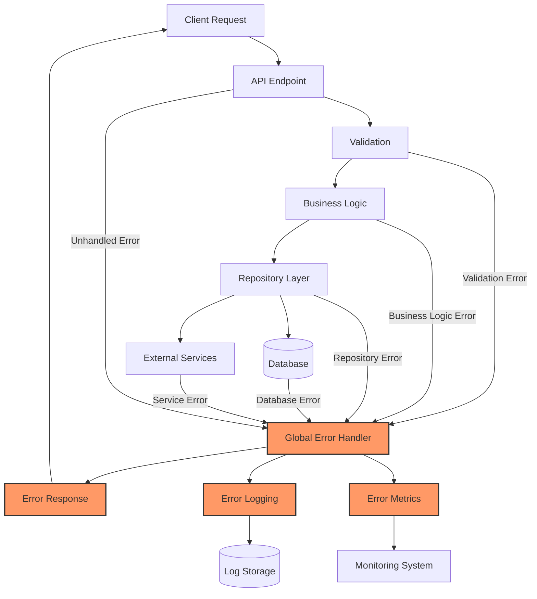

# Error Handling Framework

## Overview

This document provides a comprehensive guide for implementing a production-grade error handling framework in the Cortex Core platform as part of Phase 5. A robust error handling system is critical for reliability, maintainability, and user experience in a production environment.

The error handling framework outlined here serves several key purposes:

1. **Error Capture and Reporting**: Ensuring all errors are properly captured, logged, and reportable
2. **Consistent Error Responses**: Providing standardized, user-friendly error responses
3. **Error Traceability**: Implementing correlation IDs to track errors across system components
4. **Appropriate Error Classification**: Categorizing errors to enable proper client and system responses
5. **Graceful Degradation**: Handling failures in a way that maintains system stability

## Architecture Overview



## Error Classification

Before implementing the framework, we need to define a clear error classification system:

### 1. Error Categories

| Category                   | Description                        | HTTP Status Code Range | Examples                                     |
| -------------------------- | ---------------------------------- | ---------------------- | -------------------------------------------- |
| **Validation Error**       | Input data validation failures     | 400                    | Invalid field format, missing required field |
| **Authentication Error**   | Authentication failures            | 401                    | Invalid token, token expired                 |
| **Authorization Error**    | Permission issues                  | 403                    | Insufficient permissions                     |
| **Not Found Error**        | Resource not found                 | 404                    | Entity doesn't exist                         |
| **Conflict Error**         | Resource conflicts                 | 409                    | Duplicate entity, conflicting update         |
| **External Service Error** | Failures in external service calls | 502, 504               | MCP service unavailable                      |
| **Database Error**         | Database operation failures        | 500                    | Connection failure, query timeout            |
| **Internal Error**         | Unexpected system errors           | 500                    | Unhandled exceptions                         |
| **Rate Limit Error**       | Rate limiting violations           | 429                    | Too many requests                            |

### 2. Error Codes

Each specific error should have a unique code following the format:

```
<category-prefix>_<specific-error>
```

Examples:

- `VAL_INVALID_FORMAT`: Validation error for invalid format
- `AUTH_TOKEN_EXPIRED`: Authentication error for expired token
- `DB_CONNECTION_FAILED`: Database connection failure

### 3. Error Severity

| Severity     | Description            | Action                           |
| ------------ | ---------------------- | -------------------------------- |
| **Critical** | System cannot function | Alert, immediate action required |
| **Error**    | Functionality broken   | Alert, action required           |
| **Warning**  | Potential issues       | Monitor                          |
| **Info**     | Informational          | Log only                         |

## Core Exception Classes

Implement a hierarchy of exception classes to represent different error types:

```python
# app/exceptions/base.py
from typing import Dict, Any, Optional, List

class AppException(Exception):
    """Base exception for application errors."""

    def __init__(
        self,
        message: str,
        code: str = "internal_error",
        status_code: int = 500,
        details: Optional[Dict[str, Any]] = None
    ):
        self.message = message
        self.code = code
        self.status_code = status_code
        self.details = details or {}
        super().__init__(self.message)

class ValidationException(AppException):
    """Exception for validation errors."""

    def __init__(
        self,
        message: str = "Validation error",
        code: str = "validation_error",
        details: Optional[Dict[str, Any]] = None,
        field_errors: Optional[Dict[str, List[str]]] = None
    ):
        super().__init__(
            message=message,
            code=code,
            status_code=400,
            details=details or {}
        )
        self.field_errors = field_errors or {}
        if self.field_errors:
            self.details["field_errors"] = self.field_errors

class AuthenticationException(AppException):
    """Exception for authentication errors."""

    def __init__(
        self,
        message: str = "Authentication failed",
        code: str = "authentication_error",
        details: Optional[Dict[str, Any]] = None
    ):
        super().__init__(
            message=message,
            code=code,
            status_code=401,
            details=details or {}
        )

class AuthorizationException(AppException):
    """Exception for authorization errors."""

    def __init__(
        self,
        message: str = "Insufficient permissions",
        code: str = "authorization_error",
        details: Optional[Dict[str, Any]] = None
    ):
        super().__init__(
            message=message,
            code=code,
            status_code=403,
            details=details or {}
        )

class NotFoundException(AppException):
    """Exception for not found errors."""

    def __init__(
        self,
        message: str = "Resource not found",
        code: str = "not_found",
        details: Optional[Dict[str, Any]] = None,
        resource_type: Optional[str] = None,
        resource_id: Optional[str] = None
    ):
        super().__init__(
            message=message,
            code=code,
            status_code=404,
            details=details or {}
        )
        if resource_type:
            self.details["resource_type"] = resource_type
        if resource_id:
            self.details["resource_id"] = resource_id

class ConflictException(AppException):
    """Exception for conflict errors."""

    def __init__(
        self,
        message: str = "Resource conflict",
        code: str = "conflict",
        details: Optional[Dict[str, Any]] = None
    ):
        super().__init__(
            message=message,
            code=code,
            status_code=409,
            details=details or {}
        )

class ExternalServiceException(AppException):
    """Exception for external service errors."""

    def __init__(
        self,
        message: str = "External service error",
        code: str = "external_service_error",
        status_code: int = 502,
        details: Optional[Dict[str, Any]] = None,
        service_name: Optional[str] = None
    ):
        super().__init__(
            message=message,
            code=code,
            status_code=status_code,
            details=details or {}
        )
        if service_name:
            self.details["service_name"] = service_name

class DatabaseException(AppException):
    """Exception for database errors."""

    def __init__(
        self,
        message: str = "Database error",
        code: str = "database_error",
        details: Optional[Dict[str, Any]] = None,
        query_info: Optional[Dict[str, Any]] = None
    ):
        super().__init__(
            message=message,
            code=code,
            status_code=500,
            details=details or {}
        )
        # Don't include the actual query in production for security reasons
        if query_info and "params" in query_info:
            self.details["query_info"] = {
                "operation": query_info.get("operation"),
                "table": query_info.get("table")
            }

class RateLimitException(AppException):
    """Exception for rate limit errors."""

    def __init__(
        self,
        message: str = "Rate limit exceeded",
        code: str = "rate_limit_exceeded",
        details: Optional[Dict[str, Any]] = None,
        retry_after: Optional[int] = None
    ):
        super().__init__(
            message=message,
            code=code,
            status_code=429,
            details=details or {}
        )
        self.retry_after = retry_after
        if retry_after:
            self.details["retry_after"] = retry_after
```

## Global Error Handler

Implement a global error handler as FastAPI middleware:

```python
# app/middleware/error_handler.py
import logging
import traceback
import uuid
import json
import time
from fastapi import FastAPI, Request, Response
from fastapi.responses import JSONResponse
from fastapi.exceptions import RequestValidationError
from starlette.exceptions import HTTPException as StarletteHTTPException
from sqlalchemy.exc import SQLAlchemyError
from typing import Dict, Any, Callable, Awaitable, Optional
from app.config import settings
from app.exceptions.base import AppException
from app.utils.logging import get_logger

logger = get_logger(__name__)

class ErrorHandlerMiddleware:
    """
    Middleware for handling all errors in a consistent way.
    """

    def __init__(
        self,
        app: FastAPI,
        debug: bool = settings.DEBUG,
        include_exception_details: bool = settings.INCLUDE_EXCEPTION_DETAILS
    ):
        self.app = app
        self.debug = debug
        self.include_exception_details = include_exception_details

    async def __call__(self, request: Request, call_next: Callable[[Request], Awaitable[Response]]) -> Response:
        """Process request and handle any errors."""
        # Generate correlation ID if not present
        correlation_id = request.headers.get("X-Correlation-ID", str(uuid.uuid4()))
        request.state.correlation_id = correlation_id

        # Track request start time for timing
        start_time = time.time()

        try:
            # Process request
            response = await call_next(request)

            # Add correlation ID header to response
            response.headers["X-Correlation-ID"] = correlation_id

            # Log request completion time
            process_time = time.time() - start_time
            logger.debug(
                f"Request completed: {request.method} {request.url.path}",
                extra={
                    "correlation_id": correlation_id,
                    "method": request.method,
                    "path": request.url.path,
                    "status_code": response.status_code,
                    "process_time": process_time
                }
            )

            return response

        except Exception as exc:
            # Calculate process time for error
            process_time = time.time() - start_time

            # Log exception
            logger.error(
                f"Error processing request: {str(exc)}",
                exc_info=True,
                extra={
                    "correlation_id": correlation_id,
                    "method": request.method,
                    "path": request.url.path,
                    "process_time": process_time
                }
            )

            # Generate appropriate error response
            return self.create_error_response(exc, correlation_id, request)

    def create_error_response(self, exc: Exception, correlation_id: str, request: Request) -> JSONResponse:
        """Create a standardized error response based on the exception type."""
        if isinstance(exc, AppException):
            # Handle our custom application exceptions
            return self.handle_app_exception(exc, correlation_id)

        elif isinstance(exc, RequestValidationError):
            # Handle FastAPI validation errors
            return self.handle_validation_error(exc, correlation_id)

        elif isinstance(exc, StarletteHTTPException):
            # Handle HTTP exceptions from Starlette
            return self.handle_http_exception(exc, correlation_id)

        elif isinstance(exc, SQLAlchemyError):
            # Handle database errors
            return self.handle_database_error(exc, correlation_id)

        else:
            # Handle all other exceptions as internal server errors
            return self.handle_internal_error(exc, correlation_id, request)

    def handle_app_exception(self, exc: AppException, correlation_id: str) -> JSONResponse:
        """Handle custom application exceptions."""
        error_response = {
            "error": {
                "code": exc.code,
                "message": exc.message,
                "correlation_id": correlation_id
            }
        }

        # Include additional details if available
        if exc.details:
            error_response["error"]["details"] = exc.details

        headers = {}
        # Add retry header for rate limit errors
        if hasattr(exc, "retry_after") and exc.retry_after is not None:
            headers["Retry-After"] = str(exc.retry_after)

        return JSONResponse(
            status_code=exc.status_code,
            content=error_response,
            headers=headers
        )

    def handle_validation_error(self, exc: RequestValidationError, correlation_id: str) -> JSONResponse:
        """Handle FastAPI validation errors."""
        # Extract field errors into a more user-friendly format
        field_errors = {}
        for error in exc.errors():
            # Get the field name from the location
            loc = error.get("loc", [])
            if len(loc) > 1 and loc[0] == "body":
                field = ".".join(str(item) for item in loc[1:])
                message = error.get("msg", "Invalid value")

                if field not in field_errors:
                    field_errors[field] = []
                field_errors[field].append(message)

        error_response = {
            "error": {
                "code": "validation_error",
                "message": "Validation error",
                "correlation_id": correlation_id,
                "details": {
                    "field_errors": field_errors
                }
            }
        }

        return JSONResponse(
            status_code=400,
            content=error_response
        )

    def handle_http_exception(self, exc: StarletteHTTPException, correlation_id: str) -> JSONResponse:
        """Handle Starlette HTTP exceptions."""
        error_response = {
            "error": {
                "code": f"http_{exc.status_code}",
                "message": str(exc.detail),
                "correlation_id": correlation_id
            }
        }

        return JSONResponse(
            status_code=exc.status_code,
            content=error_response,
            headers=getattr(exc, "headers", None)
        )

    def handle_database_error(self, exc: SQLAlchemyError, correlation_id: str) -> JSONResponse:
        """Handle SQLAlchemy database errors."""
        error_message = "Database error"
        error_code = "database_error"
        status_code = 500

        # Detect specific types of database errors for better responses
        error_text = str(exc).lower()

        if "unique constraint" in error_text or "duplicate key" in error_text:
            error_message = "Resource already exists"
            error_code = "conflict_error"
            status_code = 409
        elif "foreign key constraint" in error_text:
            error_message = "Related resource not found"
            error_code = "reference_error"
            status_code = 400
        elif "connection" in error_text:
            error_message = "Database connection error"
            error_code = "db_connection_error"
        elif "timeout" in error_text:
            error_message = "Database operation timed out"
            error_code = "db_timeout"
            status_code = 504

        error_response = {
            "error": {
                "code": error_code,
                "message": error_message,
                "correlation_id": correlation_id
            }
        }

        # Include exception details in development mode
        if self.debug and self.include_exception_details:
            error_response["error"]["debug_info"] = {
                "exception": str(exc),
                "type": exc.__class__.__name__
            }

        return JSONResponse(
            status_code=status_code,
            content=error_response
        )

    def handle_internal_error(self, exc: Exception, correlation_id: str, request: Request) -> JSONResponse:
        """Handle generic internal server errors."""
        # Generic error message for production
        error_message = "Internal server error"

        error_response = {
            "error": {
                "code": "internal_error",
                "message": error_message,
                "correlation_id": correlation_id
            }
        }

        # Include exception details in development mode
        if self.debug and self.include_exception_details:
            error_response["error"]["debug_info"] = {
                "exception": str(exc),
                "type": exc.__class__.__name__,
                "traceback": traceback.format_exception(type(exc), exc, exc.__traceback__)
            }

        return JSONResponse(
            status_code=500,
            content=error_response
        )

def setup_error_handling(app: FastAPI) -> None:
    """Setup error handling for the FastAPI application."""
    # Add error handler middleware
    app.add_middleware(ErrorHandlerMiddleware)

    # Register exception handlers
    @app.exception_handler(RequestValidationError)
    async def validation_exception_handler(request: Request, exc: RequestValidationError):
        """Let the middleware handle validation errors."""
        # This will be caught by the middleware
        raise exc

    @app.exception_handler(StarletteHTTPException)
    async def http_exception_handler(request: Request, exc: StarletteHTTPException):
        """Let the middleware handle HTTP exceptions."""
        # This will be caught by the middleware
        raise exc

    @app.exception_handler(Exception)
    async def general_exception_handler(request: Request, exc: Exception):
        """Let the middleware handle all other exceptions."""
        # This will be caught by the middleware
        raise exc
```

## Structured Logging with Correlation IDs

Implement structured logging to capture detailed error information:

```python
# app/utils/logging.py
import json
import logging
import sys
import uuid
from datetime import datetime
from logging.handlers import RotatingFileHandler
from typing import Dict, Any, Optional
from app.config import settings

class StructuredLogFormatter(logging.Formatter):
    """
    Formatter for structured JSON logs with consistent format.
    """

    def format(self, record: logging.LogRecord) -> str:
        """Format log record as JSON."""
        log_data = {
            "timestamp": datetime.utcnow().isoformat() + "Z",
            "level": record.levelname,
            "message": record.getMessage(),
            "logger": record.name,
            "module": record.module,
            "function": record.funcName,
            "line": record.lineno,
            "process_id": record.process,
            "thread_id": record.thread
        }

        # Add correlation ID if present
        if hasattr(record, "correlation_id"):
            log_data["correlation_id"] = record.correlation_id

        # Add exception info if present
        if record.exc_info:
            log_data["exception"] = {
                "type": record.exc_info[0].__name__,
                "message": str(record.exc_info[1]),
                "traceback": self.formatException(record.exc_info)
            }

        # Add any extra attributes
        for key, value in record.__dict__.items():
            if key not in {
                "args", "asctime", "created", "exc_info", "exc_text",
                "filename", "funcName", "id", "levelname", "levelno",
                "lineno", "module", "msecs", "message", "msg", "name",
                "pathname", "process", "processName", "relativeCreated",
                "stack_info", "thread", "threadName", "correlation_id"
            }:
                log_data[key] = value

        return json.dumps(log_data)

class CorrelationIDFilter(logging.Filter):
    """
    Filter that adds correlation ID to log records.
    """

    def __init__(self, name: str = "", correlation_id: Optional[str] = None):
        super().__init__(name)
        self.correlation_id = correlation_id or str(uuid.uuid4())

    def filter(self, record: logging.LogRecord) -> bool:
        """Add correlation ID to record if not already present."""
        if not hasattr(record, "correlation_id"):
            record.correlation_id = self.correlation_id
        return True

def setup_logging() -> logging.Logger:
    """
    Set up structured logging with console and file handlers.

    Returns:
        A configured logger
    """
    # Create root logger
    root_logger = logging.getLogger()
    root_logger.setLevel(settings.LOG_LEVEL)

    # Clear existing handlers
    for handler in root_logger.handlers[:]:
        root_logger.removeHandler(handler)

    # Create formatter
    structured_formatter = StructuredLogFormatter()

    # Add correlation ID filter
    correlation_filter = CorrelationIDFilter()
    root_logger.addFilter(correlation_filter)

    # Create console handler
    console_handler = logging.StreamHandler(sys.stdout)
    console_handler.setFormatter(structured_formatter)
    root_logger.addHandler(console_handler)

    # Add file handler if configured
    if settings.LOG_FILE:
        file_handler = RotatingFileHandler(
            settings.LOG_FILE,
            maxBytes=settings.LOG_FILE_MAX_SIZE,
            backupCount=settings.LOG_FILE_BACKUP_COUNT
        )
        file_handler.setFormatter(structured_formatter)
        root_logger.addHandler(file_handler)

    # Set third-party loggers to a higher level to reduce noise
    logging.getLogger("uvicorn").setLevel(logging.WARNING)
    logging.getLogger("uvicorn.access").setLevel(logging.WARNING)
    logging.getLogger("sqlalchemy.engine").setLevel(logging.WARNING)
    logging.getLogger("alembic").setLevel(logging.WARNING)

    return root_logger

def get_logger(name: str) -> logging.Logger:
    """
    Get a logger with the specified name.

    Args:
        name: The logger name

    Returns:
        A configured logger
    """
    return logging.getLogger(name)

def set_correlation_id(correlation_id: str) -> None:
    """
    Set the correlation ID for the current context.

    Args:
        correlation_id: The correlation ID to set
    """
    # Find the correlation ID filter and update it
    root_logger = logging.getLogger()
    for filter in root_logger.filters:
        if isinstance(filter, CorrelationIDFilter):
            filter.correlation_id = correlation_id
            break
```

## Implementing Error Handling in Different Layers

### 1. API Layer

Handle errors in API endpoints:

```python
# app/api/endpoints/workspace.py
from fastapi import APIRouter, Depends, HTTPException, status
from typing import List, Optional
from uuid import UUID
from sqlalchemy.ext.asyncio import AsyncSession

from app.database.session import get_db
from app.models.domain import User, WorkspaceCreate, WorkspaceUpdate
from app.models.api.response import WorkspaceResponse, WorkspacesListResponse
from app.services.workspace_service import WorkspaceService
from app.auth.dependencies import get_current_user
from app.exceptions.base import (
    ValidationException,
    NotFoundException,
    AuthorizationException,
    ConflictException
)
from app.utils.logging import get_logger

logger = get_logger(__name__)
router = APIRouter()
workspace_service = WorkspaceService()

@router.post("/", response_model=WorkspaceResponse, status_code=status.HTTP_201_CREATED)
async def create_workspace(
    workspace_create: WorkspaceCreate,
    current_user: User = Depends(get_current_user),
    db: AsyncSession = Depends(get_db)
):
    """Create a new workspace."""
    try:
        # Attempt to create workspace
        workspace = await workspace_service.create_workspace(
            db, workspace_create, current_user.user_id
        )

        logger.info(
            f"Workspace created: {workspace.id}",
            extra={
                "user_id": current_user.user_id,
                "workspace_id": str(workspace.id)
            }
        )

        return WorkspaceResponse(status="workspace created", workspace=workspace)

    except ConflictException as e:
        # Let the global error handler transform this
        raise

    except ValidationException as e:
        # Let the global error handler transform this
        raise

    except Exception as e:
        # Log unexpected errors
        logger.error(
            f"Unexpected error creating workspace: {str(e)}",
            exc_info=True,
            extra={"user_id": current_user.user_id}
        )
        # Let the global error handler transform this
        raise
```

### 2. Service Layer

Handle errors in service methods:

```python
# app/services/workspace_service.py
from typing import List, Optional
from uuid import UUID
from sqlalchemy.ext.asyncio import AsyncSession
from app.database.repositories.workspace import WorkspaceRepository
from app.models.domain import WorkspaceCreate, WorkspaceUpdate, Workspace
from app.exceptions.base import (
    ValidationException,
    NotFoundException,
    AuthorizationException,
    ConflictException,
    DatabaseException
)
from app.utils.logging import get_logger

logger = get_logger(__name__)

class WorkspaceService:
    """Service for workspace operations."""

    def __init__(self):
        self.repository = WorkspaceRepository()

    async def create_workspace(
        self, db: AsyncSession, workspace_create: WorkspaceCreate, owner_id: str
    ) -> Workspace:
        """Create a new workspace."""
        try:
            # Validate workspace name
            if await self.repository.exists_by_name(db, owner_id, workspace_create.name):
                logger.warning(
                    f"Workspace name already exists: {workspace_create.name}",
                    extra={"owner_id": owner_id}
                )
                raise ConflictException(
                    message=f"A workspace with name '{workspace_create.name}' already exists",
                    code="workspace_name_conflict"
                )

            # Create the workspace
            workspace = await self.repository.create(
                db,
                WorkspaceCreate(
                    **workspace_create.model_dump(),
                    owner_id=owner_id
                )
            )

            logger.info(
                f"Workspace created: {workspace.id}",
                extra={
                    "owner_id": owner_id,
                    "workspace_id": str(workspace.id)
                }
            )

            return workspace

        except ValidationException:
            # Just rethrow validation exceptions
            raise

        except ConflictException:
            # Just rethrow conflict exceptions
            raise

        except Exception as e:
            # Log and transform other exceptions
            logger.error(
                f"Error creating workspace: {str(e)}",
                exc_info=True,
                extra={"owner_id": owner_id}
            )
            raise DatabaseException(
                message="Failed to create workspace",
                code="workspace_creation_failed",
                details={"reason": str(e)}
            )
```

### 3. Repository Layer

Handle errors in repository methods:

```python
# app/database/repositories/workspace.py
from typing import List, Optional, Dict, Any
from uuid import UUID
from sqlalchemy import select, update, delete, func
from sqlalchemy.ext.asyncio import AsyncSession
from sqlalchemy.exc import IntegrityError, SQLAlchemyError

from app.database.models import Workspace as DbWorkspace
from app.models.domain import Workspace, WorkspaceCreate, WorkspaceUpdate
from app.exceptions.base import (
    ValidationException,
    NotFoundException,
    DatabaseException,
    ConflictException
)
from app.utils.logging import get_logger

logger = get_logger(__name__)

class WorkspaceRepository:
    """Repository for workspace operations."""

    async def create(
        self, db: AsyncSession, workspace_create: WorkspaceCreate
    ) -> Workspace:
        """Create a new workspace."""
        try:
            # Create database model
            db_workspace = DbWorkspace(
                name=workspace_create.name,
                description=workspace_create.description,
                owner_id=workspace_create.owner_id,
                metadata=workspace_create.metadata
            )

            # Add to database
            db.add(db_workspace)
            await db.flush()
            await db.refresh(db_workspace)

            # Convert to domain model
            return Workspace(
                id=str(db_workspace.id),
                name=db_workspace.name,
                description=db_workspace.description,
                owner_id=db_workspace.owner_id,
                metadata=db_workspace.metadata
            )

        except IntegrityError as e:
            # Handle integrity errors (e.g., unique constraint violations)
            error_message = str(e).lower()
            if "unique constraint" in error_message or "duplicate key" in error_message:
                if "workspaces_name_owner_id_key" in error_message:
                    raise ConflictException(
                        message=f"A workspace with name '{workspace_create.name}' already exists",
                        code="workspace_name_conflict"
                    )

            # Log and rethrow other integrity errors
            logger.error(
                f"Database integrity error: {str(e)}",
                exc_info=True,
                extra={"owner_id": workspace_create.owner_id}
            )
            raise DatabaseException(
                message="Database integrity error",
                code="db_integrity_error",
                details={"reason": str(e)}
            )

        except SQLAlchemyError as e:
            # Handle other database errors
            logger.error(
                f"Database error: {str(e)}",
                exc_info=True,
                extra={"owner_id": workspace_create.owner_id}
            )
            raise DatabaseException(
                message="Database error",
                code="db_error",
                details={"reason": str(e)}
            )

    async def exists_by_name(
        self, db: AsyncSession, owner_id: str, name: str
    ) -> bool:
        """Check if a workspace with the given name exists for the owner."""
        try:
            query = select(func.count()).select_from(DbWorkspace).where(
                DbWorkspace.owner_id == owner_id,
                func.lower(DbWorkspace.name) == name.lower()
            )
            result = await db.execute(query)
            count = result.scalar_one()
            return count > 0

        except SQLAlchemyError as e:
            # Handle database errors
            logger.error(
                f"Database error checking workspace existence: {str(e)}",
                exc_info=True,
                extra={"owner_id": owner_id, "name": name}
            )
            raise DatabaseException(
                message="Error checking workspace existence",
                code="db_error",
                details={"reason": str(e)}
            )
```

## Error Handling for MCP Services

Handle errors in MCP service clients:

```python
# app/services/mcp/client.py
import logging
from typing import Dict, Any, Optional
from mcp import ClientSession, ConnectionError, CallError
from app.exceptions.base import ExternalServiceException
from app.utils.logging import get_logger

logger = get_logger(__name__)

class McpClientException(ExternalServiceException):
    """Exception for MCP client errors."""

    def __init__(
        self,
        message: str = "MCP service error",
        code: str = "mcp_service_error",
        status_code: int = 502,
        details: Optional[Dict[str, Any]] = None,
        service_name: Optional[str] = None
    ):
        super().__init__(
            message=message,
            code=code,
            status_code=status_code,
            details=details or {},
            service_name=service_name
        )

class McpClient:
    """MCP client with error handling."""

    def __init__(self, session: ClientSession, service_name: str):
        self.session = session
        self.service_name = service_name

    async def call_tool(self, name: str, arguments: Dict[str, Any]) -> Dict[str, Any]:
        """
        Call an MCP tool with error handling.

        Args:
            name: Tool name
            arguments: Tool arguments

        Returns:
            Tool result

        Raises:
            McpClientException: If the tool call fails
        """
        try:
            # Call the tool
            return await self.session.call_tool(name, arguments)

        except ConnectionError as e:
            # Handle connection errors
            logger.error(
                f"MCP connection error: {str(e)}",
                exc_info=True,
                extra={"service": self.service_name, "tool": name}
            )
            raise McpClientException(
                message=f"Failed to connect to {self.service_name} service",
                code="mcp_connection_error",
                service_name=self.service_name,
                details={"tool": name}
            )

        except CallError as e:
            # Handle call errors
            logger.error(
                f"MCP call error: {str(e)}",
                exc_info=True,
                extra={
                    "service": self.service_name,
                    "tool": name,
                    "error_code": getattr(e, "code", None)
                }
            )
            raise McpClientException(
                message=f"Error calling {name} on {self.service_name} service",
                code="mcp_call_error",
                service_name=self.service_name,
                details={
                    "tool": name,
                    "error": str(e),
                    "error_code": getattr(e, "code", None)
                }
            )

        except Exception as e:
            # Handle unexpected errors
            logger.error(
                f"Unexpected MCP error: {str(e)}",
                exc_info=True,
                extra={"service": self.service_name, "tool": name}
            )
            raise McpClientException(
                message=f"Unexpected error calling {self.service_name} service",
                code="mcp_unexpected_error",
                service_name=self.service_name,
                details={"tool": name, "error": str(e)}
            )
```

## Asynchronous Error Handling

Handle errors in background tasks and SSE streams:

```python
# app/utils/tasks.py
import asyncio
import functools
import logging
from typing import Any, Callable, Coroutine, Dict, TypeVar, cast
from app.utils.logging import get_logger

logger = get_logger(__name__)

T = TypeVar("T")

def handle_background_errors(
    func: Callable[..., Coroutine[Any, Any, T]]
) -> Callable[..., Coroutine[Any, Any, T]]:
    """
    Decorator to handle errors in background tasks.

    Args:
        func: The coroutine function to wrap

    Returns:
        Wrapped function that handles errors
    """
    @functools.wraps(func)
    async def wrapper(*args: Any, **kwargs: Any) -> T:
        try:
            return await func(*args, **kwargs)
        except asyncio.CancelledError:
            # Let cancellation propagate
            raise
        except Exception as e:
            # Log the error
            logger.error(
                f"Error in background task {func.__name__}: {str(e)}",
                exc_info=True
            )
            # Re-raise for task tracking
            raise

    return wrapper

class BackgroundTasks:
    """
    Utility class for managing background tasks.
    """

    def __init__(self):
        self.tasks = set()

    def start_task(self, coro: Coroutine) -> asyncio.Task:
        """
        Start a background task with error handling.

        Args:
            coro: Coroutine to run as a task

        Returns:
            The created task
        """
        task = asyncio.create_task(coro)
        self.tasks.add(task)
        task.add_done_callback(self._task_done)
        return task

    def _task_done(self, task: asyncio.Task) -> None:
        """
        Handle task completion.

        Args:
            task: The completed task
        """
        self.tasks.discard(task)

        # Check for unhandled exceptions
        if not task.cancelled() and task.exception():
            exception = task.exception()
            logger.error(
                f"Unhandled error in background task: {str(exception)}",
                exc_info=exception
            )

    async def cancel_all(self) -> None:
        """Cancel all running tasks."""
        if not self.tasks:
            return

        # Cancel all tasks
        for task in self.tasks:
            if not task.done():
                task.cancel()

        # Wait for tasks to complete
        await asyncio.gather(*self.tasks, return_exceptions=True)
        self.tasks.clear()

# Global instance for application-wide tasks
background_tasks = BackgroundTasks()

# app/api/endpoints/sse.py
from fastapi import APIRouter, Depends, Request
from fastapi.responses import StreamingResponse
import asyncio
import json
import logging
from typing import AsyncGenerator, Dict, Any

from app.auth.dependencies import get_current_user
from app.models.domain import User
from app.utils.logging import get_logger
from app.utils.tasks import handle_background_errors

logger = get_logger(__name__)
router = APIRouter()

@router.get("/events")
async def event_stream(request: Request, current_user: User = Depends(get_current_user)):
    """SSE endpoint for streaming events."""
    return StreamingResponse(
        generate_events(request, current_user),
        media_type="text/event-stream"
    )

@handle_background_errors
async def generate_events(request: Request, user: User) -> AsyncGenerator[str, None]:
    """
    Generate SSE events with error handling.

    Args:
        request: The HTTP request
        user: The authenticated user

    Yields:
        SSE formatted event strings
    """
    # Create event queue
    queue = asyncio.Queue()

    # Set up cleanup for when client disconnects
    disconnected = asyncio.Event()
    request.state.disconnected = disconnected

    # Setup heartbeat task
    heartbeat_task = asyncio.create_task(send_heartbeats(queue, disconnected))

    try:
        # Subscribe to events here
        # ...

        # Send initial connection event
        connection_event = {
            "type": "connection_established",
            "user_id": user.user_id,
            "timestamp": datetime.utcnow().isoformat() + "Z"
        }
        await queue.put(connection_event)

        # Process events
        while not disconnected.is_set():
            try:
                # Wait for event with timeout
                event = await asyncio.wait_for(queue.get(), timeout=60)

                # Format as SSE event
                yield f"data: {json.dumps(event)}\n\n"

            except asyncio.TimeoutError:
                # No events received, but connection is still open
                # This is normal, continue waiting
                continue

            except asyncio.CancelledError:
                # Client disconnected
                logger.info(
                    f"SSE connection cancelled for user {user.user_id}",
                    extra={"user_id": user.user_id}
                )
                disconnected.set()
                break

            except Exception as e:
                # Log error but don't break the connection
                logger.error(
                    f"Error processing SSE event: {str(e)}",
                    exc_info=True,
                    extra={"user_id": user.user_id}
                )

                # Send error event to client
                error_event = {
                    "type": "error",
                    "message": "Error processing event",
                    "user_id": user.user_id,
                    "timestamp": datetime.utcnow().isoformat() + "Z"
                }
                yield f"data: {json.dumps(error_event)}\n\n"

    except asyncio.CancelledError:
        # Client disconnected
        logger.info(
            f"SSE connection cancelled for user {user.user_id}",
            extra={"user_id": user.user_id}
        )
        disconnected.set()

    except Exception as e:
        # Log error
        logger.error(
            f"Error in SSE stream: {str(e)}",
            exc_info=True,
            extra={"user_id": user.user_id}
        )
        # Don't send to client - connection may be broken

    finally:
        # Clean up
        disconnected.set()
        heartbeat_task.cancel()

        # Unsubscribe from events here
        # ...

        logger.info(
            f"SSE connection closed for user {user.user_id}",
            extra={"user_id": user.user_id}
        )

@handle_background_errors
async def send_heartbeats(
    queue: asyncio.Queue, disconnected: asyncio.Event
) -> None:
    """
    Send heartbeat events periodically.

    Args:
        queue: Event queue
        disconnected: Event to signal disconnection
    """
    while not disconnected.is_set():
        try:
            # Send heartbeat event
            heartbeat = {
                "type": "heartbeat",
                "timestamp": datetime.utcnow().isoformat() + "Z"
            }
            await queue.put(heartbeat)

            # Wait 30 seconds
            await asyncio.sleep(30)

        except asyncio.CancelledError:
            # Task cancelled
            break

        except Exception as e:
            # Log error but continue
            logger.error(f"Error sending heartbeat: {str(e)}", exc_info=True)
            # Try again after brief pause
            await asyncio.sleep(5)
```

## Error Monitoring and Alerting

Set up error monitoring and alerting:

```python
# app/utils/monitoring.py
import logging
import time
from typing import Dict, Any, Optional, Callable
from app.config import settings
from app.utils.logging import get_logger

logger = get_logger(__name__)

# Simple in-memory metrics (would be replaced with a proper metrics system in production)
_metrics: Dict[str, Any] = {
    "request_count": 0,
    "error_count": 0,
    "error_by_code": {},
    "response_time": {
        "total": 0,
        "count": 0
    }
}

def increment_request_count() -> None:
    """Increment the request counter."""
    global _metrics
    _metrics["request_count"] += 1

def increment_error_count(error_code: str = "unknown") -> None:
    """
    Increment the error counter.

    Args:
        error_code: The error code to increment
    """
    global _metrics
    _metrics["error_count"] += 1

    # Increment error code counter
    if error_code not in _metrics["error_by_code"]:
        _metrics["error_by_code"][error_code] = 0
    _metrics["error_by_code"][error_code] += 1

def record_response_time(duration: float) -> None:
    """
    Record a response time.

    Args:
        duration: The response time in seconds
    """
    global _metrics
    _metrics["response_time"]["total"] += duration
    _metrics["response_time"]["count"] += 1

def get_metrics() -> Dict[str, Any]:
    """
    Get the current metrics.

    Returns:
        The metrics
    """
    global _metrics
    metrics = _metrics.copy()

    # Calculate average response time
    if metrics["response_time"]["count"] > 0:
        metrics["response_time"]["average"] = (
            metrics["response_time"]["total"] / metrics["response_time"]["count"]
        )
    else:
        metrics["response_time"]["average"] = 0

    return metrics

def reset_metrics() -> None:
    """Reset the metrics counters."""
    global _metrics
    _metrics = {
        "request_count": 0,
        "error_count": 0,
        "error_by_code": {},
        "response_time": {
            "total": 0,
            "count": 0
        }
    }

class RequestTimer:
    """
    Utility for timing requests.
    """

    def __init__(self):
        self.start_time = time.time()

    def elapsed(self) -> float:
        """
        Get the elapsed time.

        Returns:
            Elapsed time in seconds
        """
        return time.time() - self.start_time

def measure_execution_time(func: Callable) -> Callable:
    """
    Decorator to measure execution time.

    Args:
        func: The function to measure

    Returns:
        Wrapped function that measures execution time
    """
    async def async_wrapper(*args, **kwargs):
        timer = RequestTimer()
        result = await func(*args, **kwargs)
        duration = timer.elapsed()
        record_response_time(duration)
        return result

    def sync_wrapper(*args, **kwargs):
        timer = RequestTimer()
        result = func(*args, **kwargs)
        duration = timer.elapsed()
        record_response_time(duration)
        return result

    # Use appropriate wrapper based on function type
    if asyncio.iscoroutinefunction(func):
        return async_wrapper
    return sync_wrapper

# Setup alerting thresholds
ERROR_THRESHOLD = settings.ERROR_ALERT_THRESHOLD  # e.g., 10 errors per minute

async def check_error_thresholds() -> None:
    """
    Check error thresholds and alert if necessary.

    This would typically send alerts to a monitoring system or email/slack.
    """
    metrics = get_metrics()

    if metrics["error_count"] >= ERROR_THRESHOLD:
        # Log an alert
        logger.critical(
            f"Error threshold exceeded: {metrics['error_count']} errors",
            extra={"metrics": metrics}
        )

        # In a production system, this would send alerts to:
        # - Email
        # - Slack/Teams
        # - PagerDuty
        # - Monitoring system (Prometheus, Datadog, New Relic, etc.)

        # For this example, we just log and reset
        reset_metrics()
```

## Integration with Application Startup

Add error handling to the application startup:

```python
# app/main.py
from fastapi import FastAPI
from fastapi.middleware.cors import CORSMiddleware
import asyncio
import logging

from app.api import auth, input, output, config
from app.middleware.error_handler import setup_error_handling
from app.utils.logging import setup_logging
from app.utils.monitoring import check_error_thresholds
from app.utils.tasks import background_tasks
from app.config import settings

# Set up logging
logger = setup_logging()

# Create FastAPI app
app = FastAPI(
    title="Cortex Core",
    description="Cortex Core API",
    version="1.0.0"
)

# Set up CORS
app.add_middleware(
    CORSMiddleware,
    allow_origins=settings.CORS_ORIGINS,
    allow_credentials=True,
    allow_methods=["*"],
    allow_headers=["*"],
)

# Set up error handling
setup_error_handling(app)

# Include routers
app.include_router(auth.router, prefix="/auth", tags=["auth"])
app.include_router(input.router, prefix="/input", tags=["input"])
app.include_router(output.router, prefix="/output", tags=["output"])
app.include_router(config.router, prefix="/config", tags=["config"])

# Startup event
@app.on_event("startup")
async def startup_event():
    """Run on application startup."""
    logger.info("Starting Cortex Core application")

    # Start background tasks
    if settings.ENABLE_ERROR_MONITORING:
        # Check error thresholds every minute
        async def monitor_errors():
            while True:
                await check_error_thresholds()
                await asyncio.sleep(60)

        background_tasks.start_task(monitor_errors())

# Shutdown event
@app.on_event("shutdown")
async def shutdown_event():
    """Run on application shutdown."""
    logger.info("Shutting down Cortex Core application")

    # Cancel all background tasks
    await background_tasks.cancel_all()
```

## Testing Error Handling

### 1. Unit Testing Error Handling

```python
# tests/test_exceptions.py
import pytest
from app.exceptions.base import (
    AppException,
    ValidationException,
    NotFoundException,
    ConflictException
)

def test_app_exception():
    """Test creating AppException."""
    # Create basic exception
    exception = AppException(
        message="Test error",
        code="test_error",
        status_code=500
    )

    # Check properties
    assert exception.message == "Test error"
    assert exception.code == "test_error"
    assert exception.status_code == 500
    assert exception.details == {}

    # Create with details
    exception_with_details = AppException(
        message="Test error with details",
        code="test_error_details",
        status_code=400,
        details={"field": "value"}
    )

    # Check properties
    assert exception_with_details.message == "Test error with details"
    assert exception_with_details.code == "test_error_details"
    assert exception_with_details.status_code == 400
    assert exception_with_details.details == {"field": "value"}

def test_validation_exception():
    """Test creating ValidationException."""
    # Create exception with field errors
    exception = ValidationException(
        message="Validation failed",
        field_errors={
            "name": ["Name is required"]
        }
    )

    # Check properties
    assert exception.message == "Validation failed"
    assert exception.code == "validation_error"
    assert exception.status_code == 400
    assert "field_errors" in exception.details
    assert exception.details["field_errors"] == {"name": ["Name is required"]}

def test_not_found_exception():
    """Test creating NotFoundException."""
    # Create with resource information
    exception = NotFoundException(
        message="Workspace not found",
        resource_type="workspace",
        resource_id="123"
    )

    # Check properties
    assert exception.message == "Workspace not found"
    assert exception.code == "not_found"
    assert exception.status_code == 404
    assert exception.details["resource_type"] == "workspace"
    assert exception.details["resource_id"] == "123"

def test_conflict_exception():
    """Test creating ConflictException."""
    exception = ConflictException(
        message="Workspace already exists",
        code="workspace_exists",
        details={"name": "Test Workspace"}
    )

    # Check properties
    assert exception.message == "Workspace already exists"
    assert exception.code == "workspace_exists"
    assert exception.status_code == 409
    assert exception.details == {"name": "Test Workspace"}
```

### 2. Testing Error Responses

```python
# tests/test_error_responses.py
import pytest
from fastapi.testclient import TestClient
from app.main import app
from app.exceptions.base import NotFoundException, ValidationException

client = TestClient(app)

def test_not_found_error():
    """Test 404 error response format."""
    # Setup route with error
    @app.get("/test/not-found")
    async def test_not_found():
        raise NotFoundException(
            message="Test resource not found",
            resource_type="test",
            resource_id="123"
        )

    # Make request
    response = client.get("/test/not-found")

    # Check response
    assert response.status_code == 404
    data = response.json()
    assert "error" in data
    assert data["error"]["code"] == "not_found"
    assert data["error"]["message"] == "Test resource not found"
    assert "correlation_id" in data["error"]
    assert data["error"]["details"]["resource_type"] == "test"
    assert data["error"]["details"]["resource_id"] == "123"

def test_validation_error():
    """Test validation error response format."""
    # Setup route with error
    @app.post("/test/validation")
    async def test_validation(name: str, age: int):
        return {"name": name, "age": age}

    # Make request with invalid data
    response = client.post("/test/validation", json={"name": 123})

    # Check response
    assert response.status_code == 400
    data = response.json()
    assert "error" in data
    assert data["error"]["code"] == "validation_error"
    assert "field_errors" in data["error"]["details"]
    # Exact field errors may vary with FastAPI versions, so just check structure

def test_internal_server_error():
    """Test internal server error response format."""
    # Setup route with error
    @app.get("/test/internal-error")
    async def test_internal_error():
        # Force an exception
        raise Exception("Test internal error")

    # Make request
    response = client.get("/test/internal-error")

    # Check response
    assert response.status_code == 500
    data = response.json()
    assert "error" in data
    assert data["error"]["code"] == "internal_error"
    assert data["error"]["message"] == "Internal server error"
    assert "correlation_id" in data["error"]

    # Should not include exception details in production mode
    assert "debug_info" not in data["error"]
```

## Configuration

Add error handling configuration to settings:

```python
# app/config.py
from pydantic import BaseSettings, validator
from typing import List, Optional, Dict, Any
import os

class Settings(BaseSettings):
    # Application settings
    APP_NAME: str = "Cortex Core"
    DEBUG: bool = False

    # Error handling settings
    INCLUDE_EXCEPTION_DETAILS: bool = False  # Only true in dev mode
    LOG_LEVEL: str = "INFO"
    LOG_FILE: Optional[str] = None
    LOG_FILE_MAX_SIZE: int = 10 * 1024 * 1024  # 10 MB
    LOG_FILE_BACKUP_COUNT: int = 5

    # Monitoring settings
    ENABLE_ERROR_MONITORING: bool = True
    ERROR_ALERT_THRESHOLD: int = 10  # Alert after 10 errors

    # CORS settings
    CORS_ORIGINS: List[str] = ["*"]

    class Config:
        env_file = ".env"
        env_file_encoding = "utf-8"

    @validator("LOG_LEVEL")
    def validate_log_level(cls, v):
        """Validate log level."""
        valid_levels = ["DEBUG", "INFO", "WARNING", "ERROR", "CRITICAL"]
        if v not in valid_levels:
            raise ValueError(f"LOG_LEVEL must be one of {valid_levels}")
        return v

# Load settings
settings = Settings()

# Override settings in development mode
if os.getenv("ENVIRONMENT") == "development":
    settings.DEBUG = True
    settings.INCLUDE_EXCEPTION_DETAILS = True
    settings.LOG_LEVEL = "DEBUG"
```

## Client-Side Error Handling

Provide guidance for client-side error handling:

```typescript
// Example client-side error handling (TypeScript)

// Error response interface
interface ErrorResponse {
  error: {
    code: string;
    message: string;
    correlation_id: string;
    details?: any;
  };
}

// Function to check if response is an error
function isErrorResponse(response: any): response is ErrorResponse {
  return response && response.error && typeof response.error.code === "string";
}

// API client with error handling
class ApiClient {
  private baseUrl: string;
  private token: string | null = null;

  constructor(baseUrl: string) {
    this.baseUrl = baseUrl;
  }

  // Set auth token
  setToken(token: string) {
    this.token = token;
  }

  // Generic request method with error handling
  async request<T>(method: string, path: string, data?: any): Promise<T> {
    const url = `${this.baseUrl}${path}`;

    const headers: Record<string, string> = {
      "Content-Type": "application/json",
    };

    // Add auth token if available
    if (this.token) {
      headers["Authorization"] = `Bearer ${this.token}`;
    }

    try {
      const response = await fetch(url, {
        method,
        headers,
        body: data ? JSON.stringify(data) : undefined,
      });

      // Parse response
      const responseData = await response.json();

      // Check for error response
      if (!response.ok || isErrorResponse(responseData)) {
        // Extract error details
        const error = isErrorResponse(responseData)
          ? responseData.error
          : {
              code: "unknown_error",
              message: "Unknown error occurred",
              correlation_id: "",
            };

        // Add status code to error
        const errorWithStatus = {
          ...error,
          status: response.status,
        };

        // Log error with correlation ID for support
        console.error(`API Error (${error.correlation_id}):`, errorWithStatus);

        // Handle specific error types
        switch (error.code) {
          case "authentication_error":
          case "token_expired":
            // Redirect to login
            this.handleAuthError();
            break;

          case "validation_error":
            // Extract field errors for form display
            const fieldErrors = error.details?.field_errors || {};
            throw { ...errorWithStatus, fieldErrors };

          case "rate_limit_exceeded":
            // Extract retry time
            const retryAfter = response.headers.get("Retry-After");
            throw { ...errorWithStatus, retryAfter };

          default:
            // Generic error
            throw errorWithStatus;
        }
      }

      // Return successful response
      return responseData as T;
    } catch (error) {
      // Handle network errors
      if (error instanceof TypeError && error.message === "Failed to fetch") {
        throw {
          code: "network_error",
          message: "Network error occurred",
          status: 0,
        };
      }

      // Re-throw other errors
      throw error;
    }
  }

  // Handle authentication errors
  private handleAuthError() {
    // Clear token
    this.token = null;

    // Store current location for redirect after login
    localStorage.setItem("auth_redirect", window.location.pathname);

    // Redirect to login
    window.location.href = "/login";
  }

  // Convenience methods
  async get<T>(path: string): Promise<T> {
    return this.request<T>("GET", path);
  }

  async post<T>(path: string, data: any): Promise<T> {
    return this.request<T>("POST", path, data);
  }

  async put<T>(path: string, data: any): Promise<T> {
    return this.request<T>("PUT", path, data);
  }

  async delete<T>(path: string): Promise<T> {
    return this.request<T>("DELETE", path);
  }
}

// Usage example
const api = new ApiClient("https://api.example.com");

async function createWorkspace(name: string, description: string) {
  try {
    const response = await api.post("/api/workspaces", {
      name,
      description,
    });

    return response;
  } catch (error) {
    // Handle validation errors
    if (error.code === "validation_error" && error.fieldErrors) {
      // Format and display field errors
      const formattedErrors = Object.entries(error.fieldErrors)
        .map(([field, errors]) => `${field}: ${errors.join(", ")}`)
        .join("\n");

      alert(`Please fix the following errors:\n${formattedErrors}`);
    } else {
      // Display generic error
      alert(`Error: ${error.message}`);
    }

    // Re-throw for caller
    throw error;
  }
}
```

## Error Documentation for API Endpoints

Include error documentation for API endpoints:

```python
from fastapi import APIRouter, Depends, HTTPException, status
from typing import List, Any, Dict

from app.models.domain import User
from app.auth.dependencies import get_current_user
from app.exceptions.base import ValidationException, NotFoundException, ConflictException

router = APIRouter()

@router.post(
    "/workspaces",
    responses={
        201: {
            "description": "Workspace created successfully",
            "content": {
                "application/json": {
                    "example": {
                        "status": "workspace created",
                        "workspace": {
                            "id": "123e4567-e89b-12d3-a456-426614174000",
                            "name": "Project X",
                            "description": "A workspace for Project X",
                            "owner_id": "user-123",
                            "metadata": {"color": "blue"}
                        }
                    }
                }
            }
        },
        400: {
            "description": "Validation error",
            "content": {
                "application/json": {
                    "example": {
                        "error": {
                            "code": "validation_error",
                            "message": "Validation error",
                            "correlation_id": "123e4567-e89b-12d3-a456-426614174000",
                            "details": {
                                "field_errors": {
                                    "name": ["Name is required"],
                                    "description": ["Description must be at least 10 characters"]
                                }
                            }
                        }
                    }
                }
            }
        },
        401: {
            "description": "Authentication error",
            "content": {
                "application/json": {
                    "example": {
                        "error": {
                            "code": "authentication_error",
                            "message": "Authentication failed",
                            "correlation_id": "123e4567-e89b-12d3-a456-426614174000"
                        }
                    }
                }
            }
        },
        409: {
            "description": "Workspace already exists",
            "content": {
                "application/json": {
                    "example": {
                        "error": {
                            "code": "workspace_name_conflict",
                            "message": "A workspace with name 'Project X' already exists",
                            "correlation_id": "123e4567-e89b-12d3-a456-426614174000"
                        }
                    }
                }
            }
        },
        500: {
            "description": "Internal server error",
            "content": {
                "application/json": {
                    "example": {
                        "error": {
                            "code": "internal_error",
                            "message": "Internal server error",
                            "correlation_id": "123e4567-e89b-12d3-a456-426614174000"
                        }
                    }
                }
            }
        }
    }
)
async def create_workspace(
    workspace_create: WorkspaceCreate,
    current_user: User = Depends(get_current_user)
):
    """Create a new workspace."""
    # Implementation...
```

## Common Issues and Troubleshooting

### 1. Missing Correlation IDs

If correlation IDs are not appearing in error responses:

- Ensure `ErrorHandlerMiddleware` is correctly added to the FastAPI app
- Check that `correlation_id` is being set in the request state
- Verify the error handler is using `correlation_id` in responses

### 2. Inconsistent Error Formats

If error formats are inconsistent:

- Ensure all custom exceptions inherit from `AppException`
- Check that all exception handlers are returning properly formatted responses
- Verify the global error handler is catching all exception types

### 3. Lost Error Details in Production

If error details are missing in production:

- Check `INCLUDE_EXCEPTION_DETAILS` setting is correctly applied
- Ensure sensitive information is not included in error details
- Verify that exception details are being properly logged even when not returned

### 4. Duplicate Logs

If errors are being logged multiple times:

- Check for multiple error handlers processing the same exception
- Ensure logging is only happening once per error
- Verify log configuration is correct

### 5. Unhandled Async Errors

If errors in async code are not being handled:

- Use `handle_background_errors` decorator for all background tasks
- Ensure `BackgroundTasks` class is used to manage async tasks
- Implement proper error handling in SSE streams

## Production Readiness Checklist

Before deploying to production, ensure:

1. **Default Logging Levels**

   - Set appropriate log levels for production (typically INFO or WARNING)
   - Confirm sensitive data is not included in logs

2. **Error Monitoring Integration**

   - Configure integration with monitoring system (Datadog, New Relic, etc.)
   - Set up alerts for critical errors

3. **Error Response Security**

   - Ensure internal error details are not exposed to clients
   - Verify no sensitive data is included in error responses

4. **Rate Limiting**

   - Implement rate limiting for authentication endpoints
   - Add proper rate limit error handling

5. **Correlation ID Propagation**

   - Confirm correlation IDs are propagated through all services
   - Add correlation ID headers to all external service calls

6. **Documentation**

   - Document all error codes and meanings
   - Update API documentation with error response examples

7. **Client Error Handling**
   - Test client error handling for all error types
   - Verify clients can properly decode and handle error responses

## Conclusion

This error handling framework provides a comprehensive solution for managing errors in the Cortex Core platform. By implementing consistent error classification, structured logging, correlation IDs, and global error handling, you can ensure reliability, maintainability, and a good user experience in the production environment.

The framework follows these key principles:

1. **Consistent Error Formatting**: All errors follow a standard format with error code, message, and correlation ID
2. **Structured Logging**: All errors are logged with structured data for easy analysis
3. **Error Traceability**: Correlation IDs enable tracing errors across system components
4. **Client-Friendly Messages**: Error messages are user-friendly while providing sufficient detail
5. **Production Safety**: Internal details are hidden in production environments
6. **Graceful Degradation**: System can continue operating despite partial failures

By following this guide, you can implement a robust error handling system that meets the requirements for a production-grade application.
