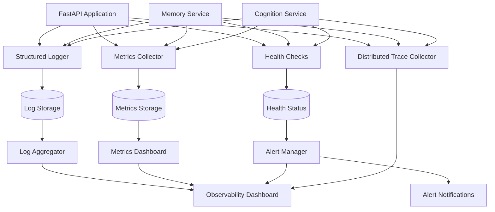

# Logging and Monitoring Implementation Guide

## Overview

This document provides a comprehensive guide for implementing production-grade logging and monitoring in Phase 5 of the Cortex Core. It covers structured logging, metrics collection, health checks, alerting, and distributed tracing to ensure the system operates reliably in production.

Logging and monitoring are critical components of a production-ready system, enabling:

1. **Operational Visibility**: Understanding what's happening in the system
2. **Troubleshooting**: Diagnosing issues quickly when they occur
3. **Performance Analysis**: Identifying bottlenecks and optimization opportunities
4. **Security Monitoring**: Detecting and investigating potential security incidents
5. **Compliance**: Meeting regulatory and organizational requirements for logging
6. **Resource Planning**: Tracking resource utilization to plan for growth

This implementation builds upon the distributed architecture established in Phase 4, focusing on production hardening with enterprise-grade observability.

## System Architecture

Logging and monitoring components integrate with the Cortex Core architecture as follows:



### Key Components

1. **Structured Logger**: Creates standardized, JSON-formatted logs
2. **Metrics Collector**: Gathers performance and resource metrics
3. **Health Checks**: Monitors component health and dependencies
4. **Log Aggregator**: Centralizes logs from all services
5. **Metrics Dashboard**: Visualizes system performance metrics
6. **Alert Manager**: Triggers notifications based on conditions
7. **Distributed Trace Collector**: Tracks request flow across services
8. **Observability Dashboard**: Unified view of system health

## Logging Implementation

### Structured Logging Format

All logs must follow a consistent, structured JSON format to enable effective filtering, searching, and analysis.

#### Log Schema

```json
{
  "timestamp": "2025-03-21T10:15:30.123Z", // ISO 8601 with milliseconds
  "level": "INFO", // Log level (INFO, WARN, ERROR, etc.)
  "service": "cortex-core", // Service name
  "component": "api", // Component within service
  "message": "Request processed successfully", // Human-readable message
  "correlation_id": "550e8400-e29b-41d4-a716-446655440000", // Request tracking ID
  "user_id": "user-123", // User context (if applicable)
  "request_id": "req-456", // Unique request identifier
  "method": "GET", // HTTP method (for API logs)
  "path": "/api/resource", // Request path (for API logs)
  "status_code": 200, // Response status (for API logs)
  "duration_ms": 45, // Processing time in milliseconds
  "error": {
    // Present only for error logs
    "type": "ValidationError",
    "message": "Invalid input format",
    "stack": "..." // Stack trace (dev/staging only)
  },
  "context": {
    // Additional contextual information
    "workspace_id": "workspace-789",
    "conversation_id": "conversation-012"
  }
}
```

### Log Levels and Usage

Use appropriate log levels consistently across all services:

| Level     | When to Use                                                                | Examples                                                  |
| --------- | -------------------------------------------------------------------------- | --------------------------------------------------------- |
| **TRACE** | Very detailed information, used only for intensive debugging               | "Entered function with parameters: x=1, y=2"              |
| **DEBUG** | Detailed information useful for debugging                                  | "Processing item 3 of 10", "Cache hit for key 'user-123'" |
| **INFO**  | Normal operational messages, tracking workflow                             | "Request received", "User logged in", "Job completed"     |
| **WARN**  | Potential issues that don't prevent operation                              | "Retry attempt 2 of 3", "Deprecated API call used"        |
| **ERROR** | Errors that prevent a specific operation but allow the service to continue | "Failed to process request", "Database query timeout"     |
| **FATAL** | Critical errors causing the application to crash or be unusable            | "Cannot connect to database", "Out of memory"             |

#### Default Log Levels by Environment

| Environment | Default Log Level | Override Capability                                            |
| ----------- | ----------------- | -------------------------------------------------------------- |
| Development | DEBUG             | Via environment variable                                       |
| Testing     | INFO              | Via environment variable                                       |
| Staging     | INFO              | Via environment variable                                       |
| Production  | INFO              | Via environment variable (temporary DEBUG for troubleshooting) |

### Logging Middleware

Implement logging middleware to automatically log all HTTP requests and responses:

```python
import time
import uuid
from fastapi import Request, Response
from starlette.middleware.base import BaseHTTPMiddleware
from app.logging import get_logger

logger = get_logger(__name__)

class LoggingMiddleware(BaseHTTPMiddleware):
    async def dispatch(self, request: Request, call_next):
        # Generate correlation ID or use from headers if present
        correlation_id = request.headers.get("X-Correlation-ID", str(uuid.uuid4()))

        # Start timer
        start_time = time.time()

        # Add correlation ID to request state for access in endpoints
        request.state.correlation_id = correlation_id

        # Basic request details
        request_details = {
            "correlation_id": correlation_id,
            "method": request.method,
            "path": request.url.path,
            "client_ip": request.client.host if request.client else None,
            "user_agent": request.headers.get("User-Agent")
        }

        # Log request
        logger.info(f"Request: {request.method} {request.url.path}", extra=request_details)

        try:
            # Process request
            response = await call_next(request)

            # Calculate duration
            duration_ms = round((time.time() - start_time) * 1000, 2)

            # Log response
            logger.info(
                f"Response: {response.status_code} completed in {duration_ms}ms",
                extra={
                    **request_details,
                    "status_code": response.status_code,
                    "duration_ms": duration_ms
                }
            )

            # Add correlation ID to response headers
            response.headers["X-Correlation-ID"] = correlation_id

            return response

        except Exception as e:
            # Calculate duration
            duration_ms = round((time.time() - start_time) * 1000, 2)

            # Log exception
            logger.error(
                f"Exception: {str(e)}",
                extra={
                    **request_details,
                    "duration_ms": duration_ms,
                    "error": {
                        "type": type(e).__name__,
                        "message": str(e)
                    }
                },
                exc_info=True  # Include stack trace
            )

            # Re-raise the exception for the exception handler
            raise
```

### Structured Logger Implementation

Create a logger factory that produces consistent structured loggers:

```python
import logging
import json
import os
from datetime import datetime
import socket
import traceback
from typing import Dict, Any, Optional

class StructuredLogFormatter(logging.Formatter):
    """Formatter for structured JSON logs"""

    def __init__(self, service_name: str):
        super().__init__()
        self.service_name = service_name
        self.hostname = socket.gethostname()

    def format(self, record: logging.LogRecord) -> str:
        log_data = {
            "timestamp": datetime.utcnow().isoformat(),
            "level": record.levelname,
            "service": self.service_name,
            "component": record.name,
            "message": record.getMessage(),
            "hostname": self.hostname,
            "pid": os.getpid()
        }

        # Add exception info if available
        if record.exc_info:
            log_data["error"] = {
                "type": record.exc_info[0].__name__,
                "message": str(record.exc_info[1]),
                "stack": traceback.format_exception(*record.exc_info)
            }

        # Add extra fields from the record
        if hasattr(record, "correlation_id"):
            log_data["correlation_id"] = record.correlation_id

        # Add all other extra fields
        for key, value in record.__dict__.items():
            if key not in ["args", "asctime", "created", "exc_info", "exc_text", "filename",
                           "funcName", "id", "levelname", "levelno", "lineno", "module",
                           "msecs", "message", "msg", "name", "pathname", "process",
                           "processName", "relativeCreated", "stack_info", "thread", "threadName"]:
                if key != "error" or not record.exc_info:  # Don't overwrite error from exc_info
                    log_data[key] = value

        return json.dumps(log_data)

def setup_logging(service_name: str, log_level: Optional[str] = None) -> logging.Logger:
    """
    Configure structured logging for the application

    Args:
        service_name: Name of the service (e.g., "cortex-core", "memory-service")
        log_level: Optional override for the log level

    Returns:
        Root logger configured for structured logging
    """
    # Determine log level from environment or parameter
    level_name = log_level or os.getenv("LOG_LEVEL", "INFO").upper()
    level = getattr(logging, level_name, logging.INFO)

    # Get root logger
    root_logger = logging.getLogger()
    root_logger.setLevel(level)

    # Remove existing handlers
    for handler in root_logger.handlers:
        root_logger.removeHandler(handler)

    # Create console handler
    console_handler = logging.StreamHandler()
    console_handler.setFormatter(StructuredLogFormatter(service_name))
    root_logger.addHandler(console_handler)

    # Configure specific loggers
    logging.getLogger("uvicorn").setLevel(logging.WARNING)
    logging.getLogger("uvicorn.access").setLevel(logging.WARNING)
    logging.getLogger("uvicorn.error").setLevel(logging.ERROR)
    logging.getLogger("sqlalchemy.engine").setLevel(logging.WARNING)

    return root_logger

def get_logger(name: str) -> logging.Logger:
    """
    Get a logger with the given name

    Args:
        name: Logger name, typically __name__ for module-level loggers

    Returns:
        Logger configured for structured logging
    """
    return logging.getLogger(name)

# Context manager for correlation ID tracking
class LogContext:
    def __init__(self, correlation_id: str, **extra_fields):
        self.correlation_id = correlation_id
        self.extra_fields = extra_fields
        self.old_context = {}

    def __enter__(self):
        # Store current context
        frame = logging.currentframe()
        while frame:
            if "logrecord_context" in frame.f_locals:
                self.old_context = frame.f_locals["logrecord_context"].copy()
                break
            frame = frame.f_back

        # Set new context
        logging.logrecord_context = {
            "correlation_id": self.correlation_id,
            **self.extra_fields
        }

        return self

    def __exit__(self, exc_type, exc_val, exc_tb):
        # Restore old context
        logging.logrecord_context = self.old_context
```

### Correlation IDs

Correlation IDs are crucial for tracking requests through distributed systems:

1. **Generation**: Create a unique ID for each incoming request
2. **Propagation**: Pass the ID through all services and components
3. **Inclusion**: Add the ID to all log entries related to the request

#### Implementation Pattern

```python
# In the FastAPI application
@app.middleware("http")
async def add_correlation_id(request: Request, call_next):
    correlation_id = request.headers.get("X-Correlation-ID")

    if not correlation_id:
        correlation_id = str(uuid.uuid4())

    # Make correlation ID available to route handlers
    request.state.correlation_id = correlation_id

    # Process request
    response = await call_next(request)

    # Include correlation ID in response
    response.headers["X-Correlation-ID"] = correlation_id

    return response

# In route handlers
@app.get("/resource/{resource_id}")
async def get_resource(resource_id: str, request: Request):
    correlation_id = request.state.correlation_id

    # Use logger with correlation ID
    logger.info(
        f"Retrieving resource: {resource_id}",
        extra={"correlation_id": correlation_id}
    )

    # When making service calls, propagate the correlation ID
    headers = {"X-Correlation-ID": correlation_id}
    result = await service_client.call_api(resource_id, headers=headers)

    return result
```

### Request/Response Logging

Implement consistent request and response logging across all endpoints:

#### FastAPI Request Logging

```python
@app.middleware("http")
async def log_requests(request: Request, call_next):
    # Start timer
    start_time = time.time()

    # Extract correlation ID
    correlation_id = getattr(request.state, "correlation_id", str(uuid.uuid4()))

    # Get request details - avoid reading body as it's a stream
    request_details = {
        "correlation_id": correlation_id,
        "method": request.method,
        "path": request.url.path,
        "query_params": str(request.query_params),
        "client_ip": request.client.host,
        "user_agent": request.headers.get("User-Agent")
    }

    # Extract auth info if available (without logging sensitive data)
    auth_header = request.headers.get("Authorization")
    if auth_header and auth_header.startswith("Bearer "):
        # Don't log the actual token, just note its presence
        request_details["authenticated"] = True

    # Log request
    logger.info("HTTP Request", extra=request_details)

    # Process request
    response = await call_next(request)

    # Calculate duration
    duration_ms = round((time.time() - start_time) * 1000, 2)

    # Log response
    logger.info(
        "HTTP Response",
        extra={
            **request_details,
            "status_code": response.status_code,
            "duration_ms": duration_ms
        }
    )

    return response
```

#### MCP Client Request Logging

```python
async def call_tool(self, name: str, arguments: dict):
    """Call a tool on the MCP server with logging."""
    correlation_id = getattr(logging.logrecord_context, "correlation_id", str(uuid.uuid4()))

    logger.info(
        f"MCP tool call: {name}",
        extra={
            "correlation_id": correlation_id,
            "tool_name": name,
            "arguments": {k: v for k, v in arguments.items() if k not in ["password", "token", "secret"]}
        }
    )

    start_time = time.time()

    try:
        result = await self.session.call_tool(name=name, arguments=arguments)

        duration_ms = round((time.time() - start_time) * 1000, 2)

        logger.info(
            f"MCP tool response: {name}",
            extra={
                "correlation_id": correlation_id,
                "tool_name": name,
                "duration_ms": duration_ms,
                "success": True
            }
        )

        return result
    except Exception as e:
        duration_ms = round((time.time() - start_time) * 1000, 2)

        logger.error(
            f"MCP tool error: {name}",
            extra={
                "correlation_id": correlation_id,
                "tool_name": name,
                "duration_ms": duration_ms,
                "error": {
                    "type": type(e).__name__,
                    "message": str(e)
                },
                "success": False
            },
            exc_info=True
        )

        raise
```

### Database Query Logging

Configure SQLAlchemy to log database queries with appropriate detail:

```python
import logging
from sqlalchemy import event
from sqlalchemy.engine import Engine
import time

logger = logging.getLogger("sqlalchemy.engine")

@event.listens_for(Engine, "before_cursor_execute")
def before_cursor_execute(conn, cursor, statement, parameters, context, executemany):
    conn.info.setdefault('query_start_time', []).append(time.time())

    # Only log in debug mode to prevent sensitive data exposure
    if logger.isEnabledFor(logging.DEBUG):
        logger.debug(
            "SQL Query",
            extra={
                "statement": statement,
                "parameters": parameters,
                "executemany": executemany
            }
        )

@event.listens_for(Engine, "after_cursor_execute")
def after_cursor_execute(conn, cursor, statement, parameters, context, executemany):
    start_time = conn.info['query_start_time'].pop()
    duration_ms = round((time.time() - start_time) * 1000, 2)

    logger.info(
        "SQL Query Completed",
        extra={
            "duration_ms": duration_ms,
            "executemany": executemany
        }
    )
```

### Log Configuration

Control logging behavior through environment variables:

```python
# .env file
LOG_LEVEL=INFO                 # TRACE, DEBUG, INFO, WARN, ERROR, FATAL
LOG_FORMAT=json                # json or text
LOG_OUTPUT=stdout              # stdout or file
LOG_FILE_PATH=/var/log/cortex-core.log  # Used when LOG_OUTPUT=file
LOG_RETENTION_DAYS=30          # Log retention period
SENSITIVE_FIELDS=password,token,secret  # Fields to redact
```

Application startup log configuration:

```python
from app.logging import setup_logging
import os

# Configure logging during application startup
def configure_logging():
    log_level = os.getenv("LOG_LEVEL", "INFO")
    service_name = os.getenv("SERVICE_NAME", "cortex-core")

    # Setup structured logging
    logger = setup_logging(service_name, log_level)

    # Log startup information
    logger.info(
        f"Starting {service_name}",
        extra={
            "environment": os.getenv("ENVIRONMENT", "development"),
            "version": os.getenv("VERSION", "unknown")
        }
    )

    return logger

# Call during application startup
logger = configure_logging()
```

### Sensitive Data Handling

Prevent logging of sensitive information:

```python
def redact_sensitive_data(data, sensitive_fields=None):
    """
    Redact sensitive fields from log data

    Args:
        data: Dictionary containing data to redact
        sensitive_fields: List of field names to redact

    Returns:
        Copy of data with sensitive fields redacted
    """
    if not data or not isinstance(data, dict):
        return data

    if sensitive_fields is None:
        # Default sensitive fields to redact
        sensitive_fields = os.getenv("SENSITIVE_FIELDS", "password,token,secret").split(",")

    result = {}

    for key, value in data.items():
        # Check if this key should be redacted
        if any(sensitive in key.lower() for sensitive in sensitive_fields):
            result[key] = "******"
        elif isinstance(value, dict):
            # Recursively redact nested dictionaries
            result[key] = redact_sensitive_data(value, sensitive_fields)
        elif isinstance(value, list):
            # Recursively redact items in lists
            result[key] = [
                redact_sensitive_data(item, sensitive_fields) if isinstance(item, dict) else item
                for item in value
            ]
        else:
            result[key] = value

    return result
```

## Monitoring Implementation

### Health Checks

Implement comprehensive health checks for the application and its dependencies:

```python
from fastapi import FastAPI, Depends, HTTPException, status
from pydantic import BaseModel
from typing import Dict, Any, List, Optional
import aiohttp
import asyncio
import time

app = FastAPI()

class HealthStatus(BaseModel):
    status: str  # "healthy", "degraded", or "unhealthy"
    version: str
    checks: Dict[str, Dict[str, Any]]
    timestamp: str

async def check_database():
    """Check database connection"""
    start_time = time.time()

    try:
        # Run a simple query to check connection
        async with db.session() as session:
            result = await session.execute("SELECT 1")
            await result.fetchone()

        duration_ms = round((time.time() - start_time) * 1000, 2)

        return {
            "status": "healthy",
            "message": "Database connection successful",
            "duration_ms": duration_ms
        }
    except Exception as e:
        duration_ms = round((time.time() - start_time) * 1000, 2)

        return {
            "status": "unhealthy",
            "message": f"Database connection failed: {str(e)}",
            "duration_ms": duration_ms
        }

async def check_memory_service():
    """Check Memory Service connection"""
    start_time = time.time()

    try:
        # Call a simple endpoint to check connection
        response = await memory_client.get_health()

        duration_ms = round((time.time() - start_time) * 1000, 2)

        if response.get("status") == "healthy":
            return {
                "status": "healthy",
                "message": "Memory Service connection successful",
                "duration_ms": duration_ms
            }
        else:
            return {
                "status": "degraded",
                "message": f"Memory Service reported degraded: {response.get('message')}",
                "duration_ms": duration_ms
            }
    except Exception as e:
        duration_ms = round((time.time() - start_time) * 1000, 2)

        return {
            "status": "unhealthy",
            "message": f"Memory Service connection failed: {str(e)}",
            "duration_ms": duration_ms
        }

async def check_cognition_service():
    """Check Cognition Service connection"""
    # Similar to Memory Service check
    pass

@app.get("/health", response_model=HealthStatus)
async def health_check():
    """
    Comprehensive health check endpoint

    Returns:
        Health status of the application and its dependencies
    """
    version = os.getenv("VERSION", "unknown")

    # Run all checks concurrently
    db_result, memory_result, cognition_result = await asyncio.gather(
        check_database(),
        check_memory_service(),
        check_cognition_service(),
        return_exceptions=True
    )

    # Process any exceptions
    if isinstance(db_result, Exception):
        db_result = {
            "status": "unhealthy",
            "message": f"Database check failed: {str(db_result)}"
        }

    if isinstance(memory_result, Exception):
        memory_result = {
            "status": "unhealthy",
            "message": f"Memory Service check failed: {str(memory_result)}"
        }

    if isinstance(cognition_result, Exception):
        cognition_result = {
            "status": "unhealthy",
            "message": f"Cognition Service check failed: {str(cognition_result)}"
        }

    # Compile all checks
    checks = {
        "database": db_result,
        "memory_service": memory_result,
        "cognition_service": cognition_result
    }

    # Determine overall status
    if any(check["status"] == "unhealthy" for check in checks.values()):
        status = "unhealthy"
    elif any(check["status"] == "degraded" for check in checks.values()):
        status = "degraded"
    else:
        status = "healthy"

    # For unhealthy status, return 503 Service Unavailable
    if status == "unhealthy" and not app.debug:
        raise HTTPException(
            status_code=status.HTTP_503_SERVICE_UNAVAILABLE,
            detail="Service unavailable"
        )

    return HealthStatus(
        status=status,
        version=version,
        checks=checks,
        timestamp=datetime.utcnow().isoformat()
    )

# Simplified health check for Kubernetes readiness/liveness probes
@app.get("/health/ready")
async def readiness_check():
    """Simple readiness check"""
    try:
        # Check database connection
        async with db.session() as session:
            result = await session.execute("SELECT 1")
            await result.fetchone()

        return {"status": "ready"}
    except Exception:
        raise HTTPException(status_code=503, detail="Service not ready")

@app.get("/health/live")
async def liveness_check():
    """Simple liveness check"""
    return {"status": "alive"}
```

### Metrics Collection

Implement metrics collection using Prometheus client:

```python
from prometheus_client import Counter, Histogram, Gauge, Info, generate_latest, CONTENT_TYPE_LATEST
from fastapi import FastAPI, Request, Response
import time
import psutil
import os

app = FastAPI()

# Define metrics
REQUEST_COUNT = Counter(
    "http_requests_total",
    "Total number of HTTP requests",
    ["method", "endpoint", "status_code"]
)

REQUEST_LATENCY = Histogram(
    "http_request_duration_seconds",
    "HTTP request latency in seconds",
    ["method", "endpoint"],
    buckets=[0.01, 0.025, 0.05, 0.1, 0.25, 0.5, 1, 2.5, 5, 10]
)

ACTIVE_REQUESTS = Gauge(
    "http_requests_active",
    "Number of active HTTP requests"
)

CPU_USAGE = Gauge(
    "process_cpu_usage_percent",
    "CPU usage percentage"
)

MEMORY_USAGE = Gauge(
    "process_memory_usage_bytes",
    "Memory usage in bytes"
)

SERVICE_INFO = Info(
    "service",
    "Service information"
)

# Set service info once at startup
SERVICE_INFO.info({
    "name": os.getenv("SERVICE_NAME", "cortex-core"),
    "version": os.getenv("VERSION", "unknown"),
    "environment": os.getenv("ENVIRONMENT", "development")
})

# Resource metrics collection task
async def collect_resource_metrics():
    """Collect and update resource metrics periodically"""
    while True:
        # Update CPU usage
        CPU_USAGE.set(psutil.cpu_percent(interval=None))

        # Update memory usage
        process = psutil.Process(os.getpid())
        memory_info = process.memory_info()
        MEMORY_USAGE.set(memory_info.rss)

        # Sleep for 15 seconds
        await asyncio.sleep(15)

# Start metrics collection on application startup
@app.on_event("startup")
async def start_metrics_collection():
    asyncio.create_task(collect_resource_metrics())

# Middleware to collect request metrics
@app.middleware("http")
async def metrics_middleware(request: Request, call_next):
    # Skip metrics endpoint itself to avoid recursion
    if request.url.path == "/metrics":
        return await call_next(request)

    # Extract endpoint pattern (replacing parameters with {param})
    endpoint = request.url.path
    for route in app.routes:
        if route.path_regex.match(endpoint):
            endpoint = route.path
            break

    # Increment active requests
    ACTIVE_REQUESTS.inc()

    # Record start time
    start_time = time.time()

    try:
        # Process request
        response = await call_next(request)

        # Record metrics
        duration = time.time() - start_time
        REQUEST_LATENCY.labels(request.method, endpoint).observe(duration)
        REQUEST_COUNT.labels(request.method, endpoint, response.status_code).inc()

        return response
    except Exception as e:
        # Record metrics for exceptions (500 status)
        duration = time.time() - start_time
        REQUEST_LATENCY.labels(request.method, endpoint).observe(duration)
        REQUEST_COUNT.labels(request.method, endpoint, 500).inc()

        # Re-raise the exception
        raise
    finally:
        # Always decrement active requests
        ACTIVE_REQUESTS.dec()

# Metrics endpoint
@app.get("/metrics")
async def metrics():
    """Endpoint for scraping metrics"""
    return Response(
        content=generate_latest(),
        media_type=CONTENT_TYPE_LATEST
    )
```

### Database Metrics

Track database performance metrics:

```python
from prometheus_client import Counter, Histogram, Gauge
from sqlalchemy import event
from sqlalchemy.engine import Engine
import time

# Define database metrics
DB_QUERY_COUNT = Counter(
    "db_queries_total",
    "Total number of database queries",
    ["operation", "table"]
)

DB_QUERY_LATENCY = Histogram(
    "db_query_duration_seconds",
    "Database query latency in seconds",
    ["operation", "table"],
    buckets=[0.001, 0.005, 0.01, 0.025, 0.05, 0.1, 0.25, 0.5, 1, 2.5, 5]
)

DB_POOL_SIZE = Gauge(
    "db_pool_size",
    "Database connection pool size"
)

DB_POOL_CHECKED_OUT = Gauge(
    "db_pool_connections_checked_out",
    "Number of connections checked out from the pool"
)

DB_POOL_OVERFLOW = Gauge(
    "db_pool_overflow",
    "Number of overflow connections in the pool"
)

# Extract operation type and table from SQL statement
def extract_sql_info(statement):
    statement = statement.lower()

    # Determine operation type
    if statement.startswith("select"):
        operation = "select"
    elif statement.startswith("insert"):
        operation = "insert"
    elif statement.startswith("update"):
        operation = "update"
    elif statement.startswith("delete"):
        operation = "delete"
    else:
        operation = "other"

    # Try to extract table name
    # This is a simplistic approach and might need refinement
    table = "unknown"

    if operation == "select":
        # Look for FROM clause
        from_parts = statement.split(" from ")
        if len(from_parts) > 1:
            table_parts = from_parts[1].split()[0].strip()
            table = table_parts.split(",")[0].strip()
    elif operation in ("insert", "update", "delete"):
        # Look for INTO/UPDATE/FROM clause
        parts = statement.split()
        for i, part in enumerate(parts):
            if part in ("into", "update", "from") and i + 1 < len(parts):
                table = parts[i + 1].strip()
                break

    # Remove any quotes or backticks
    table = table.replace('"', '').replace('`', '').replace("'", "")

    return operation, table

# SQLAlchemy event listeners for metrics
@event.listens_for(Engine, "before_cursor_execute")
def before_cursor_execute(conn, cursor, statement, parameters, context, executemany):
    conn.info.setdefault('query_start_time', []).append(time.time())

    # Extract operation and table
    operation, table = extract_sql_info(statement)

    # Store for use in after_cursor_execute
    conn.info.setdefault('query_info', []).append((operation, table))

@event.listens_for(Engine, "after_cursor_execute")
def after_cursor_execute(conn, cursor, statement, parameters, context, executemany):
    start_time = conn.info['query_start_time'].pop()
    operation, table = conn.info['query_info'].pop()

    # Calculate duration
    duration = time.time() - start_time

    # Record metrics
    DB_QUERY_COUNT.labels(operation, table).inc()
    DB_QUERY_LATENCY.labels(operation, table).observe(duration)

# Connection pool metrics
@event.listens_for(Engine, "connect")
def connect(dbapi_connection, connection_record):
    engine = connection_record.engine

    # Update pool metrics
    DB_POOL_SIZE.set(engine.pool.size())
    DB_POOL_CHECKED_OUT.set(engine.pool.checkedout())
    DB_POOL_OVERFLOW.set(engine.pool.overflow())

@event.listens_for(Engine, "checkout")
def checkout(dbapi_connection, connection_record, connection_proxy):
    engine = connection_record.engine

    # Update checked out metric
    DB_POOL_CHECKED_OUT.set(engine.pool.checkedout())

@event.listens_for(Engine, "checkin")
def checkin(dbapi_connection, connection_record):
    engine = connection_record.engine

    # Update checked out metric
    DB_POOL_CHECKED_OUT.set(engine.pool.checkedout())
```

### Service-Specific Metrics

Implement service-specific metrics to track business operations:

```python
from prometheus_client import Counter, Histogram, Gauge, Summary

# API-specific metrics
API_AUTH_ATTEMPTS = Counter(
    "api_auth_attempts_total",
    "Total number of authentication attempts",
    ["status"]  # "success" or "failure"
)

API_WORKSPACE_OPERATIONS = Counter(
    "api_workspace_operations_total",
    "Total number of workspace operations",
    ["operation"]  # "create", "list", "get", "update", "delete"
)

API_CONVERSATION_OPERATIONS = Counter(
    "api_conversation_operations_total",
    "Total number of conversation operations",
    ["operation"]  # "create", "list", "get", "update", "delete"
)

API_MESSAGE_OPERATIONS = Counter(
    "api_message_operations_total",
    "Total number of message operations",
    ["operation"]  # "create", "list"
)

# Memory Service metrics
MEMORY_SERVICE_OPERATIONS = Counter(
    "memory_service_operations_total",
    "Total number of Memory Service operations",
    ["operation"]  # "store_input", "get_history", etc.
)

MEMORY_SERVICE_LATENCY = Histogram(
    "memory_service_operation_duration_seconds",
    "Memory Service operation latency in seconds",
    ["operation"],
    buckets=[0.01, 0.025, 0.05, 0.1, 0.25, 0.5, 1, 2.5, 5]
)

MEMORY_SERVICE_STORAGE_SIZE = Gauge(
    "memory_service_storage_size_bytes",
    "Memory Service storage size in bytes",
    ["user_id"]
)

# Cognition Service metrics
COGNITION_SERVICE_OPERATIONS = Counter(
    "cognition_service_operations_total",
    "Total number of Cognition Service operations",
    ["operation"]  # "get_context", etc.
)

COGNITION_SERVICE_LATENCY = Histogram(
    "cognition_service_operation_duration_seconds",
    "Cognition Service operation latency in seconds",
    ["operation"],
    buckets=[0.01, 0.025, 0.05, 0.1, 0.25, 0.5, 1, 2.5, 5]
)

# Event bus metrics
EVENT_BUS_PUBLISHED = Counter(
    "event_bus_events_published_total",
    "Total number of events published on the event bus",
    ["event_type"]
)

EVENT_BUS_DELIVERED = Counter(
    "event_bus_events_delivered_total",
    "Total number of events delivered to subscribers",
    ["event_type"]
)

EVENT_BUS_SUBSCRIBERS = Gauge(
    "event_bus_subscribers",
    "Number of active subscribers to the event bus"
)

# SSE metrics
SSE_CONNECTIONS = Gauge(
    "sse_connections_active",
    "Number of active SSE connections"
)

SSE_EVENTS_SENT = Counter(
    "sse_events_sent_total",
    "Total number of SSE events sent to clients",
    ["event_type"]
)
```

### Custom Business Metrics

Track key business metrics specific to your application:

```python
from prometheus_client import Counter, Gauge, Histogram

# User engagement metrics
USER_LOGINS = Counter(
    "user_logins_total",
    "Total number of user logins",
    ["auth_method"]  # "password", "b2c", etc.
)

ACTIVE_USERS = Gauge(
    "active_users",
    "Number of active users in the last 24 hours"
)

WORKSPACE_COUNT = Gauge(
    "workspaces_total",
    "Total number of workspaces",
    ["status"]  # "active", "archived"
)

CONVERSATION_COUNT = Gauge(
    "conversations_total",
    "Total number of conversations",
    ["status"]  # "active", "archived"
)

MESSAGE_COUNT = Counter(
    "messages_total",
    "Total number of messages processed"
)

# Response time metrics (user experience)
UX_RESPONSE_TIME = Histogram(
    "ux_response_time_seconds",
    "End-to-end response time for user operations",
    ["operation"],
    buckets=[0.1, 0.25, 0.5, 1, 2.5, 5, 10, 30, 60]
)
```

## Alerting System

### Alert Configuration

Define alerts for critical system conditions:

```python
# prometheus-alerts.yml
groups:
  - name: cortex-core-alerts
    rules:
      - alert: HighErrorRate
        expr: rate(http_requests_total{status_code=~"5.."}[5m]) / rate(http_requests_total[5m]) > 0.05
        for: 5m
        labels:
          severity: warning
        annotations:
          summary: "High error rate detected"
          description: "Error rate is above 5% for the last 5 minutes"
          dashboard: "https://grafana.example.com/d/ABC123/cortex-core-dashboard"

      - alert: ServiceUnavailable
        expr: up{job="cortex-core"} == 0 or health_status{service="cortex-core"} == 0
        for: 1m
        labels:
          severity: critical
        annotations:
          summary: "Service is unavailable"
          description: "Cortex Core service is down or reporting unhealthy status"
          runbook: "https://wiki.example.com/runbooks/service-unavailable"

      - alert: HighDatabaseLatency
        expr: histogram_quantile(0.95, rate(db_query_duration_seconds_bucket[5m])) > 1
        for: 5m
        labels:
          severity: warning
        annotations:
          summary: "High database query latency"
          description: "95th percentile database query latency is above 1 second"

      - alert: ConnectionPoolNearlyFull
        expr: db_pool_connections_checked_out / (db_pool_size + db_pool_overflow) > 0.8
        for: 5m
        labels:
          severity: warning
        annotations:
          summary: "Database connection pool nearly full"
          description: "Over 80% of connections are in use for more than 5 minutes"

      - alert: HighMemoryUsage
        expr: process_memory_usage_bytes / (1024 * 1024 * 1024) > 1.8
        for: 5m
        labels:
          severity: warning
        annotations:
          summary: "High memory usage"
          description: "Memory usage is above 1.8 GB for more than 5 minutes"

      - alert: HighCpuUsage
        expr: process_cpu_usage_percent > 80
        for: 5m
        labels:
          severity: warning
        annotations:
          summary: "High CPU usage"
          description: "CPU usage is above 80% for more than 5 minutes"
```

### Alert Severity Levels

Define standardized alert severity levels:

| Level        | Description                             | Response Time                           | Notification Method    |
| ------------ | --------------------------------------- | --------------------------------------- | ---------------------- |
| **Critical** | Service is down or severely degraded    | Immediate (24/7)                        | Phone call, SMS, email |
| **Warning**  | Service is degraded or at risk          | Within 30 minutes during business hours | Email, Slack           |
| **Info**     | Notable event but not service-impacting | Next business day                       | Email, dashboard       |

### Alert Response Workflows

Document standard response procedures for common alerts:

#### High Error Rate Response

1. Check application logs for error patterns
2. Review recent deployments or changes
3. Check dependent service health
4. Verify database connectivity
5. Check for external service outages
6. Consider rolling back recent changes if identified as cause
7. Escalate if not resolved within 30 minutes

#### Service Unavailable Response

1. Verify if the service is actually down (check monitoring)
2. Attempt to restart the service
3. Check for resource exhaustion (CPU, memory, disk)
4. Check database connectivity
5. Review application logs for crash indicators
6. Verify network connectivity
7. Escalate to senior engineers if not resolved in 15 minutes

#### High Database Latency Response

1. Check database server load
2. Review slow query logs
3. Identify queries causing high load
4. Check for missing indexes
5. Verify connection pool configuration
6. Consider query optimization if persistent issue
7. Scale database resources if necessary

## Distributed Tracing

### OpenTelemetry Integration

Implement distributed tracing using OpenTelemetry:

```python
from opentelemetry import trace
from opentelemetry.exporter.otlp.proto.grpc.trace_exporter import OTLPSpanExporter
from opentelemetry.sdk.resources import SERVICE_NAME, Resource
from opentelemetry.sdk.trace import TracerProvider
from opentelemetry.sdk.trace.export import BatchSpanProcessor
from opentelemetry.instrumentation.fastapi import FastAPIInstrumentor
from opentelemetry.instrumentation.aiohttp import AioHttpClientInstrumentor
from opentelemetry.instrumentation.sqlalchemy import SQLAlchemyInstrumentor
import os

def setup_tracing(app, db_engine=None):
    """
    Configure OpenTelemetry distributed tracing

    Args:
        app: FastAPI application
        db_engine: Optional SQLAlchemy engine to instrument
    """
    # Configure the tracer provider
    resource = Resource(attributes={
        SERVICE_NAME: os.getenv("SERVICE_NAME", "cortex-core")
    })

    trace_provider = TracerProvider(resource=resource)

    # Configure the OTLP exporter
    otlp_exporter = OTLPSpanExporter(
        endpoint=os.getenv("OTLP_ENDPOINT", "localhost:4317"),
        insecure=os.getenv("OTLP_INSECURE", "true").lower() == "true"
    )

    # Add span processor
    trace_provider.add_span_processor(BatchSpanProcessor(otlp_exporter))

    # Set global trace provider
    trace.set_tracer_provider(trace_provider)

    # Instrument FastAPI
    FastAPIInstrumentor.instrument_app(app)

    # Instrument AIOHTTP for client requests
    AioHttpClientInstrumentor().instrument()

    # Instrument SQLAlchemy if engine provided
    if db_engine:
        SQLAlchemyInstrumentor().instrument(
            engine=db_engine,
            enable_commenter=True,
            commenter_options={}
        )

    return trace.get_tracer(os.getenv("SERVICE_NAME", "cortex-core"))

# Example manual span creation
async def traced_operation(tracer):
    """Example of creating manual spans"""
    with tracer.start_as_current_span("operation-name") as span:
        # Add attributes to span
        span.set_attribute("operation.id", "12345")
        span.set_attribute("operation.type", "example")

        # Create child span
        with tracer.start_as_current_span("child-operation") as child_span:
            # Perform operation
            result = await perform_work()

            # Record successful outcome
            child_span.set_attribute("operation.result", "success")

            return result
```

### Trace Context Propagation

Ensure trace context is propagated across service boundaries:

```python
from opentelemetry.propagate import inject, extract
from opentelemetry.trace import SpanKind, INVALID_SPAN
from opentelemetry.propagators.textmap import DefaultGetter, DefaultSetter

# Example MCP client with trace propagation
class McpClient:
    def __init__(self, endpoint: str, service_name: str):
        self.endpoint = endpoint
        self.service_name = service_name
        self.client = None
        self.tracer = trace.get_tracer(service_name)

    async def call_tool(self, name: str, arguments: dict):
        """Call a tool on the MCP server with tracing"""
        # Start span for this operation
        with self.tracer.start_as_current_span(
            f"mcp.tool.{name}",
            kind=SpanKind.CLIENT
        ) as span:
            # Add attributes to span
            span.set_attribute("mcp.tool.name", name)
            span.set_attribute("mcp.service", self.service_name)

            # Get current context
            headers = {}
            inject(headers)  # Injects trace context into headers

            # Add trace context to arguments
            arguments["_trace_context"] = headers

            try:
                # Call the tool
                result = await self.client.call_tool(name=name, arguments=arguments)

                # Record success
                span.set_attribute("mcp.result.success", True)

                return result
            except Exception as e:
                # Record error
                span.set_attribute("mcp.result.success", False)
                span.set_attribute("error", True)
                span.set_attribute("error.message", str(e))
                span.set_attribute("error.type", type(e).__name__)

                # Re-raise the exception
                raise

# Example for handling trace context on server side
async def handle_tool_call(name: str, arguments: dict):
    """Handle a tool call with trace context propagation"""
    # Extract trace context from arguments
    trace_context = arguments.pop("_trace_context", {})

    # Create server-side context manager
    ctx = extract(trace_context, getter=DefaultGetter())
    token = ctx.attach()

    try:
        # Start span for server-side handling
        with tracer.start_as_current_span(
            f"mcp.server.{name}",
            kind=SpanKind.SERVER
        ) as span:
            # Add attributes
            span.set_attribute("mcp.tool.name", name)

            # Process the tool call
            result = await process_tool(name, arguments)

            return result
    finally:
        # Detach context
        ctx.detach(token)
```

### Span Attributes

Standardize key span attributes for consistency:

```python
# HTTP request attributes
span.set_attribute("http.method", request.method)
span.set_attribute("http.url", str(request.url))
span.set_attribute("http.status_code", response.status_code)

# Database query attributes
span.set_attribute("db.system", "postgresql")
span.set_attribute("db.name", "cortex_db")
span.set_attribute("db.operation", operation)
span.set_attribute("db.statement", statement)

# MCP service attributes
span.set_attribute("mcp.service", service_name)
span.set_attribute("mcp.tool", tool_name)
span.set_attribute("mcp.arguments", str(arguments))

# Business context attributes
span.set_attribute("user.id", user_id)
span.set_attribute("workspace.id", workspace_id)
span.set_attribute("conversation.id", conversation_id)
```

## Integration with Central Observability Platform

### Log Aggregation

Configure log forwarding to central aggregation system:

```python
# fluent-bit.conf for log shipping
[SERVICE]
    Flush        1
    Log_Level    info
    Daemon       off

[INPUT]
    Name         tail
    Path         /var/log/cortex-core.log
    Tag          cortex-core
    Parser       json

[FILTER]
    Name         modify
    Match        cortex-core
    Add          environment ${ENVIRONMENT}
    Add          service cortex-core

[OUTPUT]
    Name         elasticsearch
    Match        cortex-core
    Host         elasticsearch-service
    Port         9200
    Index        cortex-logs
    Type         _doc

[OUTPUT]
    Name         stdout
    Match        cortex-core
```

### Prometheus Integration

Configure Prometheus scraping:

```yaml
# prometheus.yml
scrape_configs:
  - job_name: "cortex-core"
    scrape_interval: 15s
    metrics_path: "/metrics"
    static_configs:
      - targets: ["cortex-core-service:8000"]
        labels:
          service: "cortex-core"
          environment: "production"

  - job_name: "memory-service"
    scrape_interval: 15s
    metrics_path: "/metrics"
    static_configs:
      - targets: ["memory-service:9000"]
        labels:
          service: "memory-service"
          environment: "production"

  - job_name: "cognition-service"
    scrape_interval: 15s
    metrics_path: "/metrics"
    static_configs:
      - targets: ["cognition-service:9100"]
        labels:
          service: "cognition-service"
          environment: "production"
```

### Grafana Dashboards

Create comprehensive Grafana dashboards:

#### General Service Dashboard

```json
{
  "title": "Cortex Core Dashboard",
  "panels": [
    {
      "title": "HTTP Request Rate",
      "type": "graph",
      "datasource": "Prometheus",
      "targets": [
        {
          "expr": "sum(rate(http_requests_total[5m])) by (endpoint)",
          "legendFormat": "{{endpoint}}"
        }
      ]
    },
    {
      "title": "HTTP Response Time (95th Percentile)",
      "type": "graph",
      "datasource": "Prometheus",
      "targets": [
        {
          "expr": "histogram_quantile(0.95, sum(rate(http_request_duration_seconds_bucket[5m])) by (le, endpoint))",
          "legendFormat": "{{endpoint}}"
        }
      ]
    },
    {
      "title": "Error Rate",
      "type": "graph",
      "datasource": "Prometheus",
      "targets": [
        {
          "expr": "sum(rate(http_requests_total{status_code=~\"5..\"}[5m])) / sum(rate(http_requests_total[5m]))",
          "legendFormat": "Error Rate"
        }
      ]
    },
    {
      "title": "Active Requests",
      "type": "gauge",
      "datasource": "Prometheus",
      "targets": [
        {
          "expr": "http_requests_active",
          "legendFormat": "Active Requests"
        }
      ]
    },
    {
      "title": "Memory Usage",
      "type": "graph",
      "datasource": "Prometheus",
      "targets": [
        {
          "expr": "process_memory_usage_bytes / 1024 / 1024",
          "legendFormat": "Memory (MB)"
        }
      ]
    },
    {
      "title": "CPU Usage",
      "type": "graph",
      "datasource": "Prometheus",
      "targets": [
        {
          "expr": "process_cpu_usage_percent",
          "legendFormat": "CPU Usage (%)"
        }
      ]
    }
  ]
}
```

#### Database Performance Dashboard

```json
{
  "title": "Database Performance Dashboard",
  "panels": [
    {
      "title": "Query Rate by Operation",
      "type": "graph",
      "datasource": "Prometheus",
      "targets": [
        {
          "expr": "sum(rate(db_queries_total[5m])) by (operation)",
          "legendFormat": "{{operation}}"
        }
      ]
    },
    {
      "title": "Query Latency (95th Percentile)",
      "type": "graph",
      "datasource": "Prometheus",
      "targets": [
        {
          "expr": "histogram_quantile(0.95, sum(rate(db_query_duration_seconds_bucket[5m])) by (le, operation))",
          "legendFormat": "{{operation}}"
        }
      ]
    },
    {
      "title": "Connection Pool Usage",
      "type": "graph",
      "datasource": "Prometheus",
      "targets": [
        {
          "expr": "db_pool_connections_checked_out",
          "legendFormat": "Checked Out"
        },
        {
          "expr": "db_pool_size",
          "legendFormat": "Pool Size"
        },
        {
          "expr": "db_pool_overflow",
          "legendFormat": "Overflow"
        }
      ]
    }
  ]
}
```

## Testing Monitoring Implementation

### Unit Testing Logging

```python
import pytest
import logging
import json
from app.logging import StructuredLogFormatter, setup_logging, get_logger
from io import StringIO

def test_structured_logger_format():
    """Test structured logger formatter"""
    # Create a test formatter
    formatter = StructuredLogFormatter("test-service")

    # Create a log record
    record = logging.LogRecord(
        name="test",
        level=logging.INFO,
        pathname="test.py",
        lineno=42,
        msg="Test message",
        args=(),
        exc_info=None
    )

    # Add extra fields
    record.correlation_id = "test-correlation-id"
    record.user_id = "test-user-id"

    # Format the record
    formatted = formatter.format(record)

    # Parse JSON result
    log_data = json.loads(formatted)

    # Verify fields
    assert log_data["level"] == "INFO"
    assert log_data["service"] == "test-service"
    assert log_data["component"] == "test"
    assert log_data["message"] == "Test message"
    assert log_data["correlation_id"] == "test-correlation-id"
    assert log_data["user_id"] == "test-user-id"
    assert "timestamp" in log_data

def test_logger_with_correlation_id():
    """Test logger with correlation ID context"""
    # Create a string buffer for capturing log output
    log_output = StringIO()

    # Create a handler that writes to the buffer
    handler = logging.StreamHandler(log_output)
    handler.setFormatter(StructuredLogFormatter("test-service"))

    # Get a logger and add the handler
    logger = get_logger("test")
    logger.addHandler(handler)
    logger.setLevel(logging.INFO)

    # Log with correlation ID
    with LogContext("test-correlation-id", user_id="test-user"):
        logger.info("Test message with context")

    # Get log output
    log_data = json.loads(log_output.getvalue())

    # Verify correlation ID was included
    assert log_data["correlation_id"] == "test-correlation-id"
    assert log_data["user_id"] == "test-user"
    assert log_data["message"] == "Test message with context"
```

### Integration Testing Health Checks

```python
import pytest
from fastapi.testclient import TestClient
from app.main import app

client = TestClient(app)

def test_health_endpoint():
    """Test health check endpoint"""
    response = client.get("/health")

    # Verify response
    assert response.status_code == 200
    data = response.json()

    # Check required fields
    assert "status" in data
    assert "version" in data
    assert "checks" in data
    assert "timestamp" in data

    # Check that all required checks are present
    assert "database" in data["checks"]
    assert "memory_service" in data["checks"]
    assert "cognition_service" in data["checks"]

    # Verify each check has required fields
    for check in data["checks"].values():
        assert "status" in check
        assert "message" in check
        assert "duration_ms" in check

def test_readiness_probe():
    """Test Kubernetes readiness probe endpoint"""
    response = client.get("/health/ready")

    # In test environment, this should pass
    assert response.status_code == 200
    assert response.json()["status"] == "ready"

def test_liveness_probe():
    """Test Kubernetes liveness probe endpoint"""
    response = client.get("/health/live")

    assert response.status_code == 200
    assert response.json()["status"] == "alive"
```

### Testing Metrics Endpoints

```python
import pytest
from fastapi.testclient import TestClient
from app.main import app

client = TestClient(app)

def test_metrics_endpoint():
    """Test Prometheus metrics endpoint"""
    response = client.get("/metrics")

    # Verify response
    assert response.status_code == 200
    assert "text/plain" in response.headers["content-type"]

    # Check for important metrics in the response
    metrics_text = response.text

    # Check for HTTP metrics
    assert "http_requests_total" in metrics_text
    assert "http_request_duration_seconds" in metrics_text

    # Check for system metrics
    assert "process_cpu_usage_percent" in metrics_text
    assert "process_memory_usage_bytes" in metrics_text

def test_request_metrics_collection():
    """Test that metrics are collected for requests"""
    # Make a test request
    client.get("/test-endpoint")

    # Get metrics
    response = client.get("/metrics")
    metrics_text = response.text

    # Check for request count metric
    assert 'http_requests_total{endpoint="/test-endpoint",method="GET",status_code="404"}' in metrics_text
```

## Operational Procedures

### Log Rotation

Configure log rotation to manage log file size:

```
# logrotate.conf
/var/log/cortex-core.log {
    rotate 7
    daily
    compress
    missingok
    notifempty
    create 0640 cortex cortex
    postrotate
        systemctl kill -s USR1 cortex-core.service
    endscript
}
```

### Monitoring Dashboard Setup

Steps to set up monitoring dashboards:

1. **Install Grafana**:

   ```bash
   # Via Docker
   docker run -d -p 3000:3000 --name grafana grafana/grafana
   ```

2. **Add Prometheus Data Source**:

   - Navigate to Configuration > Data Sources
   - Add Prometheus data source
   - URL: http://prometheus:9090
   - Save & Test

3. **Import Dashboards**:

   - Navigate to Dashboards > Import
   - Upload dashboard JSON or paste dashboard JSON
   - Select Prometheus data source
   - Import

4. **Configure Alerting**:
   - Navigate to Alerting > Notification channels
   - Add email, Slack, or other notification channels
   - Configure alert rules

### Alert Response Playbooks

Create playbooks for common alert scenarios:

#### Database Connection Pool Alert Playbook

1. Check database server load and connections:

   ```bash
   # Check PostgreSQL active connections
   psql -c "SELECT count(*) FROM pg_stat_activity"

   # Check database server CPU and memory
   top -b -n 1
   ```

2. Check application logs for connection issues:

   ```bash
   # Search for connection-related errors
   grep "connection" /var/log/cortex-core.log | grep -i error
   ```

3. Review connection pool configuration:

   ```bash
   # Check environment variables
   echo $DB_POOL_SIZE
   echo $DB_MAX_OVERFLOW
   echo $DB_POOL_TIMEOUT
   ```

4. Restart the application if necessary:

   ```bash
   systemctl restart cortex-core.service
   ```

5. Monitor connection pool usage after restart:
   ```bash
   # Check metrics endpoint
   curl http://localhost:8000/metrics | grep db_pool
   ```

#### High Error Rate Alert Playbook

1. Check application logs for errors:

   ```bash
   # Count errors by type
   grep "ERROR" /var/log/cortex-core.log | awk -F'"error": {"type": "' '{print $2}' | awk -F'"' '{print $1}' | sort | uniq -c | sort -nr

   # Get recent errors
   grep "ERROR" /var/log/cortex-core.log | tail -n 20
   ```

2. Check health of dependent services:

   ```bash
   # Check service health
   curl http://memory-service:9000/health
   curl http://cognition-service:9100/health
   ```

3. Check system resources:

   ```bash
   # Check memory usage
   free -h

   # Check disk space
   df -h

   # Check CPU load
   uptime
   ```

4. Restart the service if necessary:
   ```bash
   systemctl restart cortex-core.service
   ```

## Best Practices

### What to Log

Follow these guidelines for what to log:

#### Log:

- Request and response metadata (not bodies)
- Business operations and their outcomes
- Authentication and authorization decisions
- Errors and exceptions with context
- Service interactions and their outcomes
- Configuration changes
- Startup and shutdown events
- Performance metrics for critical operations

#### Don't Log:

- Passwords, tokens, or credentials
- Personal identifiable information (PII)
- Sensitive business data
- Excessive debugging information in production
- High-frequency events that will flood logs
- Large request/response bodies

### Effective Logging Patterns

1. **Log at the Boundary**: Log at service entry and exit points
2. **Be Specific**: Include relevant details for troubleshooting
3. **Include Context**: Add correlation IDs and user context
4. **Use Appropriate Levels**: Choose the right log level
5. **Be Consistent**: Use consistent log format and naming
6. **Avoid Sensitive Data**: Never log sensitive or personal information

### Security Considerations

Ensure logging and monitoring are secure:

1. **Redact Sensitive Information**: Automatically redact passwords, tokens, etc.
2. **Log Access Control**: Restrict access to logs and monitoring dashboards
3. **Secure Transport**: Use HTTPS/TLS for log shipping and metrics collection
4. **Retention Policies**: Implement appropriate log retention policies
5. **Audit Logging**: Log security-relevant events separately for audit purposes

## Conclusion

This comprehensive logging and monitoring implementation provides the foundation for operating Cortex Core in a production environment. By following these guidelines, you will have complete visibility into the system's behavior, performance, and health, enabling rapid troubleshooting and informed operational decisions.

The implementation includes:

1. **Structured Logging**: Consistent, JSON-formatted logs with correlation IDs
2. **Metrics Collection**: Comprehensive metrics for all system components
3. **Health Checks**: Detailed health monitoring for the application and dependencies
4. **Alerting**: Proactive notification of potential issues
5. **Distributed Tracing**: End-to-end request tracking across services

These observability components work together to provide a complete picture of system health and performance, meeting the production-readiness criteria for Phase 5 of the Cortex Core project.
