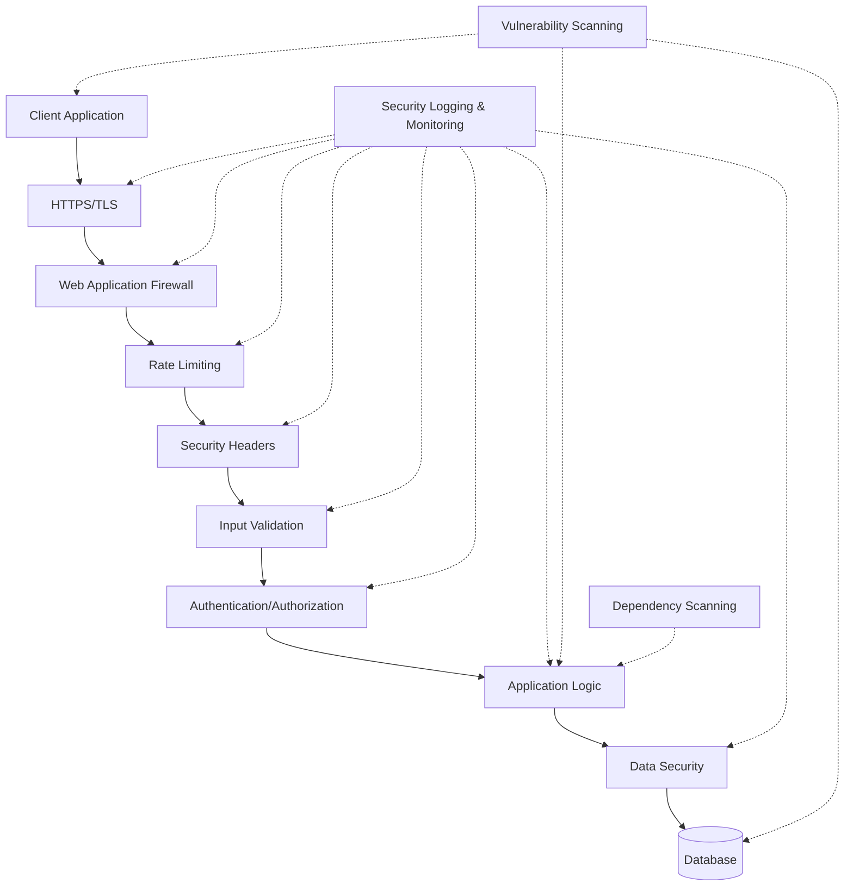

# Security Hardening Implementation Guide

## Overview

This document provides a comprehensive guide for implementing security hardening in Phase 5 of the Cortex Core. It covers all aspects of security that must be addressed to ensure the system meets enterprise-grade security standards before deployment to production.

Security hardening is a critical component of the production-readiness process, providing protection against common threats and vulnerabilities while ensuring compliance with security best practices and standards. This implementation builds upon the authentication and basic security measures implemented in earlier phases, focusing on comprehensive hardening across all system components.

## Security Architecture

The security architecture for Cortex Core consists of multiple layers of protection:



### Key Security Components

1. **HTTPS/TLS**: Secure communications with proper certificate management
2. **Web Application Firewall**: Protection against common web attacks
3. **Rate Limiting**: Prevention of abuse and DoS attacks
4. **Security Headers**: Browser-based security controls
5. **Input Validation**: Validation and sanitization of all inputs
6. **Authentication/Authorization**: Identity and access management
7. **Data Security**: Encryption and secure data handling
8. **Security Logging & Monitoring**: Detection and alerting
9. **Vulnerability Scanning**: Regular scanning and remediation
10. **Dependency Scanning**: Detection of vulnerable dependencies

## HTTPS Enforcement

### TLS Configuration

Implement secure HTTPS with modern TLS settings:

```python
from fastapi.middleware.httpsredirect import HTTPSRedirectMiddleware
import ssl

# Add HTTPS redirect middleware in production
if os.getenv("ENVIRONMENT") == "production":
    app.add_middleware(HTTPSRedirectMiddleware)

# Create SSL context with secure defaults
ssl_context = ssl.create_default_context(ssl.Purpose.CLIENT_AUTH)
ssl_context.minimum_version = ssl.TLSVersion.TLSv1_2
ssl_context.set_ciphers('ECDHE-ECDSA-AES128-GCM-SHA256:ECDHE-RSA-AES128-GCM-SHA256:ECDHE-ECDSA-AES256-GCM-SHA384:ECDHE-RSA-AES256-GCM-SHA384:ECDHE-ECDSA-CHACHA20-POLY1305:ECDHE-RSA-CHACHA20-POLY1305:DHE-RSA-AES128-GCM-SHA256:DHE-RSA-AES256-GCM-SHA384')
ssl_context.options |= ssl.OP_NO_TLSv1 | ssl.OP_NO_TLSv1_1
```

### Certificate Management

Configure TLS certificates properly:

1. **Production Certificates**:

   - Use certificates from trusted Certificate Authorities (CAs)
   - Set up automatic renewal (Let's Encrypt with certbot)
   - Ensure proper certificate chain installation

2. **Certificate Settings**:
   - 2048+ bit RSA keys or ECDSA keys
   - SHA-256 or better for signatures
   - Valid for 1 year maximum (preferably 90 days with auto-renewal)

### HSTS Implementation

Implement HTTP Strict Transport Security:

```python
@app.middleware("http")
async def add_hsts_header(request: Request, call_next):
    response = await call_next(request)

    # Only in production and only over HTTPS
    if os.getenv("ENVIRONMENT") == "production" and request.url.scheme == "https":
        # includeSubDomains and 1 year max-age (31536000 seconds)
        response.headers["Strict-Transport-Security"] = "max-age=31536000; includeSubDomains"

    return response
```

### Certificate Pinning (Optional)

For high-security deployments, implement certificate pinning:

```python
# HTTP Public Key Pinning (HPKP) header
# IMPORTANT: Have backup keys or risk site lockout!
if os.getenv("ENABLE_CERT_PINNING", "false").lower() == "true":
    primary_pin = os.getenv("PRIMARY_CERT_PIN")
    backup_pin = os.getenv("BACKUP_CERT_PIN")

    if primary_pin and backup_pin:
        # 90-day pin (in seconds)
        response.headers["Public-Key-Pins"] = f'pin-sha256="{primary_pin}"; pin-sha256="{backup_pin}"; max-age=7776000'
```

## Security Headers

### Implementing Security Headers

Add a middleware for security headers:

```python
@app.middleware("http")
async def security_headers_middleware(request: Request, call_next):
    response = await call_next(request)

    # Content Security Policy (CSP)
    response.headers["Content-Security-Policy"] = "default-src 'self'; script-src 'self'; style-src 'self'; img-src 'self' data:; font-src 'self'; connect-src 'self'; frame-src 'none'; object-src 'none'; base-uri 'self'"

    # Prevent MIME type sniffing
    response.headers["X-Content-Type-Options"] = "nosniff"

    # Prevent clickjacking
    response.headers["X-Frame-Options"] = "DENY"

    # Enable XSS protection
    response.headers["X-XSS-Protection"] = "1; mode=block"

    # Referrer Policy
    response.headers["Referrer-Policy"] = "strict-origin-when-cross-origin"

    # Permissions Policy (formerly Feature Policy)
    response.headers["Permissions-Policy"] = "camera=(), microphone=(), geolocation=(), interest-cohort=()"

    # Cache control for sensitive pages
    if request.url.path.startswith(("/api/auth/", "/api/user/")):
        response.headers["Cache-Control"] = "no-store, max-age=0"

    return response
```

### Content Security Policy (CSP)

Customize CSP based on application needs:

| Directive   | Value        | Purpose                                     |
| ----------- | ------------ | ------------------------------------------- |
| default-src | 'self'       | Default fallback for other fetch directives |
| script-src  | 'self'       | Allow JavaScript only from the same origin  |
| style-src   | 'self'       | Allow CSS only from the same origin         |
| img-src     | 'self' data: | Allow images from same origin and data URIs |
| connect-src | 'self'       | Allow AJAX/WebSocket only to same origin    |
| font-src    | 'self'       | Allow fonts only from same origin           |
| frame-src   | 'none'       | Disallow embedding site in iframes          |
| object-src  | 'none'       | Disallow Flash and other plugins            |
| base-uri    | 'self'       | Restrict base URI for relative URLs         |

### CSP Reporting

Set up CSP violation reporting:

```python
# Add reporting to the CSP
csp_value = response.headers.get("Content-Security-Policy", "")
if csp_value and os.getenv("CSP_REPORTING_URI"):
    # Add reporting directive
    report_uri = os.getenv("CSP_REPORTING_URI")
    response.headers["Content-Security-Policy"] = f"{csp_value}; report-uri {report_uri}"

    # Consider using Report-To header for modern browsers
    response.headers["Report-To"] = f'{{"endpoints":[{{"url":"{report_uri}"}}],"group":"csp-endpoint","max_age":10886400}}'
```

## Cross-Origin Resource Sharing (CORS)

### CORS Configuration

Configure CORS with appropriate restrictions:

```python
from fastapi.middleware.cors import CORSMiddleware

# Get allowed origins from environment
allowed_origins = os.getenv("CORS_ALLOWED_ORIGINS", "").split(",")

# In development, allow localhost
if os.getenv("ENVIRONMENT") == "development":
    allowed_origins.extend(["http://localhost:3000", "http://127.0.0.1:3000"])

# Add CORS middleware with proper restrictions
app.add_middleware(
    CORSMiddleware,
    allow_origins=allowed_origins,
    allow_credentials=True,
    allow_methods=["GET", "POST", "PUT", "DELETE", "OPTIONS"],
    allow_headers=["Authorization", "Content-Type", "X-Correlation-ID"],
    expose_headers=["X-Correlation-ID"],
    max_age=3600  # Cache preflight requests for 1 hour
)
```

### CORS Best Practices

1. **Restrict Origins**: Only allow trusted domains
2. **Limit Methods**: Only allow needed HTTP methods
3. **Restrict Headers**: Only allow specific headers
4. **Credentials Caution**: Be careful with allow_credentials=True
5. **Cache Preflight**: Set reasonable max_age to reduce OPTIONS requests

## API Rate Limiting

### Implementing Rate Limiting

Use a rate limiting middleware:

```python
from slowapi import Limiter, _rate_limit_exceeded_handler
from slowapi.errors import RateLimitExceeded
from slowapi.util import get_remote_address

# Create rate limiter
limiter = Limiter(key_func=get_remote_address)

# Add rate limiter to the application
app.state.limiter = limiter
app.add_exception_handler(RateLimitExceeded, _rate_limit_exceeded_handler)

# Apply rate limits to endpoints
@app.get("/api/resource")
@limiter.limit("10/minute")
async def get_resource(request: Request):
    return {"message": "Resource data"}

# Different limits for different endpoints
@app.post("/api/auth/login")
@limiter.limit("5/minute")
async def login(request: Request):
    # Login logic
    pass
```

### Tiered Rate Limiting

Implement tiered rate limiting based on user roles:

```python
def get_limit_key(request: Request):
    # Get user from request state (set by authentication middleware)
    user = getattr(request.state, "user", None)

    # Use user ID as key if authenticated
    if user and "user_id" in user:
        return user["user_id"]

    # Fall back to IP address for unauthenticated requests
    return get_remote_address(request)

def get_tier_limits(request: Request):
    # Get user from request state
    user = getattr(request.state, "user", None)

    # Define limits based on user role
    if user and "roles" in user:
        if "admin" in user["roles"]:
            return "100/minute"
        elif "premium" in user["roles"]:
            return "50/minute"

    # Default limit for regular users or unauthenticated
    return "10/minute"

# Apply dynamic limits
@app.get("/api/data")
@limiter.limit(get_tier_limits, key_func=get_limit_key)
async def get_data(request: Request):
    # Data access logic
    pass
```

### Global vs. Endpoint Rate Limiting

Use both global and endpoint-specific rate limits:

```python
# Global limiter on all routes
@app.middleware("http")
async def global_rate_limit(request: Request, call_next):
    # Skip internal paths
    if request.url.path.startswith("/internal/"):
        return await call_next(request)

    # Apply global rate limit
    await limiter.check_limits(request, "100/minute", get_remote_address)

    # Continue with request
    return await call_next(request)

# Stricter limits on sensitive endpoints
@app.post("/api/user/password-reset")
@limiter.limit("3/hour")
async def password_reset(request: Request):
    # Password reset logic
    pass
```

## Input Validation and Sanitization

### Request Validation with Pydantic

Use Pydantic models for input validation:

```python
from pydantic import BaseModel, Field, EmailStr, validator
import re

class UserCreate(BaseModel):
    username: str = Field(..., min_length=3, max_length=50)
    email: EmailStr
    password: str = Field(..., min_length=8)

    # Custom validation for username format
    @validator('username')
    def username_alphanumeric(cls, v):
        if not re.match(r'^[a-zA-Z0-9_-]+$', v):
            raise ValueError('Username must be alphanumeric')
        return v

    # Custom validation for password strength
    @validator('password')
    def password_strength(cls, v):
        if not re.search(r'[A-Z]', v):
            raise ValueError('Password must contain an uppercase letter')
        if not re.search(r'[a-z]', v):
            raise ValueError('Password must contain a lowercase letter')
        if not re.search(r'[0-9]', v):
            raise ValueError('Password must contain a digit')
        if not re.search(r'[^a-zA-Z0-9]', v):
            raise ValueError('Password must contain a special character')
        return v
```

### Input Sanitization

Implement sanitization for user inputs:

```python
import html
import re

def sanitize_html(content: str) -> str:
    """Sanitize HTML content to prevent XSS"""
    # Simple approach: escape HTML entities
    return html.escape(content)

def sanitize_filename(filename: str) -> str:
    """Sanitize a filename to prevent path traversal"""
    # Remove path components
    filename = os.path.basename(filename)

    # Remove potentially dangerous characters
    filename = re.sub(r'[^\w\.-]', '_', filename)

    # Don't allow filenames to start with a dot
    if filename.startswith('.'):
        filename = 'file_' + filename

    return filename
```

### Query Parameter Validation

Validate and type-check query parameters:

```python
from fastapi import Query
from typing import Optional, List

@app.get("/api/search")
async def search(
    q: str = Query(..., min_length=1, max_length=100),
    page: int = Query(1, ge=1),
    limit: int = Query(10, ge=1, le=100),
    sort_by: Optional[str] = Query(None, pattern=r'^[a-zA-Z0-9_]+$'),
    filters: List[str] = Query([], max_length=10)
):
    # Implement search logic with validated parameters
    return {"query": q, "results": []}
```

### File Upload Validation

Secure file uploads with validation:

```python
from fastapi import UploadFile, File, HTTPException
import magic  # python-magic library

# List of allowed MIME types
ALLOWED_MIME_TYPES = [
    'image/jpeg',
    'image/png',
    'image/gif',
    'application/pdf',
    'text/plain',
    'application/vnd.openxmlformats-officedocument.wordprocessingml.document'  # .docx
]

# Maximum file size (in bytes): 10 MB
MAX_FILE_SIZE = 10 * 1024 * 1024

@app.post("/api/upload")
async def upload_file(file: UploadFile = File(...)):
    # Check file size
    file_size = 0
    contents = await file.read()
    file_size = len(contents)
    await file.seek(0)  # Reset file position

    if file_size > MAX_FILE_SIZE:
        raise HTTPException(status_code=400, detail="File too large")

    # Check file type using python-magic
    mime_type = magic.from_buffer(contents, mime=True)
    if mime_type not in ALLOWED_MIME_TYPES:
        raise HTTPException(status_code=400, detail="File type not allowed")

    # Sanitize filename
    safe_filename = sanitize_filename(file.filename)

    # Process file...

    return {"filename": safe_filename, "size": file_size, "mime_type": mime_type}
```

## SQL Injection Prevention

### ORM Usage

Use SQLAlchemy ORM to prevent SQL injection:

```python
from sqlalchemy.ext.asyncio import AsyncSession
from sqlalchemy import select
from app.models import User

async def get_user_by_username(db: AsyncSession, username: str):
    # Safe: uses parameterized queries internally
    query = select(User).where(User.username == username)
    result = await db.execute(query)
    return result.scalars().first()
```

### Parameterized Queries

When using raw SQL, always use parameterized queries:

```python
async def search_users(db: AsyncSession, search_term: str):
    # Safe: uses parameters rather than string concatenation
    query = """
    SELECT id, username, email
    FROM users
    WHERE username ILIKE :search OR email ILIKE :search
    """

    result = await db.execute(
        query,
        {"search": f"%{search_term}%"}
    )

    return result.mappings().all()
```

### Query Building Pattern

Use SQLAlchemy's query building for dynamic queries:

```python
from sqlalchemy import select, or_

async def filter_users(
    db: AsyncSession,
    username: Optional[str] = None,
    email_domain: Optional[str] = None,
    active: Optional[bool] = None
):
    query = select(User)

    # Apply filters conditionally
    if username:
        query = query.where(User.username.ilike(f"%{username}%"))

    if email_domain:
        query = query.where(User.email.endswith(f"@{email_domain}"))

    if active is not None:
        query = query.where(User.is_active == active)

    result = await db.execute(query)
    return result.scalars().all()
```

## Secure Authentication

### JWT Security Best Practices

Enhance JWT security:

```python
from datetime import datetime, timedelta, timezone
from jose import jwt, JWTError
import os
import secrets

# Generate a secure random secret key
SECRET_KEY = os.getenv("JWT_SECRET_KEY", secrets.token_hex(32))
ALGORITHM = "HS256"
ACCESS_TOKEN_EXPIRE_MINUTES = 30

def create_access_token(data: dict):
    """Create a secure JWT access token"""
    # Create a copy of the data
    to_encode = data.copy()

    # Set expiration time
    expire = datetime.now(timezone.utc) + timedelta(minutes=ACCESS_TOKEN_EXPIRE_MINUTES)
    to_encode.update({"exp": expire})

    # Add issued at time
    to_encode.update({"iat": datetime.now(timezone.utc)})

    # Add unique token ID (jti claim)
    to_encode.update({"jti": secrets.token_hex(16)})

    # Encode JWT
    encoded_jwt = jwt.encode(to_encode, SECRET_KEY, algorithm=ALGORITHM)

    return encoded_jwt
```

### Token Lifecycle Management

Implement token management including revocation:

```python
from redis import Redis
import os

# Redis client for token blacklist
redis_client = Redis(
    host=os.getenv("REDIS_HOST", "localhost"),
    port=int(os.getenv("REDIS_PORT", 6379)),
    db=int(os.getenv("REDIS_DB", 0)),
    password=os.getenv("REDIS_PASSWORD", None)
)

async def revoke_token(token: str, user_id: str):
    """Add a token to the revocation list"""
    try:
        # Decode token to get expiration
        payload = jwt.decode(token, SECRET_KEY, algorithms=[ALGORITHM])
        token_id = payload.get("jti")

        if not token_id:
            return False

        # Calculate remaining time in seconds
        exp = payload.get("exp")
        now = datetime.now(timezone.utc).timestamp()
        ttl = max(int(exp - now), 0) if exp else 86400  # Default 24 hours

        # Store in revocation list with expiration
        key = f"revoked_token:{token_id}"
        redis_client.setex(key, ttl, user_id)

        return True
    except JWTError:
        return False

async def is_token_revoked(token: str) -> bool:
    """Check if a token has been revoked"""
    try:
        # Decode token to get token ID
        payload = jwt.decode(token, SECRET_KEY, algorithms=[ALGORITHM])
        token_id = payload.get("jti")

        if not token_id:
            return True  # No ID means invalid token

        # Check if token is in the blacklist
        key = f"revoked_token:{token_id}"
        return redis_client.exists(key) > 0
    except JWTError:
        return True  # Invalid token is considered revoked
```

### Azure B2C Integration

Implement Azure B2C token validation:

```python
from jose import jwk
import requests
import json
from fastapi import Depends, HTTPException, status
from fastapi.security import OAuth2AuthorizationCodeBearer

# B2C Configuration
B2C_TENANT = os.getenv("B2C_TENANT")
B2C_CLIENT_ID = os.getenv("B2C_CLIENT_ID")
B2C_POLICY = os.getenv("B2C_POLICY")
B2C_OPENID_CONFIG_URL = f"https://{B2C_TENANT}.b2clogin.com/{B2C_TENANT}.onmicrosoft.com/{B2C_POLICY}/v2.0/.well-known/openid-configuration"

# OAuth2 scheme for B2C
oauth2_scheme = OAuth2AuthorizationCodeBearer(
    authorizationUrl=f"https://{B2C_TENANT}.b2clogin.com/{B2C_TENANT}.onmicrosoft.com/{B2C_POLICY}/oauth2/v2.0/authorize",
    tokenUrl=f"https://{B2C_TENANT}.b2clogin.com/{B2C_TENANT}.onmicrosoft.com/{B2C_POLICY}/oauth2/v2.0/token"
)

# Cache the JWKS and configuration
_JWKS_CACHE = None
_JWKS_CACHE_TIMESTAMP = 0
_CONFIG_CACHE = None
_CONFIG_CACHE_TIMESTAMP = 0
_CACHE_DURATION = 3600  # 1 hour in seconds

async def get_b2c_config():
    """Retrieve and cache the B2C OpenID configuration"""
    global _CONFIG_CACHE, _CONFIG_CACHE_TIMESTAMP

    current_time = time.time()
    if _CONFIG_CACHE and current_time - _CONFIG_CACHE_TIMESTAMP < _CACHE_DURATION:
        return _CONFIG_CACHE

    try:
        response = requests.get(B2C_OPENID_CONFIG_URL)
        response.raise_for_status()
        _CONFIG_CACHE = response.json()
        _CONFIG_CACHE_TIMESTAMP = current_time
        return _CONFIG_CACHE
    except Exception as e:
        logger.error(f"Failed to fetch B2C configuration: {e}")
        # Return cached config if available, otherwise raise
        if _CONFIG_CACHE:
            return _CONFIG_CACHE
        raise

async def get_jwks():
    """Retrieve and cache the JWKS for token validation"""
    global _JWKS_CACHE, _JWKS_CACHE_TIMESTAMP

    current_time = time.time()
    if _JWKS_CACHE and current_time - _JWKS_CACHE_TIMESTAMP < _CACHE_DURATION:
        return _JWKS_CACHE

    try:
        config = await get_b2c_config()
        jwks_uri = config["jwks_uri"]

        response = requests.get(jwks_uri)
        response.raise_for_status()
        _JWKS_CACHE = response.json()
        _JWKS_CACHE_TIMESTAMP = current_time
        return _JWKS_CACHE
    except Exception as e:
        logger.error(f"Failed to fetch JWKS: {e}")
        # Return cached JWKS if available, otherwise raise
        if _JWKS_CACHE:
            return _JWKS_CACHE
        raise

async def get_current_user(token: str = Depends(oauth2_scheme)):
    """Validate Azure B2C token and extract user information"""
    credentials_exception = HTTPException(
        status_code=status.HTTP_401_UNAUTHORIZED,
        detail="Invalid authentication credentials",
        headers={"WWW-Authenticate": "Bearer"},
    )

    try:
        # Get configuration
        config = await get_b2c_config()
        jwks = await get_jwks()

        # Get unverified headers to find key ID
        header_data = jwt.get_unverified_header(token)
        kid = header_data.get("kid")

        # Find the matching key in JWKS
        key = None
        for jwk_key in jwks.get("keys", []):
            if jwk_key.get("kid") == kid:
                key = jwk_key
                break

        if not key:
            raise credentials_exception

        # Decode and validate token
        issuer = config.get("issuer")
        audience = B2C_CLIENT_ID

        payload = jwt.decode(
            token,
            key,
            algorithms=["RS256"],
            audience=audience,
            issuer=issuer
        )

        # Extract user information
        user_id = payload.get("oid")  # B2C's unique user ID
        email = payload.get("emails")
        if isinstance(email, list) and email:
            email = email[0]
        name = payload.get("name")

        if user_id is None:
            raise credentials_exception

        # Create user context
        user = {
            "user_id": user_id,
            "email": email,
            "name": name,
            "roles": payload.get("roles", [])
        }

        return user
    except JWTError:
        raise credentials_exception
```

## Authorization

### Role-Based Access Control (RBAC)

Implement role-based authorization:

```python
from fastapi import Depends, HTTPException, status
from typing import List

def has_role(required_roles: List[str]):
    """Dependency for requiring specific roles"""
    async def role_checker(current_user: dict = Depends(get_current_user)):
        user_roles = current_user.get("roles", [])

        # Check if user has any of the required roles
        if not any(role in user_roles for role in required_roles):
            raise HTTPException(
                status_code=status.HTTP_403_FORBIDDEN,
                detail="Insufficient permissions"
            )

        return current_user

    return role_checker

# Apply role-based access control to an endpoint
@app.delete("/api/users/{user_id}")
async def delete_user(
    user_id: str,
    current_user: dict = Depends(has_role(["admin", "user_manager"]))
):
    # Only admins and user managers can delete users
    return {"message": f"User {user_id} deleted"}
```

### Resource-Based Authorization

Implement authorization for specific resources:

```python
async def can_access_workspace(
    workspace_id: str,
    current_user: dict = Depends(get_current_user),
    db: AsyncSession = Depends(get_db)
):
    """Check if user can access a specific workspace"""
    # Check if user is admin
    if "admin" in current_user.get("roles", []):
        return True

    # Query for workspace
    query = select(Workspace).where(Workspace.id == workspace_id)
    result = await db.execute(query)
    workspace = result.scalars().first()

    if not workspace:
        raise HTTPException(status_code=404, detail="Workspace not found")

    # Check if user is the owner
    if workspace.owner_id == current_user["user_id"]:
        return True

    # Check if user is a member
    query = select(WorkspaceMember).where(
        WorkspaceMember.workspace_id == workspace_id,
        WorkspaceMember.user_id == current_user["user_id"]
    )
    result = await db.execute(query)
    member = result.scalars().first()

    if not member:
        raise HTTPException(
            status_code=status.HTTP_403_FORBIDDEN,
            detail="Not authorized to access this workspace"
        )

    return True
```

### Permission-Based Authorization

Implement fine-grained permissions:

```python
from enum import Enum, auto

class Permission(Enum):
    READ = auto()
    WRITE = auto()
    DELETE = auto()
    ADMIN = auto()

async def has_permission(
    workspace_id: str,
    required_permission: Permission,
    current_user: dict = Depends(get_current_user),
    db: AsyncSession = Depends(get_db)
):
    """Check if user has specific permission for a workspace"""
    # Admins have all permissions
    if "admin" in current_user.get("roles", []):
        return True

    # Get user's membership for this workspace
    query = select(WorkspaceMember).where(
        WorkspaceMember.workspace_id == workspace_id,
        WorkspaceMember.user_id == current_user["user_id"]
    )
    result = await db.execute(query)
    member = result.scalars().first()

    if not member:
        raise HTTPException(
            status_code=status.HTTP_403_FORBIDDEN,
            detail="Not a member of this workspace"
        )

    # Check permission based on role
    if required_permission == Permission.READ:
        # All members can read
        return True

    if required_permission == Permission.WRITE:
        # Editors and admins can write
        if member.role in ["editor", "admin"]:
            return True

    if required_permission == Permission.DELETE:
        # Only workspace admins can delete
        if member.role == "admin":
            return True

    if required_permission == Permission.ADMIN:
        # Only workspace admins have admin permissions
        if member.role == "admin":
            return True

    # If none of the conditions matched, deny access
    raise HTTPException(
        status_code=status.HTTP_403_FORBIDDEN,
        detail=f"Insufficient permissions: {required_permission.name} required"
    )
```

## Secrets Management

### Environment Variable Management

Use a secure approach for environment variables:

```python
from pydantic import BaseSettings, Field
import os

class Settings(BaseSettings):
    """Application settings with strong typing and defaults"""
    # Database
    DATABASE_URL: str = Field(..., env="DATABASE_URL")
    DB_POOL_SIZE: int = Field(10, env="DB_POOL_SIZE")
    DB_MAX_OVERFLOW: int = Field(20, env="DB_MAX_OVERFLOW")

    # Security
    SECRET_KEY: str = Field(..., env="JWT_SECRET_KEY")
    JWT_ALGORITHM: str = Field("HS256", env="JWT_ALGORITHM")
    ACCESS_TOKEN_EXPIRE_MINUTES: int = Field(30, env="ACCESS_TOKEN_EXPIRE_MINUTES")

    # Azure B2C
    B2C_TENANT: str = Field(..., env="B2C_TENANT")
    B2C_CLIENT_ID: str = Field(..., env="B2C_CLIENT_ID")
    B2C_POLICY: str = Field("B2C_1_SignUpSignIn", env="B2C_POLICY")

    # Redis
    REDIS_HOST: str = Field("localhost", env="REDIS_HOST")
    REDIS_PORT: int = Field(6379, env="REDIS_PORT")
    REDIS_PASSWORD: str = Field(None, env="REDIS_PASSWORD")

    # Security Headers
    ENABLE_HSTS: bool = Field(True, env="ENABLE_HSTS")
    ENABLE_CSP: bool = Field(True, env="ENABLE_CSP")

    # CORS
    CORS_ALLOWED_ORIGINS: str = Field("", env="CORS_ALLOWED_ORIGINS")

    class Config:
        env_file = ".env"
        env_file_encoding = "utf-8"
        case_sensitive = True

# Global settings instance
settings = Settings()
```

### Secure Storage Options

Choose an appropriate secrets storage method:

1. **Development**: .env files (not checked into version control)
2. **Testing**: CI/CD secrets management
3. **Production**: Azure Key Vault, HashiCorp Vault, or similar service

Example Azure Key Vault integration:

```python
from azure.identity import DefaultAzureCredential
from azure.keyvault.secrets import SecretClient

# Setup Key Vault client
credential = DefaultAzureCredential()
vault_url = os.environ.get("AZURE_KEYVAULT_URL")
secret_client = SecretClient(vault_url=vault_url, credential=credential)

def get_secret(name: str, default=None):
    """Get a secret from Azure Key Vault"""
    try:
        return secret_client.get_secret(name).value
    except Exception as e:
        logger.warning(f"Could not retrieve secret {name}: {e}")
        return default

# Load secrets at startup
DATABASE_URL = get_secret("database-url")
JWT_SECRET_KEY = get_secret("jwt-secret-key")
```

### Secure Configuration Loading

Implement secure configuration loading:

```python
import yaml
import os
from pathlib import Path

def load_config(environment: str = None):
    """Load configuration with secure fallbacks"""
    # Determine environment
    if environment is None:
        environment = os.getenv("ENVIRONMENT", "development")

    # Base configuration path
    config_dir = Path(__file__).parent / "config"

    # Load base config
    base_config = {}
    base_config_path = config_dir / "base.yaml"
    if base_config_path.exists():
        with open(base_config_path) as f:
            base_config = yaml.safe_load(f) or {}

    # Load environment-specific config
    env_config = {}
    env_config_path = config_dir / f"{environment}.yaml"
    if env_config_path.exists():
        with open(env_config_path) as f:
            env_config = yaml.safe_load(f) or {}

    # Merge configurations
    config = {**base_config, **env_config}

    # Environment variables override configuration files
    for key in config:
        env_value = os.getenv(key.upper())
        if env_value is not None:
            config[key] = env_value

    return config
```

## Database Security

### Connection Pooling Security

Secure database connection pooling:

```python
from sqlalchemy.ext.asyncio import create_async_engine, AsyncSession
from sqlalchemy.orm import sessionmaker

def setup_database():
    """Setup secure database connection pool"""
    engine = create_async_engine(
        settings.DATABASE_URL,
        echo=settings.DEBUG,
        pool_size=settings.DB_POOL_SIZE,
        max_overflow=settings.DB_MAX_OVERFLOW,
        pool_timeout=30,  # 30 seconds
        pool_recycle=1800,  # 30 minutes
        pool_pre_ping=True,  # Verify connections before using
        connect_args={
            "sslmode": "require",  # Require SSL in production
            "connect_timeout": 10  # 10 seconds connection timeout
        }
    )

    # Create sessionmaker
    async_session = sessionmaker(
        engine,
        class_=AsyncSession,
        expire_on_commit=False
    )

    return engine, async_session
```

### Database User Security

Implement proper database user permissions:

1. **Application User**: Limited permissions for normal operations
2. **Migration User**: Temporary elevated permissions for schema changes
3. **ReadOnly User**: For reporting queries

Example PostgreSQL permissions:

```sql
-- Create application user with restricted permissions
CREATE USER app_user WITH PASSWORD 'strong_password';

-- Grant only necessary permissions
GRANT CONNECT ON DATABASE cortex TO app_user;
GRANT USAGE ON SCHEMA public TO app_user;
GRANT SELECT, INSERT, UPDATE, DELETE ON ALL TABLES IN SCHEMA public TO app_user;
GRANT USAGE ON ALL SEQUENCES IN SCHEMA public TO app_user;

-- Revoke dangerous permissions
REVOKE CREATE, TEMPORARY ON DATABASE cortex FROM app_user;
```

### Data Encryption

Implement sensitive data encryption:

```python
from cryptography.fernet import Fernet
import base64
import os

# Get encryption key from environment
ENCRYPTION_KEY = os.getenv("ENCRYPTION_KEY")
if ENCRYPTION_KEY:
    # Fernet requires a URL-safe base64-encoded 32-byte key
    if len(ENCRYPTION_KEY) < 32:
        # Pad key if too short
        ENCRYPTION_KEY = ENCRYPTION_KEY.ljust(32, '0')
    elif len(ENCRYPTION_KEY) > 32:
        # Truncate key if too long
        ENCRYPTION_KEY = ENCRYPTION_KEY[:32]

    # Encode key
    fernet_key = base64.urlsafe_b64encode(ENCRYPTION_KEY.encode())
    cipher = Fernet(fernet_key)
else:
    cipher = None
    logger.warning("No encryption key provided - sensitive data will not be encrypted")

def encrypt_sensitive_data(data: str) -> str:
    """Encrypt sensitive data before storage"""
    if not cipher:
        return data

    return cipher.encrypt(data.encode()).decode()

def decrypt_sensitive_data(encrypted_data: str) -> str:
    """Decrypt sensitive data after retrieval"""
    if not cipher:
        return encrypted_data

    return cipher.decrypt(encrypted_data.encode()).decode()
```

## Security Logging and Monitoring

### Security Event Logging

Implement specific logging for security events:

```python
# Create security-specific logger
security_logger = get_logger("security")

# Log security events
def log_security_event(
    event_type: str,
    user_id: str = None,
    ip_address: str = None,
    details: dict = None,
    success: bool = True
):
    """Log a security-related event"""
    security_logger.info(
        f"Security event: {event_type}",
        extra={
            "event_type": event_type,
            "user_id": user_id,
            "ip_address": ip_address,
            "details": details or {},
            "success": success,
            "timestamp": datetime.now(timezone.utc).isoformat()
        }
    )

# Example usage
@app.post("/api/auth/login")
async def login(credentials: LoginRequest, request: Request):
    # Authenticate user
    try:
        user = await authenticate_user(credentials.username, credentials.password)

        # Log successful login
        log_security_event(
            event_type="user_login",
            user_id=user.id,
            ip_address=request.client.host,
            success=True
        )

        # Create access token
        token = create_access_token({"sub": user.id})
        return {"access_token": token, "token_type": "bearer"}
    except Exception as e:
        # Log failed login attempt
        log_security_event(
            event_type="login_failure",
            ip_address=request.client.host,
            details={"username": credentials.username, "reason": str(e)},
            success=False
        )

        raise HTTPException(
            status_code=status.HTTP_401_UNAUTHORIZED,
            detail="Incorrect username or password"
        )
```

### Security Event Types

Define standard security event types for consistent logging:

| Event Type            | Description                           | Additional Fields                       |
| --------------------- | ------------------------------------- | --------------------------------------- |
| user_login            | User login attempt                    | username, auth_method                   |
| login_failure         | Failed login attempt                  | username, reason                        |
| password_change       | Password change                       | user_id                                 |
| account_lockout       | Account locked due to failed attempts | user_id, attempt_count                  |
| permission_denied     | Authorization failure                 | user_id, resource, permission           |
| admin_action          | Administrative action                 | admin_id, action, target_id             |
| sensitive_data_access | Access to sensitive data              | user_id, data_type, resource_id         |
| configuration_change  | Security configuration change         | admin_id, setting, old_value, new_value |

### Security Monitoring

Implement security-specific monitoring:

```python
from prometheus_client import Counter, Histogram, Gauge

# Security metrics
SECURITY_EVENTS = Counter(
    "security_events_total",
    "Total number of security events",
    ["event_type", "success"]
)

LOGIN_ATTEMPTS = Counter(
    "login_attempts_total",
    "Total number of login attempts",
    ["success", "auth_method"]
)

PERMISSION_DENIED = Counter(
    "permission_denied_total",
    "Total number of permission denied events",
    ["resource_type"]
)

AUTH_ERRORS = Counter(
    "auth_errors_total",
    "Total number of authentication errors",
    ["error_type"]
)

# Update metrics when security events occur
def log_security_event(
    event_type: str,
    user_id: str = None,
    ip_address: str = None,
    details: dict = None,
    success: bool = True
):
    # Log to file
    security_logger.info(...)

    # Update metrics
    SECURITY_EVENTS.labels(
        event_type=event_type,
        success=str(success)
    ).inc()

    # Update specific metrics based on event type
    if event_type == "user_login":
        LOGIN_ATTEMPTS.labels(
            success=str(success),
            auth_method=details.get("auth_method", "password")
        ).inc()

    if event_type == "permission_denied":
        PERMISSION_DENIED.labels(
            resource_type=details.get("resource_type", "unknown")
        ).inc()
```

## Dependency Security

### Dependency Scanning

Integrate dependency scanning into the development workflow:

1. **Tools**: Use safety, Snyk, or OWASP Dependency Check
2. **CI/CD Integration**: Automated scanning in CI pipeline
3. **Regular Updates**: Scheduled dependency updates

Example safety script:

```python
import subprocess
import json
import sys

def scan_dependencies():
    """Scan Python dependencies for vulnerabilities"""
    try:
        # Run safety check
        result = subprocess.run(
            ["safety", "check", "--json", "-r", "requirements.txt"],
            capture_output=True,
            text=True
        )

        # Parse results
        if result.returncode != 0:
            data = json.loads(result.stdout)
            vulnerabilities = data.get("vulnerabilities", [])

            print(f"Found {len(vulnerabilities)} vulnerabilities:")
            for vuln in vulnerabilities:
                print(f"  - {vuln['package_name']} {vuln['vulnerable_spec']}: {vuln['advisory']}")

            return False

        print("No vulnerabilities found!")
        return True
    except Exception as e:
        print(f"Error scanning dependencies: {e}")
        return False

if __name__ == "__main__":
    if not scan_dependencies():
        sys.exit(1)
```

### Dependency Update Process

Create a secure dependency update workflow:

1. **Automated Updates**: Use tools like Dependabot or PyUp
2. **Versioning Strategy**: Use pinned versions with allowed ranges
3. **Testing**: Comprehensive testing after updates
4. **Update Frequency**: Regular scheduled updates
5. **Approval Process**: Review changes before merging

## Security Testing

### Automated Security Testing

Implement automated security testing:

```python
import subprocess
import sys
import os

def run_security_tests():
    """Run automated security tests"""
    # Run bandit for static code analysis
    print("Running Bandit static code analysis...")
    bandit_result = subprocess.run(
        ["bandit", "-r", "app", "-f", "json", "-o", "bandit-results.json"],
        capture_output=True
    )

    # Check bandit exit code
    if bandit_result.returncode != 0:
        print("Bandit found security issues!")

    # Run OWASP ZAP for API scanning (if ZAP is installed)
    if os.path.exists("/usr/local/bin/zap-api-scan.py"):
        print("Running OWASP ZAP API scan...")
        zap_result = subprocess.run(
            [
                "python", "/usr/local/bin/zap-api-scan.py",
                "-t", "http://localhost:8000/openapi.json",
                "-f", "openapi",
                "-r", "zap-results.html"
            ],
            capture_output=True
        )

        if zap_result.returncode != 0:
            print("ZAP scan found security issues!")

    # Return success only if all tests pass
    return bandit_result.returncode == 0

if __name__ == "__main__":
    if not run_security_tests():
        sys.exit(1)
```

### Security Testing Strategies

Implement a multi-layered security testing approach:

1. **Static Application Security Testing (SAST)**:

   - Bandit for Python code
   - SonarQube for comprehensive analysis
   - Custom security linting rules

2. **Dynamic Application Security Testing (DAST)**:

   - OWASP ZAP for API scanning
   - Burp Suite for web application testing
   - Custom security tests with pytest

3. **Dependency Scanning**:

   - Safety for Python dependencies
   - npm audit for JavaScript dependencies
   - OWASP Dependency Check for comprehensive analysis

4. **Security Unit Tests**:

```python
import pytest
from fastapi.testclient import TestClient
from app.main import app

client = TestClient(app)

def test_content_security_policy():
    """Test that Content-Security-Policy header is set"""
    response = client.get("/")
    assert "Content-Security-Policy" in response.headers
    csp = response.headers["Content-Security-Policy"]
    assert "default-src 'self'" in csp

def test_jwt_validation():
    """Test that invalid JWT tokens are rejected"""
    # Test with invalid token
    headers = {"Authorization": "Bearer invalid.token.here"}
    response = client.get("/api/secured-endpoint", headers=headers)

    # Should reject with 401
    assert response.status_code == 401

def test_sql_injection_protection():
    """Test that SQL injection is prevented"""
    # Try common SQL injection in query param
    response = client.get("/api/users?search=x' OR '1'='1")

    # Should not return all users
    assert response.status_code == 200
    data = response.json()

    # Verify no data breach
    assert len(data) == 0 or (
        len(data) > 0 and all("x' OR '1'='1" in user.get("username", "") for user in data)
    )
```

## Security Best Practices

### Security Checklist

Implement a security checklist for all features:

1. **Authentication**:

   - ✅ Use Azure B2C for enterprise authentication
   - ✅ JWT tokens with proper security settings
   - ✅ Token revocation capability
   - ✅ Short token lifetime with refresh tokens

2. **Authorization**:

   - ✅ Role-based access control
   - ✅ Resource-based authorization
   - ✅ Principle of least privilege
   - ✅ Regular permission audits

3. **Input Validation**:

   - ✅ Validate all inputs with Pydantic
   - ✅ Sanitize user-generated content
   - ✅ Type checking for all parameters
   - ✅ Strict schema validation

4. **Output Encoding**:

   - ✅ Context-appropriate encoding
   - ✅ Proper Content-Type headers
   - ✅ XSS prevention with CSP
   - ✅ Safe JSON serialization

5. **Data Protection**:

   - ✅ Encryption for sensitive data
   - ✅ PostgreSQL with TLS
   - ✅ Proper database permissions
   - ✅ Data minimization principles

6. **Session Management**:

   - ✅ Secure cookie settings
   - ✅ No sensitive data in URLs
   - ✅ CSRF protection
   - ✅ Session timeout controls

7. **Error Handling**:

   - ✅ No sensitive information in errors
   - ✅ Proper logging of exceptions
   - ✅ Custom error messages for users
   - ✅ Graceful error recovery

8. **Transport Security**:

   - ✅ HTTPS-only in production
   - ✅ Modern TLS configuration
   - ✅ HSTS implementation
   - ✅ Secure cipher suites

9. **Security Headers**:

   - ✅ Content-Security-Policy
   - ✅ X-Content-Type-Options
   - ✅ X-Frame-Options
   - ✅ X-XSS-Protection

10. **Logging & Monitoring**:
    - ✅ Security event logging
    - ✅ Audit trails for sensitive actions
    - ✅ Monitoring for suspicious activity
    - ✅ Alerting for security events

### Secure Coding Guidelines

Follow these secure coding guidelines:

1. **Validation**: Validate all inputs at the system boundary
2. **Parameterization**: Use parameterized queries for database access
3. **Minimal Exposure**: Only expose necessary endpoints and data
4. **Defense in Depth**: Multiple layers of security controls
5. **Fail Secure**: Deny by default, only allow with explicit permission
6. **Least Privilege**: Use minimum required permissions
7. **No Hardcoded Secrets**: Store secrets in proper management systems
8. **Security by Design**: Consider security from the beginning

### Security Code Review Guidelines

Implement security-focused code review:

1. **Authentication**: Verify proper implementation of authentication
2. **Authorization**: Check that authorization is applied to all resources
3. **Input Validation**: Ensure all inputs are validated
4. **SQL Queries**: Look for parameterized queries
5. **Output Encoding**: Check for proper encoding
6. **Error Handling**: Verify secure error handling
7. **Cryptography**: Review cryptographic implementations
8. **Session Management**: Check for secure session handling
9. **Configuration**: Review security configuration
10. **Secrets**: Ensure no hardcoded secrets

## Conclusion

This security hardening implementation guide provides a comprehensive approach to securing the Cortex Core platform for production deployment. By implementing these security measures, the system will meet enterprise-grade security standards and provide protection against common threats and vulnerabilities.

Key security components covered in this guide include:

1. **HTTPS/TLS Security**: Secure communications with proper certificate management
2. **Security Headers**: Browser-based security controls to prevent common attacks
3. **CORS Configuration**: Protection against cross-origin vulnerabilities
4. **API Rate Limiting**: Prevention of abuse and DoS attacks
5. **Input Validation**: Thorough validation of all inputs
6. **SQL Injection Prevention**: Proper database query handling
7. **Secure Authentication**: Enhanced JWT security and Azure B2C integration
8. **Authorization**: Comprehensive access control system
9. **Secrets Management**: Secure handling of sensitive configuration
10. **Database Security**: Proper connection and data security
11. **Security Logging**: Detection and monitoring of security events
12. **Dependency Security**: Management of third-party dependencies
13. **Security Testing**: Comprehensive testing approach

By following this guide, you will implement a secure, production-ready system that protects both the application and its data while meeting enterprise security requirements.
