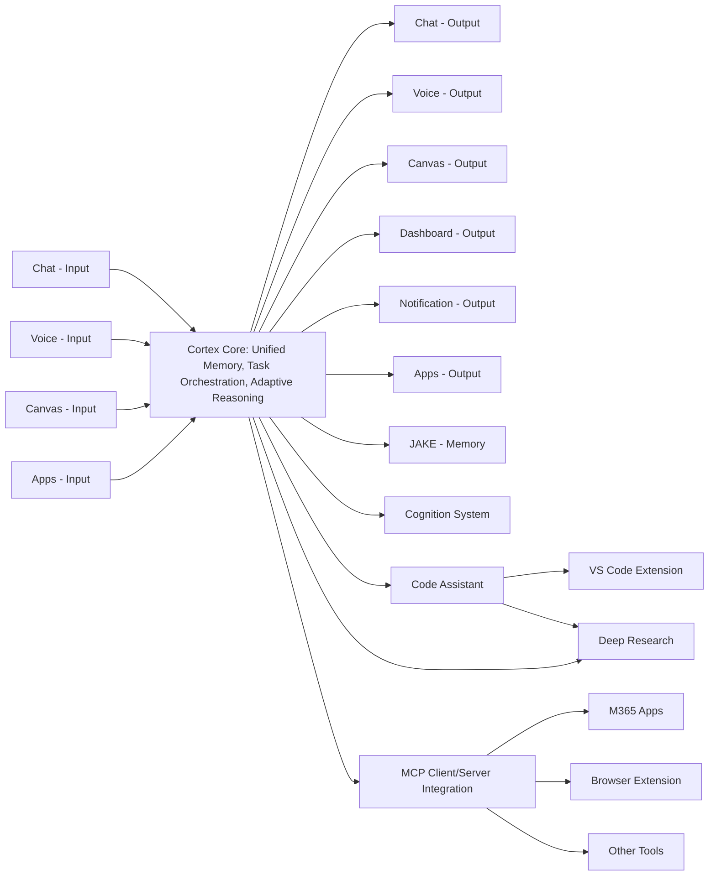

Central AI Core with Adaptive Ecosystem

2/11/2025

Some early thinking I’ve been developing from my experiences working with our assistants and explorations…

The Central AI Core with Adaptive Ecosystem is a conceptual architecture where a primary intelligent system (the central core) is supported by a dynamic network of specialized components. This ecosystem allows the core AI to extend its capabilities by interacting with external modules, resources, or services in a flexible, adaptive manner. The central core handles general reasoning, decision-making, and high-level orchestration, while the surrounding ecosystem provides adaptive input/output interfaces, domain-specific expertise, tools, and data sources. This design enables the AI to tackle a wide range of tasks by effectively delegating subtasks to the most suitable specialized resources within its ecosystem. The result is a more adaptive, scalable intelligence system that can leverage the strengths of multiple components in tandem, rather than relying on a monolithic AI to do everything.
Inputs/outputs are lightweight and independent from each other and not really intelligent on their own. They are simply interfaces between human and a central AI core. You can input on whatever is convenient for your situation - scenario/device/location/environment, and it can output on whatever is most appropriate - which one(s) you are currently active on, best modality for the output (image on a canvas vs responding in voice to something you said - and even split to say something concise over voice about an image drawn on a canvas).
External/existing apps (VSCode, Word, browser, etc.) are not embedded in an AI experience, and instead are left to be their native experiences - don't recreate them. AI interfaces are not (necessarily, but could be optionally) embedded in the existing apps - don't keep adding chats to everything, apps have enough going on. Instead, add hooks (extensions/plugins) that allow interfacing with the AI core.
Similarly, extend the core with modular extensions/systems so that we can easily evolve each independently, swap newer/more-capable ones as lower-risk/easier-to-do. Can even build some that orchestrate capabilities across others to create higher order "super modules".
The core is a router. It keeps track of the available inputs/outputs, connections to apps/services, etc. and intelligently invokes the right parts to serve the task at hand. It can take on a task for user (from any input), kick it off (across multiple extensions/systems), inform the user it has started it (through appropriate output) and this can all run until done and then it can report back to the user when complete (multi-output if appropriate). While this is happening, it's all decoupled and independent, so user can continue to engage with system while longer running tasks are processing - kicking off additional tasks, brainstorming with it, whatever. The core is responsible for determining when things should be surfaced to the user - are we actively working on something and it should be now, are we after the user's work hours and this should wait until tomorrow or when online next with a work device, ping them on their mobile, just file away until the context/topic comes up again, it's critical so immediately interrupt, etc. It leverages "core extensions" like the JAKE memory system and a cognition system for fulfilling its needs to support and drive behaviors in a modular/swappable way. There is more to it, but the general idea of things the core is responsible for...
I think building the core and PoC some of each of the outer bubbles (I've done a few already) would also allow for much easier hand-off for all of those surrounding bubbles and ability to focus on the core. In fact, it's not even a matter of handing them off, due to this design, there can be many implementations of any of those types of outer bubbles. Designers, PM's, go and mock and then build many of each and test with users, etc., keep the ones you want, discard the others. Think the explosion of community MCP servers - they all perform different tasks or provide a different benefit for users through their MCP client/host (chat assistant, etc.) but connect through a common interface that allows you to pick which ones you (user) want to use/connect to your experience. Same here. Like implementation X of a chat input, use it instead of implementation Y. Got an idea for a new extension, build it and connect it (oh, and our "assistant" can help build them very easily) and share it with others.
I've had a few recent experiences that makes me feel like this is model that I would want from both a user and a developer experience, adaptive to me as a user and easily composable/swappable parts as a developer.
