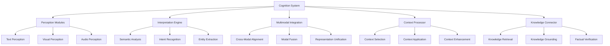

# Cortex Cognition System

_Version: 1.0_  
_Date: March 5, 2025_

## Overview

The Cognition System is a foundational component of the Cortex Platform that provides advanced perceptual and interpretive capabilities. It enables the platform to process, understand, and derive meaning from diverse inputs including text, images, audio, and multimodal content. This system serves as the platform's sensory apparatus, transforming raw inputs into structured representations that can be reasoned about and acted upon.

## Core Concepts

### Cognition Model

The Cognition System is built around these fundamental concepts:

1. **Perception**: Processing of raw sensory inputs
2. **Interpretation**: Deriving meaning and structure from inputs
3. **Integration**: Combining information across modalities
4. **Context-Awareness**: Understanding inputs in relation to context
5. **Uncertainty Management**: Handling ambiguity and confidence levels

### Input Types

The Cognition System processes multiple input types:

1. **Textual**: Written language in various formats
2. **Visual**: Images, diagrams, and visual media
3. **Auditory**: Speech, sounds, and audio signals
4. **Multimodal**: Combined inputs across multiple channels
5. **Structured Data**: Formatted information with defined schema

## System Architecture

### High-Level Architecture



### Core Components

#### Perception Modules

Perception Modules process raw inputs:

- Text processing with linguistic analysis
- Image processing with visual recognition
- Audio processing with speech and sound recognition
- Structured data parsing and validation
- Signal processing for sensor data

#### Interpretation Engine

The Interpretation Engine derives meaning:

- Semantic analysis of content
- Intent recognition and goal identification
- Entity extraction and relationship mapping
- Sentiment and emotion detection
- Conceptual categorization and classification

#### Multimodal Integration

Multimodal Integration combines information:

- Cross-modal alignment of information
- Fusion of insights from different modalities
- Resolution of cross-modal conflicts
- Unified representation generation
- Multi-channel temporal synchronization

#### Context Processor

The Context Processor incorporates context:

- Selection of relevant contextual information
- Application of context to interpretation
- Enhancement of inputs with contextual details
- Disambiguation using contextual cues
- Temporal context management

#### Knowledge Connector

The Knowledge Connector links to knowledge:

- Retrieval of relevant knowledge
- Grounding of inputs in established knowledge
- Factual verification and validation
- Knowledge augmentation of inputs
- Identification of knowledge gaps

## Perception Processes

### Text Perception

Processing textual inputs:

1. **Text Normalization**: Standardizing text format and encoding
2. **Tokenization**: Breaking text into meaningful units
3. **Syntactic Analysis**: Parsing grammatical structure
4. **Part-of-Speech Tagging**: Identifying word functions
5. **Named Entity Recognition**: Identifying key entities
6. **Coreference Resolution**: Linking references to entities
7. **Discourse Analysis**: Understanding text structure and flow

### Visual Perception

Processing visual inputs:

1. **Image Normalization**: Standardizing image format and properties
2. **Feature Extraction**: Identifying visual elements and patterns
3. **Object Detection**: Recognizing discrete objects
4. **Scene Understanding**: Comprehending overall visual context
5. **Spatial Relationship Analysis**: Determining object relationships
6. **Text-in-Image Recognition**: Processing embedded text
7. **Visual Attribute Extraction**: Identifying colors, styles, and properties

### Audio Perception

Processing audio inputs:

1. **Audio Normalization**: Standardizing audio format and properties
2. **Speech Recognition**: Converting speech to text
3. **Speaker Identification**: Recognizing individual speakers
4. **Prosody Analysis**: Processing tone, emphasis, and rhythm
5. **Non-Speech Sound Recognition**: Identifying environmental sounds
6. **Audio Event Detection**: Recognizing significant audio events
7. **Language Identification**: Determining spoken language

## Interpretation Capabilities

### Semantic Analysis

Deriving meaning from content:

1. **Semantic Parsing**: Extracting structured meaning
2. **Topic Modeling**: Identifying main themes and subjects
3. **Semantic Role Labeling**: Determining functional roles in content
4. **Lexical Semantics**: Understanding word meanings and relationships
5. **Pragmatic Analysis**: Interpreting implied meaning
6. **Semantic Graph Construction**: Building meaning networks
7. **Abstraction and Summarization**: Distilling core meaning

### Intent Recognition

Understanding user goals:

1. **Intent Classification**: Categorizing user objectives
2. **Parameter Extraction**: Identifying intent-specific variables
3. **Goal Hierarchy Analysis**: Recognizing primary and secondary goals
4. **Implicit Intent Detection**: Recognizing unstated objectives
5. **Intent Disambiguation**: Resolving unclear intentions
6. **Sequential Intent Tracking**: Following intent evolution
7. **Action Mapping**: Connecting intents to actionable tasks

### Entity Extraction

Identifying and processing entities:

1. **Entity Detection**: Locating entity mentions
2. **Entity Classification**: Categorizing entity types
3. **Entity Linking**: Connecting mentions to knowledge base entries
4. **Attribute Extraction**: Identifying entity properties
5. **Relationship Detection**: Mapping connections between entities
6. **Entity Coreference**: Resolving multiple references
7. **New Entity Registration**: Handling previously unknown entities

## Multimodal Integration

### Cross-Modal Alignment

Aligning information across modalities:

1. **Temporal Alignment**: Synchronizing time-based information
2. **Spatial Alignment**: Matching location-based information
3. **Semantic Alignment**: Connecting related concepts across modalities
4. **Reference Resolution**: Linking cross-modal references
5. **Contextual Binding**: Integrating modalities based on context
6. **Attention Mapping**: Aligning focus points across modalities
7. **Coverage Analysis**: Identifying unique and overlapping information

### Modal Fusion

Combining information from multiple modalities:

1. **Early Fusion**: Combining at raw input level
2. **Intermediate Fusion**: Combining at feature level
3. **Late Fusion**: Combining at decision level
4. **Adaptive Fusion**: Dynamically selecting fusion approach
5. **Weighted Fusion**: Prioritizing modalities based on reliability
6. **Complementary Integration**: Combining unique information
7. **Conflicting Information Resolution**: Handling contradictions

### Representation Unification

Creating unified understanding:

1. **Common Representation Format**: Standardized information structure
2. **Cross-Modal Embedding**: Unified vector representation
3. **Unified Semantic Graph**: Integrated knowledge representation
4. **Modality-Agnostic Features**: Common descriptive elements
5. **Integrated Confidence Assessment**: Unified certainty estimation
6. **Contextual Enhancement**: Enrichment with contextual information
7. **Knowledge Augmentation**: Enrichment with existing knowledge

## Context Integration

### Context Selection

Identifying relevant context:

1. **Conversation History**: Previous interactions
2. **User Profile**: User-specific information
3. **Environmental Context**: Situation and surroundings
4. **Task Context**: Current activities and goals
5. **Domain Context**: Subject-specific background
6. **Temporal Context**: Time-related information
7. **Social Context**: Interpersonal and group dynamics

### Context Application

Applying context to interpretation:

1. **Contextual Disambiguation**: Resolving ambiguities using context
2. **Reference Resolution**: Clarifying references using context
3. **Intent Refinement**: Enhancing intent understanding
4. **Personalization**: Tailoring interpretation to the user
5. **Cultural Adaptation**: Adjusting based on cultural context
6. **Domain-Specific Interpretation**: Applying domain knowledge
7. **Situational Adaptation**: Adjusting to environmental factors

### Context Enhancement

Improving context through interpretation:

1. **Context Update**: Refreshing contextual information
2. **New Entity Integration**: Adding newly discovered entities
3. **Relationship Mapping**: Updating entity relationships
4. **Knowledge Expansion**: Adding new knowledge elements
5. **Confidence Refinement**: Adjusting certainty levels
6. **Temporal Tracking**: Following evolution over time
7. **Context Prioritization**: Reweighting contextual elements

## Knowledge Integration

### Knowledge Retrieval

Accessing relevant knowledge:

1. **Semantic Search**: Finding related knowledge
2. **Entity-Based Retrieval**: Finding information about specific entities
3. **Conceptual Expansion**: Accessing related concepts
4. **Analogical Retrieval**: Finding similar patterns
5. **Case-Based Retrieval**: Finding similar scenarios
6. **Temporal Knowledge**: Accessing time-sensitive information
7. **Domain Knowledge**: Retrieving specialized knowledge

### Knowledge Grounding

Connecting inputs to established knowledge:

1. **Entity Grounding**: Linking to known entities
2. **Factual Verification**: Checking against known facts
3. **Domain Alignment**: Connecting to domain-specific knowledge
4. **Consistency Checking**: Verifying against established knowledge
5. **Gap Identification**: Recognizing missing knowledge
6. **Uncertainty Assessment**: Evaluating knowledge confidence
7. **Source Attribution**: Linking to knowledge sources

## Implementation Guidelines

### Perception Module Development

Guidelines for creating perception modules:

1. **Input Normalization**: Standardize and clean inputs
2. **Feature Extraction**: Identify key information elements
3. **Structured Representation**: Convert to standard formats
4. **Confidence Assessment**: Include certainty metrics
5. **Error Handling**: Manage perception failures gracefully

```python
# Example text perception module
class TextPerceptionModule:
    def process(self, text_input, context=None):
        # Normalize and preprocess
        normalized_text = self.normalize(text_input)

        # Extract structured information
        tokens = self.tokenize(normalized_text)
        syntax = self.parse_syntax(tokens)
        entities = self.extract_entities(tokens, syntax)

        # Create structured representation
        representation = {
            'tokens': tokens,
            'syntax': syntax,
            'entities': entities,
            'sentiment': self.analyze_sentiment(normalized_text),
            'topics': self.extract_topics(normalized_text)
        }

        # Add confidence metrics
        representation['confidence'] = self.assess_confidence(representation)

        # Enhance with context if available
        if context:
            representation = self.apply_context(representation, context)

        return representation
```

### Interpretation Engine Development

Guidelines for interpretation components:

1. **Modular Architecture**: Separate specialized interpreters
2. **Progressive Refinement**: Layer interpretation for complexity
3. **Context Integration**: Incorporate context at all stages
4. **Uncertainty Management**: Track confidence through processing
5. **Knowledge Connection**: Link to established knowledge

```python
# Example intent recognition component
class IntentRecognitionComponent:
    def recognize(self, perception_output, context=None):
        # Extract features relevant to intent
        features = self.extract_intent_features(perception_output)

        # Classify primary intent
        primary_intent = self.classify_intent(features)

        # Extract parameters for the intent
        parameters = self.extract_parameters(perception_output, primary_intent)

        # Detect secondary intents
        secondary_intents = self.detect_secondary_intents(features, primary_intent)

        # Apply context for refinement
        if context:
            primary_intent, parameters = self.refine_with_context(
                primary_intent, parameters, context)

        return {
            'primary_intent': primary_intent,
            'parameters': parameters,
            'secondary_intents': secondary_intents,
            'confidence': self.calculate_confidence(features, primary_intent)
        }
```

### Multimodal Integration Development

Guidelines for multimodal components:

1. **Alignment First**: Establish clear cross-modal connections
2. **Adaptive Fusion**: Select fusion methods based on input types
3. **Conflict Resolution**: Handle contradictory information explicitly
4. **Unified Representation**: Convert to common format
5. **Modality Weighting**: Consider relative reliability of modalities

```python
# Example multimodal fusion component
class MultimodalFusionComponent:
    def fuse(self, text_perception, visual_perception, context=None):
        # Align modalities
        alignment = self.align_modalities(text_perception, visual_perception)

        # Identify complementary information
        text_unique = self.extract_unique_info(text_perception, alignment)
        visual_unique = self.extract_unique_info(visual_perception, alignment)
        shared = self.extract_shared_info(alignment)

        # Resolve conflicts
        resolved = self.resolve_conflicts(alignment, context)

        # Create unified representation
        unified = self.create_unified_representation(
            text_unique, visual_unique, shared, resolved)

        # Apply context enhancement
        if context:
            unified = self.enhance_with_context(unified, context)

        return unified
```

## Integration with Core AI

### Memory Integration

Connection with the JAKE Memory System:

1. **Entity Recognition**: Identifying known memory entities
2. **Context Retrieval**: Accessing relevant contextual information
3. **Memory Update**: Providing new information for memory
4. **Knowledge Access**: Retrieving relevant knowledge
5. **Temporal Linkage**: Connecting to time-based memory elements

### Reasoning Integration

Connection with the Autonomous Reasoning System:

1. **Structured Input**: Providing structured representations for reasoning
2. **Uncertainty Signaling**: Communicating confidence levels
3. **Knowledge Gaps**: Identifying missing information
4. **Ambiguity Highlighting**: Flagging unclear elements
5. **Perceptual Insights**: Sharing pattern-based observations

### Task Integration

Connection with the Task Orchestration System:

1. **Intent Mapping**: Converting recognized intents to tasks
2. **Task Parameter Extraction**: Identifying task-specific parameters
3. **Task Context**: Providing relevant contextual information
4. **Task Refinement**: Clarifying task requirements
5. **Task Verification**: Confirming task understanding

## Advanced Capabilities

### Uncertainty Management

Handling ambiguity and confidence:

1. **Confidence Estimation**: Quantifying interpretation certainty
2. **Ambiguity Detection**: Identifying multiple possible interpretations
3. **Uncertainty Propagation**: Tracking confidence through processing
4. **Clarification Generation**: Creating queries to resolve uncertainty
5. **Risk-Weighted Processing**: Adjusting behavior based on confidence

### Adaptive Perception

Dynamically adjusting perception:

1. **Focus Control**: Directing attention to relevant aspects
2. **Depth Adjustment**: Varying processing depth based on needs
3. **Context-Based Adaptation**: Modifying processing based on context
4. **Resource Optimization**: Allocating processing resources efficiently
5. **Quality-Speed Balancing**: Adjusting for optimal performance

### Learning and Adaptation

Improving perception over time:

1. **Feedback Integration**: Learning from success and failure
2. **Pattern Recognition**: Identifying recurring patterns
3. **User Adaptation**: Adjusting to individual user patterns
4. **Domain Specialization**: Enhancing domain-specific capabilities
5. **Continuous Refinement**: Ongoing model improvements

## Performance Considerations

### Efficiency

Strategies for optimizing performance:

1. **Progressive Processing**: Increasing depth only as needed
2. **Caching**: Storing and reusing common interpretations
3. **Parallel Processing**: Simultaneous handling of modalities
4. **Early Filtering**: Removing irrelevant information early
5. **Resource Scaling**: Adjusting resource allocation dynamically

### Accuracy

Approaches for maximizing interpretation quality:

1. **Multi-Model Consensus**: Combining multiple interpretation approaches
2. **Context Validation**: Verifying consistency with context
3. **Knowledge Verification**: Checking against established facts
4. **Error Detection**: Identifying and correcting misinterpretations
5. **Continuous Evaluation**: Ongoing assessment of accuracy

## Security and Privacy

### Privacy Protection

Safeguarding sensitive information:

1. **PII Detection**: Identifying personal information
2. **Selective Processing**: Limiting processing of sensitive content
3. **Privacy Controls**: User options for processing levels
4. **Data Minimization**: Processing only necessary information
5. **Secure Handling**: Protected processing of sensitive data

### Security Measures

Protecting against misuse:

1. **Input Validation**: Verifying input legitimacy
2. **Adversarial Detection**: Identifying manipulative inputs
3. **Bias Monitoring**: Detecting and mitigating biased processing
4. **Output Verification**: Validating interpretation results
5. **Access Controls**: Restricting perception capabilities appropriately

## Development Guidelines

### Best Practices

Recommendations for cognition development:

1. **Modular Design**: Separating perception capabilities
2. **Clear Interfaces**: Well-defined input and output formats
3. **Graceful Degradation**: Functioning with incomplete information
4. **Explicit Uncertainty**: Clear communication of confidence levels
5. **Comprehensive Testing**: Validation across diverse inputs

### Evaluation Framework

Assessing cognition performance:

1. **Accuracy Metrics**: Measuring interpretation correctness
2. **Efficiency Metrics**: Measuring resource usage and speed
3. **Robustness Testing**: Performance with challenging inputs
4. **User Experience**: Evaluating perceived quality and usefulness
5. **Comparative Analysis**: Benchmarking against alternatives

## Conclusion

The Cognition System serves as the sensory foundation of the Cortex Platform, transforming diverse inputs into structured representations that enable understanding and action. Through its perception modules, interpretation engine, and multimodal integration capabilities, the system provides the platform with a comprehensive understanding of user inputs across text, visual, and audio modalities.

By integrating closely with the platform's memory, reasoning, and task systems, the Cognition System ensures that all platform capabilities operate from a solid foundation of accurate, context-aware understanding. Its ability to manage uncertainty, adapt to different inputs, and continuously improve ensures that the platform delivers consistently high-quality interactions.

As the platform evolves, the Cognition System will continue to advance, incorporating new perception capabilities, more sophisticated interpretation methods, and enhanced multimodal integration approaches to further improve the platform's ability to understand and respond to increasingly complex user needs.
