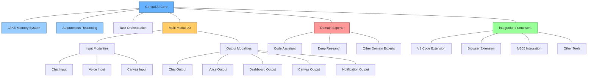

# Cortex Platform Architecture Overview

_Version: 1.0_  
_Date: March 5, 2025_

## Introduction

The Cortex Platform represents a new paradigm in AI assistant technology, providing a unified intelligence experience across multiple interaction modalities and specialized domains. Unlike traditional AI assistants that operate as disconnected experiences with limited context, the Cortex Platform maintains consistent understanding and capabilities regardless of how and where users interact with the system.

This document provides a comprehensive overview of the Cortex Platform architecture, explaining the core components, their interactions, and the underlying principles that enable the platform's unique capabilities.

## Architectural Principles

The Cortex Platform is built on the following key architectural principles:

1. **Unified Intelligence**: Maintaining a singular, coherent intelligence across all interactions
2. **Multi-Modal Flexibility**: Supporting diverse input and output modalities without losing context
3. **Deep Domain Expertise**: Delivering specialized capabilities through domain-specific experts
4. **Contextual Persistence**: Preserving understanding across interactions and time
5. **Autonomous Reasoning**: Making intelligent decisions through multiple reasoning strategies
6. **Seamless Integration**: Connecting with tools, applications, and environments where users work
7. **Extensible Foundation**: Supporting ongoing expansion of capabilities and domains

## High-Level Architecture

The following diagram illustrates the high-level architecture of the Cortex Platform:

## Core Components

### Central AI Core

The Central AI Core is the primary intelligence center of the Cortex Platform, coordinating all other components and maintaining cohesive understanding across the system.

Key responsibilities include:

1. **Unified Memory**: Maintaining a consistent understanding through the JAKE Memory System
2. **Task Orchestration**: Breaking down user requests into executable tasks
3. **Autonomous Reasoning**: Applying appropriate reasoning strategies to solve problems
4. **Expert Coordination**: Delegating specialized tasks to domain experts
5. **Modality Management**: Coordinating input interpretation and output generation

For more details, see the [Autonomous Reasoning System](Autonomous_Reasoning_System.md) documentation.

### JAKE Memory System

The Just-About-Knowledge-Everything (JAKE) Memory System provides unified context preservation across all interactions, enabling persistent understanding regardless of interaction pattern.

Key capabilities include:

1. **Entity Management**: Tracking discrete knowledge units and their properties
2. **Relationship Tracking**: Maintaining connections between entities
3. **Context Preservation**: Managing active working memory for current interactions
4. **Knowledge Integration**: Incorporating new information with existing knowledge
5. **Memory Prioritization**: Ensuring the most relevant information is available

For more details, see the [JAKE Memory System](JAKE_Memory_System.md) documentation.

### Multi-Modal I/O Architecture

The Multi-Modal I/O Architecture enables seamless interaction through diverse input and output channels while maintaining context and consistency across modalities.

Key features include:

1. **Input Processing**: Handling chat, voice, and canvas input modalities
2. **Output Generation**: Supporting chat, voice, dashboard, canvas, and notification outputs
3. **Cross-Modal Context**: Maintaining consistent understanding across modality switches
4. **Adaptive Selection**: Choosing appropriate output modalities based on content and context
5. **Progressive Enhancement**: Utilizing available modalities optimally on different devices

For more details, see the [Multimodal IO Architecture](Multimodal_IO_Architecture.md) documentation.

### Domain Expert Architecture

Domain Experts are specialized autonomous modules that provide deep capabilities in specific knowledge domains, enabling expert-level performance in those areas.

Key aspects include:

1. **Specialized Knowledge**: Deep domain-specific understanding and capabilities
2. **Autonomous Operation**: Independent handling of domain-specific tasks
3. **Tool Integration**: Connection with domain-relevant tools and resources
4. **Knowledge Exchange**: Sharing insights with the Central AI Core
5. **Continuous Learning**: Ongoing improvement within the domain

Major domain experts include:

1. **Code Assistant**: Software development and programming expertise
2. **Deep Research**: Information gathering, analysis, and synthesis capabilities
3. **Additional Experts**: Specialized capabilities for various domains

For more details, see the [Domain Expert Architecture](Domain_Expert_Architecture.md) documentation.

### Integration Framework

The Integration Framework connects the Cortex Platform with external tools, applications, and environments, allowing the system to operate where users already work.

Key integrations include:

1. **VS Code Extension**: Development environment integration
2. **Browser Extension**: Web browsing assistance through Playwright
3. **M365 Integration**: Connection with productivity applications
4. **API Plugins**: Custom integrations with external services
5. **MCP Protocol**: Standardized integration framework for all components

For more details, see the [MCP Protocol Specification](MCP_Protocol_Specification.md) documentation.

## Component Interactions

### Interaction Flow

The typical flow for handling a user interaction:

1. **Input Reception**: A user input is received through an input modality
2. **Context Activation**: Relevant context is activated in the JAKE Memory System
3. **Understanding**: The Central AI Core interprets the input in context
4. **Task Creation**: The input is transformed into one or more tasks
5. **Expert Delegation**: Tasks requiring specialized knowledge are assigned to domain experts
6. **Tool Utilization**: External tools are engaged as needed through the Integration Framework
7. **Solution Development**: The Central AI Core processes information and develops a response
8. **Output Selection**: Appropriate output modalities are selected
9. **Response Delivery**: The response is delivered through selected output modalities
10. **Context Update**: The interaction is recorded in the JAKE Memory System

### Cross-Component Communication

All components communicate using the Memory, Cognition, and Perception (MCP) Protocol, which provides:

1. **Standardized Messages**: Consistent format for all inter-component communication
2. **Context Preservation**: Maintenance of context across component boundaries
3. **Capability Discovery**: Dynamic discovery of available tools and capabilities
4. **Secure Communication**: Authentication and authorization for component access
5. **Extensible Design**: Support for future capabilities without breaking existing integrations

## Implementation Architecture

### Service Architecture

The Cortex Platform is implemented as a distributed system with the following services:

1. **Core Service**: Hosts the Central AI Core and coordinates all other services
2. **Memory Service**: Implements the JAKE Memory System
3. **Modality Services**: Handle specific input and output modalities
4. **Expert Services**: Host domain-specific experts
5. **Integration Services**: Connect with external tools and environments
6. **Infrastructure Services**: Provide shared capabilities like authentication and monitoring

### Deployment Models

The Cortex Platform supports multiple deployment configurations:

1. **Cloud-Based**: Primary services hosted in the cloud for most users
2. **Hybrid**: Sensitive processing performed locally with cloud augmentation
3. **On-Premises**: Complete deployment within an organization's infrastructure
4. **Edge-Enhanced**: Optimized processing distribution between edge devices and central services

## Security and Privacy

### Security Architecture

The security architecture includes:

1. **Authentication**: Verification of user and component identity
2. **Authorization**: Control of access to capabilities and data
3. **Encryption**: Protection of data in transit and at rest
4. **Isolation**: Separation between different users and contexts
5. **Audit Trails**: Tracking of system activities and access

### Privacy Framework

The privacy framework ensures:

1. **Data Minimization**: Collection of only necessary information
2. **Purpose Limitation**: Use of data only for intended purposes
3. **Storage Controls**: Appropriate data retention policies
4. **Transparency**: Clear communication about data usage
5. **User Control**: Options for managing data and privacy preferences

## Extension and Customization

### Platform Extension

The Cortex Platform can be extended through:

1. **New Domain Experts**: Addition of specialized capabilities
2. **Additional Modalities**: Support for new interaction methods
3. **Tool Integrations**: Connection with additional external tools
4. **Custom Reasoning**: Implementation of domain-specific reasoning strategies
5. **Knowledge Enhancement**: Integration of specialized knowledge bases

### Enterprise Customization

Organizations can customize the platform through:

1. **Private Experts**: Development of organization-specific experts
2. **Internal Integrations**: Connection with proprietary systems
3. **Custom Knowledge**: Integration of organizational knowledge
4. **Workflow Adaptation**: Alignment with specific business processes
5. **Security Configuration**: Implementation of organization-specific security policies

## Development Guidelines

### Component Development

Guidelines for developing new components:

1. **MCP Compliance**: Implementation of the MCP Protocol
2. **Autonomous Operation**: Independent functioning with clear interfaces
3. **Context Awareness**: Proper utilization of the memory system
4. **Scalable Design**: Support for increasing usage and data
5. **Monitoring Integration**: Built-in observability

### Integration Development

Guidelines for creating new integrations:

1. **Tool Definition**: Clear specification of capabilities and requirements
2. **Authentication Support**: Secure access to external systems
3. **Data Transformation**: Conversion between external and internal formats
4. **Error Handling**: Graceful management of integration failures
5. **Update Strategy**: Approach for handling external system changes

## Performance Considerations

### Scalability

Approaches for handling increased load:

1. **Horizontal Scaling**: Addition of service instances
2. **Workload Distribution**: Intelligent routing of requests
3. **Resource Optimization**: Efficient utilization of computing resources
4. **Caching Strategies**: Strategic data caching for performance
5. **Asynchronous Processing**: Non-blocking operations where appropriate

### Reliability

Strategies for ensuring system reliability:

1. **Redundancy**: Multiple instances of critical components
2. **Fault Isolation**: Containment of failures to minimize impact
3. **Graceful Degradation**: Maintained functionality during partial failures
4. **Automated Recovery**: Self-healing capabilities
5. **Comprehensive Monitoring**: Detection of issues before they affect users

## Conclusion

The Cortex Platform architecture represents a significant advancement in AI assistant technology, moving beyond disconnected interactions to a truly unified intelligence experience. By combining the Central AI Core with the JAKE Memory System, Multi-Modal I/O, Domain Experts, and the Integration Framework, the platform delivers consistent, context-aware intelligence across diverse interaction patterns.

This architecture enables the key differentiators of the Cortex Platform:

1. **Unified Experience**: Consistent understanding and capabilities regardless of entry point
2. **Contextual Intelligence**: Responses informed by comprehensive interaction history
3. **Deep Expertise**: Specialized capabilities across multiple domains
4. **Flexible Interaction**: Support for diverse interaction modalities
5. **Seamless Integration**: Connection with the tools and environments users already use

The modular, extensible nature of the architecture ensures that the platform can continue to evolve, incorporating new capabilities and adapting to changing user needs while maintaining its foundational commitment to unified intelligence.

## Related Documentation

- [MCP Protocol Specification](MCP_Protocol_Specification.md)
- [Domain Expert Architecture](Domain_Expert_Architecture.md)
- [Multimodal IO Architecture](Multimodal_IO_Architecture.md)
- [JAKE Memory System](JAKE_Memory_System.md)
- [Autonomous Reasoning System](Autonomous_Reasoning_System.md)
