# Cortex Documentation Implementation Plan

_Version: 1.0_  
_Date: 2025-03-04_

## Overview

This document outlines the implementation plan for creating a comprehensive, well-organized documentation set for the Cortex Platform. The goal is to consolidate existing documentation into a cohesive collection that presents a unified vision while serving the needs of different audiences.

## Documentation Structure

```mermaid
graph TD
    A[Cortex Platform Documentation] --> B[Executive Materials]
    A --> C[Vision & Strategy]
    A --> D[Architecture & Design]
    A --> E[Implementation Guide]
    A --> F[Developer Resources]
    A --> G[User Documentation]

    B --> B1[Executive Summary]
    B --> B2[Value Proposition]
    B --> B3[Market Positioning]

    C --> C1[Platform Vision]
    C --> C2[Strategic Roadmap]
    C --> C3[Ecosystem Strategy]

    D --> D1[System Architecture]
    D --> D2[Component Design]
    D --> D3[Integration Patterns]
    D --> D4[Security Framework]

    E --> E1[Implementation Roadmap]
    E --> E2[Technical Requirements]
    E --> E3[Deployment Guide]
    E --> E4[Testing Strategy]

    F --> F1[API Documentation]
    F --> F2[MCP Integration Guide]
    F --> F3[Extension Development]
    F --> F4[Component Reference]

    G --> G1[User Guide]
    G --> G2[Feature Documentation]
    G --> G3[Integration Tutorials]
    G --> G4[FAQ & Troubleshooting]
```



## Implementation Steps

### Phase 1: Setup and Foundation

1. **Create folder structure**

   - Create the main `final` directory
   - Create subdirectories for each major section
   - Create placeholder files for all planned documents

2. **Develop document templates**

   - Create a standard template with consistent formatting
   - Define heading hierarchy and style guidelines
   - Establish pattern for cross-references

3. **Image and diagram migration**
   - Copy and organize existing diagrams
   - Identify needs for new visual elements

### Phase 2: Content Development

#### 1. Executive Materials

1. **01-Executive_Summary.md**

   - Extract key points from existing overview documents
   - Consolidate into a concise, impactful summary
   - Ensure consistent messaging with other executive materials

2. **02-Cortex_Value_Proposition.md**

   - Expand on value points from Platform Overview
   - Organize by stakeholder (end-users, developers, organizations)
   - Include competitive differentiators

3. **03-Market_Positioning.md**
   - Develop based on strategic elements in existing docs
   - Create a clear market positioning statement
   - Include target audience definitions

#### 2. Vision & Strategy

1. **01-Cortex_Platform_Vision.md**

   - Enhance vision statements from existing documents
   - Provide a comprehensive vision that ties all components together
   - Include forward-looking statements and aspirational goals

2. **02-Strategic_Roadmap.md**

   - Consolidate phased approaches mentioned in existing docs
   - Create a timeline-based roadmap with clear milestones
   - Link strategic priorities to implementation phases

3. **03-Ecosystem_Strategy.md**
   - Expand on MCP and extensibility concepts
   - Detail partnership and community engagement strategies
   - Outline the vision for third-party integrations

#### 3. Architecture & Design

1. **01-System_Architecture_Overview.md**

   - Consolidate architectural diagrams and descriptions
   - Create a coherent, layered architecture description
   - Define key architectural principles and patterns

2. **02-Core_Components.md**

   - Extract detailed descriptions of Central AI Core
   - Consolidate JAKE and memory system details
   - Document cognition system and task orchestration

3. **03-Input_Output_Modalities.md**

   - Detail all input modalities (chat, voice, canvas)
   - Document output modalities and adaptive selection
   - Include interface design principles

4. **04-Domain_Expert_Systems.md**

   - Consolidate Domain Expert documentation
   - Detail the autonomous capabilities framework
   - Include examples and integration patterns

5. **05-Integration_Architecture.md**

   - Document MCP-based integration architecture
   - Detail external tool integration patterns
   - Include connector specifications

6. **06-Security_Framework.md**
   - Extract security considerations from existing docs
   - Develop comprehensive security architecture
   - Include privacy and compliance considerations

#### 4. Implementation Guide

1. **01-Implementation_Roadmap.md**

   - Create detailed implementation phases
   - Define dependencies between components
   - Establish milestones and success criteria

2. **02-Technical_Requirements.md**

   - Consolidate technology stack information
   - Detail development environment specifications
   - Document external dependencies

3. **03-Deployment_Guide.md**

   - Document deployment options and architectures
   - Include containerization and orchestration details
   - Provide scaling considerations

4. **04-Testing_Strategy.md**
   - Define testing approaches for different components
   - Include automation strategies
   - Detail performance and security testing

#### 5. Developer Resources

1. **01-API_Documentation.md**

   - Document Core API interfaces
   - Detail REST endpoints and parameters
   - Include authentication and usage examples

2. **02-MCP_Integration_Guide.md**

   - Provide comprehensive MCP documentation
   - Include server creation and communication patterns
   - Document tool and resource definitions

3. **03-Extension_Development.md**

   - Detail process for creating domain experts
   - Document UI extension development
   - Include testing and deployment guidelines

4. **04-Component_Reference.md**
   - Create reference documentation for all components
   - Include integration APIs and interfaces
   - Document configuration options

#### 6. User Documentation

1. **01-User_Guide.md**

   - Create getting started guides
   - Document common workflows
   - Include configuration and customization options

2. **02-Feature_Documentation.md**

   - Document all platform features
   - Include use case examples
   - Provide best practices

3. **03-Integration_Tutorials.md**

   - Create step-by-step tutorials for common integrations
   - Include screenshots and examples
   - Document configuration steps

4. **04-FAQ_Troubleshooting.md**
   - Compile frequently asked questions
   - Create troubleshooting guides
   - Document common issues and solutions

### Phase 3: Review and Finalization

1. **Cross-document consistency check**

   - Ensure terminology is consistent
   - Verify cross-references are accurate
   - Confirm no contradictory information exists

2. **Visual consistency review**

   - Check formatting and styles
   - Review diagrams for consistency
   - Ensure coherent visual language

3. **Final content review**
   - Verify all content is accurate and complete
   - Fill any remaining content gaps
   - Update based on latest platform developments

## Content Development Methodology

For each document, we will follow this process:

1. **Extract and consolidate** information from existing documents
2. **Analyze** for gaps or inconsistencies
3. **Expand** content where needed to ensure completeness
4. **Restructure** for clarity and logical flow
5. **Add visual elements** to enhance understanding
6. **Review** for accuracy, consistency, and readability

## File Naming Convention

All files will follow this naming convention:

```
[section-number]-[document-number]-[document_name].md
```

Example: `01-02-Cortex_Value_Proposition.md`

## Implementation Timeline

The implementation will proceed in order of the document hierarchy, starting with executive materials and proceeding through the more detailed technical documentation.

## Dependencies and Source Mapping

| New Document           | Primary Source Documents                                         |
| ---------------------- | ---------------------------------------------------------------- |
| Executive Summary      | Cortex_Platform_Overview.md                                      |
| Value Proposition      | Cortex_Platform_Overview.md                                      |
| System Architecture    | Cortex_Core_Architecture.md, cortex-unified-architecture.md      |
| Domain Expert Systems  | Cortex_Domain_Experts_Roadmap.md                                 |
| Implementation Roadmap | cortex-unified-architecture.md, Cortex_Domain_Experts_Roadmap.md |
| MCP Integration Guide  | Cortex_Core_Architecture.md, cortex-unified-architecture.md      |

## Next Steps

1. Create the folder structure
2. Develop document templates
3. Begin content development with Executive Materials
4. Proceed through each section sequentially

After this implementation plan is approved, the next step is to begin implementation in an appropriate mode such as Documentation Writer.
