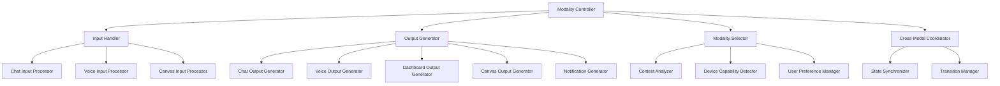

# Cortex Multi-Modal I/O Architecture

_Version: 1.0_  
_Date: March 5, 2025_

## Overview

The Cortex Platform's Multi-Modal I/O Architecture enables seamless interaction through diverse input and output channels, maintaining context and consistency across modalities. This architecture allows users to interact with the system through their preferred modalities while experiencing a unified intelligence that remembers context and maintains continuity regardless of the interaction channel.

## Core Concepts

### Modality Definition

In the Cortex Platform, a "modality" refers to a distinct channel or method through which users can:

1. **Provide input** to the system (input modality)
2. **Receive output** from the system (output modality)

Each modality has unique characteristics, strengths, and constraints that make it suitable for different types of interactions and contexts.

### Modality Independence

The Multi-Modal Architecture is designed to ensure:

1. **Modality Separation**: Input and output modalities are logically separated, allowing for independent selection
2. **Cross-Modal Flexibility**: Users can input through one modality and receive output through another
3. **Context Preservation**: User context is maintained when switching between modalities
4. **Consistent Experience**: Core capabilities remain consistent across all modalities

## Input Modalities

### Chat (Text) Input

The chat input modality processes text-based communication:

- **Natural Language Processing**: Interpretation of written instructions and queries
- **Command Parsing**: Recognition of structured commands and syntax
- **Chat History Integration**: Maintaining conversation context and references
- **Formatting Support**: Processing of rich text, code snippets, and markup

### Voice Input

The voice input modality processes spoken communication:

- **Speech Recognition**: Conversion of speech to text
- **Speaker Identification**: Recognition of different users (when applicable)
- **Prosody Analysis**: Interpretation of tone, emphasis, and pacing
- **Environmental Context**: Awareness of background conditions and noise
- **Continuous Listening**: Support for wake-word and continuous interaction

### Canvas Input

The canvas input modality processes visual and drawing-based communication:

- **Drawing Interpretation**: Analysis of sketches and diagrams
- **Spatial Reasoning**: Understanding relative positioning and layouts
- **Visual Content Analysis**: Processing uploaded or created visual content
- **Annotation Recognition**: Interpretation of notes and annotations
- **Interactive Elements**: Handling of interactive visual components

## Output Modalities

### Chat (Text) Output

The chat output modality delivers text-based responses:

- **Formatted Text**: Structured, well-formatted textual responses
- **Rich Text Rendering**: Support for styling, emphasis, and organization
- **Code Formatting**: Syntax highlighting and proper code presentation
- **Tabular Data**: Presentation of table-structured information
- **Progressive Disclosure**: Expanding content based on user interaction

### Voice Output

The voice output modality delivers spoken responses:

- **Text-to-Speech**: Conversion of text responses to natural-sounding speech
- **Voice Characteristics**: Appropriate tone, pacing, and emphasis
- **Audio Quality Control**: Adaptation to environmental conditions
- **Prosody Management**: Natural speech patterns and inflections
- **Interruption Handling**: Graceful management of user interruptions

### Dashboard Output

The dashboard output modality presents information in visual dashboard formats:

- **Data Visualization**: Charts, graphs, and visual data representations
- **Status Monitoring**: Visual indicators of system and process status
- **Interactive Controls**: User-manipulable dashboard elements
- **Layout Management**: Adaptive positioning based on content and device
- **Customization**: User preferences for dashboard organization

### Canvas Output

The canvas output modality delivers visual and drawing-based responses:

- **Diagram Generation**: Creation of flowcharts, mind maps, and other diagrams
- **Visual Annotations**: Addition of notes and highlights to visual content
- **Interactive Graphics**: Manipulable visual elements
- **Spatial Organization**: Logical arrangement of visual components
- **Drawing Capabilities**: System-generated sketches and illustrations

### Notification Output

The notification output modality delivers alert-style communications:

- **Alert Generation**: Creation of time-sensitive notifications
- **Priority Management**: Appropriate urgency signaling
- **Delivery Timing**: Control over when notifications are sent
- **Notification Formats**: Support for various notification styles
- **Action Buttons**: Interactive elements within notifications

## Architectural Components

### Modality Controller

The Modality Controller manages the selection and coordination of input and output modalities:

#### Input Handler

The Input Handler processes incoming user interactions:

- Normalizes inputs into a standard format
- Performs modality-specific preprocessing
- Extracts relevant context and metadata
- Routes processed input to the Central AI Core

#### Output Generator

The Output Generator prepares system responses for delivery:

- Receives response content from the Central AI Core
- Formats content for the target modality
- Applies modality-specific optimizations
- Delivers the response through the appropriate channel

#### Modality Selector

The Modality Selector determines the optimal modalities for interaction:

- Analyzes content to determine suitable modalities
- Considers device capabilities and limitations
- Incorporates user preferences and history
- Recommends optimal input and output channels

#### Cross-Modal Coordinator

The Cross-Modal Coordinator maintains consistency across modalities:

- Synchronizes state across modalities
- Manages transitions between modalities
- Preserves context during modality switches
- Ensures graceful fallbacks when modalities are unavailable

### Implementation Strategy

The Multi-Modal I/O architecture is implemented using:

1. **Modular Design**: Each modality processor is implemented as a separate module
2. **Common Interface**: All modality processors implement standardized interfaces
3. **Event-Driven Architecture**: Communication through standardized events
4. **Stateless Processing**: Modality processors maintain minimal internal state
5. **Shared Context**: Common context repository accessible to all components

## Integration with Central AI Core

### Communication Protocol

Communication between the Multi-Modal I/O system and the Central AI Core uses the MCP Protocol, with:

- Standardized message formats for inputs and outputs
- Context preservation across interactions
- Bi-directional capability discovery
- Error handling and recovery mechanisms

### Context Synchronization

The Multi-Modal I/O system maintains synchronized context with the Central AI Core through:

1. **Session Context**: Per-session state including active modalities
2. **Interaction History**: Record of past interactions across modalities
3. **User Preferences**: Individual modality preferences and settings
4. **Environmental Context**: Device capabilities and situational factors

## Modality Selection Logic

### Input Modality Selection

Input modality selection considers:

1. **User Choice**: Explicit selection by the user
2. **Device Capabilities**: Available input mechanisms
3. **Environmental Factors**: Noise levels, privacy considerations
4. **Task Suitability**: Appropriateness for the current task
5. **Usage Patterns**: Historical user preferences

### Output Modality Selection

Output modality selection considers:

1. **Content Type**: Nature of the content to be presented
2. **Response Complexity**: Detail level and structure requirements
3. **Device Capabilities**: Display and audio capabilities
4. **Environmental Context**: User situation and surroundings
5. **User Preferences**: Explicit and learned preferences

## User Experience Considerations

### Modality Transitions

Handling transitions between modalities:

1. **Seamless Transitions**: Minimal friction when changing modalities
2. **Context Persistence**: Maintaining conversation flow across transitions
3. **State Preservation**: Retaining relevant state during transitions
4. **Transition Signaling**: Clear indication of modality changes
5. **Fallback Handling**: Graceful degradation when preferred modalities are unavailable

### Multi-Modal Fusion

Combining multiple modalities simultaneously:

1. **Complementary Modalities**: Using modalities that enhance each other
2. **Synchronized Timing**: Coordinating multi-modal outputs
3. **Cognitive Load Management**: Preventing information overload
4. **Attention Direction**: Guiding user focus appropriately
5. **Consistency**: Ensuring aligned information across modalities

## Implementation Guidelines

### Adding New Input Modalities

To implement a new input modality:

1. Create a processor implementing the `InputModalityProcessor` interface
2. Implement modality-specific preprocessing logic
3. Add normalization to the standard input format
4. Register the processor with the Input Handler
5. Update modality selection logic to consider the new modality

### Adding New Output Modalities

To implement a new output modality:

1. Create a generator implementing the `OutputModalityGenerator` interface
2. Implement content formatting for the modality
3. Add modality-specific optimization logic
4. Register the generator with the Output Generator
5. Update modality selection logic to consider the new modality

## Security and Privacy

### Security Considerations

Multi-Modal I/O security includes:

1. **Input Validation**: Thorough validation of all modality inputs
2. **Output Sanitization**: Preventing injection and formatting attacks
3. **Permission Management**: Modality-specific access controls
4. **Sensory Privacy**: Controls for microphone and camera access
5. **Audit Logging**: Tracking of modality usage and transitions

### Privacy Protection

Privacy measures include:

1. **Data Minimization**: Processing only necessary input data
2. **Retention Controls**: Clear policies for input/output storage
3. **Sensory Indicators**: Clear signals when audio/visual inputs are active
4. **User Control**: Options to disable specific modalities
5. **Private Modalities**: Options for discreet interaction modes

## Performance Optimization

### Latency Management

Strategies for minimizing perceived latency:

1. **Progressive Rendering**: Incremental display of content
2. **Anticipatory Processing**: Predictive preparation of likely outputs
3. **Parallel Processing**: Simultaneous handling of multiple modalities
4. **Caching**: Strategic caching of common modality components
5. **Adaptive Quality**: Dynamic adjustment based on network conditions

### Resource Efficiency

Approaches for efficient resource usage:

1. **Lazy Loading**: On-demand initialization of modality processors
2. **Resource Pooling**: Shared processing resources across modalities
3. **Quality Scaling**: Adjustable quality based on device capabilities
4. **Background Processing**: Non-critical processing during idle periods
5. **Optimized Assets**: Modality-specific asset optimization

## Conclusion

The Multi-Modal I/O Architecture is a foundational component of the Cortex Platform, enabling seamless, context-aware interaction across diverse input and output channels. By separating the concerns of input processing, output generation, and modality selection, the architecture provides both flexibility for users and extensibility for the platform.

This architecture supports the core Cortex value proposition of unified intelligence, ensuring that users experience consistent capabilities and preserved context regardless of how they choose to interact with the system. As new modalities emerge, the modular design allows for straightforward integration, ensuring the platform can evolve to incorporate future interaction paradigms.
