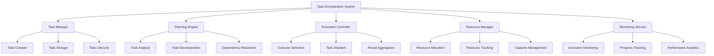
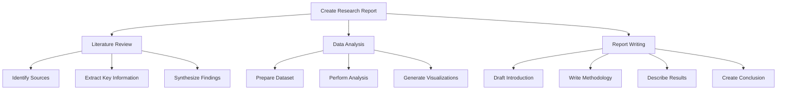

# Cortex Task Orchestration System

_Version: 1.0_  
_Date: March 5, 2025_

## Overview

The Task Orchestration System is a core component of the Cortex Platform that manages the planning, decomposition, delegation, and execution of complex tasks. It serves as the operational backbone of the platform, coordinating work across domain experts, tools, and services to fulfill user requests efficiently and effectively.

## Core Concepts

### Task Model

The Task Orchestration System is built around these fundamental concepts:

1. **Tasks**: Discrete units of work with clear objectives and requirements
2. **Task Graphs**: Hierarchical structures representing task decomposition and dependencies
3. **Executors**: Components responsible for carrying out specific types of tasks
4. **Resources**: Assets, information, and capabilities required for task execution
5. **Contexts**: Execution environments including state, permissions, and constraints

### Task Types

The system supports multiple task types:

1. **Atomic Tasks**: Indivisible units of work executed by a single component
2. **Composite Tasks**: Complex tasks that require decomposition
3. **Sequential Tasks**: Tasks that must be executed in a specific order
4. **Parallel Tasks**: Tasks that can be executed simultaneously
5. **Conditional Tasks**: Tasks whose execution depends on specific conditions
6. **Iterative Tasks**: Tasks that require repeated execution with variations
7. **Long-Running Tasks**: Tasks that execute over extended periods

## System Architecture

### High-Level Architecture



### Core Components

#### Task Manager

The Task Manager handles task representation and lifecycle:

- Creation and registration of tasks
- Storage and retrieval of task information
- State management throughout the task lifecycle
- Task history and versioning
- Task metadata management

#### Planning Engine

The Planning Engine determines execution strategy:

- Analysis of task requirements and complexity
- Decomposition of complex tasks into subtasks
- Identification of task dependencies
- Optimization of execution sequence
- Dynamic replanning based on execution feedback

#### Execution Controller

The Execution Controller manages task execution:

- Selection of appropriate executors
- Dispatch of tasks to executors
- Monitoring of task progress
- Handling of task completion and failures
- Aggregation of results from multiple tasks

#### Resource Manager

The Resource Manager handles resource allocation:

- Tracking available execution resources
- Allocation of resources to tasks
- Management of resource constraints
- Balancing of resource utilization
- Dynamic scaling of resource capacity

#### Monitoring Service

The Monitoring Service tracks execution:

- Real-time monitoring of task execution
- Collection of performance metrics
- Detection of anomalies and bottlenecks
- Generation of execution analytics
- Alerting on execution issues

## Task Lifecycle

### Task Creation

The initial phase of the task lifecycle:

1. **Request Interpretation**: Understanding the user's intent
2. **Task Formulation**: Creating a formal task definition
3. **Parameter Specification**: Defining task inputs and requirements
4. **Context Attachment**: Linking relevant context
5. **Priority Assignment**: Determining task importance

### Task Planning

Preparing the task for execution:

1. **Complexity Assessment**: Evaluating task scope and difficulty
2. **Task Decomposition**: Breaking down complex tasks
3. **Dependency Analysis**: Identifying relationships between tasks
4. **Resource Estimation**: Determining required resources
5. **Execution Strategy**: Planning execution approach

### Task Scheduling

Determining when and how tasks execute:

1. **Priority Evaluation**: Considering task importance
2. **Resource Availability**: Checking for required resources
3. **Dependency Satisfaction**: Ensuring prerequisites are met
4. **Executor Selection**: Choosing appropriate executors
5. **Timing Determination**: Deciding execution timing

### Task Execution

Carrying out the planned tasks:

1. **Task Dispatch**: Sending tasks to executors
2. **Progress Monitoring**: Tracking execution status
3. **Intermediate Results**: Processing partial outputs
4. **Issue Handling**: Managing execution problems
5. **Resource Adjustment**: Modifying resource allocation

### Task Completion

Finalizing task execution:

1. **Result Collection**: Gathering execution outputs
2. **Result Validation**: Verifying output quality
3. **Result Integration**: Combining multiple outputs
4. **Context Update**: Updating relevant context
5. **Task Closure**: Finalizing task status

## Task Representation

### Task Object

Tasks are represented using a standardized format:

```json
{
  "task_id": "task-uuid-12345",
  "parent_id": "task-uuid-parent",
  "type": "atomic|composite|sequential|parallel|conditional|iterative",
  "created_at": "2025-03-05T12:00:00Z",
  "status": "created|planned|scheduled|executing|completed|failed|cancelled",
  "priority": 1-5,
  "description": "Human-readable task description",
  "objective": "Precise task objective",
  "parameters": {
    // Task-specific parameters
  },
  "requirements": {
    "executor_type": "domain-expert|tool|service",
    "capabilities": ["capability1", "capability2"],
    "resources": {
      "memory": "512MB",
      "computation": "medium",
      "time": "30s"
    }
  },
  "constraints": {
    "deadline": "2025-03-05T12:30:00Z",
    "max_retries": 3,
    "security_level": "standard|sensitive|restricted"
  },
  "context_id": "context-uuid-12345",
  "dependencies": [
    {
      "task_id": "task-uuid-dependency",
      "type": "hard|soft",
      "condition": "completion|result-based"
    }
  ],
  "subtasks": [
    // References to child tasks for composite tasks
  ],
  "execution": {
    "executor_id": "executor-uuid-12345",
    "started_at": "2025-03-05T12:05:00Z",
    "progress": 0.7,
    "retries": 0,
    "logs": [
      // Execution log entries
    ]
  },
  "result": {
    "status": "success|partial|failure",
    "data": {
      // Task result data
    },
    "error": {
      // Error details if applicable
    },
    "metrics": {
      "duration": "25s",
      "resource_usage": {
        "memory_peak": "350MB",
        "computation_used": "medium"
      }
    }
  }
}
```

### Task Graph

For composite tasks, the system maintains a task graph:

```json
{
  "graph_id": "graph-uuid-12345",
  "root_task_id": "task-uuid-root",
  "created_at": "2025-03-05T12:00:00Z",
  "status": "active|completed|failed|cancelled",
  "nodes": [
    {
      "task_id": "task-uuid-1",
      "type": "task|decision|merge",
      "status": "pending|active|completed|failed"
    }
    // Additional nodes
  ],
  "edges": [
    {
      "source": "task-uuid-1",
      "target": "task-uuid-2",
      "type": "sequence|dependency|data-flow",
      "condition": "// Optional condition expression"
    }
    // Additional edges
  ],
  "execution_plan": {
    "strategy": "depth-first|breadth-first|priority-based|parallel",
    "critical_path": ["task-uuid-1", "task-uuid-3", "task-uuid-5"],
    "estimated_duration": "2m30s"
  },
  "results": {
    "completion_ratio": 0.8,
    "successful_tasks": 8,
    "failed_tasks": 1,
    "pending_tasks": 1
  }
}
```

## Task Decomposition

### Decomposition Strategies

Methods for breaking down complex tasks:

1. **Functional Decomposition**: Breaking tasks by function or capability
2. **Sequential Decomposition**: Dividing into ordered steps
3. **Parallel Decomposition**: Identifying independent subtasks
4. **Hierarchical Decomposition**: Creating nested levels of subtasks
5. **Pattern-Based Decomposition**: Using templates for common tasks

### Decomposition Process

The steps in task decomposition:

1. **Task Analysis**: Understanding the complete task requirements
2. **Strategy Selection**: Choosing appropriate decomposition approach
3. **Subtask Definition**: Creating individual subtask specifications
4. **Dependency Mapping**: Establishing relationships between subtasks
5. **Resource Allocation**: Assigning resources to subtasks
6. **Validation**: Ensuring the decomposition is complete and consistent

### Decomposition Example

Example of task decomposition for a research report:



## Executor Management

### Executor Types

The system works with various executor types:

1. **Domain Experts**: Specialized knowledge components
2. **Tool Integrations**: External tool connectors
3. **Service Connectors**: Connections to platform services
4. **Utility Executors**: General-purpose execution capabilities
5. **Human-in-the-Loop**: Executors involving human intervention

### Executor Capabilities

Executors advertise their capabilities:

```json
{
  "executor_id": "executor-uuid-12345",
  "name": "Code Assistant Expert",
  "type": "domain-expert",
  "status": "active|busy|offline",
  "capabilities": [
    {
      "id": "code.generation",
      "description": "Generate code based on requirements",
      "parameters": {
        "language": "string",
        "framework": "string",
        "complexity": "integer"
      },
      "performance": {
        "average_duration": "2.5s",
        "success_rate": 0.95
      }
    }
    // Additional capabilities
  ],
  "resource_profile": {
    "memory_requirement": "1GB",
    "computation_level": "high",
    "concurrency": 5
  },
  "availability": {
    "current_load": 0.7,
    "estimated_wait_time": "5s"
  }
}
```

### Executor Selection

The process for choosing executors:

1. **Capability Matching**: Finding executors with required capabilities
2. **Performance Evaluation**: Considering historical performance
3. **Load Assessment**: Evaluating current executor workload
4. **Priority Consideration**: Reflecting task priority in selection
5. **Specialization Preference**: Favoring more specialized executors

## Task Execution

### Execution Modes

The system supports different execution modes:

1. **Synchronous Execution**: Waiting for immediate completion
2. **Asynchronous Execution**: Background processing with callbacks
3. **Streaming Execution**: Progressive result delivery
4. **Batch Execution**: Processing multiple related tasks together
5. **Interactive Execution**: Execution with user involvement

### Execution Control

Mechanisms for controlling execution:

1. **Task Prioritization**: Adjusting execution order based on priority
2. **Resource Throttling**: Managing resource consumption
3. **Execution Pausing**: Temporarily halting execution
4. **Task Cancellation**: Terminating unwanted tasks
5. **Execution Modification**: Adjusting parameters during execution

### Error Handling

Approaches for managing execution failures:

1. **Retry Logic**: Automatic retries with backoff
2. **Fallback Mechanisms**: Alternative execution paths
3. **Partial Results**: Handling incomplete execution outcomes
4. **Graceful Degradation**: Continuing with reduced capabilities
5. **Recovery Procedures**: Steps to restore from failures

## Integration with Core AI

### Memory Integration

Connection with the JAKE Memory System:

1. **Context Retrieval**: Accessing relevant context for tasks
2. **Result Storage**: Recording task outcomes in memory
3. **Knowledge Integration**: Updating knowledge based on task results
4. **Entity Tracking**: Managing task-related entities
5. **History Preservation**: Maintaining execution history

### Reasoning Integration

Interaction with the Autonomous Reasoning System:

1. **Task Analysis**: Using reasoning to understand complex tasks
2. **Decomposition Strategies**: Reasoning about optimal task breakdown
3. **Execution Planning**: Determining optimal execution approaches
4. **Result Evaluation**: Assessing quality and implications of results
5. **Adaptive Planning**: Reasoning about plan adjustments

### Domain Expert Integration

Coordination with Domain Experts:

1. **Expert Selection**: Choosing appropriate experts for tasks
2. **Task Translation**: Converting platform tasks to expert-specific formats
3. **Expert Coordination**: Managing collaboration between experts
4. **Result Integration**: Combining outputs from multiple experts
5. **Capability Discovery**: Identifying and leveraging expert capabilities

## Advanced Capabilities

### Task Optimization

Approaches for improving task execution:

1. **Execution Planning**: Optimizing task sequence and parallelism
2. **Resource Allocation**: Intelligent distribution of resources
3. **Caching Strategies**: Reusing results from similar tasks
4. **Preemptive Execution**: Starting likely tasks before confirmation
5. **Execution Learning**: Improving based on historical performance

### Long-Running Tasks

Management of extended tasks:

1. **Progress Tracking**: Monitoring and reporting completion status
2. **Checkpointing**: Saving intermediate states
3. **Resumption Capabilities**: Continuing after interruptions
4. **Resource Renegotiation**: Adjusting resources during execution
5. **Priority Adaptation**: Modifying priority based on duration

### Adaptive Task Planning

Dynamic adjustment of task plans:

1. **Execution Monitoring**: Tracking actual versus expected progress
2. **Plan Reevaluation**: Assessing plan validity during execution
3. **Dynamic Replanning**: Modifying plans based on new information
4. **Constraint Adjustment**: Updating constraints during execution
5. **Opportunity Recognition**: Identifying better execution approaches

## Performance Considerations

### Scalability

Approaches for handling increased load:

1. **Horizontal Scaling**: Adding more executor instances
2. **Task Batching**: Combining related tasks for efficiency
3. **Priority-Based Processing**: Focusing on high-priority tasks under load
4. **Load Shedding**: Gracefully declining lower-priority tasks
5. **Distributed Execution**: Spreading tasks across multiple resources

### Efficiency

Strategies for optimizing resource usage:

1. **Resource Pooling**: Sharing resources across executors
2. **Idle Detection**: Identifying and reallocating unused resources
3. **Execution Profiling**: Analyzing and optimizing resource usage
4. **Right-Sizing**: Matching resource allocation to actual needs
5. **Execution Locality**: Minimizing data movement during execution

## Development Guidelines

### Task Definition Best Practices

Guidelines for defining effective tasks:

1. **Clear Objectives**: Precise specification of expected outcomes
2. **Complete Parameters**: All necessary inputs included
3. **Appropriate Granularity**: Right-sized task scope
4. **Explicit Dependencies**: Clear specification of prerequisites
5. **Resource Requirements**: Accurate estimation of needed resources

### Executor Development

Guidelines for creating task executors:

1. **Capability Advertisement**: Clear declaration of supported tasks
2. **Resource Profiles**: Accurate resource requirement specifications
3. **Result Formatting**: Standardized output structures
4. **Error Handling**: Comprehensive error reporting
5. **Performance Monitoring**: Self-reporting of execution metrics

## Monitoring and Management

### Performance Metrics

Key metrics for system evaluation:

1. **Task Throughput**: Tasks completed per time period
2. **Execution Latency**: Time from submission to completion
3. **Resource Utilization**: Usage of available resources
4. **Success Rate**: Percentage of tasks completed successfully
5. **Optimization Ratio**: Actual versus optimal resource usage

### Management Interfaces

Tools for system oversight:

1. **Dashboard**: Visual representation of system status
2. **Task Explorer**: Interface for exploring task definitions and status
3. **Execution Visualizer**: Graphical view of task execution
4. **Resource Monitor**: Real-time resource utilization tracking
5. **Configuration Manager**: System parameter adjustment

## Conclusion

The Task Orchestration System serves as the operational backbone of the Cortex Platform, coordinating work across domain experts, tools, and services to fulfill user requests. Through intelligent task decomposition, efficient resource allocation, and dynamic execution management, the system enables the platform to tackle complex, multi-step tasks that span multiple domains and capabilities.

By maintaining a standardized task representation, supporting diverse execution patterns, and integrating deeply with other core platform components, the Task Orchestration System ensures that the Cortex Platform delivers a unified, coherent experience even when handling intricate tasks requiring multiple specialized components.

As the platform continues to evolve, the Task Orchestration System will incorporate increasingly sophisticated planning algorithms, more efficient resource management, and enhanced adaptation capabilities, further improving the platform's ability to handle complex tasks effectively and efficiently.
