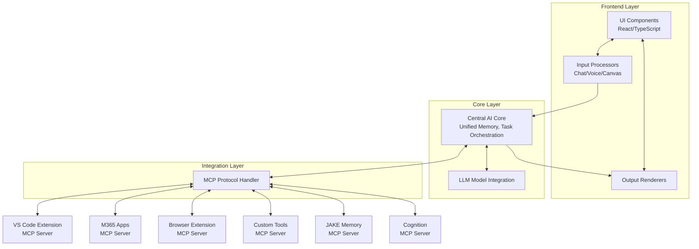

# AI Assistant Platform - Architecture & Implementation Plan

## 1. Revised System Overview



## 2. Component Details

### 2.1 Frontend Layer

- **UI Components**

  - React with TypeScript
  - Basic layout with sidebar, main content area
  - Support for multi-modal interfaces

- **Input Processors**

  - Chat text input with markdown support
  - Voice input transcription (basic)
  - Canvas for visual inputs

- **Output Renderers**
  - Rich text formatting for chat
  - Dashboard widgets for visualization
  - Notification system
  - Voice output (basic TTS)
  - Canvas rendering

### 2.2 Core Layer

- **Central AI Core**

  - Conversation context manager
  - Basic task orchestration
  - Memory management for session persistence
  - Handles routing between input/output and external systems

- **LLM Model Integration**
  - Integration with selected LLM provider(s)
  - Prompt management and optimization
  - Response handling and processing

### 2.3 Integration Layer (MCP Servers)

- **MCP Protocol Handler**

  - Central hub for all MCP server communications
  - Manages server connections and requests
  - Routes capabilities to appropriate components

- **VS Code Extension (MCP Server)**

  - Code context and project structure
  - File operations and editing
  - Terminal access

- **M365 Apps (MCP Server)**

  - Document access and creation
  - Spreadsheet operations
  - Presentation tools

- **Browser Extension (MCP Server)**

  - Web page access and analysis
  - Playwright-based automation
  - Web content extraction

- **Custom Tools (MCP Server)**

  - API integrations
  - Custom data processing functions
  - Utility operations

- **JAKE Memory (MCP Server)**

  - Long-term memory storage
  - Information retrieval and association
  - Context persistence across sessions

- **Cognition (MCP Server)**
  - Advanced reasoning capabilities
  - Problem-solving strategies
  - Enhanced decision making

## 3. Development Phases (3-Day PoC)

### Day 1: Core Framework & Basic UI

1. **Setup Project (2 hours)**

   - Initialize React/TS with Vite
   - Set up project structure
   - Configure basic state management

2. **Implement UI Shell (3 hours)**

   - Create main layout components
   - Implement basic styling
   - Add chat interface components

3. **Core AI Integration (3 hours)**
   - Implement basic LLM integration
   - Set up conversation handling
   - Create simple memory management

### Day 2: MCP Integration & Enhanced Features

1. **MCP Protocol Handler (3 hours)**

   - Implement MCP client functionality
   - Create server connection management
   - Set up message routing

2. **First MCP Server Integration (3 hours)**

   - Implement VS Code MCP server (most important)
   - Connect to core system
   - Test basic operations

3. **Enhanced Input/Output (2 hours)**
   - Implement rich text formatting
   - Add basic dashboard widgets
   - Set up notification system

### Day 3: Polish & Documentation

1. **Additional MCP Servers (3 hours)**

   - Implement 1-2 more essential MCP servers
   - Test integration with core system

2. **Testing & Refinement (2 hours)**

   - End-to-end testing
   - Fix critical issues
   - Performance optimization

3. **Documentation & Presentation (3 hours)**
   - Create comprehensive documentation
   - Add setup instructions
   - Prepare demo scenarios

## 4. Technology Stack

### Frontend

- **Framework**: React with TypeScript
- **Build Tool**: Vite
- **State Management**: React Context or simple Redux
- **UI Components**: Custom components (or minimal UI library if time allows)
- **API Communication**: Fetch API or Axios

### Backend

- **Language**: Python
- **MCP SDK**: Python MCP SDK for server implementations
- **LLM Integration**: Direct API calls or libraries like LangChain/LlamaIndex

### MCP Servers

- **VS Code**: TypeScript MCP server
- **Other Servers**: Python MCP servers with FastMCP

## 5. Implementation Details

### 5.1 Core Components

**Central AI Core (Python)**

```python
from mcp.server.fastmcp import FastMCP

class CentralAICore:
    def __init__(self):
        self.memory = {}
        self.tasks = []

    def process_input(self, input_text, input_type="chat"):
        # Process different types of input
        if input_type == "chat":
            return self.process_chat(input_text)
        # Add other input types as needed

    def process_chat(self, chat_text):
        # Prepare prompt for LLM
        # Call LLM
        # Process response
        # Update memory
        return response
```

**MCP Protocol Handler (Python)**

```python
class MCPHandler:
    def __init__(self):
        self.servers = {}

    def register_server(self, server_name, server_url):
        # Connect to MCP server
        # Register capabilities

    def call_tool(self, server_name, tool_name, args):
        # Call tool on specified server

    def access_resource(self, server_name, resource_uri):
        # Access resource on specified server
```

### 5.2 Frontend Components (React/TS)

**Chat Component**

```typescript
import React, { useState } from "react";

const ChatInterface = () => {
  const [messages, setMessages] = useState([]);
  const [input, setInput] = useState("");

  const sendMessage = async () => {
    // Add user message to state
    // Call API to process message
    // Add response to messages
  };

  return (
    <div className="chat-container">
      <div className="messages">
        {messages.map((msg, index) => (
          <div key={index} className={`message ${msg.type}`}>
            {msg.content}
          </div>
        ))}
      </div>
      <div className="input-area">
        <input
          value={input}
          onChange={(e) => setInput(e.target.value)}
          placeholder="Ask me anything..."
        />
        <button onClick={sendMessage}>Send</button>
      </div>
    </div>
  );
};

export default ChatInterface;
```

## 6. MCP Server Implementation Examples

### VS Code MCP Server (TypeScript)

```typescript
import { McpServer } from "@modelcontextprotocol/sdk/server/mcp.js";
import { StdioServerTransport } from "@modelcontextprotocol/sdk/server/stdio.js";
import { z } from "zod";
import * as fs from "fs/promises";
import * as path from "path";

const server = new McpServer({
  name: "VSCode Assistant",
  version: "1.0.0",
});

// Tool to list files in directory
server.tool("list-files", { directory: z.string() }, async ({ directory }) => {
  try {
    const files = await fs.readdir(directory);
    return {
      content: [{ type: "text", text: JSON.stringify(files) }],
    };
  } catch (err) {
    return {
      content: [{ type: "text", text: `Error: ${err.message}` }],
      isError: true,
    };
  }
});

// Tool to read file contents
server.tool("read-file", { filepath: z.string() }, async ({ filepath }) => {
  try {
    const content = await fs.readFile(filepath, "utf-8");
    return {
      content: [{ type: "text", text: content }],
    };
  } catch (err) {
    return {
      content: [{ type: "text", text: `Error: ${err.message}` }],
      isError: true,
    };
  }
});

const transport = new StdioServerTransport();
server.connect(transport);
```

### Browser Automation MCP Server (Python)

```python
from mcp.server.fastmcp import FastMCP
from playwright.sync_api import sync_playwright

mcp = FastMCP("Browser Assistant")

@mcp.tool()
def visit_webpage(url: str) -> str:
    """Visit a webpage and return its content"""
    with sync_playwright() as p:
        browser = p.chromium.launch()
        page = browser.new_page()
        page.goto(url)
        content = page.content()
        browser.close()
        return content

if __name__ == "__main__":
    mcp.run()
```

## 7. Next Steps Beyond PoC

1. **Enhanced MCP Servers**
   - Develop more sophisticated MCP servers for each integration point
   - Improve error handling and reliability
2. **Advanced Memory Systems**
   - Implement vector database for semantic search
   - Add structured data storage for complex information
3. **Improved Task Orchestration**
   - Develop more advanced task planning and execution
   - Add parallel processing capabilities
4. **UI Enhancements**

   - Add more visualization options
   - Implement proper design system
   - Develop mobile responsive design

5. **Security & Authentication**
   - Add proper authentication for access control
   - Implement secure storage for sensitive information
   - Add permission management for MCP servers
