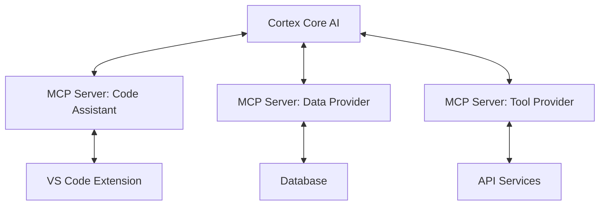

# Model Context Protocol (MCP) SDK Documentation

_Version: 1.0_  
_Date: 2025-03-05_

## Overview

The Model Context Protocol (MCP) is a standardized protocol that enables applications to provide context to Large Language Models (LLMs) in a consistent way. MCP allows your application to:

- Expose data and functionality to LLMs in a structured, secure manner
- Separate context provision from LLM interaction
- Enable LLMs to safely access external data and take actions in your systems
- Create reusable context providers that work with multiple LLM interfaces

MCP servers act as context providers that can be queried by LLM clients (like the Cortex Platform Core AI). This server-based architecture allows for flexible integration into various workflows while maintaining a clean separation of responsibilities.

## Available SDKs

Official MCP SDK implementations are available for the following languages:

| Language              | Package Name                | Latest Version | Min Language Version |
| --------------------- | --------------------------- | -------------- | -------------------- |
| JavaScript/TypeScript | `@modelcontextprotocol/sdk` | 0.6.0          | ES6, TypeScript 4.5+ |
| Python                | `mcp`                       | 0.4.2          | Python 3.8+          |

## Installation

### JavaScript/TypeScript

```bash
# Using npm
npm install @modelcontextprotocol/sdk

# Using yarn
yarn add @modelcontextprotocol/sdk

# Using pnpm
pnpm add @modelcontextprotocol/sdk
```

### Python

```bash
# Using pip
pip install mcp

# Using pip with CLI tools
pip install "mcp[cli]"

# Using uv
uv add mcp

# Using uv with CLI tools
uv add "mcp[cli]"
```

## Core Concepts

### Server

The Server is the core interface to the MCP protocol. It handles:

- Connection management with clients (like the Cortex Platform Core AI)
- Protocol compliance and message routing
- Registering and exposing resources and tools
- Managing the lifecycle of client interactions

#### Python Example

```python
from mcp.server.fastmcp import FastMCP

# Create a simple MCP server
server = FastMCP("My Context Provider")

# Register resources and tools (covered below)
# ...

# Start the server (specific to transport method)
```

#### TypeScript Example

```typescript
import { McpServer } from "@modelcontextprotocol/sdk/server/mcp.js";

// Create a simple MCP server
const server = new McpServer({
  name: "My Context Provider",
  version: "1.0.0",
});

// Register resources and tools (covered below)
// ...

// Connect with transport (specific to transport method)
```

### Resources

Resources represent data that LLMs can access. They're similar to GET endpoints in a REST API and provide information the LLM can use.

Key characteristics of resources:

- Identified by URI patterns (e.g., `cortex://api/weather`)
- Can be static (fixed data) or dynamic (generated on demand)
- May accept parameters through URI templates
- Return structured content that LLMs can consume

#### Python Example

```python
from mcp.server.fastmcp import FastMCP

server = FastMCP("Weather Provider")

# Simple resource with fixed URI
@server.resource("cortex://api/weather/help")
def weather_help() -> str:
    """Provide help information about the weather API"""
    return "The weather API provides current conditions and forecasts."

# Parameterized resource using URI templates
@server.resource("cortex://api/weather/{location}")
def weather_by_location(location: str) -> dict:
    """Get weather for a specific location"""
    # Implementation would fetch real weather data
    return {
        "location": location,
        "temperature": 72,
        "conditions": "sunny"
    }

# Resource that returns a list of available sub-resources
@server.resource("cortex://api/weather")
def weather_endpoints() -> list:
    """List all available weather endpoints"""
    return [
        "cortex://api/weather/help",
        "cortex://api/weather/forecast",
        "cortex://api/weather/{location}"
    ]
```

#### TypeScript Example

```typescript
import {
  McpServer,
  ResourceTemplate,
} from "@modelcontextprotocol/sdk/server/mcp.js";

const server = new McpServer({
  name: "Weather Provider",
  version: "1.0.0",
});

// Simple resource with fixed URI
server.resource("weather-help", "cortex://api/weather/help", async (uri) => ({
  contents: [
    {
      uri: uri.href,
      text: "The weather API provides current conditions and forecasts.",
    },
  ],
}));

// Parameterized resource using URI templates
server.resource(
  "weather-by-location",
  new ResourceTemplate("cortex://api/weather/{location}", { list: undefined }),
  async (uri, { location }) => ({
    contents: [
      {
        uri: uri.href,
        text: JSON.stringify({
          location: location,
          temperature: 72,
          conditions: "sunny",
        }),
      },
    ],
  })
);

// Resource that returns a list of available sub-resources
server.resource("weather-endpoints", "cortex://api/weather", async (uri) => ({
  contents: [
    {
      uri: uri.href,
      text: JSON.stringify([
        "cortex://api/weather/help",
        "cortex://api/weather/forecast",
        "cortex://api/weather/{location}",
      ]),
    },
  ],
}));
```

### Tools

Tools are functions that enable LLMs to take actions in your system. They're similar to POST endpoints in a REST API.

Key characteristics of tools:

- Accept parameters that the LLM provides
- Perform operations (database queries, API calls, etc.)
- Return results to the LLM
- Can include validation and error handling

#### Python Example

```python
from mcp.server.fastmcp import FastMCP
from typing import Optional

server = FastMCP("Email Assistant")

# Simple tool with required parameters
@server.tool()
def send_email(recipient: str, subject: str, body: str) -> dict:
    """Send an email to the specified recipient"""
    # Implementation would send an actual email
    return {
        "status": "sent",
        "to": recipient,
        "messageId": "msg_123456"
    }

# Tool with optional parameters
@server.tool()
def search_emails(query: str, folder: Optional[str] = "inbox", limit: int = 10) -> list:
    """Search emails matching the query"""
    # Implementation would search actual emails
    return [
        {"id": "msg_1", "subject": "Hello", "sender": "alice@example.com"},
        {"id": "msg_2", "subject": "Meeting", "sender": "bob@example.com"}
    ]
```

#### TypeScript Example

```typescript
import { McpServer } from "@modelcontextprotocol/sdk/server/mcp.js";
import { z } from "zod";

const server = new McpServer({
  name: "Email Assistant",
  version: "1.0.0",
});

// Simple tool with required parameters
server.tool(
  "send-email",
  {
    recipient: z.string().email(),
    subject: z.string(),
    body: z.string(),
  },
  async ({ recipient, subject, body }) => ({
    content: [
      {
        type: "text",
        text: JSON.stringify({
          status: "sent",
          to: recipient,
          messageId: "msg_123456",
        }),
      },
    ],
  })
);

// Tool with optional parameters
server.tool(
  "search-emails",
  {
    query: z.string(),
    folder: z.string().default("inbox"),
    limit: z.number().int().positive().default(10),
  },
  async ({ query, folder, limit }) => ({
    content: [
      {
        type: "text",
        text: JSON.stringify([
          { id: "msg_1", subject: "Hello", sender: "alice@example.com" },
          { id: "msg_2", subject: "Meeting", sender: "bob@example.com" },
        ]),
      },
    ],
  })
);
```

### Prompts

Prompts are reusable templates that can be used for standardized LLM interactions. They help ensure consistent inputs to the LLM.

#### Python Example

```python
from mcp.server.fastmcp import FastMCP

server = FastMCP("Code Review Assistant")

@server.prompt("code_review")
def code_review_prompt() -> str:
    """Prompt template for code review assistance"""
    return """
    Please analyze the following code:

    {code}

    Focus on these aspects:
    1. Performance issues
    2. Security concerns
    3. Readability improvements
    4. Best practices compliance

    Provide specific recommendations for improvement.
    """
```

#### TypeScript Example

```typescript
import { McpServer } from "@modelcontextprotocol/sdk/server/mcp.js";

const server = new McpServer({
  name: "Code Review Assistant",
  version: "1.0.0",
});

server.prompt("code-review", async () => ({
  content: [
    {
      type: "text",
      text: `
Please analyze the following code:

{code}

Focus on these aspects:
1. Performance issues
2. Security concerns
3. Readability improvements
4. Best practices compliance

Provide specific recommendations for improvement.
      `,
    },
  ],
}));
```

## Implementation Guide

### Transport Mechanisms

MCP servers can communicate with clients through different transport mechanisms. The two primary options are:

#### HTTP with Server-Sent Events (SSE)

Server-Sent Events (SSE) is the preferred transport mechanism for production MCP servers. It allows for:

- Real-time communication between server and client
- Standard HTTP infrastructure (works through proxies, firewalls)
- Automatic reconnection handling
- Multiple simultaneous client connections

##### Python Implementation (Flask)

```python
from mcp.server.fastmcp import FastMCP
from flask import Flask, Response, request
import json
import time

# Create Flask app
app = Flask(__name__)
app.config['TIMEOUT'] = 120  # Longer timeout for SSE connections

# Create MCP server
mcp = FastMCP("Example MCP Service")

# Add resources and tools
@mcp.resource("cortex://example/data")
def get_data() -> dict:
    return {"timestamp": time.time(), "status": "active"}

@mcp.tool()
def process_data(input: str) -> dict:
    return {"result": f"Processed: {input}", "timestamp": time.time()}

# SSE endpoint
@app.route('/sse')
def sse():
    def event_stream():
        # SSE connection setup
        yield "event: connected\ndata: {}\n\n"

        # Keep connection alive
        while True:
            time.sleep(30)
            yield "event: ping\ndata: {}\n\n"

    return Response(event_stream(), content_type='text/event-stream')

# Message endpoint for client-to-server communication
@app.route('/messages', methods=['POST'])
def handle_message():
    data = request.json
    # Process message using MCP server
    result = mcp.process_message(data)
    return json.dumps(result)

if __name__ == '__main__':
    app.run(debug=True, port=3000)
```

##### TypeScript Implementation (Express)

```typescript
import express from "express";
import { McpServer } from "@modelcontextprotocol/sdk/server/mcp.js";
import { SSEServerTransport } from "@modelcontextprotocol/sdk/server/sse.js";
import { z } from "zod";

// Create Express app
const app = express();
app.use(express.json());

// Create MCP server
const server = new McpServer({
  name: "Example MCP Service",
  version: "1.0.0",
});

// Add resources and tools
server.resource("example-data", "cortex://example/data", async (uri) => ({
  contents: [
    {
      uri: uri.href,
      text: JSON.stringify({
        timestamp: Date.now(),
        status: "active",
      }),
    },
  ],
}));

server.tool("process-data", { input: z.string() }, async ({ input }) => ({
  content: [
    {
      type: "text",
      text: JSON.stringify({
        result: `Processed: ${input}`,
        timestamp: Date.now(),
      }),
    },
  ],
}));

// SSE endpoint
app.get("/sse", (req, res) => {
  res.setHeader("Content-Type", "text/event-stream");
  res.setHeader("Cache-Control", "no-cache");
  res.setHeader("Connection", "keep-alive");

  // SSE connection setup
  res.write("event: connected\ndata: {}\n\n");

  // Create transport and connect to server
  const transport = new SSEServerTransport("/messages", res);
  server.connect(transport);

  // Keep connection alive
  const pingInterval = setInterval(() => {
    res.write("event: ping\ndata: {}\n\n");
  }, 30000);

  // Clean up on client disconnect
  req.on("close", () => {
    clearInterval(pingInterval);
    transport.disconnect();
  });
});

// Message endpoint
app.post("/messages", async (req, res) => {
  try {
    // You'll implement message handling here
    // This is typically handled by the SSE transport
    res.json({ status: "received" });
  } catch (error) {
    res.status(500).json({ error: error.message });
  }
});

app.listen(3000, () => {
  console.log("MCP server running on port 3000");
});
```

#### stdio Transport (CLI)

For simpler testing or CLI tools, MCP can operate over standard input/output streams:

##### Python Implementation

```python
from mcp.server.fastmcp import FastMCP
from mcp.transport.stdio import StdioTransport

# Create MCP server
server = FastMCP("CLI Helper")

@server.resource("cortex://cli/help")
def get_help() -> str:
    return "This is a CLI helper that provides assistance with commands."

@server.tool()
def format_json(input: str) -> dict:
    import json
    try:
        parsed = json.loads(input)
        formatted = json.dumps(parsed, indent=2)
        return {"formatted": formatted, "success": True}
    except json.JSONDecodeError as e:
        return {"error": str(e), "success": False}

# Run server with stdio transport
if __name__ == "__main__":
    transport = StdioTransport()
    server.serve(transport)
```

##### TypeScript Implementation

```typescript
import { McpServer } from "@modelcontextprotocol/sdk/server/mcp.js";
import { StdioTransport } from "@modelcontextprotocol/sdk/server/stdio.js";
import { z } from "zod";

// Create MCP server
const server = new McpServer({
  name: "CLI Helper",
  version: "1.0.0",
});

server.resource("cli-help", "cortex://cli/help", async (uri) => ({
  contents: [
    {
      uri: uri.href,
      text: "This is a CLI helper that provides assistance with commands.",
    },
  ],
}));

server.tool("format-json", { input: z.string() }, async ({ input }) => {
  try {
    const parsed = JSON.parse(input);
    const formatted = JSON.stringify(parsed, null, 2);
    return {
      content: [
        {
          type: "text",
          text: JSON.stringify({
            formatted,
            success: true,
          }),
        },
      ],
    };
  } catch (error) {
    return {
      content: [
        {
          type: "text",
          text: JSON.stringify({
            error: error.message,
            success: false,
          }),
        },
      ],
    };
  }
});

// Run server with stdio transport
const transport = new StdioTransport();
server.connect(transport);
```

### Integration with Cortex Platform Core AI

MCP servers integrate with the Cortex Platform by serving as specialized context providers:



Key integration points:

1. **VS Code Extension**: Connects to an MCP server for code navigation, analysis, and editing
2. **Browser Extension**: Uses MCP to interact with web content
3. **M365 Apps**: Provide document context through MCP servers
4. **Domain Experts**: Specialized MCP servers for research, code analysis, etc.

## Support

For MCP SDK support, please contact:

- GitHub Issues: [https://github.com/modelcontextprotocol/sdk/issues](https://github.com/modelcontextprotocol/sdk/issues)
- Documentation: [https://modelcontextprotocol.org/docs](https://modelcontextprotocol.org/docs)
