# Cortex Platform Documentation Map

_Version: 1.0_  
_Date: March 5, 2025_

## Documentation Structure

The Cortex Platform documentation is organized as a comprehensive suite of interconnected documents, each addressing specific aspects of the platform. This map provides navigation assistance and shows the relationships between different documentation components.

## Core Documentation Map

```mermaid
graph TD
    A[README.md<br>Main Navigation] --> B[Cortex_Architecture_Overview.md<br>System Architecture]
    A --> C[Cortex_Executive_Overview.md<br>Business Value & Vision]
    A --> D[Cortex_User_Guide.md<br>End User Instructions]
    A --> E[Cortex_Implementation_Guide.md<br>Developer Guide]

    %% Architecture Components
    B --> F[Autonomous_Reasoning_System.md<br>Core AI Reasoning]
    B --> G[JAKE_Memory_System.md<br>Context & Knowledge]
    B --> H[Multimodal_IO_Architecture.md<br>Input/Output System]
    B --> I[Domain_Expert_Architecture.md<br>Specialized Modules]
    B --> K[Task_Orchestration_System.md<br>Task Management]
    B --> L[Cognition_System.md<br>Perception System]
    B --> J[MCP_Protocol_Specification.md<br>Integration Standard]

    %% Implementation Resources
    E --> M[MCP SDK Documentation<br>Integration Libraries]
    E --> N[Component Development<br>Guidelines]
    E --> O[Deployment Models<br>& Operations]

    %% User Documentation
    D --> P[Getting Started<br>Guides]
    D --> Q[Feature<br>Documentation]
    D --> R[Integration<br>Tutorials]

    %% Executive Materials
    C --> S[Value Proposition<br>& ROI]
    C --> T[Strategic<br>Roadmap]
    C --> U[Market<br>Positioning]

    style A fill:#f9f9f9,stroke:#333,stroke-width:2px
    style B fill:#d4f1f9,stroke:#333,stroke-width:2px
    style C fill:#fdebd0,stroke:#333,stroke-width:2px
    style D fill:#e9f7ef,stroke:#333,stroke-width:2px
    style E fill:#eaeded,stroke:#333,stroke-width:2px
```

## Document Audience Matrix

| Document                        | Technical Decision Makers | Developers | End Users | Business Leaders |
| ------------------------------- | :-----------------------: | :--------: | :-------: | :--------------: |
| README.md                       |             ✓             |     ✓      |     ✓     |        ✓         |
| Cortex_Architecture_Overview.md |             ✓             |     ✓      |           |                  |
| Cortex_Executive_Overview.md    |             ✓             |            |           |        ✓         |
| Cortex_User_Guide.md            |                           |            |     ✓     |                  |
| Cortex_Implementation_Guide.md  |             ✓             |     ✓      |           |                  |
| Autonomous_Reasoning_System.md  |             ✓             |     ✓      |           |                  |
| JAKE_Memory_System.md           |             ✓             |     ✓      |           |                  |
| Multimodal_IO_Architecture.md   |             ✓             |     ✓      |           |                  |
| Domain_Expert_Architecture.md   |             ✓             |     ✓      |           |                  |
| Task_Orchestration_System.md    |             ✓             |     ✓      |           |                  |
| Cognition_System.md             |             ✓             |     ✓      |           |                  |
| MCP_Protocol_Specification.md   |             ✓             |     ✓      |           |                  |

## Primary Reading Paths

Different stakeholders should follow different paths through the documentation:

### For Business Leaders and Decision Makers

1. Start with **Cortex_Executive_Overview.md** for value proposition and vision
2. Review **README.md** for a complete picture of available documentation
3. Optionally explore **Cortex_Architecture_Overview.md** for technical foundation

### For Technical Decision Makers

1. Begin with **Cortex_Architecture_Overview.md** for system design understanding
2. Review **Cortex_Implementation_Guide.md** for implementation considerations
3. Explore individual component documents based on areas of interest:
   - **Autonomous_Reasoning_System.md**
   - **JAKE_Memory_System.md**
   - **Multimodal_IO_Architecture.md**
   - **Domain_Expert_Architecture.md**
   - **Task_Orchestration_System.md**
   - **Cognition_System.md**
4. Study **MCP_Protocol_Specification.md** for integration details

### For Developers

1. Start with **Cortex_Implementation_Guide.md** for practical development guidance
2. Review **MCP_Protocol_Specification.md** for integration requirements
3. Study relevant component documentation based on development focus
4. Use component-specific SDK documentation for detailed implementation

### For End Users

1. Begin with **Cortex_User_Guide.md** for hands-on platform usage
2. Explore feature-specific documentation for detailed functionality
3. Follow integration tutorials for connecting with specific tools

## Documentation Format Standards

All Cortex documentation follows consistent formatting standards:

1. **Markdown Format**: All documents use standard Markdown for optimal compatibility
2. **Mermaid Diagrams**: Technical visualizations use Mermaid for diagram generation
3. **Consistent Structure**: Each document includes:
   - Version and date information
   - Overview section
   - Table of contents (for longer documents)
   - Logical section hierarchy
   - Conclusion or summary
4. **Cross-References**: Links to related documentation where appropriate
5. **Code Examples**: Properly formatted code samples with language specification

## Documentation Maintenance

Guidelines for maintaining documentation quality:

1. **Version Control**: All documentation is maintained in version control
2. **Review Process**: Technical and editorial review for all changes
3. **Consistency Checking**: Regular validation of cross-references and terminology
4. **Feedback Integration**: User feedback channels for continuous improvement
5. **Synchronization**: Documentation updates synchronized with platform releases

## Conclusion

This documentation map provides navigation assistance for the comprehensive Cortex Platform documentation suite. By following the recommended reading paths, different stakeholders can efficiently access the information most relevant to their needs.

For questions or feedback about the documentation, please contact the Cortex documentation team at docs@cortex-platform.ai.
