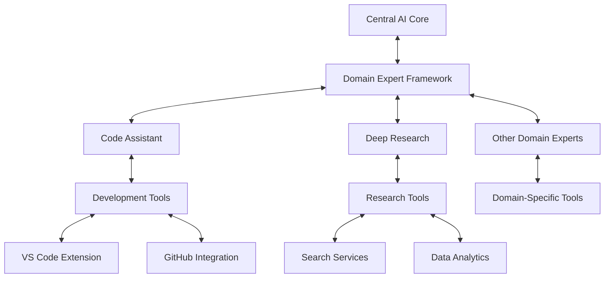

# Cortex Domain Expert Architecture

_Version: 1.0_  
_Date: March 5, 2025_

## Overview

Domain Experts are specialized autonomous modules within the Cortex Platform that provide deep capabilities in specific knowledge domains. Unlike general-purpose AI, domain experts combine specialized knowledge, workflows, and tools to deliver expert-level results in their respective domains. This document describes the architecture, interfaces, and implementation guidelines for Cortex Domain Experts.

## Core Concepts

### Domain Expert Model

A Domain Expert in the Cortex Platform is characterized by:

1. **Specialized Knowledge**: Deep domain-specific knowledge and reasoning
2. **Autonomous Operation**: Ability to work independently on delegated tasks
3. **Tool Integration**: Seamless access to domain-specific tools and resources
4. **Self-Improvement**: Continuous learning and optimization within domain
5. **Standardized Integration**: Common interfaces for connection to the Central AI Core

### Key Domain Experts

The Cortex Platform includes several core domain experts:

1. **Code Assistant**: Software development expertise

   - Code generation and modification
   - Development environment integration
   - Software architecture and design
   - Testing and debugging

2. **Deep Research**: Information gathering and synthesis

   - Advanced search capabilities
   - Data synthesis and analysis
   - Information verification
   - Research methodology

3. **Additional Experts**: Specialized for various domains
   - Analytics Expert
   - Design Expert
   - Education Expert
   - And others based on evolving needs

## Architecture

### High-Level Architecture

### Domain Expert Components

Each domain expert consists of the following components:

1. **Expert Core**: The specialized reasoning engine for the domain
2. **Knowledge Base**: Domain-specific knowledge and patterns
3. **Tool Integration**: Connections to relevant tools and services
4. **Learning System**: Capabilities for improvement over time
5. **Task Handler**: Management of tasks assigned to the expert

## Domain Expert Interface

### Communication Protocol

Domain experts communicate with the Central AI Core using the MCP Protocol. Key message types include:

1. **Task Assignment**: Receipt of tasks from the Central AI Core
2. **Progress Updates**: Status and progress reporting
3. **Result Delivery**: Return of completed task results
4. **Resource Requests**: Requests for additional resources or information
5. **Quality Assessment**: Self-evaluation of results

### Task Lifecycle

The typical lifecycle of a domain expert task:

1. **Task Reception**: Expert receives task from Central AI Core
2. **Task Analysis**: Expert analyzes requirements and plans approach
3. **Resource Gathering**: Expert gathers necessary information and tools
4. **Task Execution**: Expert performs the required operations
5. **Result Preparation**: Expert packages results for delivery
6. **Quality Validation**: Expert verifies the quality of results
7. **Result Delivery**: Expert returns results to Central AI Core
8. **Knowledge Integration**: Expert updates its knowledge from the task

## Implementation Guidelines

### Domain Expert SDK

A standard SDK is provided for domain expert development with:

1. **Core Framework**: Common domain expert functionality
2. **MCP Client**: Integration with the Cortex MCP Protocol
3. **Tool Integration**: Framework for connecting to external tools
4. **State Management**: Persistence and context management
5. **Quality Assurance**: Result validation and improvement

### Development Workflow

To create a new domain expert:

1. **Domain Analysis**: Identify domain knowledge requirements
2. **Tool Integration**: Connect relevant domain-specific tools
3. **Knowledge Engineering**: Develop specialized knowledge base
4. **Workflow Design**: Create expert-specific workflows
5. **Interface Implementation**: Implement the standard Domain Expert interface
6. **Testing and Validation**: Verify expert functionality and quality
7. **Deployment and Registration**: Deploy and register with Central AI Core

### Best Practices

For effective domain expert development:

1. **Clear Domain Boundaries**: Define precise scope of expertise
2. **Progressive Autonomy**: Start with basic tasks and expand capabilities
3. **Comprehensive Testing**: Test across varied scenarios and edge cases
4. **Explicit Limitations**: Clearly define capability boundaries
5. **Knowledge Maintenance**: Establish processes for knowledge updates
6. **Performance Metrics**: Define and track domain-specific quality metrics

## Code Assistant Expert

### Core Capabilities

The Code Assistant Expert provides:

1. **Code Generation**: Creation of code based on requirements
2. **Code Modification**: Making changes to existing code
3. **Code Analysis**: Understanding and explaining code
4. **Architecture Design**: Designing software systems
5. **Debugging**: Identifying and fixing issues
6. **Development Workflow**: Assistance with development processes

### Integration Points

The Code Assistant integrates with:

1. **VS Code Extension**: In-IDE development assistance
2. **GitHub**: Version control and code repository integration
3. **Build Systems**: Integration with compilation and building
4. **Testing Frameworks**: Automated test generation and execution
5. **Documentation Systems**: Code documentation generation

### Specialized Workflows

Key Code Assistant workflows include:

1. **New Project Creation**: Scaffolding and initial code generation
2. **Feature Implementation**: Adding new capabilities to existing code
3. **Refactoring**: Improving code structure and quality
4. **Bug Fixing**: Identifying and resolving issues
5. **Code Review**: Analyzing and providing feedback on code

## Deep Research Expert

### Core Capabilities

The Deep Research Expert provides:

1. **Information Gathering**: Finding relevant information
2. **Data Synthesis**: Combining information from multiple sources
3. **Fact Verification**: Validating information accuracy
4. **Knowledge Organization**: Structuring gathered information
5. **Research Methodology**: Following proper research processes
6. **Citation Management**: Tracking and formatting references

### Integration Points

The Deep Research Expert integrates with:

1. **Search Services**: Web and database search capabilities
2. **Academic Databases**: Access to scholarly information
3. **Data Analysis Tools**: Processing and analyzing data
4. **Knowledge Bases**: Structured information repositories
5. **Citation Systems**: Reference management and formatting

### Specialized Workflows

Key Deep Research workflows include:

1. **Topic Exploration**: Initial investigation of a subject
2. **Deep Dive Research**: Comprehensive information gathering
3. **Fact Checking**: Verification of specific claims
4. **Literature Review**: Analysis of existing publications
5. **Synthesis Report**: Creating summaries of gathered information

## Expert Registration and Discovery

### Registration Process

Domain experts are registered with the Central AI Core through:

1. **Capability Declaration**: Expert defines its capabilities
2. **Interface Verification**: Validation of required interfaces
3. **Quality Assessment**: Evaluation of expert quality
4. **Resource Allocation**: Assignment of computational resources
5. **Availability Publication**: Making expert available for tasks

### Discovery Mechanism

The Central AI Core discovers and selects experts through:

1. **Capability Matching**: Matching task requirements with expert capabilities
2. **Load Balancing**: Distributing work across available experts
3. **Quality Tracking**: Selecting experts based on past performance
4. **Specialization Recognition**: Identifying the most specialized expert for a task
5. **User Preference**: Respecting user expert preferences when specified

## Quality Assurance

### Quality Metrics

Domain expert quality is assessed through:

1. **Task Success Rate**: Percentage of successfully completed tasks
2. **Result Quality**: Measured quality of delivered results
3. **Execution Efficiency**: Resource usage and completion time
4. **User Satisfaction**: Feedback from users on expert results
5. **Self-improvement**: Demonstrated learning and adaptation

### Continuous Improvement

Domain experts improve through:

1. **Feedback Integration**: Learning from task feedback
2. **Knowledge Updates**: Regular updates to domain knowledge
3. **Performance Analysis**: Identifying and addressing weaknesses
4. **Workflow Optimization**: Refining internal processes
5. **Capability Expansion**: Adding new domain-specific capabilities

## Security and Privacy

### Security Considerations

Domain expert security includes:

1. **Access Control**: Limited access to sensitive resources
2. **Data Protection**: Secure handling of private information
3. **Tool Permissions**: Controlled access to integrated tools
4. **Authentication**: Secure identity verification
5. **Audit Logging**: Tracking of expert activities

### Privacy Framework

Privacy protection includes:

1. **Data Minimization**: Using only necessary information
2. **Purpose Limitation**: Processing data only for intended purposes
3. **Storage Restrictions**: Limiting data retention
4. **Transparency**: Clear documentation of data usage
5. **User Control**: Options for controlling expert data access

## Conclusion

The Domain Expert Architecture provides a powerful framework for extending the Cortex Platform with specialized capabilities. By combining deep domain knowledge with autonomous operation and standardized integration, domain experts enable the platform to deliver expert-level performance across a wide range of domains.

The modular, extensible nature of this architecture supports continuous evolution, allowing the Cortex Platform to adapt to new domains and use cases while maintaining its unified intelligence experience. As the platform grows, the ecosystem of domain experts will expand, further enhancing the platform's capabilities and value.
