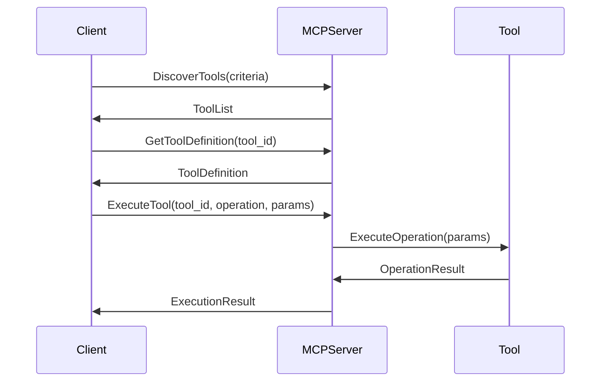
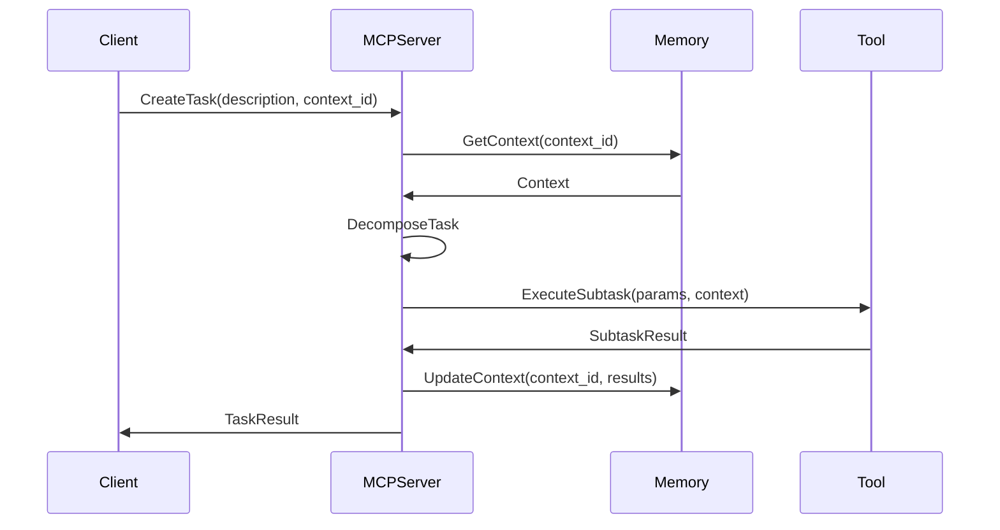

# Cortex MCP Protocol Specification

_Version: 1.0_  
_Date: March 5, 2025_

## Overview

The Memory, Cognition, and Perception (MCP) Protocol serves as the standardized integration framework for the Cortex Platform, enabling seamless communication between the Central AI Core and various components, including domain experts, external tools, and I/O modalities. This specification defines the protocol structure, message formats, and interaction patterns.

## Core Concepts

### Protocol Objectives

The MCP Protocol is designed to achieve the following objectives:

1. **Unified Integration Standard**: Provide a consistent approach for connecting diverse components
2. **Context Preservation**: Maintain context across interactions and tools
3. **Capability Discovery**: Enable dynamic discovery of available tools and capabilities
4. **Secure Communication**: Ensure secure, authenticated access to resources
5. **Extensible Design**: Support future expansion without breaking existing integrations

### Key Components

The MCP Protocol consists of three primary layers:

1. **Memory Layer**: Handles context preservation and knowledge sharing
2. **Cognition Layer**: Manages reasoning, task delegation, and result synthesis
3. **Perception Layer**: Controls interaction with external systems and tools

## Protocol Structure

### Message Format

All MCP messages use a standardized JSON format with the following structure:

```json
{
  "mcp_version": "1.0",
  "message_id": "msg-uuid-12345",
  "timestamp": "2025-03-05T12:34:56Z",
  "source": {
    "id": "component-id",
    "type": "component-type"
  },
  "destination": {
    "id": "target-id",
    "type": "target-type"
  },
  "message_type": "request|response|event",
  "content": {
    // Message-specific content
  },
  "context": {
    "session_id": "session-uuid",
    "conversation_id": "conversation-uuid",
    "correlation_id": "correlation-uuid"
    // Additional context data
  },
  "metadata": {
    // Optional metadata
  }
}
```

### Communication Patterns

The MCP Protocol supports three primary communication patterns:

1. **Request-Response**: Synchronous interaction for direct tool calls and queries
2. **Event Publication**: Asynchronous notifications for state changes and updates
3. **Stream**: Continuous data flow for real-time interactions and long-running processes

## Memory Layer

The Memory Layer handles context preservation and knowledge sharing between components.

### Context Objects

Context objects encapsulate the shared state that persists across interactions:

```json
{
  "context_id": "ctx-uuid-12345",
  "created_at": "2025-03-05T12:00:00Z",
  "updated_at": "2025-03-05T12:34:56Z",
  "type": "session|conversation|workspace|global",
  "ttl": 3600,
  "state": {
    // Context-specific state data
  },
  "references": [
    {
      "type": "entity|document|conversation",
      "id": "ref-uuid-67890"
    }
  ]
}
```

### Memory Operations

The Memory Layer supports the following operations:

- **GetContext**: Retrieve a context object by ID
- **CreateContext**: Create a new context object
- **UpdateContext**: Modify an existing context object
- **MergeContexts**: Combine multiple context objects
- **SearchMemory**: Find relevant information in memory

## Cognition Layer

The Cognition Layer manages reasoning, task delegation, and result synthesis.

### Task Objects

Tasks represent discrete units of work:

```json
{
  "task_id": "task-uuid-12345",
  "created_at": "2025-03-05T12:00:00Z",
  "status": "created|decomposed|scheduled|in_progress|completed|failed",
  "description": "Task description",
  "priority": 1-5,
  "deadline": "2025-03-05T13:00:00Z",
  "context_id": "ctx-uuid-67890",
  "subtasks": [
    // Nested task objects
  ],
  "dependencies": [
    "task-uuid-67890"
  ],
  "assigned_to": "component-id",
  "result": {
    // Task result data
  }
}
```

### Cognition Operations

The Cognition Layer supports the following operations:

- **CreateTask**: Create a new task
- **GetTaskStatus**: Retrieve the current status of a task
- **UpdateTaskProgress**: Report progress on a task
- **CompleteTask**: Mark a task as completed with results
- **CancelTask**: Terminate a task

## Perception Layer

The Perception Layer controls interaction with external systems and tools.

### Tool Definition

Tools are defined using a standardized descriptor format:

```json
{
  "tool_id": "tool-uuid-12345",
  "name": "ToolName",
  "version": "1.0",
  "description": "Tool description",
  "provider": "ProviderName",
  "authentication": {
    "type": "oauth2|apikey|none",
    "scopes": ["scope1", "scope2"]
  },
  "operations": [
    {
      "operation_id": "operation-name",
      "description": "Operation description",
      "parameters": {
        "type": "object",
        "properties": {
          "param1": {
            "type": "string",
            "description": "Parameter description"
          }
        },
        "required": ["param1"]
      },
      "returns": {
        "type": "object",
        "properties": {
          "result1": {
            "type": "string",
            "description": "Result description"
          }
        }
      }
    }
  ],
  "capabilities": ["capability1", "capability2"]
}
```

### Tool Operations

The Perception Layer supports the following operations:

- **DiscoverTools**: Find available tools matching criteria
- **GetToolDefinition**: Retrieve a tool's complete definition
- **ExecuteTool**: Run a specific tool operation
- **GetExecutionStatus**: Check the status of a tool execution
- **CancelExecution**: Terminate a tool execution

## Authentication and Security

### Authentication Methods

The MCP Protocol supports multiple authentication methods:

1. **API Keys**: Simple token-based authentication
2. **OAuth 2.0**: Standard OAuth flow for secure delegation
3. **Mutual TLS**: Certificate-based authentication for secure connections
4. **Session Tokens**: Short-lived tokens for authenticated sessions

### Authorization Model

Authorization follows a capability-based security model:

1. Components request specific capabilities during registration
2. Capabilities define allowed operations and access patterns
3. Capabilities can be granted, revoked, or modified dynamically
4. Runtime capability checks enforce security boundaries

## Error Handling

### Error Format

Errors are returned in a standardized format:

```json
{
  "error": {
    "code": "error-code",
    "message": "Human-readable error message",
    "details": {
      // Additional error-specific details
    },
    "request_id": "request-uuid",
    "timestamp": "2025-03-05T12:34:56Z"
  }
}
```

### Standard Error Codes

The protocol defines the following standard error categories:

- **Authentication**: 1000-1999 (e.g., 1001: Invalid credentials)
- **Authorization**: 2000-2999 (e.g., 2001: Insufficient permissions)
- **Validation**: 3000-3999 (e.g., 3001: Invalid parameter)
- **Resource**: 4000-4999 (e.g., 4001: Resource not found)
- **System**: 5000-5999 (e.g., 5001: Internal error)
- **Protocol**: 6000-6999 (e.g., 6001: Malformed message)

## Implementation Guidelines

### MCP Server

An MCP Server is a service that implements the MCP Protocol and provides:

1. Message routing and dispatch
2. Tool registration and discovery
3. Context management
4. Authentication and authorization
5. Logging and monitoring

### Client SDKs

Official client SDKs are available for common languages:

- **Python SDK**: Full-featured SDK for Python applications
- **TypeScript/JavaScript SDK**: SDK for web and Node.js applications
- **Java SDK**: SDK for JVM-based applications
- **C# SDK**: SDK for .NET applications

### Implementation Steps

To implement an MCP-compatible tool or service:

1. Define tool capabilities and operations
2. Implement the MCP message format
3. Implement authentication and security
4. Register with an MCP server
5. Handle requests and return responses

## Protocol Extensions

The MCP Protocol can be extended through:

1. **Custom Message Types**: Additional message types for specialized interactions
2. **Extended Capabilities**: New capability definitions for emerging features
3. **Protocol Versions**: Backward-compatible protocol evolution

## Example Interactions

### Tool Discovery and Execution



### Context-Aware Task Execution



## Reference Implementations

Official reference implementations are available at:

- [Python MCP Server](https://github.com/cortex-platform/mcp-server-python)
- [TypeScript MCP Client](https://github.com/cortex-platform/mcp-client-typescript)
- [MCP Protocol Test Suite](https://github.com/cortex-platform/mcp-test-suite)

## Conclusion

The MCP Protocol provides a robust, standardized framework for integrating components within the Cortex Platform ecosystem. By implementing this protocol, developers can create tools, experts, and integrations that seamlessly participate in the unified intelligence experience that defines Cortex.
