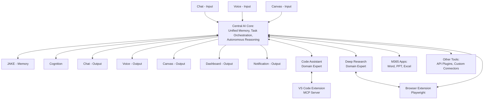

# Cortex Platform - Unified Architecture

## 1. Executive Summary

The Cortex Platform represents a next-generation AI assistant ecosystem designed with a modular, composable architecture. It functions as a unified system that handles memory, reasoning, and task orchestration while offering multiple interaction modalities and domain-specific expertise through standardized interfaces.

This architecture document consolidates the vision for the Cortex Platform, establishing a foundation for both the initial proof-of-concept implementation and future expansion.

## 2. System Overview

The Cortex Platform is structured as a layered architecture with distinct responsibilities:



## 3. Key Architectural Principles

### 3.1 Modular & Composable Ecosystem

- All components are designed to be self-contained and interchangeable
- Default implementations are provided, but users can implement their own
- Each component connects via standardized interfaces (primarily MCP)
- Functionality can be extended through additional modules without modifying the core

### 3.2 Separation of Concerns

The architecture clearly separates different functional areas:

- **Memory System**: Synthesizes and abstracts critical context for recall
- **Cognition System**: Handles reasoning, actions, decisions, and orchestration
- **Domain Expert Systems**: Provide specialized capabilities for specific domains
- **Input/Output Systems**: Handle different modalities for user interaction
- **Integration Layer**: Connects to external tools and services

### 3.3 Adaptive Interaction

- The system dynamically selects the best modality based on user context and needs
- Multiple input and output modalities are supported simultaneously
- Voice interaction supports both:
  - Conventional pipelines (speech-to-text/text-to-speech)
  - Real-time voice streaming (using OpenAI or similar APIs)
- Outputs automatically combine verbal expressions with visual supplements when appropriate

### 3.4 MCP Integration

- Model Context Protocol (MCP) serves as the backbone for inter-service communications
- Central AI Core includes an embedded MCP client for connecting to external services
- Standardized tool/resource discovery and interaction patterns
- Enables third-party extensions and integrations

### 3.5 Workspace-Centric Design

- Workspaces serve as the organizational concept for grouping artifacts, conversations, and context
- Essential for collaborative and project-based workflows
- Provides persistent context across user sessions
- Enables sharing and access controls

## 4. Core Components

### 4.1 Central AI Core

The Central AI Core is the primary orchestration layer that connects all components and manages the flow of information.

#### 4.1.1 Responsibilities

- Routes messages between input/output modalities, memory, cognition, and domain experts
- Manages MCP client interactions with external tools and services
- Maintains conversation context and session state
- Determines appropriate communication modalities for responses
- Handles task planning and execution

#### 4.1.2 Implementation

- Built on FastAPI (Python) for high performance and async capabilities
- Exposes multiple interface options:
  - REST API for frontend applications
  - OpenAI-compatible API for easy integration with existing tools
  - MCP endpoints for protocol-based integration
- Implements a standardized message structure for internal communications

### 4.2 Memory System (JAKE)

The JAKE (Just Another Knowledge Engine) Whiteboard provides an LLM-driven approach to memory management that synthesizes and maintains high-level contextual understanding.

#### 4.2.1 Key Features

- Synthesizes high-level "memories" rather than storing verbatim histories
- Processes recent interactions to update a unified whiteboard artifact
- Maintains a coherent, evolving understanding of conversation context
- Provides optimized context for future interactions

#### 4.2.2 Architecture

- **Whiteboard**: A single consolidated artifact containing synthesized understanding
- **LLM Processing**: Uses LLM to dynamically update the whiteboard based on new information
- **Context Trigger**: Updates are triggered on each significant change to content/context
- **Memory Retrieval**: The current whiteboard is provided as context for future interactions

#### 4.2.3 Implementation Strategy

```python
# Example of JAKE Whiteboard implementation
class JAKEMemory:
    def __init__(self, llm_client):
        self.llm_client = llm_client
        self.workspaces = {}  # workspace_id -> current whiteboard content

    async def update_memory(self, workspace_id, recent_conversation):
        """Process recent conversation to update the whiteboard."""
        # Get current whiteboard (empty if none exists)
        current_whiteboard = self.workspaces.get(workspace_id, "")

        # Create system prompt for whiteboard synthesis
        system_prompt = """
        You are JAKE, a memory system that maintains a concise whiteboard of key information.
        Your task is to update the whiteboard with new information while maintaining clarity and relevance.
        - Focus on facts, insights, preferences, and important details
        - Organize related information together
        - Remove redundant or outdated information
        - Keep the whiteboard concise and well-structured
        """

        # Prepare the user message with current whiteboard and new conversation
        user_message = f"""
        CURRENT WHITEBOARD:
        {current_whiteboard}

        RECENT CONVERSATION:
        {recent_conversation}

        Please create an updated whiteboard that incorporates relevant new information.
        """

        # Call LLM to synthesize updated whiteboard
        response = await self.llm_client.complete(
            system=system_prompt,
            user=user_message,
            max_tokens=1000
        )

        # Update stored whiteboard
        updated_whiteboard = response.content
        self.workspaces[workspace_id] = updated_whiteboard

        return updated_whiteboard

    def get_memory_context(self, workspace_id):
        """Retrieve the current whiteboard for a workspace."""
        return self.workspaces.get(workspace_id, "")
```

### 4.3 Cognition System

The Cognition System focuses on intelligent result handling from asynchronous tasks and determining the optimal way to surface information to users based on current context and availability.

#### 4.3.1 Key Features

- Processes results from long-running tasks (particularly from domain experts)
- Analyzes user's current state (available interfaces, conversation context)
- Determines relevance and timeliness of information
- Makes intelligent decisions about how to surface or store results
- Provides mechanisms for retrieval of stored information when relevant

#### 4.3.2 Architecture

- **Result Handler**: Processes incoming results from asynchronous tasks
- **Context Analyzer**: Evaluates current user state and conversation context
- **Surface Decider**: Determines how and when to present information
- **Storage Manager**: Maintains relevant information for future retrieval

#### 4.3.3 Implementation Strategy

```python
# Example of Cognition System focused on result handling
class CognitionSystem:
    def __init__(self, llm_client):
        self.llm_client = llm_client
        self.pending_results = {}  # task_id -> result
        self.user_state_cache = {}  # user_id -> state information
        self.stored_results = {}  # user_id -> stored results

    async def handle_task_result(self, task_id, result, user_id, workspace_id):
        """Process results from a long-running task and determine action."""
        # Store the result
        self.pending_results[task_id] = {
            "data": result,
            "timestamp": datetime.now(),
            "user_id": user_id,
            "workspace_id": workspace_id,
            "processed": False
        }

        # Get current user state
        user_state = self.get_user_state(user_id)

        # Prepare context for LLM decision
        system_prompt = """
        You are a cognitive system responsible for determining how to handle results from completed tasks.
        Evaluate the relevance, urgency, and appropriate delivery method based on user state and result content.
        """

        user_message = f"""
        TASK RESULT:
        {result}

        USER STATE:
        Available interfaces: {user_state.get('available_interfaces', [])}
        Current conversation context: {user_state.get('conversation_context', 'None')}
        Last active: {user_state.get('last_active_time', 'Unknown')}

        Determine:
        1. Is this result relevant to the user's current context?
        2. What is the urgency level (high, medium, low)?
        3. How should this be delivered (immediate, notification, store for later)?
        4. If stored, what trigger conditions should prompt retrieval?
        """

        # Get decision from LLM
        decision = await self.llm_client.complete(
            system=system_prompt,
            user=user_message,
            max_tokens=500
        )

        # Process the decision
        decision_text = decision.content

        # For this example, we'll parse a simplified response format
        # In production, use more structured output formats from the LLM
        relevance = "high" if "relevant: high" in decision_text.lower() else "medium" if "relevant: medium" in decision_text.lower() else "low"
        urgency = "high" if "urgency: high" in decision_text.lower() else "medium" if "urgency: medium" in decision_text.lower() else "low"
        delivery = "immediate" if "delivery: immediate" in decision_text.lower() else "notification" if "delivery: notification" in decision_text.lower() else "store"

        # Take action based on decision
        if delivery == "immediate" and "chat" in user_state.get('available_interfaces', []):
            return {
                "action": "surface_immediately",
                "channel": "chat",
                "content": self.format_result_for_chat(result)
            }
        elif delivery == "notification":
            return {
                "action": "send_notification",
                "content": self.create_notification(result, urgency)
            }
        else:  # store for later
            self.store_result(user_id, result, {
                "relevance": relevance,
                "urgency": urgency,
                "context": user_state.get('conversation_context'),
                "trigger_conditions": self.extract_trigger_conditions(decision_text)
            })

            return {
                "action": "stored",
                "retrieval_info": self.extract_trigger_conditions(decision_text)
            }

    def get_user_state(self, user_id):
        """Get current user state including available interfaces and context."""
        # In a real implementation, this would query various systems
        # For this example, we'll return mock data
        return {
            "available_interfaces": ["chat", "notification"],
            "conversation_context": "Discussing project planning and architecture",
            "last_active_time": datetime.now() - timedelta(minutes=5)
        }

    def store_result(self, user_id, result, metadata):
        """Store result for later retrieval."""
        if user_id not in self.stored_results:
            self.stored_results[user_id] = []

        self.stored_results[user_id].append({
            "result": result,
            "metadata": metadata,
            "stored_at": datetime.now()
        })

    def extract_trigger_conditions(self, decision_text):
        """Extract trigger conditions from the decision text."""
        # In a real implementation, this would parse structured conditions
        # For this example, we'll extract a simple text description
        trigger_section = decision_text.split("trigger conditions:")[-1].strip() if "trigger conditions:" in decision_text.lower() else ""
        return trigger_section or "Relevant to current conversation topic"

    def format_result_for_chat(self, result):
        """Format result for chat interface."""
        # Format logic would depend on result type
        return f"I've completed a task you requested. Here's what I found:\n\n{result}"

    def create_notification(self, result, urgency):
        """Create a notification from the result."""
        title = "Task Complete" if urgency == "low" else "Important Result Available" if urgency == "medium" else "Urgent: Task Result Ready"
        summary = str(result)[:100] + "..." if len(str(result)) > 100 else str(result)
        return {
            "title": title,
            "body": summary,
            "urgency": urgency
        }
```

### 4.4 Input/Output Modalities

The platform supports multiple input and output modalities for flexible user interaction.

#### 4.4.1 Input Modalities

- **Chat Input**: Text-based interactions with markdown support
- **Voice Input**:
  - Conventional speech-to-text processing
  - Real-time voice streaming (for reduced latency)
- **Canvas Input**: Visual input for diagrams, drawings, and annotations

#### 4.4.2 Output Modalities

- **Chat Output**: Text responses with rich formatting and markdown support
- **Voice Output**:
  - Text-to-speech synthesis
  - Real-time audio streaming responses
- **Canvas Output**: Visual representations including diagrams, charts, and illustrations
- **Dashboard Output**: Data visualizations and structured information displays
- **Notification Output**: Alerts, reminders, and status updates

### 4.5 Domain Expert Systems

Domain Expert Systems provide specialized capabilities for specific domains, enabling the platform to offer advanced functionality in targeted areas.

#### 4.5.1 Code Assistant

- Specializes in software development tasks
- Integrates with the VS Code MCP server
- Provides code generation, explanation, and refactoring
- Understands project structure and development context

#### 4.5.2 Deep Research

- Focuses on information retrieval and analysis
- Integrates with browser automation for web research
- Synthesizes information from multiple sources
- Provides citations and evidence for claims

#### 4.5.3 Implementation Approach

Domain Experts are implemented as separate services that:

- Connect to the core via MCP
- Can be deployed independently
- Have specialized context understanding
- May connect to additional external tools

### 4.6 MCP Integration

The Model Context Protocol (MCP) provides a standardized way for the platform to connect with external tools and services.

#### 4.6.1 MCP Protocol Handler

- Serves as a central hub for all MCP server communications
- Manages server connections and requests
- Routes capabilities to appropriate components
- Handles authentication and security

#### 4.6.2 MCP Servers

- **VS Code MCP Server**: Provides code context, project structure, and file operations
- **Browser Extension**: Enables web page access and automation via Playwright
- **M365 Apps**: Connects to Microsoft Office applications
- **Custom Tool Servers**: Allows for extension through additional MCP servers

## 5. Integration Architecture

### 5.1 Frontend Applications

The platform provides multiple frontend applications, each focusing on specific interaction modalities:

#### 5.1.1 Application Structure

- **Chat Application (Port 5000)**: Primary text interface
- **Voice Application (Port 5001)**: Voice interaction interface
- **Canvas Application (Port 5002)**: Visual interaction interface
- **Workspace Manager (Port 5003)**: Workspace organization and management
- **Dashboard Application (Port 5004)**: Data visualization and monitoring

#### 5.1.2 Shared Components

- **Cortex SDK**: Common API clients and utilities
- **Cortex UI Components**: Shared UI elements with responsive design
- **Authentication**: Unified authentication across applications

### 5.2 Backend Services

Backend services are separated by responsibility:

#### 5.2.1 Service Structure

- **Central AI Core (Port 6000)**: Main orchestration and processing service
- **Memory System (Port 6001)**: JAKE Whiteboard implementation
- **Cognition System (Port 6002)**: Reasoning and insight generation

#### 5.2.2 Communication Patterns

- REST APIs for frontend-to-backend communication
- MCP for backend-to-backend and backend-to-tool communication
- OpenAI-compatible API for integration with existing LLM tools

### 5.3 Responsive Design

All frontend applications implement responsive design to support both desktop and mobile interfaces:

```typescript
// Example of responsive breakpoints
export const breakpoints = {
  xs: "320px",
  sm: "600px",
  md: "960px",
  lg: "1280px",
  xl: "1920px",
};

export const devices = {
  mobile: `(min-width: ${breakpoints.xs})`,
  tablet: `(min-width: ${breakpoints.sm})`,
  laptop: `(min-width: ${breakpoints.md})`,
  desktop: `(min-width: ${breakpoints.lg})`,
  largeDesktop: `(min-width: ${breakpoints.xl})`,
};
```

## 6. Technology Stack

### 6.1 Backend Technologies

- **Language**: Python 3.11+
- **Framework**: FastAPI for high-performance async API development
- **LLM Integration**: Direct API calls to selected LLM providers
- **Database**: SQLite for PoC, PostgreSQL for production
- **Vector Database**: (Optional) for semantic search capabilities

### 6.2 Frontend Technologies

- **Framework**: React 18+ with TypeScript
- **Build Tool**: Vite for fast development and optimized builds
- **State Management**: React Context or Redux (depending on complexity)
- **UI Components**: Custom component library with responsive design
- **API Communication**: Axios for HTTP requests

### 6.3 MCP Servers

- **VS Code**: TypeScript MCP server integrated with VS Code extension
- **Browser**: Python MCP server with Playwright for web automation
- **Other Servers**: Combination of Python and TypeScript implementations as appropriate

## 7. Deployment Strategy

### 7.1 Development Environment

- Docker Compose for local development and testing
- Standard port assignments across all environments
- Environment-specific configuration via environment variables

### 7.2 Production Deployment

- **Container Orchestration**: Kubernetes or similar for production
- **Cloud Hosting**: Azure or AWS recommended
- **CI/CD**: GitHub Actions for automated testing and deployment

### 7.3 Docker Configuration

```yaml
# Example docker-compose.yml excerpt
services:
  cortex-core:
    build: ./cortex-core
    ports:
      - "6000:6000"
    environment:
      - OPENAI_API_KEY=${OPENAI_API_KEY}
      - MEMORY_SERVICE_URL=http://cortex-memory:6001
      - COGNITION_SERVICE_URL=http://cortex-cognition:6002
    volumes:
      - ./cortex-core:/app
    command: uvicorn app.main:app --host 0.0.0.0 --port 6000 --reload

  cortex-memory:
    build: ./cortex-memory
    ports:
      - "6001:6001"
    volumes:
      - ./cortex-memory:/app
    command: uvicorn app.main:app --host 0.0.0.0 --port 6001 --reload
```

## 8. Security Considerations

### 8.1 Authentication & Authorization

- JWT-based authentication for user sessions
- Role-based access control for workspaces and features
- API key management for external integrations

### 8.2 Data Protection

- Encryption for sensitive data at rest and in transit
- Configurable data retention policies
- Privacy controls for user information

### 8.3 MCP Server Security

- Secure authentication for MCP server connections
- Permission-based access to tools and resources
- Audit logging for security-relevant operations

## 9. Future Expansion

### 9.1 Enhanced Real-time Voice

- Fully implement real-time voice streaming
- Optimize for low-latency conversations
- Support for multi-speaker recognition

### 9.2 Advanced Domain Experts

- Develop more sophisticated domain expert systems
- Create marketplace for third-party expert systems
- Implement domain expert composition and chaining

### 9.3 Enhanced Memory Management

- Vector database for sophisticated semantic search
- Structured data storage for complex information types
- Advanced memory synthesis capabilities

### 9.4 Collaborative Features

- Multi-user workspace collaboration
- Real-time updates across clients
- Enhanced sharing and permission management

### 9.5 Mobile Applications

- Native mobile applications for iOS and Android
- Optimized interfaces for mobile interaction
- Offline capabilities for critical functions

## 10. Conclusion

The Cortex Platform architecture establishes a foundation for a next-generation AI assistant ecosystem. By embracing modularity, separation of concerns, and standardized interfaces, it enables both initial implementation flexibility and long-term extensibility. The architecture supports multiple interaction modalities and specialized domain expertise while maintaining a coherent user experience.

The implementation plan defined in the companion document provides a practical roadmap for realizing this architecture with a focus on producing a functional proof-of-concept within a constrained timeframe.
