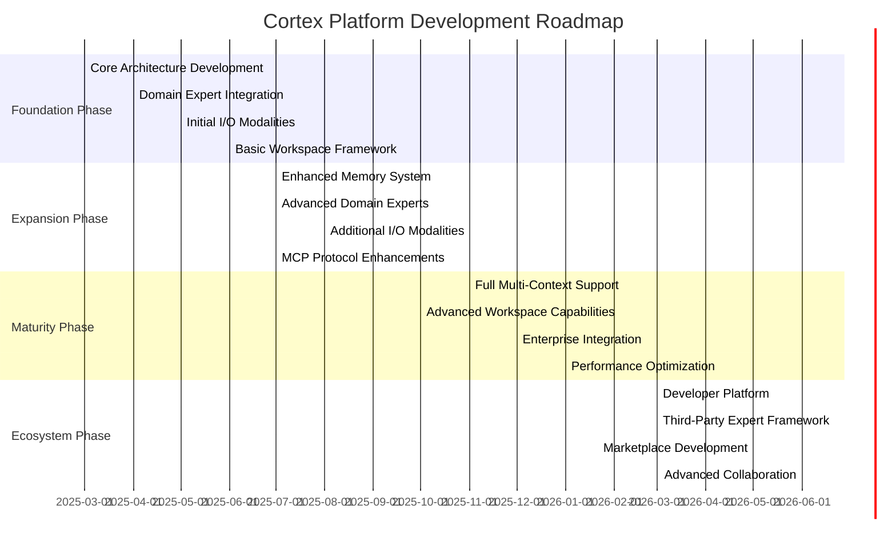

# Cortex Platform: Strategic Roadmap

_Version: 1.0_  
_Date: 2025-03-04_

## Introduction

This strategic roadmap outlines the phased approach for developing and scaling the Cortex Platform. It provides a clear timeline of priorities, dependencies, and milestones to guide implementation efforts while maintaining alignment with the overall platform vision.

The roadmap is designed to deliver incremental value at each stage while building toward the complete unified intelligence ecosystem.

## Roadmap Overview

## Phase 1: Foundation (Q2-Q3 2025)

The Foundation Phase establishes the core architecture and essential components needed to demonstrate the platform's fundamental value proposition.

### Objectives

- Implement the base Central AI Core with essential orchestration capabilities
- Establish basic memory and cognition systems
- Integrate initial domain experts (Code Assistant, Deep Research)
- Develop primary I/O modalities (chat, basic voice, simple canvas)
- Create a prototype workspace framework
- Build MCP integration for core external tools

### Key Deliverables

#### 1.1 Central AI Core (Q2 2025)

- Core orchestration engine with basic task routing
- FastAPI implementation with REST endpoints
- Initial OpenAI-compatible API
- Basic authentication and session management
- Simplified memory context handling

#### 1.2 Memory and Cognition (Q2 2025)

- MVP implementation of JAKE memory system
- Basic context synthesis capabilities
- Simplified cognition system with fundamental reasoning
- Initial memory persistence and retrieval

#### 1.3 Domain Expert Integration (Q2-Q3 2025)

- Code Assistant with VS Code integration
- Deep Research with basic web research capabilities
- MCP integration for expert systems
- Simplified autonomous planning capabilities

#### 1.4 Multi-Modal I/O (Q3 2025)

- Chat interface with markdown support
- Basic voice input/output using conventional STT/TTS
- Simple canvas input for diagrams and annotations
- Fundamental dashboard output capabilities

#### 1.5 Basic Workspace Framework (Q3 2025)

- Simple workspace creation and management
- Basic context isolation between workspaces
- Rudimentary sharing capabilities
- Initial workspace persistence

#### 1.6 Initial External Integrations (Q2-Q3 2025)

- VS Code extension with MCP server
- Browser extension with basic automation
- Simple M365 connectors (Word, Excel)
- API plugin framework for custom integrations

### Success Criteria

- Central AI Core successfully orchestrates basic task flows
- Memory system retains and synthesizes interaction history
- Domain experts demonstrate autonomous operation for simple tasks
- Multiple I/O modalities function with basic context awareness
- Workspaces provide fundamental organization of interactions
- External tools successfully integrate via MCP

### Dependencies and Critical Path

- LLM selection and integration is a prerequisite for all components
- Central AI Core must be operational before domain expert integration
- Basic memory system is required for meaningful multi-modal interactions
- MCP implementation is critical for external tool integration

## Phase 2: Expansion (Q4 2025)

The Expansion Phase builds on the foundation to enhance core capabilities, improve user experience, and expand the range of supported domains and integrations.

### Objectives

- Enhance memory and cognition systems with more sophisticated capabilities
- Expand the range and capabilities of domain experts
- Improve multi-modal interaction quality and adaptivity
- Strengthen MCP implementation with enhanced discovery and communication
- Extend integration options to additional platforms and tools

### Key Deliverables

#### 2.1 Enhanced Memory System (Q4 2025)

- Improved memory synthesis algorithms
- Vector-based semantic search for context retrieval
- Enhanced whiteboard maintenance
- Memory segmentation for different context types

#### 2.2 Advanced Domain Experts (Q4 2025)

- Enhanced Code Assistant with more sophisticated planning
- Expanded Deep Research with synthesis capabilities
- New domain experts (e.g., Design Assistant, Data Analyst)
- Improved autonomous operation and refinement

#### 2.3 Advanced I/O Modalities (Q4 2025)

- Real-time voice streaming for reduced latency
- Enhanced canvas interaction with multimodal input
- Advanced dashboard visualization capabilities
- Context-aware notification system
- Improved modality selection intelligence

#### 2.4 MCP Enhancements (Q4 2025)

- Improved tool and resource discovery
- Enhanced error handling and recovery
- Performance optimizations
- Expanded communication patterns
- Monitoring and debugging capabilities

#### 2.5 Additional Integrations (Q4 2025)

- Expanded M365 integration
- Additional IDE integrations
- Mobile platform connectors
- IoT device integration framework

#### 2.6 Workspace Enhancements (Q4 2025)

- Improved collaboration features
- Enhanced context management
- Better organization of artifacts
- Cross-workspace search and reference

### Success Criteria

- Memory system demonstrates improved context relevance and recall
- Domain experts handle complex tasks with minimal supervision
- I/O modalities adapt effectively to different user contexts
- MCP provides robust, resilient communication
- New integrations function smoothly with the core platform
- Workspaces effectively organize complex projects

### Dependencies and Critical Path

- Foundation Phase components must be stable
- Memory enhancements enable more advanced cognition
- MCP improvements support more sophisticated domain experts
- I/O advancements depend on improved contextual understanding

## Phase 3: Maturity (Q1-Q2 2026)

The Maturity Phase focuses on enterprise readiness, performance optimization, and scalability to support production deployment across diverse environments.

### Objectives

- Optimize performance and resource utilization
- Enhance security and compliance capabilities
- Improve scalability for enterprise deployment
- Develop advanced workspace collaboration
- Implement sophisticated cross-context support
- Extend platform to additional environments

### Key Deliverables

#### 3.1 Performance Optimization (Q1 2026)

- Memory and processing optimizations
- Response time improvements
- Resource utilization efficiency
- Caching and pre-computation strategies
- Asynchronous processing enhancements

#### 3.2 Enterprise Capabilities (Q1 2026)

- Advanced authentication and authorization
- Role-based access control
- Audit logging and compliance features
- Data sovereignty controls
- Enterprise deployment guides

#### 3.3 Advanced Workspace Capabilities (Q1 2026)

- Sophisticated project management
- Multi-user collaboration spaces
- Contextual filtering and organization
- Cross-workspace intelligence
- Workspace templates and best practices

#### 3.4 Full Multi-Context Support (Q1-Q2 2026)

- Seamless context transitions across all environments
- Unified experience across devices and platforms
- Context-aware adaptive responses
- Intelligent context prioritization
- Cross-environment memory synthesis

#### 3.5 Extended Environment Support (Q2 2026)

- Gaming platform integration
- Immersive environment support
- Smart home device connectivity
- Vehicle integration

#### 3.6 Distributed Architecture (Q2 2026)

- Hybrid deployment models
- Edge computing capabilities
- Distributed processing options
- Federated deployment patterns

### Success Criteria

- Platform performs efficiently at enterprise scale
- Security and compliance meet enterprise requirements
- Workspaces support complex collaborative workflows
- Context transitions seamlessly across all environments
- Extended environments integrate smoothly with the platform
- Deployment options support diverse organizational needs

### Dependencies and Critical Path

- Expansion Phase capabilities must be stable
- Performance optimization enables enterprise scalability
- Enhanced security is prerequisite for enterprise adoption
- Multi-context support depends on advanced memory capabilities

## Phase 4: Ecosystem (Q3-Q4 2026)

The Ecosystem Phase transforms Cortex from a platform into a vibrant ecosystem with third-party contributions, a developer community, and a diverse marketplace of extensions and integrations.

### Objectives

- Create comprehensive developer platform
- Establish framework for third-party domain experts
- Develop marketplace for extensions and integrations
- Build community and partnership ecosystem
- Implement advanced collaboration capabilities
- Enable ecosystem-driven innovation

### Key Deliverables

#### 4.1 Developer Platform (Q3 2026)

- Comprehensive SDK for all platform components
- Detailed documentation and examples
- Developer portal with resources and tools
- Testing and validation frameworks
- Debugging and monitoring tools

#### 4.2 Third-Party Expert Framework (Q3 2026)

- Full specification for domain expert creation
- Certification process for expert systems
- Performance and security standards
- Integration testing framework
- Expert system marketplace infrastructure

#### 4.3 Marketplace Development (Q3-Q4 2026)

- Extension and integration marketplace
- Discovery and recommendation engine
- Ratings and review system
- Payment and revenue sharing infrastructure
- Publisher management tools

#### 4.4 Community Development (Q3-Q4 2026)

- Developer community platform
- Knowledge base and documentation
- Community contribution framework
- Forum and support infrastructure
- User feedback mechanisms

#### 4.5 Advanced Collaboration (Q4 2026)

- Real-time multi-user collaboration
- Cross-organization workspace sharing
- Federated expert system collaboration
- Collective intelligence features
- Secure boundary-crossing workflows

#### 4.6 Innovation Infrastructure (Q4 2026)

- Experimentation framework
- A/B testing capabilities
- Innovation metrics and analytics
- Feedback collection and analysis
- Continuous improvement process

### Success Criteria

- Active developer community building on the platform
- Growing marketplace of domain experts and integrations
- Third-party contributions meet quality and security standards
- Collaboration features enable sophisticated multi-user workflows
- Ecosystem demonstrates self-sustaining growth
- Innovation metrics show acceleration of new capabilities

### Dependencies and Critical Path

- Maturity Phase capabilities must be stable
- Developer platform is prerequisite for third-party contributions
- Marketplace infrastructure enables ecosystem economics
- Community development supports ecosystem growth

## Key Performance Indicators

The following KPIs will be tracked to measure progress and success across all phases:

### Technical KPIs

- **Response Time**: Average and 95th percentile response times
- **Accuracy Rate**: Correctness of responses and actions
- **Context Retention**: Effectiveness of memory and context management
- **Cross-Tool Integration**: Number and reliability of integrated tools
- **System Stability**: Uptime and error rates

### User Experience KPIs

- **Task Completion Rate**: Percentage of tasks successfully completed
- **Interaction Efficiency**: Steps required to complete common tasks
- **Context Switching Reduction**: Measured improvement in workflow continuity
- **User Satisfaction**: Feedback scores and sentiment analysis
- **Adoption Rate**: Active user growth and retention

### Ecosystem KPIs

- **Developer Adoption**: Number of active developers
- **Extension Growth**: Rate of new extension development
- **Marketplace Activity**: Volume of marketplace transactions
- **Community Engagement**: Forum activity and contribution metrics
- **Partnership Growth**: Number and quality of strategic partnerships

## Conclusion

This strategic roadmap provides a structured approach to realizing the Cortex Platform vision through incremental development across four key phases. Each phase builds upon the previous one while delivering tangible value at every stage.

The Foundation Phase establishes the core components and demonstrates fundamental capabilities. The Expansion Phase enhances these components and extends their reach. The Maturity Phase optimizes for enterprise deployment and seamless cross-context experience. Finally, the Ecosystem Phase transforms Cortex into a vibrant community of developers, experts, and users collaborating to continuously enhance the platform's capabilities.

By following this roadmap, the Cortex Platform will evolve from a promising concept into a transformative intelligence ecosystem that fundamentally changes how humans and AI collaborate across the digital landscape.
