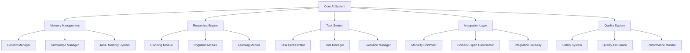

# Cortex Platform: Core AI Implementation

_Version: 1.0_  
_Date: 2025-03-05_

## Introduction

This document provides technical implementation details for the Core AI system of the Cortex Platform. The Core AI represents the central intelligence component that coordinates all platform capabilities, manages context, and delivers seamless experiences across different modalities and tools. The implementation approach addresses several key considerations:

1. Unified memory architecture for maintaining context and knowledge
2. Task orchestration for coordinating multi-step reasoning and actions
3. Autonomous reasoning for generating insights and making decisions
4. Modality-agnostic processing for consistent experiences
5. Extensible architecture for integrating with domain experts and tools

The Core AI implementation balances several critical factors:

- **Flexibility vs. Consistency**: Creating a system that can be tailored to different domains while maintaining a consistent user experience
- **Autonomy vs. Control**: Enabling autonomous intelligence while maintaining appropriate human oversight
- **Performance vs. Depth**: Supporting rapid responses while enabling deep reasoning
- **Generality vs. Specialization**: Balancing broad capabilities with domain-specific excellence

## Core Architecture

### High-Level Architecture



### Core Components

#### Memory Management

The Memory Management system maintains context and knowledge:

- **Context Manager**: Handles immediate context

  - Session state management
  - Conversation tracking
  - Working memory
  - Context prioritization

- **Knowledge Manager**: Manages long-term knowledge

  - Knowledge retrieval
  - Knowledge integration
  - Knowledge validation
  - Knowledge organization

- **JAKE Memory System**: Provides structured memory
  - Entity management
  - Relationship tracking
  - Memory decomposition
  - Memory synthesis

#### Reasoning Engine

The Reasoning Engine handles intelligence processes:

- **Planning Module**: Creates reasoning strategies

  - Goal analysis
  - Strategy formulation
  - Resource allocation
  - Step sequencing

- **Cognition Module**: Executes reasoning steps

  - Information processing
  - Pattern recognition
  - Inference generation
  - Counterfactual reasoning

- **Learning Module**: Improves over time
  - Experience analysis
  - Adaptation management
  - Knowledge consolidation
  - Strategy optimization

#### Task System

The Task System manages actionable processes:

- **Task Orchestrator**: Coordinates activities

  - Task decomposition
  - Dependency management
  - Parallel execution
  - Task prioritization

- **Tool Manager**: Handles external capabilities

  - Tool discovery
  - Tool selection
  - Parameter preparation
  - Result processing

- **Execution Manager**: Runs task steps
  - Execution planning
  - Progress tracking
  - Error handling
  - Result assembly

#### Integration Layer

The Integration Layer connects with platform components:

- **Modality Controller**: Manages I/O channels

  - Modality selection
  - Cross-modal coordination
  - Presentation planning
  - Interaction management

- **Domain Expert Coordinator**: Works with specialists

  - Expert selection
  - Query formulation
  - Response integration
  - Conflict resolution

- **Integration Gateway**: Connects external systems
  - API management
  - Protocol translation
  - Security enforcement
  - Integration orchestration

#### Quality System

The Quality System ensures optimal performance:

- **Safety System**: Implements safeguards

  - Content filtering
  - Safety checking
  - Ethical evaluation
  - Intervention management

- **Quality Assurance**: Ensures response quality

  - Completeness checking
  - Accuracy validation
  - Consistency verification
  - Relevance assessment

- **Performance Monitor**: Tracks system behavior
  - Load management
  - Response time tracking
  - Resource utilization
  - Optimization suggestions

## Memory Implementation

### Context Management

The Context Manager implementation:

```python
class ContextManager:
    def __init__(self, config):
        self.config = config
        self.active_contexts = {}
        self.persistent_store = PersistentContextStore(config.persistence)
        self.context_analyzer = ContextAnalyzer(config.analysis)

    def create_context(self, initial_state=None):
        """Create a new context"""
        context_id = self._generate_context_id()

        context = Context(
            context_id=context_id,
            created_at=datetime.now(),
            state=initial_state or {}
        )

        self.active_contexts[context_id] = context
        return context_id

    def get_context(self, context_id):
        """Retrieve a context by ID"""
        # Check in-memory cache
        if context_id in self.active_contexts:
            return self.active_contexts[context_id]

        # Try to load from persistent store
        context = self.persistent_store.load_context(context_id)
        if context:
            self.active_contexts[context_id] = context
            return context

        return None

    def update_context(self, context_id, updates):
        """Update context with new information"""
        context = self.get_context(context_id)
        if not context:
            raise ValueError(f"Context {context_id} not found")

        # Apply updates
        for key, value in updates.items():
            context.state[key] = value

        context.last_updated = datetime.now()

        # Analyze and optimize context
        self.context_analyzer.analyze_and_optimize(context)

        # Persist if needed
        if self.config.auto_persist:
            self.persistent_store.save_context(context)

        return context

    def merge_contexts(self, source_ids, target_id=None):
        """Merge multiple contexts into one"""
        if not source_ids:
            raise ValueError("No source contexts provided")

        # Load all source contexts
        sources = []
        for src_id in source_ids:
            ctx = self.get_context(src_id)
            if not ctx:
                raise ValueError(f"Context {src_id} not found")
            sources.append(ctx)

        # Create target if not provided
        if not target_id:
            target_id = self.create_context()

        target = self.get_context(target_id)

        # Perform merge
        for src in sources:
            self._merge_context_data(src, target)

        target.last_updated = datetime.now()

        # Analyze and optimize merged context
        self.context_analyzer.analyze_and_optimize(target)

        # Persist merged context
        self.persistent_store.save_context(target)

        return target_id
```

### JAKE Memory System

The Just-About-Knowledge-Everything (JAKE) memory system implementation:

```python
class JAKEMemory:
    def __init__(self, config):
        self.config = config
        self.entity_store = EntityStore(config.entity_store)
        self.relation_store = RelationStore(config.relation_store)
        self.embedding_engine = EmbeddingEngine(config.embeddings)
        self.schema_manager = SchemaManager(config.schemas)

    def store_entity(self, entity_data):
        """Store an entity in JAKE memory"""
        # Validate against schema
        schema_name = entity_data.get('schema', 'generic')
        validation = self.schema_manager.validate(schema_name, entity_data)
        if not validation.valid:
            raise ValidationError(f"Entity validation failed: {validation.errors}")

        # Generate embeddings for searchable fields
        embeddings = {}
        for field in self.schema_manager.get_embeddable_fields(schema_name):
            if field in entity_data:
                embeddings[field] = self.embedding_engine.embed_text(entity_data[field])

        # Create or update entity
        entity_id = entity_data.get('id')
        if entity_id and self.entity_store.exists(entity_id):
            entity = self.entity_store.update_entity(entity_id, entity_data, embeddings)
        else:
            entity_id = entity_data.get('id') or self._generate_entity_id()
            entity_data['id'] = entity_id
            entity = self.entity_store.create_entity(entity_data, embeddings)

        return entity

    def create_relation(self, source_id, relation_type, target_id, metadata=None):
        """Create a relation between entities"""
        # Verify entities exist
        if not self.entity_store.exists(source_id):
            raise ValueError(f"Source entity {source_id} not found")

        if not self.entity_store.exists(target_id):
            raise ValueError(f"Target entity {target_id} not found")

        # Create relation
        relation_id = self._generate_relation_id()
        relation = {
            'id': relation_id,
            'source': source_id,
            'type': relation_type,
            'target': target_id,
            'metadata': metadata or {},
            'created_at': datetime.now()
        }

        self.relation_store.create_relation(relation)
        return relation_id

    def query_entities(self, query, filters=None, limit=10):
        """Query entities by semantic similarity"""
        # Generate query embedding
        query_embedding = self.embedding_engine.embed_text(query)

        # Execute search
        results = self.entity_store.semantic_search(
            query_embedding,
            filters=filters,
            limit=limit
        )

        return results

    def get_entity_graph(self, entity_id, depth=1, relation_types=None):
        """Get entity and its relations as a graph"""
        # Verify entity exists
        if not self.entity_store.exists(entity_id):
            raise ValueError(f"Entity {entity_id} not found")

        # Build graph starting from entity
        graph = {'nodes': {}, 'edges': []}

        # Add root entity
        root_entity = self.entity_store.get_entity(entity_id)
        graph['nodes'][entity_id] = root_entity

        # Process relations recursively up to depth
        self._build_graph_recursive(entity_id, graph, depth, relation_types, visited=set())

        return graph

    def _build_graph_recursive(self, entity_id, graph, depth, relation_types, visited):
        """Recursively build entity graph"""
        if depth <= 0 or entity_id in visited:
            return

        visited.add(entity_id)

        # Get outgoing relations
        relations = self.relation_store.get_relations_for_entity(
            entity_id,
            direction='outgoing',
            relation_types=relation_types
        )

        for relation in relations:
            target_id = relation['target']

            # Add relation to graph
            graph['edges'].append({
                'source': entity_id,
                'target': target_id,
                'type': relation['type'],
                'metadata': relation['metadata']
            })

            # Add target entity if not already in graph
            if target_id not in graph['nodes']:
                target_entity = self.entity_store.get_entity(target_id)
                graph['nodes'][target_id] = target_entity

                # Recurse
                self._build_graph_recursive(
                    target_id, graph, depth - 1, relation_types, visited
                )
```

### Knowledge Management

The Knowledge Manager implementation:

```python
class KnowledgeManager:
    def __init__(self, config):
        self.config = config
        self.knowledge_base = KnowledgeBase(config.knowledge_base)
        self.retriever = KnowledgeRetriever(config.retrieval)
        self.validator = KnowledgeValidator(config.validation)
        self.integrator = KnowledgeIntegrator(config.integration)

    def retrieve_knowledge(self, query, context=None, filters=None):
        """Retrieve relevant knowledge given a query"""
        # Prepare retrieval context
        retrieval_context = self._prepare_retrieval_context(query, context)

        # Retrieve candidate knowledge items
        candidates = self.retriever.retrieve(
            query,
            context=retrieval_context,
            filters=filters,
            limit=self.config.max_candidates
        )

        # Validate and rank candidates
        validated = self.validator.validate_knowledge(candidates, query, context)

        # Order by relevance
        results = sorted(validated, key=lambda x: x['relevance'], reverse=True)

        return {
            'query': query,
            'results': results,
            'metadata': {
                'total_candidates': len(candidates),
                'retrieval_time': retrieval_context.get('retrieval_time'),
                'validation_time': validated[0].get('validation_time') if validated else None
            }
        }

    def integrate_new_knowledge(self, knowledge_item, source=None, context=None):
        """Add new knowledge to the knowledge base"""
        # Validate knowledge item
        validation = self.validator.validate_new_knowledge(knowledge_item)
        if not validation['valid']:
            return {
                'success': False,
                'errors': validation['errors']
            }

        # Prepare knowledge item
        prepared = self._prepare_knowledge_item(knowledge_item, source, context)

        # Check for conflicts
        conflicts = self.integrator.check_conflicts(prepared)

        if conflicts and not self.config.auto_resolve_conflicts:
            return {
                'success': False,
                'conflicts': conflicts,
                'message': 'Knowledge conflicts detected'
            }

        # Resolve conflicts if needed and allowed
        if conflicts and self.config.auto_resolve_conflicts:
            resolution = self.integrator.resolve_conflicts(prepared, conflicts)
            prepared = resolution['resolved_item']

        # Store knowledge
        result = self.knowledge_base.store(prepared)

        # Update indexes
        self.retriever.update_indexes(result['id'])

        return {
            'success': True,
            'id': result['id'],
            'conflicts_resolved': len(conflicts) if conflicts else 0
        }
```

## Reasoning Implementation

### Planning Module

The Planning Module implementation:

```python
class PlanningModule:
    def __init__(self, config):
        self.config = config
        self.goal_analyzer = GoalAnalyzer(config.goal_analysis)
        self.strategy_selector = StrategySelector(config.strategies)
        self.plan_generator = PlanGenerator(config.plan_generation)
        self.resource_manager = ResourceManager(config.resources)

    def create_plan(self, goal, context):
        """Create a reasoning plan for a goal"""
        # Analyze goal
        goal_analysis = self.goal_analyzer.analyze(goal, context)

        # Select strategy
        strategy = self.strategy_selector.select_strategy(goal_analysis, context)

        # Allocate resources
        resources = self.resource_manager.allocate(goal_analysis, strategy)

        # Generate plan
        plan = self.plan_generator.generate_plan(
            goal=goal,
            goal_analysis=goal_analysis,
            strategy=strategy,
            resources=resources,
            context=context
        )

        return {
            'plan_id': plan['id'],
            'goal': goal,
            'strategy': strategy['name'],
            'steps': plan['steps'],
            'estimated_resources': resources,
            'metadata': {
                'plan_created_at': datetime.now(),
                'estimated_completion_time': plan['estimated_completion_time']
            }
        }

    def refine_plan(self, plan_id, feedback, context):
        """Refine an existing plan based on feedback"""
        # Get existing plan
        plan = self.plan_generator.get_plan(plan_id)
        if not plan:
            raise ValueError(f"Plan {plan_id} not found")

        # Analyze feedback
        feedback_analysis = self.goal_analyzer.analyze_feedback(feedback, plan, context)

        # Update strategy if needed
        strategy = plan['strategy']
        if feedback_analysis['strategy_change_needed']:
            strategy = self.strategy_selector.select_strategy(
                plan['goal_analysis'],
                context,
                feedback=feedback_analysis
            )

        # Reallocate resources if needed
        resources = plan['resources']
        if feedback_analysis['resource_change_needed']:
            resources = self.resource_manager.allocate(
                plan['goal_analysis'],
                strategy,
                feedback=feedback_analysis
            )

        # Regenerate plan
        updated_plan = self.plan_generator.regenerate_plan(
            original_plan=plan,
            feedback=feedback_analysis,
            strategy=strategy,
            resources=resources,
            context=context
        )

        return {
            'plan_id': updated_plan['id'],
            'goal': plan['goal'],
            'strategy': strategy['name'],
            'steps': updated_plan['steps'],
            'estimated_resources': resources,
            'metadata': {
                'plan_updated_at': datetime.now(),
                'original_plan_id': plan_id,
                'estimated_completion_time': updated_plan['estimated_completion_time']
            }
        }
```

### Cognition Module

The Cognition Module implementation:

```python
class CognitionModule:
    def __init__(self, config):
        self.config = config
        self.foundation_model = FoundationModel(config.foundation_model)
        self.reasoning_engine = ReasoningEngine(config.reasoning)
        self.pattern_recognizer = PatternRecognizer(config.pattern_recognition)
        self.inference_engine = InferenceEngine(config.inference)

    def process_step(self, step, context, inputs=None):
        """Process a single reasoning step"""
        # Prepare step context
        step_context = self._prepare_step_context(step, context, inputs)

        # Determine processing approach
        approach = self._determine_approach(step, step_context)

        # Execute reasoning based on approach
        if approach == 'foundation_model':
            result = self._process_with_foundation_model(step, step_context)
        elif approach == 'structured_reasoning':
            result = self._process_with_structured_reasoning(step, step_context)
        elif approach == 'pattern_based':
            result = self._process_with_pattern_recognition(step, step_context)
        elif approach == 'inference':
            result = self._process_with_inference(step, step_context)
        else:
            raise ValueError(f"Unknown processing approach: {approach}")

        # Validate result
        validated = self._validate_result(result, step, step_context)

        return {
            'step_id': step['id'],
            'result': validated['result'],
            'confidence': validated['confidence'],
            'approach': approach,
            'metadata': {
                'processing_time': validated['processing_time'],
                'validation_time': validated['validation_time']
            }
        }

    def _process_with_foundation_model(self, step, context):
        """Process step using foundation model"""
        # Prepare prompt
        prompt = self._prepare_foundation_model_prompt(step, context)

        # Get model parameters
        params = self._get_foundation_model_params(step, context)

        # Execute model
        start_time = time.time()
        response = self.foundation_model.generate(prompt, params)
        processing_time = time.time() - start_time

        # Parse response
        parsed = self._parse_foundation_model_response(response, step)

        return {
            'result': parsed['result'],
            'confidence': parsed['confidence'],
            'processing_time': processing_time,
            'raw_response': response
        }

    def _process_with_structured_reasoning(self, step, context):
        """Process step using structured reasoning"""
        # Define reasoning task
        task = self._define_reasoning_task(step, context)

        # Execute reasoning
        start_time = time.time()
        result = self.reasoning_engine.execute(task, context)
        processing_time = time.time() - start_time

        return {
            'result': result['output'],
            'confidence': result['confidence'],
            'processing_time': processing_time,
            'reasoning_trace': result['trace']
        }
```

### Learning Module

The Learning Module implementation:

```python
class LearningModule:
    def __init__(self, config):
        self.config = config
        self.experience_analyzer = ExperienceAnalyzer(config.experience_analysis)
        self.adaptation_manager = AdaptationManager(config.adaptation)
        self.knowledge_consolidator = KnowledgeConsolidator(config.consolidation)

    def learn_from_interaction(self, interaction, feedback=None):
        """Learn from a user interaction"""
        # Analyze interaction
        analysis = self.experience_analyzer.analyze_interaction(interaction, feedback)

        # Extract learning opportunities
        opportunities = analysis['learning_opportunities']

        # Process each opportunity
        results = []
        for opportunity in opportunities:
            if opportunity['type'] == 'adaptation':
                result = self.adaptation_manager.adapt(opportunity, interaction)
                results.append(result)
            elif opportunity['type'] == 'knowledge':
                result = self.knowledge_consolidator.consolidate(opportunity, interaction)
                results.append(result)

        return {
            'interaction_id': interaction['id'],
            'learning_opportunities_count': len(opportunities),
            'adaptations_applied': sum(1 for r in results if r['type'] == 'adaptation'),
            'knowledge_consolidated': sum(1 for r in results if r['type'] == 'knowledge'),
            'results': results
        }

    def optimize_strategies(self, performance_data):
        """Optimize reasoning strategies based on performance data"""
        # Analyze performance data
        analysis = self.experience_analyzer.analyze_performance(performance_data)

        # Identify optimization targets
        targets = analysis['optimization_targets']

        # Apply optimizations
        results = []
        for target in targets:
            result = self.adaptation_manager.optimize_strategy(target, performance_data)
            results.append(result)

        return {
            'performance_analysis_id': analysis['id'],
            'optimization_targets_count': len(targets),
            'optimizations_applied': len(results),
            'results': results
        }
```

## Task System Implementation

### Task Orchestrator

The Task Orchestrator implementation:

```python
class TaskOrchestrator:
    def __init__(self, config):
        self.config = config
        self.task_decomposer = TaskDecomposer(config.decomposition)
        self.dependency_manager = DependencyManager(config.dependencies)
        self.execution_scheduler = ExecutionScheduler(config.scheduling)
        self.task_store = TaskStore(config.storage)

    def create_task(self, task_description, context):
        """Create a new task"""
        # Generate task ID
        task_id = self._generate_task_id()

        # Create basic task structure
        task = {
            'id': task_id,
            'description': task_description,
            'status': 'created',
            'created_at': datetime.now(),
            'context_id': context.get('id')
        }

        # Store initial task
        self.task_store.store_task(task)

        # Decompose task
        decomposition = self.task_decomposer.decompose(task, context)

        # Update task with decomposition
        task['subtasks'] = decomposition['subtasks']
        task['decomposition_method'] = decomposition['method']
        task['status'] = 'decomposed'
        task['updated_at'] = datetime.now()

        # Analyze dependencies
        dependencies = self.dependency_manager.analyze_dependencies(task['subtasks'])

        # Add dependency information
        for subtask in task['subtasks']:
            subtask_id = subtask['id']
            if subtask_id in dependencies:
                subtask['dependencies'] = dependencies[subtask_id]

        # Create execution plan
        execution_plan = self.execution_scheduler.create_schedule(task, context)
        task['execution_plan'] = execution_plan
        task['status'] = 'scheduled'
        task['updated_at'] = datetime.now()

        # Update task in store
        self.task_store.update_task(task)

        return task_id

    def get_task(self, task_id):
        """Get task by ID"""
        return self.task_store.get_task(task_id)

    def get_next_steps(self, task_id, completed_step_ids=None):
        """Get next executable steps for a task"""
        # Get task
        task = self.task_store.get_task(task_id)
        if not task:
            raise ValueError(f"Task {task_id} not found")

        # Update completed steps
        if completed_step_ids:
            for step_id in completed_step_ids:
                self._mark_step_completed(task, step_id)

        # Get next executable steps
        executable = self.execution_scheduler.get_executable_steps(task)

        return {
            'task_id': task_id,
            'executable_steps': executable,
            'completed_count': self._count_completed_steps(task),
            'remaining_count': self._count_remaining_steps(task),
            'task_status': task['status']
        }

    def update_task_progress(self, task_id, step_results):
        """Update task with step results"""
        # Get task
        task = self.task_store.get_task(task_id)
        if not task:
            raise ValueError(f"Task {task_id} not found")

        # Update steps with results
        for step_id, result in step_results.items():
            self._update_step_result(task, step_id, result)

        # Check if task is complete
        if self._is_task_complete(task):
            task['status'] = 'completed'
            task['completed_at'] = datetime.now()

        # Update task in store
        task['updated_at'] = datetime.now()
        self.task_store.update_task(task)

        return {
            'task_id': task_id,
            'status': task['status'],
            'completed_count': self._count_completed_steps(task),
            'remaining_count': self._count_remaining_steps(task)
        }
```

### Tool Manager

The Tool Manager implementation:

```python
class ToolManager:
    def __init__(self, config):
        self.config = config
        self.tool_registry = ToolRegistry(config.registry)
        self.tool_selector = ToolSelector(config.selection)
        self.parameter_manager = ParameterManager(config.parameters)
        self.result_processor = ResultProcessor(config.result_processing)

    def register_tool(self, tool_definition):
        """Register a new tool"""
        # Validate tool definition
        validation = self._validate_tool_definition(tool_definition)
        if not validation['valid']:
            return {
                'success': False,
                'errors': validation['errors']
            }

        # Register tool
        tool_id = self.tool_registry.register_tool(tool_definition)

        return {
            'success': True,
            'tool_id': tool_id
        }

    def discover_tools(self, task_description, context):
        """Discover tools suitable for a task"""
        # Search for relevant tools
        tool_matches = self.tool_selector.find_tools(task_description, context)

        return {
            'task_description': task_description,
            'tools': tool_matches
        }

    def prepare_tool_call(self, tool_id, inputs, context):
        """Prepare a tool for execution"""
        # Get tool definition
        tool = self.tool_registry.get_tool(tool_id)
        if not tool:
            raise ValueError(f"Tool {tool_id} not found")

        # Validate inputs
        validation = self.parameter_manager.validate_parameters(tool, inputs)
        if not validation['valid']:
            return {
                'success': False,
                'errors': validation['errors']
            }

        # Prepare parameters
        prepared_params = self.parameter_manager.prepare_parameters(tool, inputs, context)

        return {
            'success': True,
            'tool_id': tool_id,
            'tool_name': tool['name'],
            'prepared_parameters': prepared_params,
            'call_id': self._generate_call_id()
        }

    def process_tool_result(self, tool_id, call_id, result, context):
        """Process result from a tool execution"""
        # Get tool definition
        tool = self.tool_registry.get_tool(tool_id)
        if not tool:
            raise ValueError(f"Tool {tool_id} not found")

        # Process result
        processed = self.result_processor.process_result(tool, result, context)

        return {
            'tool_id': tool_id,
            'call_id': call_id,
            'processed_result': processed['result'],
            'success': processed['success'],
            'error': processed.get('error')
        }
```

### Execution Manager

The Execution Manager implementation:

```python
class ExecutionManager:
    def __init__(self, config):
        self.config = config
        self.execution_planner = ExecutionPlanner(config.planning)
        self.execution_engine = ExecutionEngine(config.engine)
        self.error_handler = ErrorHandler(config.error_handling)
        self.result_assembler = ResultAssembler(config.assembly)

    def execute_step(self, step, context, inputs=None):
        """Execute a task step"""
        # Create execution plan
        plan = self.execution_planner.create_execution_plan(step, context, inputs)

        try:
            # Execute plan
            execution_result = self.execution_engine.execute_plan(plan, context)

            return {
                'step_id': step['id'],
                'success': True,
                'result': execution_result,
                'plan': plan
            }
        except Exception as e:
            # Handle error
            error_result = self.error_handler.handle_error(e, step, plan, context)

            return {
                'step_id': step['id'],
                'success': False,
                'error': str(e),
                'recovery_action': error_result['recovery_action'],
                'plan': plan
            }

    def execute_task(self, task, context):
        """Execute a complete task"""
        # Get all steps
        steps = self._get_executable_steps(task)

        results = {}
        final_result = None

        try:
            # Execute steps in order
            for step in steps:
                # Get inputs from previous steps if needed
                inputs = self._get_inputs_for_step(step, results)

                # Execute step
                step_result = self.execute_step(step, context, inputs)

                # Store result
                results[step['id']] = step_result

                # Handle failures
                if not step_result['success']:
                    if not self.config.continue_on_error:
                        break

            # Assemble final result
            final_result = self.result_assembler.assemble_results(task, results, context)

            return {
                'task_id': task['id'],
                'success': all(r['success'] for r in results.values()),
                'result': final_result,
                'step_results': results
            }
        except Exception as e:
            # Handle task-level error
            error_result = self.error_handler.handle_task_error(e, task, results, context)

            return {
                'task_id': task['id'],
                'success': False,
                'error': str(e),
                'recovery_action': error_result['recovery_action'],
                'step_results': results
            }
```

## Integration Implementation

### Modality Controller

The Modality Controller implementation:

```python
class ModalityController:
    def __init__(self, config):
        self.config = config
        self.modality_registry = ModalityRegistry(config.registry)
        self.modality_selector = ModalitySelector(config.selection)
        self.presentation_planner = PresentationPlanner(config.presentation)
        self.interaction_manager = InteractionManager(config.interaction)

    def select_modalities(self, content, context):
        """Select appropriate modalities for content"""
        # Analyze content
        content_analysis = self._analyze_content(content)

        # Get available modalities
        available = self.modality_registry.get_available_modalities(context)

        # Select modalities
        selected = self.modality_selector.select_modalities(
            content_analysis,
            available,
            context
        )

        return {
            'primary_modality': selected['primary'],
            'secondary_modalities': selected['secondary'],
            'content_analysis': content_analysis
        }

    def plan_presentation(self, content, modalities, context):
        """Plan content presentation across modalities"""
        # Create presentation plan
        plan = self.presentation_planner.create_plan(content, modalities, context)

        # Validate plan
        validation = self._validate_presentation_plan(plan, modalities, context)
        if not validation['valid']:
            # Adjust plan to fix issues
            plan = self.presentation_planner.adjust_plan(
                plan,
                validation['issues'],
                context
            )

        return {
            'plan_id': plan['id'],
            'modalities': plan['modalities'],
            'content_allocation': plan['content_allocation'],
            'synchronization': plan['synchronization']
        }

    def process_interaction(self, interaction_data, context):
        """Process user interaction from modalities"""
        # Normalize interaction data
        normalized = self._normalize_interaction(interaction_data)

        # Process interaction
        processed = self.interaction_manager.process_interaction(normalized, context)

        return {
            'interaction_id': processed['id'],
            'intent': processed['intent'],
            'content': processed['content'],
            'modality': processed['modality'],
            'context_updates': processed['context_updates']
        }
```

### Domain Expert Coordinator

The Domain Expert Coordinator implementation:

```python
class DomainExpertCoordinator:
    def __init__(self, config):
        self.config = config
        self.expert_registry = ExpertRegistry(config.registry)
        self.expert_selector = ExpertSelector(config.selection)
        self.query_formatter = QueryFormatter(config.formatting)
        self.response_integrator = ResponseIntegrator(config.integration)

    def select_experts(self, task, context):
        """Select appropriate experts for a task"""
        # Analyze task
        task_analysis = self._analyze_task(task)

        # Get available experts
        available = self.expert_registry.get_available_experts()

        # Match experts to task
        matches = self.expert_selector.match_experts(task_analysis, available, context)

        return {
            'primary_expert': matches['primary'],
            'supporting_experts': matches['supporting'],
            'task_analysis': task_analysis
        }

    def query_expert(self, expert_id, query, context):
        """Query a specific expert"""
        # Get expert details
        expert = self.expert_registry.get_expert(expert_id)
        if not expert:
            raise ValueError(f"Expert {expert_id} not found")

        # Format query for expert
        formatted_query = self.query_formatter.format_query(query, expert, context)

        # Execute query
        raw_response = self._execute_expert_query(expert, formatted_query, context)

        # Process response
        processed = self._process_expert_response(raw_response, expert, query, context)

        return {
            'expert_id': expert_id,
            'query_id': formatted_query['id'],
            'response': processed['response'],
            'confidence': processed['confidence'],
            'processing_time': processed['processing_time']
        }

    def integrate_expert_responses(self, responses, task, context):
        """Integrate responses from multiple experts"""
        # Prepare responses for integration
        prepared = self._prepare_responses(responses, task)

        # Perform integration
        integrated = self.response_integrator.integrate(prepared, task, context)

        return {
            'integrated_response': integrated['response'],
            'confidence': integrated['confidence'],
            'expert_contributions': integrated['contributions'],
            'conflicts_resolved': integrated['conflicts_resolved']
        }
```

### Integration Gateway

The Integration Gateway implementation:

```python
class IntegrationGateway:
    def __init__(self, config):
        self.config = config
        self.api_manager = ApiManager(config.api)
        self.protocol_translator = ProtocolTranslator(config.protocols)
        self.security_enforcer = SecurityEnforcer(config.security)
        self.integration_orchestrator = IntegrationOrchestrator(config.orchestration)

    def register_integration(self, integration_config):
        """Register a new integration"""
        # Validate configuration
        validation = self.security_enforcer.validate_integration(integration_config)
        if not validation['valid']:
            return {
                'success': False,
                'errors': validation['errors']
            }

        # Register the integration
        integration_id = self.api_manager.register_integration(integration_config)

        return {
            'success': True,
            'integration_id': integration_id
        }

    def handle_integration_request(self, integration_id, request):
        """Handle request from an integration"""
        # Verify integration
        if not self.api_manager.is_valid_integration(integration_id):
            return {
                'success': False,
                'error': f"Invalid integration ID: {integration_id}"
            }

        # Enforce security
        security_check = self.security_enforcer.check_request(integration_id, request)
        if not security_check['allowed']:
            return {
                'success': False,
                'error': security_check['reason']
            }

        # Translate protocol if needed
        translated = self.protocol_translator.translate_request(request, integration_id)

        # Process the request
        response = self.integration_orchestrator.process_request(
            integration_id,
            translated,
            security_check['context']
        )

        # Translate response back if needed
        final_response = self.protocol_translator.translate_response(
            response,
            integration_id
        )

        return final_response

    def call_integration(self, integration_id, request, context):
        """Call out to an integration"""
        # Verify integration
        if not self.api_manager.is_valid_integration(integration_id):
            return {
                'success': False,
                'error': f"Invalid integration ID: {integration_id}"
            }

        # Prepare request
        prepared = self.integration_orchestrator.prepare_outbound_request(
            integration_id,
            request,
            context
        )

        # Translate to integration protocol
        translated = self.protocol_translator.translate_outbound_request(
            prepared,
            integration_id
        )

        # Execute call
        raw_response = self.integration_orchestrator.execute_outbound_call(
            integration_id,
            translated
        )

        # Translate response
        response = self.protocol_translator.translate_inbound_response(
            raw_response,
            integration_id
        )

        return {
            'integration_id': integration_id,
            'request_id': prepared['id'],
            'success': response['success'],
            'result': response['result'] if response['success'] else None,
            'error': response['error'] if not response['success'] else None
        }
```

## Quality System Implementation

### Safety System

The Safety System implementation:

```python
class SafetySystem:
    def __init__(self, config):
        self.config = config
        self.content_filter = ContentFilter(config.filtering)
        self.safety_checker = SafetyChecker(config.checking)
        self.ethical_evaluator = EthicalEvaluator(config.ethics)
        self.intervention_manager = InterventionManager(config.interventions)

    def check_input(self, input_content, context):
        """Check user input for safety concerns"""
        # Check content against filters
        filter_result = self.content_filter.check_input(input_content)

        # Perform safety checks
        safety_result = self.safety_checker.check_input(input_content, context)

        # Evaluate ethical concerns
        ethics_result = self.ethical_evaluator.evaluate_input(input_content, context)

        # Combine all results
        combined = self._combine_results(filter_result, safety_result, ethics_result)

        # Determine if intervention is needed
        if combined['has_issues']:
            intervention = self.intervention_manager.determine_input_intervention(
                combined,
                input_content,
                context
            )
            combined['intervention'] = intervention

        return combined

    def check_output(self, output_content, context, request=None):
        """Check system output for safety concerns"""
        # Check content against filters
        filter_result = self.content_filter.check_output(output_content)

        # Perform safety checks
        safety_result = self.safety_checker.check_output(output_content, context)

        # Evaluate ethical concerns
        ethics_result = self.ethical_evaluator.evaluate_output(
            output_content,
            context,
            request
        )

        # Combine all results
        combined = self._combine_results(filter_result, safety_result, ethics_result)

        # Determine if intervention is needed
        if combined['has_issues']:
            intervention = self.intervention_manager.determine_output_intervention(
                combined,
                output_content,
                context,
                request
            )
            combined['intervention'] = intervention

        return combined

    def apply_intervention(self, intervention, content, context):
        """Apply a safety intervention"""
        # Check intervention type
        if intervention['type'] == 'block':
            return {
                'action': 'block',
                'modified_content': None,
                'message': intervention['message']
            }
        elif intervention['type'] == 'modify':
            modified = self.intervention_manager.modify_content(
                content,
                intervention['modifications'],
                context
            )
            return {
                'action': 'modify',
                'modified_content': modified,
                'modifications': intervention['modifications']
            }
        elif intervention['type'] == 'warn':
            return {
                'action': 'warn',
                'modified_content': content,
                'warning': intervention['warning']
            }
        else:
            return {
                'action': 'none',
                'modified_content': content
            }
```

### Quality Assurance

The Quality Assurance implementation:

```python
class QualityAssuranceSystem:
    def __init__(self, config):
        self.config = config
        self.completeness_checker = CompletenessChecker(config.completeness)
        self.accuracy_validator = AccuracyValidator(config.accuracy)
        self.consistency_verifier = ConsistencyVerifier(config.consistency)
        self.relevance_assessor = RelevanceAssessor(config.relevance)

    def evaluate_response(self, response, request, context):
        """Evaluate the quality of a response"""
        # Check completeness
        completeness = self.completeness_checker.check(response, request)

        # Validate accuracy
        accuracy = self.accuracy_validator.validate(response, context)

        # Verify consistency
        consistency = self.consistency_verifier.verify(response, context)

        # Assess relevance
        relevance = self.relevance_assessor.assess(response, request, context)

        # Calculate overall quality score
        quality_score = self._calculate_quality_score(
            completeness,
            accuracy,
            consistency,
            relevance
        )

        # Determine if improvements are needed
        improvements_needed = quality_score < self.config.quality_threshold

        return {
            'quality_score': quality_score,
            'improvements_needed': improvements_needed,
            'completeness': completeness,
            'accuracy': accuracy,
            'consistency': consistency,
            'relevance': relevance
        }

    def improve_response(self, response, evaluation, request, context):
        """Improve a response based on quality evaluation"""
        # Check if improvements are needed
        if not evaluation['improvements_needed']:
            return {
                'improved': False,
                'response': response,
                'evaluation': evaluation
            }

        # Create improvement plan
        improvement_plan = self._create_improvement_plan(evaluation, response)

        # Apply improvements
        improved_response = response
        for improvement in improvement_plan:
            improved_response = self._apply_improvement(
                improved_response,
                improvement,
                request,
                context
            )

        # Re-evaluate
        new_evaluation = self.evaluate_response(improved_response, request, context)

        return {
            'improved': True,
            'response': improved_response,
            'original_response': response,
            'original_evaluation': evaluation,
            'new_evaluation': new_evaluation,
            'improvement_plan': improvement_plan
        }
```

### Performance Monitor

The Performance Monitor implementation:

```python
class PerformanceMonitor:
    def __init__(self, config):
        self.config = config
        self.load_monitor = LoadMonitor(config.load)
        self.response_tracker = ResponseTracker(config.response)
        self.resource_tracker = ResourceTracker(config.resources)
        self.optimizer = PerformanceOptimizer(config.optimization)

    def start_tracking(self, request_id, context):
        """Start tracking performance for a request"""
        tracking_id = self._generate_tracking_id()

        # Initialize tracking
        tracking = {
            'id': tracking_id,
            'request_id': request_id,
            'context_id': context.get('id'),
            'start_time': time.time(),
            'status': 'started',
            'milestones': []
        }

        # Store tracking information
        self._store_tracking(tracking)

        return tracking_id

    def record_milestone(self, tracking_id, milestone, metadata=None):
        """Record a performance milestone"""
        # Get tracking record
        tracking = self._get_tracking(tracking_id)
        if not tracking:
            raise ValueError(f"Tracking ID {tracking_id} not found")

        # Record milestone
        milestone_record = {
            'name': milestone,
            'timestamp': time.time(),
            'elapsed': time.time() - tracking['start_time'],
            'metadata': metadata or {}
        }

        tracking['milestones'].append(milestone_record)

        # Update tracking record
        self._store_tracking(tracking)

        return milestone_record

    def complete_tracking(self, tracking_id, result_metadata=None):
        """Complete performance tracking"""
        # Get tracking record
        tracking = self._get_tracking(tracking_id)
        if not tracking:
            raise ValueError(f"Tracking ID {tracking_id} not found")

        # Set completion info
        tracking['end_time'] = time.time()
        tracking['total_time'] = tracking['end_time'] - tracking['start_time']
        tracking['status'] = 'completed'
        tracking['result_metadata'] = result_metadata or {}

        # Calculate performance metrics
        metrics = self._calculate_metrics(tracking)
        tracking['metrics'] = metrics

        # Check for optimization opportunities
        optimization = self.optimizer.find_opportunities(tracking, metrics)
        tracking['optimization_opportunities'] = optimization['opportunities']

        # Update tracking record
        self._store_tracking(tracking)

        return {
            'tracking_id': tracking_id,
            'total_time': tracking['total_time'],
            'metrics': metrics,
            'optimization_opportunities': optimization['opportunities']
        }
```

## Foundation Model Implementation

### Core LLM Integration

The Core LLM integration:

```python
class CoreLLMManager:
    def __init__(self, config):
        self.config = config
        self.model_registry = ModelRegistry(config.registry)
        self.prompt_manager = PromptManager(config.prompts)
        self.response_processor = ResponseProcessor(config.processing)
        self.model_router = ModelRouter(config.routing)

    def generate(self, prompt_name, inputs, context, model_preferences=None):
        """Generate text using a foundation model"""
        # Prepare prompt
        prompt_template = self.prompt_manager.get_prompt(prompt_name)
        prepared_prompt = self.prompt_manager.prepare_prompt(
            prompt_template,
            inputs,
            context
        )

        # Select model
        model = self.model_router.select_model(
            prompt_name,
            prepared_prompt,
            context,
            model_preferences
        )

        # Get model parameters
        params = self.model_router.get_parameters(
            model,
            prompt_name,
            prepared_prompt,
            context
        )

        # Execute model call
        raw_response = self._execute_model_call(model, prepared_prompt, params)

        # Process response
        processed = self.response_processor.process_response(
            raw_response,
            prompt_name,
            model,
            context
        )

        return {
            'response': processed['response'],
            'model_id': model['id'],
            'prompt_name': prompt_name,
            'prompt_id': prepared_prompt['id'],
            'metadata': {
                'processing_time': processed['processing_time'],
                'token_usage': processed['token_usage']
            }
        }

    def _execute_model_call(self, model, prompt, params):
        """Execute the actual model call"""
        model_provider = self.model_registry.get_provider(model['provider'])

        # Create logging context
        request_id = str(uuid.uuid4())

        try:
            # Log request
            self._log_model_request(request_id, model, prompt, params)

            # Make API call
            start_time = time.time()
            response = model_provider.generate(
                model['name'],
                prompt['content'],
                params
            )
            end_time = time.time()

            # Add timing information
            response['request_time'] = end_time - start_time

            # Log response
            self._log_model_response(request_id, response)

            return response
        except Exception as e:
            # Log error
            self._log_model_error(request_id, str(e))
            raise
```

### Prompt Management

The Prompt Management implementation:

```python
class PromptManager:
    def __init__(self, config):
        self.config = config
        self.prompt_store = PromptStore(config.store)
        self.template_engine = TemplateEngine(config.template)
        self.prompt_validator = PromptValidator(config.validation)

    def get_prompt(self, prompt_name):
        """Get a prompt template by name"""
        template = self.prompt_store.get_prompt(prompt_name)
        if not template:
            raise ValueError(f"Prompt template '{prompt_name}' not found")

        return template

    def prepare_prompt(self, template, inputs, context):
        """Prepare a prompt for execution"""
        # Validate inputs
        validation = self.prompt_validator.validate_inputs(template, inputs)
        if not validation['valid']:
            raise ValueError(f"Invalid inputs: {validation['errors']}")

        # Render template
        rendered = self.template_engine.render(template, inputs, context)

        # Validate result
        result_validation = self.prompt_validator.validate_result(
            rendered,
            template,
            inputs
        )
        if not result_validation['valid']:
            raise ValueError(f"Invalid rendered prompt: {result_validation['errors']}")

        # Create prompt record
        prompt_id = str(uuid.uuid4())
        prompt = {
            'id': prompt_id,
            'template_id': template['id'],
            'template_name': template['name'],
            'content': rendered,
            'inputs': inputs,
            'context_id': context.get('id'),
            'created_at': datetime.now()
        }

        # Store prompt
        if self.config.store_prompts:
            self.prompt_store.store_prepared_prompt(prompt)

        return prompt

    def register_prompt(self, prompt_definition):
        """Register a new prompt template"""
        # Validate definition
        validation = self.prompt_validator.validate_definition(prompt_definition)
        if not validation['valid']:
            return {
                'success': False,
                'errors': validation['errors']
            }

        # Register prompt
        prompt_id = self.prompt_store.register_prompt(prompt_definition)

        return {
            'success': True,
            'prompt_id': prompt_id
        }
```

## Implementation Considerations

### Performance Optimization

Performance optimization strategies:

- **Caching**:

  - Response caching
  - Embedding caching
  - Context caching
  - Knowledge caching

- **Parallel Processing**:

  - Task parallelization
  - Pipeline processing
  - Asynchronous operations
  - Workload distribution

- **Resource Management**:

  - Dynamic resource allocation
  - Priority queuing
  - Load balancing
  - Graceful degradation

- **Model Optimization**:
  - Model quantization
  - Batched inference
  - Model distillation
  - Specialized models for specific tasks

### Development Roadmap

Implementation phases:

1. **Foundation Phase** (Q2-Q3 2025):

   - Core reasoning engine
   - Basic memory system
   - Initial task orchestration
   - Essential safety features

2. **Enhancement Phase** (Q4 2025):

   - Advanced memory capabilities
   - Improved reasoning strategies
   - Enhanced task coordination
   - Extended quality assurance

3. **Optimization Phase** (Q1-Q2 2026):

   - Performance optimization
   - Advanced safety features
   - Domain adaptation capabilities
   - Enhanced learning systems

4. **Autonomy Phase** (Q3-Q4 2026):
   - Advanced autonomous reasoning
   - Sophisticated learning capabilities
   - Multi-step complex task handling
   - User-directed customization

### Integration Points

Critical integration points:

- **Memory Integration**:

  - Entity management
  - Context preservation
  - Knowledge persistence
  - Cross-session continuity

- **Modality Integration**:

  - Cross-modal processing
  - Consistent experiences
  - Modality-appropriate responses
  - Seamless transitions

- **Expert Integration**:
  - Domain knowledge coordination
  - Specialized processing
  - Knowledge conflicts resolution
  - Expert selection strategies

## Conclusion

The Core AI Implementation provides the technical foundation for the central intelligence of the Cortex Platform. By implementing a flexible, powerful reasoning engine with sophisticated memory management and task orchestration, the system can deliver intelligent, context-aware experiences across diverse use cases.

The implementation balances several critical factors, creating a system that can provide both rapid responses for simple tasks and deep reasoning for complex problems. The integration with modalities, domain experts, and external tools enables the Core AI to extend its capabilities while maintaining a consistent experience.

As the Cortex Platform evolves, the Core AI implementation will continue to advance, incorporating new AI techniques, enhanced reasoning capabilities, and improved performance. This evolution will further strengthen the platform's ability to deliver intelligent, helpful experiences that truly understand and support users' needs.
