# Cortex Platform Architecture

## 1. System Overview

The Cortex platform represents a next-generation AI assistant ecosystem with a modular, composable architecture. At its core is a unified AI system that handles memory, reasoning, and task orchestration while interfacing with a modular ecosystem of input/output modalities and domain-specific expert systems.

```mermaid
flowchart TB
    %% Central Core
    CentralAI[Central AI Core:<br/>Unified Memory, Task Orchestration,<br/>Autonomous Reasoning]

    %% Memory and Cognition Systems
    JAKE[JAKE - Memory]
    Cognition[Cognition]

    %% Inputs
    ChatInput[Chat - Input]
    VoiceInputSTT[Voice - Input<br/>Speech-to-Text]
    RealTimeVoiceInput[Voice - Real-Time Input<br/>Streaming]
    CanvasInput[Canvas - Input]

    %% Outputs
    ChatOutput[Chat - Output]
    VoiceOutputTTS[Voice - Output<br/>Text-to-Speech]
    RealTimeVoiceOutput[Voice - Real-Time Output<br/>Streaming]
    CanvasOutput[Canvas - Output]
    DashboardOutput[Dashboard - Output]
    NotificationOutput[Notification - Output]

    %% Domain Expert Systems
    CodeAssistant[Code Assistant<br/>Domain Expert]
    DeepResearch[Deep Research<br/>Domain Expert]
    FusionExpert[Autodesk Fusion Expert<br/>Domain Expert]

    %% External Tools
    VSCode[VS Code Extension<br/>MCP Server]
    M365Apps[M365 Apps:<br/>Word, PPT, Excel]
    BrowserExt[Browser Extension<br/>Playwright]
    OtherTools[Other Tools:<br/>API Plugins, Custom Connectors]

    %% Connections
    %% Inputs -> Core
    ChatInput --> CentralAI
    VoiceInputSTT --> CentralAI
    RealTimeVoiceInput --> CentralAI
    CanvasInput --> CentralAI

    %% Core -> Outputs
    CentralAI --> ChatOutput
    CentralAI --> VoiceOutputTTS
    CentralAI --> RealTimeVoiceOutput
    CentralAI --> CanvasOutput
    CentralAI --> DashboardOutput
    CentralAI --> NotificationOutput

    %% Core -> Core Systems
    CentralAI <--> JAKE
    CentralAI <--> Cognition

    %% Core -> Domain Expert Systems
    CentralAI <--> CodeAssistant
    CentralAI <--> DeepResearch
    CentralAI <--> FusionExpert

    %% Domain Expert Systems Relationships
    CodeAssistant <--> VSCode
    DeepResearch <--> BrowserExt

    %% Core -> External Tools
    CentralAI <--> M365Apps
    CentralAI <--> BrowserExt
    CentralAI <--> OtherTools
```

## 2. Key Architectural Principles

### 2.1 Modular & Composable Ecosystem

- Components are self-contained and interchangeable
- Default implementations provided, but users can bring their own
- Each component is connected via standardized interfaces (primarily MCP)

### 2.2 Separation of Concerns

- **Memory System**: Synthesizes and abstracts critical context
- **Cognition System**: Handles actions, decisions, and output orchestration
- **Domain Expert Systems**: Specialized capabilities that offer domain-specific intelligence
- **Input/Output Systems**: Handle different modalities for user interaction

### 2.3 Adaptive Interaction

- Dynamically select best modality based on user context
- Two voice approaches supported:
  - Conventional pipelines (speech-to-text/text-to-speech)
  - Real-time voice streaming (using OpenAI realtime API)
- Outputs adjust to combine verbal expressions with visual supplements as needed

### 2.4 MCP Integration

- Model Context Protocol as the backbone for inter-service communications
- Embedded client in core for connecting to external services
- Standardized tool/resource discovery and interaction

### 2.5 Workspaces Concept

- Organizational concept for grouping artifacts, conversations, and context
- Essential for collaborative and project-based workflows
- Implemented as part of the initial architecture

## 3. Core Components

### 3.1 Central AI Core

- **Responsibilities**:
  - Routes and orchestrates memory, cognition, and task execution
  - Determines appropriate communication modality
  - Manages MCP client interactions with domain experts and tools
- **Implementation**:
  - Built on FastAPI (Python)
  - Exposes REST, OpenAI-compatible, and MCP endpoints
  - Manages session state and request handling

### 3.2 Memory and Cognition

#### 3.2.1 Memory System (JAKE)

- Synthesizes high-level "memories" rather than storing verbatim histories
- Provides structured context for the AI core
- Swappable/Composable: default system can be replaced

#### 3.2.2 Cognition System

- Processes memory changes to generate insights
- Triggers tasks based on context changes
- Coordinates with other modules to execute complex operations

### 3.3 Input/Output Modalities

#### 3.3.1 Inputs

- **Chat Input**: Traditional text-based interactions
- **Voice Input (Two Options)**:
  - Conventional speech-to-text
  - Real-time voice streaming (OpenAI realtime API)
- **Canvas Input**: Graphical or visual input methods

#### 3.3.2 Outputs

- **Chat Output**: Text responses with rich formatting
- **Voice Output (Two Options)**:
  - Text-to-speech conversion
  - Real-time audio streaming responses
- **Canvas Output**: Interactive visual displays
- **Dashboard Output**: Rich visualizations for detailed context
- **Notification Output**: Alerts and updates across various channels

### 3.4 Domain Expert Systems

Domain Expert Systems represent specialized capabilities that offer advanced, domain-specific intelligence. These are external integrations connected via MCP, allowing the Cortex core to delegate heavy lifting in specialized areas.

Examples include:

- **Code Assistant**: Specializes in coding tasks, connected via VS Code MCP server
- **Deep Research**: Focused on extensive information retrieval and analysis
- **Autodesk Fusion Expert**: Example domain expert for CAD/CAM operations

These systems can be provided by default, replaced with third-party implementations, or created by the community.

### 3.5 External Tools & Integrations

- **VS Code Extension (MCP Server)**: Code context, project structure, file operations
- **M365 Apps**: Connectors for Microsoft Word, PowerPoint, Excel
- **Browser Extension (Playwright)**: Web interactions and automation
- **Other Tools**: Custom connectors, API plugins, additional integrations

## 4. Integration Architecture

### 4.1 MCP Protocol Handler

- Central hub for all MCP server communications
- Manages server connections and requests
- Routes capabilities to appropriate components
- Embedded directly in the Central AI Core

### 4.2 API Approaches

- **REST APIs**: For frontend connections and traditional integration
- **OpenAI-Compatible API Layer**: Drop-in replacement for tools expecting OpenAI-style LLM API calls
- **MCP Connectivity**: For inter-service communications

### 4.3 Workspaces Implementation

- Data structure for organizing conversations, files, and context
- Storage strategy for workspace persistence
- Access control and sharing capabilities

## 5. Implementation Plan (3-Day PoC)

### Day 1: Core Framework & Basic UI

1. **Setup Project (2 hours)**

   - Initialize FastAPI backend with Python
   - Set up React/TS frontend with Vite and Fluent Design components
   - Configure project structure and basic state management

2. **Implement Core Systems (3 hours)**

   - Create Central AI Core structure
   - Implement simple Memory system (JAKE-inspired)
   - Develop basic Cognition functionality

3. **UI Shell & Chat Interface (3 hours)**
   - Create main layout components
   - Implement chat interface
   - Set up basic styling with Fluent Design

### Day 2: MCP Integration & I/O Enhancements

1. **MCP Protocol Handler (3 hours)**

   - Implement MCP client functionality in core
   - Create server connection management
   - Set up message routing system

2. **Enhanced Input/Output (3 hours)**

   - Implement rich text formatting
   - Add basic voice input/output (conventional)
   - Set up notification system

3. **First Domain Expert System (2 hours)**
   - Implement Code Assistant domain expert
   - Connect to VS Code MCP server
   - Test basic coding operations

### Day 3: Workspaces & Polish

1. **Workspaces Implementation (3 hours)**

   - Develop workspaces data structure
   - Implement workspace management UI
   - Create persistence layer

2. **Additional Tools & Testing (3 hours)**

   - Add 1-2 more essential MCP servers
   - Implement browser extension integration
   - End-to-end testing

3. **Documentation & Final Polish (2 hours)**
   - Complete user documentation
   - Fix critical issues
   - Performance optimization

## 6. Technology Stack

### Backend

- **Language**: Python
- **Framework**: FastAPI
- **MCP SDK**: Python MCP SDK for server implementations
- **LLM Integration**: Direct API calls or libraries like LangChain/LlamaIndex

### Frontend

- **Framework**: React with TypeScript
- **Build Tool**: Vite
- **UI Components**: Fluent Design System
- **State Management**: React Context or Redux
- **API Communication**: Fetch API or Axios

### MCP Servers

- **VS Code**: TypeScript MCP server
- **Browser**: Python MCP server with Playwright
- **Other Servers**: Combination of Python and TypeScript implementations

## 7. Deployment Strategy

- **Azure-hosted Cortex**: Central coordination hub deployed on Azure
- **Local Installations**: Support for running Cortex locally
- **GitHub Codespaces**: Configured for frictionless development experience

## 8. Next Steps Beyond PoC

1. **Enhanced Real-time Voice**

   - Fully implement real-time voice streaming using OpenAI realtime API
   - Optimize for low-latency conversations

2. **Advanced Domain Experts**

   - Develop more sophisticated domain expert systems
   - Support third-party and community expert systems

3. **Enhanced Memory Management**

   - Implement vector database for semantic search
   - Add structured data storage for complex information

4. **Advanced Workspaces**

   - Develop collaborative workspace features
   - Add advanced artifact management

5. **Security & Authentication**
   - Add proper authentication for access control
   - Implement secure storage for sensitive information
   - Add permission management for MCP servers
