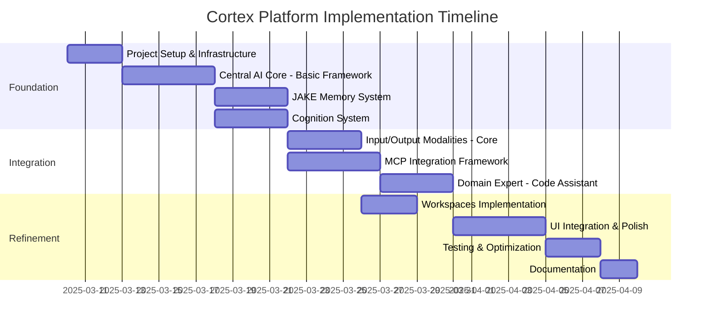

# Cortex Platform - Implementation Plan

## 1. Overview

This implementation plan outlines the approach, tasks, and timeline for developing the Cortex Platform based on the architecture defined in the unified architecture document. The plan focuses on creating a functional proof-of-concept (PoC) that demonstrates the core capabilities of the platform while establishing a foundation for future expansion.

## 2. Implementation Approach

The implementation will follow an incremental, component-based approach with continuous integration. This allows for testing individual components early and adapting as needed.



## 3. Component Implementation Details

### 3.1 Foundation Components

#### 3.1.1 Project Setup & Infrastructure

**Tasks:**

- Create repository structure and documentation
- Set up development environment with Docker compose
- Configure CI/CD pipeline for testing and deployment
- Establish coding standards and patterns

**Deliverables:**

- Project repository with documentation
- Docker compose configuration
- GitHub Actions workflow
- Code style guide and templates

#### 3.1.2 Central AI Core

**Tasks:**

- Implement FastAPI-based service structure
- Create message routing system
- Develop session management
- Implement basic LLM integration
- Set up standardized response formatting

**Deliverables:**

- Central AI Core service with REST API
- Message routing system
- Session management module
- LLM integration adapter
- API documentation

#### 3.1.3 JAKE Memory System

**Tasks:**

- Implement the LLM-driven whiteboard approach
- Create workspace-based memory organization
- Develop whiteboard update triggers
- Implement memory context retrieval
- Create memory persistence layer

**Sample Implementation:**

```python
# core/memory/jake.py
from datetime import datetime
import json
import os

class JAKEMemory:
    def __init__(self, llm_client, storage_path="./data/memory"):
        self.llm_client = llm_client
        self.storage_path = storage_path
        self.workspaces = {}

        # Create storage directory if it doesn't exist
        os.makedirs(storage_path, exist_ok=True)

        # Load any existing whiteboards
        self._load_whiteboards()

    def _load_whiteboards(self):
        """Load existing whiteboards from storage."""
        for filename in os.listdir(self.storage_path):
            if filename.endswith(".json"):
                workspace_id = filename.split(".")[0]
                filepath = os.path.join(self.storage_path, filename)
                try:
                    with open(filepath, "r") as f:
                        self.workspaces[workspace_id] = json.load(f)["whiteboard"]
                except Exception as e:
                    print(f"Error loading whiteboard for {workspace_id}: {e}")

    def _save_whiteboard(self, workspace_id):
        """Save a whiteboard to storage."""
        filepath = os.path.join(self.storage_path, f"{workspace_id}.json")
        with open(filepath, "w") as f:
            json.dump({
                "whiteboard": self.workspaces[workspace_id],
                "updated_at": datetime.now().isoformat()
            }, f)

    async def update_memory(self, workspace_id, recent_conversation):
        """Process recent conversation to update the whiteboard."""
        # Get current whiteboard (empty if none exists)
        current_whiteboard = self.workspaces.get(workspace_id, "")

        # Create system prompt for whiteboard synthesis
        system_prompt = """
        You are JAKE, a memory system that maintains a concise whiteboard of key information.
        Your task is to update the whiteboard with new information while maintaining clarity and relevance.
        - Focus on facts, insights, preferences, and important details
        - Organize related information together
        - Remove redundant or outdated information
        - Keep the whiteboard concise and well-structured
        """

        # Prepare the user message with current whiteboard and new conversation
        user_message = f"""
        CURRENT WHITEBOARD:
        {current_whiteboard}

        RECENT CONVERSATION:
        {recent_conversation}

        Please create an updated whiteboard that incorporates relevant new information.
        """

        # Call LLM to synthesize updated whiteboard
        response = await self.llm_client.complete(
            system=system_prompt,
            user=user_message,
            max_tokens=1000
        )

        # Update stored whiteboard
        updated_whiteboard = response.content
        self.workspaces[workspace_id] = updated_whiteboard

        # Persist the updated whiteboard
        self._save_whiteboard(workspace_id)

        return updated_whiteboard

    def get_memory_context(self, workspace_id):
        """Retrieve the current whiteboard for a workspace."""
        return self.workspaces.get(workspace_id, "")
```

**Deliverables:**

- JAKE Memory service with LLM integration
- Memory persistence layer
- Memory update trigger system
- Context retrieval API
- Memory management utility

#### 3.1.4 Cognition System

**Tasks:**

- Implement result handling from domain experts
- Create user state analysis functionality
- Develop decision-making for result surfacing
- Implement storage for delayed results
- Create retrieval triggers for stored results

**Sample Implementation:**

```python
# core/cognition/result_handler.py
from datetime import datetime, timedelta
import json

class ResultHandler:
    def __init__(self, llm_client, notification_service):
        self.llm_client = llm_client
        self.notification_service = notification_service
        self.pending_results = {}
        self.stored_results = {}

    async def handle_new_result(self, task_id, result, user_id, workspace_id):
        """Process a new result from a domain expert or long-running task."""
        user_state = self._get_current_user_state(user_id)

        # Determine what to do with the result
        decision = await self._make_surface_decision(result, user_state)

        # Apply the decision
        if decision["action"] == "immediate":
            # Send to appropriate channel immediately
            return await self._deliver_to_channel(
                result,
                user_id,
                decision["channel"],
                workspace_id
            )
        elif decision["action"] == "notification":
            # Send as notification
            return await self._send_notification(
                result,
                user_id,
                decision["priority"]
            )
        else:  # Store for later
            # Store with trigger conditions
            return self._store_with_triggers(
                result,
                user_id,
                workspace_id,
                decision["triggers"]
            )

    async def _make_surface_decision(self, result, user_state):
        """Use LLM to decide how to surface the result."""
        system_prompt = """
        You are a cognitive system deciding how to handle a task result.
        Based on the result content and user's current state, determine:
        1. What action to take: "immediate", "notification", or "store"
        2. If immediate, which channel to use
        3. If notification, what priority level
        4. If store, what trigger conditions should cause it to be surfaced later

        Respond in JSON format:
        {
            "action": "immediate|notification|store",
            "channel": "chat|dashboard|voice", # If action is immediate
            "priority": "high|medium|low",     # If action is notification
            "triggers": ["condition1", "condition2"]  # If action is store
        }
        """

        user_message = f"""
        RESULT CONTENT:
        {result}

        USER STATE:
        - Available channels: {", ".join(user_state["available_channels"])}
        - Current activity: {user_state["current_activity"]}
        - Conversation context: {user_state["conversation_context"]}
        - Last active: {user_state["last_active"]}

        Determine the most appropriate way to handle this result.
        """

        response = await self.llm_client.complete(
            system=system_prompt,
            user=user_message,
            response_format={"type": "json_object"}
        )

        # Parse the response (in a real implementation, add error handling)
        return json.loads(response.content)

    def _get_current_user_state(self, user_id):
        """Get the current state of the user."""
        # In a real implementation, this would query various systems
        # For the PoC, we'll return mock data
        return {
            "available_channels": ["chat", "notification"],
            "current_activity": "active_conversation",
            "conversation_context": "Discussing project implementation details",
            "last_active": datetime.now().isoformat()
        }

    async def _deliver_to_channel(self, result, user_id, channel, workspace_id):
        """Deliver the result to the specified channel."""
        # Implementation would connect to the channel's service
        # For the PoC, we'll just return the action
        return {
            "status": "delivered",
            "channel": channel,
            "workspace_id": workspace_id,
            "timestamp": datetime.now().isoformat()
        }

    async def _send_notification(self, result, user_id, priority):
        """Send the result as a notification."""
        notification = {
            "user_id": user_id,
            "title": f"{priority.capitalize()} Priority: Task Complete",
            "content": self._create_notification_summary(result),
            "priority": priority,
            "timestamp": datetime.now().isoformat()
        }

        # In a real implementation, this would call the notification service
        # await self.notification_service.send(notification)

        return {
            "status": "notification_sent",
            "notification": notification
        }

    def _store_with_triggers(self, result, user_id, workspace_id, triggers):
        """Store the result with triggers for later retrieval."""
        result_id = f"result_{datetime.now().timestamp()}"

        stored_item = {
            "id": result_id,
            "result": result,
            "user_id": user_id,
            "workspace_id": workspace_id,
            "triggers": triggers,
            "created_at": datetime.now().isoformat(),
            "surfaced": False
        }

        # In a real implementation, this would be stored in a database
        if user_id not in self.stored_results:
            self.stored_results[user_id] = {}

        self.stored_results[user_id][result_id] = stored_item

        return {
            "status": "stored",
            "result_id": result_id,
            "triggers": triggers
        }

    def _create_notification_summary(self, result):
        """Create a concise summary of the result for notifications."""
        # In a real implementation, this might use an LLM to summarize
        result_str = str(result)
        max_length = 100

        if len(result_str) > max_length:
            return result_str[:max_length] + "..."
        return result_str

    async def check_triggers(self, user_id, current_context):
        """Check if any stored results should be surfaced based on current context."""
        # This would be called periodically or on context changes
        if user_id not in self.stored_results:
            return []

        results_to_surface = []

        for result_id, stored_item in self.stored_results[user_id].items():
            if stored_item["surfaced"]:
                continue

            # Check if any triggers match the current context
            # In a real implementation, this would be more sophisticated
            for trigger in stored_item["triggers"]:
                if trigger.lower() in current_context.lower():
                    results_to_surface.append(stored_item)
                    self.stored_results[user_id][result_id]["surfaced"] = True
                    break

        return results_to_surface
```

**Deliverables:**

- Cognition service with result handling
- User state analyzer
- Surface decision maker
- Result storage manager
- Trigger evaluation system

### 3.2 Integration Components

#### 3.2.1 Input/Output Modalities

**Tasks:**

- Implement chat input/output handlers
- Create voice input processing (speech-to-text)
- Develop voice output generation (text-to-speech)
- Implement canvas input/output for visual interactions
- Create notification system for asynchronous alerts

**Deliverables:**

- Chat service with markdown support
- Voice processing service
- Canvas visualization service
- Notification service
- Shared UI components for frontend integration

#### 3.2.2 MCP Integration Framework

**Tasks:**

- Implement MCP client in Central AI Core
- Create MCP server management system
- Develop tool and resource discovery
- Implement request routing and response handling
- Create authentication and security layer

**Deliverables:**

- MCP client integration
- Server connection manager
- Tool and resource registry
- Request router
- Security layer for MCP connections

#### 3.2.3 Domain Expert - Code Assistant

**Tasks:**

- Create Code Assistant domain expert service
- Implement VS Code MCP server connection
- Develop code understanding capabilities
- Create code generation and modification features
- Implement context-aware code assistance

**Deliverables:**

- Code Assistant service
- VS Code MCP server integration
- Code understanding modules
- Code generation system
- Context manager for coding tasks

### 3.3 Refinement Components

#### 3.3.1 Workspaces Implementation

**Tasks:**

- Create workspace data structure
- Implement workspace management API
- Develop workspace persistence layer
- Implement workspace sharing and permissions
- Create workspace UI components

**Deliverables:**

- Workspace service
- Management API
- Persistence layer
- Sharing system
- UI components

#### 3.3.2 UI Integration & Polish

**Tasks:**

- Create unified UI shell
- Implement responsive design across components
- Develop consistent styling and interaction patterns
- Create cross-component navigation
- Implement user settings and preferences

**Deliverables:**

- Unified UI application
- Responsive design system
- Consistent component library
- Navigation system
- Settings manager

#### 3.3.3 Testing & Optimization

**Tasks:**

- Implement unit tests for core components
- Create integration tests for cross-component functionality
- Perform load testing and optimization
- Conduct usability testing
- Fix critical issues and performance bottlenecks

**Deliverables:**

- Test suite
- Performance benchmarks
- Usability feedback analysis
- Optimization report
- Issue tracking and resolution

#### 3.3.4 Documentation

**Tasks:**

- Create user documentation
- Develop API documentation
- Write developer guides
- Create setup and deployment instructions
- Prepare demo scenarios

**Deliverables:**

- User manual
- API reference
- Developer guides
- Deployment documentation
- Demo scenarios

## 4. Technical Implementation Details

### 4.1 Backend Services

Each backend service will be implemented as a separate microservice with the following common structure:

```
service-name/
├── Dockerfile
├── requirements.txt
├── app/
│   ├── __init__.py
│   ├── main.py          # FastAPI application
│   ├── config.py        # Configuration management
│   ├── models/          # Data models
│   ├── services/        # Business logic
│   ├── api/             # API routes
│   │   ├── __init__.py
│   │   ├── v1/          # API version 1
│   │   └── ...
│   └── utils/           # Utility functions
└── tests/               # Unit and integration tests
```

### 4.2 Frontend Applications

Frontend applications will share a common component library and will be structured as follows:

```
frontend/
├── package.json
├── vite.config.ts
├── tsconfig.json
├── index.html
├── src/
│   ├── main.tsx
│   ├── App.tsx
│   ├── components/      # Shared components
│   ├── hooks/           # Custom React hooks
│   ├── services/        # API clients
│   ├── store/           # State management
│   ├── utils/           # Utility functions
│   └── apps/            # Application-specific components
│       ├── chat/        # Chat application
│       ├── voice/       # Voice application
│       ├── canvas/      # Canvas application
│       └── ...
└── tests/               # Unit and integration tests
```

### 4.3 Docker Composition

Services will be orchestrated using Docker Compose:

```yaml
version: "3.8"

services:
  # Core services
  cortex-core:
    build: ./cortex-core
    ports:
      - "6000:6000"
    environment:
      - OPENAI_API_KEY=${OPENAI_API_KEY}
      - MEMORY_SERVICE_URL=http://cortex-memory:6001
      - COGNITION_SERVICE_URL=http://cortex-cognition:6002
    volumes:
      - ./cortex-core:/app
    command: uvicorn app.main:app --host 0.0.0.0 --port 6000 --reload

  cortex-memory:
    build: ./cortex-memory
    ports:
      - "6001:6001"
    volumes:
      - ./cortex-memory:/app
      - ./data/memory:/app/data/memory
    command: uvicorn app.main:app --host 0.0.0.0 --port 6001 --reload

  cortex-cognition:
    build: ./cortex-cognition
    ports:
      - "6002:6002"
    volumes:
      - ./cortex-cognition:/app
      - ./data/cognition:/app/data/cognition
    command: uvicorn app.main:app --host 0.0.0.0 --port 6002 --reload

  # Frontend applications
  cortex-frontend:
    build: ./frontend
    ports:
      - "5000:5000"
    volumes:
      - ./frontend:/app
    environment:
      - VITE_CORTEX_API_URL=http://localhost:6000
    command: npm run dev

  # Domain experts
  code-assistant:
    build: ./domain-experts/code-assistant
    ports:
      - "6010:6010"
    volumes:
      - ./domain-experts/code-assistant:/app
    command: uvicorn app.main:app --host 0.0.0.0 --port 6010 --reload
```

## 5. Development Workflow

### 5.1 Development Environment Setup

1. Clone repository: `git clone https://github.com/org/cortex-platform.git`
2. Navigate to the project directory: `cd cortex-platform`
3. Copy environment template: `cp .env.example .env`
4. Edit `.env` file to add required API keys and configuration
5. Start development environment: `docker-compose up`

### 5.2 Development Workflow

1. Create feature branch: `git checkout -b feature/component-name`
2. Implement changes and write tests
3. Run tests: `docker-compose run --rm backend pytest`
4. Submit pull request for review
5. After approval, merge to main branch

### 5.3 CI/CD Pipeline

1. Run linting and formatting checks
2. Build Docker images
3. Run unit and integration tests
4. Deploy to development environment for testing
5. On release, deploy to production environment

## 6. Testing Strategy

### 6.1 Unit Testing

- Test individual functions and classes
- Focus on core logic and edge cases
- Use pytest for backend and Jest for frontend
- Maintain high code coverage (target: 80%+)

### 6.2 Integration Testing

- Test interactions between components
- Focus on API contracts and message flows
- Use pytest for backend and Cypress for frontend
- Test realistic user scenarios

### 6.3 End-to-End Testing

- Test complete user flows
- Focus on critical paths and user experience
- Use Playwright for automated browser testing
- Include voice and visual interaction testing

## 7. Deployment Strategy

### 7.1 Development Environment

- Docker Compose for local development
- Hot reloading for both frontend and backend
- Local storage for development data

### 7.2 Staging Environment

- Kubernetes deployment on Azure
- CI/CD pipeline for automated deployment
- Containerized services with managed dependencies
- Monitoring and logging for testing

### 7.3 Production Environment

- Kubernetes deployment on Azure
- Blue/green deployment for zero downtime
- Automated scaling based on load
- Comprehensive monitoring and alerting
- Regular backup and disaster recovery

## 8. Risk Management

### 8.1 Technical Risks

| Risk                     | Mitigation                                                   |
| ------------------------ | ------------------------------------------------------------ |
| LLM API reliability      | Implement retry logic and fallback providers                 |
| Voice processing latency | Optimize streaming and implement client-side processing      |
| Integration complexity   | Focus on well-defined interfaces and incremental integration |
| Performance at scale     | Regular load testing and optimization                        |

### 8.2 Project Risks

| Risk                 | Mitigation                                           |
| -------------------- | ---------------------------------------------------- |
| Scope creep          | Clearly defined MVP with prioritized feature backlog |
| Dependency delays    | Identify critical path and prepare alternatives      |
| Resource constraints | Modular architecture allowing parallel work          |
| Technical debt       | Regular refactoring and code quality metrics         |

## 9. Implementation Timeline

### Phase 1: Foundation (Weeks 1-2)

- Set up project infrastructure
- Implement core services (Central AI, Memory, Cognition)
- Create basic API structure
- Establish development workflow

### Phase 2: Integration (Weeks 3-4)

- Implement input/output modalities
- Create MCP integration
- Develop first domain expert
- Implement workspace structure

### Phase 3: Refinement (Weeks 5-6)

- Create unified UI
- Integrate all components
- Optimize performance
- Complete documentation
- Prepare for release

## 10. Next Steps

1. Finalize architecture document with stakeholder feedback
2. Set up development environment and repository
3. Create initial project structure and component skeletons
4. Begin implementation of foundation components
5. Schedule regular progress reviews and demos
