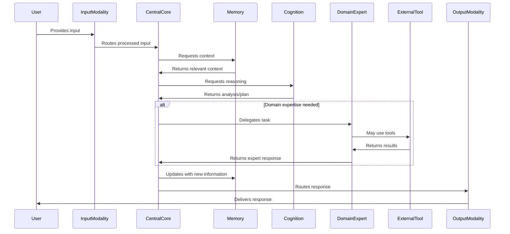
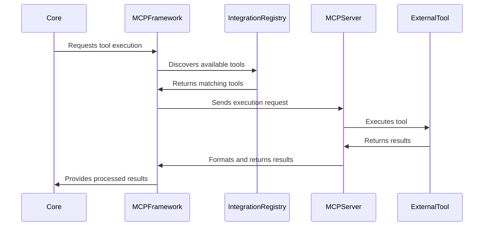

# Cortex Platform: System Architecture Overview

_Version: 1.0_  
_Date: 2025-03-04_

## Introduction

This document provides a comprehensive overview of the Cortex Platform's architecture, describing the major components, their interactions, and the architectural principles that guide the system's design. The architecture is designed to support Cortex's vision of a unified intelligence ecosystem that seamlessly spans all digital contexts.

## Architectural Principles

The Cortex architecture is guided by the following core principles:

### 1. Unified Intelligence

- Centralized orchestration of intelligence across all contexts
- Synthesized memory that spans all interactions
- Consistent reasoning and personality regardless of entry point

### 2. Modular Design

- Clearly defined component boundaries and interfaces
- Independent evolution of individual components
- Ability to replace components without system-wide changes

### 3. Extensible Framework

- Standardized integration protocols
- Discovery mechanisms for tools and resources
- Pluggable domain experts and I/O modalities

### 4. Scalable Architecture

- Independent scaling of individual components
- Stateless design where possible
- Efficient resource utilization

### 5. Resilient Operation

- Graceful degradation under stress
- Fault isolation between components
- Self-healing capabilities

## High-Level Architecture

The Cortex Platform architecture consists of the following major components:

```mermaid
graph TD
    A[Central AI Core] --> B[Memory System]
    A --> C[Cognition System]
    A --> D[Task Orchestration]
    A --> E[Multi-Modal I/O]
    A --> F[Domain Experts]
    A --> G[External Integrations]

    B --> B1[JAKE Memory]
    B --> B2[Context Synthesis]
    B --> B3[Memory Persistence]

    C --> C1[Reasoning Engine]
    C --> C2[Planning Framework]
    C --> C3[Self-Reflection]

    D --> D1[Task Decomposition]
    D --> D2[Expert Delegation]
    D --> D3[Progress Tracking]

    E --> E1[Input Handlers]
    E --> E2[Output Generators]
    E --> E3[Modality Selection]

    F --> F1[Code Assistant]
    F --> F2[Deep Research]
    F --> F3[Other Domain Experts]

    G --> G1[MCP Framework]
    G --> G2[Integration Registry]
    G --> G3[External Tool Access]
```

### Architectural Overview

At the center of the Cortex architecture is the **Central AI Core**, which coordinates all platform capabilities while maintaining a unified context and consistent user experience. This core orchestrates interactions between the memory system, cognition functions, domain experts, I/O modalities, and external integrations.

The architecture utilizes the **MCP (Memory, Cognition, and Perception) Protocol** as its integration standard, providing a consistent framework for connecting components and external tools. This protocol-driven approach enables the modular, extensible nature of the system while maintaining coherence.

## Key Components

### Central AI Core

The Central AI Core is the orchestration engine of the Cortex Platform, responsible for:

- Coordinating interactions between all system components
- Maintaining overall session and conversation context
- Routing tasks to appropriate domain experts
- Managing multi-modal input/output selection
- Handling authentication and authorization
- Preserving system coherence across all touchpoints

The Core exposes a REST API for external access and uses internal event-driven communication for component interactions.

### Memory System

The Memory System provides unified context across all interactions:

#### JAKE (Just Another Knowledge Engine)

- Long-term memory storage and retrieval
- Memory vectorization and semantic search
- Memory synthesis and contextualization
- Memory segmentation and prioritization

#### Context Management

- Active context maintenance
- Context switching and blending
- Cross-session context preservation
- Context relevance assessment

#### Memory Persistence

- Durable storage of interaction history
- Memory backup and restoration
- Privacy-preserving memory management
- Memory lifecycle policies

### Cognition System

The Cognition System provides the reasoning capabilities of the platform:

#### Reasoning Engine

- Logical inference and deduction
- Uncertainty handling
- Consistency maintenance
- Contradiction detection

#### Planning Framework

- Task decomposition
- Strategy formulation
- Resource allocation
- Plan adaptation

#### Self-Reflection

- Output quality assessment
- Reasoning process evaluation
- Improvement identification
- Metacognition

### Multi-Modal I/O

The Multi-Modal I/O system handles diverse interaction modalities:

#### Input Handlers

- Text/chat processing
- Voice recognition and processing
- Canvas/visual input interpretation
- Multi-modal input fusion

#### Output Generators

- Text/chat generation
- Voice synthesis
- Visual/canvas output
- Dashboard visualization

#### Modality Selection

- Context-based modality recommendations
- Device capability assessment
- Environmental awareness
- User preference learning

### Domain Experts

Domain Experts are specialized modules for specific capability areas:

#### Expert Framework

- Standard interfaces for expert integration
- Autonomous operation capabilities
- Self-directed information gathering
- Quality assessment and refinement

#### Core Experts

- Code Assistant: Software development expertise
- Deep Research: Information gathering and synthesis
- Additional experts for specialized domains

### External Integrations

The integration system connects Cortex to external tools and services:

#### MCP Framework

- Standardized protocol for tool integration
- Resource access and description
- Message formatting and routing
- Transport agnosticism

#### Integration Registry

- Tool and resource discovery
- Capability advertisement
- Access control and permissions
- Usage tracking and analytics

#### External Access

- Tool execution and monitoring
- Result processing and transformation
- Error handling and recovery
- Resource lifecycle management

## Data Flows

### Primary Interaction Flow

1. User input is received through an input modality
2. Input is processed and routed to the Central AI Core
3. Core consults memory system for relevant context
4. Cognition system reasons about the input and context
5. Tasks may be delegated to domain experts or external tools
6. Results are synthesized and formatted for output
7. Appropriate output modality is selected and used
8. Interaction is recorded in memory for future context

### Tool Execution Flow

1. Core identifies need for external tool execution
2. MCP framework identifies appropriate tool
3. Tool execution request is formatted and sent
4. External tool processes the request
5. Results are returned to the requesting component
6. Results are processed and incorporated into response
7. Tool usage is recorded in memory

## Component Interfaces

### Central AI Core API

The Central AI Core exposes a RESTful API that includes:

- `/conversation` - Manage conversations and messages
- `/memory` - Access and manage memory
- `/experts` - Interact with domain experts
- `/tools` - Execute external tools
- `/workspaces` - Manage workspace contexts

### MCP Protocol

The MCP Protocol provides a standardized framework for integration:

- Tool definition and discovery
- Resource access and management
- Message formatting and routing
- Error handling and reporting
- Authentication and authorization

### Domain Expert Interface

Domain experts implement a standard interface that includes:

- Task acceptance and planning
- Autonomous execution
- Progress reporting
- Result generation
- Quality assessment

## Deployment Architecture

The Cortex Platform supports multiple deployment models:

### Cloud Deployment

- Microservices architecture
- Container orchestration (Kubernetes)
- Auto-scaling capabilities
- Multi-region deployment options

### Edge Deployment

- Optimized components for edge execution
- Reduced footprint implementations
- Local processing capabilities
- Intermittent connectivity support

### Hybrid Deployment

- Flexible component distribution
- Data sovereignty controls
- Performance optimization
- Resource optimization

## Security Architecture

The security architecture addresses:

### Authentication and Authorization

- Identity management
- Role-based access control
- Fine-grained permissions
- OAuth/OIDC integration

### Data Protection

- Encryption in transit and at rest
- Privacy-preserving memory management
- Data minimization techniques
- Secure data lifecycle management

### Secure Integration

- Integration authentication
- Tool permission scoping
- Secure communication channels
- Resource access controls

## Scalability Considerations

The architecture supports scalability through:

- Stateless design of key components
- Independent scaling of component groups
- Caching strategies for performance optimization
- Asynchronous processing where appropriate
- Resource pooling and optimization

## High Availability Design

High availability is achieved through:

- Component redundancy
- Geographic distribution
- Fault isolation boundaries
- Graceful degradation strategies
- Self-healing capabilities

## Conclusion

The Cortex Platform architecture provides a robust, extensible foundation for realizing the vision of a unified intelligence ecosystem. Its modular design enables independent evolution of components while the centralized orchestration ensures a coherent, consistent experience across all touchpoints.

The MCP Protocol establishes a standard framework for integration, enabling a vibrant ecosystem of domain experts, tool integrations, and modality innovations. Meanwhile, the Central AI Core maintains the unified experience that distinguishes Cortex from conventional, siloed AI assistants.

This architecture balances innovation velocity with system coherence, enabling the platform to continuously evolve while maintaining the unified intelligence experience that is Cortex's core value proposition.
