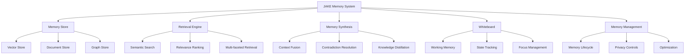
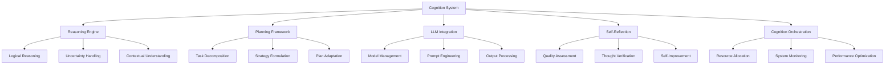
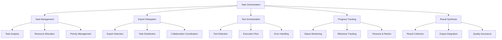

```mermaid
graph TD
    A[Central AI Core] --> B[Core API]
    A --> C[Session Manager]
    A --> D[Dispatcher]
    A --> E[Context Manager]
    A --> F[Integration Hub]
    A --> G[Security Manager]

    B --> B1[REST Endpoints]
    B --> B2[WebSocket Connections]
    B --> B3[API Authentication]

    C --> C1[User Session Tracking]
    C --> C2[Session State Persistence]
    C --> C3[Multi-device Sessions]

    D --> D1[Request Router]
    D --> D2[Response Synthesizer]
    D --> D3[Event Coordinator]

    E --> E1[Active Context Maintenance]
    E --> E2[Context Switching]
    E --> E3[Context Persistence]

    F --> F1[Component Registry]
    F --> F2[Event Bus]
    F --> F3[Integration Manager]

    G --> G1[Authentication]
    G --> G2[Authorization]
    G --> G3[Audit Logging]
```

# Cortex Platform: Core Components

_Version: 1.0_  
_Date: 2025-03-04_

## Introduction

This document provides detailed specifications for the core components of the Cortex Platform. These components form the foundation of the system, enabling the unified intelligence experience that is central to Cortex's value proposition.

The core components include the Central AI Core, the memory system (JAKE), the cognition system, and the task orchestration framework. Together, these components create a cohesive intelligence layer that spans all user interactions while maintaining context, consistency, and continuity.

## Central AI Core

The Central AI Core serves as the orchestration engine for the entire Cortex Platform, coordinating interactions between all system components and ensuring a coherent user experience.

### Architecture

### Key Subsystems

#### Core API

The Core API provides external access to the Cortex Platform:

- **REST API**: HTTP endpoints for synchronous operations

  - `/conversation`: Conversation management and messaging
  - `/memory`: Access and manipulate memory
  - `/experts`: Interact with domain experts
  - `/tools`: Access external tools and resources
  - `/system`: System configuration and status

- **WebSocket API**: Real-time communication channels

  - Stream-based conversation
  - Event notifications
  - Progress updates
  - Status changes

- **API Authentication**: Security for external access
  - OAuth 2.0/OIDC integration
  - API key management
  - Rate limiting
  - Usage monitoring

#### Session Manager

The Session Manager tracks and maintains user sessions:

- **User Session Tracking**: Manage active user sessions

  - Session creation and termination
  - Session metadata management
  - Activity tracking
  - Timeout handling

- **Session State Persistence**: Preserve session state

  - State serialization and deserialization
  - Persistent storage
  - State recovery
  - Consistency guarantees

- **Multi-device Sessions**: Support cross-device continuity
  - Device registration and mapping
  - State synchronization
  - Conflict resolution
  - Seamless transitions

#### Dispatcher

The Dispatcher coordinates the flow of information:

- **Request Router**: Direct incoming requests

  - Component selection
  - Priority determination
  - Load balancing
  - Timeout management

- **Response Synthesizer**: Combine component outputs

  - Result aggregation
  - Conflict resolution
  - Format transformation
  - Coherence enforcement

- **Event Coordinator**: Manage internal events
  - Event publication
  - Subscription management
  - Event prioritization
  - Event correlation

#### Context Manager

The Context Manager maintains conversation and task context:

- **Active Context Maintenance**: Track current context

  - Context updating
  - Scope management
  - Relevance assessment
  - Priority management

- **Context Switching**: Handle transitions between contexts

  - Graceful transitions
  - Context boundary detection
  - State preservation
  - Cross-context references

- **Context Persistence**: Long-term context management
  - Context serialization
  - Storage optimization
  - Retrieval strategies
  - Archiving policies

#### Integration Hub

The Integration Hub connects all platform components:

- **Component Registry**: Track available components

  - Component discovery
  - Capability advertisement
  - Health monitoring
  - Version management

- **Event Bus**: Internal communication framework

  - Message routing
  - Delivery guarantees
  - Topic management
  - Scalable distribution

- **Integration Manager**: Handle external integration
  - Integration lifecycle
  - Configuration management
  - Status monitoring
  - Troubleshooting support

#### Security Manager

The Security Manager enforces platform security:

- **Authentication**: Verify identity

  - Multiple authentication methods
  - Identity provider integration
  - Session management
  - Token handling

- **Authorization**: Control access

  - Role-based access control
  - Permission management
  - Context-based authorization
  - Resource protection

- **Audit Logging**: Track security events
  - Comprehensive event logging
  - Log integrity
  - Anomaly detection
  - Compliance reporting

### Implementation Considerations

- **Language and Framework**: The Core is implemented in Python using FastAPI for high performance and asynchronous capabilities
- **Scalability**: Stateless design enables horizontal scaling
- **Persistence**: Redis is used for session state and context caching
- **Communication**: gRPC for internal component communication
- **Deployment**: Containerized deployment with Kubernetes orchestration

## JAKE Memory System

The JAKE (Just Another Knowledge Engine) Memory System provides unified memory management across all interactions, enabling contextual awareness and continuity.

### Architecture

### Key Subsystems

#### Memory Store

The Memory Store provides persistent storage for different memory types:

- **Vector Store**: Semantic embedding storage

  - Embedding generation and storage
  - Nearest-neighbor search
  - Clustering capabilities
  - Dimension reduction

- **Document Store**: Structured document storage

  - Full text indexing
  - Metadata management
  - Revision history
  - Document relations

- **Graph Store**: Relationship mapping
  - Entity relationship storage
  - Graph traversal
  - Pattern matching
  - Knowledge graph construction

#### Retrieval Engine

The Retrieval Engine provides access to stored memory:

- **Semantic Search**: Find related memories

  - Embedding-based search
  - Hybrid search strategies
  - Query reformulation
  - Context-aware ranking

- **Relevance Ranking**: Prioritize memory items

  - Multi-factor ranking
  - Temporal relevance
  - Contextual importance
  - User feedback incorporation

- **Multi-faceted Retrieval**: Access across memory types
  - Cross-store retrieval
  - Result aggregation
  - Diverse retrieval strategies
  - Adaptive retrieval depth

#### Memory Synthesis

Memory Synthesis combines and processes memory:

- **Context Fusion**: Merge relevant memories

  - Information integration
  - Redundancy elimination
  - Narrative construction
  - Perspective alignment

- **Contradiction Resolution**: Handle conflicting information

  - Inconsistency detection
  - Confidence assessment
  - Timeline analysis
  - Resolution strategies

- **Knowledge Distillation**: Extract insights
  - Pattern identification
  - Summarization
  - Insight extraction
  - Knowledge structuring

#### Whiteboard

The Whiteboard maintains active working memory:

- **Working Memory**: Track current state

  - Active information tracking
  - Short-term storage
  - Accessibility management
  - State transitions

- **State Tracking**: Monitor conversation state

  - Conversation flow tracking
  - Topic management
  - Intent tracking
  - Goal monitoring

- **Focus Management**: Control attention
  - Priority determination
  - Attention shifting
  - Distraction filtering
  - Concentration maintenance

#### Memory Management

Memory Management controls overall memory health:

- **Memory Lifecycle**: Manage memory longevity

  - Importance assessment
  - Aging strategies
  - Archiving policies
  - Forgetting mechanisms

- **Privacy Controls**: Protect sensitive information

  - Privacy filtering
  - Data minimization
  - Retention policies
  - Deletion management

- **Optimization**: Ensure performance
  - Storage optimization
  - Index management
  - Query optimization
  - Performance monitoring

### Implementation Considerations

- **Vector Storage**: Pinecone for high-performance vector search
- **Document Storage**: MongoDB for flexible document storage
- **Graph Database**: Neo4j for relationship mapping
- **Embedding Models**: Sentence transformers for embedding generation
- **Caching Strategy**: Multi-level caching with Redis for hot data

## Cognition System

The Cognition System provides the reasoning and intelligence capabilities of the platform, enabling sophisticated understanding and decision-making.

### Architecture

### Key Subsystems

#### Reasoning Engine

The Reasoning Engine performs analysis and inference:

- **Logical Reasoning**: Apply formal reasoning

  - Deductive reasoning
  - Inductive reasoning
  - Abductive reasoning
  - Analogical reasoning

- **Uncertainty Handling**: Manage probabilistic reasoning

  - Confidence assessment
  - Probability estimation
  - Uncertainty propagation
  - Risk analysis

- **Contextual Understanding**: Interpret in context
  - Contextual disambiguation
  - Implicit information inference
  - Pragmatic understanding
  - Cultural/domain awareness

#### Planning Framework

The Planning Framework guides task execution:

- **Task Decomposition**: Break down complex tasks

  - Goal identification
  - Subtask identification
  - Dependency mapping
  - Resource assessment

- **Strategy Formulation**: Develop execution approaches

  - Method selection
  - Approach optimization
  - Alternative strategy preparation
  - Success criteria definition

- **Plan Adaptation**: Adjust based on feedback
  - Progress monitoring
  - Obstacle detection
  - Strategy revision
  - Dynamic replanning

#### LLM Integration

LLM Integration leverages language models:

- **Model Management**: Handle LLM interactions

  - Model selection
  - Context preparation
  - Parameter optimization
  - Response management

- **Prompt Engineering**: Optimize LLM inputs

  - Prompt templating
  - Chain-of-thought construction
  - Instruction optimization
  - Few-shot example management

- **Output Processing**: Handle LLM outputs
  - Response parsing
  - Format transformation
  - Quality validation
  - Error correction

#### Self-Reflection

Self-Reflection enables system improvement:

- **Quality Assessment**: Evaluate outputs

  - Coherence evaluation
  - Accuracy assessment
  - Usefulness measurement
  - Style appropriateness

- **Thought Verification**: Check reasoning

  - Logic validation
  - Fact verification
  - Assumption examination
  - Conclusion testing

- **Self-Improvement**: Learn from experience
  - Performance analysis
  - Pattern identification
  - Approach refinement
  - Knowledge updating

#### Cognition Orchestration

Cognition Orchestration manages overall functioning:

- **Resource Allocation**: Optimize resource usage

  - Processing prioritization
  - Computational resource management
  - Cost awareness
  - Efficiency optimization

- **System Monitoring**: Track performance

  - Quality metrics tracking
  - Response time monitoring
  - Error detection
  - Pattern analysis

- **Performance Optimization**: Enhance capabilities
  - Caching strategies
  - Parallel processing
  - Model optimization
  - Continuous improvement

### Implementation Considerations

- **LLM Integration**: Support for OpenAI, Anthropic, and open models
- **Reasoning Framework**: Hybrid approach combining symbolic and neural methods
- **Planning System**: Goal-oriented hierarchical planning
- **Performance Optimization**: Caching of common reasoning patterns
- **Self-Improvement**: Feedback loop with usage analytics

## Task Orchestration

The Task Orchestration system coordinates complex task execution across multiple components, ensuring coherent, efficient completion of user requests.

### Architecture

### Key Subsystems

#### Task Management

Task Management oversees overall task execution:

- **Task Analysis**: Understand the task requirements

  - Goal identification
  - Constraint recognition
  - Complexity assessment
  - Prerequisite identification

- **Resource Allocation**: Assign appropriate resources

  - Capability matching
  - Load balancing
  - Priority-based allocation
  - Dynamic adjustment

- **Priority Management**: Handle multiple tasks
  - Urgency assessment
  - Importance evaluation
  - Dependency management
  - Queue optimization

#### Expert Delegation

Expert Delegation coordinates domain experts:

- **Expert Selection**: Choose appropriate experts

  - Domain matching
  - Capability assessment
  - Availability checking
  - Performance history

- **Task Distribution**: Assign tasks to experts

  - Task specification
  - Context provision
  - Instruction clarity
  - Constraint communication

- **Collaboration Coordination**: Manage multi-expert tasks
  - Expert interaction
  - Information sharing
  - Conflict resolution
  - Collaborative planning

#### Tool Orchestration

Tool Orchestration manages external tool usage:

- **Tool Selection**: Identify needed tools

  - Capability matching
  - Availability verification
  - Performance consideration
  - Access validation

- **Execution Flow**: Manage tool execution sequence

  - Operation ordering
  - Parameter preparation
  - Result handling
  - Flow adaptation

- **Error Handling**: Manage execution issues
  - Error detection
  - Retry strategies
  - Alternative approaches
  - Graceful degradation

#### Progress Tracking

Progress Tracking monitors task execution:

- **Status Monitoring**: Track current state

  - Real-time status updates
  - Progress indicators
  - Blockers identification
  - Health monitoring

- **Milestone Tracking**: Monitor key achievements

  - Milestone definition
  - Completion verification
  - Timeline comparison
  - Dependency updating

- **Timeouts & Retries**: Handle execution issues
  - Timeout management
  - Retry policies
  - Escalation procedures
  - Abort conditions

#### Result Synthesis

Result Synthesis combines outputs into coherent results:

- **Result Collection**: Gather component outputs

  - Output aggregation
  - Completeness verification
  - Format standardization
  - Metadata collection

- **Output Integration**: Combine multiple results

  - Result merging
  - Conflict resolution
  - Narrative construction
  - Context incorporation

- **Quality Assurance**: Verify final output
  - Quality checking
  - Consistency verification
  - Completeness assessment
  - User expectation alignment

### Implementation Considerations

- **Workflow Engine**: Temporal for reliable workflow orchestration
- **State Management**: Redis for distributed state tracking
- **Event System**: Kafka for reliable event distribution
- **Monitoring**: Prometheus and Grafana for performance tracking
- **Scalability**: Stateless design for horizontal scaling

## Communication and Integration

### Internal Communication

Components interact through:

- **Event Bus**: Asynchronous event-based communication
- **Direct API Calls**: Synchronous service-to-service communication
- **Shared State**: Distributed state management for coordination

### External Integration

External systems connect through:

- **Core API**: REST and WebSocket endpoints
- **MCP Protocol**: Standardized integration protocol
- **Webhook Support**: Event notifications to external systems

## Operational Considerations

### Performance

- **Response Time**: Target < 1s for simple queries, < 5s for complex operations
- **Throughput**: Support for 1000+ requests per minute per instance
- **Latency**: Minimize end-to-end latency through optimization

### Scalability

- **Horizontal Scaling**: All components designed for horizontal scaling
- **Load Distribution**: Intelligent load balancing across instances
- **Resource Efficiency**: Optimization for cost-effective scaling

### Reliability

- **Fault Tolerance**: Graceful handling of component failures
- **High Availability**: Redundancy for critical components
- **Data Durability**: Reliable persistence of critical data

## Conclusion

The core components of the Cortex Platform work together to create a unified, intelligent experience that spans all user interactions. The Central AI Core coordinates the overall system, while the JAKE Memory System provides cohesive context across interactions. The Cognition System enables sophisticated reasoning and understanding, and the Task Orchestration system ensures efficient execution of complex tasks.

These components embody the architectural principles of unified intelligence, modular design, extensible framework, scalable architecture, and resilient operation. Together, they form the foundation upon which the Cortex Platform's value proposition is built—a truly unified intelligence layer that seamlessly bridges all digital contexts.

Future enhancements to these core components will focus on improving reasoning capabilities, enhancing memory synthesis, optimizing performance, and expanding the range of supported integration patterns—all while maintaining the fundamental unification that distinguishes Cortex from conventional AI assistants.
