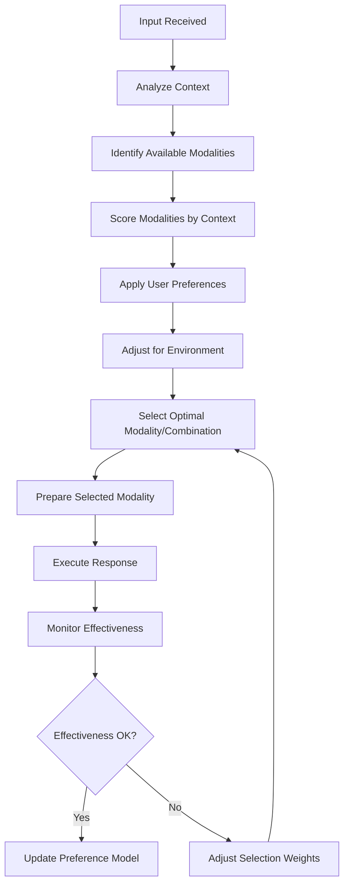
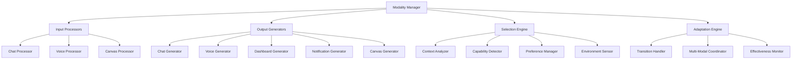

# Cortex Platform: Input/Output Modalities

_Version: 1.0_  
_Date: 2025-03-04_

## Introduction

This document details the multi-modal input and output capabilities of the Cortex Platform. The platform's ability to seamlessly handle various interaction modalities is a key differentiator, enabling context-appropriate communication across different devices and environments.

Cortex's adaptive multi-modal design allows users to interact in the most natural way for their current context while maintaining conversation continuity across modality transitions. This document describes the supported modalities, their implementation, and the intelligence that governs modality selection and adaptation.

## Modality Framework Overview

The Cortex Platform implements a flexible framework for managing diverse interaction modalities:

```mermaid
graph TD
    A[Modality Framework] --> B[Input Modalities]
    A --> C[Output Modalities]
    A --> D[Modality Selection]
    A --> E[Modality Synthesis]
    A --> F[Context Adaptation]

    B --> B1[Chat Input]
    B --> B2[Voice Input]
    B --> B3[Canvas Input]

    C --> C1[Chat Output]
    C --> C2[Voice Output]
    C --> C3[Dashboard Output]
    C --> C4[Notification Output]
    C --> C5[Canvas Output]

    D --> D1[Context Analysis]
    D --> D2[Device Capabilities]
    D --> D3[User Preferences]
    D --> D4[Environmental Factors]

    E --> E1[Multi-Modal Fusion]
    E --> E2[Cross-Modal Mapping]
    E --> E3[Complementary Output]

    F --> F1[Continuity Preservation]
    F --> F2[Transition Management]
    F --> F3[Context Transfer]
```



## Input Modalities

### Chat Input

Chat provides text-based interaction with the platform, supporting rich formatting and embedded content.

#### Features

- **Rich Text Support**: Markdown formatting for structured content
- **Code Block Handling**: Syntax highlighting and code-specific formatting
- **Inline Content References**: Links, mentions, and references
- **File Attachments**: Document and media handling
- **Message Threading**: Hierarchical conversation structure

#### Implementation

- **Frontend Processing**: Client-side parsing and rendering
- **Real-time Features**: Typing indicators and read receipts
- **Message Chunking**: Handling of large messages
- **Offline Support**: Message queuing during connectivity issues
- **History Management**: Scrollback and search capabilities

#### Integration Points

- **Core API**: `/conversation` endpoints for message handling
- **WebSocket API**: Real-time message streaming
- **Event System**: Message-related event notifications
- **Storage**: Message persistence and indexing

### Voice Input

Voice input enables spoken language interaction with the platform, supporting natural conversation patterns.

#### Features

- **Continuous Listening**: Option for ambient listening mode
- **Wake Word Detection**: Configurable activation phrases
- **Interruption Handling**: Graceful management of mid-stream interruptions
- **Speaker Identification**: Optional voice recognition for personalization
- **Noise Resilience**: Performance in challenging acoustic environments

#### Implementation

- **Speech Recognition Pipeline**:

  1. Audio capture and preprocessing
  2. Voice activity detection
  3. Wake word recognition (when enabled)
  4. Speech-to-text processing
  5. Natural language understanding

- **Recognition Modes**:

  - Cloud-based processing for accuracy
  - Edge processing for privacy and latency
  - Hybrid approaches for resilience

- **Adaptation Capabilities**:
  - Speaker adaptation for improved accuracy
  - Environment adaptation for noise handling
  - Domain adaptation for specialized vocabulary

#### Integration Points

- **Audio Processing**: Integration with device audio systems
- **Recognition Services**: Cloud and edge speech recognition
- **Natural Language Processing**: Intent and entity extraction
- **Context Management**: Conversation state tracking
- **Audio Event Handling**: Management of audio-specific events

### Canvas Input

Canvas input enables visual and spatial interaction through drawings, diagrams, and annotations.

#### Features

- **Freeform Drawing**: Sketch and handwriting capabilities
- **Shape Recognition**: Automatic recognition of common shapes
- **Annotation**: Marking up existing content
- **Gesture Support**: Multi-touch gesture recognition
- **Collaborative Canvas**: Shared drawing spaces

#### Implementation

- **Input Capture**:

  - Stroke collection and normalization
  - Pressure and tilt sensitivity (when available)
  - Multi-touch management
  - Input device adaptation

- **Visual Processing**:

  - Stroke normalization
  - Shape recognition
  - Handwriting recognition
  - Diagram interpretation
  - Visual structure analysis

- **Semantic Extraction**:
  - Meaning extraction from visual elements
  - Spatial relationship analysis
  - Content classification and organization
  - Context-aware interpretation

#### Integration Points

- **Visual Processing Services**: Shape and handwriting recognition
- **Content Management**: Storage and retrieval of canvas content
- **Collaboration System**: Real-time multi-user canvas sharing
- **Memory System**: Integration with overall context understanding

## Output Modalities

### Chat Output

Chat output provides text-based responses with rich formatting capabilities.

#### Features

- **Structured Formatting**: Markdown, tables, and lists
- **Code Formatting**: Syntax highlighting for multiple languages
- **Inline Media**: Embedded images, charts, and links
- **Progressive Disclosure**: Collapsible sections and details
- **Adaptive Length**: Adjustable verbosity based on context

#### Implementation

- **Content Generation**:

  - Template-based generation
  - Dynamic formatting based on content type
  - Context-appropriate styling
  - Length optimization

- **Rendering Pipeline**:

  - Markdown processing
  - Layout optimization
  - Responsive design adaptation
  - Accessibility enhancements

- **Interaction Capabilities**:
  - Inline action elements
  - Interactive components
  - Update and refresh mechanisms
  - Reference linking

#### Integration Points

- **Core API**: Response formatting specification
- **Frontend Rendering**: Client-side display components
- **Content Repository**: Reusable content fragments
- **Template System**: Response templates and patterns

### Voice Output

Voice output enables spoken responses with natural prosody and expression.

#### Features

- **Natural Prosody**: Human-like intonation and rhythm
- **Voice Customization**: Selectable voice characteristics
- **Emotional Expression**: Context-appropriate tone and emotion
- **Pronunciation Control**: Domain-specific pronunciation rules
- **Speed Adaptation**: Context-based speaking rate adjustments

#### Implementation

- **Text Processing**:

  - Text normalization
  - Pronunciation mapping
  - Prosody markup
  - Emphasis identification

- **Speech Synthesis**:

  - Neural TTS generation
  - Voice selection and customization
  - Emotional mapping
  - Audio post-processing

- **Delivery Control**:
  - Timing and pacing management
  - Interruption handling
  - Background adaptation
  - Continuity management

#### Integration Points

- **TTS Services**: Cloud and edge speech synthesis
- **Audio System**: Device audio output management
- **Context System**: Conversation state for appropriate continuity
- **User Preferences**: Voice and delivery customization

### Dashboard Output

Dashboard output provides structured, visual representations of information for at-a-glance understanding.

#### Features

- **Data Visualization**: Charts, graphs, and data displays
- **Status Indicators**: Visual status representations
- **Action Centers**: Grouped action opportunities
- **Information Hierarchy**: Organized information presentation
- **Personalization**: User-specific dashboard configuration

#### Implementation

- **Layout Engine**:

  - Responsive grid system
  - Component placement optimization
  - Priority-based organization
  - Screen size adaptation

- **Visualization Components**:

  - Chart and graph generation
  - Data transformation pipelines
  - Theming and styling
  - Interactive elements

- **Dashboard Management**:
  - Configuration persistence
  - User customization
  - State synchronization
  - Update mechanisms

#### Integration Points

- **Visualization Libraries**: Chart and graph generation
- **Data Sources**: Integration with various information sources
- **User Preferences**: Dashboard configuration storage
- **Event System**: Real-time dashboard updates

### Notification Output

Notification output provides timely alerts and updates through system notification mechanisms.

#### Features

- **Priority Levels**: Urgency-based notification categorization
- **Rich Content**: Structured notification content
- **Action Buttons**: Direct action from notifications
- **Delivery Timing**: Context-aware notification scheduling
- **Channel Selection**: Appropriate notification channel selection

#### Implementation

- **Notification Generation**:

  - Content formatting
  - Priority determination
  - Actionable element inclusion
  - Delivery timing optimization

- **Channel Management**:

  - Platform notification systems
  - Email notifications
  - SMS/messaging service integration
  - In-app notification center
  - Push notification services

- **User Preference Integration**:
  - Do-not-disturb handling
  - Channel preferences
  - Content filtering
  - Grouping and batching

#### Integration Points

- **Notification Services**: Platform notification APIs
- **Push Services**: Mobile push notification delivery
- **Email Systems**: Email notification delivery
- **User Preferences**: Notification settings management

### Canvas Output

Canvas output provides visual, spatial representations for complex information and creative content.

#### Features

- **Diagram Generation**: Automatic diagram creation
- **Spatial Organization**: Information arranged spatially
- **Visual Synthesis**: Information visualization
- **Annotation**: Visual highlighting and notes
- **Progressive Construction**: Step-by-step visual building

#### Implementation

- **Content Generation**:

  - Layout algorithms
  - Visual structure creation
  - Diagram type selection
  - Style application

- **Rendering Pipeline**:

  - Vector graphics generation
  - Animation planning
  - Visual hierarchy implementation
  - Responsive scaling

- **Interaction Layer**:
  - Interactive elements
  - Zoom and pan capabilities
  - Selection and manipulation
  - Collaborative features

#### Integration Points

- **Visualization Engine**: Diagram and visual content generation
- **Graphics System**: Rendering and display
- **Layout System**: Spatial organization algorithms
- **Asset Management**: Visual component library

## Modality Selection and Adaptation

The Cortex Platform dynamically selects and adapts modalities based on context, device capabilities, user preferences, and environmental factors.

### Modality Selection

The platform employs a sophisticated selection mechanism:

#### Context Analysis

- **User Activity**: Current user task and focus
- **Conversation History**: Previous interaction patterns
- **Content Type**: Nature of the information being conveyed
- **Task Requirements**: Optimal modalities for current task

#### Device Capabilities

- **Available Input Methods**: Detecting present input capabilities
- **Output Capabilities**: Screen size, audio output, etc.
- **Performance Characteristics**: Processing power and bandwidth
- **Physical Characteristics**: Form factor and orientation

#### User Preferences

- **Explicit Settings**: User-configured modality preferences
- **Learned Preferences**: Patterns observed from past interactions
- **Accessibility Settings**: Accommodations for specific needs
- **Mode Selections**: Work mode, focus mode, etc.

#### Environmental Factors

- **Noise Levels**: Ambient noise detection
- **Privacy Context**: Public vs. private environment
- **Motion State**: Stationary, walking, driving
- **Attention Availability**: Estimated user attention capacity

### Selection Algorithm

The modality selection uses a weighted decision process:

1. **Capability Filter**: Eliminate unavailable modalities
2. **Context Scoring**: Score each modality based on contextual appropriateness
3. **Preference Application**: Apply user preference weights
4. **Environmental Adjustment**: Modify scores based on environmental factors
5. **Final Selection**: Choose highest-scoring modality or combination



### Multi-Modal Synthesis

In many cases, the platform combines multiple modalities:

- **Complementary Modalities**: Using different modalities for different aspects of the interaction
- **Redundant Presentation**: Presenting the same information through multiple channels
- **Progressive Disclosure**: Starting with simple modality and offering richer options
- **Contextual Switching**: Dynamically changing modalities mid-interaction

### Transition Management

When switching between modalities, the platform maintains continuity:

- **Context Preservation**: Maintaining conversation state across transitions
- **Graceful Handoffs**: Smooth transitions between modalities
- **State Synchronization**: Ensuring consistent state across modalities
- **Transition Signaling**: Clear indications of modality changes

## Implementation Architecture

### Modality Framework Components



### Component Interactions

- **Input Flow**: Device → Input Processor → Core AI → Response Generation
- **Output Flow**: Core AI → Output Selection → Output Generator → Device
- **Adaptation Flow**: Effectiveness Monitoring → Selection Adjustment → Preference Update

### Technical Implementation

- **Frontend Framework**: React-based components for UI modalities
- **Voice Processing**: WebRTC and WebAudio API for voice handling
- **Canvas Implementation**: SVG and Canvas APIs for visual interactions
- **Notification Integration**: Platform-specific notification APIs
- **Responsive Design**: Fluid adaptation to different device capabilities

## User Experience Considerations

### Modality Design Principles

The Cortex Platform follows these principles for modality design:

1. **Consistency Across Modalities**: Maintain conceptual consistency regardless of interaction mode
2. **Play to Modality Strengths**: Use each modality for what it does best
3. **Seamless Transitions**: Ensure smooth transitions between modalities
4. **Appropriate Defaults**: Select sensible default modalities based on context
5. **User Control**: Allow users to override automatic selections when desired
6. **Accessibility First**: Design all modalities with accessibility in mind
7. **Progressive Enhancement**: Start simple and add richness when appropriate

### User Control Mechanisms

Users can influence modality selection through:

- **Explicit Toggles**: Direct selection of preferred modalities
- **Mode Settings**: Work mode, focus mode, accessibility mode
- **Learned Preferences**: System adaptation to user patterns
- **Temporary Overrides**: Context-specific modality changes

### Accessibility Considerations

The modality framework prioritizes accessibility:

- **Screen Reader Compatibility**: All visual modalities work with screen readers
- **Keyboard Navigation**: Full keyboard control for all interactions
- **Alternative Representations**: Multiple ways to access the same information
- **Customization Options**: Adjustable text size, contrast, and timing
- **Cognitive Load Management**: Appropriate information density and pacing

## Future Modality Enhancements

The modality framework is designed for expansion with upcoming modalities:

- **Augmented Reality**: Spatial computing integration
- **Gestural Input**: Advanced hand and body tracking
- **Haptic Feedback**: Tactile response mechanisms
- **Brain-Computer Interfaces**: Direct neural interaction
- **Ambient Intelligence**: Environmental sensing and response

## Integration Examples

### Cross-Modal Conversation Example

```
User: [Voice Input] "Show me the project timeline"
System: [Dashboard Output] Displays timeline visualization
        [Voice Output] "Here's the timeline for Project Alpha. I've highlighted the critical path in red."
User: [Canvas Input] Circles a section of the timeline
System: [Chat Output] Provides detailed information about the selected section
        [Dashboard Output] Updates to focus on the selected area
User: [Chat Input] "Move this milestone to next Friday"
System: [Dashboard Output] Updates the timeline visualization
        [Notification Output] Confirms the change and notifies affected team members
```

### Modality Transition Example

```
User: [At Desktop - Chat Input] "I need to prepare for tomorrow's presentation"
System: [Chat Output] Provides initial suggestions and links
        [Dashboard Output] Shows presentation-related resources

User: [Switches to Mobile - Voice Input] "Continue helping with my presentation"
System: [Voice Output] "I'll continue where we left off. You were working on your presentation outline."
        [Notification Output] Sends a deep link to continue on mobile

User: [Walking - Voice Input] "What were the key points again?"
System: [Voice Output] Summarizes key points in concise audio format

User: [Arrives at Destination - Chat Input] "Show me the slide designs"
System: [Chat Output] Provides slide thumbnails and design options
        [Canvas Output] Displays editable slide templates
```

## Conclusion

The multi-modal input and output capabilities of the Cortex Platform are central to its value proposition of providing a unified intelligence experience across all contexts. By intelligently selecting and adapting modalities based on context, device capabilities, user preferences, and environmental factors, Cortex creates a natural, seamless interaction experience that transcends the limitations of conventional, fixed-modality assistants.

The modality framework's extensible architecture enables continuous enhancement with new modalities as technology evolves, ensuring that Cortex remains at the forefront of human-AI interaction design while maintaining its commitment to accessibility, user control, and experience consistency.

Through this sophisticated modality system, Cortex delivers on its promise of being an intelligent assistant that adapts to the user's context rather than requiring the user to adapt to its limitations.
