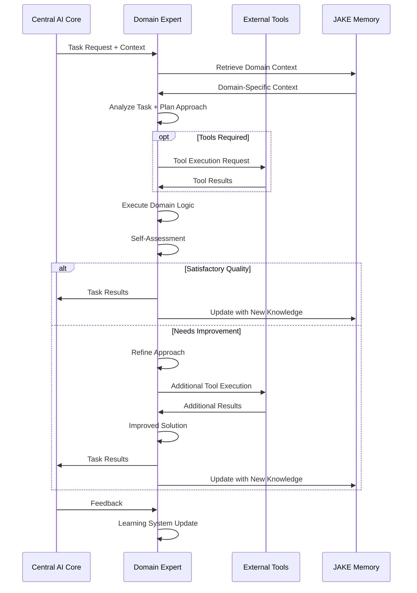
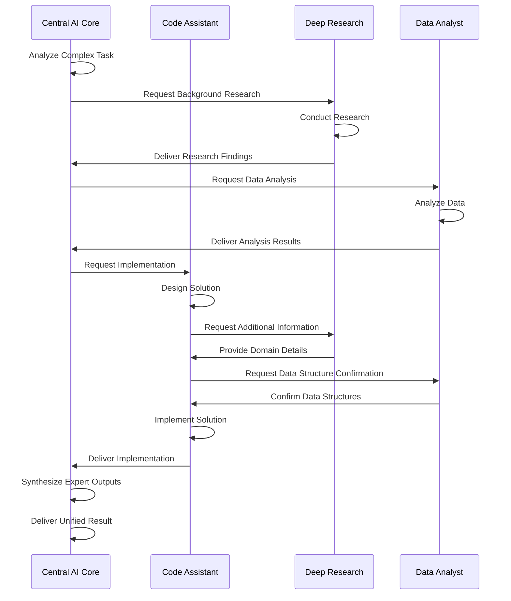

# Cortex Platform: Domain Expert Systems

_Version: 1.0_  
_Date: 2025-03-04_

## Introduction

This document details the Domain Expert Systems architecture within the Cortex Platform. Domain Experts are specialized, autonomous components that provide deep expertise in specific domains while remaining integrated with the platform's unified intelligence framework.

Unlike conventional AI assistants that attempt to handle all domains with a general-purpose approach, Cortex's Domain Expert architecture enables specialized capabilities that can match or exceed human expertise in specific domains. This approach combines the benefits of specialized tools with the coherence of a unified platform.

## Domain Expert Concept

### Definition and Purpose

A Domain Expert within Cortex is a specialized intelligent system that:

1. **Possesses deep domain knowledge** in a specific field or task area
2. **Operates with significant autonomy** to plan and execute complex tasks
3. **Maintains awareness of broader context** from the Cortex Core
4. **Integrates seamlessly** with the unified user experience
5. **Continuously improves** based on feedback and new information

Domain Experts enable Cortex to deliver exceptional performance in specialized areas while maintaining the context continuity and unified experience that define the platform.

### Key Principles

The Domain Expert architecture follows these core principles:

1. **Specialized Excellence**: Each expert focuses on mastery of a specific domain rather than general capability
2. **Autonomous Operation**: Experts can independently plan and execute complex tasks within their domain
3. **Unified Context**: All experts share and contribute to the unified memory and context
4. **Standardized Integration**: Consistent interfaces enable seamless core-expert communication
5. **Flexible Architecture**: Experts can implement domain-specific approaches while maintaining standard interfaces
6. **Continuous Evolution**: Experts evolve independently based on domain-specific feedback and requirements

## Domain Expert Architecture

The Domain Expert architecture consists of several key components and patterns:

```mermaid
graph TD
    A[Domain Expert Framework] --> B[Expert Interface]
    A --> C[Planning System]
    A --> D[Knowledge Base]
    A --> E[Tool Integration]
    A --> F[Self-Assessment]
    A --> G[Learning System]

    B --> B1[Core Communication]
    B --> B2[Memory Integration]
    B --> B3[Task Management]

    C --> C1[Task Analysis]
    C --> C2[Strategy Formation]
    C --> C3[Step Planning]
    C --> C4[Execution Monitoring]

    D --> D1[Domain Knowledge]
    D --> D2[Procedure Library]
    D --> D3[Example Repository]

    E --> E1[Tool Selection]
    E --> E2[Tool Orchestration]
    E --> E3[Result Processing]

    F --> F1[Quality Assessment]
    F --> F2[Confidence Estimation]
    F --> F3[Improvement Identification]

    G --> G1[Feedback Integration]
    G --> G2[Knowledge Updating]
    G --> G3[Approach Refinement]
```

### Common Components

While Domain Experts vary in their specific implementations, they share common architectural components:

#### Expert Interface

The Expert Interface handles communication with the Cortex Core:

- **Core Communication**: Standardized messaging with the Central AI Core

  - Task reception and understanding
  - Result reporting
  - Status updates and progress reporting
  - Exception handling

- **Memory Integration**: Interaction with the JAKE memory system

  - Domain-specific context retrieval
  - Memory contribution and updates
  - Knowledge persistence
  - Memory-guided assistance

- **Task Management**: Handling of task lifecycle
  - Task acceptance and validation
  - Resource requirement assessment
  - Task progress tracking
  - Completion reporting

#### Planning System

The Planning System enables autonomous operation:

- **Task Analysis**: Understanding task requirements

  - Goal identification
  - Constraint recognition
  - Complexity assessment
  - Prerequisite identification

- **Strategy Formation**: High-level approach planning

  - Approach selection
  - Resource planning
  - Risk assessment
  - Fallback planning

- **Step Planning**: Detailed execution planning

  - Task decomposition
  - Dependency mapping
  - Sequencing
  - Validation planning

- **Execution Monitoring**: Tracking and adjusting plans
  - Progress monitoring
  - Error detection
  - Plan adaptation
  - Execution validation

#### Knowledge Base

The Knowledge Base stores domain-specific expertise:

- **Domain Knowledge**: Core knowledge representation

  - Factual knowledge
  - Conceptual frameworks
  - Best practices
  - Domain terminology

- **Procedure Library**: Process and methodology storage

  - Step-by-step procedures
  - Methodology templates
  - Decision trees
  - Validation protocols

- **Example Repository**: Reference implementations
  - Exemplar solutions
  - Case studies
  - Pattern libraries
  - Anti-patterns

#### Tool Integration

Tool Integration enables the use of domain-specific tooling:

- **Tool Selection**: Identifying appropriate tools

  - Capability matching
  - Tool availability validation
  - Performance consideration
  - Security validation

- **Tool Orchestration**: Managing tool execution

  - Parameter preparation
  - Execution sequencing
  - Error handling
  - Result collection

- **Result Processing**: Handling tool outputs
  - Output interpretation
  - Result transformation
  - Quality validation
  - Integration into solution

#### Self-Assessment

Self-Assessment enables quality control and improvement:

- **Quality Assessment**: Evaluating output quality

  - Correctness verification
  - Completeness checking
  - Consistency validation
  - Style and convention adherence

- **Confidence Estimation**: Determining result reliability

  - Uncertainty assessment
  - Assumption identification
  - Verification scope
  - Reliability rating

- **Improvement Identification**: Finding enhancement opportunities
  - Gap identification
  - Performance bottlenecks
  - Quality issues
  - Methodology improvements

#### Learning System

The Learning System enables continuous improvement:

- **Feedback Integration**: Processing improvement signals

  - User feedback processing
  - Outcome analysis
  - Success pattern identification
  - Failure pattern recognition

- **Knowledge Updating**: Enhancing domain expertise

  - Knowledge base expansion
  - Outdated information detection
  - Confidence adjustment
  - Reference updating

- **Approach Refinement**: Improving methodologies
  - Procedure optimization
  - Strategy enhancement
  - New technique integration
  - Pattern extraction

### Domain Expert Lifecycle

Domain Experts follow a standard lifecycle for task handling:

1. **Task Reception**: Expert receives task and context from Core
2. **Context Enhancement**: Expert retrieves additional domain-specific context
3. **Task Analysis & Planning**: Expert analyzes requirements and plans approach
4. **Execution**: Expert executes plan, potentially using domain-specific tools
5. **Self-Assessment**: Expert evaluates quality of results
6. **Refinement**: Expert refines results if needed
7. **Delivery**: Expert returns results to Core
8. **Memory Update**: Expert contributes new knowledge to memory
9. **Learning**: Expert processes feedback for continuous improvement

## Core Domain Experts

The initial Cortex Platform includes several core Domain Experts:

### Code Assistant

The Code Assistant provides advanced software development capabilities across the entire development lifecycle.

#### Key Capabilities

- **Code Generation**: Creating new code from specifications

  - Full component implementation
  - Function generation
  - Boilerplate creation
  - Test case generation

- **Code Understanding**: Analyzing existing codebases

  - Structure analysis
  - Semantic parsing
  - Pattern recognition
  - Dependency mapping

- **Code Transformation**: Modifying existing code

  - Refactoring
  - Optimization
  - Migration
  - Style conversion

- **Code Quality**: Ensuring code excellence

  - Bug detection
  - Best practice enforcement
  - Security analysis
  - Performance assessment

- **Software Documentation**: Creating and maintaining documentation
  - Inline documentation
  - API documentation
  - Architecture documentation
  - User guides

#### Domain-Specific Architecture

The Code Assistant includes specialized components:

- **Language Models**: Custom fine-tuned models for programming
- **Code Parsers**: Abstract Syntax Tree (AST) analysis
- **Static Analysis Tools**: Code quality and security scanning
- **Repository Integration**: Version control system interaction
- **IDE Integration**: Development environment connectivity

#### Integration Points

- **VS Code Extension**: Direct IDE integration through MCP server
- **Git Integration**: Repository analysis and contribution
- **Build System Integration**: Compilation and testing feedback
- **Documentation Generator**: Documentation system integration

### Deep Research

The Deep Research expert provides sophisticated information gathering, synthesis, and knowledge discovery capabilities.

#### Key Capabilities

- **Information Gathering**: Collecting relevant information

  - Web research
  - Document analysis
  - Data extraction
  - Cross-source validation

- **Knowledge Synthesis**: Combining information meaningfully

  - Information integration
  - Contradiction resolution
  - Gap identification
  - Confidence assessment

- **Insight Generation**: Creating new understanding

  - Pattern recognition
  - Hypothesis formation
  - Conclusion drawing
  - Implication identification

- **Source Management**: Tracking information provenance

  - Citation management
  - Source credibility assessment
  - Reference formatting
  - Bibliography generation

- **Research Planning**: Guiding investigation process
  - Research question refinement
  - Investigation strategy
  - Source identification
  - Information needs assessment

#### Domain-Specific Architecture

The Deep Research expert includes specialized components:

- **Web Search Integration**: Sophisticated search capabilities
- **Document Processors**: PDF, DOCX, and other format handling
- **Citation Database**: Reference management system
- **Credibility Engine**: Source evaluation framework
- **Synthesis Models**: Specialized information integration models

#### Integration Points

- **Browser Extension**: Web research automation
- **Document Management**: Document retrieval and analysis
- **Knowledge Base**: Structured knowledge storage
- **Citation Systems**: Reference management integration

### Other Core Domain Experts

Additional core Domain Experts include:

#### Data Analyst

- **Data Processing**: Cleaning, transformation, and preparation
- **Statistical Analysis**: Statistical methods and hypothesis testing
- **Data Visualization**: Chart generation and visual analysis
- **Insight Extraction**: Finding patterns and meaning in data
- **Reporting**: Creating data-driven reports and dashboards

#### Design Assistant

- **UI/UX Design**: User interface and experience design
- **Visual Design**: Graphics, layout, and visual elements
- **Design System Management**: Component libraries and guidelines
- **Prototyping**: Interactive prototype creation
- **Design Critique**: Design evaluation and improvement

#### Content Creator

- **Writing**: Various content types and styles
- **Editing**: Content refinement and improvement
- **SEO Optimization**: Search optimization for content
- **Content Planning**: Editorial calendar and content strategy
- **Multi-format Creation**: Adapting content for different channels

## Domain Expert Framework

The Domain Expert Framework provides a standardized structure for creating new experts.

### Framework Components

#### Expert SDK

The Expert SDK includes:

- **Core Interface Library**: Communication with Cortex Core
- **Memory Integration Toolkit**: JAKE Memory interaction
- **Planning Framework**: Task planning and execution
- **Assessment Tools**: Quality evaluation utilities
- **Tool Integration Framework**: External tool connectivity

#### Development Tools

Tools to accelerate expert development:

- **Expert Templates**: Starting points for new experts
- **Testing Framework**: Validation and quality assurance
- **Simulation Environment**: Development without full deployment
- **Performance Analysis**: Metrics and optimization tools
- **Documentation Generator**: Automated documentation

#### Deployment Infrastructure

Infrastructure for expert deployment:

- **Containerization**: Docker-based deployment
- **API Gateway**: Communication management
- **Authentication & Authorization**: Security controls
- **Monitoring & Logging**: Operational visibility
- **Scaling Framework**: Resource management

### Expert Certification Process

New Domain Experts undergo a certification process:

1. **Interface Compliance**: Verification of correct interface implementation
2. **Performance Benchmarking**: Quality and efficiency testing
3. **Security Review**: Assessment of security practices
4. **Integration Testing**: Validation of Core interaction
5. **Documentation Review**: Evaluation of documentation quality

### Extension Points

The framework includes standard extension points:

- **Knowledge Integration**: Adding domain-specific knowledge
- **Tool Connectivity**: Connecting domain-specific tools
- **Custom Planning**: Specialized planning approaches
- **Quality Heuristics**: Domain-specific quality measures
- **Visualization Patterns**: Specialized visualization approaches

## Domain Expert Interaction Patterns

### Core-Expert Communication

Communication between the Core and Domain Experts follows these patterns:

#### Task Delegation

- **Task Specification**: Clear description of requirements
- **Context Provision**: Relevant background information
- **Constraint Definition**: Limitations and requirements
- **Priority Indication**: Urgency and importance signals

#### Progress Reporting

- **Status Updates**: Regular progress notifications
- **Milestone Completion**: Significant achievement markers
- **Blocking Issues**: Problems requiring intervention
- **Resource Utilization**: Usage of allocated resources

#### Result Delivery

- **Solution Presentation**: Final output delivery
- **Quality Assessment**: Self-evaluated quality metrics
- **Limitation Disclosure**: Known limitations or issues
- **Alternative Solutions**: Other approaches considered

#### Feedback Processing

- **Explicit Feedback**: Direct quality evaluation
- **Implicit Signals**: Indirect quality indicators
- **Improvement Requests**: Specific enhancement needs
- **User Reactions**: User satisfaction signals

### Multi-Expert Collaboration

For complex tasks requiring multiple experts:

#### Coordination Patterns

- **Task Decomposition**: Breaking work into expert-specific components
- **Handoff Protocols**: Transition between experts
- **Shared Context**: Common understanding maintenance
- **Conflict Resolution**: Handling contradictory approaches

#### Collaboration Example

## Creating New Domain Experts

### Development Process

The process for creating new Domain Experts includes:

1. **Domain Analysis**: Identifying domain scope and requirements
2. **Knowledge Acquisition**: Gathering domain expertise
3. **Architecture Design**: Determining expert-specific architecture
4. **Core Implementation**: Building the expert's primary capabilities
5. **Tool Integration**: Connecting to domain-specific tools
6. **Quality Framework**: Implementing self-assessment capabilities
7. **Testing & Validation**: Ensuring quality and reliability
8. **Documentation**: Comprehensive capability documentation
9. **Certification**: Official certification process
10. **Deployment**: Integration with the Cortex Platform

### Best Practices

Key recommendations for Domain Expert development:

- **Clear Domain Boundaries**: Well-defined scope of expertise
- **Deep vs. Broad**: Prioritize depth in core capabilities
- **Autonomous Quality Control**: Robust self-assessment
- **Tool Leverage**: Utilize existing domain tools
- **Graceful Degradation**: Handle edge cases appropriately
- **Confidence Transparency**: Clearly communicate certainty levels
- **Continuous Learning**: Design for ongoing improvement
- **User Feedback Loop**: Incorporate usage feedback

### Implementation Strategies

Approaches for effective implementation:

- **Hybrid Architecture**: Combine symbolic and neural approaches
- **Knowledge Distillation**: Extract expertise from multiple sources
- **Procedural Encoding**: Capture processes as executable procedures
- **Example-Driven Learning**: Learn from exemplar solutions
- **Tool Orchestration**: Leverage existing specialized tools
- **Collaborative Design**: Involve domain experts in development
- **Iterative Refinement**: Progressive capability enhancement
- **Scenario Testing**: Comprehensive real-world validation

## Future Evolution

The Domain Expert architecture will evolve in several key directions:

### Near-Term Evolution

- **Expanded Expert Portfolio**: New domains and specializations
- **Deeper Tool Integration**: More sophisticated tool orchestration
- **Enhanced Collaboration**: Improved multi-expert coordination
- **Personalization**: User-specific adaptation of expert behavior
- **Performance Optimization**: Efficiency and quality improvements

### Long-Term Vision

- **Expert Composition**: Dynamic creation of composite experts
- **Emergent Expertise**: Self-organizing knowledge domains
- **Community-Driven Experts**: Ecosystem of third-party experts
- **Continuous Autonomous Learning**: Self-directed capability enhancement
- **Cross-Domain Intelligence**: Insights from domain intersections

## Conclusion

The Domain Expert Systems architecture is a foundational element of the Cortex Platform's value proposition, enabling specialized excellence within a unified intelligence framework. By combining deep domain expertise with autonomous operation capabilities while maintaining seamless integration with the core platform, Domain Experts deliver capabilities that match or exceed specialized point solutions while preserving the context continuity and unified experience that define Cortex.

The standardized Domain Expert Framework provides a robust foundation for continuous expansion of the platform's capabilities, enabling both first-party and third-party experts to enrich the ecosystem. As the expert portfolio grows and evolves, the Cortex Platform will increasingly deliver on its promise of unified intelligence across all digital contexts, combining breadth of coverage with depth of expertise in a way that conventional AI assistants cannot match.
