# Cortex Platform: Integration Architecture

_Version: 1.0_  
_Date: 2025-03-04_

## Introduction

This document details the Integration Architecture of the Cortex Platform, focusing on how Cortex connects with external tools, applications, and services. The cornerstone of this architecture is the MCP (Memory, Cognition, and Perception) Protocol, which provides a standardized approach for all external integrations.

Integration is a foundational element of Cortex's value proposition, enabling the platform to serve as a unified intelligence layer that spans diverse digital contexts. Rather than attempting to replace existing tools, Cortex enhances them through intelligent integration, creating a seamless experience across the entire digital ecosystem.

## Integration Architecture Overview

```mermaid
graph TD
    A[Cortex Integration Architecture] --> B[MCP Protocol]
    A --> C[Integration Registry]
    A --> D[Tool Execution Framework]
    A --> E[Resource Access Framework]
    A --> F[External Connectors]
    A --> G[Security Layer]

    B --> B1[Protocol Specification]
    B --> B2[Message Formats]
    B --> B3[Transport Options]

    C --> C1[Discovery Mechanism]
    C --> C2[Capability Registry]
    C --> C3[Availability Monitoring]

    D --> D1[Tool Invocation]
    D --> D2[Execution Management]
    D --> D3[Result Processing]

    E --> E1[Resource Definition]
    E --> E2[Resource Retrieval]
    E --> E3[Resource Updates]

    F --> F1[MCP Servers]
    F --> F2[API Connectors]
    F --> F3[Data Connectors]

    G --> G1[Authentication]
    G --> G2[Authorization]
    G --> G3[Audit Logging]
```

## MCP Protocol

The MCP (Memory, Cognition, and Perception) Protocol is the foundation of Cortex's integration architecture, providing a standardized framework for all external connections.

### Protocol Principles

The MCP Protocol is designed around these core principles:

1. **Standardization**: Consistent patterns for all integrations
2. **Discoverability**: Self-describing capabilities and resources
3. **Extensibility**: Easily expandable for new integration types
4. **Security**: Built-in authentication and authorization
5. **Reliability**: Robust error handling and recovery
6. **Simplicity**: Easy to implement for basic integrations

### Protocol Layers

The MCP Protocol consists of several layers:

#### 1. Transport Layer

The transport layer handles communication between Cortex and external systems:

- **HTTP/REST**: Synchronous request-response
- **WebSockets**: Real-time bi-directional communication
- **gRPC**: High-performance streaming
- **Standard I/O**: Local process communication
- **Custom Transports**: Framework for specialized protocols

#### 2. Message Layer

The message layer defines the structure of communications:

- **Message Envelope**: Standard wrapper for all communications

  - Message ID and correlation
  - Timestamps and versioning
  - Authentication tokens
  - Metadata and routing information

- **Message Types**:

  - Discovery messages
  - Tool execution requests/responses
  - Resource access requests/responses
  - Status updates
  - Error notifications

- **Data Formats**:
  - JSON as primary format
  - Protocol Buffers for efficiency
  - Binary data handling
  - Streaming content

#### 3. Semantic Layer

The semantic layer defines the meaning of messages:

- **Tool Definitions**: Describing executable capabilities

  - Tool names and identifiers
  - Parameter specifications
  - Return value definitions
  - Usage documentation

- **Resource Definitions**: Describing accessible data

  - Resource types and identifiers
  - Schema information
  - Access patterns
  - Relationship definitions

- **Capability Declarations**: Advertising available functionality
  - Feature sets
  - Versioning information
  - Dependency specifications
  - Compatibility details

### Protocol Operations

The MCP Protocol supports several core operations:

#### Discovery

Discovery operations allow Cortex to learn about available tools and resources:

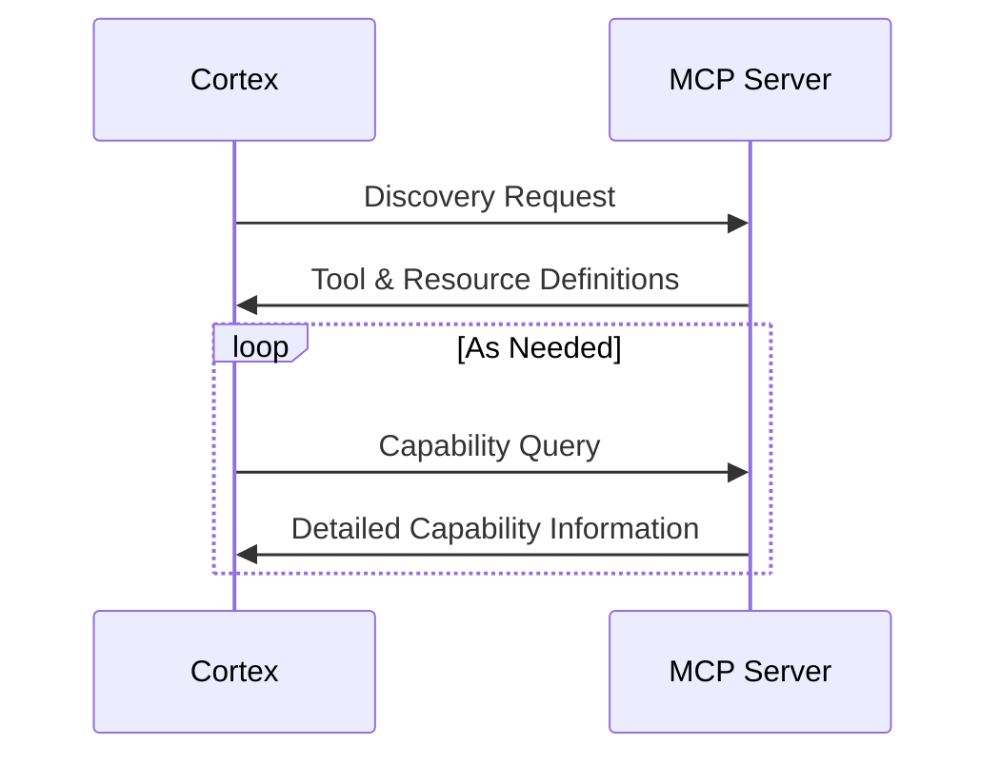
```mermaid
sequenceDiagram
    participant Cortex
    participant MCP as MCP Server

    Cortex->>MCP: Discovery Request
    MCP->>Cortex: Tool & Resource Definitions

    loop As Needed
        Cortex->>MCP: Capability Query
        MCP->>Cortex: Detailed Capability Information
    end
```

- **Server Discovery**: Locating and initializing MCP servers
- **Tool Discovery**: Identifying available tools
- **Resource Discovery**: Finding accessible resources
- **Capability Inspection**: Detailed capability examination

#### Tool Execution

Tool execution operations allow Cortex to invoke external tools:

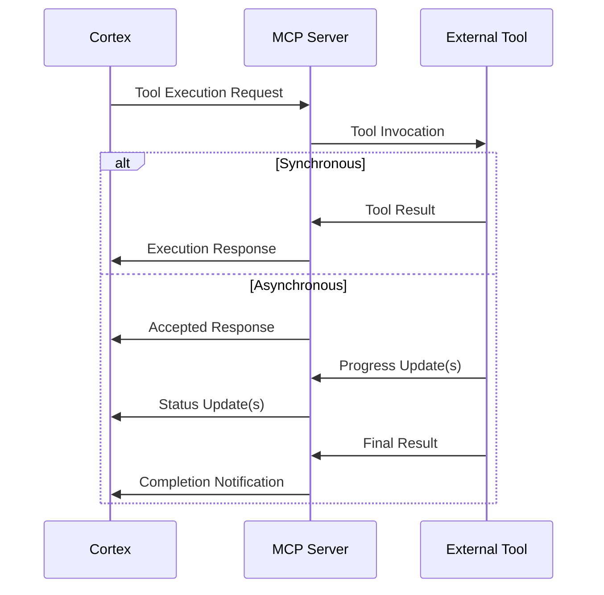
```mermaid
sequenceDiagram
    participant Cortex
    participant MCP as MCP Server
    participant Tool as External Tool

    Cortex->>MCP: Tool Execution Request
    MCP->>Tool: Tool Invocation

    alt Synchronous
        Tool->>MCP: Tool Result
        MCP->>Cortex: Execution Response
    else Asynchronous
        MCP->>Cortex: Accepted Response
        Tool->>MCP: Progress Update(s)
        MCP->>Cortex: Status Update(s)
        Tool->>MCP: Final Result
        MCP->>Cortex: Completion Notification
    end
```

- **Synchronous Execution**: Direct request-response pattern
- **Asynchronous Execution**: Background processing with status updates
- **Streaming Execution**: Continuous data flow during execution
- **Batch Execution**: Multiple operations in a single request

#### Resource Access

Resource access operations allow Cortex to work with external data:

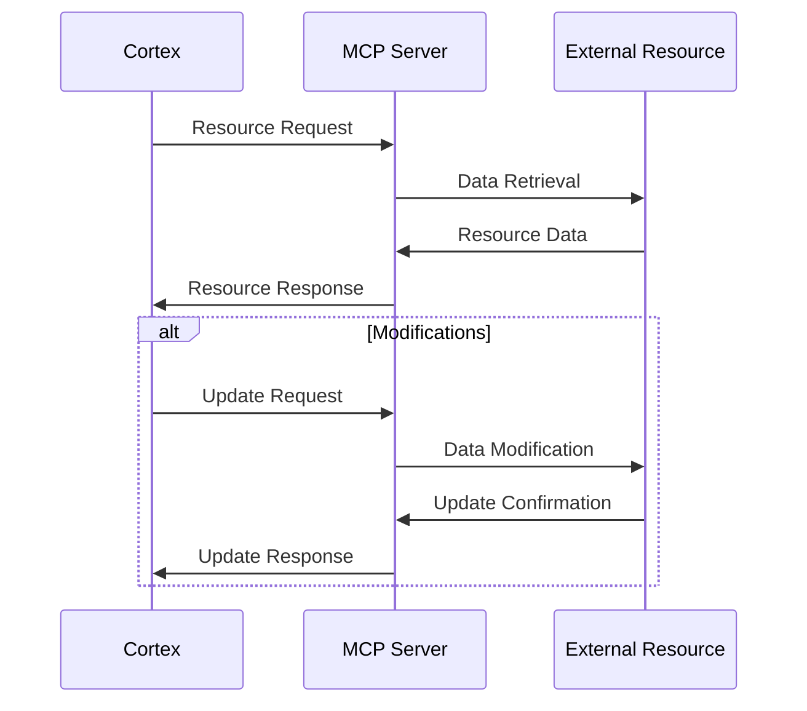
```mermaid
sequenceDiagram
    participant Cortex
    participant MCP as MCP Server
    participant Resource as External Resource

    Cortex->>MCP: Resource Request
    MCP->>Resource: Data Retrieval
    Resource->>MCP: Resource Data
    MCP->>Cortex: Resource Response

    alt Modifications
        Cortex->>MCP: Update Request
        MCP->>Resource: Data Modification
        Resource->>MCP: Update Confirmation
        MCP->>Cortex: Update Response
    end
```

- **Resource Retrieval**: Getting data from external sources
- **Resource Modification**: Updating external data
- **Resource Creation**: Creating new external resources
- **Resource Deletion**: Removing external resources
- **Resource Querying**: Searching and filtering external data

#### Status Monitoring

Status operations allow tracking of ongoing operations:

- **Health Checks**: Verifying server and tool availability
- **Progress Updates**: Tracking long-running operations
- **Status Queries**: Checking operation state
- **Event Notifications**: Real-time status changes

## Integration Registry

The Integration Registry maintains information about available integrations and their capabilities.

### Registry Architecture

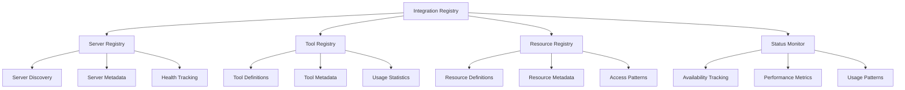
```mermaid
graph TD
    A[Integration Registry] --> B[Server Registry]
    A --> C[Tool Registry]
    A --> D[Resource Registry]
    A --> E[Status Monitor]

    B --> B1[Server Discovery]
    B --> B2[Server Metadata]
    B --> B3[Health Tracking]

    C --> C1[Tool Definitions]
    C --> C2[Tool Metadata]
    C --> C3[Usage Statistics]

    D --> D1[Resource Definitions]
    D --> D2[Resource Metadata]
    D --> D3[Access Patterns]

    E --> E1[Availability Tracking]
    E --> E2[Performance Metrics]
    E --> E3[Usage Patterns]
```

### Registry Components

#### Server Registry

The Server Registry tracks MCP servers:

- **Server Directory**: Catalog of available servers
- **Connectivity Information**: How to reach each server
- **Capability Summary**: Overview of server capabilities
- **Health Status**: Current server availability
- **Version Information**: Server implementation versions

#### Tool Registry

The Tool Registry maintains tool information:

- **Tool Catalog**: Complete listing of available tools
- **Parameter Specifications**: Required and optional parameters
- **Return Value Definitions**: Output formats and types
- **Usage Documentation**: How to use each tool
- **Performance Metrics**: Execution statistics

#### Resource Registry

The Resource Registry tracks available resources:

- **Resource Catalog**: Available external resources
- **Schema Information**: Resource structure and types
- **Access Patterns**: How to query and manipulate resources
- **Relationship Map**: Connections between resources
- **Update Tracking**: Resource modification monitoring

#### Status Monitor

The Status Monitor tracks integration health:

- **Availability Tracking**: Current status of integrations
- **Performance Metrics**: Response times and reliability
- **Error Tracking**: Recent failures and issues
- **Usage Patterns**: Utilization statistics
- **Dependency Mapping**: Integration relationships

### Discovery Process

The discovery process populates the Integration Registry:

1. **Initial Discovery**: On startup, discover available MCP servers
2. **Capability Enumeration**: Query each server for tools and resources
3. **Metadata Collection**: Gather details about each capability
4. **Availability Verification**: Confirm operational status
5. **Periodic Refresh**: Regularly update registry information
6. **Event-Driven Updates**: Process notifications of capability changes

## Tool Execution Framework

The Tool Execution Framework manages the invocation of external tools through MCP servers.

### Execution Architecture

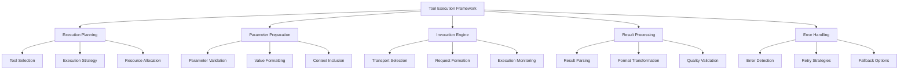
```mermaid
graph TD
    A[Tool Execution Framework] --> B[Execution Planning]
    A --> C[Parameter Preparation]
    A --> D[Invocation Engine]
    A --> E[Result Processing]
    A --> F[Error Handling]

    B --> B1[Tool Selection]
    B --> B2[Execution Strategy]
    B --> B3[Resource Allocation]

    C --> C1[Parameter Validation]
    C --> C2[Value Formatting]
    C --> C3[Context Inclusion]

    D --> D1[Transport Selection]
    D --> D2[Request Formation]
    D --> D3[Execution Monitoring]

    E --> E1[Result Parsing]
    E --> E2[Format Transformation]
    E --> E3[Quality Validation]

    F --> F1[Error Detection]
    F --> F2[Retry Strategies]
    F --> F3[Fallback Options]
```

### Execution Components

#### Execution Planning

Execution Planning prepares for tool invocation:

- **Tool Selection**: Choosing the appropriate tool
- **Execution Strategy**: Determining execution approach
  - Synchronous vs. asynchronous
  - Local vs. remote execution
  - Batch vs. individual processing
- **Resource Allocation**: Assigning necessary resources
  - Memory and processing allocation
  - Timeout configuration
  - Priority assignment

#### Parameter Preparation

Parameter Preparation handles input processing:

- **Parameter Validation**: Ensuring valid inputs
  - Type checking
  - Range validation
  - Format verification
  - Required parameter checking
- **Value Formatting**: Preparing input values
  - Data type conversion
  - Serialization
  - Encoding
  - Structure formatting
- **Context Inclusion**: Adding relevant context
  - User context
  - Session information
  - Historical references
  - Environmental data

#### Invocation Engine

The Invocation Engine manages execution:

- **Transport Selection**: Choosing communication method
- **Request Formation**: Building the execution request
- **Execution Monitoring**: Tracking ongoing execution
  - Progress monitoring
  - Timeout enforcement
  - Resource utilization tracking
  - Cancellation support

#### Result Processing

Result Processing handles tool outputs:

- **Result Parsing**: Interpreting returned data
- **Format Transformation**: Converting to internal formats
- **Quality Validation**: Verifying result quality
  - Completeness checking
  - Consistency validation
  - Format verification
  - Success confirmation

#### Error Handling

Error Handling manages execution issues:

- **Error Detection**: Identifying problems
  - Error code interpretation
  - Exception analysis
  - Timeout detection
  - Result validation
- **Retry Strategies**: Managing execution retries
  - Retry policy enforcement
  - Backoff strategies
  - Condition-based retries
  - Retry limits
- **Fallback Options**: Alternative approaches
  - Alternative tool selection
  - Degraded operation modes
  - Local fallback processing
  - User intervention requests

### Execution Patterns

The framework supports multiple execution patterns:

#### Synchronous Execution

For immediate, blocking operations:

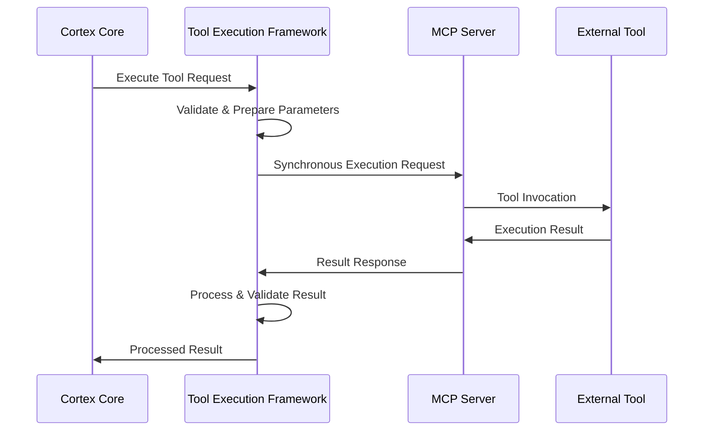
```mermaid
sequenceDiagram
    participant Core as Cortex Core
    participant TEF as Tool Execution Framework
    participant MCP as MCP Server
    participant Tool as External Tool

    Core->>TEF: Execute Tool Request
    TEF->>TEF: Validate & Prepare Parameters
    TEF->>MCP: Synchronous Execution Request
    MCP->>Tool: Tool Invocation
    Tool->>MCP: Execution Result
    MCP->>TEF: Result Response
    TEF->>TEF: Process & Validate Result
    TEF->>Core: Processed Result
```

#### Asynchronous Execution

For long-running operations:

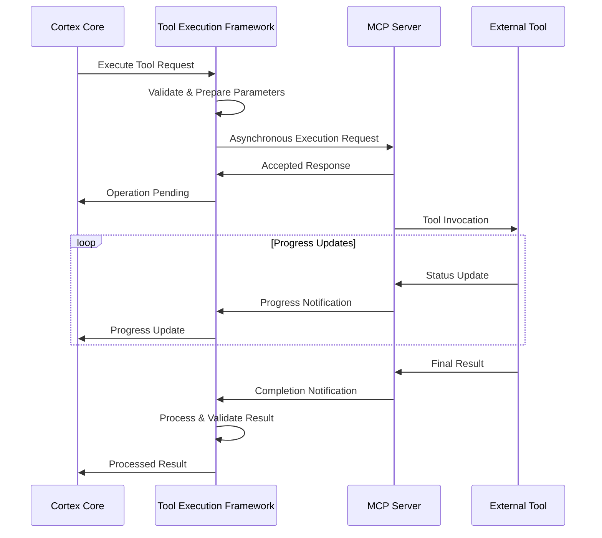
```mermaid
sequenceDiagram
    participant Core as Cortex Core
    participant TEF as Tool Execution Framework
    participant MCP as MCP Server
    participant Tool as External Tool

    Core->>TEF: Execute Tool Request
    TEF->>TEF: Validate & Prepare Parameters
    TEF->>MCP: Asynchronous Execution Request
    MCP->>TEF: Accepted Response
    TEF->>Core: Operation Pending

    MCP->>Tool: Tool Invocation

    loop Progress Updates
        Tool->>MCP: Status Update
        MCP->>TEF: Progress Notification
        TEF->>Core: Progress Update
    end

    Tool->>MCP: Final Result
    MCP->>TEF: Completion Notification
    TEF->>TEF: Process & Validate Result
    TEF->>Core: Processed Result
```

#### Streaming Execution

For continuous data flow:

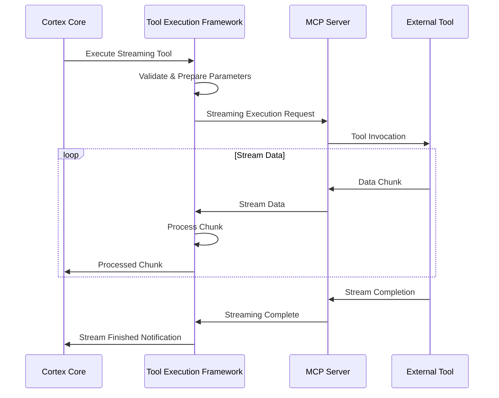
```mermaid
sequenceDiagram
    participant Core as Cortex Core
    participant TEF as Tool Execution Framework
    participant MCP as MCP Server
    participant Tool as External Tool

    Core->>TEF: Execute Streaming Tool
    TEF->>TEF: Validate & Prepare Parameters
    TEF->>MCP: Streaming Execution Request
    MCP->>Tool: Tool Invocation

    loop Stream Data
        Tool->>MCP: Data Chunk
        MCP->>TEF: Stream Data
        TEF->>TEF: Process Chunk
        TEF->>Core: Processed Chunk
    end

    Tool->>MCP: Stream Completion
    MCP->>TEF: Streaming Complete
    TEF->>Core: Stream Finished Notification
```

## Resource Access Framework

The Resource Access Framework manages interactions with external data sources through MCP servers.

### Resource Architecture

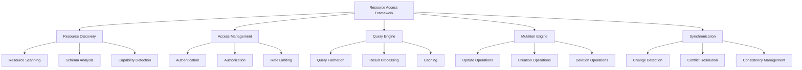
```mermaid
graph TD
    A[Resource Access Framework] --> B[Resource Discovery]
    A --> C[Access Management]
    A --> D[Query Engine]
    A --> E[Mutation Engine]
    A --> F[Synchronization]

    B --> B1[Resource Scanning]
    B --> B2[Schema Analysis]
    B --> B3[Capability Detection]

    C --> C1[Authentication]
    C --> C2[Authorization]
    C --> C3[Rate Limiting]

    D --> D1[Query Formation]
    D --> D2[Result Processing]
    D --> D3[Caching]

    E --> E1[Update Operations]
    E --> E2[Creation Operations]
    E --> E3[Deletion Operations]

    F --> F1[Change Detection]
    F --> F2[Conflict Resolution]
    F --> F3[Consistency Management]
```

### Resource Components

#### Resource Discovery

Resource Discovery finds and understands external resources:

- **Resource Scanning**: Identifying available resources
- **Schema Analysis**: Understanding resource structure
- **Capability Detection**: Determining available operations

#### Access Management

Access Management handles security and usage:

- **Authentication**: Verifying access credentials
- **Authorization**: Enforcing access permissions
- **Rate Limiting**: Managing usage constraints

#### Query Engine

The Query Engine retrieves resource data:

- **Query Formation**: Building retrieval requests
- **Result Processing**: Handling returned data
- **Caching**: Optimizing repeated access

#### Mutation Engine

The Mutation Engine modifies resources:

- **Update Operations**: Modifying existing resources
- **Creation Operations**: Creating new resources
- **Deletion Operations**: Removing resources

#### Synchronization

Synchronization maintains consistency:

- **Change Detection**: Identifying modifications
- **Conflict Resolution**: Handling competing changes
- **Consistency Management**: Ensuring data integrity

### Resource Operations

The framework supports several resource operations:

#### Resource Retrieval

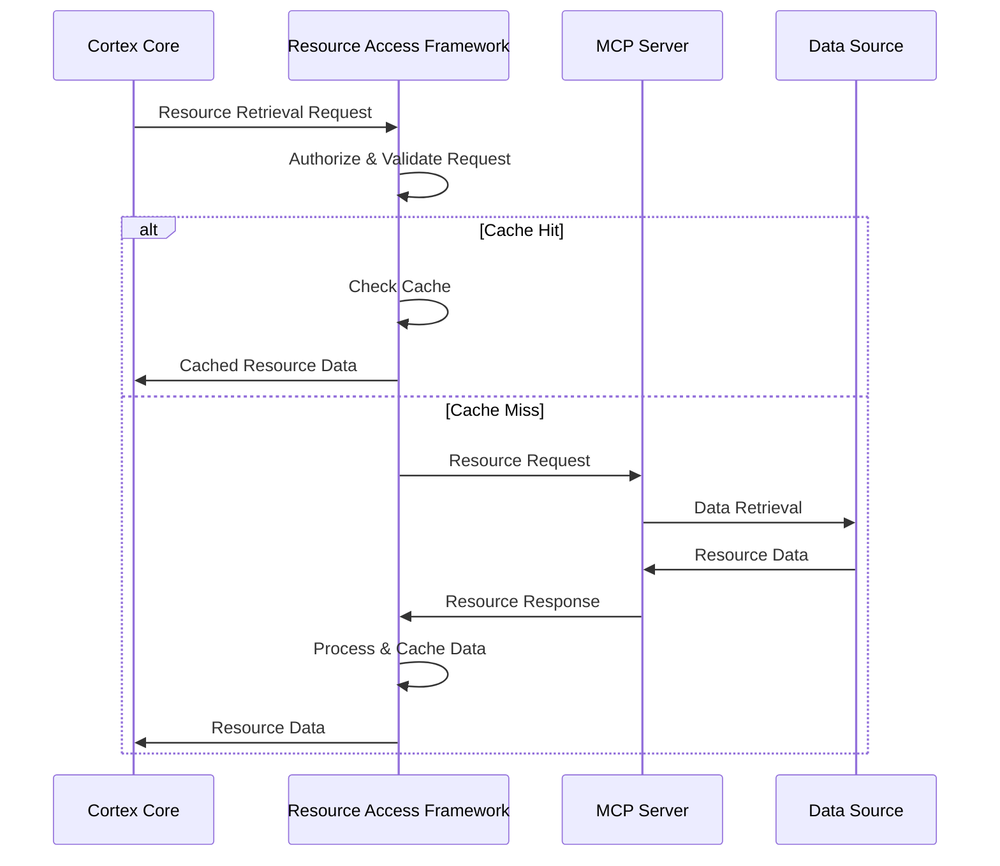
```mermaid
sequenceDiagram
    participant Core as Cortex Core
    participant RAF as Resource Access Framework
    participant MCP as MCP Server
    participant Data as Data Source

    Core->>RAF: Resource Retrieval Request
    RAF->>RAF: Authorize & Validate Request

    alt Cache Hit
        RAF->>RAF: Check Cache
        RAF->>Core: Cached Resource Data
    else Cache Miss
        RAF->>MCP: Resource Request
        MCP->>Data: Data Retrieval
        Data->>MCP: Resource Data
        MCP->>RAF: Resource Response
        RAF->>RAF: Process & Cache Data
        RAF->>Core: Resource Data
    end
```

#### Resource Modification

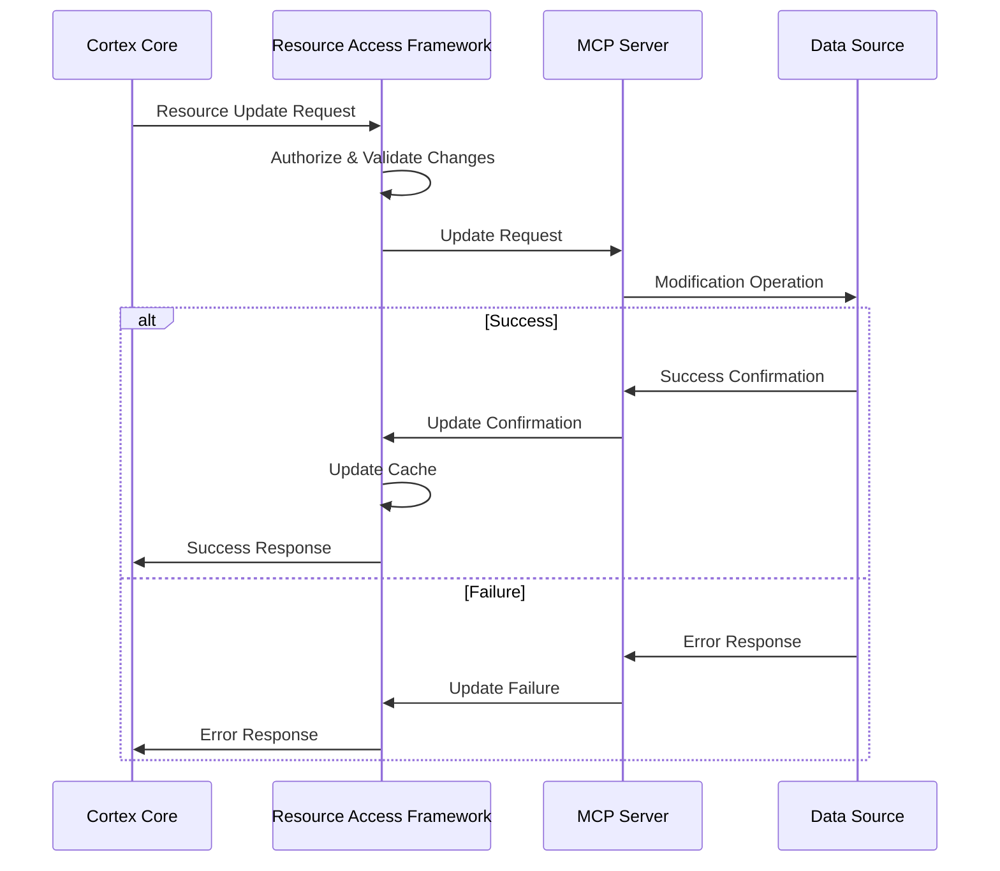
```mermaid
sequenceDiagram
    participant Core as Cortex Core
    participant RAF as Resource Access Framework
    participant MCP as MCP Server
    participant Data as Data Source

    Core->>RAF: Resource Update Request
    RAF->>RAF: Authorize & Validate Changes
    RAF->>MCP: Update Request
    MCP->>Data: Modification Operation

    alt Success
        Data->>MCP: Success Confirmation
        MCP->>RAF: Update Confirmation
        RAF->>RAF: Update Cache
        RAF->>Core: Success Response
    else Failure
        Data->>MCP: Error Response
        MCP->>RAF: Update Failure
        RAF->>Core: Error Response
    end
```

#### Resource Synchronization

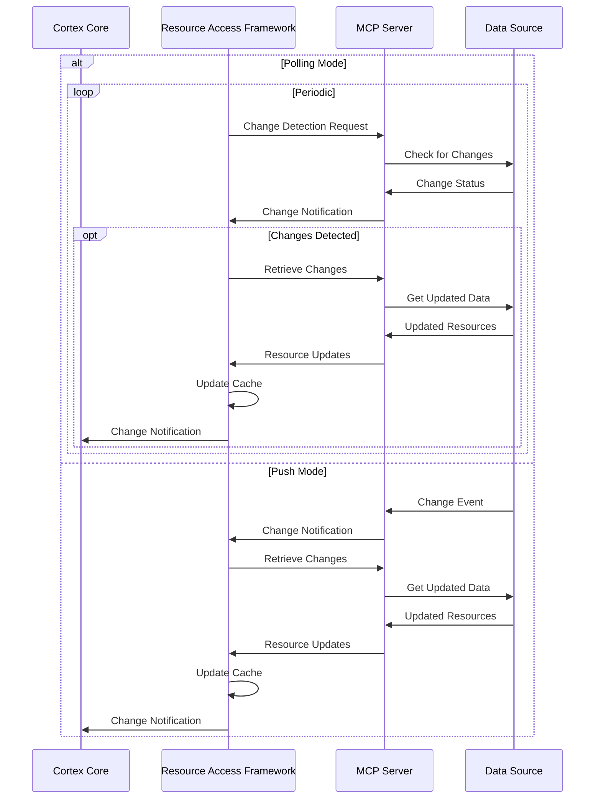
```mermaid
sequenceDiagram
    participant Core as Cortex Core
    participant RAF as Resource Access Framework
    participant MCP as MCP Server
    participant Data as Data Source

    alt Polling Mode
        loop Periodic
            RAF->>MCP: Change Detection Request
            MCP->>Data: Check for Changes
            Data->>MCP: Change Status
            MCP->>RAF: Change Notification

            opt Changes Detected
                RAF->>MCP: Retrieve Changes
                MCP->>Data: Get Updated Data
                Data->>MCP: Updated Resources
                MCP->>RAF: Resource Updates
                RAF->>RAF: Update Cache
                RAF->>Core: Change Notification
            end
        end
    else Push Mode
        Data->>MCP: Change Event
        MCP->>RAF: Change Notification
        RAF->>MCP: Retrieve Changes
        MCP->>Data: Get Updated Data
        Data->>MCP: Updated Resources
        MCP->>RAF: Resource Updates
        RAF->>RAF: Update Cache
        RAF->>Core: Change Notification
    end
```

## External Connectors

External Connectors are the implementation components that bridge Cortex with external systems.

### Connector Types

The platform supports several connector types:

#### MCP Servers

Full-featured integration servers:

- **Dedicated Servers**: Purpose-built integration servers
- **Embedded MCP**: Integration within existing applications
- **Proxy Servers**: Adaptation of existing services
- **Plugin Implementations**: Framework extensions

#### API Connectors

Lightweight adapters for external APIs:

- **REST Adapters**: Connectors for RESTful services
- **GraphQL Connectors**: GraphQL API integration
- **SOAP Adapters**: Legacy SOAP service integration
- **RPC Connectors**: Various RPC protocol support

#### Data Connectors

Specialized connectors for data sources:

- **Database Connectors**: SQL and NoSQL database access
- **File System Connectors**: Structured file access
- **Content Repositories**: Document and media stores
- **Streaming Data Sources**: Real-time data streams

### MCP Server Implementation

MCP Servers follow a standard architecture:

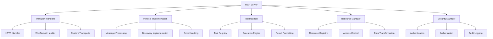
```mermaid
graph TD
    A[MCP Server] --> B[Transport Handlers]
    A --> C[Protocol Implementation]
    A --> D[Tool Manager]
    A --> E[Resource Manager]
    A --> F[Security Manager]

    B --> B1[HTTP Handler]
    B --> B2[WebSocket Handler]
    B --> B3[Custom Transports]

    C --> C1[Message Processing]
    C --> C2[Discovery Implementation]
    C --> C3[Error Handling]

    D --> D1[Tool Registry]
    D --> D2[Execution Engine]
    D --> D3[Result Formatting]

    E --> E1[Resource Registry]
    E --> E2[Access Control]
    E --> E3[Data Transformation]

    F --> F1[Authentication]
    F --> F2[Authorization]
    F --> F3[Audit Logging]
```

#### Server Components

- **Transport Handlers**: Communication channel management
- **Protocol Implementation**: MCP protocol processing
- **Tool Manager**: Tool registration and execution
- **Resource Manager**: Resource access and management
- **Security Manager**: Security policy enforcement

#### Implementation Options

MCP Servers can be implemented in various ways:

- **SDK Implementation**: Using official MCP server SDKs

  - Python SDK
  - TypeScript/JavaScript SDK
  - Java SDK
  - .NET SDK

- **Custom Implementation**: Building from protocol specification

  - Transport-agnostic implementation
  - Specialized protocol optimizations
  - Custom security integration
  - Legacy system adaptation

- **Deployment Models**:
  - Standalone services
  - Sidecar containers
  - Embedded libraries
  - Edge deployments

### Integration Examples

#### VS Code Extension Integration

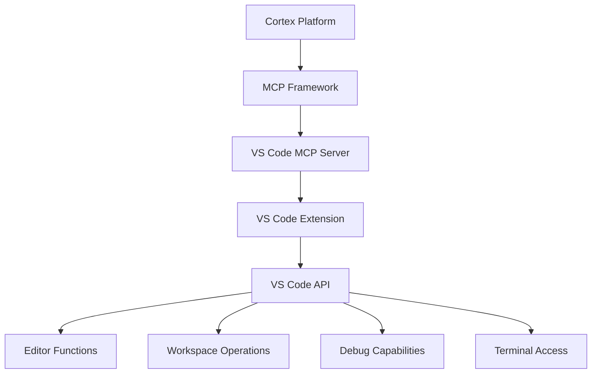
```mermaid
graph TD
    A[Cortex Platform] --> B[MCP Framework]
    B --> C[VS Code MCP Server]
    C --> D[VS Code Extension]
    D --> E[VS Code API]
    E --> F[Editor Functions]
    E --> G[Workspace Operations]
    E --> H[Debug Capabilities]
    E --> I[Terminal Access]
```

- **Functionality**: Full IDE integration
- **Key Features**:
  - Code file access and modification
  - Workspace management
  - Debug session control
  - Terminal command execution
  - Extension ecosystem access

#### Browser Extension Integration

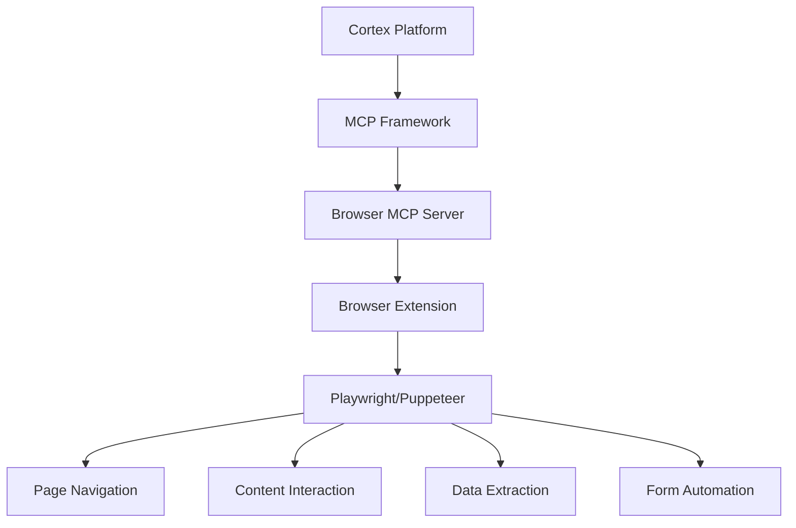
```mermaid
graph TD
    A[Cortex Platform] --> B[MCP Framework]
    B --> C[Browser MCP Server]
    C --> D[Browser Extension]
    D --> E[Playwright/Puppeteer]
    E --> F[Page Navigation]
    E --> G[Content Interaction]
    E --> H[Data Extraction]
    E --> I[Form Automation]
```

- **Functionality**: Web automation and interaction
- **Key Features**:
  - Page navigation and control
  - Content analysis and extraction
  - Form filling and submission
  - Web research automation
  - Screenshot and visual analysis

#### M365 Integration

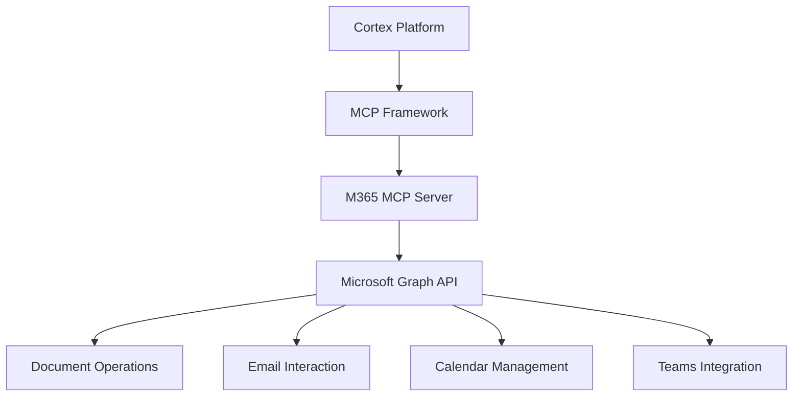
```mermaid
graph TD
    A[Cortex Platform] --> B[MCP Framework]
    B --> C[M365 MCP Server]
    C --> D[Microsoft Graph API]
    D --> E[Document Operations]
    D --> F[Email Interaction]
    D --> G[Calendar Management]
    D --> H[Teams Integration]
```

- **Functionality**: Microsoft ecosystem integration
- **Key Features**:
  - Office document creation and editing
  - Email composition and management
  - Calendar scheduling and organization
  - Teams meeting and chat integration
  - SharePoint document management

## Security Framework

The Integration Security Framework ensures safe and controlled access to external systems.

### Security Architecture

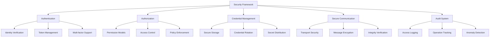
```mermaid
graph TD
    A[Security Framework] --> B[Authentication]
    A --> C[Authorization]
    A --> D[Credential Management]
    A --> E[Secure Communication]
    A --> F[Audit System]

    B --> B1[Identity Verification]
    B --> B2[Token Management]
    B --> B3[Multi-factor Support]

    C --> C1[Permission Models]
    C --> C2[Access Control]
    C --> C3[Policy Enforcement]

    D --> D1[Secure Storage]
    D --> D2[Credential Rotation]
    D --> D3[Secret Distribution]

    E --> E1[Transport Security]
    E --> E2[Message Encryption]
    E --> E3[Integrity Verification]

    F --> F1[Access Logging]
    F --> F2[Operation Tracking]
    F --> F3[Anomaly Detection]
```

### Security Components

#### Authentication

Authentication verifies identity:

- **Identity Verification**: Confirming user/system identity
- **Token Management**: Handling authentication tokens
- **Multi-factor Support**: Additional verification methods

#### Authorization

Authorization controls access:

- **Permission Models**: Defining access rights
- **Access Control**: Enforcing permissions
- **Policy Enforcement**: Applying security policies

#### Credential Management

Credential Management handles secrets:

- **Secure Storage**: Protected credential storage
- **Credential Rotation**: Regular key updates
- **Secret Distribution**: Secure credential delivery

#### Secure Communication

Secure Communication protects data in transit:

- **Transport Security**: TLS and other protocols
- **Message Encryption**: Content-level encryption
- **Integrity Verification**: Message signature verification

#### Audit System

The Audit System tracks security events:

- **Access Logging**: Recording access attempts
- **Operation Tracking**: Logging performed actions
- **Anomaly Detection**: Identifying suspicious patterns

### Security Patterns

The framework implements several security patterns:

#### Least Privilege Access

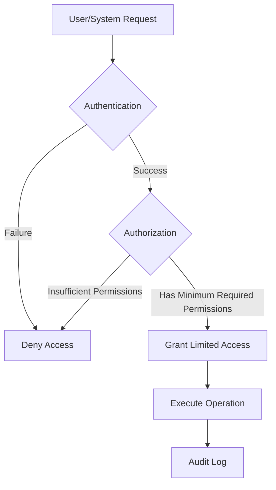
```mermaid
graph TD
    A[User/System Request] --> B{Authentication}
    B -- Success --> C{Authorization}
    B -- Failure --> D[Deny Access]

    C -- Has Minimum Required Permissions --> E[Grant Limited Access]
    C -- Insufficient Permissions --> D

    E --> F[Execute Operation]
    F --> G[Audit Log]
```

- Only minimal necessary permissions are granted
- Granular permission scoping
- Just-in-time access provision
- Regular permission review

#### Secure Credential Flow

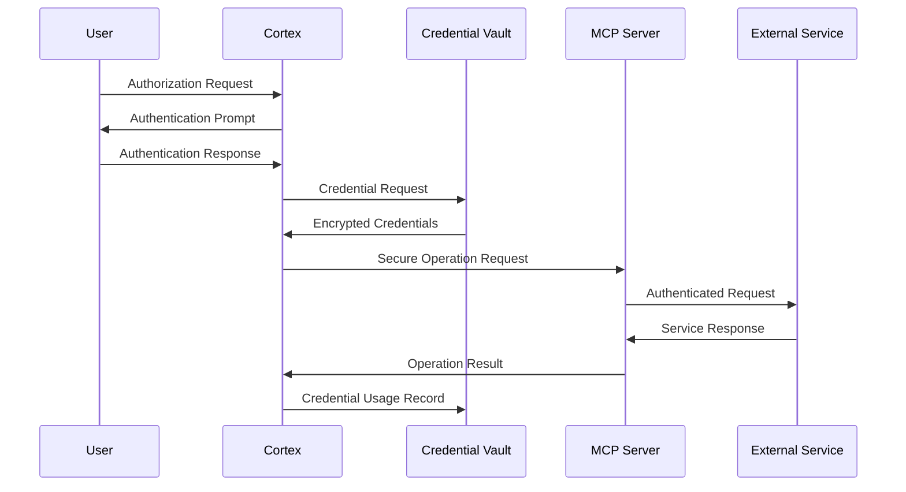
```mermaid
sequenceDiagram
    participant User
    participant Cortex
    participant Vault as Credential Vault
    participant MCP as MCP Server
    participant Service as External Service

    User->>Cortex: Authorization Request
    Cortex->>User: Authentication Prompt
    User->>Cortex: Authentication Response

    Cortex->>Vault: Credential Request
    Vault->>Cortex: Encrypted Credentials

    Cortex->>MCP: Secure Operation Request
    MCP->>Service: Authenticated Request
    Service->>MCP: Service Response
    MCP->>Cortex: Operation Result

    Cortex->>Vault: Credential Usage Record
```

- Credentials never exposed to users
- Temporary credential access
- Usage tracking and monitoring
- Automatic credential rotation

## Implementation Considerations

### Performance Optimization

Strategies for optimal integration performance:

- **Connection Pooling**: Reuse connections to reduce overhead
- **Request Batching**: Combine multiple operations
- **Parallel Execution**: Concurrent processing where appropriate
- **Caching Strategy**: Multi-level caching for frequent operations
- **Selective Retrieval**: Fetch only required data

### Reliability Patterns

Approaches for ensuring reliable integration:

- **Circuit Breaker**: Prevent cascading failures
- **Retry Policies**: Intelligent retry mechanisms
- **Fallback Options**: Alternative execution paths
- **Idempotent Operations**: Safe retry capabilities
- **Health Monitoring**: Proactive health checks

### Scalability Considerations

Design for integration scalability:

- **Stateless Design**: Enable horizontal scaling
- **Load Distribution**: Balance across integration points
- **Throttling Mechanisms**: Prevent overload
- **Asynchronous Processing**: Decouple request handling
- **Resource Quotas**: Controlled resource utilization

## Conclusion

The Integration Architecture, built around the MCP Protocol, is a fundamental enabler of Cortex's unified intelligence vision. By providing a standardized, extensible framework for connecting with external tools and services, it allows Cortex to serve as an intelligence layer that enhances rather than replaces existing digital ecosystems.

The MCP Protocol's well-defined structure, combined with comprehensive discovery mechanisms and robust security controls, creates a foundation for continuous expansion of Cortex's integration capabilities. As the protocol and its implementations evolve, the platform will increasingly deliver on its promise of seamless intelligence across all digital touchpoints.

Through this sophisticated integration architecture, Cortex transcends the limitations of conventional AI assistants, becoming a true orchestrator of intelligence across the entire digital experience.
