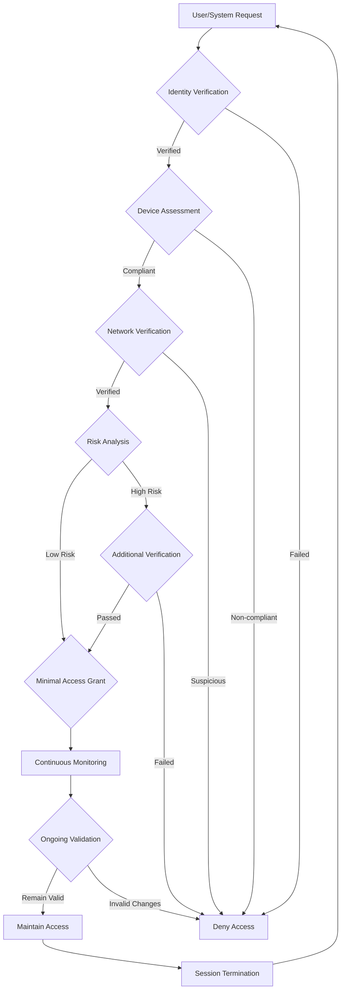
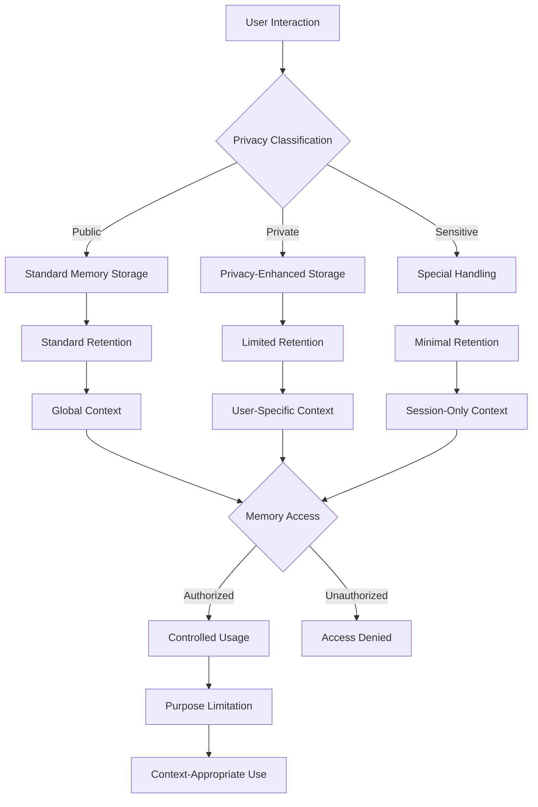
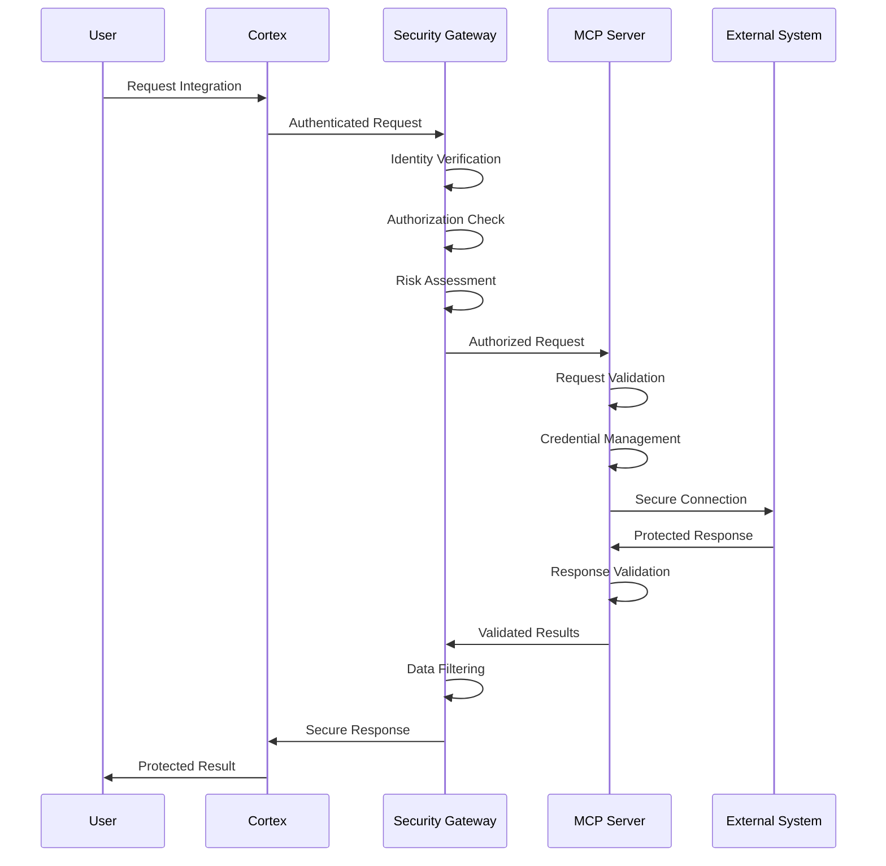

# Cortex Platform: Security and Privacy by Design

_Version: 1.0_  
_Date: 2025-03-04_

## Introduction

This document outlines the security and privacy architecture of the Cortex Platform. Security and privacy are not merely features but foundational principles embedded throughout the platform's design, development, and operation. As an AI platform that spans multiple contexts and accesses diverse data sources, Cortex's approach to security and privacy must be comprehensive, adaptable, and proactive.

The Cortex security and privacy architecture follows the principle of "Security and Privacy by Design," ensuring that these considerations are built into the system architecture from the beginning rather than added as afterthoughts. This approach is essential for establishing and maintaining user trust in a system that serves as a unified intelligence layer across digital experiences.

## Security and Privacy Principles

The Cortex Platform is built on the following core security and privacy principles:

### 1. Defense in Depth

Multiple security layers provide redundant protection so that the compromise of a single control does not expose the entire system.

### 2. Least Privilege

All components, users, and processes operate with the minimum permissions necessary to perform their functions and for the minimum time required.

### 3. Zero Trust Architecture

No entity is inherently trusted; verification is required regardless of location or network, with continuous validation throughout interactions.

### 4. Privacy by Default

The system assumes the most privacy-protective settings by default, requiring explicit actions to reduce privacy protections.

### 5. Data Minimization

Only the minimum necessary data is collected, processed, and retained to fulfill the specified purpose.

### 6. Transparency and Control

Users have clear visibility into what data is collected and how it is used, with meaningful controls over their information.

### 7. Secure by Design

Security is integrated into the development process from requirements through deployment and maintenance.

### 8. Continuous Validation

Regular testing, monitoring, and improvement ensure that security and privacy controls remain effective against evolving threats.

## Security Architecture Overview

```mermaid
graph TD
    A[Cortex Security Architecture] --> B[Authentication & Identity]
    A --> C[Authorization & Access Control]
    A --> D[Data Protection]
    A --> E[Communication Security]
    A --> F[System Security]
    A --> G[Privacy Controls]
    A --> H[Monitoring & Response]

    B --> B1[Identity Management]
    B --> B2[Authentication Methods]
    B --> B3[Session Management]

    C --> C1[Role-Based Access Control]
    C --> C2[Context-Based Authorization]
    C --> C3[Resource Permissions]

    D --> D1[Data Classification]
    D --> D2[Encryption]
    D --> D3[Secure Storage]
    D --> D4[Retention Controls]

    E --> E1[Transport Security]
    E --> E2[API Security]
    E --> E3[Integration Security]

    F --> F1[Secure Configuration]
    F --> F2[Vulnerability Management]
    F --> F3[Secure Development]

    G --> G1[Privacy Architecture]
    G --> G2[Consent Management]
    G --> G3[Data Subject Rights]

    H --> H1[Security Monitoring]
    H --> H2[Incident Response]
    H --> H3[Threat Intelligence]
```

## Authentication and Identity

The authentication and identity system verifies and manages user and system identities.

### Identity Management

- **Unified Identity Framework**: Centralized identity management across all Cortex touchpoints
- **Identity Provider Integration**: Support for external identity providers (OAuth 2.0, OIDC, SAML)
- **Identity Verification**: Multi-factor verification of user identity claims
- **Delegated Identity**: Secure delegation patterns for third-party access

### Authentication Methods

- **Multi-Factor Authentication**: Combining multiple verification factors:

  - Knowledge factors (passwords, PINs)
  - Possession factors (tokens, authenticator apps)
  - Inherence factors (biometrics)
  - Location and context factors

- **Adaptive Authentication**: Risk-based authentication that adjusts requirements based on:

  - User behavior patterns
  - Device characteristics
  - Location information
  - Access request context
  - Threat intelligence

- **Passwordless Options**: Modern authentication alternatives:
  - FIDO2/WebAuthn support
  - Passkeys
  - Magic links
  - Biometric authentication

### Session Management

- **Secure Session Handling**: Protection of active sessions:

  - Secure session token generation
  - Token validation on every request
  - Anti-forgery protections
  - Session timeout and inactivity management

- **Cross-Device Sessions**: Managing sessions across multiple devices:

  - Synchronized session state
  - Device-specific security policies
  - Unified session visibility
  - Selective session termination

- **Session Monitoring**: Continuous session security:
  - Anomaly detection
  - Concurrent session controls
  - Session recording for sensitive operations
  - Real-time security alerts

## Authorization and Access Control

The authorization system governs access to resources and capabilities.

### Role-Based Access Control

- **Role Hierarchy**: Structured organization of permissions:

  - Organizational roles
  - Functional roles
  - Custom roles
  - Role inheritance

- **Permission Management**: Granular control over capabilities:

  - Feature-based permissions
  - Data access permissions
  - Administrative permissions
  - Integration permissions

- **Role Assignment**: Controlled association of roles to identities:
  - Direct assignment
  - Group-based assignment
  - Dynamic assignment
  - Time-limited roles

### Context-Based Authorization

- **Contextual Factors**: Adaptive authorization based on:

  - User context (role, department, location)
  - Environmental context (time, device, network)
  - Resource context (sensitivity, type, owner)
  - Operational context (activity type, previous actions)

- **Authorization Policies**: Rule-based access decision framework:

  - Policy definition language
  - Policy evaluation engine
  - Policy conflict resolution
  - Policy auditing and validation

- **Just-In-Time Access**: Dynamic privilege elevation:
  - Temporary permission grants
  - Purpose-limited access
  - Approval workflows
  - Automatic expiration

### Resource Permissions

- **Resource Protection Model**: Multi-layered resource security:

  - Resource ownership
  - Access control lists
  - Capability-based security
  - Attribute-based access control

- **Permission Inheritance**: Hierarchical permission structures:

  - Container-based inheritance
  - Template-based permissions
  - Default permission sets
  - Override mechanisms

- **Permission Enforcement**: Multi-point validation:
  - API gateway enforcement
  - Service-level enforcement
  - Data layer enforcement
  - Client-side validation

## Data Protection

Data protection encompasses the controls that safeguard information throughout its lifecycle.

### Data Classification

- **Classification Framework**: Categorization of data sensitivity:

  - Public data
  - Internal data
  - Confidential data
  - Restricted data
  - Personal data

- **Automated Classification**: Identification of sensitive data:

  - Pattern matching
  - Content analysis
  - Metadata examination
  - Context evaluation

- **Classification Governance**: Management of classification:
  - Classification policies
  - Regular review processes
  - Classification updates
  - Classification monitoring

### Encryption Strategy

- **Encryption Layers**: Protection at multiple levels:

  - Storage encryption
  - Transport encryption
  - Application-level encryption
  - Field-level encryption

- **Key Management**: Secure handling of cryptographic keys:

  - Key generation
  - Key rotation
  - Key storage
  - Key recovery

- **Encryption Algorithms**: Strong cryptographic standards:
  - AES-256 for symmetric encryption
  - RSA-4096/ECC for asymmetric encryption
  - SHA-256+ for hashing
  - Regular cryptographic review

### Secure Storage

- **Data Isolation**: Separation of sensitive information:

  - Multi-tenant isolation
  - Logical data segregation
  - Physical separation for highest sensitivity
  - Isolation verification

- **Secure Databases**: Protected data repositories:

  - Access controls
  - Encryption at rest
  - Audit logging
  - Backup protection

- **Secure Memory Handling**: Protection of in-memory data:
  - Memory encryption
  - Secure memory allocation
  - Memory wiping
  - Anti-memory dump protections

### Data Retention and Deletion

- **Retention Policies**: Controlled data lifecycle:

  - Purpose-based retention periods
  - Legal hold management
  - Retention policy enforcement
  - Policy-based archiving

- **Secure Deletion**: Irrecoverable data removal:

  - Secure deletion methods
  - Deletion verification
  - Media sanitization
  - Deletion certification

- **Retention Controls**: User management of data:
  - Retention preferences
  - Manual deletion options
  - Retention visibility
  - Retention exceptions

## Communication Security

Communication security ensures that all data in transit is protected.

### Transport Security

- **Secure Protocols**: Protection of network communications:

  - TLS 1.3 for all HTTP traffic
  - Secure WebSocket (WSS)
  - Mutual TLS for service-to-service
  - VPN for administrative access

- **Certificate Management**: Handling of TLS certificates:

  - Automated certificate provisioning
  - Certificate rotation
  - Certificate validation
  - Certificate transparency

- **Network Controls**: Network-level protections:
  - Network segmentation
  - Traffic filtering
  - DDoS protection
  - Traffic encryption

### API Security

- **API Protection**: Securing API endpoints:

  - Authentication for all endpoints
  - Rate limiting
  - Input validation
  - Output encoding

- **API Gateway**: Centralized API protection:

  - Request validation
  - Response filtering
  - Threat protection
  - Throttling and quotas

- **API Versioning**: Secure API evolution:
  - Secure deprecation process
  - Backward compatibility
  - Security improvements
  - Version-specific controls

### Integration Security

- **Secure Integration Patterns**: Protection of external connections:

  - Secure credential handling
  - Connection authentication
  - Data validation
  - Integration monitoring

- **MCP Security**: Protections for the MCP protocol:

  - Authentication requirements
  - Authorization framework
  - Traffic encryption
  - Message integrity verification

- **Third-Party Controls**: Management of external integrations:
  - Integration approval process
  - Security assessment
  - Continuous monitoring
  - Integration revocation

## System Security

System security covers the protections applied to the underlying infrastructure and applications.

### Secure Configuration

- **Hardened Defaults**: Security-first configuration:

  - Secure default settings
  - Unnecessary feature disablement
  - Minimal attack surface
  - Configuration validation

- **Configuration Management**: Control of system settings:

  - Configuration as code
  - Change control
  - Configuration monitoring
  - Drift detection

- **Secrets Management**: Protection of credentials and keys:
  - Centralized secrets vault
  - Dynamic secrets
  - Secret rotation
  - Access controls on secrets

### Vulnerability Management

- **Vulnerability Scanning**: Proactive issue identification:

  - Regular automated scanning
  - Penetration testing
  - Code security analysis
  - Dependency scanning

- **Patch Management**: Timely security updates:

  - Vulnerability prioritization
  - Patching processes
  - Emergency patching
  - Patch verification

- **Bug Bounty Program**: External security input:
  - Vulnerability reporting process
  - Researcher reward program
  - Responsible disclosure
  - Finding remediation

### Secure Development

- **Secure SDLC**: Security throughout development:

  - Security requirements
  - Threat modeling
  - Secure code reviews
  - Security testing

- **DevSecOps**: Automated security validation:

  - Security in CI/CD
  - Automated security testing
  - Security gates
  - Security as code

- **Secure Coding Standards**: Code-level security guidance:
  - Language-specific guidelines
  - Common vulnerability prevention
  - Code analysis tools
  - Security training

## Privacy Architecture

The privacy architecture ensures that Cortex respects user privacy by design.

### Privacy Framework

```mermaid
graph TD
    A[Privacy Framework] --> B[Data Collection]
    A --> C[Data Processing]
    A --> D[Data Access]
    A --> E[Data Sharing]
    A --> F[User Controls]
    A --> G[Compliance]

    B --> B1[Minimization]
    B --> B2[Purpose Limitation]
    B --> B3[Collection Notices]

    C --> C1[Processing Rules]
    C --> C2[Anonymization]
    C --> C3[Data Quality]

    D --> D1[Access Controls]
    D --> D2[Privacy Filters]
    D --> D3[Authorized Access]

    E --> E1[Sharing Controls]
    E --> E2[Transfer Safeguards]
    E --> E3[Third-Party Requirements]

    F --> F1[Preference Center]
    F --> F2[Consent Management]
    F --> F3[Rights Fulfillment]

    G --> G1[Policy Enforcement]
    G --> G2[Documentation]
    G --> G3[Impact Assessment]
```

### Data Collection Controls

- **Data Minimization**: Limiting collected data:

  - Necessity-based collection
  - Granular collection controls
  - Collection purpose documentation
  - Collection monitoring

- **Purpose Limitation**: Restricting data usage:

  - Explicit purpose definition
  - Purpose linkage to data elements
  - Purpose-based access control
  - Purpose limitation enforcement

- **Collection Transparency**: Clear data practices:
  - Just-in-time notices
  - Layered privacy information
  - Data collection indicators
  - Data usage explanations

### Privacy-Preserving Processing

- **Privacy-Enhancing Technologies**: Advanced protection methods:

  - Differential privacy
  - Federated learning
  - Homomorphic encryption
  - Secure multi-party computation

- **Data Anonymization**: Identity protection methods:

  - Anonymization techniques
  - Pseudonymization
  - Aggregation
  - Re-identification prevention

- **Local Processing**: On-device computation:
  - Edge processing
  - Client-side analysis
  - Minimal data transmission
  - Offline capabilities

### Privacy by Default

- **Default Settings**: Privacy-first defaults:

  - Minimal data sharing
  - Limited retention periods
  - Feature-specific privacy
  - Conservative defaults

- **Privacy Filters**: Automatic content protection:

  - PII detection and redaction
  - Sensitive data filtering
  - Screenshot protections
  - Context-aware filtering

- **Memory Privacy**: Protection of conversation history:
  - User-controlled retention
  - Selective memory clearing
  - Memory visibility controls
  - Memory export options

### Data Subject Rights

- **Rights Management**: Supporting privacy rights:

  - Right to access
  - Right to rectification
  - Right to erasure
  - Right to restriction
  - Right to portability
  - Right to object

- **Rights Fulfillment Process**: Handling privacy requests:

  - Request verification
  - Scope determination
  - Execution workflow
  - Response delivery
  - Exception handling

- **Self-Service Controls**: User-managed privacy:
  - Privacy dashboard
  - Data access tools
  - Deletion utilities
  - Export functionality

### Consent Management

- **Consent Framework**: Structured permission management:

  - Granular consent options
  - Consent tracking
  - Consent evidence
  - Consent versioning

- **Consent Collection**: Obtaining valid consent:

  - Explicit opt-in mechanisms
  - Clear consent language
  - Withdrawal options
  - Consent renewal

- **Consent Enforcement**: Honoring user choices:
  - Consent-based processing rules
  - Automatic enforcement
  - Consent verification
  - Preference signals (GPC)

## Compliance Framework

The compliance framework ensures that Cortex meets legal and regulatory requirements.

### Regulatory Compliance

- **Regulatory Mapping**: Alignment with regulations:

  - GDPR
  - CCPA/CPRA
  - HIPAA (where applicable)
  - Industry-specific regulations
  - Regional data protection laws

- **Compliance Controls**: Implementation of requirements:

  - Control mapping
  - Control implementation
  - Control monitoring
  - Gap remediation

- **Compliance Documentation**: Evidence maintenance:
  - Policy documentation
  - Procedure documentation
  - Compliance records
  - Control evidence

### Privacy Impact Assessment

- **Assessment Process**: Evaluating privacy implications:

  - Risk identification
  - Impact evaluation
  - Control adequacy
  - Residual risk assessment

- **Design Reviews**: Privacy in development:

  - Design stage reviews
  - Architecture validation
  - Feature privacy analysis
  - Data flow examination

- **Continuous Assessment**: Ongoing evaluation:
  - Change-triggered assessments
  - Periodic reviews
  - External validation
  - Improvement identification

### Data Governance

- **Data Inventory**: Tracking data assets:

  - Data mapping
  - Classification
  - Ownership assignment
  - Purpose documentation

- **Data Quality**: Ensuring appropriate data:

  - Accuracy validation
  - Completeness checking
  - Relevance assessment
  - Timeliness verification

- **Data Lineage**: Tracking data flow:
  - Origin tracking
  - Transformation history
  - Usage tracking
  - End-of-life management

## Security Monitoring and Response

The security monitoring and response system ensures detection and mitigation of threats.

### Security Monitoring

- **Comprehensive Logging**: Record of security events:

  - Authentication events
  - Authorization decisions
  - Data access
  - System changes
  - Security alerts

- **Threat Detection**: Identification of potential attacks:

  - Behavioral analysis
  - Pattern matching
  - Anomaly detection
  - Correlation analysis

- **Continuous Monitoring**: Real-time security awareness:
  - Security information management
  - Real-time monitoring
  - Alert prioritization
  - Monitoring coverage validation

### Incident Response

- **Response Process**: Handling security events:

  - Incident classification
  - Response procedures
  - Escalation paths
  - Post-incident analysis

- **Incident Playbooks**: Predefined response guidance:

  - Common incident types
  - Response steps
  - Role responsibilities
  - Communication templates

- **Breach Notification**: Managing disclosure:
  - Notification requirements
  - Notification timing
  - Communication channels
  - Stakeholder management

### Threat Intelligence

- **Intelligence Collection**: Gathering security information:

  - External threat feeds
  - Industry sharing
  - Vulnerability alerts
  - Attack pattern analysis

- **Intelligence Application**: Using threat data:

  - Control adjustment
  - Detection enhancement
  - Proactive blocking
  - Risk prioritization

- **Threat Modeling**: Systematic threat analysis:
  - Asset identification
  - Threat identification
  - Vulnerability assessment
  - Risk analysis
  - Control implementation

## Implementation Patterns

### Zero Trust Implementation

Key elements of the Zero Trust implementation:

1. **Never Trust, Always Verify**: Continuous authentication and authorization for every access request
2. **Least Privilege Access**: Minimal permissions necessary for the specific task
3. **Micro-Segmentation**: Fine-grained separation of resources
4. **Continuous Monitoring**: Real-time visibility into all access and activities
5. **Device Validation**: Verification of device security posture
6. **Risk-Based Authentication**: Adaptive security based on risk signals

### Privacy-Preserving Memory

Key elements of privacy-preserving memory:

1. **Tiered Storage**: Different handling based on sensitivity
2. **User Control**: Explicit user management of memory retention
3. **Automatic Expiration**: Time-based removal of sensitive information
4. **Selective Recall**: Context-appropriate memory retrieval
5. **Purpose Binding**: Memory used only for authorized purposes
6. **Memory Redaction**: Automatic filtering of sensitive elements

### Secure Integration Pattern

Key elements of the secure integration pattern:

1. **Gateway Protection**: Centralized security enforcement
2. **Request Validation**: Verification of all integration requests
3. **Secure Credential Handling**: Protection of integration credentials
4. **Response Filtering**: Inspection of returned data
5. **Least Privilege**: Minimal necessary access to external systems
6. **Activity Monitoring**: Logging and analysis of integration activities

## Security and Privacy Roadmap

The security and privacy capabilities will evolve through several phases:

### Foundation Phase (Q2-Q3 2025)

- Basic authentication and authorization framework
- Core data protection mechanisms
- Essential privacy controls
- Foundational security monitoring
- Initial compliance documentation

### Expansion Phase (Q4 2025)

- Enhanced authentication options
- Advanced authorization controls
- Privacy-enhancing technologies
- Expanded security monitoring
- Comprehensive compliance framework

### Maturity Phase (Q1-Q2 2026)

- Adaptive security controls
- Privacy automation
- Threat intelligence integration
- Advanced analytics-based detection
- Cross-environment security

### Ecosystem Phase (Q3-Q4 2026)

- Third-party security framework
- Ecosystem trust architecture
- Collaborative security mechanisms
- Privacy-preserving information sharing
- Community-based security and privacy

## Conclusion

The Cortex Platform's security and privacy architecture exemplifies the principles of Security and Privacy by Design, with protections embedded deeply throughout all aspects of the system. This approach is essential for a platform that serves as a unified intelligence layer across diverse digital contexts, where trust is a foundational requirement.

By implementing multiple layers of defense, comprehensive privacy controls, and continuous security validation, Cortex establishes a foundation of trustworthiness that enables users to confidently leverage the platform's capabilities while maintaining appropriate protection for sensitive information and systems.

As the platform evolves, the security and privacy architecture will continue to advance, incorporating new protective technologies, adapting to emerging threats, and enhancing user control over their data and digital experiences. This ongoing evolution will ensure that Cortex remains at the forefront of secure, privacy-respecting AI assistants.
