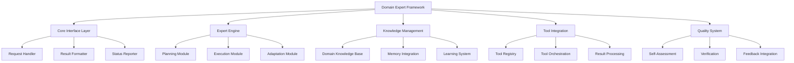
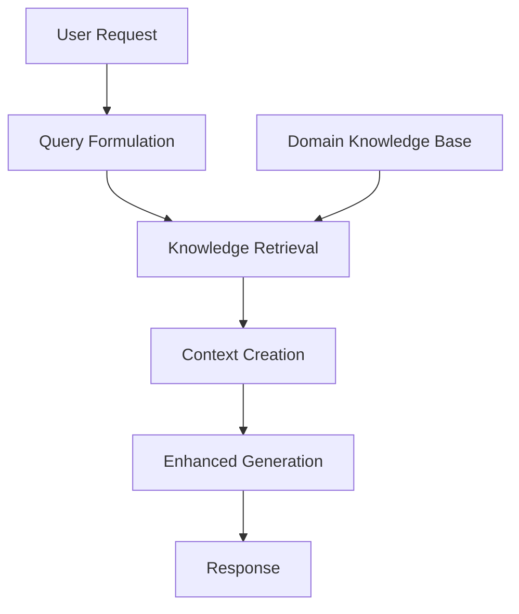
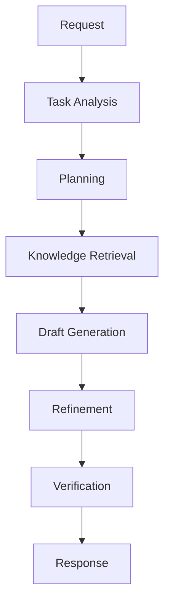
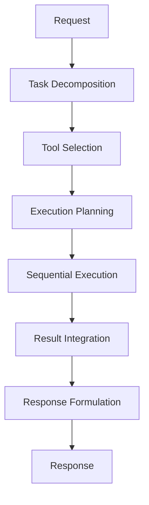
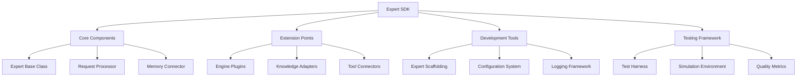
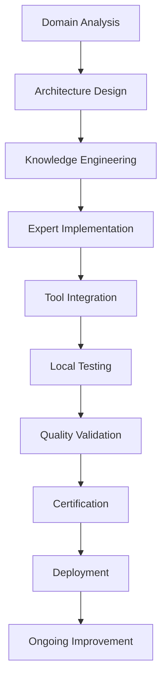
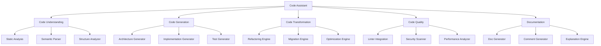
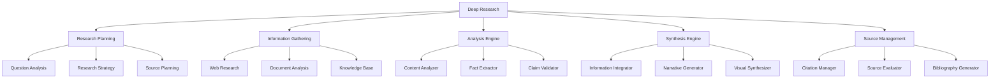
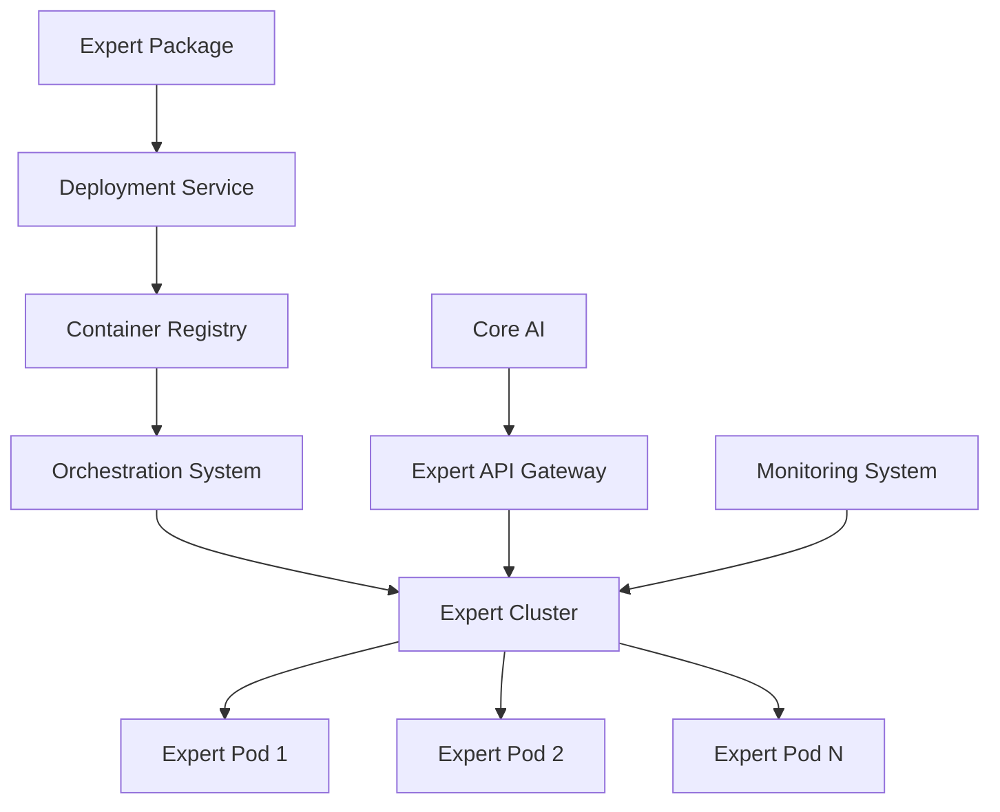

# Cortex Platform: Domain Expert Implementation

_Version: 1.0_  
_Date: 2025-03-04_

## Introduction

This document provides detailed technical guidance for the implementation of Domain Experts within the Cortex Platform. Domain Experts are specialized AI systems that provide deep expertise in specific domains while integrating seamlessly with the Core AI and overall platform architecture.

The implementation approach detailed in this document addresses several key considerations:

1. Consistent interfaces for seamless integration with Core AI
2. Flexibility to accommodate domain-specific architectures and techniques
3. Balance between autonomy and coordination with the broader system
4. Standardized patterns that accelerate expert development
5. Quality assurance mechanisms to ensure reliable expertise

## Domain Expert Framework

### Framework Architecture

The Domain Expert Framework provides a standardized structure for all experts:



### Core Components

#### Core Interface Layer

The Core Interface Layer standardizes communication with the Core AI:

- **Request Handler**: Processes incoming requests from Core AI

  - Request validation
  - Priority determination
  - Resource allocation
  - Request parsing and normalization

- **Result Formatter**: Prepares outputs for Core AI

  - Response structuring
  - Format standardization
  - Metadata inclusion
  - Quality annotations

- **Status Reporter**: Provides execution updates
  - Progress indicators
  - Milestone notifications
  - Blocker reporting
  - Resource utilization updates

#### Expert Engine

The Expert Engine implements domain-specific intelligence:

- **Planning Module**: Determines approach for tasks

  - Task analysis
  - Strategy selection
  - Resource planning
  - Step sequencing

- **Execution Module**: Performs domain operations

  - Task execution
  - Progress tracking
  - Error handling
  - Dynamic adaptation

- **Adaptation Module**: Adjusts to context
  - User preference integration
  - Context-specific customization
  - Environmental adaptation
  - Performance optimization

#### Knowledge Management

Knowledge Management handles domain expertise:

- **Domain Knowledge Base**: Stores domain-specific knowledge

  - Factual knowledge
  - Procedural knowledge
  - Heuristics and best practices
  - Reference examples

- **Memory Integration**: Connects with JAKE memory

  - Context retrieval
  - Memory contribution
  - Episodic memory integration
  - Entity updates

- **Learning System**: Improves over time
  - Feedback processing
  - Knowledge updating
  - Performance tracking
  - Continuous improvement

#### Tool Integration

Tool Integration enables use of external tools:

- **Tool Registry**: Manages available tools

  - Tool capability mapping
  - Tool metadata management
  - Tool selection logic
  - Tool dependency tracking

- **Tool Orchestration**: Coordinates tool usage

  - Parameter preparation
  - Execution sequencing
  - Error handling
  - Result collection

- **Result Processing**: Handles tool outputs
  - Result validation
  - Format conversion
  - Error recovery
  - Integration into solutions

#### Quality System

The Quality System ensures reliable outputs:

- **Self-Assessment**: Evaluates own performance

  - Output quality checking
  - Confidence estimation
  - Limitation identification
  - Alternative generation

- **Verification**: Validates correctness

  - Fact checking
  - Consistency validation
  - Requirement satisfaction
  - Error detection

- **Feedback Integration**: Processes improvement signals
  - User feedback processing
  - Core AI feedback integration
  - Performance analytics
  - Improvement planning

## Implementation Technologies

### Expert Engine Implementation

Domain Experts typically employ these technologies:

#### Foundation Models

- **Domain-Specific Models**:

  - Fine-tuned general models (adapted to domain)
  - Specialist models (trained specifically for domain)
  - Multi-task models (handling domain-specific tasks)
  - Small expert models (efficient domain processing)

- **Model Integration Patterns**:
  - Model ensembles (combining multiple models)
  - Model cascades (progressive application)
  - Mixture of experts (dynamic model selection)
  - Retrieval-augmented generation (knowledge integration)

#### Knowledge Representation

- **Knowledge Storage**:

  - Vector databases (embedding storage)
  - Graph databases (relationship representation)
  - Document stores (unstructured knowledge)
  - Structured databases (formal knowledge)

- **Knowledge Structures**:
  - Knowledge graphs (entity-relationship representation)
  - Ontologies (domain concept formalization)
  - Procedural representations (process encoding)
  - Case libraries (exemplar storage)

#### Specialized Components

- **Domain-Specific Processors**:

  - Custom parsers (domain language processing)
  - Specialized analyzers (domain-specific analysis)
  - Task-specific generators (domain output creation)
  - Validation engines (domain correctness checking)

- **Hybrid Approaches**:
  - Symbolic-neural integration (combining approaches)
  - Rule-based components (explicit knowledge encoding)
  - Statistical components (pattern learning)
  - Simulation-based components (behavior modeling)

### Common Implementation Patterns

Several implementation patterns are common across experts:

#### Retrieval-Augmented Generation



Implementation approach:

```python
class RAGExpert:
    def process_request(self, request, context):
        # Generate knowledge base query
        query = self._formulate_query(request, context)

        # Retrieve relevant knowledge
        knowledge_items = self._retrieve_knowledge(query)

        # Create enhanced context with knowledge
        enhanced_context = self._create_context(request, context, knowledge_items)

        # Generate response using enhanced context
        response = self._generate_response(request, enhanced_context)

        # Validate and refine
        validated = self._validate_response(response, knowledge_items)

        return validated
```

#### Multi-Stage Processing



Implementation approach:

```python
class MultiStageExpert:
    def process_request(self, request, context):
        # Analyze the task
        analysis = self._analyze_task(request, context)

        # Create execution plan
        plan = self._create_plan(analysis)

        # Retrieve necessary knowledge
        knowledge = self._retrieve_knowledge(analysis, plan)

        # Generate initial draft
        draft = self._generate_draft(plan, knowledge)

        # Refine the draft
        refined = self._refine_output(draft, analysis)

        # Verify correctness
        verified = self._verify_output(refined, analysis)

        return verified
```

#### Tool Orchestration



Implementation approach:

```python
class ToolOrchestrationExpert:
    def process_request(self, request, context):
        # Break down into tool-specific tasks
        tasks = self._decompose_task(request, context)

        # Select appropriate tools
        tool_selections = self._select_tools(tasks)

        # Plan execution sequence
        execution_plan = self._plan_execution(tool_selections)

        # Execute tools in sequence
        results = {}
        for step in execution_plan:
            step_result = self._execute_tool(step.tool, step.parameters)
            results[step.id] = step_result

        # Integrate results
        integrated = self._integrate_results(results, execution_plan)

        # Formulate response
        response = self._formulate_response(integrated, request)

        return response
```

## Expert SDK

The Expert SDK provides standard components for building experts:

### SDK Architecture



### Core SDK Components

#### Base Classes

```python
class DomainExpert:
    """Base class for all Domain Experts"""

    def __init__(self, config):
        self.config = config
        self.memory_connector = MemoryConnector(config.memory_settings)
        self.tool_manager = ToolManager(config.tool_settings)
        self.knowledge_base = self._init_knowledge_base(config.knowledge_settings)
        self.quality_system = QualitySystem(config.quality_settings)

    def process_request(self, request, context):
        """Main entry point for processing requests"""
        # Validate request
        validated = self._validate_request(request)

        # Retrieve relevant context
        enhanced_context = self._enhance_context(context)

        # Process the request
        result = self._process_validated_request(validated, enhanced_context)

        # Assess quality
        assessed = self._assess_quality(result, validated, enhanced_context)

        # Format response
        response = self._format_response(assessed, validated)

        return response

    # Abstract methods to be implemented by specific experts
    def _validate_request(self, request):
        raise NotImplementedError

    def _enhance_context(self, context):
        raise NotImplementedError

    def _process_validated_request(self, request, context):
        raise NotImplementedError

    def _assess_quality(self, result, request, context):
        raise NotImplementedError

    def _format_response(self, result, request):
        raise NotImplementedError

    def _init_knowledge_base(self, settings):
        raise NotImplementedError
```

#### Memory Integration

```python
class MemoryConnector:
    """Handles integration with JAKE memory system"""

    def __init__(self, settings):
        self.settings = settings
        self.client = JakeClient(settings.endpoint, settings.auth)

    def retrieve_context(self, query, scope=None):
        """Retrieve relevant memory items based on query"""
        return self.client.query_memory(query, scope)

    def contribute_memory(self, memory_item):
        """Add new memory item to JAKE"""
        return self.client.store_memory(memory_item)

    def update_entity(self, entity_id, updates):
        """Update an entity in JAKE"""
        return self.client.update_entity(entity_id, updates)

    def retrieve_entities(self, entity_filter):
        """Retrieve entities matching the filter"""
        return self.client.query_entities(entity_filter)
```

#### Tool Integration

```python
class ToolManager:
    """Manages integration with external tools"""

    def __init__(self, settings):
        self.settings = settings
        self.registry = self._load_tool_registry()

    def _load_tool_registry(self):
        """Load available tools from configuration"""
        registry = {}
        for tool_config in self.settings.tools:
            registry[tool_config.id] = ToolConnector(tool_config)
        return registry

    def execute_tool(self, tool_id, parameters):
        """Execute a specific tool with parameters"""
        if tool_id not in self.registry:
            raise ToolNotFoundError(f"Tool {tool_id} not found")

        tool = self.registry[tool_id]
        return tool.execute(parameters)

    def suggest_tools(self, task_description):
        """Suggest appropriate tools for a task"""
        matches = []
        for tool_id, tool in self.registry.items():
            score = tool.match_score(task_description)
            if score > self.settings.match_threshold:
                matches.append((tool_id, score))

        return sorted(matches, key=lambda x: x[1], reverse=True)
```

### Extension Points

The SDK provides several extension points:

- **Engine Plugins**: Custom processing logic

  ```python
  class CustomPlannerPlugin(PlannerPlugin):
      def create_plan(self, task, context):
          # Custom planning logic
          return Plan(...)
  ```

- **Knowledge Adapters**: Custom knowledge sources

  ```python
  class CustomKnowledgeAdapter(KnowledgeAdapter):
      def query(self, query_params):
          # Custom knowledge retrieval
          return KnowledgeItems(...)
  ```

- **Tool Connectors**: Custom tool integration
  ```python
  class CustomToolConnector(ToolConnector):
      def execute(self, parameters):
          # Custom tool execution
          return ToolResult(...)
  ```

## Expert Development Process

### Development Workflow

The process for creating a new Domain Expert:



1. **Domain Analysis**: Understanding the domain

   - Scope definition
   - Task identification
   - User needs assessment
   - Existing solution analysis

2. **Architecture Design**: Expert-specific architecture

   - Processing approach selection
   - Component identification
   - Data flow design
   - Integration point mapping

3. **Knowledge Engineering**: Building the knowledge base

   - Knowledge acquisition
   - Knowledge structuring
   - Knowledge validation
   - Knowledge loading

4. **Expert Implementation**: Building the expert

   - Core processing implementation
   - Domain-specific algorithms
   - Quality mechanisms
   - Performance optimization

5. **Tool Integration**: Connecting domain tools

   - Tool selection
   - Integration development
   - Tool orchestration
   - Testing and validation

6. **Local Testing**: Initial validation

   - Unit testing
   - Integration testing
   - Performance testing
   - Edge case validation

7. **Quality Validation**: Comprehensive assessment

   - Expert capability testing
   - Integration testing
   - Security review
   - Performance benchmarking

8. **Certification**: Official validation

   - Interface compliance
   - Quality verification
   - Security assessment
   - Documentation review

9. **Deployment**: Production release

   - Staging deployment
   - Monitoring setup
   - Production release
   - Integration verification

10. **Ongoing Improvement**: Continuous enhancement
    - Performance monitoring
    - Feedback collection
    - Regular updates
    - Capability expansion

### Developer Tools

Tools to accelerate expert development:

- **Expert CLI**: Command-line development tools

  ```bash
  # Create a new expert project
  expert-cli create --name code-assistant --domain software-development

  # Run local testing
  expert-cli test --suite basic

  # Package expert for deployment
  expert-cli package --version 1.0.0
  ```

- **Expert Simulator**: Local testing environment

  ```python
  # Simulate expert execution
  from expert_sdk.simulator import ExpertSimulator

  simulator = ExpertSimulator('code-assistant')
  result = simulator.run_test_case('create_python_function')
  simulator.validate_result(result)
  ```

- **Knowledge Builder**: Knowledge base construction

  ```python
  # Build knowledge base
  from expert_sdk.knowledge import KnowledgeBuilder

  builder = KnowledgeBuilder('code-patterns')
  builder.add_document('design-patterns.md')
  builder.add_code_examples('examples/')
  builder.build('code-kb.json')
  ```

## Core Domain Expert Implementation

### Code Assistant Implementation

The Code Assistant expert implementation:

#### Architecture



#### Key Components

- **Code Understanding System**:

  ```python
  class CodeUnderstandingSystem:
      def analyze_code(self, code, context):
          # Parse code into AST
          ast = self._parse_code(code)

          # Extract structural information
          structure = self._extract_structure(ast)

          # Analyze semantics
          semantics = self._analyze_semantics(ast, structure)

          # Identify patterns
          patterns = self._identify_patterns(structure, semantics)

          return CodeAnalysis(structure, semantics, patterns)
  ```

- **Code Generation System**:

  ```python
  class CodeGenerationSystem:
      def generate_code(self, specification, context):
          # Plan code structure
          structure = self._plan_structure(specification)

          # Generate implementation
          implementation = self._generate_implementation(structure, specification)

          # Create tests
          tests = self._generate_tests(implementation, specification)

          # Add documentation
          documented = self._add_documentation(implementation, specification)

          return GeneratedCode(documented, tests)
  ```

- **Code Transformation System**:
  ```python
  class CodeTransformationSystem:
      def transform_code(self, code, transformation, context):
          # Analyze original code
          analysis = self._analyze_code(code)

          # Plan transformation
          transformation_plan = self._plan_transformation(analysis, transformation)

          # Execute transformation
          transformed = self._execute_transformation(code, transformation_plan)

          # Verify correctness
          verified = self._verify_transformation(code, transformed, transformation)

          return TransformedCode(verified)
  ```

#### Integration Points

- **VS Code Extension**: IDE integration

  ```javascript
  // VS Code extension integration
  class CodeAssistantProvider {
    async provideCompletions(document, position, context) {
      // Get document context
      const codeContext = this.extractContext(document, position);

      // Call expert through MCP
      const response = await this.expert.generateCompletion(codeContext);

      // Convert to VS Code completions
      return this.convertToCompletionItems(response);
    }
  }
  ```

- **Repository Integration**: Version control
  ```python
  class RepositoryConnector:
      def analyze_repository(self, repo_url):
          # Clone or update repository
          repo_path = self._ensure_repository(repo_url)

          # Analyze structure
          structure = self._analyze_structure(repo_path)

          # Extract key components
          components = self._extract_components(repo_path, structure)

          # Analyze dependencies
          dependencies = self._analyze_dependencies(repo_path)

          return RepoAnalysis(structure, components, dependencies)
  ```

### Deep Research Implementation

The Deep Research expert implementation:

#### Architecture



#### Key Components

- **Research Planning System**:

  ```python
  class ResearchPlanner:
      def create_research_plan(self, question, context):
          # Analyze research question
          analysis = self._analyze_question(question)

          # Identify research areas
          areas = self._identify_research_areas(analysis)

          # Plan research strategy
          strategy = self._create_strategy(areas, context)

          # Identify potential sources
          sources = self._identify_sources(strategy)

          return ResearchPlan(strategy, sources)
  ```

- **Information Gathering System**:

  ```python
  class InformationGatherer:
      def gather_information(self, research_plan, context):
          results = []

          # Execute web searches
          web_results = self._execute_web_research(research_plan)
          results.extend(web_results)

          # Analyze documents
          document_results = self._analyze_documents(research_plan)
          results.extend(document_results)

          # Query knowledge base
          kb_results = self._query_knowledge_base(research_plan)
          results.extend(kb_results)

          return GatheredInformation(results)
  ```

- **Synthesis Engine**:
  ```python
  class InformationSynthesizer:
      def synthesize_information(self, information, research_plan):
          # Extract key facts
          facts = self._extract_facts(information)

          # Identify patterns and themes
          patterns = self._identify_patterns(facts)

          # Resolve contradictions
          resolved = self._resolve_contradictions(facts, patterns)

          # Generate synthesized output
          synthesis = self._generate_synthesis(resolved, research_plan)

          return ResearchSynthesis(synthesis, facts)
  ```

#### Integration Points

- **Browser Integration**: Web research automation

  ```javascript
  // Browser extension integration
  class ResearchBrowserConnector {
    async conductWebResearch(query) {
      // Navigate to search engine
      await this.browser.navigate("https://search.example.com");

      // Execute search
      await this.browser.fill("#search-form", query);
      await this.browser.click("#search-button");

      // Extract results
      const results = await this.browser.extract(".search-result");

      // Process each relevant result
      const processedResults = [];
      for (const result of results.slice(0, 5)) {
        await this.browser.navigate(result.url);
        const content = await this.browser.extract("main");
        processedResults.push({
          url: result.url,
          title: result.title,
          content: content,
        });
      }

      return processedResults;
    }
  }
  ```

- **Document Processing**: Document analysis
  ```python
  class DocumentProcessor:
      def process_document(self, document_path):
          # Determine document type
          doc_type = self._detect_document_type(document_path)

          # Extract text based on type
          if doc_type == 'pdf':
              text = self._extract_from_pdf(document_path)
          elif doc_type == 'docx':
              text = self._extract_from_docx(document_path)
          else:
              text = self._extract_from_text(document_path)

          # Process structure
          structure = self._analyze_structure(text, doc_type)

          # Extract key content
          content = self._extract_key_content(text, structure)

          return ProcessedDocument(content, structure, doc_type)
  ```

## Expert Quality Assurance

### Quality Frameworks

Ensuring expert quality through structured assessment:

#### Self-Assessment System

```python
class SelfAssessmentSystem:
    def assess_output(self, output, request, context):
        # Check result completeness
        completeness = self._check_completeness(output, request)

        # Verify correctness
        correctness = self._verify_correctness(output, context)

        # Assess clarity
        clarity = self._assess_clarity(output)

        # Evaluate appropriateness
        appropriateness = self._evaluate_appropriateness(output, request, context)

        # Generate confidence score
        confidence = self._calculate_confidence(completeness, correctness, clarity, appropriateness)

        # Create assessment report
        assessment = OutputAssessment(
            confidence=confidence,
            completeness=completeness,
            correctness=correctness,
            clarity=clarity,
            appropriateness=appropriateness
        )

        return assessment
```

#### Verification Framework

```python
class VerificationFramework:
    def verify_output(self, output, reference_data=None):
        # Collect verification checks
        checks = []

        # Fact verification
        if hasattr(self, '_verify_facts'):
            fact_check = self._verify_facts(output, reference_data)
            checks.append(('facts', fact_check))

        # Logical consistency
        if hasattr(self, '_check_consistency'):
            consistency = self._check_consistency(output)
            checks.append(('consistency', consistency))

        # Requirement satisfaction
        if hasattr(self, '_verify_requirements'):
            req_check = self._verify_requirements(output, reference_data)
            checks.append(('requirements', req_check))

        # Output integrity
        if hasattr(self, '_check_integrity'):
            integrity = self._check_integrity(output)
            checks.append(('integrity', integrity))

        # Calculate overall verification score
        verification_score = self._calculate_verification_score(checks)

        return VerificationResult(
            score=verification_score,
            checks=dict(checks),
            verified=(verification_score >= self.verification_threshold)
        )
```

### Testing Framework

The testing framework for Domain Experts:

#### Test Harness

```python
class ExpertTestHarness:
    def __init__(self, expert_class, config):
        self.expert_class = expert_class
        self.config = config
        self.test_cases = self._load_test_cases()

    def run_tests(self, test_suite=None):
        results = []

        # Determine which tests to run
        test_cases = self._select_test_cases(test_suite)

        # Initialize expert
        expert = self.expert_class(self.config)

        # Run each test case
        for test in test_cases:
            # Set up test
            self._setup_test(test)

            # Run test
            try:
                request = test['request']
                context = test['context']
                result = expert.process_request(request, context)
                success = self._validate_result(result, test['expected'])

                results.append({
                    'test_id': test['id'],
                    'success': success,
                    'result': result,
                    'expected': test['expected']
                })
            except Exception as e:
                results.append({
                    'test_id': test['id'],
                    'success': False,
                    'error': str(e),
                    'expected': test['expected']
                })

            # Clean up test
            self._cleanup_test(test)

        return TestResults(results)

    def _validate_result(self, result, expected):
        # Implement validation logic based on expected results
        if 'validator' in expected:
            # Use custom validator
            validator = self._load_validator(expected['validator'])
            return validator(result, expected)

        # Default validation
        return self._default_validator(result, expected)
```

#### Metric Collection

```python
class ExpertMetricCollector:
    def collect_metrics(self, expert, test_suite):
        metrics = {}

        # Run test suite
        test_harness = ExpertTestHarness(expert.__class__, expert.config)
        results = test_harness.run_tests(test_suite)

        # Calculate success rate
        metrics['success_rate'] = self._calculate_success_rate(results)

        # Calculate average response time
        metrics['avg_response_time'] = self._calculate_avg_response_time(results)

        # Calculate quality metrics
        metrics['quality'] = self._calculate_quality_metrics(results)

        # Calculate resource usage
        metrics['resource_usage'] = self._calculate_resource_usage(results)

        return ExpertMetrics(metrics)
```

### Continuous Improvement

Framework for ongoing expert enhancement:

#### Feedback Processing

```python
class FeedbackProcessor:
    def process_feedback(self, feedback_items):
        # Categorize feedback
        categorized = self._categorize_feedback(feedback_items)

        # Extract actionable insights
        insights = self._extract_insights(categorized)

        # Identify improvement opportunities
        improvements = self._identify_improvements(insights)

        # Prioritize improvements
        prioritized = self._prioritize_improvements(improvements)

        return ImprovementPlan(prioritized)
```

#### Learning Loop

```python
class ExpertLearningLoop:
    def update_expert(self, expert, feedback, metrics):
        # Analyze performance
        performance = self._analyze_performance(metrics)

        # Process feedback
        feedback_processor = FeedbackProcessor()
        improvement_plan = feedback_processor.process_feedback(feedback)

        # Update knowledge base
        if hasattr(expert, 'knowledge_base'):
            self._update_knowledge_base(expert.knowledge_base, improvement_plan)

        # Refine processing approaches
        if hasattr(expert, 'refine_approaches'):
            expert.refine_approaches(improvement_plan, performance)

        # Update configuration
        updated_config = self._update_configuration(expert.config, improvement_plan)

        # Create updated expert
        updated_expert = expert.__class__(updated_config)

        return updated_expert
```

## Expert Deployment

### Deployment Architecture



### Deployment Process

The process for deploying a Domain Expert:

1. **Expert Packaging**:

   ```bash
   # Package expert for deployment
   expert-cli package --name code-assistant --version 1.2.5
   ```

2. **Container Creation**:

   ```dockerfile
   FROM cortex/expert-base:latest

   # Copy expert package
   COPY code-assistant-1.2.5.pkg /opt/expert/

   # Install dependencies
   RUN pip install -r /opt/expert/requirements.txt

   # Set up configuration
   COPY config.json /opt/expert/config.json

   # Expose expert port
   EXPOSE 8080

   # Start expert service
   CMD ["expert-server", "--package", "/opt/expert/code-assistant-1.2.5.pkg"]
   ```

3. **Deployment Configuration**:

   ```yaml
   # Kubernetes deployment configuration
   apiVersion: apps/v1
   kind: Deployment
   metadata:
     name: code-assistant
   spec:
     replicas: 3
     selector:
       matchLabels:
         app: code-assistant
     template:
       metadata:
         labels:
           app: code-assistant
       spec:
         containers:
           - name: code-assistant
             image: cortex/code-assistant:1.2.5
             ports:
               - containerPort: 8080
             resources:
               requests:
                 memory: "4Gi"
                 cpu: "2"
               limits:
                 memory: "8Gi"
                 cpu: "4"
             env:
               - name: EXPERT_CONFIG
                 value: /opt/expert/config.json
               - name: JAKE_ENDPOINT
                 valueFrom:
                   configMapKeyRef:
                     name: cortex-config
                     key: jake_endpoint
   ```

4. **Scaling Configuration**:
   ```yaml
   # Autoscaling configuration
   apiVersion: autoscaling/v2
   kind: HorizontalPodAutoscaler
   metadata:
     name: code-assistant-hpa
   spec:
     scaleTargetRef:
       apiVersion: apps/v1
       kind: Deployment
       name: code-assistant
     minReplicas: 2
     maxReplicas: 10
     metrics:
       - type: Resource
         resource:
           name: cpu
           target:
             type: Utilization
             averageUtilization: 70
       - type: Resource
         resource:
           name: memory
           target:
             type: Utilization
             averageUtilization: 80
   ```

### Monitoring and Operations

Operational management of deployed experts:

#### Monitoring Configuration

```yaml
# Prometheus monitoring configuration
apiVersion: monitoring.coreos.com/v1
kind: ServiceMonitor
metadata:
  name: code-assistant-monitor
spec:
  selector:
    matchLabels:
      app: code-assistant
  endpoints:
    - port: http
      interval: 15s
      path: /metrics
```

#### Health Checks

```yaml
# Health check configuration
livenessProbe:
  httpGet:
    path: /health/live
    port: 8080
  initialDelaySeconds: 30
  periodSeconds: 10
readinessProbe:
  httpGet:
    path: /health/ready
    port: 8080
  initialDelaySeconds: 5
  periodSeconds: 5
```

#### Operational Dashboards

Key monitoring metrics:

- **Performance Metrics**:

  - Request latency (p50, p95, p99)
  - Throughput (requests per second)
  - Error rate
  - Resource utilization (CPU, memory, GPU)

- **Quality Metrics**:

  - Success rate
  - Confidence scores
  - Verification results
  - User feedback ratings

- **Operational Metrics**:
  - Pod status
  - Restart count
  - Queue depth
  - Connection status

## Conclusion

The Domain Expert Implementation provides detailed technical guidance for creating, deploying, and operating specialized AI systems within the Cortex Platform. By following the standardized patterns and leveraging the provided frameworks, developers can create experts that deliver deep domain expertise while maintaining seamless integration with the overall platform.

The Expert SDK and development tools accelerate expert creation, while the quality assurance frameworks ensure reliable, high-quality results. The deployment architecture enables scalable, efficient operation of experts in production environments.

As the Cortex Platform evolves, the Domain Expert implementation approach will continue to advance, accommodating new AI techniques, enhanced integration patterns, and expanded capabilities. This evolution will further strengthen the platform's ability to deliver specialized excellence across a growing range of domains while maintaining the unified experience that defines Cortex.
