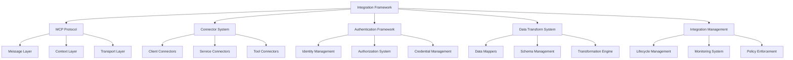
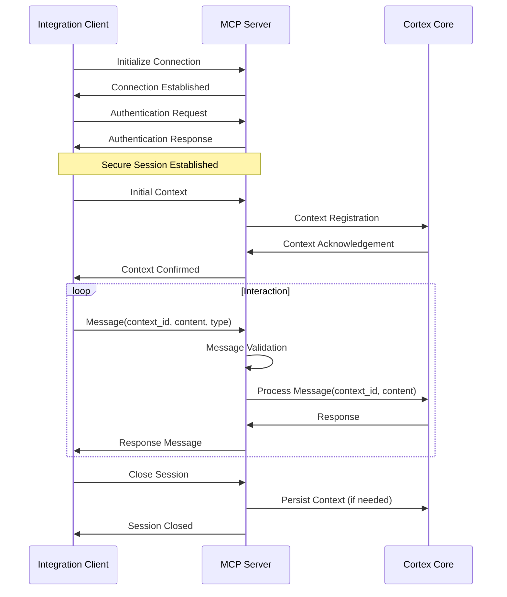
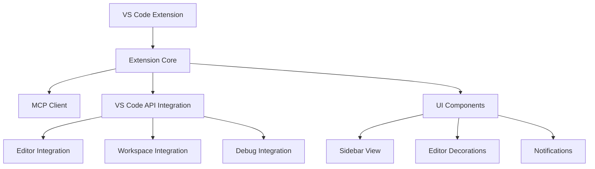
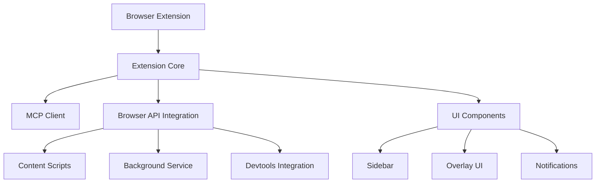
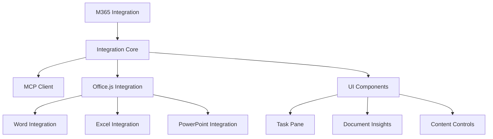
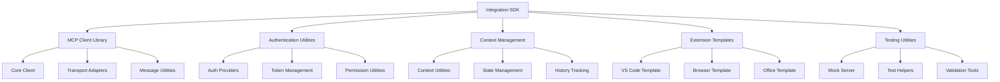

# Cortex Platform: Integration Architecture Implementation

_Version: 1.0_  
_Date: 2025-03-04_

## Introduction

This document provides technical implementation details for the Integration Architecture of the Cortex Platform. The integration architecture enables Cortex to connect with a wide range of external systems, tools, and environments, extending its capabilities and embedding its intelligence into users' existing workflows. The implementation approach addresses several key considerations:

1. Secure and efficient communication between Cortex and external systems
2. Standardized protocols for diverse integration scenarios
3. Flexible extension points for third-party developers
4. Consistent user experience across integration touchpoints
5. Responsible data handling and authentication management

The Cortex Platform's integration architecture encompasses:

1. **MCP Protocol**: The Message-Context-Protocol that forms the foundation for secure, efficient communication
2. **Integration Connectors**: Specialized connectors for different systems and tools
3. **Integration SDK**: Development tools for creating custom integrations
4. **Integration Management**: Systems for deploying, monitoring, and managing integrations

## Integration Framework Architecture

### High-Level Architecture



### Core Components

#### MCP Protocol

The MCP Protocol is the standard communication protocol for all integrations:

- **Message Layer**: Defines communication structure

  - Message formats
  - Message types
  - Message validation
  - Message routing

- **Context Layer**: Manages state and information

  - Context propagation
  - Context persistence
  - Context merging
  - Context security

- **Transport Layer**: Handles communication channels
  - Connection management
  - Transmission security
  - Protocol negotiation
  - Reliability mechanisms

#### Connector System

The Connector System provides integration adapters:

- **Client Connectors**: Interface with client applications

  - Browser extensions
  - IDE integrations
  - Desktop applications
  - Mobile applications

- **Service Connectors**: Connect to external services

  - Cloud services
  - Enterprise systems
  - Data services
  - AI/ML services

- **Tool Connectors**: Integrate with productivity tools
  - Office applications
  - Collaboration tools
  - Development tools
  - Content creation tools

#### Authentication Framework

The Authentication Framework secures integrations:

- **Identity Management**: Handles user identities

  - Identity verification
  - Identity federation
  - Identity mapping
  - Profile management

- **Authorization System**: Controls access

  - Permission management
  - Scope definition
  - Access control
  - Authorization policies

- **Credential Management**: Manages authentication tokens
  - Token issuance
  - Token validation
  - Token renewal
  - Secure storage

#### Data Transform System

The Data Transform System converts between formats:

- **Data Mappers**: Transform data structures

  - Field mapping
  - Schema transformation
  - Format conversion
  - Validation rules

- **Schema Management**: Handles data definitions

  - Schema registry
  - Schema validation
  - Schema versioning
  - Schema discovery

- **Transformation Engine**: Processes transformations
  - Transform execution
  - Complex transformations
  - Bidirectional mapping
  - Default handling

#### Integration Management

Integration Management governs integrations:

- **Lifecycle Management**: Manages integration lifecycle

  - Deployment
  - Versioning
  - Updates
  - Retirement

- **Monitoring System**: Tracks integration health

  - Performance monitoring
  - Error tracking
  - Usage analytics
  - Health checks

- **Policy Enforcement**: Applies integration policies
  - Security policies
  - Data handling policies
  - Performance policies
  - Compliance requirements

## MCP Protocol Implementation

### Protocol Overview

The Message-Context-Protocol (MCP) is the foundation of the integration architecture:



### Message Structure

MCP messages follow a standardized structure:

```json
{
  "message_id": "msg_12345678",
  "context_id": "ctx_87654321",
  "timestamp": "2025-03-04T12:34:56.789Z",
  "type": "request",
  "content": {
    "action": "process_text",
    "data": {
      "text": "Example message content",
      "parameters": {
        "param1": "value1",
        "param2": "value2"
      }
    }
  },
  "metadata": {
    "client_id": "browser_extension_v1.2.3",
    "client_version": "1.2.3",
    "locale": "en-US",
    "timezone": "America/Los_Angeles"
  }
}
```

### Context Management

MCP maintains context across interactions:

```python
class ContextManager:
    def __init__(self, storage_provider):
        self.storage = storage_provider
        self.active_contexts = {}

    def create_context(self, user_id, client_id, initial_state=None):
        """Create a new context"""
        context_id = self._generate_context_id()

        context = {
            "context_id": context_id,
            "user_id": user_id,
            "client_id": client_id,
            "created_at": datetime.utcnow(),
            "last_updated": datetime.utcnow(),
            "state": initial_state or {},
            "history": []
        }

        self.active_contexts[context_id] = context
        self.storage.store_context(context_id, context)

        return context_id

    def get_context(self, context_id):
        """Retrieve a context by ID"""
        if context_id in self.active_contexts:
            return self.active_contexts[context_id]

        # Load from storage if not in memory
        context = self.storage.get_context(context_id)
        if context:
            self.active_contexts[context_id] = context

        return context

    def update_context(self, context_id, updates, message=None):
        """Update a context with new state"""
        context = self.get_context(context_id)
        if not context:
            raise ContextNotFoundError(f"Context {context_id} not found")

        # Update state
        context["state"].update(updates)
        context["last_updated"] = datetime.utcnow()

        # Add to history if message provided
        if message:
            context["history"].append({
                "timestamp": datetime.utcnow(),
                "message_id": message["message_id"],
                "type": message["type"],
                "summary": self._summarize_message(message)
            })

        # Persist changes
        self.storage.update_context(context_id, context)

        return context
```

### Transport Implementation

The MCP protocol supports multiple transport mechanisms:

- **WebSocket Implementation**:

  ```python
  class MCPWebSocketServer:
      def __init__(self, host, port, context_manager, message_processor):
          self.host = host
          self.port = port
          self.context_manager = context_manager
          self.message_processor = message_processor
          self.connections = {}

      async def handle_connection(self, websocket, path):
          """Handle a new WebSocket connection"""
          connection_id = str(uuid.uuid4())
          self.connections[connection_id] = websocket

          try:
              # Authentication
              auth_message = await websocket.recv()
              auth_result = await self._handle_authentication(auth_message)
              await websocket.send(json.dumps(auth_result))

              if not auth_result["authenticated"]:
                  return

              # Process messages
              async for message in websocket:
                  try:
                      parsed_message = json.loads(message)
                      response = await self._process_message(parsed_message)
                      await websocket.send(json.dumps(response))
                  except Exception as e:
                      error_response = {
                          "type": "error",
                          "error": str(e),
                          "original_message_id": parsed_message.get("message_id")
                      }
                      await websocket.send(json.dumps(error_response))
          finally:
              del self.connections[connection_id]

      async def _process_message(self, message):
          """Process an incoming message"""
          # Validate message
          self._validate_message(message)

          # Get context
          context = self.context_manager.get_context(message["context_id"])

          # Process message
          result = await self.message_processor.process(message, context)

          # Update context
          self.context_manager.update_context(
              message["context_id"],
              result.get("context_updates", {}),
              message
          )

          return {
              "message_id": str(uuid.uuid4()),
              "original_message_id": message["message_id"],
              "context_id": message["context_id"],
              "timestamp": datetime.utcnow().isoformat(),
              "type": "response",
              "content": result["content"]
          }
  ```

- **HTTP Implementation**:
  ```python
  class MCPHttpServer:
      def __init__(self, context_manager, message_processor):
          self.context_manager = context_manager
          self.message_processor = message_processor
          self.app = self._create_app()

      def _create_app(self):
          """Create Flask application"""
          app = Flask(__name__)

          @app.route("/api/v1/message", methods=["POST"])
          def handle_message():
              message = request.json

              # Validate message
              try:
                  self._validate_message(message)
              except ValueError as e:
                  return jsonify({
                      "error": str(e),
                      "type": "error"
                  }), 400

              # Get context
              try:
                  context = self.context_manager.get_context(message["context_id"])
                  if not context:
                      return jsonify({
                          "error": f"Context {message['context_id']} not found",
                          "type": "error"
                      }), 404
              except Exception as e:
                  return jsonify({
                      "error": str(e),
                      "type": "error"
                  }), 500

              # Process message
              try:
                  result = self.message_processor.process(message, context)

                  # Update context
                  self.context_manager.update_context(
                      message["context_id"],
                      result.get("context_updates", {}),
                      message
                  )

                  return jsonify({
                      "message_id": str(uuid.uuid4()),
                      "original_message_id": message["message_id"],
                      "context_id": message["context_id"],
                      "timestamp": datetime.utcnow().isoformat(),
                      "type": "response",
                      "content": result["content"]
                  })
              except Exception as e:
                  return jsonify({
                      "error": str(e),
                      "type": "error",
                      "original_message_id": message.get("message_id")
                  }), 500

          return app
  ```

### Security Implementation

The MCP protocol implements several security measures:

- **Authentication**:

  ```python
  class MCPAuthenticator:
      def __init__(self, identity_provider, token_validator):
          self.identity_provider = identity_provider
          self.token_validator = token_validator

      async def authenticate(self, auth_message):
          """Authenticate a client"""
          try:
              # Extract credentials
              auth_type = auth_message.get("auth_type")

              if auth_type == "token":
                  # Validate token
                  token = auth_message.get("token")
                  validation = await self.token_validator.validate_token(token)

                  if validation["valid"]:
                      return {
                          "authenticated": True,
                          "user_id": validation["user_id"],
                          "permissions": validation["permissions"]
                      }
                  else:
                      return {
                          "authenticated": False,
                          "error": validation["error"]
                      }

              elif auth_type == "credentials":
                  # Authenticate with credentials
                  username = auth_message.get("username")
                  password = auth_message.get("password")

                  auth_result = await self.identity_provider.authenticate(username, password)

                  if auth_result["authenticated"]:
                      # Generate token for future requests
                      token = await self.identity_provider.generate_token(auth_result["user_id"])

                      return {
                          "authenticated": True,
                          "user_id": auth_result["user_id"],
                          "token": token,
                          "permissions": auth_result["permissions"]
                      }
                  else:
                      return {
                          "authenticated": False,
                          "error": auth_result["error"]
                      }
              else:
                  return {
                      "authenticated": False,
                      "error": "Unsupported authentication type"
                  }
          except Exception as e:
              return {
                  "authenticated": False,
                  "error": str(e)
              }
  ```

- **Message Validation**:

  ```python
  class MessageValidator:
      def validate(self, message):
          """Validate message structure and content"""
          # Check required fields
          required_fields = ["message_id", "context_id", "type", "content"]
          for field in required_fields:
              if field not in message:
                  raise ValueError(f"Missing required field: {field}")

          # Validate message ID format
          if not re.match(r"^msg_[a-zA-Z0-9]{8,}$", message["message_id"]):
              raise ValueError("Invalid message_id format")

          # Validate context ID format
          if not re.match(r"^ctx_[a-zA-Z0-9]{8,}$", message["context_id"]):
              raise ValueError("Invalid context_id format")

          # Validate timestamp if present
          if "timestamp" in message:
              try:
                  datetime.fromisoformat(message["timestamp"].replace('Z', '+00:00'))
              except ValueError:
                  raise ValueError("Invalid timestamp format")

          # Validate message type
          valid_types = ["request", "response", "notification", "error"]
          if message["type"] not in valid_types:
              raise ValueError(f"Invalid message type: {message['type']}")

          # Validate content based on message type
          if message["type"] == "request":
              if "action" not in message["content"]:
                  raise ValueError("Request messages must include an action")
          elif message["type"] == "error":
              if "error" not in message["content"]:
                  raise ValueError("Error messages must include an error description")

          return True
  ```

- **Transport Security**:
  - TLS 1.3 for all connections
  - Certificate validation
  - Perfect forward secrecy
  - Secure cookie handling

## Integration Implementations

### VS Code Extension

The VS Code extension implementation:

#### Architecture



#### Key Components

- **Extension Core**:

  ```typescript
  // Extension core implementation
  export class CortexExtension {
    private mcpClient: MCPClient;
    private contextId: string | null = null;
    private disposables: vscode.Disposable[] = [];

    constructor(private context: vscode.ExtensionContext) {
      this.mcpClient = new MCPClient(config.mcpServerUrl);
      this.initializeExtension();
    }

    private async initializeExtension(): Promise<void> {
      try {
        // Connect to MCP server
        await this.mcpClient.connect();

        // Initialize context
        this.contextId = await this.createContext();

        // Register commands
        this.registerCommands();

        // Initialize views
        this.initializeViews();

        // Set up event listeners
        this.setupEventListeners();

        vscode.window.showInformationMessage(
          "Cortex extension initialized successfully"
        );
      } catch (error) {
        vscode.window.showErrorMessage(
          `Failed to initialize Cortex: ${error.message}`
        );
      }
    }

    private async createContext(): Promise<string> {
      const workspaceInfo = this.getWorkspaceInfo();

      const response = await this.mcpClient.sendMessage({
        type: "request",
        content: {
          action: "create_context",
          data: {
            client_type: "vscode_extension",
            client_version: this.context.extension.packageJSON.version,
            workspace_info: workspaceInfo,
          },
        },
      });

      return response.content.context_id;
    }

    // Additional methods for extension functionality
  }
  ```

- **MCP Client for VS Code**:

  ```typescript
  // MCP client implementation for VS Code
  export class MCPClient {
    private socket: WebSocket | null = null;
    private messageQueue: Map<string, { resolve: Function; reject: Function }> =
      new Map();
    private connectionPromise: Promise<void> | null = null;

    constructor(private serverUrl: string) {}

    async connect(): Promise<void> {
      if (this.socket && this.socket.readyState === WebSocket.OPEN) {
        return;
      }

      if (!this.connectionPromise) {
        this.connectionPromise = new Promise((resolve, reject) => {
          this.socket = new WebSocket(this.serverUrl);

          this.socket.onopen = () => {
            resolve();
          };

          this.socket.onmessage = (event) => {
            this.handleMessage(JSON.parse(event.data));
          };

          this.socket.onerror = (error) => {
            reject(new Error("WebSocket error"));
          };

          this.socket.onclose = () => {
            this.connectionPromise = null;
          };
        });
      }

      return this.connectionPromise;
    }

    async sendMessage(message: any): Promise<any> {
      if (!this.socket || this.socket.readyState !== WebSocket.OPEN) {
        await this.connect();
      }

      const messageId = `msg_${generateId()}`;
      message.message_id = messageId;

      return new Promise((resolve, reject) => {
        this.messageQueue.set(messageId, { resolve, reject });
        this.socket!.send(JSON.stringify(message));
      });
    }

    private handleMessage(message: any): void {
      if (
        message.original_message_id &&
        this.messageQueue.has(message.original_message_id)
      ) {
        const { resolve, reject } = this.messageQueue.get(
          message.original_message_id
        )!;
        this.messageQueue.delete(message.original_message_id);

        if (message.type === "error") {
          reject(new Error(message.content.error));
        } else {
          resolve(message);
        }
      }
    }
  }
  ```

- **Code Assistant Integration**:
  ```typescript
  // Code assistant integration
  export class CodeAssistant {
    constructor(private mcpClient: MCPClient, private contextId: string) {}

    async suggestCode(
      document: vscode.TextDocument,
      position: vscode.Position
    ): Promise<vscode.CompletionItem[]> {
      const text = document.getText();
      const offset = document.offsetAt(position);

      const response = await this.mcpClient.sendMessage({
        context_id: this.contextId,
        type: "request",
        content: {
          action: "suggest_code",
          data: {
            language: document.languageId,
            text: text,
            position: offset,
            file_path: document.fileName,
            workspace_folder: vscode.workspace.getWorkspaceFolder(document.uri)
              ?.uri.fsPath,
          },
        },
      });

      return this.convertToCompletionItems(response.content.suggestions);
    }

    private convertToCompletionItems(
      suggestions: any[]
    ): vscode.CompletionItem[] {
      return suggestions.map((suggestion) => {
        const item = new vscode.CompletionItem(suggestion.label);
        item.insertText = suggestion.text;
        item.detail = suggestion.detail;
        item.documentation = new vscode.MarkdownString(
          suggestion.documentation
        );
        item.kind = this.mapCompletionKind(suggestion.kind);
        return item;
      });
    }

    private mapCompletionKind(kind: string): vscode.CompletionItemKind {
      // Map Cortex completion kinds to VS Code completion kinds
      const kindMap: { [key: string]: vscode.CompletionItemKind } = {
        function: vscode.CompletionItemKind.Function,
        class: vscode.CompletionItemKind.Class,
        variable: vscode.CompletionItemKind.Variable,
        // Additional mappings...
      };

      return kindMap[kind] || vscode.CompletionItemKind.Text;
    }
  }
  ```

#### Integration Points

- **Editor Integration**:

  - Inline code suggestions
  - Code analysis
  - Refactoring actions
  - Documentation generation

- **Workspace Integration**:

  - Project analysis
  - File management
  - Task generation
  - Development planning

- **Debug Integration**:
  - Bug analysis
  - Fix suggestions
  - Test generation
  - Runtime analysis

### Browser Extension

The browser extension implementation:

#### Architecture



#### Key Components

- **Extension Core**:

  ```javascript
  // Extension core implementation
  class CortexBrowserExtension {
    constructor() {
      this.mcpClient = new MCPClient(config.mcpServerUrl);
      this.contextId = null;
      this.activeTab = null;

      // Initialize extension
      this.initialize();
    }

    async initialize() {
      try {
        // Connect to MCP server
        await this.mcpClient.connect();

        // Create initial context
        await this.createContext();

        // Set up message listeners
        this.setupMessageListeners();

        // Initialize UI
        this.initializeUI();

        console.log("Cortex browser extension initialized successfully");
      } catch (error) {
        console.error("Failed to initialize Cortex extension:", error);
      }
    }

    async createContext() {
      // Get browser information
      const browserInfo = await this.getBrowserInfo();

      // Create context
      const response = await this.mcpClient.sendMessage({
        type: "request",
        content: {
          action: "create_context",
          data: {
            client_type: "browser_extension",
            client_version: chrome.runtime.getManifest().version,
            browser_info: browserInfo,
          },
        },
      });

      this.contextId = response.content.context_id;
      return this.contextId;
    }

    setupMessageListeners() {
      // Listen for messages from content scripts
      chrome.runtime.onMessage.addListener((message, sender, sendResponse) => {
        if (message.type === "cortex_request") {
          this.handleContentScriptMessage(message, sender)
            .then(sendResponse)
            .catch((error) => sendResponse({ error: error.message }));
          return true; // Indicate async response
        }
      });
    }

    // Additional methods for extension functionality
  }
  ```

- **MCP Client for Browser**:

  ```javascript
  // MCP client implementation for browser
  class MCPClient {
    constructor(serverUrl) {
      this.serverUrl = serverUrl;
      this.socket = null;
      this.messageQueue = new Map();
      this.connectionPromise = null;
    }

    async connect() {
      if (this.socket && this.socket.readyState === WebSocket.OPEN) {
        return;
      }

      if (!this.connectionPromise) {
        this.connectionPromise = new Promise((resolve, reject) => {
          this.socket = new WebSocket(this.serverUrl);

          this.socket.onopen = () => {
            resolve();
          };

          this.socket.onmessage = (event) => {
            this.handleMessage(JSON.parse(event.data));
          };

          this.socket.onerror = (error) => {
            reject(new Error("WebSocket error"));
            this.connectionPromise = null;
          };

          this.socket.onclose = () => {
            this.connectionPromise = null;
          };
        });
      }

      return this.connectionPromise;
    }

    async sendMessage(message) {
      if (!this.socket || this.socket.readyState !== WebSocket.OPEN) {
        await this.connect();
      }

      const messageId = `msg_${this.generateId()}`;
      message.message_id = messageId;

      return new Promise((resolve, reject) => {
        this.messageQueue.set(messageId, { resolve, reject });
        this.socket.send(JSON.stringify(message));
      });
    }

    handleMessage(message) {
      if (
        message.original_message_id &&
        this.messageQueue.has(message.original_message_id)
      ) {
        const { resolve, reject } = this.messageQueue.get(
          message.original_message_id
        );
        this.messageQueue.delete(message.original_message_id);

        if (message.type === "error") {
          reject(new Error(message.content.error));
        } else {
          resolve(message);
        }
      }
    }

    generateId() {
      return Math.random().toString(36).substring(2, 10);
    }
  }
  ```

- **Content Script Integration**:

  ```javascript
  // Content script implementation
  class CortexContentScript {
    constructor() {
      this.initialized = false;
      this.pageInfo = null;

      // Initialize content script
      this.initialize();
    }

    async initialize() {
      // Analyze page content
      this.pageInfo = this.analyzePageContent();

      // Send initialization message to background script
      chrome.runtime.sendMessage(
        {
          type: "cortex_request",
          action: "initialize_content",
          data: {
            url: window.location.href,
            title: document.title,
            page_info: this.pageInfo,
          },
        },
        (response) => {
          if (response.error) {
            console.error(
              "Failed to initialize Cortex content script:",
              response.error
            );
            return;
          }

          this.initialized = true;
          this.setupObservers();
          this.setupInteractionListeners();
        }
      );
    }

    analyzePageContent() {
      // Extract key information from the page
      return {
        headings: Array.from(document.querySelectorAll("h1, h2, h3")).map(
          (h) => ({
            level: parseInt(h.tagName.substring(1)),
            text: h.textContent.trim(),
          })
        ),
        links: Array.from(document.querySelectorAll("a[href]"))
          .map((a) => ({
            text: a.textContent.trim(),
            href: a.href,
          }))
          .slice(0, 50), // Limit to first 50 links
        mainContent: this.extractMainContent(),
        metaTags: this.extractMetaTags(),
      };
    }

    // Additional methods for content script functionality
  }

  // Initialize content script
  new CortexContentScript();
  ```

#### Integration Points

- **Page Integration**:

  - Content analysis
  - Element interaction
  - Form assistance
  - Content enhancement

- **Browser Tools Integration**:

  - DevTools extension
  - Bookmark management
  - History analysis
  - Tab management

- **User Interface**:
  - Sidebar interface
  - In-page overlays
  - Notifications
  - Custom panels

### M365 Apps Integration

The Microsoft 365 apps integration:

#### Architecture



#### Key Components

- **Office.js Integration**:

  ```javascript
  // Office.js integration implementation
  class CortexOfficeIntegration {
    constructor() {
      this.mcpClient = new MCPClient(config.mcpServerUrl);
      this.contextId = null;

      // Initialize when Office is ready
      Office.onReady((info) => {
        this.initialize(info);
      });
    }

    async initialize(info) {
      try {
        // Connect to MCP server
        await this.mcpClient.connect();

        // Create context based on application
        await this.createContext(info);

        // Initialize UI
        await this.initializeUI();

        // Set up event handlers
        this.setupEventHandlers(info);

        console.log("Cortex Office integration initialized successfully");
      } catch (error) {
        console.error("Failed to initialize Cortex Office integration:", error);
      }
    }

    async createContext(info) {
      // Get document information
      const docInfo = await this.getDocumentInfo(info);

      // Create context
      const response = await this.mcpClient.sendMessage({
        type: "request",
        content: {
          action: "create_context",
          data: {
            client_type: "office_addin",
            client_version: "1.0.0",
            application: info.host,
            document_info: docInfo,
          },
        },
      });

      this.contextId = response.content.context_id;
      return this.contextId;
    }

    async getDocumentInfo(info) {
      // Get document information based on application type
      switch (info.host) {
        case "Word":
          return this.getWordDocumentInfo();
        case "Excel":
          return this.getExcelDocumentInfo();
        case "PowerPoint":
          return this.getPowerPointDocumentInfo();
        default:
          return {};
      }
    }

    // Application-specific methods
  }
  ```

- **Word Integration**:

  ```javascript
  // Word-specific integration
  class WordIntegration {
    constructor(mcpClient, contextId) {
      this.mcpClient = mcpClient;
      this.contextId = contextId;
    }

    async getDocumentInfo() {
      return new Promise((resolve, reject) => {
        Word.run(async (context) => {
          // Get document properties
          const properties = context.document.properties;
          properties.load("title,author,subject,keywords");

          // Get document body text
          const body = context.document.body;
          body.load("text");

          // Get document sections
          const sections = context.document.sections;
          sections.load("body");

          await context.sync();

          // Create document info object
          const docInfo = {
            title: properties.title,
            author: properties.author,
            subject: properties.subject,
            keywords: properties.keywords,
            text_preview: body.text.substring(0, 1000),
            section_count: sections.items.length,
          };

          resolve(docInfo);
        }).catch(reject);
      });
    }

    async analyzeCurrent() {
      return new Promise((resolve, reject) => {
        Word.run(async (context) => {
          // Get selected text or current paragraph
          let selectedText = context.document.getSelection();
          selectedText.load("text");

          await context.sync();

          // If no selection, get current paragraph
          if (selectedText.text.trim() === "") {
            const paragraph = selectedText.paragraphs.getFirst();
            paragraph.load("text");
            await context.sync();
            selectedText = paragraph;
          }

          // Send to Cortex for analysis
          const response = await this.mcpClient.sendMessage({
            context_id: this.contextId,
            type: "request",
            content: {
              action: "analyze_text",
              data: {
                text: selectedText.text,
                document_type: "word",
              },
            },
          });

          resolve(response.content);
        }).catch(reject);
      });
    }

    // Additional Word-specific methods
  }
  ```

- **Excel Integration**:
  ```javascript
  // Excel-specific integration
  class ExcelIntegration {
    constructor(mcpClient, contextId) {
      this.mcpClient = mcpClient;
      this.contextId = contextId;
    }

    async getDocumentInfo() {
      return new Promise((resolve, reject) => {
        Excel.run(async (context) => {
          // Get workbook properties
          const properties = context.workbook.properties;
          properties.load("title,author,subject,keywords");

          // Get worksheets
          const worksheets = context.workbook.worksheets;
          worksheets.load("items/name");

          // Get active worksheet
          const activeSheet = context.workbook.worksheets.getActiveWorksheet();
          activeSheet.load("name");

          // Get used range on active sheet
          const usedRange = activeSheet.getUsedRange();
          usedRange.load("address,rowCount,columnCount");

          await context.sync();

          // Create document info object
          const docInfo = {
            title: properties.title,
            author: properties.author,
            subject: properties.subject,
            keywords: properties.keywords,
            worksheets: worksheets.items.map((ws) => ws.name),
            active_sheet: activeSheet.name,
            data_range: usedRange.address,
            row_count: usedRange.rowCount,
            column_count: usedRange.columnCount,
          };

          resolve(docInfo);
        }).catch(reject);
      });
    }

    async analyzeData() {
      return new Promise((resolve, reject) => {
        Excel.run(async (context) => {
          // Get selected range or used range on active sheet
          let range;
          try {
            range = context.workbook.getSelectedRange();
            range.load("values,address,rowCount,columnCount");
            await context.sync();
          } catch {
            // If no selection, use used range
            const sheet = context.workbook.worksheets.getActiveWorksheet();
            range = sheet.getUsedRange();
            range.load("values,address,rowCount,columnCount");
            await context.sync();
          }

          // Send to Cortex for analysis
          const response = await this.mcpClient.sendMessage({
            context_id: this.contextId,
            type: "request",
            content: {
              action: "analyze_data",
              data: {
                values: range.values,
                address: range.address,
                row_count: range.rowCount,
                column_count: range.columnCount,
                document_type: "excel",
              },
            },
          });

          resolve(response.content);
        }).catch(reject);
      });
    }

    // Additional Excel-specific methods
  }
  ```

#### Integration Points

- **Word Integration**:

  - Content analysis
  - Writing assistance
  - Document structuring
  - Reference management

- **Excel Integration**:

  - Data analysis
  - Formula suggestions
  - Chart recommendations
  - Pattern recognition

- **PowerPoint Integration**:
  - Content creation
  - Design suggestions
  - Presentation structure
  - Speaker notes enhancement

### Other Tool Integrations

Additional tool integrations:

#### Custom API Plugins

```javascript
// Example of a custom API plugin for Cortex
class CortexAPIPlugin {
  constructor(apiKey, pluginConfig) {
    this.apiKey = apiKey;
    this.config = pluginConfig;
    this.mcpClient = new MCPClient(this.config.mcpServerUrl);
    this.contextId = null;
  }

  async initialize() {
    try {
      // Connect to MCP server
      await this.mcpClient.connect();

      // Authenticate with API key
      const authResponse = await this.mcpClient.sendMessage({
        type: "request",
        content: {
          action: "authenticate",
          data: {
            auth_type: "api_key",
            api_key: this.apiKey,
          },
        },
      });

      if (!authResponse.content.authenticated) {
        throw new Error("Authentication failed: " + authResponse.content.error);
      }

      // Create context
      const contextResponse = await this.mcpClient.sendMessage({
        type: "request",
        content: {
          action: "create_context",
          data: {
            client_type: "api_plugin",
            client_version: this.config.version,
            plugin_id: this.config.pluginId,
          },
        },
      });

      this.contextId = contextResponse.content.context_id;

      return {
        success: true,
        contextId: this.contextId,
      };
    } catch (error) {
      return {
        success: false,
        error: error.message,
      };
    }
  }

  async processRequest(action, data) {
    if (!this.contextId) {
      await this.initialize();
    }

    try {
      const response = await this.mcpClient.sendMessage({
        context_id: this.contextId,
        type: "request",
        content: {
          action: action,
          data: data,
        },
      });

      return {
        success: true,
        result: response.content,
      };
    } catch (error) {
      return {
        success: false,
        error: error.message,
      };
    }
  }
}
```

#### Webhook Integration

```javascript
// Webhook integration for Cortex
class CortexWebhookHandler {
  constructor(webhookSecret, config) {
    this.webhookSecret = webhookSecret;
    this.config = config;
    this.mcpClient = new MCPClient(this.config.mcpServerUrl);
  }

  async handleWebhookRequest(request) {
    // Verify webhook signature
    if (!this.verifySignature(request)) {
      return {
        status: 401,
        body: {
          error: "Invalid webhook signature",
        },
      };
    }

    try {
      // Parse webhook payload
      const payload = request.body;

      // Create temporary context for this webhook
      const contextResponse = await this.mcpClient.sendMessage({
        type: "request",
        content: {
          action: "create_context",
          data: {
            client_type: "webhook",
            client_version: "1.0",
            webhook_source: payload.source,
            webhook_event: payload.event,
          },
        },
      });

      const contextId = contextResponse.content.context_id;

      // Process webhook event
      const response = await this.mcpClient.sendMessage({
        context_id: contextId,
        type: "request",
        content: {
          action: "process_webhook",
          data: {
            source: payload.source,
            event: payload.event,
            payload: payload.data,
          },
        },
      });

      return {
        status: 200,
        body: {
          processed: true,
          result: response.content,
        },
      };
    } catch (error) {
      return {
        status: 500,
        body: {
          error: "Webhook processing error",
          message: error.message,
        },
      };
    }
  }

  verifySignature(request) {
    // Implementation of webhook signature verification
    const signature = request.headers["x-webhook-signature"];
    const payload = JSON.stringify(request.body);

    // Create HMAC using webhook secret
    const crypto = require("crypto");
    const hmac = crypto.createHmac("sha256", this.webhookSecret);
    hmac.update(payload);
    const calculatedSignature = hmac.digest("hex");

    return signature === calculatedSignature;
  }
}
```

## Integration SDK

The Integration SDK for developers:

### SDK Architecture



### SDK Components

#### Core SDK

```javascript
// Core SDK implementation
class CortexSDK {
  constructor(config) {
    this.config = this._mergeWithDefaults(config);
    this.mcpClient = new MCPClient(this.config.mcpServerUrl);
    this.authProvider = this._createAuthProvider(this.config.auth);
  }

  _mergeWithDefaults(config) {
    // Default configuration
    const defaults = {
      mcpServerUrl: "wss://mcp.cortexplatform.com/v1",
      auth: {
        type: "none",
      },
      transport: {
        type: "websocket",
        options: {},
      },
    };

    return { ...defaults, ...config };
  }

  _createAuthProvider(authConfig) {
    switch (authConfig.type) {
      case "api_key":
        return new ApiKeyAuthProvider(authConfig);
      case "oauth":
        return new OAuthAuthProvider(authConfig);
      case "token":
        return new TokenAuthProvider(authConfig);
      default:
        return new NoAuthProvider();
    }
  }

  async initialize() {
    try {
      // Connect to MCP server
      await this.mcpClient.connect();

      // Authenticate if necessary
      if (this.authProvider.requiresAuth()) {
        const authResult = await this.authProvider.authenticate(this.mcpClient);
        if (!authResult.success) {
          throw new Error(`Authentication failed: ${authResult.error}`);
        }
      }

      return {
        success: true,
      };
    } catch (error) {
      return {
        success: false,
        error: error.message,
      };
    }
  }

  async createContext(contextInfo) {
    try {
      const response = await this.mcpClient.sendMessage({
        type: "request",
        content: {
          action: "create_context",
          data: {
            client_type: contextInfo.clientType || "sdk",
            client_version: contextInfo.clientVersion || "1.0",
            ...contextInfo,
          },
        },
      });

      return {
        success: true,
        contextId: response.content.context_id,
      };
    } catch (error) {
      return {
        success: false,
        error: error.message,
      };
    }
  }

  // Additional SDK methods
}
```

#### Integration Templates

```javascript
// VS Code extension template
class VSCodeExtensionTemplate {
  static generateFiles(config) {
    return {
      "extension.js": this._generateExtensionJs(config),
      "package.json": this._generatePackageJson(config),
      "README.md": this._generateReadme(config),
      ".vscodeignore": this._generateVSCodeIgnore(),
    };
  }

  static _generateExtensionJs(config) {
    return `
const vscode = require('vscode');
const { CortexSDK } = require('cortex-sdk');

/**
 * @param {vscode.ExtensionContext} context
 */
function activate(context) {
    console.log('Activating ${config.name}...');
    
    // Initialize Cortex SDK
    const cortexSdk = new CortexSDK({
        mcpServerUrl: '${config.mcpServerUrl}',
        auth: {
            type: '${config.auth.type}',
            ${Object.entries(config.auth)
              .filter(([key]) => key !== "type")
              .map(([key, value]) => `${key}: '${value}'`)
              .join(",\n            ")}
        }
    });
    
    // Register commands
    ${config.commands
      .map(
        (cmd) =>
          `let ${cmd.name}Command = vscode.commands.registerCommand('${config.id}.${cmd.name}', ${cmd.handler});
    context.subscriptions.push(${cmd.name}Command);`
      )
      .join("\n    ")}
    
    // Initialize extension
    initializeExtension(context, cortexSdk);
}

async function initializeExtension(context, cortexSdk) {
    try {
        // Initialize SDK
        const initResult = await cortexSdk.initialize();
        if (!initResult.success) {
            vscode.window.showErrorMessage(\`Failed to initialize Cortex: \${initResult.error}\`);
            return;
        }
        
        // Create context
        const contextResult = await cortexSdk.createContext({
            clientType: 'vscode_extension',
            clientVersion: '${config.version}',
            extensionId: '${config.id}'
        });
        
        if (!contextResult.success) {
            vscode.window.showErrorMessage(\`Failed to create Cortex context: \${contextResult.error}\`);
            return;
        }
        
        // Extension is ready
        vscode.window.showInformationMessage('${config.name} is now active!');
    } catch (error) {
        vscode.window.showErrorMessage(\`Extension initialization error: \${error.message}\`);
    }
}

function deactivate() {}

module.exports = {
    activate,
    deactivate
};
    `;
  }

  // Additional template generation methods
}
```

#### Testing Utilities

```javascript
// Mock MCP server for testing
class MockMCPServer {
  constructor(options = {}) {
    this.options = Object.assign(
      {
        port: 8089,
        autoAuthenticate: true,
        autoCreateContext: true,
      },
      options
    );

    this.server = null;
    this.connections = new Map();
    this.messageHandlers = new Map();
    this.contextCounter = 1;

    // Register default handlers
    this._registerDefaultHandlers();
  }

  start() {
    return new Promise((resolve, reject) => {
      const WebSocket = require("ws");
      this.server = new WebSocket.Server({ port: this.options.port });

      this.server.on("listening", () => {
        console.log(`Mock MCP server listening on port ${this.options.port}`);
        resolve();
      });

      this.server.on("connection", (socket) => {
        const connectionId = this._generateConnectionId();
        this.connections.set(connectionId, socket);

        socket.on("message", (message) => {
          try {
            const parsedMessage = JSON.parse(message);
            this._handleMessage(connectionId, parsedMessage);
          } catch (error) {
            console.error("Error handling message:", error);
            this._sendError(connectionId, "Failed to parse message", null);
          }
        });

        socket.on("close", () => {
          this.connections.delete(connectionId);
        });
      });

      this.server.on("error", (error) => {
        reject(error);
      });
    });
  }

  stop() {
    return new Promise((resolve) => {
      if (this.server) {
        this.server.close(() => {
          this.connections.clear();
          this.server = null;
          resolve();
        });
      } else {
        resolve();
      }
    });
  }

  registerHandler(action, handler) {
    this.messageHandlers.set(action, handler);
  }

  _registerDefaultHandlers() {
    // Authentication handler
    this.registerHandler("authenticate", (message, connectionId) => {
      const authType = message.content.data.auth_type;

      if (this.options.autoAuthenticate) {
        return {
          authenticated: true,
          user_id: "test_user_123",
          permissions: ["read", "write"],
        };
      } else {
        // Simulate authentication failure
        return {
          authenticated: false,
          error: "Authentication failed",
        };
      }
    });

    // Create context handler
    this.registerHandler("create_context", (message, connectionId) => {
      if (this.options.autoCreateContext) {
        const contextId = `ctx_test_${this.contextCounter++}`;
        return {
          context_id: contextId,
        };
      } else {
        // Simulate context creation failure
        return {
          error: "Failed to create context",
        };
      }
    });
  }

  _handleMessage(connectionId, message) {
    // Ensure message has required fields
    if (!message.type || !message.content || !message.content.action) {
      return this._sendError(
        connectionId,
        "Invalid message format",
        message.message_id
      );
    }

    const action = message.content.action;
    const handler = this.messageHandlers.get(action);

    if (!handler) {
      return this._sendError(
        connectionId,
        `No handler registered for action: ${action}`,
        message.message_id
      );
    }

    try {
      // Call handler with message
      const result = handler(message, connectionId);

      // Handle promises
      if (result instanceof Promise) {
        result
          .then((handlerResult) =>
            this._sendResponse(connectionId, message, handlerResult)
          )
          .catch((error) =>
            this._sendError(connectionId, error.message, message.message_id)
          );
      } else {
        this._sendResponse(connectionId, message, result);
      }
    } catch (error) {
      this._sendError(connectionId, error.message, message.message_id);
    }
  }

  _sendResponse(connectionId, originalMessage, result) {
    const socket = this.connections.get(connectionId);
    if (!socket) return;

    const response = {
      message_id: `msg_${this._generateId()}`,
      original_message_id: originalMessage.message_id,
      context_id: originalMessage.context_id,
      timestamp: new Date().toISOString(),
      type: "response",
      content: result,
    };

    socket.send(JSON.stringify(response));
  }

  _sendError(connectionId, errorMessage, originalMessageId) {
    const socket = this.connections.get(connectionId);
    if (!socket) return;

    const error = {
      message_id: `msg_${this._generateId()}`,
      original_message_id: originalMessageId,
      timestamp: new Date().toISOString(),
      type: "error",
      content: {
        error: errorMessage,
      },
    };

    socket.send(JSON.stringify(error));
  }

  _generateConnectionId() {
    return `conn_${this._generateId()}`;
  }

  _generateId() {
    return Math.random().toString(36).substring(2, 10);
  }
}
```

## Integration Management

### Lifecycle Management

The lifecycle management of integrations:

```python
class IntegrationLifecycleManager:
    def __init__(self, registry_provider, deployment_provider):
        self.registry = registry_provider
        self.deployment = deployment_provider

    async def register_integration(self, integration_manifest, owner_id):
        """Register a new integration"""
        # Validate manifest
        validation = self._validate_manifest(integration_manifest)
        if not validation['valid']:
            return {
                'success': False,
                'errors': validation['errors']
            }

        # Create integration record
        integration_id = self._generate_integration_id()
        record = {
            'integration_id': integration_id,
            'name': integration_manifest['name'],
            'description': integration_manifest['description'],
            'version': integration_manifest['version'],
            'owner_id': owner_id,
            'manifest': integration_manifest,
            'status': 'registered',
            'created_at': datetime.utcnow(),
            'updated_at': datetime.utcnow()
        }

        # Save to registry
        await self.registry.create_integration(record)

        return {
            'success': True,
            'integration_id': integration_id
        }

    async def deploy_integration(self, integration_id, deployment_config):
        """Deploy an integration"""
        # Get integration record
        integration = await self.registry.get_integration(integration_id)
        if not integration:
            return {
                'success': False,
                'error': f'Integration {integration_id} not found'
            }

        # Validate deployment configuration
        validation = self._validate_deployment_config(deployment_config, integration)
        if not validation['valid']:
            return {
                'success': False,
                'errors': validation['errors']
            }

        # Prepare deployment
        deployment_id = self._generate_deployment_id()
        deployment_record = {
            'deployment_id': deployment_id,
            'integration_id': integration_id,
            'version': integration['version'],
            'config': deployment_config,
            'status': 'pending',
            'created_at': datetime.utcnow(),
            'updated_at': datetime.utcnow()
        }

        # Create deployment record
        await self.registry.create_deployment(deployment_record)

        try:
            # Execute deployment
            result = await self.deployment.deploy(integration, deployment_config)

            # Update deployment status
            if result['success']:
                await self.registry.update_deployment(deployment_id, {
                    'status': 'active',
                    'endpoints': result.get('endpoints', []),
                    'updated_at': datetime.utcnow()
                })

                # Update integration status
                await self.registry.update_integration(integration_id, {
                    'status': 'deployed',
                    'current_deployment_id': deployment_id,
                    'updated_at': datetime.utcnow()
                })

                return {
                    'success': True,
                    'deployment_id': deployment_id,
                    'endpoints': result.get('endpoints', [])
                }
            else:
                await self.registry.update_deployment(deployment_id, {
                    'status': 'failed',
                    'error': result['error'],
                    'updated_at': datetime.utcnow()
                })

                return {
                    'success': False,
                    'error': result['error'],
                    'deployment_id': deployment_id
                }
        except Exception as e:
            # Handle deployment exceptions
            await self.registry.update_deployment(deployment_id, {
                'status': 'failed',
                'error': str(e),
                'updated_at': datetime.utcnow()
            })

            return {
                'success': False,
                'error': f'Deployment failed: {str(e)}',
                'deployment_id': deployment_id
            }
```

### Monitoring System

The integration monitoring system:

```python
class IntegrationMonitor:
    def __init__(self, metrics_provider, alert_provider):
        self.metrics = metrics_provider
        self.alerts = alert_provider

    async def monitor_integration(self, integration_id):
        """Get monitoring data for an integration"""
        # Get basic metrics
        usage_metrics = await self.metrics.get_usage_metrics(integration_id)
        performance_metrics = await self.metrics.get_performance_metrics(integration_id)
        error_metrics = await self.metrics.get_error_metrics(integration_id)

        # Get active alerts
        active_alerts = await self.alerts.get_active_alerts(integration_id)

        # Calculate health score
        health_score = self._calculate_health_score(
            usage_metrics,
            performance_metrics,
            error_metrics,
            active_alerts
        )

        return {
            'integration_id': integration_id,
            'timestamp': datetime.utcnow().isoformat(),
            'health_score': health_score,
            'usage': usage_metrics,
            'performance': performance_metrics,
            'errors': error_metrics,
            'alerts': active_alerts
        }

    async def create_dashboard(self, integration_id):
        """Create a monitoring dashboard for an integration"""
        # Get integration details
        integration = await self.registry.get_integration(integration_id)
        if not integration:
            return {
                'success': False,
                'error': f'Integration {integration_id} not found'
            }

        # Create dashboard configuration
        dashboard_config = self._create_dashboard_config(integration)

        # Create dashboard
        dashboard_id = await self.metrics.create_dashboard(dashboard_config)

        # Update integration record
        await self.registry.update_integration(integration_id, {
            'monitoring_dashboard_id': dashboard_id,
            'updated_at': datetime.utcnow()
        })

        return {
            'success': True,
            'dashboard_id': dashboard_id,
            'dashboard_url': self._get_dashboard_url(dashboard_id)
        }

    async def configure_alerts(self, integration_id, alert_config):
        """Configure alerts for an integration"""
        # Validate alert configuration
        validation = self._validate_alert_config(alert_config)
        if not validation['valid']:
            return {
                'success': False,
                'errors': validation['errors']
            }

        # Create alerts
        alert_ids = []
        for alert in alert_config:
            alert_id = await self.alerts.create_alert_rule(
                integration_id,
                alert['name'],
                alert['condition'],
                alert['threshold'],
                alert['actions']
            )
            alert_ids.append(alert_id)

        return {
            'success': True,
            'alert_ids': alert_ids
        }

    def _calculate_health_score(self, usage, performance, errors, alerts):
        """Calculate health score from metrics"""
        # Base score
        score = 100

        # Deduct for performance issues
        if performance['avg_latency'] > 500:  # ms
            score -= 10

        if performance['p95_latency'] > 1000:  # ms
            score -= 10

        # Deduct for errors
        error_rate = errors['error_count'] / max(usage['request_count'], 1)
        if error_rate > 0.05:  # 5% error rate
            score -= 20
        elif error_rate > 0.01:  # 1% error rate
            score -= 10

        # Deduct for alerts
        critical_alerts = sum(1 for a in alerts if a['severity'] == 'critical')
        warning_alerts = sum(1 for a in alerts if a['severity'] == 'warning')

        score -= critical_alerts * 15
        score -= warning_alerts * 5

        # Ensure score is in range 0-100
        return max(0, min(100, score))
```

### Policy Enforcement

Integration policy enforcement system:

```python
class IntegrationPolicyEnforcer:
    def __init__(self, policy_provider, registry_provider):
        self.policies = policy_provider
        self.registry = registry_provider

    async def evaluate_integration(self, integration_id, context=None):
        """Evaluate an integration against policies"""
        # Get integration record
        integration = await self.registry.get_integration(integration_id)
        if not integration:
            return {
                'success': False,
                'error': f'Integration {integration_id} not found'
            }

        # Get applicable policies
        policies = await self.policies.get_applicable_policies(integration, context)

        # Evaluate each policy
        evaluations = []
        for policy in policies:
            evaluation = await self._evaluate_policy(policy, integration, context)
            evaluations.append(evaluation)

        # Check for violations
        violations = [e for e in evaluations if not e['compliant']]

        # Determine overall compliance
        compliant = len(violations) == 0

        return {
            'integration_id': integration_id,
            'compliant': compliant,
            'policy_count': len(policies),
            'violation_count': len(violations),
            'evaluations': evaluations,
            'timestamp': datetime.utcnow().isoformat()
        }

    async def enforce_policies(self, integration_id, context=None):
        """Enforce policies on an integration"""
        # Evaluate policies
        evaluation = await self.evaluate_integration(integration_id, context)

        if not evaluation['success']:
            return evaluation

        # If compliant, no action needed
        if evaluation['compliant']:
            return {
                'success': True,
                'action_taken': None,
                'message': 'Integration is compliant with all policies'
            }

        # Determine enforcement action
        action = self._determine_enforcement_action(evaluation)

        # Execute enforcement action
        if action['type'] == 'suspend':
            await self.registry.update_integration(integration_id, {
                'status': 'suspended',
                'suspension_reason': action['reason'],
                'updated_at': datetime.utcnow()
            })

            return {
                'success': True,
                'action_taken': 'suspend',
                'message': f'Integration suspended: {action["reason"]}'
            }
        elif action['type'] == 'limit':
            await self.registry.update_integration(integration_id, {
                'limitations': action['limitations'],
                'limitation_reason': action['reason'],
                'updated_at': datetime.utcnow()
            })

            return {
                'success': True,
                'action_taken': 'limit',
                'message': f'Integration limited: {action["reason"]}'
            }
        elif action['type'] == 'notify':
            # Send notification but take no action
            return {
                'success': True,
                'action_taken': 'notify',
                'message': f'Notification sent: {action["reason"]}'
            }
        else:
            return {
                'success': True,
                'action_taken': 'none',
                'message': 'No enforcement action required'
            }
```

## Implementation Considerations

### Security Model

The security model for integrations:

- **Authentication Layers**:

  - User authentication (end-user credentials)
  - Integration authentication (API keys, client secrets)
  - Instance authentication (deployment-specific credentials)

- **Authorization Model**:

  - Permission scopes
  - Resource-based access control
  - User-granted permissions
  - System permissions

- **Data Protection**:
  - Data minimization
  - Encryption of sensitive data
  - Secure credential storage
  - Data access auditing

### Performance Optimization

Performance optimization strategies:

- **Connection Management**:

  - Connection pooling
  - Keep-alive connections
  - Connection reuse
  - Connection load balancing

- **Message Processing**:

  - Batching
  - Asynchronous processing
  - Prioritization
  - Rate limiting

- **Caching**:
  - Context caching
  - Response caching
  - Resource caching
  - Schema caching

### Development Roadmap

Implementation phases:

1. **Foundation Phase** (Q2-Q3 2025):

   - Core MCP protocol implementation
   - Basic VS Code and browser extensions
   - Initial SDK
   - Essential security features

2. **Expansion Phase** (Q4 2025):

   - M365 apps integration
   - Enhanced browser capabilities
   - Extended VS Code features
   - Improved monitoring

3. **Ecosystem Phase** (Q1-Q2 2026):

   - Third-party integration framework
   - Integration marketplace
   - Advanced security features
   - Performance optimizations

4. **Enterprise Phase** (Q3-Q4 2026):
   - Enterprise integrations
   - Advanced governance
   - Integration analytics
   - Custom integration development

## Conclusion

The Integration Architecture Implementation provides the technical foundation for connecting the Cortex Platform with a wide range of external systems and tools. By implementing the MCP protocol and a standardized integration framework, the platform enables consistent, secure, and efficient integration across diverse environments.

The implementation supports different types of integrations, from IDE extensions to browser add-ons to productivity application integrations, all while maintaining a cohesive experience. The Integration SDK empowers developers to create custom integrations that leverage the platform's capabilities while the Integration Management system ensures reliable operation.

As the Cortex Platform evolves, the integration architecture will continue to expand, supporting additional integration points and enhanced capabilities. This evolution will enable the platform to become an increasingly seamless part of users' digital workflows, extending intelligence across their entire digital environment.
