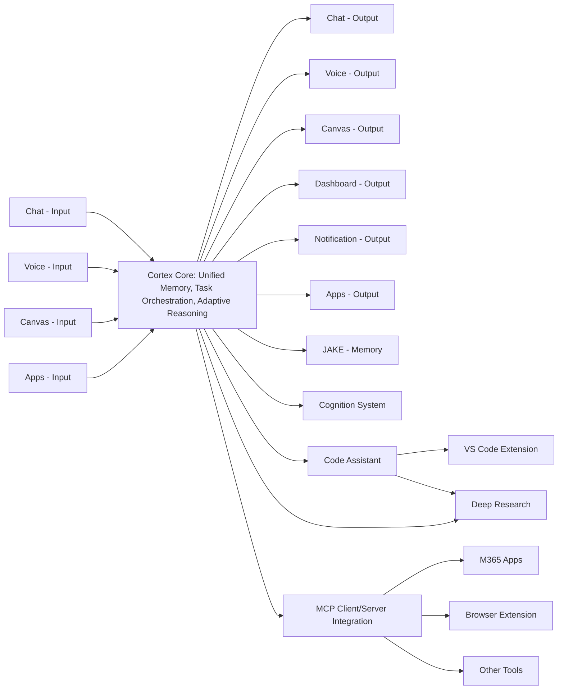
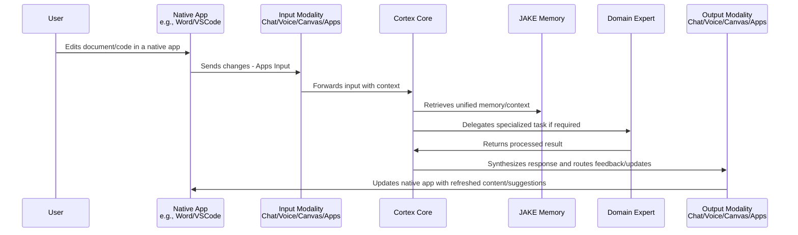
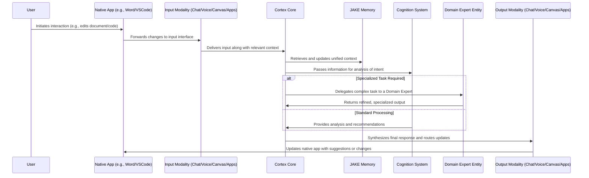
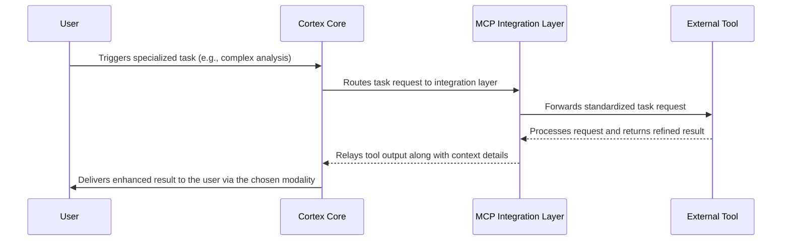

# Cortex Platform: Technical Architecture

_Date: 2025-03-05_

## 1. Introduction

The purpose of this document is to serve as the foundational technical guide for implementing the Cortex Platform. It outlines a stable yet flexible architectural framework that enables our engineering teams to work in parallel on clearly defined interfaces and components. This document is designed to bridge the gap between high-level vision and the hands-on work of development, ensuring that our system’s modularity, adaptive ecosystem, and seamless integrations are faithfully realized.

### Purpose & Scope

This document details the core technical architecture of the Cortex Platform, a system built around a central AI core that drives unified memory management, automated task orchestration, and adaptive reasoning. The architecture leverages a modular design that not only supports our first‐party offerings but also enables third‑party and community-driven integrations. In particular, it specifies the stability and extensibility required for:

- **Modularity and Interoperability:** Defining clear interface contracts between the Cortex Core, its supporting systems (such as JAKE for memory and the Cognition system), and the autonomous Domain Expert entities.
- **Adaptive User Experiences:** Ensuring that every component—from input capture to output delivery—works in concert to empower a seamless, high-quality user experience.
- **Integration with External Services:** Employing the MCP client/server approach as a standard integration layer, while remaining open to custom extensions and evolving protocols as our ecosystem matures.

### Intended Audience

This architecture document is primarily intended for technical leads, architects, and engineers responsible for building, integrating, and evolving the Cortex Platform. However, it is also structured to be accessible to product stakeholders and executives who seek a clear understanding of how our technical strategy supports the overarching vision and user experience.

### Relationship to the Vision & Values Document

This Technical Architecture document builds directly upon the high-level narrative established in our "Cortex Platform: Vision and Values" document. While the Vision & Values document communicates the transformative narrative and strategic priorities—focusing on the adaptive ecosystem, user empowerment, and modularity—this technical guide translates those ideas into concrete, actionable design principles and interface specifications. It establishes the technical grounding that allows all teams to work cohesively towards realizing the vision, ensuring that the core ideas such as the central Cortex Core, the autonomous Domain Experts, and the MCP-based integrations remain the guiding principles throughout development.

## 2. Core Architectural Principles

The technical excellence of the Cortex Platform is built upon a set of core architectural principles that ensure both stability and long-term flexibility. These principles guarantee that as our system evolves, each component can be developed, upgraded, and replaced independently—while always working together to deliver a seamless and adaptive user experience.

### 2.1 Modularity & Extensibility

- **Modular Design:**  
  The Cortex Platform is structured around a central organizing element—the Cortex Core—which is responsible for high-level orchestration, session management, and context preservation. Supporting systems such as the unified memory (JAKE or alternative implementations) and the Cognition system are designed as discrete modules that interface with the Cortex Core. This modularity allows us to:

  - Replace or upgrade individual components independently without disrupting the entire system.
  - Integrate autonomous Domain Expert entities that provide specialized intelligence for tasks like code assistance and deep research.
  - Quickly experiment with new ideas for input/output handling or other operational aspects while ensuring a stable core.

- **Extensibility:**  
  The system architecture is intentionally open for extension. While our initial integration relies on the MCP client/server approach, the architecture is designed to accommodate alternative or additional protocols and custom extensions. This approach ensures our platform can evolve alongside emerging technologies and community contributions, without compromising the core interface contracts.

### 2.2 Unified Interface Contracts

- **Standardized Interactions:**  
  Clear and stable interface contracts between the Cortex Core and its subsystems (memory, cognition, domain experts, input/output modalities, and the integration layer) are fundamental to the design. These interfaces serve as the foundation for parallel development across teams, ensuring that every component communicates in a predictable and reliable manner.
- **Abstraction of Complexity:**  
  By abstracting the underlying complexities of each subsystem behind well-defined, high-level APIs, the architecture decreases interdependency between teams. This separation of concerns allows us to:
  - Shield higher-level system components from low-level implementation details.
  - Rapidly iterate on individual modules while maintaining overall system consistency.
  - Ensure that engineers can confidently implement and test their components in isolation before integrating them into the larger ecosystem.

### 2.3 Adaptive Ecosystem Focused on User Experience

- **User-Centric Adaptability:**  
  At the heart of the Cortex Platform is the goal of empowering users with a seamless, intuitive experience. Our architecture supports adaptive inputs—whether through chat, voice, canvas, dashboards, or notifications—and tailors outputs to the optimal modality for the user’s current context. This is achieved by:
  - Leveraging real-time context and unified memory to support fluid transitions between tasks and devices.
  - Dynamically selecting the most appropriate domain expert or output channel based on the user’s needs and environment.
- **Holistic Experience:**  
  The technical design prioritizes an integrated user experience that is both responsive and consistent, regardless of the point of interaction. Whether a user is initiating a task on a mobile device or engaging in a complex, multi-step process on a desktop workstation, the architecture ensures that every action is informed by a rich, cohesive context.

## 3. High-Level System Overview

The Cortex Platform is designed around a central organizing element—the Cortex Core—that orchestrates interactions between multiple specialized modules and external integrations. This section provides an overarching view of the system's components, their interactions, and the data flow that enables adaptive user experiences.

### 3.1 Component Diagram

Below is a high-level diagram illustrating the major components of the Cortex Platform and their relationships:

### 3.2 Narrative Explanation

The Cortex Platform is structured to efficiently channel user and system inputs into a unified session managed by the Cortex Core. Here’s how the system works in high-level steps:

- **Input Capture:**  
  Users interact with the platform through a variety of modalities, including:

  - **Chat, Voice, and Canvas:** Traditional interfaces for textual, verbal, and graphical inputs.
  - **Apps:** Native applications (such as Word, VSCode, and others) serve as dynamic interfaces. The platform can both read from these apps (e.g., capturing document edits) and write changes back to them (e.g., injecting updated content), ensuring users can continue working in their preferred tools while benefiting from the platform’s intelligence.

- **Core Processing:**  
  At the heart of the architecture is the Cortex Core, which acts as the central orchestrator. It leverages a unified memory system (powered by JAKE or compatible alternatives) to maintain and enrich contextual understanding across all interactions. The Cognition System further enhances this capacity by providing adaptive reasoning, task prioritization, and dynamic planning. Together, these systems enable the Core to determine the best processing pathways for each input.

- **Delegation to Domain Experts:**  
  For tasks requiring specialized intelligence, the Cortex Core delegates processing to autonomous Domain Expert entities. For example:

  - The _Code Assistant_ might debug, refactor, or improve code.
  - The _Deep Research_ module might surface actionable insights from large datasets.  
    These experts operate independently while staying tightly integrated with the Cortex Core, allowing them to refine and iterate results before returning them.

- **Output and Updates:**  
  Once processing is complete, the Cortex Core delivers results and actionable feedback through the most effective output channels. This includes:

  - **Real-time Feedback:** Standard outputs like Chat, Voice, Canvas, Dashboards, and Notifications ensure immediate and tailored responses.
  - **Native App Synchronization:** Updates such as document edits or code changes are automatically propagated to native applications, enabling seamless collaboration between the Cortex Core and the user’s workspace.

- **Integration with External Services:**  
  The platform employs the Model Context Protocol (MCP) as a robust integration layer for non‑user‑facing services. This standard allows the Cortex Core to interface seamlessly with external tools like VSCode extensions, M365 apps, browser extensions, and other connectors. While MCP is the foundation of our current approach, the architecture remains flexible enough to adopt custom or alternative integration protocols as the platform evolves.

### 3.3 Interaction Flow Diagram

The following sequence diagram illustrates a typical user interaction where the user works within a native app (e.g., editing a document in Word or writing code in VSCode). The Cortex Core integrates changes, processes tasks in context, and synchronizes updates back to the application.

## 4. Detailed Component Descriptions

### 4.1 Cortex Core

The Cortex Core is the central organizing engine of the Cortex Platform. It serves as the system’s "brain," responsible for orchestrating all activities across the platform, preserving a unified context, and directing tasks efficiently to both internal modules and external integrations. In essence, the Cortex Core is the pivot around which the entire adaptive ecosystem revolves.

#### Key Responsibilities

- **Task Orchestration:**  
  The Cortex Core mediates and sequences all incoming requests from various input modalities (chat, voice, canvas, native app interactions), ensuring that each task is efficiently routed to the appropriate submodules or Domain Expert entities for specialized processing.

- **Unified Context Management:**  
  Leveraging our unified memory system—initially exemplified by JAKE but designed to support alternatives—the Cortex Core maintains a persistent, enriched context that spans across sessions. This unified context underpins every decision and adjustment, allowing the system to adapt responsively to user needs.

- **Dynamic Decision-Making:**  
  Through its integration with the Cognition System, the Cortex Core engages in adaptive reasoning and planning. It evaluates the current task, determines whether it can be handled directly or must be delegated, and dynamically prioritizes tasks based on real-time context and user intent. This decision-making framework is pivotal in maintaining a balanced workflow across concurrent tasks, adapting in real-time as new user inputs or external events are processed.

- **Routing and Delegation:**  
  The Core acts as a central dispatcher that not only routes incoming data but also delegates specialized tasks to autonomous Domain Expert entities. This delegation ensures that complex, domain-specific challenges—such as code refinement or deep research—are handled with the requisite expertise while the Core remains focused on overall coordination.

- **Workspace & Conversation Management:**  
  Beyond processing tasks, the Cortex Core manages a structured collection of workspaces—each representing a project, topic, or area of engagement. Within each workspace, numerous conversations capture the dynamic interactions between the user and the system. A conversation serves as a modality-specific view of engagement, drawing upon a transformed log of activities that span the entire workspace. This functionality underpins the platform’s user experience by enabling personalized, dynamic interactions that adapt to both the user’s immediate needs and historical context. While synthetic memories (the enriched context) can be leveraged across workspaces, the full raw content is typically restricted to the active workspace. Additionally, the Cortex Core exposes RESTful APIs (and SSE endpoints for realtime updates) that enable user interfaces to create, view, and manage these workspaces and their conversations.

- **Integration Management:**  
  The Cortex Core provides standardized interfaces to external services using a combination of protocols suited for different purposes:

  - **RESTful API Endpoints:** Used for user-facing integrations, these endpoints allow external applications to interact with the platform in a predictable, stateless manner.
  - **Server-Sent Events (SSE):** Employed for realtime messaging scenarios where low latency updates are required.
  - **WebRTC for Realtime Voice:** Ensures high-quality realtime voice interactions.
  - **MCP Transport:** The platform employs the MCP client/server approach via SSE to connect non‑user‑facing services.

  These integration mechanisms ensure that both user-facing services (like native apps) and non-user-facing services (like Domain Experts or external tools) operate in a harmonized manner and remain adaptable to future protocol expansions.

- **Security Management:**  
  Oversees authentication, data encryption, and authorization processes. Initial user authentication is managed via MSAL/AAD locked to our tenant, with future considerations for Azure B2C. This ensures that every interaction—both internal and external—is secured in line with our privacy standards.

#### Internal Subcomponents

To fulfill these responsibilities, the Cortex Core is architected as a composite of high-level subcomponents:

- **Session Manager:**  
  Manages user sessions and the association of sessions with designated workspaces, ensuring continuity and security for each engagement.

- **Dispatcher:**  
  Routes incoming requests to the appropriate processing pathways, whether internally or to Domain Expert entities, and now also directs workspace-related queries to the appropriate handlers.

- **Context Manager:**  
  Interfaces with the unified memory system to retrieve, update, and maintain context. This subcomponent guarantees that every decision is anchored in a thorough understanding of ongoing interactions, including conversation logs within the workspaces.

- **Integration Hub:**  
  Facilitates communications with external integrations by managing MCP client/server interactions (using SSE) and custom extension layers. This hub ensures reliable data flow between the Cortex Platform and external tools or services.

- **Workspace Manager:**  
  (New) Manages the creation, retrieval, and organization of workspaces and their associated conversations. It transforms the raw logs of interactions into modality-specific conversation views and exposes API endpoints for workspace and conversation management. This feature ensures that the Cortex Platform provides users with an adaptive and context-aware experience, making it a core component of enabling seamless engagement across inputs and outputs.

- **Security Manager:**  
  Oversees all security-related functions, including authentication/authorization and data encryption.

#### External Interfaces

The Cortex Core exposes a set of well-defined external interfaces that enable robust integration and parallel development:

- **API Endpoints:**  
  RESTful APIs serve as the primary access points for user-facing integrations, allowing external applications to retrieve context, submit tasks, and manage workspaces. For scenarios requiring realtime updates, SSE is utilized.

- **Realtime Media Handling:**  
  For voice-based interactions, WebRTC is used to manage realtime media streams, ensuring low latency and high quality.

- **MCP Integration Layer:**  
  The platform integrates non‑user‑facing services via the MCP client/server approach using SSE. This standardized protocol layer connects external tools—such as VS Code Extensions, M365 Apps, and Browser Extensions—with the Cortex Core.

- **Modality Abstraction:**  
  A uniform interface abstracts the specific details of various input/output modalities, ensuring consistent handling whether the data originates from chat, voice, canvas, or native applications.

The Cortex Core is designed to be a scalable, adaptive orchestrator that anchors the Cortex Platform’s operations. With responsibilities ranging from task orchestration and unified context management to workspace and conversation handling, the Core provides a robust foundation for both current functionalities and future enhancements. Its well-defined external interfaces and integration mechanisms ensure that the platform remains flexible, secure, and capable of delivering an exceptional user experience.

### 4.2 Memory System (JAKE and Alternatives/Whiteboard Concept)

The Memory System is a fundamental component of the Cortex Platform, responsible for preserving, updating, and synthesizing contextual data across engagements. This system underpins all adaptive interactions by providing each processing module with an enriched and coherent view of the user's ongoing state. Our long-term vision is to deploy a sophisticated memory solution—exemplified by JAKE or other alternatives—that delivers deep semantic context for LLM calls and decision making. In the short term, however, we are implementing a simplified “whiteboard” working memory model as a stand-in. Both approaches are designed to adhere to the same interface contracts and operational responsibilities, ensuring a seamless path from this initial implementation to a more advanced memory system in the future.

#### Key Responsibilities

- **Context Preservation & Synthesis:**  
  Capture both the existing working state and incremental context updates, and merge them to update the memory system to accurately reflects the evolving context. This unified view is used to inform subsequent LLM interactions and guide decision-making processes across the platform.

- **Standardized Access Interface:**  
  Provide a consistent API for all dependent components—such as the Cortex Core and the Cognition System—to retrieve and update the current memory state, regardless of whether the underlying implementation is the initial whiteboard model or a more advanced system like JAKE. This guarantees that all other platform components—including the Cortex Core, Cognition System, and Domain Experts—can function seamlessly, irrespective of whether the underlying memory implementation is the whiteboard model or a fully featured JAKE memory system.

- **Flexibility & Evolvability:**  
  Ensure that the Memory System’s design supports parallel exploration and future enhancement. By isolating memory-related functions behind clearly defined interfaces, the Cortex Platform enables both near-term deployments and concurrent experimentation with advanced memory systems. This approach accelerates platform capabilities while mitigating integration risks.

#### Interface Overview

The Memory System exposes a set of generic interfaces that remain constant across implementations:

- **Input Interface:**  
  Recent context updates that capture new interactions or events requiring integration into the overall memory.

- **Processing & Synthesis Interface:**  
  Merges and processes the provided inputs to produce an updated, coherent memory state. This process is designed to be modular so that the synthesis algorithm can be refined or replaced in future iterations.

- **Output Interface:**  
  Makes the updated memory state available to other platform components via a standardized API. This output serves as a critical input for both LLM calls and for underpinning the adaptive reasoning implemented in the Cognition System.

#### Whiteboard Implementation (Stand-In for JAKE)

For the initial release, the Cortex Platform will utilize a “whiteboard” working memory model as a temporary solution. This implementation is designed to offer immediate functionality while adhering to the generic interface contracts outlined above.

- **Overview:**  
  The whiteboard implementation will capture the raw current context data within a workspace and integrate any recent updates, effectively serving as a live snapshot of ongoing interactions. Although it is a simplified approach, it meets the core requirements for context synthesis needed by other modules.

- **Operation:**

  1. **Data Capture:** The system collects the current “whiteboard” state—a snapshot of active content from user interactions—and any new context updates.
  2. **Synthesis Process:** The inputs are combined, filtered, and processed to resolve redundancies and preserve continuity, resulting in an updated working memory snapshot.
  3. **Availability:** The synthesized output is then exposed through the standardized API to be used in building enriched context for LLM calls and adaptive decision making.

- **Future Transition:**  
  While the whiteboard model provides essential functionality for early stages, it is intended as a placeholder. Our long-term investment will focus on developing and integrating a more robust memory system (e.g., JAKE), whose comprehensive design and capabilities are detailed in separate documentation. The common interface ensures that when this transition occurs, dependent components on the Cortex Platform will continue to operate without disruption.

The Memory System is designed to be flexible and modular—a critical enabler of the Cortex Platform’s adaptive capabilities. The standard interfaces defined here will remain consistent, whether using the immediate whiteboard solution or a future advanced memory system, ensuring seamless integration and scalability across the platform.

### 4.3 Cognition System

The Cognition System is a critical component that empowers the Cortex Platform with adaptive reasoning, intelligent planning, and dynamic decision-making. Building on unity restored by the Memory System and enhanced by real-time inputs mediated through the Cortex Core, the Cognition System transforms raw contextual data into actionable insights. This enables the platform to adjust to user needs with precision and to orchestrate complex tasks in a streamlined fashion.

#### Key Responsibilities

- **Adaptive Reasoning:**  
  The Cognition System analyzes both historical and real-time contextual data to interpret user intent and task complexity. By evaluating the evolving context, it identifies the most appropriate processing pathways, ensuring that user inputs are addressed in a manner that is both responsive and contextually aware.

- **Dynamic Task Planning:**  
  Complex tasks are decomposed into actionable subtasks through an iterative planning process. The Cognition System formulates execution plans that optimize resource allocation and task prioritization. This dynamic framework allows for continuous replanning as new information or feedback becomes available.

  The planning outputs from the Cognition System are tightly integrated with the Cortex Core, enabling real-time adjustments to task delegation and resource prioritization, ensuring that the platform remains responsive to user needs.

- **Decision Support & Prioritization:**  
  Acting in partnership with the Cortex Core, the Cognition System provides refined recommendations to manage concurrent tasks. It applies context-aware heuristics to prioritize urgent tasks while queuing non-critical ones, ensuring that critical work is addressed promptly without overlooking other ongoing requirements.

  By dynamically adjusting task priorities, the Cognition System ensures that critical user actions—such as handling interruptions or switching contexts—are addressed promptly without sacrificing the continuity of ongoing workflows.

- **Self-Reflection & Feedback:**  
  The system integrates self-assessment mechanisms that evaluate the efficiency and quality of its decision-making processes. This feedback loop allows it to refine its strategies over time, ensuring that planning and execution continuously improve in accuracy and responsiveness.

#### Subcomponents and Interfaces

- **Reasoning Engine:**  
  The heart of the Cognition System, the Reasoning Engine synthesizes information from the unified Memory System and current inputs to derive meaningful insights. It forms the basis for understanding user intent and task demands.

  This subcomponent enhances the Cortex Core's ability to interpret high-level user intent and translate it into actionable insights, driving more effective task delegation and task planning.

- **Planning Framework:**  
  Responsible for breaking down high-level tasks into discrete, manageable steps, the Planning Framework orchestrates workflow execution. Its modular design ensures that each subtasks can be independently refined and adjusted as the situation evolves.

- **Self-Reflection Module:**  
  This subcomponent monitors outcomes and measures the performance of planning decisions. By comparing expected and actual results, it identifies discrepancies and recommends corrective adjustments, supporting continuous improvement across the system.

  In addition to improving task execution within the current session, these feedback-driven refinements strengthen the platform’s ability to adapt over time, providing sustained improvements in efficiency and personalization of the user experience.

- **Interface with the Cortex Core:**  
  The Cognition System communicates directly with the Cortex Core by receiving high-level task data and returning actionable plans, prioritization metrics, and recommendations for delegation. Its outputs drive dynamic adjustments in both immediate and long-term operations.

#### Integration with Other Components

The success of the Cognition System relies on tight integration with other core components:

- It leverages the Memory System to access and update a unified, enriched context.
- It collaborates with Domain Expert Entities by suggesting task delegations and evaluating the quality of their outputs.
- Its refined planning and prioritization outputs are routed back to the Cortex Core, ensuring that system-wide decision-making is cohesive and synchronized.

The Cognition System is designed to imbue the Cortex Platform with advanced, adaptive intelligence. By transforming raw data into refined, actionable plans through thoughtful reasoning and dynamic planning, it plays a vital role in ensuring that every interaction optimally supports the user experience.

In addition to supporting the Cortex Core, the Cognition System plays a critical role in guiding Domain Expert Entities by providing high-level instructions that include prioritization and contextual data. These experts, in turn, report results back to the Cognition System, enabling it to assess task outcomes and refine subsequent planning cycles.

The Cognition System’s ability to synthesize outputs from distributed components ensures that each user interaction benefits from coherently integrated, high-quality results.

### 4.4 Domain Expert Entities

Domain Expert Entities are autonomous, specialized modules that empower the Cortex Platform to tackle domain-specific challenges with the precision and depth that dedicated expertise requires. By offloading complex tasks from the Cortex Core to these independent experts, the platform can leverage advanced, plug‑and‑play intelligence without overburdening the central orchestrator.

#### Fundamental Concepts

- **Autonomous Operation:**  
  Each Domain Expert Entity is designed to function independently. When the Cortex Core identifies a task that requires specialized handling—such as code optimization, complex data analysis, or deep research—it delegates the task to the appropriate expert. Once engaged, the expert operates with appropriate autonomy, following a plan–execute–review cycle to complete its assignment.

- **Structured Planning and Execution:**  
  Domain experts receive high-level directives from the Cortex Core and autonomously decompose these into actionable subtasks. They incorporate:

  - **Task Decomposition:** Breaking down complex challenges into manageable steps.
  - **Subprocess Spawning:** Initiating parallel or sequential subprocesses when required by the task.
  - **User Interaction Requests:** Identifying when additional user input is needed and coordinating with the Cortex Core to facilitate guided conversations.
  - **Iterative Refinement:** Evaluating intermediate outcomes and systematically refining their approaches until the result meets predefined quality thresholds.

- **Standardized Interface Contracts:**  
  Each expert adheres to a common integration interface that defines how it receives requests, handles intermediate interactions, and returns results. This standardization ensures that whether an expert is a first‑party offering (like Code Assistant or Deep Research) or a third‑party module contributed by the community, it will operate seamlessly within the overall Cortex ecosystem.  
  The interface typically includes:

  - **Request Reception Interface:** A mechanism for accepting high‑level tasks, including relevant context and parameters.
  - **Execution and Synthesis Interface:** A workflow for processing the task—potentially spawning additional subprocesses—while continuously monitoring and refining its output.
  - **User Interaction Interface:** A protocol for requesting additional information or clarification from the user via the Cortex Core.
  - **Result Delivery Interface:** A consistent method for returning a synthesized, actionable result to the Cortex Core, often accompanied by evaluative annotations or confidence levels.

  The standardized interface not only simplifies integration with the Cortex Core but also empowers third-party developers and community members to create and contribute new Domain Expert Entities. This approach ensures that the ecosystem can continuously evolve with innovative, specialized solutions.

#### Key Responsibilities

- **Expert-Level Processing:**  
  Domain Expert Entities are designed to complement the Cortex Core by handling tasks that require deep subject matter expertise. This may include tasks such as debugging complex code, generating detailed research syntheses, or providing specialized recommendations.  
  While examples like Code Assistant and Deep Research represent initial applications of this paradigm, the framework is universally applicable across diverse domains.

- **Interactive Guidance When Needed:**  
  Despite their autonomous operation, Domain Expert Entities are equipped with the capability to identify scenarios where additional user input would significantly enhance the quality or relevance of outcomes. In these cases, the entity utilizes the Guided Conversation protocol to:

  - Request precise information from the user through the Cortex Core.
  - Frame the request with sufficient context to make the interaction efficient.
  - Resume autonomous execution once the required input is received.

  This capability ensures that experts maintain their efficiency while avoiding incorrect assumptions or proceeding with incomplete information when critical junctures are reached.

- **Self-Evaluation and Feedback:**  
  Each expert incorporates self-assessment routines to evaluate the quality of its work. If the output fails to meet the expected quality threshold, the expert iteratively adjusts its planning and execution process, or—if necessary—escalates the issue back to the Cortex Core for further guidance.

- **Extensibility and Flexibility:**  
  The design of these modules prioritizes modularity; experts can be added, updated, or replaced without impacting the integrity of the core system. This encourages both internal innovation and community contributions, ensuring that the ecosystem can evolve rapidly as new challenges and technologies emerge.

- **Contextual Integration:**  
  Although Domain Expert Entities operate autonomously, they remain tightly integrated with the Cortex Core. They receive detailed contextual input—derived from the unified memory system—and their outputs are fed back into the broader context available to other components. This ensures cohesive operation across the platform, even when multiple experts are engaged simultaneously.

#### User Interaction Protocol

A critical aspect of Domain Expert Entity operation is their ability to request user input when needed, without compromising their overall autonomy. This is implemented through the **Guided Conversation Protocol**:

1. **Identification of Information Needs:**  
   When an expert determines that additional user input is required (e.g., clarifying requirements, choosing between alternatives, or providing domain knowledge), it formulates a precise interaction request.

2. **Request Routing:**  
   The expert sends a structured ASK_USER request to the Cortex Core, containing:

   - The specific information needed
   - Relevant context that explains why the information is required
   - Optional formatting guidance (e.g., multiple choice, free text, etc.)
   - Priority level (urgent vs. can be deferred)

3. **Core Mediation:**  
   The Cortex Core evaluates the request and determines:

   - The optimal timing for presenting the request to the user
   - The most appropriate modality for the interaction (chat, voice, etc.)
   - Whether the information might already exist in memory or could be provided by another entity

4. **User Engagement:**  
   The Core presents the request to the user through the selected modality, potentially enriching it with additional context from the unified memory system to make the interaction more efficient.

5. **Response Handling:**  
   Once the user provides the requested information, the Cortex Core routes it back to the originating Domain Expert Entity, which then resumes its autonomous processing.

6. **Execution Continuation:**  
   The expert incorporates the new information into its planning and execution process, potentially adjusting its approach based on the user's input.

This protocol ensures that Domain Expert Entities maintain their autonomy for most operations while having a clear pathway to engage users when human input would significantly improve outcomes. The Guided Conversation approach minimizes interruptions by ensuring that user interactions are meaningful, contextually relevant, and properly timed.

#### Conceptual Workflow

A high-level view of a Domain Expert Entity's operation within the Cortex Platform might involve the following sequence:

1. **Task Reception:** The Cortex Core identifies a specialized task and forwards the high-level request, together with contextual data.
2. **Autonomous Decomposition:** Upon receipt, the expert decomposes the task into subtasks and initiates its execution plan.
3. **Self-Monitoring and Iteration:** The expert processes the task, evaluates intermediate outputs against quality benchmarks, and performs iterative refinement as needed.
   - If a critical information gap is identified, the expert initiates the Guided Conversation Protocol to request user input.
   - Processing continues once the required information is received.
4. **Result Synthesis:** Once a satisfactory result is obtained, the expert returns the synthesized output, along with any evaluative notes, to the Cortex Core.
5. **Integration:** The Cortex Core integrates the feedback, updating the overall context and moving forward with user interaction or further routing as necessary.

Domain Expert Entities are integral to the Cortex Platform's strategy of distributed intelligence. They empower the system to leverage specialized knowledge in a modular, autonomous manner, ensuring that complex tasks are executed with expert precision while maintaining a flexible, scalable architecture. This approach not only enhances current capabilities but also lays the groundwork for seamless integration of future innovations and community contributions.

### 4.5 Input/Output Modalities

The Cortex Platform is designed to support a diverse range of input and output modalities that provide users with flexible, adaptive, and contextually optimized ways to interact with the system. The modality layer abstracts the unique characteristics of each interaction mode, delivering a consistent interface to the Cortex Core and its underlying components. This ensures that all inputs and outputs are seamlessly processed, regardless of the origin or target modality.

#### Overview of Modalities

The platform supports the following key modalities:

- **Chat:**  
  Enables text-based interactions through instant messaging interfaces, allowing users to issue commands, ask questions, or receive feedback in a conversational format.

- **Voice:**  
  Provides real-time speech-to-text and text-to-speech capabilities. By leveraging WebRTC for realtime voice interactions, users can engage hands-free or in environments where text input is less convenient.

- **Canvas:**  
  Offers a graphical space for visual illustration, sketching, or annotation. This modality supports creative and design-focused workflows by facilitating freeform visual input.

- **Dashboard:**  
  Acts as a dynamic display interface that aggregates and visualizes system data, performance indicators, and critical notifications in real time. Dashboards are particularly powerful for presenting ongoing system analytics or summary information.

- **Notification:**  
  Delivers targeted, concise updates and alerts to the user, tailored to the device and the current user context (e.g., a push notification for critical system updates).

- **Apps (Native Application Integration):**  
  Provides deep integrations with standard productivity or development tools (such as Word, VSCode, and others) to allow users to access Cortex capabilities from within familiar environments. Interactions include reading from native applications (e.g., capturing document edits) and writing updates back to these systems dynamically.

#### Adaptive Handling and Abstraction

The modality layer is engineered to adapt based on real-time context, user preferences, and device capabilities, ensuring that the Cortex Platform seamlessly delivers consistent engagement across all interaction points:

- **Unified Experience Across Platforms and Contexts:**  
  Regardless of the modality a user selects, the Cortex Platform ensures that every interaction feels consistent and responsive. For instance, while starting with a conversation in the chat interface, users can fluently transition to a detailed data visualization on the dashboard or an illustrative sketch on canvas without losing context. These seamless transitions ensure that users engage with the platform in the most natural, effective way for any given task.

- **Context Awareness:**  
  The platform tailors its responses by prioritizing the modalities most suitable for the user’s situation:

  - Delivering notifications to a mobile device when the primary workstation is inactive.
  - Automatically transitioning input/output to a secondary medium when connection or performance limits are detected (e.g., switching to notifications during low bandwidth).

- **Personalized Modality Preferences:**  
  Users can customize their preferred modalities based on task types or personal workflows. Over time, the Cortex Core leverages its memory system to learn these preferences, providing increasingly aligned modality recommendations during recurring tasks.

- **Standardized Modality Interfaces:**  
  All input and output modalities are integrated through a unified set of APIs. This ensures all modality-specific data (e.g., voice-to-text commands and interactive canvas inputs) are transformed into consistent, platform-wide representations for seamless processing by the Cortex Core.

#### Technical Considerations

- **Modality Registry:**  
  A centralized registry maintains a catalog of all available input and output modalities, including configuration details and supported transport protocols (e.g., RESTful APIs, SSE, and WebRTC). This ensures that adding or updating modalities does not disrupt existing functionality, enabling frictionless extensibility.

- **Performance Optimization:**  
  For realtime modalities like voice (WebRTC) and notifications (SSE), the architecture prioritizes low-latency communication with fallback mechanisms. For example, if a realtime connection experiences degradation, a secondary asynchronous protocol is triggered to ensure continued interaction.

- **Cross-Platform Consistency:**  
  The abstraction provided by the modality layer ensures users experience consistent interactions regardless of whether they engage with the system via desktop, mobile, or browser-based tools. Device-specific nuances are abstracted at the modality level, leaving the Cortex Core to focus on unified task orchestration.

- **Protocol Agnosticism:**  
  While the platform currently employs RESTful APIs, SSE, and WebRTC to support the modality layer, the design is protocol-agnostic. This enables future support for emerging standards or entirely custom modality transports without impacting the broader architecture.

The Input/Output Modalities component of the Cortex Platform encapsulates the interfaces through which users interact with the system. By leveraging adaptive, context-aware interactions and delivering a seamless, unified user experience across diverse platforms, the modality layer ensures that Cortex empowers users with effortless collaboration and engagement across all touchpoints.

### 4.6: Integration Layer

#### Key Responsibilities

- **Standardized Connectivity:**  
  Provide a uniform API and communication framework that allows external systems—such as native applications and third‑party services—to interact with the Cortex Core without requiring bespoke integration code for each service.

- **Protocol Flexibility:**  
  Leverage a mix of communication protocols tailored for different needs, ensuring adaptability for current requirements and future evolution:

  - **MCP Client/Server with SSE:**  
    The Cortex Platform employs the MCP client/server approach using Server-Sent Events (SSE) as the transport mechanism for non‑user‑facing services. This standard ensures reliable, event-driven communications across distributed components.
  - **RESTful API Endpoints:**  
    User-facing integrations, such as those connecting with VSCode, Word, or other native applications, are exposed through RESTful APIs to support stateless, standardized interactions.
  - **Realtime Media Protocols:**  
    For use cases like realtime notifications, WebRTC ensures low latency communication (e.g., voice media streams). These protocols are managed through the integration abstraction layer.

- **Future-Proof Extension:**  
  The integration layer explicitly supports extensibility. While MCP forms the foundation of our current approach, the architecture ensures that other protocols, enhanced extensions, or hybrid mechanisms can be integrated seamlessly as the platform evolves.

#### External Integration Points

- **VSCode Extension:**  
  Integration with VSCode provides developers with capabilities such as on-the-fly code assistance, collaborative edits, and contextual suggestions. This connection ensures that changes in VSCode are synchronized in real time with the Cortex Core and, when needed, leverage specialized processing from the Code Assistant.

- **M365 Apps:**  
  Natural integrations with Microsoft 365 applications (Word, PowerPoint, Excel) allow fluid document interaction. For instance:
  - Automated updates from the Cortex Core modify documents inline (e.g., Word), while suggestion metadata supports traceability.
  - Complex analytics generated from inputs in Excel can be synchronized directly with system outputs.
- **Browser Extensions:**  
  Using lightweight browser-based connectors (e.g., Playwright), the Cortex Platform supports dynamic web interactions. For example, integrations enable the system to perform contextual enhancements like autofilling forms or summarizing complex articles during a user’s browsing sessions.

- **Other Tools and Custom Connectors:**  
  The integration layer includes generic extension points to support other third-parties or custom-built connectors specific to organizational needs. These can be developed and maintained independently from the core system while adhering to the standard interface contracts.

#### Interface Contracts & Security

- **Uniform Interface Contracts:**  
  All integration points adhere to consistent and well-defined API contracts. This framework ensures that developers can integrate new tools and services seamlessly while maintaining predictable data flows between the Cortex Core and external systems.

- **User-Facing vs Non‑User‑Facing Differentiation:**  
  API design distinguishes between:

  - **User-Facing Services:** RESTful APIs prioritized for user interaction (e.g., passing task commands from VSCode or receiving analysis-ready data in Word).
  - **Non‑User‑Facing Services:** Handled primarily through the MCP client/server layer with SSE for asynchronous message updates. These are used for backend processes that require data-driven automation without direct user intervention.

- **Security and Authentication:**

  - **Authentication & Authorization:**  
    User authentication is managed through MSAL/AAD accounts locked to our tenant for the initial phase, with future expansions planned for Azure B2C to support external-facing use cases.
  - **Data Encryption:**  
    All communications through the integration layer are encrypted to ensure data confidentiality and integrity.
  - **Access Hierarchies:**  
    The system supports tiered access levels, ensuring that only authorized tools/services can perform sensitive operations (e.g., executing code in VSCode vs synchronizing suggestions in Word).

- **Transport Abstraction:**  
  By abstracting the underlying transport details, the integration layer provides the flexibility to evolve protocols independently of the subsystems they support.

## 5. Data Flows and Interaction Diagrams

The design of the Cortex Platform ensures that data flows fluidly between all its components—from diverse user inputs, through contextual enrichment and adaptive reasoning, to the delivery of tailored outputs. This section illustrates the overall movement of data and interactions, both in general user engagements and in the execution of specialized tasks via external tools.

### 5.1 Primary Interaction Flow

A typical user interaction is a continuous process that seamlessly unites user input, adaptive decision-making, and context-aware outputs. With every step designed to streamline task performance, the Cortex Platform ensures that users receive not just results, but intelligently tailored responses that enhance their focus, minimize disruptions, and accelerate their workflows. This harmony of technical orchestration and user-centric adaptability is the hallmark of the Cortex Platform experience.

The following sequence diagram provides a high-level view of this workflow:

**Narrative Explanation:**

1. **Input Capture:**  
   A user begins by interacting through one of multiple supported modalities—be it chat, voice, canvas, or direct application interfaces such as editing a document in Word or writing code in VSCode. The modality system ensures that input is seamlessly captured regardless of form, adapting the experience to the user’s preferences and environment. For example, a user may choose to dictate tasks via voice input while on a mobile device or visually annotate a design on canvas when brainstorming. This adaptability ensures productive workflows across diverse scenarios.

2. **Contextual Augmentation:**  
   The Cortex Core retrieves active context from the unified Memory System (e.g., JAKE) and consults the Cognition System, which analyzes both the historical and real‑time data to assess user intent.

3. **Task Delegation:**  
   If the task requires specialized processing, the Cortex Core delegates it to an appropriate Domain Expert Entity (for instance, a Code Assistant or Deep Research module). Otherwise, the Cognition System directly informs the Core’s response.

4. **Output Synthesis:**  
   The Cortex Core integrates the analysis and any delegated results, synthesizing a refined output. This output is then delivered via the appropriate output modality. The platform’s intelligent, adaptive processing ensures that users receive timely, relevant feedback while remaining focused in their workflows. Whether applying real-time suggestions to code, surfacing insights in a research session, or streamlining document edits, the Cortex Core ensures that results are seamlessly incorporated into the user’s current tasks, reducing cognitive load and enhancing productivity.

### 5.2 Tool Execution Flow

For tasks that require invoking external computational tools or services—such as advanced code analysis, data queries, or other specialized computations—the Cortex Platform employs a dedicated tool execution flow. The standardized MCP client/server approach (with SSE, RESTful APIs, or WebRTC for realtime needs) ensures a seamless connection between the Cortex Core and external services. The sequence diagram below illustrates this process:

**Narrative Explanation:**

1. **Task Initiation and Routing:**  
   When a specialized task is requested, the Cortex Core recognizes the need for external processing and channels the task via the MCP Integration Layer. This approach standardizes communication for non‑user‑facing services.

2. **External Tool Invocation:**  
   Using established protocols (e.g., SSE for asynchronous updates or RESTful APIs for stateless requests), the MCP Integration Layer forwards the request to the selected external tool or service. This tool may be a VSCode extension, a M365 app, or another custom connector.

3. **Returning the Result:**  
   The external tool processes the task, generating a refined output. This output is delivered back through the MCP layer to the Cortex Core, which then integrates the result while ensuring continuity with the existing context.

4. **User Output Delivery:**  
   The final, combined output is presented to the user through the most appropriate output modality, ensuring continuity and relevance across platforms. Whether the result is delivered as a contextual suggestion in the chat interface, an update to a document in Word, or a clean data visualization on a dashboard, the modality system adapts the delivery to fit the user's device and workflow. This ensures that the user experiences a continuous, tailored engagement without additional effort on their part.
