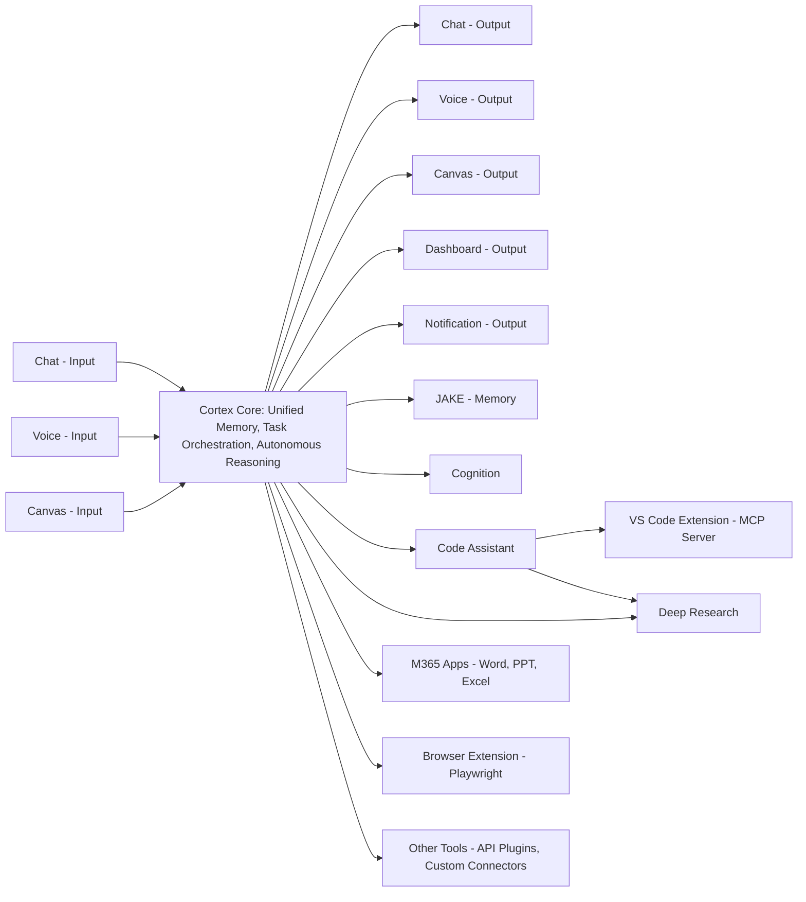
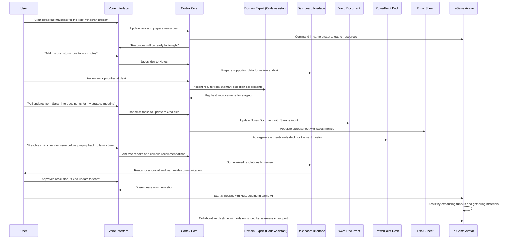

# Cortex Platform: Vision and Values

_Date: 2025-03-05_

## 1. Introduction

The purpose of this document is to encapsulate the high-level vision and core values of the Cortex Platform. It serves as the foundational blueprint that explains our ambitious, modular approach to digital intelligence – a vision that unifies sophisticated AI capabilities with a seamless, user-centric experience. This document is crafted to meet the needs of a diverse audience: from executives and strategic stakeholders who require a clear, inspiring narrative, to internal product and engineering teams who will later translate these overarching concepts into detailed designs and implementations.

### Purpose

- **Articulate the Vision:**  
  This document communicates how Cortex transforms digital interaction by combining a centralized, intelligent core with an adaptive ecosystem of modular, autonomous services.
- **Establish Core Values and Architecture:**  
  We emphasize the importance of a modular design—where key components such as unified memory (via JAKE or alternate systems), task orchestration, and adaptive reasoning interact with specialized domain expert entities. This architecture not only empowers a dynamic user experience but also enables flexible, scalable system evolution.

- **Align Stakeholders and Teams:**  
  By bridging visionary narrative with practical set-points, this document is intended to create a common reference point. Executives and decision-makers receive an inspiring, strategic overview while technical teams gain insight into the stable, high-level interfaces and core design principles that will underpin future development.

### Context

The Cortex Platform is built on the paradigm of a central Cortex Core service with an adaptive ecosystem. At its heart, the platform harnesses unified memory and autonomous task orchestration to deliver intelligent, context-aware assistance across diverse modalities—chat, voice, canvas, dashboards, and notifications. A key element of this vision is the integration of domain expert entities: self-sufficient, specialized modules that can independently manage complex tasks (ranging from coding assistance to deep research) without overwhelming the core system.

In our initial implementation, we employ the Model Context Protocol (MCP) client/server approach to connect our non-user-facing services. This approach not only standardizes communications and integrations within the ecosystem but also lays the groundwork for future enhancements where additional custom extensions can be introduced as needed.

Ultimately, this document lays out a vision that redefines the digital intelligence partnership: one that is agile, modular, and focused on delivering an unparalleled user experience.

## 2. The Vision of Cortex Platform

The Cortex Platform envisions a future where digital intelligence is not confined to isolated applications or rigid workflows, but instead manifests as a unified and adaptive ecosystem. At its core, Cortex is about enabling an intelligent partnership between technology and the user—one that is seamless, context-aware, and naturally intuitive to interact with.

### A Unified Intelligence Experience

Imagine a system that understands your needs regardless of whether you're writing an email, debugging a critical piece of code, brainstorming a creative project, or managing a complex work schedule. Cortex brings together AI capabilities like unified memory, adaptive reasoning, and task orchestration to ensure every interaction reflects an accurate understanding of your past, present, and future needs. The system adapts to your workflow, regardless of whether you're writing, coding, brainstorming, or planning, maintaining context seamlessly across tasks.

### Modularity and Autonomy at Its Core

A cornerstone of our vision is the platform’s modular design. Rather than trying to house every specialized function within one monolithic AI, Cortex uses a modular approach where the central core delegates complex or specialized tasks to dedicated domain expert entities. These entities operate as highly autonomous, expert-level modules—each akin to a consultant or a specialized team in the real world—that can plan, execute, and refine the tasks within their domain. This means that whether it's generating high-quality code, conducting deep research, or providing strategic recommendations, each domain expert delivers its expertise in a plug-and-play fashion, ensuring both depth and flexibility.

The Cortex Core acts as the central orchestrator, ensuring that every action is informed by a rich, continuously updated context. More than just a task router, the core monitors and aligns all components—inputs, outputs, domain expert entities, and external integrations—into a cohesive system. This coordination ensures that user workflows remain uninterrupted, intelligent, and future-proofed by maintaining consistent goals and system-state awareness, even as individual components evolve.

### Empowering Enhanced User Experience

The true value of Cortex lies in the transformative user experience it enables. By combining a robust, centralized intelligence with flexible, autonomous modules, the platform ensures that users enjoy a smooth and adaptive journey. For example, you might start a task via a simple chat interface, receive instant feedback through natural voice responses, and then transition effortlessly to a visual canvas for deeper analysis—all while the system retains full context. This integrated and contextually-aware experience means that tasks are not only completed faster but are also customized to be as intuitive and productive as possible.

### Bringing It All Together

Cortex redefines what it means to interact with artificial intelligence. Instead of a single, fixed-function assistant, our platform is a dynamic, interconnected ecosystem that evolves with your needs. The central Cortex Core ensures that every action is informed by a rich, continuously updated context, while the modular design—bolstered by autonomous domain expert entities—ensures that specialized tasks are executed with expert precision. Initially leveraging the MCP client/server model for integration, Cortex is built with the flexibility to evolve these interfaces as new opportunities and technologies emerge.

This vision is not only about advanced technology—it’s about transforming the digital experience so that intelligence becomes an unobtrusive, empowering partner in every facet of your work and life.

## 3. Modular Architecture & Adaptive Ecosystem

The strength of the Cortex Platform lies in its modular architecture—a design that enables a dynamic and adaptive ecosystem of interconnected services. At its core, Cortex unifies sophisticated AI capabilities (such as unified memory, adaptive reasoning, and task orchestration) while leveraging specialized, autonomous domain expert entities to handle deep, domain-specific tasks. This modular approach not only ensures scalability and flexibility but also empowers a seamless, context-aware user experience across a range of interaction modalities.

### Key Components and Their Roles

- **Cortex Core:**  
  The Cortex Core is the “brain” of the Cortex Platform. It serves as the orchestration engine that manages unified memory, coordinates task execution, and directs the flow of information between components. The core ensures that every user interaction is informed by a continuously updated context and that tasks are efficiently routed to the appropriate modules.

- **Memory System (JAKE):**  
  Our default implementation—JAKE—provides robust memory synthesis by storing and continuously updating user context. Although JAKE is a critical component for unified memory, the Cortex Platform’s design enables seamless substitution or augmentation with alternate memory systems contributed by third-party developers or the community. This ensures the platform remains open to innovation and experimentation while maintaining reliable system integration.

- **Cognition Engine:**  
  This component is responsible for adaptive reasoning and decision-making. By processing user inputs in the context of previously stored information, it ensures that responses are both relevant and tailored to the current situation.

- **Domain Expert Entities:**  
  Acting as specialized, autonomous modules (similar to professional consultants), domain experts such as the Code Assistant and Deep Research modules handle complex, domain-specific tasks. These entities operate independently by planning, executing, and refining their solutions, and can be easily swapped or supplemented by third-party providers—all while interfacing seamlessly with the Cortex Core.

- **Multi-Modal I/O and External Integrations:**  
  Cortex supports diverse input methods (chat, voice, canvas) and output channels (chat, voice, dashboards, notifications) to deliver an intuitive user experience. For non-user-facing integrations, we initially employ an MCP client/server approach. This standardized method simplifies integration with external tools (such as VS Code, M365 apps, and browser extensions) and lays the foundation for future enhancements.

### System Diagram

Below is a high-level diagram that visually represents the core components and their interactions:

### Benefits of a Modular, Adaptive Ecosystem

- **Scalability:**  
  Each component is designed to operate independently. This allows teams to update or replace modules—as with JAKE or any specific domain expert—without disrupting the entire system.

- **Flexibility:**  
  The platform’s modular nature enables a blend of first-party and community-driven enhancements. For example, while MCP is our current choice for external integration, the architecture supports evolving this approach over time.

- **Optimized User Experience:**  
  By delegating specialized tasks to autonomous modules and coordinating adaptive multi-modal outputs, Cortex ensures smooth transitions between different modes of interaction. This results in a user experience that is both seamless and intuitively context-aware.

- **Division of Labor:**  
  The Cortex Core focuses on high-level orchestration and context management, while specialized domain expert entities handle deep, complex tasks. This division of labor increases overall efficiency and allows for rapid innovation across various domains.

## 4. Domain Expert Entities

At the heart of the Cortex Platform’s modular design is the concept of Domain Expert Entities—specialized, autonomous modules that bring deep expertise in a specific field. Just as a business might hire external consultants or specialized firms to handle focused tasks, Cortex leverages these expert entities to offload complex, domain-specific work from the central core. This architecture ensures that the Cortex Core can remain agile and focused on high-level orchestration, while the domain experts deliver deep, specialized intelligence where it’s most needed.

### The Role of Domain Experts

Domain expert entities function as self-contained specialists that:

- **Understand Context Extensively:**  
  Upon receiving a high-level task or query, each expert determines if additional context or data is needed. For example, a research expert might autonomously retrieve background information to fully scope a complex inquiry, while a coding expert pulls in project-specific details before generating or refactoring code.

- **Plan and Execute Autonomously:**  
  These entities decompose complex requests into a structured, step-by-step plan. The planning function involves analysis, task decomposition, and the formulation of an execution strategy tailored to the domain. By managing their plans internally, these experts reduce the need for micromanagement by the central core.

- **Spawn Subprocesses When Necessary:**  
  Complex or multifaceted tasks may require parallel lines of work. Domain experts can dynamically spawn subprocesses to tackle individual subtasks concurrently—similar to how a specialized team would operate—ensuring faster and more robust outcomes.

- **Iteratively Refine Results:**  
  Each domain expert operates in a continuous cycle of execution and self-assessment. After completing a task, the expert evaluates the outcome against predetermined quality and relevance criteria. If the initial result does not meet the desired threshold, the expert iteratively refines its approach until an optimal solution is achieved.

- **Establish Evaluative Benchmarks:**
  Experts also establish evaluative benchmarks for their processes, autonomously deciding when iterations are required to meet predefined thresholds. Only in cases where these thresholds cannot be met do they escalate tasks back to the central core. This ensures a high degree of autonomy while maintaining alignment with overall platform objectives.

- **Evaluate and Communicate Their Outputs:**  
  Rather than simply delivering unfiltered data, experts provide integrated, quality-assured results. They include evaluative commentary and recommendations, ensuring that the central core receives not only a solution but also insight into the rationale behind it.

### Benefits of the Domain Expert Approach

- **Flexibility and Modularity:**  
  Domain experts are designed to be easily added, replaced, or upgraded. Whether implementing our default “first-party” solutions—such as a Code Assistant or Deep Research module—or integrating third-party/community-driven offerings, the system’s modular interfaces ensure compatibility without disrupting the overall architecture.

- **Improved Efficiency:**  
  By delegating deep, specialized tasks to autonomous experts, Cortex offloads intensive cognitive work from the central core. This division of labor results in faster, more precise execution and enables the core to concentrate on coordination and big-picture decision-making.

- **Enhanced User Experience:**  
  With domain experts handling specialty tasks, the Cortex Platform offers users a seamless, high-level experience. Whether the user is asking for complex code generation, deep data analysis, or detailed research synthesis, the system delivers expert-level outputs without requiring the user to switch contexts or interact with multiple systems.

A key strength of the Cortex architecture is its ability to invite community-driven contributions. For example, consider a cooking and recipe domain expert created by a partner. This expert could autonomously recommend meal ideas based on a user’s ingredient list, dietary preferences, and cooking skill level. Such a plug-and-play solution seamlessly integrates into the Cortex ecosystem, drawing from existing user context like calendar events (e.g., dinner party schedules) or shopping lists stored in connected integrations—all without requiring modifications to the Cortex Core.

### Integration with the Central Core

While these entities operate with considerable independence, they remain tightly integrated with the Cortex Core. The core delegates high-level requests to the experts via well-defined interfaces, supplying the necessary context and parameters for execution. Once the task is completed, the expert returns a structured result—including its evaluative remarks and recommendations—which the core then integrates into the broader conversation or workflow.

This separation of concerns—where the core handles orchestration and context management while the domain experts focus on deep, task-specific intelligence—ensures a robust, scalable, and adaptable system design.

## 5. Integration via MCP & Future Flexibility

The Cortex Platform is designed to be an open, adaptive ecosystem where every component can communicate reliably through standardized interfaces. At the heart of our integration strategy lies the Model Context Protocol (MCP) client/server approach—a framework that provides a uniform method for connecting non-user-facing services and external tools to the Cortex Core.

### MCP as the Integration Backbone

- **Standardized Connection Framework:**  
  We have chosen MCP because it allows us to quickly connect various services—whether they are our first-party domain experts or third-party contributions—in a consistent and secure manner. This framework defines standard interfaces, message formats, and transport protocols, ensuring smooth interoperability across different components.

- **Enabling Community Collaboration:**  
  Leveraging MCP is not only a technical choice; it is also a strategic one. By using MCP, we tap into a growing community and ecosystem that is building around standardized integrations. This opens up opportunities for community-driven enhancements and the inclusion of specialized solutions developed externally.

- **Robustness and Security:**  
  Our MCP implementation includes comprehensive mechanisms for authentication, authorization, and error handling. These ensure that every integration point meets our rigorous standards for security and performance without compromising on flexibility.

The MCP framework not only provides a consistent, secure interface for integrating non-user-facing services but also catalyzes collaboration by aligning Cortex with community standards. This fosters the development and inclusion of external contributions, notably within the domain expert ecosystem. Moving forward, the system’s modular interfaces enable seamless evolution of protocols, ensuring that new opportunities and emerging technologies can be incorporated with minimal disruption.

### Future-Proofing through Modular Flexibility

- **Adaptive Integration Interfaces:**  
  While MCP serves as our foundational integration method at launch, our modular design ensures that these interfaces are loosely coupled with the internal workings of the Cortex Core. This means that if more advanced protocols or alternative integration approaches emerge, we can swap or augment the MCP layer without disrupting the rest of the architecture.

- **Custom Extensions and Evolution:**  
  Beyond the standard MCP client/server model, our architecture is built to support custom extensions when needed. This flexibility allows us to tailor the integration strategy for specific use cases or to enhance performance in particular environments. For instance, while our current implementation may use MCP for connecting to VS Code, M365 apps, and browser extensions, future enhancements might include hybrid approaches or enhanced protocols designed for low-latency or high-throughput scenarios.

- **Scalable Ecosystem Integration:**  
  The design of Cortex anticipates that new external tools and domain experts will continue to be developed by both internal teams and third-party partners. As such, our integration strategy is not static; it will evolve as new requirements and technologies emerge. This commitment to continuous evolution ensures that Cortex remains at the forefront of adaptive intelligence integration.

### Bringing It All Together

By adopting the MCP client/server approach as our current standard and building our system with flexibility in mind, Cortex achieves a dual advantage:

- **Immediate Interoperability:**  
  We quickly establish robust, secure connections between internal services and external tools, ensuring that our platform can leverage the full capabilities of our adaptive ecosystem from day one.
- **Future Adaptability:**  
  Our architecture’s modular interfaces mean that we can easily incorporate new integration strategies over time without compromising the stability or consistency of the overall system.

This integration strategy is a core pillar of the Cortex Platform’s success, enabling a seamless exchange of context and capabilities while preserving the freedom to innovate and evolve. As we deploy and refine our system, the MCP framework will serve as the stepping stone toward an ever more connected and adaptive intelligence ecosystem.

## 6. Empowering User Experience

The true strength of the Cortex Platform is that it transforms the digital interaction experience into one that is seamless, adaptive, and deeply personalized. By unifying a sophisticated central core with autonomous, specialized domain experts, Cortex creates an intelligence ecosystem that anticipates your needs and adjusts in real time to your context.

### User-Centric, Adaptive Interactions

Imagine a single platform that doesn’t force you to adapt to its limitations—instead, it adapts to you. Whether you are interacting via text, voice, or even visually through a canvas, Cortex understands your intent through a continuously evolving memory of your needs and prior actions. This leads to a number of key benefits:

- **Seamless Transitions:**  
  As you move from one task to another—or even switch between input modalities—Cortex maintains full context. For instance, you might start a discussion in the chat interface about a project’s progress, transition to voice commands while on the move, and later switch to a visual canvas to sketch out ideas. Each change is fluid and integrated, ensuring you never lose valuable context.

- **Personalized Interaction:**  
  Your preferences are captured and refined over time. Cortex learns your preferred communication style, the types of visualizations that resonate with you, and even specific command patterns you find most effective. This means that every response is not only relevant but tailored to how you naturally work and think.

- **Real-Time Responsiveness:**  
  Fast, adaptive reasoning lets Cortex provide on-the-spot insights. Whether debugging code, summarizing research findings, or generating creative ideas, the platform processes high-level intent while seamlessly incorporating domain-specific expertise. This ensures that you’re always working with solutions that feel both immediate and meticulously considered.

Cortex also excels in fostering collaboration among teams. For instance, during a joint brainstorming session, one user might add ideas via voice input, while another sketches on the canvas. The Cortex Core ensures full contextual integration, empowering team members to simultaneously contribute in their preferred modalities without losing alignment across the shared task.

### A Day in the Life with Cortex

Consider a typical workday empowered by Cortex:

1. **Morning Preparation:**  
   While getting breakfast ready, you chat with Cortex via voice about tonight’s family Minecraft project. “Use the kids’ plan and gather materials for traps and a lava moat.” Cortex queues up resources in-game while you smoothly transition to brainstorming work ideas: “Add this thought to my notes—train the anomaly model with dataset B.” By the time you reach your desk, Cortex has prepared the results from yesterday’s experiments, ready for deeper review.

2. **Effortless Workflows:**  
   At your desk, Cortex helps triage your priorities. Its Code Assistant presents promising results from experiments on your latest intelligence feature, flagging improvements ready for staging. Meanwhile, as you brainstorm verbally about a client strategy, Cortex updates spreadsheets and documents, generates actionable insights, and drafts a client-ready deck—all synchronized for your upcoming meeting.

3. **Streamlined Problem Solving:**  
   After dinner, you get a critical alert about vendor forecasting discrepancies. Cortex swiftly analyzes reports, suggests adjustments to timelines, and drafts an email with clear next steps. With five minutes of review, the issue is resolved—and you return to family time.

4. **Gaming with the Kids:**  
   In Minecraft, Cortex supports as an in-game avatar, handling resource management while you and the kids focus on designing the fortress. “Expand the tunnel to the east gate,” you say, and Cortex handles the routine tasks. The kids laugh as the fortress takes shape, completing a fun, collaborative evening that highlights how effortlessly Cortex enriches your day-to-day life.

### Visualizing the User Journey

The following flow illustrates how the Cortex Platform enables seamless transitions between personal and professional tasks while integrating multi-modal inputs and outputs:

### Conclusion

Cortex empowers users by merging high-level intelligence with adaptive, context-aware interactions. The result is a platform that feels intuitive and responsive—a partner that not only streamlines workflows across various domains but also evolves as your work and preferences change. This integrative approach makes the digital experience holistic, efficient, and deeply personal.

Below is the draft content for Section 7, "Conclusion and Next Steps." This section recaps the key vision points, reinforces the importance of the modular architecture and domain experts, and outlines our plan to dive into technical details with subsequent documents.

## 7. Conclusion and Next Steps

The Cortex Platform represents a bold new direction in digital intelligence—one that unifies complex AI capabilities under a single, adaptive ecosystem. At its heart lies a modular design that balances a powerful Cortex Core with specialized, autonomous domain expert entities. This structure not only enhances efficiency and scalability but also empowers the user through seamless, context-aware interactions across diverse modalities.

### Recap of Our Vision

- **Unified Intelligence:**  
  Cortex brings together a range of AI capabilities—from unified memory and adaptive reasoning to robust task orchestration—to deliver a cohesive and highly personalized user experience.

- **Modularity and Autonomy:**  
  The platform’s modular architecture lets us delegate specialized tasks to dedicated domain experts. These autonomous entities handle complex functions such as coding assistance and comprehensive research, all while integrating seamlessly with the central core.

- **Robust Integration with MCP:**  
  Our use of the MCP client/server approach serves as a standardized method for connecting non-user-facing services and external tools. This approach not only provides immediate interoperability but also ensures that our system remains flexible and future-proof.

- **User-Centric Experience:**  
  By tightly interweaving adaptive inputs and outputs, whether through chat, voice, canvas, or dashboards, Cortex ensures that each interaction is intuitive and enriched by context. This results in a user experience that is both seamless and empowering.

By keeping the focus on transforming the user’s workflows and enhancing productivity through seamless interactions, the Cortex vision provides a unifying narrative. This foundation not only guides technical teams during implementation but also ensures that organizational strategy remains tightly aligned with delivering exceptional user impact.

### Next Steps

This document sets the stage by establishing a high-level vision and core values for the Cortex Platform. Our journey continues with a series of additional documents that will dive deeper into the technical specifications and roadmap for implementation. Upcoming topics include:

- **Technical Architecture Overview:**  
  A detailed look at the stable interfaces and high-level interactions between the core components—providing our internal teams with the essential design foundations.

- **Integration and Domain Experts Roadmap:**  
  A strategic guide outlining how we will integrate domain expert entities and external tools into the Cortex ecosystem, along with planned evolution phases.

- **Detailed Implementation Guides:**  
  Step-by-step documentation to support engineering teams as they translate these high-level concepts into working components and services.

By anchoring all future work to this vision, we ensure that every subsequent design decision, pilot study, or technical implementation remains aligned with our core principles and long-term goals.

The forthcoming roadmap will explicitly outline how the principles of modularity and user-centric design will drive the development of our minimal viable product (MVP) and early iteration phases, ensuring that teams deliver impactful outcomes consistent with this vision.

Cortex isn’t just a platform—it’s the foundation of an adaptive digital intelligence ecosystem designed to evolve with your needs. As we move ahead, our shared vision will continue to guide us, ensuring that every enhancement and integration strengthens the holistic user experience.

---

_This document will serve as our central reference point. Further detailed guides and technical documents will be produced in subsequent phases to support implementation, experimentation, and ongoing refinement._
