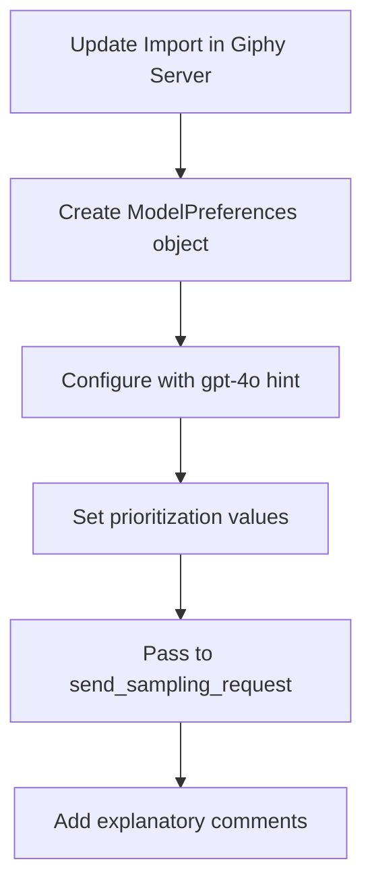

# Model Selection Enhancement Plan

## Overview

This plan outlines how to enhance the model selection capabilities in our assistant by modifying the Giphy MCP server to demonstrate using `ModelPreferences` to select a specific model (gpt-4o).

## Current Understanding

After examining the relevant files, I've found:

1. The `send_sampling_request` function in `mcp_extensions/_sampling.py` already accepts a `model_preferences` parameter
2. The `ModelPreferences` and `ModelHint` classes are defined in the official `mcp.types` module (lines 773-830)
3. The Giphy MCP server's `perform_sampling` function in `mcp_server/sampling.py` doesn't currently use model preferences

## Required Changes



### 1. Update Giphy MCP Server

Modify the `perform_sampling` function in `../mcp-servers/mcp-server-giphy/mcp_server/sampling.py` to:

- Create a ModelPreferences object specifying gpt-4o as the hint
- Set speed priority higher than intelligence priority
- Pass this to send_sampling_request
- Add explanatory comments about model selection

### 2. Code Changes

We'll update the sampling.py file by modifying the send_sampling_request call:

```python
# Import ModelPreferences and ModelHint from mcp.types
# (already imported at line 11, just need to add ModelPreferences and ModelHint)
from mcp.types import ImageContent, ModelHint, ModelPreferences, SamplingMessage, TextContent

# Then in the perform_sampling function, before calling send_sampling_request:
    # Create model preferences to demonstrate selecting gpt-4o
    # This shows how to use the model selection capabilities to prefer a specific model
    model_preferences = ModelPreferences(
        hints=[ModelHint(name="gpt-4o")],  # Hint to prefer gpt-4o
        speedPriority=0.8,                 # High priority on speed
        intelligencePriority=0.2           # Lower priority on intelligence
    )

    # Send sampling request to FastMCP server
    sampling_result = await send_sampling_request(
        fastmcp_server_context=ctx,
        system_prompt=dedent(f"""
            Analyze these images and choose the best choice based on provided context.
            Context: {context}
            Return the url for the chosen image.
        """).strip(),
        messages=messages,
        max_tokens=100,
        model_preferences=model_preferences  # Pass model preferences
    )
```

### 3. Testing Strategy

- Verify the Giphy server successfully creates and passes model preferences
- Confirm through logs that the OpenAI handler selects gpt-4o when available
- Test with and without model preferences to observe the difference

## Implementation Notes

1. We'll use the official `ModelPreferences` and `ModelHint` classes from `mcp.types`
2. The model preferences will explicitly request gpt-4o
3. Priority settings demonstrate preferring speed (0.8) over intelligence (0.2)
4. Detailed comments will explain how this demonstrates model selection
