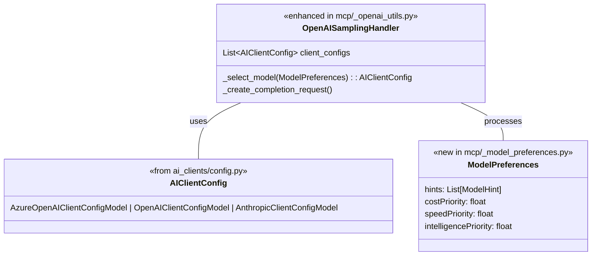

# Model Selection Enhancement

This enhancement adds dynamic model selection capabilities to the assistant, allowing the model to be selected based on user's message content and preferences.

## Key Features Added

1. **ModelPreferences Class**: Created a class to represent user's model selection preferences including:

   - Hints for specific models
   - Priorities for speed vs. intelligence vs. cost

2. **Dynamic Model Selection**: Enhanced `OpenAISamplingHandler` to:

   - Accept model preferences in constructor
   - Use preferences to select the most appropriate model
   - Support both explicit and inferred preferences

3. **Message Content Analysis**: Added logic to extract model preferences from user message contents:
   - Prefix-based selection (e.g., "reason:", "fast:")
   - Keyword-based selection (e.g., "analyze", "explain", "quickly", "simple")

## Usage Examples

### With Prefixes

```
reason: Explain the principles of quantum computing
```

Will select a reasoning model (e.g., GPT-4) for more detailed analysis.

```
fast: Give me a quick summary of today's news
```

Will select a faster model (e.g., GPT-3.5) for speedy responses.

### With Keywords

Messages containing analytical keywords like "analyze", "explain", "complex", or "detail" will prefer more intelligent models.

Messages containing speed-related keywords like "quickly", "simple", "brief", or "short" will prefer faster models.

## Implementation

The implementation replaces the previous hardcoded "reason:" prefix with a more flexible system that:

1. Extracts model preferences from the latest message
2. Configures the sampling handler with these preferences
3. Selects the appropriate model based on these preferences
4. Uses the selected model for completion requests

This provides more flexibility and allows for more natural language requests to control model selection.

# Model Selection Enhancement Plan

## Overview

This document outlines the plan for enhancing the model selection process in the Codespace Assistant to support the new `modelPreferences` feature. This feature will allow clients to express preferences about which model to use for their requests, enabling more intelligent model selection based on priorities and hints.

## Current Implementation

Currently, the system:

- Uses an `OpenAISamplingHandler` to handle sampling requests
- Has two model configurations in `AssistantConfigModel`: generative and reasoning
- Selects models through a temporary hack that checks if the message starts with "reason:"
- Lacks a sophisticated model selection system that can respond to client preferences

## Proposed Solution

We'll enhance the `OpenAISamplingHandler` to accept multiple AI client configurations and implement intelligent model selection based on client preferences.

### Data Structure



### Input Format

The client can specify model preferences using the following JSON structure:

```json
{
  "messages": [...],
  "modelPreferences": {
    "hints": [{
      "name": "string"                // Suggested model name/family
    }],
    "costPriority": number,           // 0-1, importance of minimizing cost
    "speedPriority": number,          // 0-1, importance of low latency
    "intelligencePriority": number    // 0-1, importance of capabilities
  },
  "systemPrompt": "string",
  "includeContext": "none" | "thisServer" | "allServers",
  "temperature": number,
  "maxTokens": number,
  "stopSequences": ["string"],
  "metadata": {}
}
```

## Implementation Details

### 1. ModelPreferences Class

Create a new file `../libraries/python/assistant-extensions/assistant_extensions/mcp/_model_preferences.py`:

```python
from typing import List, Optional
from pydantic import BaseModel, Field

class ModelHint(BaseModel):
    name: Optional[str] = None

class ModelPreferences(BaseModel):
    """
    Model preferences used to guide model selection.

    Attributes:
        hints: List of model name hints to try
        costPriority: Priority for minimizing cost (0-1). None is treated as 0.
        speedPriority: Priority for low latency (0-1). None is treated as 0.
        intelligencePriority: Priority for capabilities (0-1). None is treated as 0.

    Note:
        When comparing priorities, None values are treated as 0. This allows
        setting just one priority (e.g., intelligencePriority=1) to prioritize
        that aspect without having to explicitly set the others to 0.
    """
    hints: Optional[List[ModelHint]] = None
    costPriority: Optional[float] = Field(None, ge=0, le=1)
    speedPriority: Optional[float] = Field(None, ge=0, le=1)
    intelligencePriority: Optional[float] = Field(None, ge=0, le=1)
```

### 2. Enhanced OpenAISamplingHandler

Modify `../libraries/python/assistant-extensions/assistant_extensions/mcp/_openai_utils.py` to accept multiple AI client configurations:

```python
from ..ai_clients.config import AIClientConfig, AzureOpenAIClientConfigModel, OpenAIClientConfigModel, AnthropicClientConfigModel
from ._model_preferences import ModelPreferences, ModelHint

class OpenAISamplingHandler(SamplingHandler):
    def __init__(
        self,
        client_configs: list[AIClientConfig] = None,
        assistant_mcp_tools: list[ChatCompletionToolParam] | None = None,
        message_processor: OpenAIMessageProcessor | None = None,
        handler: MCPSamplingMessageHandler | None = None,
    ) -> None:
        self.client_configs = client_configs or []
        self.assistant_mcp_tools = assistant_mcp_tools

        # Default configs for backward compatibility
        self.service_config = None
        self.request_config = None
        if self.client_configs and len(self.client_configs) > 0:
            self.service_config = self.client_configs[0].service_config
            self.request_config = self.client_configs[0].request_config

        # Rest of initialization...
```

### 3. Model Selection Logic

Add the model selection method to `OpenAISamplingHandler`:

```python
def _select_model(
    self,
    preferences: Optional[ModelPreferences] = None
) -> AIClientConfig:
    """
    Select the appropriate model configuration based on preferences.

    Args:
        preferences: Model preferences to guide selection

    Returns:
        The selected AI client configuration
    """
    # If no preferences or no configs, use the first config
    if not preferences or not self.client_configs:
        return self.client_configs[0] if self.client_configs else None

    # Try to match by hints first
    if preferences.hints:
        for hint in preferences.hints:
            if hint.name:
                for config in self.client_configs:
                    # Check for partial match in model name
                    if hasattr(config.request_config, 'model') and hint.name.lower() in config.request_config.model.lower():
                        return config

    # Match by priorities - treat None as 0
    speed_priority = preferences.speedPriority or 0
    intelligence_priority = preferences.intelligencePriority or 0
    cost_priority = preferences.costPriority or 0

    if speed_priority > intelligence_priority:
        # Speed is more important, find non-reasoning model
        for config in self.client_configs:
            if (hasattr(config.request_config, 'is_reasoning_model') and
                not config.request_config.is_reasoning_model):
                return config

    elif intelligence_priority > speed_priority:
        # Intelligence is more important, find reasoning model
        for config in self.client_configs:
            if (hasattr(config.request_config, 'is_reasoning_model') and
                config.request_config.is_reasoning_model):
                return config

    # If cost is the only priority or highest priority, we could add logic here
    # to select the most cost-effective model (e.g., smaller models)

    # Default to first config if no match
    return self.client_configs[0] if self.client_configs else None
```

### 4. Updated Completion Request Creation

Update the `_create_completion_request` method to use model selection:

```python
async def _create_completion_request(
    self,
    request: CreateMessageRequestParams,
    request_config: OpenAIRequestConfig,  # For backward compatibility
    template_processor: OpenAIMessageProcessor,
) -> dict:
    """Creates a completion request."""

    # Extract model preferences if they exist
    model_preferences = None
    if hasattr(request, 'modelPreferences') and request.modelPreferences:
        try:
            model_preferences = ModelPreferences.model_validate(request.modelPreferences)
        except Exception as e:
            logger.warning(f"Failed to parse modelPreferences: {e}")

    # Select appropriate model configuration
    selected_config = None
    if self.client_configs:
        selected_config = self._select_model(model_preferences)

        if selected_config:
            # Update instance variables for this request
            self.service_config = selected_config.service_config
            self.request_config = selected_config.request_config

    # Use selected config or fall back to the passed request_config
    active_request_config = self.request_config or request_config

    # Rest of the method using active_request_config
    # ...

    # Build the completion arguments
    completion_args: dict = {
        "messages": messages,
        "model": active_request_config.model,
        "tools": tools,
    }

    # Add model-specific parameters
    if hasattr(active_request_config, 'is_reasoning_model') and active_request_config.is_reasoning_model:
        # Configure for reasoning models
        completion_args["max_completion_tokens"] = active_request_config.response_tokens
        if hasattr(active_request_config, 'reasoning_effort'):
            completion_args["reasoning_effort"] = active_request_config.reasoning_effort
    else:
        # Configure for standard models
        completion_args["max_tokens"] = active_request_config.response_tokens

    # ... rest of the method
```

### 5. Update Sampling Handler Usage in Response Module

Update `../assistants/codespace-assistant/assistant/response/response.py`:

```python
# Create sampling handler with all available client configs
sampling_handler = OpenAISamplingHandler(
    client_configs=[
        config.generative_ai_client_config,
        config.reasoning_ai_client_config,
        # More configs can be added here in the future
    ],
)

# Remove the temporary "reason:" hack
# request_type = "reasoning" if message.content.startswith("reason:") else "generative"
```

### 6. Export New Types

Update `../libraries/python/assistant-extensions/assistant_extensions/mcp/__init__.py`:

```python
from ._model_preferences import ModelHint, ModelPreferences
from ._openai_utils import OpenAISamplingHandler, sampling_message_to_chat_completion_message
# ... other imports

__all__ = [
    # ... existing exports
    "ModelHint",
    "ModelPreferences",
    # ... other exports
]
```

## Implementation Steps

1. Create the `_model_preferences.py` file with ModelPreferences and ModelHint classes
2. Update the OpenAISamplingHandler to accept a list of AI client configurations
3. Add model selection logic to the OpenAISamplingHandler
4. Update the completion request creation to use the selected model
5. Modify response.py to provide all available client configurations
6. Update module exports to include the new types

## Expected Behavior

The enhanced model selection will behave as follows:

1. **Default Behavior**: If no model preferences are provided, use the first config (typically generative)
2. **Hint-Based Selection**: If model name hints are provided, select the model that best matches the hints
3. **Priority-Based Selection**:
   - If `speedPriority > intelligencePriority`: Select a non-reasoning model
   - If `intelligencePriority > speedPriority`: Select a reasoning model
4. **Fallback**: If no matching model is found, use the first configuration

## Example Scenarios

1. **Simple Intelligence Priority**: Client sets only `intelligencePriority: 1` → selects reasoning model
2. **Simple Speed Priority**: Client sets only `speedPriority: 1` → selects non-reasoning model
3. **Model Hint**: Client provides `hints: [{ name: "gpt-4" }]` → selects model matching "gpt-4"
4. **Balanced Approach**: Client sets both `speedPriority: 0.5, intelligencePriority: 0.5` → uses comparison logic

## Future Extensions

This architecture will make it easy to:

1. Add more sophisticated model selection strategies
2. Support a wider range of model types
3. Implement partial match/fuzzy matching for model hints
4. Add metrics for model selection decisions
5. Support a configurable list of models per service
