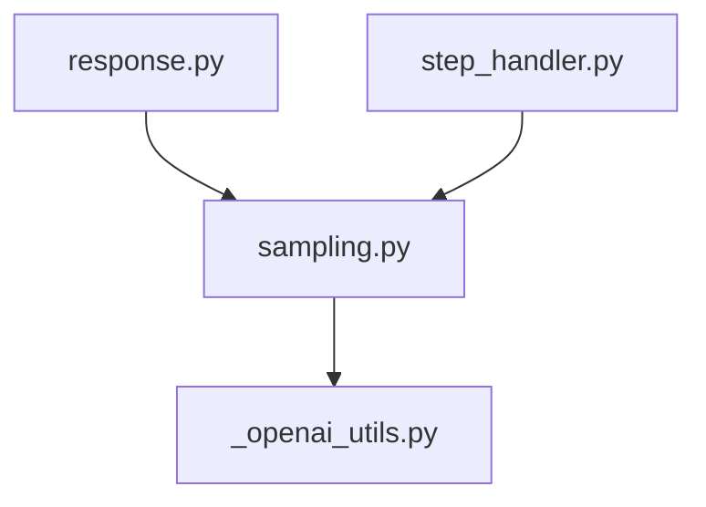
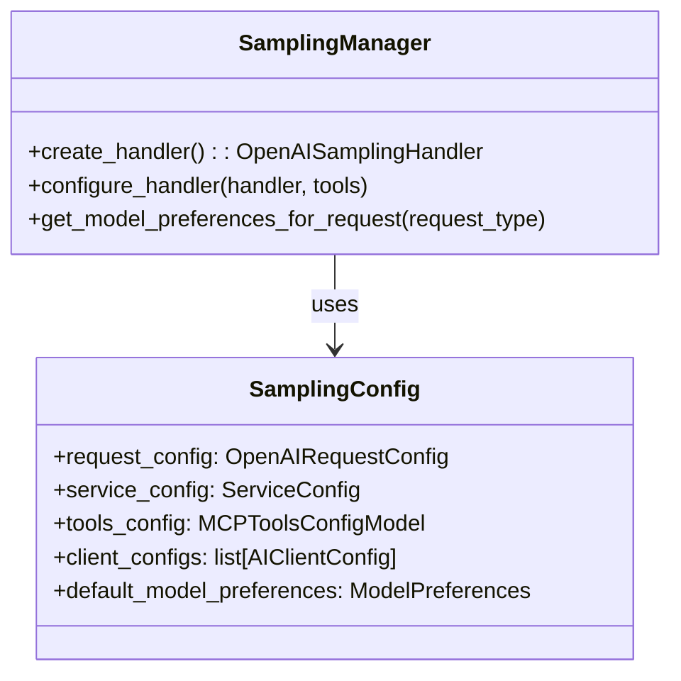

# Sampling Handler Refactoring Plan

## Current Issues

After examining the codebase, I've identified the following challenges in the current implementation:

1. The `OpenAISamplingHandler` initialization and configuration is spread across multiple files:

   - Instantiated in `response.py`
   - Configured later in `step_handler.py`
   - Used in various places throughout the response flow

2. There's a "hacky" approach to handle different model types (e.g., the reasoning model check)

3. Adding new features like model selection requires modifying multiple files

## Proposed Solution

Create a new module `assistant/response/sampling.py` to encapsulate all sampling-related functionality:



### Implementation Plan

1. **Create a new `sampling.py` module with the following components:**



2. **Move sampling-related code:**

   - Move the OpenAISamplingHandler instantiation from `response.py` to `sampling.py`
   - Move the handler configuration code from `step_handler.py` to `sampling.py`
   - Create helper methods to simplify model selection

3. **Simplify API for response handling:**
   - Create clear interfaces for requesting different model types
   - Add support for model selection based on request characteristics
   - Implement methods for dynamic model switching

## Code Structure

### 1. New `sampling.py` Module

```python
from typing import Any, List, Optional

from assistant_extensions.mcp import ModelPreferences, ModelHint, OpenAISamplingHandler
from openai.types.chat import ChatCompletionToolParam
from openai_client import OpenAIRequestConfig, ServiceConfig

from ..config import MCPToolsConfigModel
from ..ai_clients.config import AIClientConfig

class SamplingConfig:
    """Configuration for sampling handlers"""

    def __init__(
        self,
        request_config: Optional[OpenAIRequestConfig] = None,
        service_config: Optional[ServiceConfig] = None,
        tools_config: Optional[MCPToolsConfigModel] = None,
        client_configs: Optional[List[AIClientConfig]] = None,
    ):
        self.request_config = request_config
        self.service_config = service_config
        self.tools_config = tools_config
        self.client_configs = client_configs or []

        # Default model preferences - can be overridden
        self.default_model_preferences = None


class SamplingManager:
    """Manages sampling handlers and their configuration"""

    def __init__(self, config: SamplingConfig):
        self.config = config

    def create_handler(self) -> OpenAISamplingHandler:
        """Create a sampling handler with appropriate configuration"""

        # Create handler with appropriate configs
        handler = OpenAISamplingHandler(
            service_config=self.config.service_config,
            request_config=self.config.request_config,
            client_configs=self.config.client_configs,
            model_preferences=self.config.default_model_preferences,
        )

        return handler

    def configure_handler(
        self,
        handler: OpenAISamplingHandler,
        tools: List[ChatCompletionToolParam]
    ) -> None:
        """Configure a handler with tools"""
        handler.assistant_mcp_tools = tools

    def get_model_preferences_for_request(self, request_type: str) -> ModelPreferences:
        """Get model preferences based on request type"""

        # Create appropriate model preferences based on request type
        if request_type == "reasoning":
            # Prioritize intelligence for reasoning requests
            return ModelPreferences(
                hints=[ModelHint(name="reasoning")],
                intelligencePriority=0.9,
                speedPriority=0.1,
            )
        else:
            # Default to balanced preferences
            return ModelPreferences(
                speedPriority=0.6,
                intelligencePriority=0.4,
            )
```

### 2. Updates to `response.py`

```python
# Import the new module
from .sampling import SamplingConfig, SamplingManager

async def respond_to_conversation(...):
    # Get AI client configurations
    request_config, service_config = get_ai_client_configs(config, request_type)

    # Create sampling configuration
    sampling_config = SamplingConfig(
        request_config=request_config,
        service_config=service_config,
        tools_config=config.extensions_config.tools,
        client_configs=get_available_client_configs(config),
    )

    # Create sampling manager
    sampling_manager = SamplingManager(sampling_config)

    # Get model preferences for this request type
    model_preferences = sampling_manager.get_model_preferences_for_request(request_type)

    # Create handler with appropriate model preferences
    sampling_handler = sampling_manager.create_handler()

    # Rest of the function remains similar...
```

### 3. Updates to `step_handler.py`

```python
# No need to configure the handler directly
# Instead, use the sampling manager

# Before calling next_step, configure the handler with tools
sampling_manager.configure_handler(sampling_handler, tools)

step_result = await next_step(
    sampling_handler=sampling_handler,
    # ... other parameters
)
```

## Benefits of this Approach

1. **Cleaner Separation of Concerns**

   - Sampling handler management is encapsulated in a dedicated module
   - Response handling code focuses on conversation flow

2. **Easier Feature Addition**

   - New model selection features can be added to the SamplingManager
   - The interface remains stable for consumers

3. **Improved Testability**

   - SamplingManager can be tested independently
   - Mock handlers can be provided for testing response flow

4. **Better Configuration Management**
   - Model preferences and configuration are centralized
   - Default configurations can be overridden when needed

## Implementation Considerations

1. This refactoring maintains backward compatibility while providing a cleaner API
2. The SamplingManager pattern allows for future extension without changing the existing code
3. Model selection can be enhanced through the ModelPreferences API
