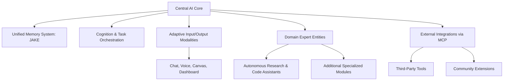

# Cortex Platform: Vision and Values

_Version: 1.0_
_Date: 2025-03-05_

---

## 1. Introduction

The Cortex Platform represents a transformative evolution in digital intelligence—an adaptive ecosystem that seamlessly integrates a centralized AI core with a suite of specialized, autonomous modules. This document outlines the high-level vision and core values that form the foundation of the Cortex Platform, capturing the essential concepts and design principles that will drive both our strategic direction and technical efforts.

### Purpose

The purpose of this document is twofold:

- **For Executives and Stakeholders:**
  To provide a clear, concise narrative of how Cortex will redefine user experiences and digital interactions. By leveraging deep, autonomous domain expert systems along with a modular, adaptive core, Cortex empowers organizations to achieve unprecedented efficiency, scalability, and innovation.

- **For Internal Teams:**
  To establish a foundational reference that specifies the key elements required for our system's design—such as the modular nature of the core, the role of autonomous domain experts, and integration via a robust MCP client/server approach. While the document focuses on the known and required elements at this stage, it sets the stage for deeper technical dives, ensuring that our architecture remains flexible and extensible over time.

This “blessed” version is intentionally high-level; it lays the groundwork for more detailed technical specifications and integration strategies to follow, while remaining accessible to all relevant audiences.

### Context

At its heart, the Cortex Platform is built around a central AI core that is not a monolithic intelligence but rather an agile orchestrator. It leverages a network of domain expert entities—autonomous modules that can understand complex high-level requests, decompose them into structured plans, and execute tasks independently. For example, one expert might dive deep into research and analysis, while another tackles code writing, debugging, and optimization. This delegation not only improves overall efficiency but also ensures that our approach remains lean, scalable, and focused on delivering an exceptional user experience.

Additionally, our initial use of the MCP (Model Context Protocol) client/server approach underpins our integration strategy by establishing standardized connections between non-user-facing services. While MCP is our starting point—helping us leverage existing community momentum—the architecture has been designed to be flexible, allowing for custom extensions or alternative integration strategies as our needs evolve.

In summary, this document introduces the vision and values of the Cortex Platform—a system designed to empower users through seamless, adaptive digital interactions while maintaining an open, modular architecture for ongoing innovation and scalability.

---

## 2. The Vision of Cortex Platform

The Cortex Platform is envisioned as a unified intelligence ecosystem that transforms digital interactions into a seamless, adaptive experience. Rather than relying on isolated, single-purpose AI assistants, Cortex brings together a powerful central AI core and a comprehensive network of specialized, autonomous modules. This modular architecture empowers users to accomplish tasks effortlessly, regardless of the device or context—whether they are working on a complex coding problem, engaging in creative brainstorming, or managing daily tasks.

At its core, Cortex harnesses intelligent memory synthesis and adaptive reasoning to deliver tailored solutions. The central AI core orchestrates every interaction by continuously managing context and seamlessly routing tasks to the most appropriate domain expert entities. These experts act like seasoned consultants, each specializing in distinct fields such as research, software development, design, or content creation. They are designed to operate independently while still integrating their insights into the overall platform, ensuring that specialized knowledge is accessible on demand.

This vision of unified intelligence is driven by a commitment to delivering an exceptional user experience. With Cortex, the boundary between different tools and platforms dissolves. Users enjoy a fluid transition between chat, voice, and visual interfaces—enabling them to focus on their goals rather than on managing disparate systems. For instance, a user could initiate a code review in a text-based conversation and seamlessly switch to a visual canvas to map out a complex system diagram, with the context remaining intact throughout the process.

The adaptability of Cortex is further enhanced by its integration via a robust MCP client/server approach. This approach connects non-user-facing services, allowing for standardized, secure exchanges of data and commands between components. While our current implementation leverages MCP to tap into community-driven innovation, the design remains flexible enough to incorporate alternative methods as our ecosystem evolves.

Below is an overview diagram that illustrates the high-level components of the Cortex Platform and their interactions:

This diagram encapsulates how Cortex integrates all these key elements to create an adaptive ecosystem capable of delivering a truly unified digital experience.

In essence, the vision for Cortex is not just about building an AI assistant—it's about creating a transformative intelligence layer that empowers users by dynamically adapting to their needs, integrating specialized expertise seamlessly, and simplifying complex digital interactions.

---

## 3. Modular Architecture & Adaptive Ecosystem

_Placeholder for Modular Architecture content_

---

## 4. Domain Expert Entities

_Placeholder for Domain Expert Entities content_

---

## 5. Integration via MCP & Future Flexibility

_Placeholder for Integration via MCP content_

---

## 6. Empowering User Experience

_Placeholder for Empowering User Experience content_

---

## 7. Conclusion and Next Steps

_Placeholder for Conclusion and Next Steps content_
