# Cortex Architectural Design Draft (Revised)

*Version: Draft 0.2*

*Date: 2025-03-04*

---

## 1. Overview and Vision

The Cortex platform is envisioned as the core AI service underpinning an adaptive assistant experience. At its heart is a unified AI core that handles memory, reasoning, and task orchestration while interfacing with a modular and composable ecosystem of input/output modalities and domain-specific expert systems.

Key objectives include:

- **Unified AI Core**: Centralized reasoning, memory management, and orchestration.
- **Modular & Composable Ecosystem**: Every component—whether representing memory, cognition, input/output, or domain expertise—is self-contained and swappable. We supply default/reference implementations, but users can effortlessly bring in their own.
- **Adaptive Interaction**: Leverage the best modality based on user context. For example, the system dynamically selects between conventional speech-to-text/text-to-speech pipelines or real-time voice channels (via the OpenAI realtime API) to minimize latency.
- **MCP Integration**: Use the Model Context Protocol (MCP) as the backbone for inter-service communications.
- **Developer Enablement**: Provide lightweight reference implementations (Python for backend services; TypeScript for extensions/front-ends) to empower rapid experimentation, scalability, and contributions.

---

## 2. Design Principles

- **Modular & Composable Ecosystem**
  
  Components are self-contained and interchangeable. While we provide reference options (e.g., a JAKE-inspired memory system), developers or third parties can integrate alternate implementations that suit their needs.

- **Separation of Concerns**
  
  - **Memory System**: Responsible for synthesizing and abstracting critical context from interactions, rather than retaining full raw data histories.
  - **Cognition System**: Handles actions, decision-making, and the orchestration of outputs based on changes in memory.
  - **Domain Expert Systems**: Specialized capabilities (such as Code Assistant, Deep Research, or third-party systems like an Autodesk Fusion expert) that offer advanced, domain-specific intelligence. These are external integrations, allowing our Cortex core to delegate heavy lifting in various specialized areas.

- **Adaptive Interaction**
  
  - **Voice Input/Output**: Two flavors exist for both:
    - Traditional pipelines using speech-to-text for input and text-to-speech for output.
    - Real-time voice communication that streams audio over the OpenAI realtime API, allowing low-latency, continuous interaction.
  - Outputs dynamically adjust—combining concise verbal expressions with detailed visual supplements—to match the user’s active mode of interaction.

- **Interoperability via MCP**
  
  Utilize MCP for standardizing inter-service interactions, resource/tool discovery, and leveraging community-driven components while still allowing for custom protocol layers to be added on top when needed.

- **Rapid Prototyping and Developer-Friendliness**
  
  The platform is engineered to be lightweight and accessible, enabling rapid experimentation on both cloud (Azure-hosted Cortex) and local deployments. GitHub Codespaces support ensures frictionless onboarding for contributors.

---

## 3. Architectural Components

### 3.1. Central AI Core

- **Responsibilities**:
  - Routes and orchestrates memory, cognition, and task execution.
  - Determines the appropriate communication modality (text, voice, visual) based on real-time context and the available I/O channels.
- **Implementation**:
  - Built on FastAPI (Python).
  - Exposes both REST endpoints and an OpenAI-compatible API for drop-in integration.
  - Acts as an MCP hub to interface with external or domain-specific expert systems.

### 3.2. Memory and Cognition Systems

- **Memory System**:
  - Inspired by approaches like JAKE.
  - Synthesizes high-level "memories" rather than storing verbatim histories.
  - Swappable/Composable: the default option can be replaced by alternative systems.
- **Cognition System**:
  - Processes memory changes to generate insights, trigger tasks, and coordinate with other modules.

### 3.3. Input and Output Modalities

- **Inputs**:
  - **Chat Input**: Traditional text-based interactions.
  - **Voice Input (Two Flavors)**:
    - Conventional speech-to-text conversion.
    - Real-time voice streaming using the OpenAI realtime API.
  - **Canvas Input**: Graphical or visual input.

- **Outputs**:
  - **Chat Output**: Text responses.
  - **Voice Output (Two Flavors)**:
    - Text-to-speech conversion.
    - Real-time audio streaming responses.
  - **Canvas Output**: Interactive visual displays.
  - **Dashboard Output**: Rich visualizations for detailed context.
  - **Notification Output**: Alerts and updates across various channels.

### 3.4. Domain Expert Systems & External Tools

- **Domain Expert Systems** (Examples):
  - **Code Assistant**: Specializes in coding tasks, integrating through extensions such as a VS Code MCP server.
  - **Deep Research**: Focused on extensive information retrieval and analysis.
  - **Autodesk Fusion Expert**: A conceptual example representing a domain expert that manages complex interactions with the Autodesk Fusion API, abstracting away lower-level details.

- **External Tools & Integrations**:
  - **VS Code Extension (MCP Server)**
  - **M365 Apps**: Connectors for Microsoft Word, PowerPoint, and Excel.
  - **Browser Extension (Playwright)**: Enables web-based interactions.
  - **Other Tools**: Custom connectors, API plugins, and additional integrations.

### 3.5. Integration with MCP

- **MCP Protocol**:
  - Provides standardized message framing, client-server communication, and tool/resource discovery.
  - Leverages multiple transport mechanisms (e.g., Stdio, HTTP/SSE) and supports custom options as needed.
  - Allows Cortex to interface seamlessly with community-driven MCP servers while being extensible for future protocol enhancements.

### 3.6. Additional Considerations

- **Workspaces (Conceptual)**:
  - A higher-level organizational concept that groups artifacts, conversations, and context by project or team.
- **Adaptive Output Strategy**:
  - Dynamically selects the most effective output formatting based on user context. For example, when on a voice call, the system can streamline verbal responses and supplement them with visual outputs if available.

---

## 4. Mermaid Diagram Representation

Below is the Mermaid diagram representing the current architectural vision:

```mermaid
graph TD
    %% Central Core
    CentralAI[Central AI Core:<br/>Unified Memory, Task Orchestration,<br/>Autonomous Reasoning]

    %% Memory and Cognition Systems
    JAKE[JAKE - Memory]
    Cognition[Cognition]

    %% Inputs
    ChatInput[Chat - Input]
    VoiceInput[Voice - Input<br/>Speech-to-Text]
    RealTimeVoiceInput[Voice - Real-Time Input<br/>Streaming]
    CanvasInput[Canvas - Input]

    %% Outputs
    ChatOutput[Chat - Output]
    VoiceOutput[Voice - Output<br/>Text-to-Speech]
    RealTimeVoiceOutput[Voice - Real-Time Output<br/>Streaming]
    CanvasOutput[Canvas - Output]
    DashboardOutput[Dashboard - Output]
    NotificationOutput[Notification - Output]

    %% Domain Expert Systems
    CodeAssistant[Code Assistant<br/>Domain Expert]
    DeepResearch[Deep Research<br/>Domain Expert]
    FusionExpert[Autodesk Fusion Expert<br/>Domain Expert]

    %% External Tools
    VSCode[VS Code Extension - MCP Server]
    M365Apps[M365 Apps:<br/>Word, PPT, Excel]
    BrowserExt[Browser Extension - Playwright]
    OtherTools[Other Tools:<br/>API Plugins, Custom Connectors]

    %% Connections
    %% Inputs -> Core
    ChatInput --> CentralAI
    VoiceInput --> CentralAI
    RealTimeVoiceInput --> CentralAI
    CanvasInput --> CentralAI

    %% Core -> Outputs
    CentralAI --> ChatOutput
    CentralAI --> VoiceOutput
    CentralAI --> RealTimeVoiceOutput
    CentralAI --> CanvasOutput
    CentralAI --> DashboardOutput
    CentralAI --> NotificationOutput

    %% Core -> Core Systems
    CentralAI --> JAKE
    CentralAI --> Cognition

    %% Core -> Domain Expert Systems
    CentralAI --> CodeAssistant
    CentralAI --> DeepResearch
    CentralAI --> FusionExpert

    %% Domain Expert Systems Relationships
    CodeAssistant --> VSCode
    DeepResearch --> VSCode

    %% Core -> External Tools
    CentralAI --> M365Apps
    CentralAI --> BrowserExt
    CentralAI --> OtherTools
```

---

## 5. APIs and Interfaces

- **REST APIs**: 
  Used for front-end connections (e.g., React/TS + Vite with Fluent Design components) and traditional integration.
  
- **OpenAI-Compatible API Layer**: 
  Enables Cortex to serve as a drop-in replacement for tools expecting OpenAI-style LLM API calls.
  
- **MCP Connectivity**: 
  The backbone for inter-service communications, allowing standardized message exchanges among Cortex and domain expert systems (and other MCP servers).

---

## 6. Development and Deployment Strategy

- **Core Service**:
  - Implement Cortex using FastAPI (Python) with integrated MCP protocol support.
  - Provide REST, OpenAI-compatible, and MCP endpoints for varied client and service interactions.

- **Reference Implementations**:
  - For core modules (Memory, Cognition, and conceptual Workspaces) in Python.
  - Domain expert systems (e.g., Code Assistant, Deep Research, Autodesk Fusion Expert) and external integration examples in TypeScript.
  - Front-end applications built with React/TS using Vite and Fluent Design components.

- **Deployment Options**:
  - **Azure-hosted Cortex** to serve as the central coordination hub.
  - **Local Installations** enabling developers to run Cortex on their own OS/device configurations.
  - **GitHub Codespaces** to facilitate a frictionless, cloud-based development experience.

---

## 7. Roadmap and Next Steps

### Immediate Actions
- **MCP Connectivity**: 
  Finalize integration and APIs by incorporating details from the MCP documentation (e.g., mcp-llms-concepts.txt).
  
- **Core Scaffold**: 
  Set up the Cortex FastAPI service alongside reference stubs for Memory, Cognition, and a placeholder Workspaces module.
  
- **API Endpoints**: 
  Implement REST, OpenAI-compatible, and MCP endpoints.
  
- **Reference Front-End**: 
  Build a basic React/TS interface for testing API connections and adaptive output modalities.

### Future Enhancements
- **Domain Expert Systems Expansion**: 
  Add more domain-specific systems, such as additional industry-focused experts.
  
- **Advanced Adaptive Output Strategies**: 
  Fine-tune output behavior based on real-time context (e.g., blending audio/visual responses on voice calls).
  
- **Enhanced Workspaces Module**: 
  Further develop the conceptual workspaces for organizing artifacts and collaborative contexts.
  
- **Iterative Feedback and Prototyping**: 
  Use early contributions from developers, designers, and PMs to refine and expand the Cortex platform.

---

This document reflects our updated vision regarding dual voice modalities and the reclassification of domain expert systems. It captures the current design direction for the Cortex platform.
